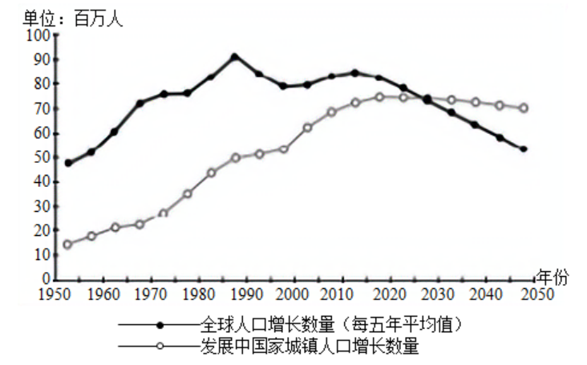
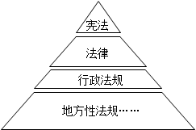

**2022年北京市学业水平等级性考试思想政治试卷**

**注意事项：本试卷共9页，100分。考试时长90分钟。考生务必将答案答在答题卡上，在试卷上作答无效。考试结束后，将本试卷和答题卡一并交回。**

**一、本部分共15题，每题3分，共45分。在每题列出的四个选项中，选出最符合题目要求的一项。**

1\. 百年来，党团结带领全国各族人民绘就了人类发展史上的壮美画卷。党的十八大以来的这十年，以习近平同志为核心的党中央，解决了许多长期想解决而没有解决的难题，办成了许多过去想办而没有办成的大事，推动党和国家事业取得历史性成就、发生历史性变革。下列认识正确的是（ ）

①人民对美好生活的向往是我们党的奋斗目标

②历史性成就的取得表明我国已进入社会主义高级阶段

③全面建成小康社会是改革开放以来党的全部理论和实践的主题

④实践证明了新时代党的一系列原创性的治国理政新理念新思想新战略的科学性

A. ①③ B. ①④ C. ②③ D. ②④

【答案】B

【解析】

【详解】①④：党的十八大以来，在以习近平同志为核心的党中央的坚强领导下，不断为满足了人民对美好生活的向往而奋斗，同时取得了诸多伟大的历史成就，这证明了新时代党的一系列原创性的治国理政新理念新思想新战略的科学性，①④入选。

②：我国仍然处于社会主义初级阶段，这个基本国情没有变，②说法错误。

③：中国特色社会主义改革开放以来党的全部理论和实践的主题，故③说法错误。

故本题选B。

2\. 我国宪法规定，公民有劳动的权利和义务，国家奖励劳动模范和先进工作者。回顾历史，劳模表彰随着党和国家事业的发展而发展。劳模表彰起步于新民主主义革命时期，历经几十年探索与发展，在中国特色社会主义新时代得到发扬光大。开展劳模表彰（ ）

①旨在保障劳动者接受职业技能培训的权利，提高劳动生产效率

②是有效的社会动员方法，也是国家治理中不可或缺的制度安排

③能进一步激励全党全国各族人民积极投身经济社会发展的实践

④可以从根本上解决发展不平衡不充分的问题，实现共同富裕

A. ①③ B. ①④ C. ②③ D. ②④

【答案】C

【解析】

【详解】①：开展劳模表彰目的是树立良好的劳动观念，形成良好的劳动环境，这与保障劳动者接受职业技能培训的权利没有直接必然关系，①排除。

②③：开展劳模表彰意在发挥榜样引领示范激励作用，这是有效的社会动员方法，也是国家治理中不可或缺的制度安排，能进一步激励全党全国各族人民积极投身经济社会发展的实践，②③正确。

④：“从根本上解决发展不平衡不充分的问题”夸大了开展劳模表彰活动的作用，④排除。

故本题选C。

3\. 一百年来，中国共青团始终与党同心、跟党奋斗，团结带领广大团员青年把忠诚书写在党和人民事业中，把青春播撒在民族复兴的征程上，把光荣镌刻在历史行进的史册里。

<table style="width:100%;">
<colgroup>
<col style="width: 99%" />
</colgroup>
<tbody>
<tr>
<td style="text-align: center;">
时代各有不同 青春一脉相承

国家兴亡，匹夫有责。只有走十月革命的路，才能救中国!

——共青团创始人之一张太雷表达的心声

把青春献给祖国!

——社会主义革命和建设时期，广大团员青年喊出的响亮口号

团结起来，振兴中华!

——改革开放和社会主义现代化建设新时期，广大团员青年发出的时代强音

请党放心，强国有我!

——在庆祝中国共产党成立100周年大会上，共青团员、少先队员代表响亮喊出的

青春誓言
</td>
</tr>
</tbody>
</table>

共青团的百年征程表明（ ）

①为中华民族伟大复兴而奋斗是中国青年运动的主题

②共青团作为青年运动的先锋队，引领中国思想文化的发展方向

③党有号召、团有行动始终是一代代共青团员的政治信念

④奋斗是一场历史接力赛，精神传承是推动社会历史进步的根本动力

A. ①③ B. ①② C. ②④ D. ②③

【答案】A

【解析】

【详解】①③：从共青团创始人的心声，到庆祝中国共产党100周年大会，都始终围绕着为中华民族伟大复兴而奋斗的主题，一代代青年人不断的奋斗，坚定信念，党有号召、团有行动始终是一代代共青团员的政治信念，①③入选。

②：共青团是青年运动先锋队，但是并不能引领中国思想文化的发展方向，在思想文化领域我们应该坚持马克思主义的指导，②不选。

④：社会基本矛盾运动是推动社会历史进步的根本动力，④不选。

故本题选A。

4\. “过去未来皆遥相呼应。这就是过去未来皆是现在的道理。这就是‘今’最可宝贵的道理。”对此话理解最贴切的是（ ）

A. 过去和未来都是现在的表象

B. 现在的努力，是激活历史和创造未来的关键

C. 过去现在未来时时流转是社会历史发展的规律

D. 过去未来与现在共处于时间的统一体中，没有界限

【答案】B

【解析】

【详解】A：事物是发展变化的，过去是现在之前，未来是现在之后，认为二者都是现在的表象的说法是错误的，A排除。

B：“过去未来皆遥相呼应。这就是过去未来皆是现在的道理。这就是‘今’最可宝贵的道理”表明现在连接着过去和未来，现在的努力，是激活历史和创造未来的关键，B符合题意。

C：生产关系适应生产力、上层建筑适应经济基础的规律是社会历史发展的规律，C错误。

D：在宏观世界之中，过去、现在和未来是有着明确的界限的，此时此刻就是现在，而在此之前就是过去，在此之后则是未来，D错误。

故本题选B。

5\. 北京2022年冬奥会、冬残奥会从筹办之初就开始全面规划管理冬奥遗产。2017年9月，北京冬奥组委就在总体策划部单独设立遗产管理处。此后，遗产协调工作委员会成立，遗产战略计划发布，第一份遗产报告发布……。遗产理念始终贯穿于北京冬奥会、冬残奥会的筹办过程。下列选项正确的是（ ）

①只有实践才可以把遗产理念变为现实的存在

②利用超前思维，能够合理规划冬奥遗产的利用

③遗产理念和遗产利用既相互联系又相互区别，体现了共性与个性的统一

④应当树立全局观念，让冬奥筹办全过程都服从和服务于冬奥遗产的利用

A. ①② B. ①③ C. ②④ D. ③④

【答案】A

【解析】

【详解】①②：北京2022年冬奥会、冬残奥会从筹办之初就开始全面规划管理冬奥遗产，这表明利用超前思维，可以合理的利用冬奥遗产，同时遗产理念的实现，需要经过实践，①②入选。

③：遗产的利用，是在遗产理念的指导下进行的，二者是理论与实践的关系，不是共性与个性的统一，③不选。

④：应当树立全局观念，冬奥遗产的利用是冬奥会筹办的组成部分，要服从和服务于冬奥会的大局，④不选。

故本题选A。

6\. “银锭观山”是“燕京小八景”之一，曾是老城内展现山水城相融的景观。后来一些高层建筑出现在银锭观山的景观视廊内，连绵起伏的西山山脊线被“截”成了两段。《北京城市总体规划（2016年—2035年）》明确提出恢复银锭观山景观视廊。2021年，相关建筑拆除后，银锭观山美景再现。这说明（ ）

A. 城市记忆是人们的精神故乡，应尊重社会意识的独立性

B. 完整恢复老城美景是重塑城市空间秩序的首要价值选择

C. 抓住主要矛盾，统筹规划，可以恢复自在事物的联系

D. 坚持用联系的观点看问题，才能实现山水城和谐相融

【答案】D

【解析】

【详解】A：社会存在决定社会意识，社会意识具有相对独立性，而不是独立性，A不选。

B：重塑城市空间秩序，应坚持以人为本、积极保护的价值取向，要注重保护和恢复老城美景的精华，更把群众利益放在优先位置，在保护历史文化底蕴的同时改善人居环境，B不选。

C：自在事物的联系是客观的，是不以人的意志为转移的，C不选。

D：一些高层建筑出现在银锭观山的景观视廊内，影响了银锭观山景观视廊。拆除高层建筑，再现银锭观山美景，这说明坚持用联系的观点看问题，才能实现山水城和谐相融，D入选。

故本题选D。

7\. “你读过的课文中哪一篇给你留下了深刻的印象？”某论坛的这一话题，吸引了数万人参与讨论。下面是不同年龄的人分享重温课文的感受：重温课文（ ）

<table style="width:100%;">
<colgroup>
<col style="width: 99%" />
</colgroup>
<tbody>
<tr>
<td style="text-align: left;">
甲：我记得诱人高邮威鸭蛋，“筷子头一扎下去，吱——红油就冒出来了”。

乙：《匆匆》让我开始知道要珍惜时间,不能让时间白白流逝。

丙：十几岁的日子和思想很简单，其实当年并没有完全读懂《我与地坛》的深意。

丁：学《记承天寺夜游》时也有清凉月夜，但不懂得知己难遇，不懂得能在夜半时分找到人“相与步于中庭”的可贵。
</td>
</tr>
</tbody>
</table>

①可以唤醒人们的文化记忆，丰富精神世界

②获得的是理性认识，有助于实现认识的飞跃

③让历经岁月洗礼的人们对课文内容的理解更深刻

④让不同年龄的人思昔抚今，形成对当下生活的共同认知

A. ①③ B. ①④ C. ②③ D. ②④

【答案】A

【解析】

【详解】①③：不同年龄的人，重温课文，有利于可以唤醒人们的文化记忆，丰富精神世界，同时随着阅历的增加，也让人们对课本的理解更加深刻，①③入选。

②：不同年龄的人，从课本中得到的是感性认识，是认识的初级阶段，可以发展到理性认识阶段，实现认识的飞跃，②不选。

④：不同年龄的人分享重温课文的感受，可以让不同年龄的人思昔抚今，但是不同年龄的人对当下生活有不同的认知，④不选。

故本题选A。

8\. “飞花令是古人发明的酒令游戏，源自文人的诗词之趣，经过现代改良后进入我们的日常生活。一些精巧高雅的诗词游戏仍是祖先留给我们的宝贵精神遗产。”在这段话里，下列四个选项中周延性与其他三个不同的是（ ）

<table style="width:100%;">
<colgroup>
<col style="width: 99%" />
</colgroup>
<tbody>
<tr>
<td style="text-align: center;">
“东风随春归，发我枝上花。”

“江南春山远，山下暮云长。”

“人闲桂花落，夜静春山空。”

这种每句都包含同一个字（例如“春”）的诗词游戏被称为“飞花令”，得名于唐代名句“春城无处不飞花”。
</td>
</tr>
</tbody>
</table>

A. 飞花令 B. 古人发明的酒令游戏

C. 精巧高雅的诗词游戏 D. 祖先留给我们的宝贵精神遗产

【答案】A

【解析】

【详解】A：飞花令是古人发明的酒令游戏，这个判断是主项是单称，断定了飞花令全部对象，是周延的，A入选。

B：飞花令是古人发明的酒令游戏，是单称肯定判断，作为谓项的古人发明的酒令游戏，其联项是肯定的，没有对古人发明的酒令游戏的全部外延做断定，是不周延的，B不选。

C：精巧高雅的诗词游戏，其量项是一些，并没有对其全部做判断，是不周延的，C不选。

D：祖先留给我们的宝贵精神遗产，作为判断的谓项，其联项是肯定是，没有对其全部范围做断定，是不周延的，D不选。

故本题选A。

9\. 2021年11月15日，北京证券交易所正式开市。北京证券交易所是经国务院批准设立的我国第一家公司制证券交易所，受中国证监会监督管理，与上海证券交易所、深圳证券交易所共同服务于我国经济发展。基于上述背景，在我国（ ）

①所有的证券交易所都是经政府批准设立的机构

②所有的证券交易所都受中国证监会监督管理

③有些经政府批准设立的机构受中国证监会监督管理

④有些经政府批准设立机构是证券交易所

从以上四个判断中选取三个，依次作为大前提、小前提、结论，下列选项中符合三段论推理规则的是

A. ①-③-④ B. ②-①-③ C. ③-②-④ D. ④-②-①

【答案】B

【解析】

【详解】A：如果①作为大前提，③作为小前提，无法必然的推出④，因为在前提和结论中，小项“政府批准设立的机构”只出现了一次，多出了“受中国证监会监督管理”这一项，犯了“四概念”错误，A不选。

B：②作为大前提，①作为小前提，可以必然的推出③，这符合三段论的结构，也符合三段论的推理规则，B入选。

C：如果③作为大前提，②作为小前提，无法必然得出结论④，因为作为中项的受中国证监会监督管理是不周延的，C不选。

D：如果①作为结论，那么其小项是证券交易所，但是④和②作为前提的话，中项也是证券交易所，这不符合三段论的规则，所以④、②作为前提，无法推出①，D不选。

故本题选B。

促进充分就业，提升就业质量，既关系到国家经济增长，又关系到个人和家庭的幸福。回答下面小题。

10\. 促进公平就业、减少人力资本提升的障碍，可以让更多人根据自身比较优势选择职业，从而提升经济效率，促进经济增长。下列做法符合上述原理的是（ ）

①征收个人所得税，调节个人收入分配

②为外来务工人员提供均等化的公共服务

③发展多种层次和形式的职业教育，推进多元办学

④提高进口产品关税，保护本国相关产业工人的就业机会

A. ①③ B. ①④ C. ②③ D. ②④

11\. 确定和调整最低工资标准是政府调节收入分配的政策之一。最低工资标准的有效执行能提高低收入者的工资水平，缩小收入差距，同时也会影响企业用工成本和社会就业状况。当最低工资标准提高时，企业的下列应对方法将导致社会就业减少的是（   ）

A. 提高产品价格，抵消用工成本的增加

B. 开拓国际市场，使出口利润高于用工成本增加额

C. 调整生产布局，将低附加值产品生产转移至国外

D. 提高管理水平，用节省的运营成本补偿用工成本增加

【答案】10. C 11. C

【解析】

【10题详解】

①：征收个人所得税，有利于调节个人收入分配，但是与促进公平就业，减少人力资本提升的障碍没有关系，①不选。

②：为外来务工人员提供均等化的公共服务，有利于促进公平就业，吸引更多的劳动者，②入选。

③：开展多种层次和形式的职业教育，推进多元办学，有利于提高劳动者的工作技能和个人素质，提升经济效率，促进经济增长，③入选。

④：我国坚持对外开放，不能通过提高关税的方式来保护本国相关产业，④不选。

故本题选C。

【11题详解】

A：提高产品的价格，会影响产品的消费，但是不会直接造成社会就业减少，A不选。

B：开拓国际市场，推动产品走出去，有利于抵消成本的增长，并且不会对就业产生直接性的影响，B不选。

C：调整生产布局，将低附加值产品生产转移至国外，会导致国内企业减少用工，导致社会就业减少，C入选。

D：企业提高管理水平，用节省的运营成本补偿用工成本增加，不会对就业产生直接性影响，D不选。

故本题选C。

12\. 《关于为盲人、视力障碍者或其他印刷品阅读障碍者获得已出版作品提供便利的马拉喀什条约》由联合国专门机构世界知识产权组织进行管理，条约要求各缔约方规定版权限制与例外，为阅读障碍者提供便利。我国积极参与了条约的谈判过程，是首批签署方之一。2021年10月，全国人大常委会批准了该条约。目前，条约已对我国生效。就上述事实，下列说法正确的是（ ）

A. 世界知识产权组织对该条约的管理是联合国维护世界和平作用的体现

B. 我国签署和批准该条约的主要目的是为了繁荣国际知识产权贸易

C. 该条约的生效有利于保障阅读障碍者平等欣赏作品和接受教育的权利

D. 全国人大常委会批准该条约是对监督权的行使，推动了无障碍环境建设

【答案】C

【解析】

【详解】A：世界知识产权组织对该条约的管理，是为了便利阅读障碍者，并没有体现联合国维护世界和平作用，A不选。

B：我国签署和批准该条约的主要目的是为了方便我国的阅读障碍者，为其阅读提供便利，B不选。

C：该《条约》要求各缔约方规定版权限制与例外，为阅读障碍者提供便利，有利于保障阅读障碍者平等欣赏作品和接受教育的权利，C入选。

D：我国人大常委会批准该条约是行使立法权的表现，D不选。

故本题选C。

13\. 大数据时代，个人信息安全问题日益凸显，个人信息保护法的制定是对这一问题的积极回应。下面是该法的部分条文：

|                                                                |                                                                                  |
|:-------------------------------------------------------------- |:-------------------------------------------------------------------------------- |
| 第69条第1款:“处理个人信息侵害个人信怠权益造成损害，个人信怠处理者不能证明自己没有过错的，应当承担损害赔偿等侵权责任。” | 第70条:“个人信息处理者违反本法规定处理个人信息，侵害众多个人的权益的，人民检察院、法律规定的消费者组织和由国家网信部门确定的组织可以依法向人民法院提起诉讼。 |

根据上述条文，下列说法正确的是（ ）

A. 个人信息处理者侵权的，承担无过错侵权责任

B. 个人信息处理者侵权的，在民事上仅承担损害赔偿责任

C. 个人信息处理者侵权的，均可适用第70条的规定

D. 发生第70条规定情形的，该条规定的机构和组织有提起诉讼的职责

【答案】D

【解析】

【详解】A：根据第69条第1款，个人信息处理者侵权的，如果不能证明自己没有过错，应该承担损害赔偿侵权责任，这是过错推定，而不是无过错侵权，A不选。

B：个人信息处理者侵权的，在民事不仅承担损害赔偿责任，而是要根据具体的侵权程度和造成的影响，承担停止侵害，赔礼道歉、恢复名誉等，B不选。

C：第70条仅仅是针对侵害众多个人权益的行为，没有对侵犯单个人信息行为的做出法律规定，C不选。

D：发生第70条规定情形，侵犯众多个人权益的，人民检察院有提起诉讼的职责，而不是该条规定的机构和组织，D入选。

故本题选D。

14\. 某绘画比赛主办方赛前承诺奖励一等奖获得者1万元。7周岁的小学生甲获得一等奖。一公司看上了甲的获奖作品，提出要以2万元买下，作为公司的商标图案。甲的父母知道后，明确表示不同意出售。就上述事实，下列说法正确的是（ ）

A. 甲是限制民事行为能力人，对获奖作品享有著作权

B. 甲是无民事行为能力人，对获奖作品享有商标权

C. 在主办方支付奖金前，甲对1万元奖金享有所有权

D. 甲的父母有权拒绝该公司以2万元的价格购买获奖作品的要约

【答案】D

【解析】

【详解】A：限制民事行为能力人是八周岁以上的未成年人，材料中，甲7周岁，是无民事行为能力人，而不是限制民事行为能力人，A错误。

B：商标是经营者用来将自己的商品或者服务与其他经营者的商品或者服务相区别的标记，材料中，甲是无民事行为能力人，对获奖作品享有著作权，而不是享有商标权，B错误。

C：奖金作为一种孳息与原物所有权也一并转移，在主办方支付奖金前，甲对1万元奖金没有所有权，C错误。

D：八周岁以上的未成年人为限制民事行为能力人，实施民事法律行为由其法定代理人代理或者经其法定代理人同意、追认；但是，可以独立实施纯获利益的民事法律行为或者与其年龄、智力相适应的民事法律行为，材料中，甲的父母有权拒绝该公司以2万元的价格购买获奖作品的要约，D正确。

故本题选D。

15\. 城镇化是当今世界发展的重要趋势之一，高质量的城镇化是经济增长的重要动力。根据联合国经济和社会事务部在《世界城镇化展望（2018）》中的估算和预测，1950—2050年全球及发展中国家的人口变动情况如右图所示。材料表明（ ）

①人口是国家最重要的基本要素，人口数量影响一个国家的经济增长

②2025—2030年，全球人口增长几乎全部来自发展中国家的城镇人口增长

③2030—2050年，发展中国家城镇人口增长数量将高于全球人口增长数量

④发展中国家推进高质量的城镇化对全球可持续发展至关重要

A. ①② B. ①③ C. ②④ D. ③④

【答案】D

【解析】

【详解】①：主权是国家最重要的基本要素，故①说法错误。

②：图示显示2030—2050年，发展中国家城镇人口增长数量将高于全球人口增长数量，但这并不意味着“2025—2030年，全球人口增长几乎全部来自发展中国家的城镇人口增长”，②错误。

③：图示显示2030—2050年，发展中国家城镇人口增长数量曲线高于全球人口增长数量，这说明图示显示2030—2050年，发展中国家城镇人口增长数量将高于全球人口增长数量，③符合题意。

④：城镇化是当今世界发展的重要趋势之一，高质量的城镇化是经济增长的重要动力，而图示显示2030—2050年，发展中国家城镇人口增长数量将高于全球人口增长数量，2030年以前刚好相反，这说明发展中国家推进高质量的城镇化对全球可持续发展至关重要，④符合题意。

故本题选D。

**二、本部分共6题，共55分。**

16\. 今天，很多创作已不在纸上进行。然而，打印出来的文字，很难像手稿那样展现作者的笔底波澜。手稿是时间的证物，也是文化的传递，一些手稿还兼具学术价值和收藏价值。即使在数字时代，手稿依然有生命力。

运用《哲学与文化》知识，谈谈你对“手稿依然有生命力”的理解。

【答案】可从文化的功能，文化的继承与发展，联系，认识的发展等角度回答。

|      |                                               |
|:---- |:--------------------------------------------- |
| 等级水平 | 等级描述                                          |
| 水平4  | 观点鲜明，能明确表达自己的见解；紧扣问题，综合运用所学知识展开论述；逻辑严密，条理清晰。  |
| 水平3  | 观点比较明确，能表达自己的见解:能扣住问题展开论述，知识运用比较准确；逻辑性较强，有条理。 |
| 水平2  | 观点不明确；论述不能集中指向问题，罗列知识;知识运用不正确；论述缺乏逻辑，条理性差。    |
| 水平1  | 应答与试题无关；或重复试题内容；或没有应答。                        |

【解析】

【分析】背景素材：手稿与打印稿

考点考查：文化传承与文化创新、把握世界的规律、探索认识的奥秘的有关知识

能力考查：获取和解读信息，调动和运用知识，描述和阐述事物

核心素养：政治认同、科学精神、法治意识

【详解】第一步：审设问，明确主体、作答范围、问题限定和作答角度。本题为理解型主观题，侧重于“是什么”、“为什么”、“怎么样”，可从文化的功能、文化的继承与发展、联系、认识的发展等知识，谈谈自己对“手稿依然有生命力”的理解。

第二步：审材料，提取关键词，链接教材知识。

关键词①：手稿是时间的证物，也是文化的传递，一些手稿还兼具学术价值和收藏价值，强调的是手稿的作用，可联系文化传承与文化创新，可从文化的功能、文化的继承与发展的角度分析。

关键词②：一些手稿还兼具学术价值和收藏价值，强调的是学术价值和收藏价值的密切联系，可联系联系的普遍性，可从完善坚持用联系的观点看问题的角度分析。

关键词③：很多创作已不在纸上进行，强调的是书写方式的变化，可联系发展的观点，可从认识的发展的角度分析。

第三步：整合信息，组织答案。注意设问限定以及教材知识与材料信息等相结合。

17\. 【记忆】北京雨燕春天来到北京筑巢繁衍，夏末带着新生的小雨燕跨越中亚远赴非洲，待来年再准时飞回北京。古建筑上空北京雨燕飞舞的景象，是人们美好的记忆。

【两难】为了避免污损和破坏，古建筑的屋檐斗拱加装了防护网，却无意间把在此筑巢的北京雨燕挡在了“家门”外。既要避免古建筑受损，又要保证北京雨燕安居，成为难题。

【共生】在保护生物多样性理念指导和相关技术支持下，文物、园林绿化等相关部门密切配合,为北京雨燕在古建筑上留出“繁殖窗口”。同时，志愿者积极为北京雨燕搭建新家，帮助它们向现代建筑迁移筑巢。在多方呵护下，北京雨燕的种群正在恢复和壮大。雨燕和古建筑在城市中实现了和谐共生。

结合材料，运用《逻辑与思维》知识，说明北京雨燕保护是如何体现科学思维的。

【答案】北京雨燕保护，体现了科学思维追求认识的客观性，在实践中认识北京雨燕生存和繁衍的规律，对保护的总体效果作出合理推断，并在实践的检验中不断更新保护理念、改进保护措施；运用矛盾分析法处理古建筑保护和北京雨燕保护的关系，将两者统一在城市发展的过程中，体现了辩证思维方法；多角度思考如何实现北京雨燕与古建筑的共生，发掘北京雨燕的文化价值，体现了创新思维能力。

【解析】

【分析】背景素材：助力雨燕回归 

考点考查：科学思维

能力考查：描述和阐述事物，论证和探究问题

核心素养：政治认同、科学精神

【详解】第一步：审设问。明确主体、知识范围、问题限定和作答角度。

本题需要调用科学思维的有关知识，从如何体现角度分析作答。

第二步：审材料提取关键词，链接教材知识。

关键词①：北京在对雨燕的生活规律的把握基础上，做出正确的判断，制定相关的理论，并在实践中论证这种理论的正确性→可联系教材科学思维追求认识的客观性知识；

关键词②：在北京古建筑的保护和雨燕的保护中，协调二者关系，统一于城市建设和生态保护→可联系教材辩证思维方法知识；

关键词③：贯彻保护生物多样性理念并在相关技术支持下，多种角度探索雨燕与城市的和谐共生→可联系教材创新思维的知识；

第三步：整合信息，组织答案。注意设问限定以及教材知识与材料、时政信息等相结合。

18\. “六海映日月，八水绕京城”，水连接起北京城的昨天和今天。2022年3月，北京市规划和自然资源委员会发布《北京市河道规划设计导则》，该导则的愿景目标之一是“建设增进人民生活福祉的宜居活力之河”，内容如下。

河道和周边滨水空间是一个城市的宝贵资源，营造水清、岸绿、安全、宜人的滨水空间，既十分必要又富有挑战。某地的滨水空间近期被列入提升改造计划，让我们共同参与。

【调研发现】

<table style="width:100%;">
<colgroup>
<col style="width: 5%" />
<col style="width: 18%" />
<col style="width: 75%" />
</colgroup>
<tbody>
<tr>
<td colspan="2" style="text-align: left;">相关主体</td>
<td style="text-align: left;">关切</td>
</tr>
<tr>
<td colspan="2" style="text-align: left;">周边居民</td>
<td style="text-align: left;">滨水空间的可达性差，游憩设施不完善，生态和景观性能不高。老年人希望能遛弯、钓鱼，中青年人希望能骑行、慢跑，儿童希望有游乐园、戏水区。</td>
</tr>
<tr>
<td colspan="2" style="text-align: left;">沿岸企事业单位</td>
<td style="text-align: left;">打通道路需要搬迁让路，利益会受损，希望得到补偿。</td>
</tr>
<tr>
<td rowspan="4" style="text-align: left;">政府部门</td>
<td style="text-align: left;">水务局</td>
<td style="text-align: left;">改造可能会影响河道的防洪功能。</td>
</tr>
<tr>
<td style="text-align: left;">生态环境局</td>
<td style="text-align: left;">滨水空间开放后水质可能受影响。</td>
</tr>
<tr>
<td style="text-align: left;">园林绿化局</td>
<td style="text-align: left;">绿化管护需投入更多的人力物力。</td>
</tr>
<tr>
<td style="text-align: left;">……</td>
<td style="text-align: left;">……</td>
</tr>
</tbody>
</table>

（1）滨水空间的提升改造千头万绪，并与社区居民的利益直接相关。周边某社区拟召开居民议事协商会讨论此事。运用《政治与法治》知识，完成上表。

（2）从“调研发现”列出的三类相关主体中任选其一，针对相应关切，提出合理建议。

【答案】（1）确定多方协商主体的规则:合法性、代表性、广泛性。议事协商遵循的讨论规则:有序参与、合理表达、求同存异。上述两类规则设计的依据:我国社会主义民主是全过程人民民主，是最广泛、最真实、最管用的民主，规则设计要遵守相关法律法规，保障居民知情权、参与权、表达权和监督权，提高决策的合理性和科学性，促进基层社会的和谐。

（2）可从民主协商、民主决策、法治政府职能、新发展理念等角度作答如从其他角度回答，符合题意，亦可酌情给分。

【解析】

【分析】背景素材：河道和周边滨水空间改造

考点考查：民主协商、国家性质、人民民主的特点

能力考查：描述和阐述事物，论证和探究问题

核心素养：政治认同、科学精神

【小问1详解】

第一步：审设问。明确主体、知识范围、问题限定和作答角度。

本题需要调用居民自治的有关知识，从原因角度分析作答。

第二步：审材料。提取关键词，链接教材知识。

确定多方协商主体的规则：

关键词①：北京市规划和自然资源委员会发布《北京市河道规划设计导则》；周边居民、沿岸企事业单位、政府部门→可联系合法性、代表性、广泛性；

议事协商遵循的讨论规则：

关键词②：议事协商、讨论规则→可联系有序参与、合理表达、求同存异；

两类规则设计的依据：

关键词③：确定多方协商主体参与、议事协商讨论→可联系教材国家性质、民主的特点知识；

第三步：整合信息，组织答案。注意设问限定以及教材知识与材料、时政信息等相结合。

【小问2详解】

本题具有开放性，可可从民主协商、民主决策、法治政府职能、新发展理念等角度作答。如从其他角度回答，符合题意，亦可酌情给分。

19\. 今年以来，为稳定宏观经济和推动经济高质量发展，我国政府出台了一系列调控政策。

材料一 我国实施新的组合式税费支持政策，精准实施对中小微企业、个体工商户减税降费。2022年全年预计退税减税约2.5万亿元。

材料二 我国2022年一般公共预算支出安排26.71万亿元，比上年扩大2万亿元以上。财政部门优化支出结构，优先支持已纳入国家“十四五”规划纲要、重点专项规划的重点项目，适度超前开展基础设施投资，加大对科技攻关、生态环保、基本民生、现代农业等领域及区域重大战略的支持力度。

材料三 4月25日，中国人民银行降低金融机构存款准备金率0.25个百分点，向市场释放长期资金5300亿元。5月15日，中国人民银行和中国银行保险监管委员会调整差别化住房信贷政策。政策出台后，多家银行下调首套房贷款利率。

（1）运用《经济与社会》知识，分析上述材料中的政策工具在稳定宏观经济和推动经济高质量发展方面如何发挥作用。

（2）当前，世界经济复苏面临严峻挑战。运用《当代国际政治与经济》知识，阐述中国宏观经济稳定对世界经济发展的意义。

【答案】（1）减税降费减少企业负担，保市场主体，增强企业活力，扩大投资和就业。财政政策扩大政府投资，提高社会总需求；财政支出优化结构，有助于调整产业结构、实现国家战略。降准增加金融机构资金来源，扩大货币供给；降低房贷利率促进房地产和相关行业发展。

（2）经济全球化加深了各国相互依赖程度。中国是全球第二大经济体，是世界经济增长的重要动力。中国宏观经济稳定有助于同世界互动，为他国提供市场、资本、产品、合作机会。稳定宏观经济的经验可供他国参考借鉴。

【解析】

【分析】背景素材：我国政府出台调控政策

考点考查：宏观调控、经济全球化

能力考查：描述和阐述事物，论证和探究问题

核心素养：政治认同、科学精神

【小问1详解】

第一步：审设问。明确主体、知识范围、问题限定和作答角度。本题需要调用宏观调控的政策的有关知识，从意义角度分析作答。

第二步：审材料。提取关键词，链接教材知识。

关键词①：我国精准实施对中小微企业、个体工商户减税降费，有利于减轻企业的负担，增加企业的活力，增加就业，促进经济发展→可联系教材经济财政政策知识；

关键词②：一般公共预算支出安排26.71万亿元，有利于增加社会总需求，刺激消费，进一步刺激经济发展→可联系教材财政作用知识；

关键词③：财政部门优化支出结构，优先支持已纳入国家“十四五”规划纲要、重点专项规划的重点项目，提高财政的利用效率，优化产业结构，促进经济高质量发展→可联系教材财政作用知识；

关键词④：中国人民银行降低金融机构存款准备金率0.25个百分点，向社会释放资金，扩大货币供给→可联系教材货币政策知识；

关键词⑤：中国人民银行和中国银行保险监管委员会调整差别化住房信贷政策，多家银行下调首套房贷款利率，有利于刺激房地产行业发展，刺激经济发展→可联系教材货币政策知识；

第三步：整合信息，组织答案。注意设问限定以及教材知识与材料、时政信息等相结合。

【小问2详解】

第一步：审设问。明确主体、知识范围、问题限定和作答角度。本题需要调用《当代国际政治与经济》的有关知识，从意义角度分析作答。

第二步：审材料。提取关键词，链接教材知识。

关键词①：经济全球化，加深了世界各国的联系，我国出台一系列宏观经济政策，有利于促进我国经济发展，进一步拉动世界经济发展→可联系教材经济全球化知识；

关键词②：中国宏观经济稳定能够为他国提供市场、资本、产品、合作机会，让世界其他国家分享中国发展的红利→可联系教材经济全球化与中国知识；

关键词③：中国的宏观调控对于本国经济的发展起到重要的作用，可以为其他国家提高有益的借鉴→可联系教材经济全球化与中国知识；

第三步：整合信息，组织答案。注意设问限定以及教材知识与材料、时政信息等相结合。

20\. 材料一 当前，我国经济已由高速增长阶段转向高质量发展阶段，统一开放、竞争有序的市场体系日益完善。不过也要看到，地方保护和区域壁垒、不当行政干预等现象还部分存在。近期，《中共中央国务院关于加快建设全国统一大市场的意见》发布。

材料二 立法法的规定，宪法具有最高的法律效力，法律的效力高于行政法规、地方性法规、规章，行政法规的效力高于地方性法规、规章。法律层级见下图。

材料三 交易者参与交易活动最常见的形式是订立合同。合同是一种民事法律行为。民法典第153条第1款第1句规定：“违反法律、行政法规的强制性规定的民事法律行为无效。”

结合材料，综合运用法治知识，分析民法典第153条第1款第1句的规定对建设全国统一大市场的促进作用。

【答案】法律由全国人大及其常委会制定，行政法规由国务院制定。以二者作为判断合同无效的依据，可保障市场基础制度的全国统一。地方性法规、国务院以外的其他行政机关制定的规章等不得作为判断合同无效的依据，有利于破除地方保护和区域壁垒，有利于防止行政机关不当干预市场。只要不与强制性规定相悖，市场主体原则上可以有效订立合同，有利于充分释放市场活力。

【解析】

【分析】背景素材：加快建设全国统一大市场

考点考查：科学立法、法治政府、法治社会、合同的订立的有关知识

能力考查：获取和解读信息，调动和运用知识，描述和阐述事物

核心素养：政治认同、科学精神、法治意识

【详解】第一步：审设问，明确主体、作答范围、问题限定和作答角度。本题要求结合材料，综合运用科学立法、法治政府、法治社会、合同的订立的有关知识，分析民法典第153条第1款第1句的规定对建设全国统一大市场的促进作用。解答意义类主观题，侧重于“积极影响”。

第二步：审材料，提取关键词，链接教材知识。

关键词①：“违反法律、行政法规的强制性规定的民事法律行为无效”，强调的是民事法律行为的无效，可联系科学立法、合同的订立，可从判定合同无效的法律依据的角度分析。

关键词②：地方保护和区域壁垒、不当行政干预等，强调的是地方保护和区域壁垒，可联系法治政府、合同的订立，可从地方性法规、行政规章等不得作为判断合同无效的依据的意义的角度分析。

关键词③：“违反法律、行政法规的强制性规定的民事法律行为无效”，强调的是民事法律行为的有效，可联系法治社会、合同的订立，可从依法订立合同及其意义的角度分析。

第三步：整合信息，组织答案。注意设问限定以及教材知识与材料信息等相结合。

21\. 中华民族是守正创新的民族，有着守正创新的传统。

|                                                                     |
|:------------------------------------------------------------------- |
| “守正”和“创新”都曾在我国古代文献中多次出现，如西汉司马迁在《史记》中使用了“循法守正”，南北朝魏收在《魏书》中使用了“革弊创新”。 |

习近平总书记曾在多个场合强调要“守正创新”，如2022 年 1 月在一次重要讲话中指出，我们要“准确把握时代大势，勇于站在人类发展前沿，聆听人民心声，回应现实需要，坚持解放思想、实事求是、守正创新”。 习近平新时代中国特色社会主义思想是一个系统完整、逻辑严密、相互贯通的思想理论体系。这一思想坚持和发展了马克思主义，根据新的实践，在经济、政治、文化、社会、生态文明等领域，都提出了许多标志性引领性的新思想新观点新论断，实现了马克思主义中国化新的飞跃。

结合材料，综合运用所学，阐述习近平新时代中国特色社会主义思想是如何坚持守正创新的。

【答案】本题开放，言之有理即可。

|      |                                              |
|:---- |:-------------------------------------------- |
| 等级水平 | 等级描述                                         |
| 水平4  | 观点鲜明，能明确表达自己的见解；紧扣问题，综合运用所学知识展开论述；逻辑严密，条理清晰  |
| 水平3  | 观点比较明确，能表达自己的见解:能扣住问题展开论述，知识运用比较准确；逻辑性较强，有条理 |
| 水平2  | 观点不明确；论述不能集中指向问题，罗列知识;知识运用不正确；论述缺乏逻辑，条理性差    |
| 水平1  | 应答与试题无关；或重复试题内容；或没有应答                        |

【解析】

【分析】背景素材：中华民族是守正创新的民族，有着守正创新的传统

考点考查：习近平新时代中国特色社会主义思想、中华文化创新性发展等

能力考查：获取解读信息、调动运用知识、描述阐释事物

核心素养：政治认同、科学精神、公共参与

【详解】第一步：审设问。明确主体、知识范围、问题限定和作答角度。此题属于开放性试题，这类试题的答案不是唯一的，允许考生发表不同的看法，鼓励创造性思维。试题在考查考生表达能力的同时，考查考生创新意识和创新能力。

第二步：审材料。提取关键词，链接教材知识。

关键词①：准确把握时代大势，勇于站在人类发展前沿，聆听人民心声，回应现实需要，坚持解放思想、实事求是、守正创新→可联系习近平新时代中国特色社会主义思想的形成；立足时代之基，回答时代问题；

关键词②：坚持和发展了马克思主义，根据新的实践，在经济、政治、文化、社会、生态文明等领域，都提出了许多标志性引领性的新思想新观点新论断，实现了马克思主义中国化新的飞跃→可联系习近平新时代中国特色社会主义思想的意义、中国共产党的指导思想、发展的观点等。

第三步：整合信息，组织答案。注意设问限定以及教材知识与材料相结合。
