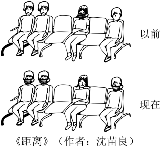

**2022年天津市普通高中学业水平等级性考试**

**思想政治**

**本试卷分为第I卷（选择题）和第II卷（非选择题）两部分。满分100分，考试时间60分钟。**

**第I卷（选择题共48分）**

**一、选择题（本大题共16小题，每小题3分，共48分。在每小题给出的四个选项中，只有一项是最符合题目要求的）**

1\. 百年风雨兼程，百年伟大跨越。一代代中华儿女唱着《没有共产党就没有新中国》这首心底的歌，迎来新中国，走进新时期，迈入新时代。历史和现实、理论和实践都雄辩地证明（ ）

①中国共产党执政是历史的选择，是人民的选择

②只有坚持党的领导才能实现中华民族伟大复兴

③中国共产党始终代表社会各阶级、各阶层的利益

④中国共产党必须坚持民主执政这一基本执政方式

A ①② B. ②③ C. ①④ D. ③④

2\. 把党的建设作为一项伟大工程来推进，是我们党的一大创举。截至2021年7月1日，全党现行有效党内法规共3615部，形成了一个比较完善的党内法规体系，并以此为主形成了一套系统完备的党的制度。党的制度建设是（ ）

①党领导立法、带头执法的要求

②党履行国家各项职能的重要保障

③坚持党要管党、全面从严治党的要求

④党永葆旺盛生命力和强大战斗力的需要

A. ①② B. ①④ C. ②③ D. ③④

3\. 新业态经济迅猛发展同时，也带来一系列法律问题。2021年8月印发的《法治政府建设实施纲要（2021—2025）》提出，及时跟进研究数字经济、人工智能等相关法律制度，抓紧补齐短板，保障新业态新模式健康发展。这体现全面推进依法治国要（ ）

A. 坚持文明规范执法 B. 完善法律实施机制

C. 坚持法治和德治相结合 D. 建立完备的法律体系

4\. 2022年5月12日，中共中央宣传部举行“中国这十年”系列主题新闻发布会第三场，介绍了过去十年中国经济和社会发展的累累硕果：近1亿农村贫困人口全部脱贫、居民人均可支配收入增长近八成、人均预期寿命提高至77.9岁⋯⋯这充分体现了（ ）

A. 以人民为中心的发展思想 B. 协调发展是可持续发展的内在要求

C. 经济发展方式的转变和结构的优化 D. 调动一切积极因素能够推动经济社会发展

5\. 为解决青年人、低收入者等群体的住房困难问题，政府通过给予土地、财税等政策支持，引导多主体投资、多渠道供给，大力发展保障性租赁住房，并禁止其上市销售或变相销售。发展保障性租赁住房（ ）

A. 维护了公平透明的市场秩序 B. 引导资源流向效率更高的领域

C. 要发挥有为政府和有效市场的作用 D. 体现了与民生相关的商品不能由市场调节

6\. 一部智能手机的问世，集合了芯片、摄像头、高端机床、模具制造等各种精细工艺。高科技产业分工日趋复杂，高度依赖全球协同，搞“脱钩”“断链”只会造成一损俱损。国际货币基金组织警告，全球“科技脱钩”将使全球经济产出“减少一个数量级”。由此可见，经济全球化（ ）

A. 使我国成为最大的受益者 B. 总体上符合经济规律和各方利益

C. 降低了世界经济发展的不确定性 D. 解决了世界经济发展不平衡问题

7\. 为向世界更好展示中国天津的形象，传播天津声音，天津海河传媒中心打造的中英双语宣传片《品味天津》已全网上线，其文案就像天津写给世界的一封情书，流动着盎然诗意，娓娓道来，与海内外的观众分享天津的瑰丽山河、历史流转与时代脉搏。《品味天津》（ ）

A. 推动文化交融，实现文化趋同 B. 通过讲好天津故事，促进文化交流

C. 通过展示天津形象，引领世界文化风尚 D. 把经济效益放首位，推动文化产业发展

8\. 随着文化传播方式的不断更新，作为中华优秀传统文化代表的古典诗词从文献与书本走上荧幕，以生动新颖的方式走向大众，为大众搭建一个思接千载、沟通古今的通道，让古典诗词的美学内涵走进当代人的审美世界。这反映中华优秀传统文化（ ）

①为人们提供丰富的精神食粮

②是民族文化的核心和灵魂

③与时代同行，实现创造性转化

④是夯实文化自信物质基础

A. ②③ B. ②④ C. ①③ D. ①④

9\. “北京冬奥会的成功，是中国的成功，也是世界的成功。”这一判断是（ ）

A. 假言判断 B. 联言判断 C. 关系判断 D. 选言判断

10\. 性质判断换位推理是通过改变已知性质判断的主项和谓项的位置而得出一个新判断的推理。依据换位推理规则，从“团结的民族是有力量的民族”这一前提判断推出的结论是（ ）

A. 有力量的民族是团结的民族

B. 团结的民族不是没有力量的民族

C. 有力量的民族不是不团结的民族

D. 有的有力量的民族是团结的民族

11\. 漫画《距离》反映了新冠肺炎疫情发生前后人们对戴口罩的态度，图中多数人的思维（ ）

A. 体现了辩证思维的动态性

B. 体现了超前思维的不确定性

C. 属于多角度思考的发散思维

D. 是“得中”而处之的适度思维

12\. 小军是一名17周岁的高中生，经常去刘某的游戏厅玩游戏。刘某邀请小军共同经营，欲将自己名下10%股份以2.5万元转让给小军，小军表示同意，与刘某签订了合同，并将父亲给他的2.5万元学费和生活费全部交付给了刘某。若该合同不能产生当事人预期的法律约束力，其原因是（ ）

A. 合同内容违背公序良俗 B. 小军的意思表示不真实

C. 小军不具有相应的民事行为能力 D. 合同约定违反法律、行政法规的强制性规定

**第II卷（非选择题共52分）**

**二、非选择题（本大题共4小题，共52分）**

13\. 阅读材料，回答问题。

材料一 实现共同富裕首先要把“蛋糕”做大做好，国有企业和民营企业都是实现共同富裕的重要基石。天津市构建国有经济新发展格局，提升国有企业核心竞争力，充分发挥其“主力军”作用；实施民营大企业大集团发展战略，精心打造一批竞争力强、影响力大的“航母级”民营企业集团。实现共同富裕还要把“蛋糕”切好，兜牢民生底线、补齐民生短板是重要方面。2021年，天津市实施20项民心工程，在“一老一小”问题上既有“真金白银”的支持，也有精细贴心的服务。

（1）运用《经济与社会》知识，说明天津市为实现共同富裕实施上述举措理由。

材料二 共同富裕是中国人民自古以来的梦想和追求，逐步实现全体人民共同富裕，实现中华民族伟大复兴的中国梦，需要全体人民共同努力，形成人人不“躺平”、人人不“等靠要”的良好社会氛围。

（2）运用《中国特色社会主义》知识，谈谈实现中国梦为什么需要全体人民共同努力。

14\. 阅读材料，回答问题。

粮食安全是“国之大者”。过去食物的生产来源主要是耕地，形成了“以粮为纲”的粮食观。现在通过设施农业、生物技术等手段，有了更多获取食物的途径。同时，随着生活水平提高，人们对食物的需求也更加多样化。这就要求树立大农业观、大食物观，在确保粮食供给的同时，保障肉类、蔬菜、水果等各类食物有效供给，推进现代农业高质量发展，以更好地满足人民美好生活需要。从“以粮为纲”到“大食物观”，应对粮食安全问题有了更宽广的视野。

结合材料，运用认识论知识，分析大食物观的形成过程。

15\. 阅读材料，回答问题

郭某因装修参加了某家居馆促销活动，支付定金2000元，并收到家居馆开具的收据。后郭某与家居馆发生纠纷，在某知名自媒体平台上两次发布标题为“对对对，请警惕这家店”“请牢记这家黑店”的视频，给家居馆带来了不良影响。家居馆将郭某起诉至法院，一审法院判决郭某侵权并承担相应责任。

（1）指出郭某侵犯家居馆何种权利，及其侵权责任的承担方式。如果郭某不服该判决，其享有何种诉讼权利？

（2）运用“全民守法”知识，分析此案例对消费者有何启示。

16\. 阅读材料，回答问题。

中国是世界上唯一将“坚持和平发展道路”载入宪法的国家，是5个核武器国家中唯一承诺不首先使用核武器的国家，是第一个在联合国宪章上签字的创始会员国⋯⋯历史已经并将继续证明，中国坚定站在和平对话一边、站在公道正义一边，积极探索热点问题的中国特色解决之道。

指出我国奉行的外交政策，并依据材料说明其意义。
