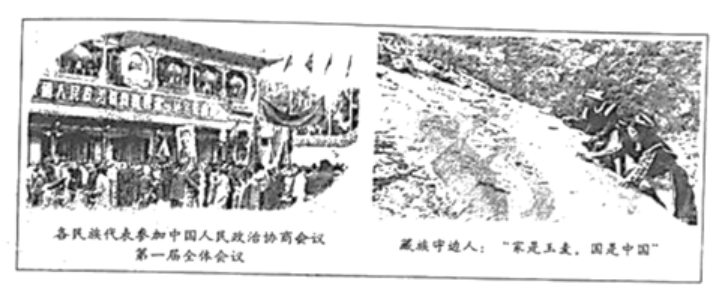
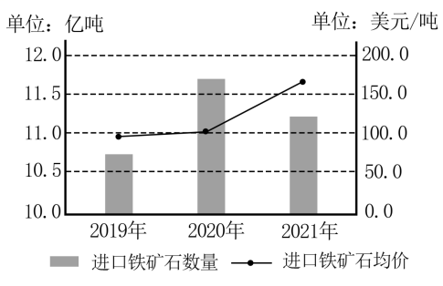

**山东省2022年普通高中学业水平等级考试**

**思想政治**

**注意事项：**

**1．答卷前，考生务必将自己的姓名、考生号等填写在答题卡和试卷指定位置。**

**2．回答选择题时，选出每小题答案后，用铅笔把答题卡上对应题目的答案标号涂黑。如需改动，用橡皮擦干净后，再选涂其他答案标号。回答非选择题时，将答案写在答题卡上。写在本试卷上无效。**

**3．考试结束后，将本试卷和答题卡一并交回。**

**一、选择题：本题共15小题，每小题3分，共45分。每小题只有一个选项符合题目要求。**

1\. 马克思认为，在未来的社会主义制度中，社会生产力的发展将如此迅速，生产将以所有人的富裕为目的。习近平指出，共同富裕是全体人民共同富裕，是人民群众物质生活和精神生活都富裕，不是少数人的富裕，也不是整齐划一的平均主义。关于共同富裕，下列理解正确的是（ ）

A. 消除社会基本矛盾是实现共同富裕的必由之路

B. 建设高福利国家是实现共同富裕的根本路径

C. 促进共同富裕和促进人的全面发展是高度统一的

D. 共同富裕会随社会生产力的迅速发展而自发实现

【答案】C

【解析】

【详解】A：消除社会基本矛盾表述错误。社会基本矛盾贯穿人类社会始终。故A排除。

B：国家的福利水平应该与国家经济社会发展相适应，建设高福利国家如果不与国家经济社会发展相适应，反而不利于实现共同富裕，因此该选项的说法错误，故B排除。

C：共同富裕是全体人民共同富裕，是人民群众物质生活和精神生活都富裕，促进人民共同富裕，有助于以促进人的全面发展，而促进人的全面发展也有助于实现共同富裕。促进共同富裕和促进人的全面发展是高度统一的。 故C符合题意。

D：共同富裕的实现，离不开生产力的迅速发展，但不会自发实现，需要加强国家宏观调控。故D排除。

故本题选C。

2\. 在从“0”到“1”的原始创新成果孵化期，企业迫切需要资本支持，但因投资风险高，融资困难。某省探索出以“国有资本战略投资”撬动社会资本、共同服务创新企业发展的新路，通过产业政策和国有资本投资，解决了科技企业初创期社会资本不愿投、不敢投的问题，在前瞻性战略性产业“育种育苗”，由此培育出了一大批高科技企业。该省做法取得成功的原因在于，国有资本（ ）

①投资前瞻性战略性产业增强了国有经济的控制力

②服务创新企业发展弥补了市场追求短期利益的缺陷

③通过撬动社会资本推动了国有企业混合所有制改革

④通过战略投资推动了有效市场和有为政府更好结合

A. ①③ B. ①④ C. ②③ D. ②④

【答案】D

【解析】

【详解】①：该省做法，解决科技企业初创初期的投资问题，不涉及国有经济控制力。故①不符合题意。

②：该省做法取得成功的原因在于发挥了国有资本服务创新企业发展，弥补了市场追求短期利益的缺陷，解决了科技企业初创期社会资本不愿投、不敢投的问题，由此培育出了一大批高科技企业。故②符合题意。

③：材料强调通过“国有资本战略投资”撬动社会资本、共同服务创新企业发展，以培育出一大批高科技企业，其做法并不是推动国有企业“混改”。故③排除。

④：该省做法取得成功的原因在于探索出通过国有资本战略投资和产业政策，撬动社会资本创新企业发展的新路，推动了有效市场和有为政府的更好结合，既服务创新企业发展，又弥补市场追求短期利益的缺陷。故④符合题意。

故本题选D。

3\. 2022年山东省新设40万个城乡公益性岗位，对就业困难人员予以托底安置。政府在社区设置日间照料中心服务等公共服务类公益岗、网格员等公共管理类公益岗，按照不低于当地小时最低工资标准发放岗位补贴。政府通过设置公益性岗位（ ）

①挖掘更多就业潜力，落实好保就业目标

②丰富社会救助形式，满足群众保障诉求

③采取以工代赈方式，增加群众收入来源

④推动慈善事业发展，牢牢兜住民生底线

A. ①③ B. ①④ C. ②③ D. ②④

【答案】A

【解析】

【详解】①：政府通过大量设置的不同类型的公益性岗位，对就业困难人员予以托底安置，挖掘了更多就业潜力，有助于落实保就业目标。故①符合题意。

②：社会救助，是指国家和社会对由于各种原因而陷入生存困境的公民，给予财物接济和生活扶助，以保障其最低生活需要的制度。材料不涉及社会救助和救助形式问题。故②排除。

③：通过设置公益性岗位，按照不低于当地小时最低工资标准发放岗位补贴，这表明政府采取以工代赈方式，增加了群众收入来源。故③符合题意。

④：材料不强调推动慈善事业发展。故④排除。

故本题选A。

4\. 市场主体是我国经济活动的主要参与者，市场主体活力越强，经济“肌体”越健康。近年来，中央持续激发市场主体活力的政策取向非常鲜明。若不考虑其他因素，下列推导正确的是（ ）

①实施组合式税费支持政策→提高增值税起征点→缓解企业资金压力→提振企业市场信心

②下调金融机构存款准备金率→加大信贷投放力度→拓宽企业融资渠道→降低企业投资风险

③深化要素价格市场化改革→稳定要素市场价格→优化企业要素配置→提高企业市场占有率

④健全公平竞争审查制度→强化反垄断监管→防止资本无序扩张→保护中小企业生存发展空间

A. ①② B. ①④ C. ②③ D. ③④

【答案】B

【解析】

【详解】①：实施组合式税费政策，提高增值税起征点，可以缓解企业资金压力，有利于提振企业市场信心。故①符合题意。

②：央行降准，银行加大信贷力度，有助于解决企业融资难，但不可能降低企业投资风险。企业经营风险和企业自身经营管理、核心竞争力等密切相关。故②排除。

③：要素价格市场化改革，不要稳定要素市场价格，而是让市场形成要素价格。同时，优化企业要素配置与提高企业市场占有率无直接联系。故③排除。

④：国家健全公平竞争审查制度，强化反垄断监管，可以防止资本无序扩张，有利于保护中小企业生存发展空间。故④符合题意。

故本题选B。

5\. 老龄化社会对养老服务提出了更高要求。针对养老助餐服务状况，某中学生调研小组收集的资料如下：

<table>
<colgroup>
<col style="width: 100%" />
</colgroup>
<thead>
<tr>
<th style="text-align: left;">
♢J市政府引入拥有中央厨房且连锁经营的企业，在其直营店设立了“长者助餐”窗口。

♢F省某政协委员通过调研协商，推动建立了“政府搭台、村居承办、居民互助、个人自愿、梯度收费、社会参与”的“互助孝老食堂”模式。
</th>
</tr>
</thead>
<tbody>
</tbody>
</table>

该小组拟向相关部门提交调研报告，报告的主题可以归纳为（ ）

①转变治理理念，构建共治共享格局

②聚焦民生切口，释放多元主体能量

③赋能基层组织，提高自我服务能力

④发挥协商优势，提升群众的幸福感

A. ①② B. ①④ C. ②③ D. ③④

【答案】A

【解析】

【详解】①②：“政府搭台、村居承办、居民互助、个人自愿、梯度收费、社会参与”的“互助孝老食堂”模式强调了“转变治理理念，构建共治共享格局”、“聚焦民生切口，释放多元主体能量”，①②符合题意。

③：基层组织指的是村委会或居委会，材料并未强调“赋能基层组织”，③排除。

④：材料并未强调不同主体的协商问题，也就未强调“发挥协商优势”，④排除。

故本题选A。

6\. 为贯彻落实知识产权强国战略，海南省和北京市的人大常委会在已有法律法规基础上，率先制定了各自的知识产权保护条例。海南省的条例重点针对植物新品种保护等自贸港知识产权工作中的突出问题，北京市则主要强化奥林匹克标志、网络平台等新兴领域的知识产权保护。据此，下列说法正确的是（ ）

①海南省的条例完善了对植物新品种保护的法律实施机制

②北京市的条例体现了北京市人大常委会的地方立法权

③海南省的条例提高了海南自贸港在相关领域的治理能力

④北京市的条例加强了北京市人大及其常委会对网络平台的监督

A. ①② B. ①④ C. ②③ D. ③④

【答案】C

【解析】

【详解】①：海南省和北京市的人大常委会率先制定了各自的知识产权保护条例，这是完善法律体系而不是法律实施机制，①说法错误。

②：北京市的人大常委会率先制定知识产权保护条例，可体现北京市人大常委会的地方立法权，②符合题意。

③：海南省的条例重点针对植物新品种保护等自贸港知识产权工作中的突出问题，因此，可以提高海南自贸港在相关领域的治理能力，③符合题意。

④：人大是国家权力机关，其制定的决策、法律等由其他部门具体执行，因此，对网络平台的监督的主体不是人大，而是其他国家机关，④排除。

故本题选C

7\. 中国农历是一种“阴阳合历”历法。阴历反映的是月球绕地球公转的规律，能反映潮汐，可指导海事活动；二十四节气则是反映太阳周年视运动的“阳历”，能反映四季交替和气候特征，可指导农业生产。通过设置闰月协调回归年与朔望月之间的天数，使得一年的平均天数与回归年的天数相符，“阴阳”和谐，融为一体。中国历法智慧所蕴含的哲理是（ ）

①正确认识是主观能动性和客观规律性相统一的基础

②人对世界的认识活动具有自觉选择性和能动创造性

③尊重物质运动的客观规律是规律起作用的前提条件

④要在斗争性中把握同一性，在同一性中把握斗争性

A. ①③ B. ①④ C. ②③ D. ②④

【答案】D

【解析】

【详解】①：实践是主观能动性和客观规律性相统一的基础，①错误。

②：“阴历”和“阳历”反映的内容不同，指导的侧重点不同，这说明人对世界的认识活动具有自觉选择性和能动创造性，②正确切题。

③：规律是客观的，并不是因为人们尊重客观规律，规律才发生作用的，③错误。

④：“阴历”和“阳历”反映的内容不同，指导的侧重点不同，但可通过设置闰月协调，“阴阳”和谐，融为一体，这说明要在斗争性中把握同一性，在同一性中把握斗争性，④正确切题。

故本题选D。

8\. 中共中央、国务院印发的《关于加快建设全国统一大市场的意见》，从全局和战略高度对加快建设全国统一大市场作出部署。建设全国统一大市场，持续推动国内市场高效畅通，形成供需互促、产销并进、畅通高效的国内大循环，将推动国内市场由大到强，促进我国经济高质量发展。从哲学上看，持续推动国内市场高效畅通，是因为（ ）

①经济基础决定上层建筑，上层建筑要与经济基础状况相适合

②联系是客观的和普遍的，任何事物之间都存在着必然的联系

③通过调整和完善生产关系，可以更好地促进生产力的发展

④发展是渐进性和飞跃性的统一，事物的量变可以引起质变

A. ①② B. ①③ C. ②④ D. ③④

【答案】D

【解析】

【详解】①：该选项与题干构不成因果联系。“持续推动国内市场高效畅通”强调的是调整生产关系以推动生产力的发展，①不合题意。

②：联系是普遍的，任何事物都与周围的事物有着这样或那样的联系，而不是任何事物之间都存在着必然的联系，②错误。

③：建设全国统一大市场，有利于推动国内市场高效畅通，促进国内大循环，推动国内市场由大到强，促进我国经济高质量发展，说明了当生产关系适应生产力时，能够促进生产力的发展，③正确。

④：建设全国统一大市场，推动国内市场由大到强，有利于促进我国经济高质量发展。这是因为发展是量变与质变、渐进性和飞跃性的统一，事物的量变积累到一定的度可以引起质变，④正确。

故本题选D。

9\. 习近平深刻总结中国特色社会主义民主政治的生动实践，对人民民主的性质、内涵、目的、特色、评价主体和评价标准进行了深邃思考和系统阐释，创造性地提出了全过程人民民主的重大理念，明确民主是要用来解决人民需要解决的问题的。材料体现了（ ）

①感性认识以理性认识为基础和指导

②理性认识是对感性认识的概括和提炼

③从思维具体到思维抽象的认识过程

④感性认识是达到理性认识的必经阶段

A. ①② B. ①③ C. ②④ D. ③④

【答案】C

【解析】

【详解】①：理性认识以感性认识为基础，故①错误。

②④：习近平通过对中国特色民主政治实践总结和对人民民主的思考，提出了全过程人民民主的重大理念，说明了理性认识是对感性认识的概括和提炼，感性认识是达到理性认识的必经阶段，故②④符合题意。

③：材料强调的是感性认识与理性认识的关系，未涉及思维具体到思维抽象的认识过程，故③不符合题意。

故本题选C。

10\. 透过下图可以看出（ ）

①中华民族共同体意识熔铸在各族儿女的价值实现中

②扎根边疆意识是正确国家观在守边人头脑中的客观反映

③不同时期的人在面对同一事物时表现出不同的价值选择

④“家是玉麦，国是中国”体现了当前社会人生价值的评判标准

A. ①② B. ①④ C. ②③ D. ③④

【答案】B

【解析】

【详解】①：透过图片，我们可以得出各族人民坚持国家利益至上，这体现了中华民族共同体意识熔铸在各族儿女的价值实现中，①正确切题；

④：当前社会人生价值的评判标准是对社会的责任和贡献，“家是玉麦，国是中国”体现了家国情怀，彰显了当前社会人生价值的评判标准，④正确切题。

②：扎根边疆意识是正确国家观在守边人头脑中的能动反映，不是客观反映，②不选；

③：材料体现的是不同时期的人在面对同一事物时表现出相同的价值选择，③不选。

故本题选B。

11\. 一些经济体量较小的国家为与大国争夺国际投资，往往会设定较低的企业税率，有些国家甚至将税率定在10%以下。美国为缓解财政赤字，倡议各国对跨国公司征收最低21%的企业税。该倡议得到法德等国支持，但遭到爱尔兰等国反对。在美国推动下，2021年10月，136个国家和地区在“经合组织”（OECD）框架下达成共识，“全球最低企业税率”被设定为15%。材料表明（ ）

①美国利用“经合组织”主导此次国际规则制定，本质是“美国优先”

②“经合组织”通过设定最低企业税率获得了行使税收管辖权的权利

③各参与国以共同利益为出发点，积极参与全球最低企业税率谈判

④国家利益和国家实力是达成此次最低税率谈判结果的决定性因素

A ①③ B. ①④ C. ②③ D. ②④

【答案】B

【解析】

【详解】①④：美国为缓解财政赤字，有意提高全球最低企业税率。在美国推动下，136个国家和地区在“经合组织”（OECD）框架下达成共识，设定“全球最低企业税率”，这表明美国利用“经合组织”主导此次国际规则制定，本质是“美国优先”，也说明国家利益和国家实力是达成此次最低税率谈判结果的决定性因素，①④正确。

②：税收管辖权的权利属于主权国家，②说法错误，不选。

③：各参与国以本国利益为出发点，而非共同利益，③说法错误，不选。

故本题选B。

12\. 2021年9月22日，在联合国大会纪念《德班宣言和行动纲领》通过20周年高级别会议上，中国重申将继续与各国一道，为彻底消除种族主义、建设人人平等的世界不懈努力。在中国和非洲国家共同倡议下，尼日利亚代表78个国家在第76届联合国大会第三委员会一般性辩论中发言，呼吁加快落实《德班宣言和行动纲领》。由此可见（ ）

①联合国是实践多边主义、解决各国人权瘤疾关键

②中国是联合国行动的坚定支持者和重要合作伙伴

③中国支持非洲国家在国际舞台上发挥建设性的作用

④中非守望相助，携手倡导和维护全人类共同价值

A. ①② B. ①④ C. ②③ D. ③④

【答案】D

【解析】

【详解】③④：在中国和非洲国家共同倡议下，尼日利亚代表78个国家在第76届联合国大会第三委员会一般性辩论中发言，呼吁加快落实《德班宣言和行动纲领》，为彻底消除种族主义、建设人人平等的世界不懈努力。这表明中国支持非洲国家在国际舞台上发挥建设性的作用，中非守望相助，携手倡导和维护全人类共同价值，③④正确切题；

①：联合国并不是解决各国人权瘤疾的关键，①不选；

②：中国支持按联合国宪章精神所进行的各项行动，②不选。

故本题选D。

13\. 科技赋能北京冬奥令世人惊叹。北京冬奥组委选择了全球范围内还较少被使用的二氧化碳制冰技术。相较于会对大气造成污染的传统制冷剂，二氧化碳制冷剂无毒无害，非常环保，其破坏臭氧层潜能值为0，全球变暖潜能值仅为1。北京冬奥会为推广二氧化碳制冰技术提供了契机。选择使用二氧化碳制冰技术，体现出北京冬奥组委（ ）

①运用超前思维，创造制冰技术发展的趋势

②坚持辩证思维，分析制冰技术运用的内在矛盾

③运用发散思维，围绕环保轴心进行思维收敛和集中

④遵循逻辑推理，把握制冷剂使用与环境保护的因果关系

A. ①② B. ①③ C. ②④ D. ③④

【答案】C

【解析】

【详解】①：超前思维是在多角度、全方位地分析事物的历史和现状的基础上，从事物发展的现实情况出发，认识和把握事物的发展状态，运用合理的推理和想象，判断事物未来发展趋势的思维形态，北京冬奥组委选择使用二氧化碳制冰技术，是判断制冰技术发展的趋势，而不是创造其发展趋势，①说法错误，排除。

②④：相较于会对大气造成污染的传统制冷剂，二氧化碳制冷剂无毒无害，非常环保，其破坏臭氧层潜能值为0，全球变暖潜能值仅为1，说明北京冬奥组委坚持辩证思维，分析制冰技术运用的内在矛盾；同时遵循逻辑推理，把握制冷剂使用与环境保护的因果关系，②④符合题意。

③：发散思维是从一个出发点向四面八方扩散、辐射，而不是进行思维的收敛和集中，③说法错误。

故本题选C。

14\. 刘某将自己的一套房屋签约卖给汪某，但在办理过户登记前去世。刘某之子刘某甲作为刘某遗产的唯一继承人，将该房屋卖给李某并过户。汪某得知后，要求李某和刘某甲赔偿自己的损失。李某认为，自己与汪某素不相识，不应对汪某的损失负责。刘某甲认为，父债子偿已经过时，刘某卖房给谁与自己无关。据此，下列判断正确的是（ ）

①汪某无权要求李某赔偿自己的损失

②汪某可主张李某未获得该房屋所有权

③刘某甲既然未放弃继承该房屋，就应该向汪某承担责任

④若刘某甲与汪某经人民调解达成协议，则该协议具有强制执行效力

A. ①③ B. ①④ C. ②③ D. ②④

【答案】A

【解析】

【详解】①：案例中汪某与刘某签约，因此汪某可以向刘某之子主张自己的权利，要求刘某之子赔偿自己损失，而不是要求李某赔偿自己的损失，①正确。

②：房屋为不动产，不动产所有权的获得必须到不动产登记机构办理登记才能取得。案例中刘某甲作为刘某遗产的唯一继承人，将该房屋卖给李某并过户，表明李某已获得该房屋所有权，②错误。

③：我国法律规定，遗产继承人不仅可以获得被继承人的遗产，还需要承担被继承人未偿还的债务。案例中，刘某甲继承刘某遗产（房屋），同时应该向汪某承担责任，③正确。

④：经人民调解达成协议，经人民法院依法确认有效后，才具有强制执行效力，④错误。

故本题选A。

15\. 廖某在甲家具公司的网站上看到“本店所有家具凭优惠券打折30%，当日有效”的弹窗，遂凭优惠券在该网站成功下单一张红木茶几，付款方式为“货到付款”。后廖某又修改了订单中的付款方式，提前付清了打折后的价款。下单第二天，甲公司的仓库所在地因洪灾实施交通管制。甲公司工作人员告知廖某无法及时交货，廖某表示反对。据此，下列说法正确的是（ ）

①甲公司网站“凭优惠券打折30%”的弹窗内容属于要约邀请

②廖某付清价款时买卖合同成立

③无论廖某是否表示反对，甲公司均有权直接取消订单

④甲公司在交通管制期间交货延迟，无需承担违约责任

A. ①③ B. ①④ C. ②③ D. ②④

【答案】B

【解析】

【详解】①：要约是希望与他人订立合同的意思表示，包括合同的主要条款；要约邀请仅仅是希望他人向自己发出要约，并不包括合同的主要条款。因此，甲公司网站“凭优惠券打折30%”的弹窗内容是希望他人向自己发出要约，即要约邀请，①正确。

②：案例中，廖某凭优惠券在该网站成功下单一张红木茶几，付款方式为“货到付款”时买卖合同就成立，后廖某又修改了订单中的付款方式，提前付清了打折后的价款，属于新要约下的新合同，②错误。

③：法律规定，除法律另有规定或者当事人另有约定外，合同的一方当事人不能单方面变更或者解除合同，故③错误。

④：在合同履行过程中遇到当事人约定的免责事由或者不可抗力时，根据这些情形对合同履行所造成的影响，可全部或者部分免除当事人的违约责任。案例中甲公司的仓库所在地因洪灾实施交通管制，并且甲公司工作人员告知廖某无法及时交货，属于不可抗力带来的影响，故甲公司无需承担违约责任，④正确。

故本题选B。

**二、非选择题：本题共4小题，共55分。**

16\. 建立国家公园体制是党的十八届三中全会提出的重点改革任务。2016年，武夷山被列为我国首批10处国家公园体制试点之一，国家公园“武夷山样本”的探索之路由此开启。

试点前，区域内存在自然保护区、水产种植资源保护区等5种类型保护地，分属林业、水利等部门及地方政府管辖，还面临保护和发展矛盾突出等问题。

试点后，福建省组建了武夷山国家公园管理局，全面负责国家公园内自然、人文资源和生态环境的保护与管理等工作，原景区管委会等机构不再保留；颁行了《武夷山国家公园条例（试行）》；设立了国家公园管理站（站长由所在地乡镇长兼任）和执法大队；将园区划分为核心保护区和一般控制区，实现了用10%面积的发展换取90%面积的保护；建立生态补偿机制，打造生态茶业、生态旅游业等富民产业，实现了机制活、产业优、百姓富、生态美。

2021年10月，习近平在《生物多样性公约》第十五次缔约方大会领导人峰会上宣布，中国正式设立武夷山等第一批国家公园。

结合材料，运用政治与法治知识，阐明国家公园“武夷山样本”的治理经验。

【答案】国家公园“武夷山样本”贯彻落实习近平生态文明思想，建设职能科学、权责法定的国家公园管理机构，创建统一高效的行政管理新体制；健全国家公园法律和制度体系，促进依法行政、严格执法；维护群众利益，探索生态保护和民生改善的新模式；实现了党的领导、以人民为中心和依法治园的有机结合。

【解析】

【分析】背景素材：国家公园“武夷山样本”

考点考查：党的领导、人大职权、以人民为中心、法治政府、依法治国

能力考查：描述和阐释事物

核心素养：法治意识、政治认同

【详解】第一步：审设问，明确主体、知识范围、问题限定和作答角度。

本题的设问要求运用政治与法治的知识，要求分析国家公园“武夷山样本”的治理经验，需要调用文法治政府的有关知识，从措施角度分析作答。

第二步：审材料，提取关键词，链接教材知识。

关键词①：建立国家公园体制是党的十八届三中全会提出的重点改革任务→可联系教材知识贯彻落实习近平生态文明思想。

关键词②：试点前，区域内存在5种类型保护地，分属林业、水利等部门及地方政府管辖，还面临保护和发展矛盾突出等问题，试点后，福建省组建了武夷山国家公园管理局，全面负责保护与管理等工作，原景区管委会等机构不再保留→可联系教材知识建设职能科学、权责法定的管理机构，创建统一高效的行政管理新体制。

关键词③：颁行了《武夷山国家公园条例（试行）》；设立了国家公园管理站（站长由所在地乡镇长兼任）和执法大队→可联系教材知识依法行政、严格执法。

关键词④：建立国家公园体制是党的十八届三中全会提出的重点改革任务；颁行了《武夷山国家公园条例（试行）》；实现了机制活、产业优、百姓富、生态美→可联系教材知识实现了党的领导、以人民为中心和依法治国的有机结合。

第三步：整合信息，组织答案。注意设问限定以及教材知识与材料、时政信息等相结合。

【点睛】“如何做（对策）类”主观题题型特点：

此类题的设问一般来讲都是给出了确定的主体，如党、国家、政府、公民、企业、消费者和个人等。并且指定了要回答的某一方面内容。

解题技巧：解答此类题目时，可采用定点法，具体的解题思路是：定点——联系——梳理——作答。

定点：确定考核的知识点是什么；

联系：联系所给材料与所学知识；

三梳理作答：将材料所给的信息与考核的知识点一一对照，二者相符的就是要点，作答时要做到观点和材料相结合。

17\. 推进碳达峰碳中和是推动高质量发展的内在要求。

材料一 粗钢的主要用途是作为原料，用来制成各种规格的管材、铸件等。长期以来，我国一直是全球最大粗钢生产国，全球占比最高达到56.7%。2021年，我国粗钢产量10.3亿吨。随着国际市场需求恢复，粗钢价格飙升，我国粗钢出口量明显增长。2021年我国粗钢净出口4096.1万吨，较2020年增加2451.6万吨。但同时钢铁行业的碳排放问题日益引起人们的关注。2021年我国钢铁行业碳排量占全国碳排放总量的15%左右，是制造业门类中碳排量最大的行业。

材料二 铁矿石是生产粗钢的重要原材料之一。我国铁矿石的对外依存度超过80%，而且缺乏定价权。下图是2019-2021年我国铁矿石进口情况。

有观点认为，为推动我国经济高质量发展，钢铁行业应扩大粗钢产量并增加出口。结合材料，运用经济与社会、当代国际政治与经济知识，对该观点进行评析。

【答案】①经济全球化大背景下，随着国际市场需求恢复，粗钢价格飙升，我国粗钢出口量明显增长。这样可以更好利用全球资源和市场，推动钢铁行业发展。\
②铁矿石是生产粗钢的重要原材料之一，我国铁矿石的对外依存度非常之高，而且缺乏定价权。近年来，进口铁矿石价格飙升，推高粗钢产量的成本、利润空间大幅度减少。钢铁行业不应盲目扩大粗钢产量并增加出口。\
③钢铁行业的碳排放问题目益引起人们的关注，2021年我国钢铁行业碳排量占全国碳科放总量的15%左右，是制造业营类中碳排量最大的行业。\
④为推动我国经济高质量发展，钢铁行业不能盲目扩张，走高耗能，高污染，低附加值的老路，必须贯彻新发展理念，深化供给侧结构性改革，提高自主创新能力，依靠技术进步、科学管理等手段形成自己的竞争优势，唯有如此，钢铁行业才能真正走出产能过剩，利润下降的困境。

【解析】

【分析】背景素材： 推进碳达峰碳中和是推动高质量发展的内在要求

考点考查： 经济与社会、当代国际政治与经济知识

能力考查：描述和阐释事物、论证和探究问题

核心素养：科学精神、政治认同

【详解】第一步：审设问。明确主体、知识范围、问题限定和作答角度。

本需要调用经济与社会、当代国际政治与经济知识的有关知识，评析为推动我国经济高质量发展，钢铁行业应扩大粗钢产量并增加出。

第二步：审材料。提取关键词，链接教材知识。

关键词①：随着国际市场需求恢复，粗钢价格飙升，我国粗钢出口量明显增长→可联系教材利用全球资源和市场知识；

关键词②：我国铁矿石的对外依存度非常之高，而且缺乏定价权，进口铁矿石价格飙升，推高粗钢产量的成本、利润空间大幅度减少→可联系教材价格变动观点影响知识；

关键词③：钢铁行业的碳排放问题目益引起人们的关注，是制造业营类中碳排量最大的行业→可联系教材新发展理念知识；

关键词④：为推动我国经济高质量发展，钢铁行业不能盲目扩张，走高耗能，高污染，，必须贯彻新发展理念，深化供给侧结构性改革，提高自主创新能力，依靠技术进步、科学管理等手段形成自己的竞争优势→可联系教材促进经济高质量发展知识；

第三步：整合信息，组织答案。注意设问限定以及教材知识与材料、时政信息等相结合。

18\. 【缘起】

在现实生活中，因噪声而引起的矛盾纠纷时有发生，A市居民甲无视其居住小区的管理规约，经常在小区的楼间空地上组织活动播放音乐，导致周围许多住户无法正常作息。

【过程】

邻居乙向当地公安机关投诉。经专业测量，甲所播音乐音量昼间略低于60分贝、夜间略低于50分贝。

邻居丙在个人微博上发帖公布了自己与甲交涉全过程的录音，“曝光”了甲所在单位网站上公布的其姓名、照片和联系电话，并在照片中甲的额头上加了贬损性文字：帖子发出后，大量网友拔打甲的电话对其进行指斥。甲遂起诉丙，称：丙公布录音，侵害了自己的名誉权；丑化并公布自己的照片，侵害了自己的肖像权；公布白己的姓名和联系电话，侵害了自己的隐私权。丙回应称，甲无视小区规约，制造噪声干扰邻居生活的行为才构成侵权。

<table>
<colgroup>
<col style="width: 100%" />
</colgroup>
<thead>
<tr>
<th style="text-align: left;">
相关资料

《治安管理处罚法》第五十八条违反关于社会生活噪声污染防治的，法律规定，制造嗓声干扰他人正常生活的，处警告；……

《环境噪声污染防治法》（2018年修正）第五十八条，……有下列行为之一的、由公安机关给予警告，可以并处罚款：……（二）违反当地公安机关的规定，在城市市区街道、广场、公园等公共场所组织娱乐、集会等活动，使用音响器材，产生干扰周围生活环境的过大音量的；……

根据《A市声环境功能区区划》（A市公安机关行政处罚的依据），甲所居住的小区属于2类区，执行环境噪声限值为昼间60分贝、夜间50分贝。
</th>
</tr>
</thead>
<tbody>
<tr>
<td style="text-align: left;">
乙认为：只要制造嗓声干扰他人正常生活，就应受到警告处罚，甲制造噪声干扰他人正常生活，所以甲应受到警告处罚。

甲认为：只有违反关于社会生活噪声污染防治的法律规定，才应受到警告处罚，自己没有违反关于社会生活噪声污染防治的法律规定，所以不应受到警告处罚。
</td>
</tr>
</tbody>
</table>

（1）关于居民甲制造噪声的行为是否应受到行政处罚，针对《治安管理处罚法》第五十八条，甲和乙各执一词。结合材料，运用逻辑与思维知识，分别判断甲乙推理的结论是否正确，并说明理由。

（2）结合材料，运用法律与生活知识，对甲丙互称对方构成侵权的各项说法逐一评析。

（3）结合材料，说明该小区居民解决噪声纠纷的做法给我们哪些启示。

【答案】（1）乙的结论错误。“制造噪声干扰他人正常生活”是“受到警告处罚”的一个必要条件，不是充分条件，推理的前提虚假，因此结论错误。甲的结论正确。甲所播音乐音量低于噪声限值，未违反噪声污染防治的法律规定，推理的前提真实；甲正确使用了必要条件假言推理，前件假，后件一定假。因此结论正确。

（2）丙公布录音不构成对甲的诽谤或侮辱，未侵害甲的名誉权。丙丑化并公布甲的照片，侵害了甲的肖像权。丙公布的是甲的公开信息，未侵害甲的隐私权，但侵害了法律对甲个人信息的保护。甲播放音乐的行为超出了合理界限，构成侵权。

（3）依法行使个人权利，履行维护社会秩序的义务；合理运用和解、调解等多元纠纷解决方式；弘扬公序良俗，互谅互让。

【解析】

【分析】背景素材：在现实生活中，因噪声而引起的矛盾纠纷及解决

考点考查：假言推理、积极维护人身权利

能力考查：描述和阐述事物，论证和探究问题

核心素养：政治认同、科学精神

【小问1详解】

第一步：审设问。明确主体、知识范围、问题限定和作答角度。

本题需要调用假言推理的有关知识，分别判断甲乙推理的结论是否正确，并说明理由。

第二步：审材料。提取关键词，链接教材知识。

关键词①：乙的结论错误，根据相关法律，“制造噪声干扰他人正常生活”是“受到警告处罚”的一个必要条件，不是充分条件，乙的推理前件，后件关系错误，因此结论错误→可联系教材处分条件的假言推理知识；

关键词②：甲的结论正确。甲所播音乐音量低于噪声限值，未违反噪声污染防治的法律规定，推理的前提真实；甲正确使用了必要条件假言推理，推理的有效式是前件假，后件一定假，所以否定了前件一定可以否定后件→可联系教材必要条件的假言推理知识；

第三步：整合信息，组织答案。注意设问限定以及教材知识与材料、时政信息等相结合。

【小问2详解】

第一步：审设问。明确主体、知识范围、问题限定和作答角度。

本题需要调用法律与生活的有关知识，对甲丙互称对方构成侵权的各项说法逐一评析。

第二步：审材料。提取关键词，链接教材知识。

关键词①：丙公布录音，并没有捏造事实，未侵害甲的名誉权。丙公布的是甲的公开信息，未侵害甲的隐私权，但是丙丑化并公布甲的照片，侵害了甲的肖像权，公布信息，侵害了法律对甲个人信息的保护。→可联系教材名誉权、肖像权和隐私权知识；

关键词②：甲播放音乐的行为超出了合理界限，构成侵权→可联系教材权利行使，注意界限知识；

第三步：整合信息，组织答案。注意设问限定以及教材知识与材料、时政信息等相结合。

【小问3详解】

第一步：审设问。明确主体、知识范围、问题限定和作答角度。

本题需要调用法律与生活的有关知识，该小区居民解决噪声纠纷的做法给我们哪些启示。

第二步：审材料。提取关键词，链接教材知识。

关键词①：依法行使个人权利，履行维护社会秩序的义务→可联系教材认真对待民事权利与义务的知识；

关键词②：合理运用和解、调解等多元纠纷解决方式→可联系教材纠纷的多元解决方式知识；

关键词③：弘扬公序良俗，互谅互让→可联系教材民法典的基本原则知识；

第三步：整合信息，组织答案。注意设问限定以及教材知识与材料、时政信息等相结合。

19\. 真理的力量。

◆铸魂培根。

在近代中国最危急的时刻，马克思主义传入中国，给中国的先进分子带来了先进思想。中国共产党人用马克思主义真理的力量激活了中华民族历经几千年创造的伟大文明，用“马克思主义之‘矢’”“射中国革命之‘的’”，用实践观点赋予了传统文化中“知行合一”的新内涵……找到了决定中国前途和命运的方向和道路。一百年来，中国共产党人在接续奋斗中，点燃了伟大征途上一个个熠熠生辉的精神火矩，激活了中国人民的“家国天下”情怀，唤醒了中华民族最深厚的文化基因，并使之成为团结海内外中华儿女的最大同心圆。古老的中华文明重新迸发出强大活力。

（1）用马克思主义真理的力量激活了中华民族历经几千年创造的伟大文明。结合材料，运用文化传承与文化创新知识，谈谈你对这句话的理解。

◆守正创新。

“致广大而尽精微”出自中国古代经典《中庸》，讲的是顺应大本达道、尽心勉力笃行方能化育成事。

“‘致广大而尽精微’是成事之道。”2021年12月8日，在中央经济工作会议上，习近平强调了工作的方法论：“干事业做工作大方向要正确，重点要明确，战略要得当，同时要把控好细节，把政治经济、宏观微观、战略战术有机结合起来，做到谋划时统揽大局、操作中细致精当”。

在2022年新年贺词中，习近平再次为我们未来干事创业指明了方法路径，要求我们“致广大而尽精微”。

（2）结合材料，运用整体和部分的知识，分析说明“致广大而尽精微”这句古语对新时代青年干事创业的启示。

◆继往开来。

2021年7月1日，习近平代表党和人民庄严宣告——“在中华大地上全面建成了小康社会”。回望过往的奋斗路，我们以全面建成小康社会的世纪伟业，把光荣与梦想写在了历史深处；眺望前方的奋进路……。

（3）结合材料，运用中国特色社会主义知识，以“继往开来的世纪伟业”为主题撰写一篇短评。

要求：①围绕主题，观点明确；②论证充分，逻辑清晰；③学科术语使用规范；④总字数在250字左右。

【答案】（1）①在革命、建设、改革的伟大实践中，中国共产党坚持以马克思主义为指导，对中华优秀传统文化的内涵和表达形式进行创造性转化和创新性发展；\
②形成了以伟大建党精神为源头的精神谱系，丰富和发展了以爱国主义为核心的中华民族精神；\
③创造了革命文化和社会主义先进文化，形成了中国特色社会主义文化，为人民提供精神指引，坚定文化自信。

（2）①整体居于主导地位，整体统率着部分，要树立全局意识，实现整体的最优目标；干事创业要“致广大”，有远大的目标规划；\
②部分影响整体，要重视部分的作用、用局部的发展推动整体的发展。要“尽精微”，把远大的目标规划落实落细，积微成著;要统筹兼顾“致广大”和“尽精微”，把远大的目标和脚踏实地的工作作风结合起来。

（3）参考示例：对中国人来说，全面建成小康社会，既是国家发展巨变的雄壮交响，也是人民笑颜绽放的鲜活故事。它书写在消除绝对贫困的人间奇迹里，书写在世界上规模最大的社会保障体系中，书写在不断增多的蓝天、不断延伸的绿道、不断改善的居住环境里，书写在让人民生活“一年更比一年好”的不变追求里。回望过往的奋斗路，我们以全面建成小康社会的世纪伟业，把光荣与梦想写在了历史深处；眺望前方的奋进路，我们还要全面建成社会主义现代化强国，继续在人类的伟大时间历史中创造中华民族的伟大历史时间。历史照亮未来，征程未有穷期。站在“两个一百年”奋斗目标的历史交汇点，我们身后是波澜壮阔的历史，我们面前是喷薄而出的曙光！

【解析】

【分析】背景素材：马克思主义传入中国、中国古代经典

考点考查：文化传承与文化创新、整体和部分的关系等

能力考查：描述和阐述事物，论证和探究问题

核心素养：政治认同、科学精神

【小问1详解】

第一步：审设问。明确主体、知识范围、问题限定和作答角度。

本题需要调用文化传承与文化创新的有关知识，用马克思主义真理的力量激活了中华民族历经几千年创造的伟大文明。

第二步：审材料。提取关键词，链接教材知识。

关键词①：中国共产党坚持以马克思主义为指导，促进优秀传统文化的发展→可联系教材优秀传统文化的创造性转化、创新性发展的知识；

关键词②：以伟大建党精神为源头的精神谱系，丰富发展了民族精神→可联系教材民族精神知识；

关键词③：创造了革命文化和社会主义先进文化，形成了中国特色社会主义文化→可联系教材文化自信知识；

第三步：整合信息，组织答案。注意设问限定以及教材知识与材料、时政信息等相结合。

【小问2详解】

第一步：审设问。明确主体、知识范围、问题限定和作答角度。

本题需要调用整体和部分的有关知识，分析说明“致广大而尽精微”这句古语对新时代青年干事创业的启示。

第二步：审材料。提取关键词，链接教材知识。

关键词①：干事业做工作大方向要正确，重点要明确，战略要得当；统揽大局→可联系教材整体的地位和作用及其方法论；

关键词②：要把控好细节，把政治经济、宏观微观、战略战术有机结合起来；操作中细致精当→可联系部分的地位和作用及其方法论；

第三步：整合信息，组织答案。注意设问限定以及教材知识与材料、时政信息等相结合。

【小问3详解】

第一步：审设问。明确主体、知识范围、问题限定和作答角度。

本题需要调用中国特色社会主义的有关知识，，以“继往开来的世纪伟业”为主题撰写一篇短评。

第二步：审材料。提取关键词，链接教材知识。

关键词①：中国消除了绝对贫困，注重生态建设，满足人民日益增长的美好生活的需要→可联系教材全面建成小康社会的知识；

关键词②：立足新时代，继续在人类的伟大时间历史中创造中华民族的伟大历史时间→可联系教材新时代知识；

关键词③：历史照亮未来，征程未有穷期。站在“两个一百年”奋斗目标的历史交汇点，我们身后是波澜壮阔的历史，要为实现中华民族伟大复兴而不断奋斗→可联系教材中国梦知识；

第三步：整合信息，组织答案。注意设问限定以及教材知识与材料、时政信息等相结合。
