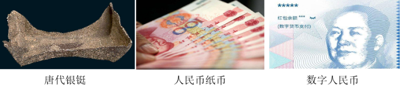
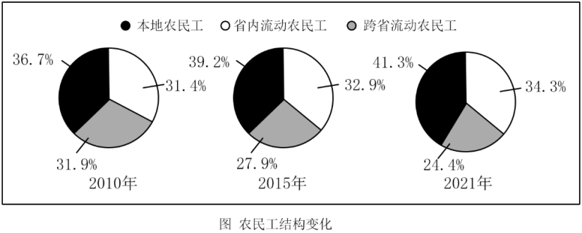

**2022年广东省普通高中学业水平选择性考试思想政治**

**一、选择题：本大题共16小题，每小题3分，共48分，在每小题给出的四个选项中，只有一项是符合题目要求的。**

1\. 在人类历史长河中，货币形式（包括贵金属、纸币等）逐步发生着演变。在网络课堂《神奇的货币》中，某老师在讲述货币形式演变历史之前，给出三张图片，同学们纷纷留言。其中观点正确的是（ ）

A. 货币形式演变的根本原因在于科技进步

B. 虽然货币的形式不同，但都可以充当流通手段

C. 电子货币的制作成本很低，便于任意发行

D. 任何国家的货币发生贬值时，其汇率都可以保持稳定

【答案】B

【解析】

【详解】A：货币形式演变的根本原因在于生产力的发展，排除A。

B：流通手段是货币的基本职能之一，是伴随着货币的产生就具有的，虽然货币的形式不同，但都可以充当流通手段，都能够充当商品交换的媒介，B正确。

C：货币的发行要遵循货币流通规律，不能任意发行，排除C。

D：任何国家的货币发生贬值时，其汇率都会出现一定的波动，而不是都可以保持稳定，排除D。

故本题选B。

2\. “粤贸全球”是广东省的一项重要工程，通过举办系列境外展会和经贸活动拓展国际市场。为应对新冠肺炎疫情变化，2020年推出线上展览平台和经贸对接会，通过补贴等方式支持中小企业网上洽谈，稳住订单；2021年推出“粤贸全国”，以线下展会为主，线上同步发力，鼓励企业抱团参展，突出展示广东优势品牌。该工程有利于（ ）

①主动融入新发展格局，推进广东省经贸高质量发展

②鼓励广东外贸企业从以出口为主转为以内销为主

③利用行政手段帮扶广东中小企业，提高市场竞争力

④促进广东企业营销方式从线下为主向线上线下融合转变

A. ①② B. ①④ C. ②③ D. ③④

【答案】B

【解析】

【详解】①：实施“粤贸全球”工程，通过举办系列境外展会和经贸活动拓展国际市场；推出“粤贸全国”，鼓励企业抱团参展，突出展示广东优势品牌，这说明该工程有利于主动融入新发展格局，推进广东省经贸高质量发展，①正确。

②：材料强调通过实施“粤贸全球”、“粤贸全国”工程，线下展会为主，线上同步发力，以更好促进企业发展，这不涉及鼓励广东外贸企业从以出口为主转为以内销为主，②排除。

③：材料体现的是经济手段，不涉及行政手段，排除③。

④：材料中，“推出线上展览平台和经贸对接会”“以线下展会为主，线上同步发力，鼓励企业抱团参展”，这说明该工程有利于促进广东企业营销方式从线下为主向线上线下融合转变，④正确。

故本题选B。

3\. 地方消费券是指由地方各级政府在本级预算中安排发放的用于兑换商品（或服务）的有价支付凭证。2022年，为了应对新冠肺炎疫情对经济的影响，某地即将发放一批消费券。请你设计这批消费券，使其促消费助企业的效果最好。下列组合最优的是（ ）

①券面设计为一次消费满100元抵扣20元和满200元抵扣40元两种

②券面设计为一次消费满200元抵扣20元和满400元抵扣40元两种

③消费券主要用于价格每下降一个单位，销量增幅更大的商品

④消费券主要用于价格每下降一个单位，销量增幅很小的商品

A. ①③ B. ①④ C. ②③ D. ②④

【答案】A

【解析】

【详解】①②：“券面设计为一次消费满100元抵扣20元和满200元抵扣40元两种”与“券面设计为一次消费满200元抵扣20元和满400元抵扣40元两种”相比，能让消费者感到其购买商品更划算，能够更好刺激其消费的欲望，有助于企业更多商品的销售，能更好的发挥消费助企的作用，①正确，②排除。

③：消费券主要用于价格每下降一个单位，销量增幅更大的商品，这能够扩大企业商品的销售，有助于更好的发挥消费助企的作用，③正确。

④：价格下降，但商品销量增幅很小，这不利于扩大企业产品的销售，不能更好的发挥消费助企的作用，④排除。

故本题选A。

4\. 第七次全国人口普查数据显示，我国60岁及以上人口已达2.64亿。预计“十四五”时期这一数字将突破3亿，我国将进入中度老龄化社会。习近平总书记强调：“满足数量庞大的老年群众多方面需求、妥善解决人口老龄化带来的社会问题，事关国家发展全局，事关百姓福祉，需要我们下大气力来应对。”为此，我们应该（ ）

①降低行业标准，增加适老产品和服务的供给数量

②拓展“银发经济”的新空间，适应老年人多样化的需求

③以市场调节为唯一手段，健全养老保障体系

④增强社会对老年人的关爱，促进老年人社会参与

A. ①② B. ①③ C. ②④ D. ③④

【答案】C

【解析】

【详解】①：“降低行业标准”表述错误，故①排除。

②④：习总书记强调“要满足数量庞大的老年群众多方面需求，妥善解决人口老龄化带来的社会问题，因为这不仅事关国家发展的全局，而且事关百姓福祉”，所以，这就要求我们必须拓展“银发经济”的新空间，适应老年人多样化需求，而且要增强全社会对老年人的关爱，调动他们继续参与社会生活的积极性，让其晚年生活充实而快乐，从而更好推动各项社会事业的发展。故 ②④符合题意。

③：“以市场调节为唯一手段”表述错误，故③排除。

故本题选C。

5\. 农民工是我国“稳就业”的重点群体之一。根据国家统计局数据，本地农民工和外出农民工（包括省内流动和跨省流动）的变化如图（农民工结构变化图）：

据此，以下分析合理的是（ ）

①本地农民工比重提高的原因是就业岗位从城市向乡村转移

②省内流动农民工不断增加主要是由于跨省农民工回流引起

③跨省农民工持续回流反映出我国区域发展差距正在逐步缩小

④县域经济发展和乡村振兴政策吸引农民工主动返乡就业创业

A. ①② B. ①④ C. ②③ D. ③④

【答案】D

【解析】

【详解】①：经济发展是就业问题解决的根本。本地农民工比重提高的根本原因是本地的社会经济发展，而就业岗位从城市向乡村转移是本地农民工比重提高所带来的影响的表现，故①排除。

②：经济发展是就业问题解决的根本。省内流动农民工不断增加主要是因为省内社会经济的不断发展，而跨省农民工回流是省内流动农民工不断增加的结果，故②排除。

③④：我国坚持贯彻新发展理念，跨省农民工持续回流反映了我国坚持协调发展理念，区域经济发展差距在不断缩小； 另外，因为国家实行乡村振兴战略，持续推动地方经济的发展，也大大吸引了许多农民工主动返乡就业创业，故③④符合题意。

故本题选D。

6\. 广东某村充分发挥“村（组）党组织+议事协商组织+村民小组”机制的作用，以村（组）党组织为核心，成立乡村振兴促进会等议事协商组织，联合本村各村民小组，共同参与该村村规民约的制定和执行工作，井建立村规民约的积分管理和红黑榜机制。该村做法有利于（ ）

①村民直接行使民主权利，创新基层民主形式

②实现自治法治德治相结合，提高乡村治理效能

③提升村级党组织作为基层群众自治组织的领导力

④维护村规民约的内部属性，表明其不受外部约束

A. ①② B. ①③ C. ②④ D. ③④

【答案】A

【解析】

【详解】①②：该村成立乡村振兴促进会等议事协商组织，联合本村各村民小组，共同参与该村村规民约的制定和执行，这有利于村民直接行使民主权利，是创新基层民主形式的体现；同时该村还建立村规民约的积分管理和红黑榜机制，这有利于在自治的过程把法治和德治相结合，提高效能，故①②符合题意。

③：农村基层群众自治组织是村委会，故③错误。

④：村规民约是由村民共同商讨、制定和执行的，但要符合法律规定，而不是不受外部约束，故④错误。

故本题选A。

7\. 2021年，九三学社等四个民主党派的广东省委员会以及多位广东省政协委员，向省政协提出了有关构建新发展格局战略支点的系列提案。对此，中共广东省委决定由省委书记牵头督办，近30个单位共同办理，使其中不少意见建议转化为具体工作举措。这反映出（ ）

①中国共产党与各民主党派是通力合作的友党关系

②人民政协围绕文明与和谐主题履行参政议政职能

③中国共产党高度重视国家权力机关代表的意见建议

④统一战线组织在践行全过程人民民主中具有独特优势

A. ①③ B. ①④ C. ②③ D. ②④

【答案】B

【解析】

【详解】①：民主党派的不少意见建议经中共广东省委督办转化为具体工作举措，这说明中国共产党与各民主党派是通力合作的友党关系，①正确切题。

②：人民政协的主题是团结和民主，而不是文明与和谐，②错误。

③：人大是国家权力机关，人大代表是国家权力机关代表，材料不涉及，也就不体现中国共产党高度重视国家权力机关代表的意见建议，③排除。

④：省政协收到政协委员有关构建新发展格局战略支点的系列提案，后经中共广东省委督办落实，这说明统一战线组织在践行全过程人民民主中具有独特优势，④正确切题。

故本题选B。

8\. 在相当长的一个时期内，中国的改革被称为“摸着石头过河”，但令人好奇的是：为何中国常常能摸对“石头”？党和政府坚持科学民主决策是关键，其主要经验有（ ）

①通过直接选举，选出人大代表作出决策

②通过专家咨询制度，确保国家决策的合理性

③尊重基层首创精神，把基层好经验上升为国家改革决策

④重大改革举措出台前“先行先试”，取得经验再向全国推广

A ①② B. ①④ C. ②③ D. ③④

【答案】D

【解析】

【详解】①：县乡两级人大代表采用直接选举，县级（不含县一级）以上人大代表采用间接选举，况且人大代表无决策权，决策权在决策机关，①错误。

②：通过专家咨询制度，有利于国家决策的科学性、合理性，但不是“确保”，②错误。

③④：中国常常能摸对“石头”，因为党和政府坚持科学民主决策，尊重基层首创精神，把基层好经验上升为国家改革决策，重大改革举措出台前“先行先试”，取得经验再向全国推广，③④正确。

故本题选D。

9\. 2021年，全国多地检察机关开展了一场红色资源保护公益诉讼专项监督行动，以“检察蓝”守护“革命红”。检察机关运用多种方式，督促行政机关依法履职，并通过与相关职能部门加强沟通协作，让革命文物等红色资源“活起来”。这一行动有利于（ ）

①加强检察机关对行政机关的社会监督

②引领社会法治意识，更好传承红色基因

③强化协同，实现对红色资源保护的齐抓共治

④促进检察机关履行管理和保护红色资源的职责

A. ①② B. ①④ C. ②③ D. ③④

【答案】C

【解析】

【详解】①：检察机关对行政机关的监督属于国家机关的监督，不属于社会监督，①错误。

②③：检察机关运用多种方式，督促行政机关依法履职，并通过与相关职能部门加强沟通协作，让革命文物等红色资源“活起来”，这一行动有利于引领社会法治意识，更好传承红色基因，有利于强化协同，实现对红色资源保护的齐抓共治，②③符合题意。

④：保护红色资源是新时代赋予检察机关的职责与使命，但管理红色资源属于政府的职能，④错误。

故本题选C。

10\. 非遗技艺的传承，以往主要靠师徒间口传心授。随着时代发展，今天的非遗技艺传承方式日益多样化。如故宫博物院推动建立非遗技艺人才培养机制，部分院校开设非遗技艺课程，有的企业把非遗技艺的传承深度嵌入文化产业发展之中，一些非遗手艺人则利用自媒体平台普及相关非遗技艺知识。非遗技艺传承方式发生变化，是因为（ ）

①传统的非遗技艺传承方式属于落后文化，遭到人们的抵制

②国家大力发展文化事业，公共文化服务体系得到不断完善

③非遗技艺传播手段日益丰富，科技赋能成为重要推动力量

④随着文化市场的发展，非遗技艺的独特标识发生根本变化

A. ①② B. ①④ C. ②③ D. ③④

【答案】C

【解析】

【详解】①：各种带有迷信、愚昧、颓废、庸俗等色彩的文化，都是落后文化，落后文化常常以传统习俗的形式表现出来，传统的非遗技艺传承方式并不属于落后文化，而且对腐朽文化应采取抵制态度，①错误。

②：故宫博物院推动建立非遗技艺人才培养机制，部分院校开设非遗技艺课程，这说明国家大力发展文化事业，公共文化服务体系得到不断完善，②符合题意。

③：随着时代发展，今天的非遗技艺传承方式日益多样化，这隐含着非遗技艺传播手段日益丰富，科技赋能成为重要推动力量，③符合题意。

④：材料显示了非遗技艺的传承方式的变化，但未显示非遗技艺的独特标识问题，况且传统文化具有相对独立性，非遗技艺的独特标识并未发生根本变化，④排除。

故本题选C。

11\. 艾思奇被誉为“善用大众话语的人民哲学家”。他的《大众哲学》一书以大众话语为载体，将深奥的马克思主义理论与大众耳熟能详的事例结合起来，直接满足了当时人们了解马克思主义的热切期望，启蒙了成千上万青年的革命理想，为马克思主义中国化、通俗化作出了卓越贡献。由此可见（ ）

①马克思主义通俗化是马克思主义中国化的前提

②先进文化只要走进大众，就直接转化为物质力量

③优秀的文化成果能紧扣时代脉搏，回应时代呼声

④一定的文化是一定政治的反映，又给予政治以重大影响

A. ①② B. ①③ C. ②④ D. ③④

【答案】D

【解析】

【详解】①：马克思主义通俗化有助于人们更好理解马克思主义，但不是马克思主义中国化的前提，①排除。

②：文化是精神力量，在人们认识和改造世界的过程中转化为物质力量，而不是直接转化为物质力量。故②排除。

③：《大众哲学》一书以大众话语为载体，将深奥的理论与大众耳熟能详的事例结合起来，直接满足了当时人们了解马克思主义的热切期望。由此可见优秀的文化成果能紧扣时代脉搏，回应时代呼声。故③符合题意。

④：他的《大众哲学》将深奥的马克思主义理论与大众耳熟能详的事例结合起来，启蒙了成千上万青年的革命理想，为马克思主义中国化、通俗化作出了卓越贡献，这说明一定的文化是一定政治的反映，又给予政治以重大影响。故④正确。

故本题选D。

12\. 苦瓜味苦性寒，是一种消暑清热的食材。清代屈大均在《广东新语》中这样评价苦瓜：“杂他物煮之，他物弗苦，自苦不以苦人，有君子之德焉。”苦瓜这种“不传己苦与他物”的特点，使其得了“君子菜”的雅号。从材料可以看出（ ）

①事物是各种观念的集合

②意识对事物的反映具有选择性和创造性

③人可以根据事物固有联系建立新的联系

④掌握事物的特性是意识活动的最终目的

A. ①② B. ①④ C. ②③ D. ③④

【答案】C

【解析】

【详解】①：材料强调：苦瓜具有自苦不以苦人的特点，所以才得了“君子菜”的雅号，这体现了唯物主义的哲学观，而事物是各种观念的集合反映的是主观唯心主义，故①排除。

②③：人们根据苦瓜这种“不传己苦与他物”的特点，使其得了“君子菜”的雅号，体现了人的意识对事物的反映具有选择性和创造性，并且人可以根据事物固有的联系建立新的联系，故②③符合题意。

④：意识活动的最终目的是指导实践，而不是为了掌握事物的特性，故④排除。

故本题选C。

13\. 北宋理学家周敦颐酷爱莲花，长期观察莲花的形貌特征与生长环境，领悟到莲花之美与“夫唯大雅，卓尔不群”的高雅情操有共通之处，创作出“出淤泥而不染，灌清涟而不妖”的千古名句。由此可见（ ）

①艺术作品是人仅凭灵感创作出来的

②艺术体验不能脱离人的生存环境和生活经验

③艺术修养是人在长期的社会实践中逐步形成的

④审美标准具有客观性，不会随着时代的变化而变化

A. ①② B. ①④ C. ②③ D. ③④

【答案】C

【解析】

【详解】①：物质决定意识，艺术作品题材源于客观存在，①排除。

②：周敦颐长期观察莲花并领悟到莲花之美与“夫唯大雅，卓尔不群”的高雅情操有共通之处，创作出“出淤泥而不染，灌清涟而不妖”的千古名句，由此可见艺术体验不能脱离人的生存环境和生活经验；艺术修养是人在长期的社会实践中逐步形成的。故②③符合题意。

④：价值判断和选择具有社会历史性和主体差异性。 审美标准虽具有客观性，但也不会随着时代的变化而变化，故④表述错误。

故本题选C。

14\. 高一某班以“劳动教育”为主题开展调研活动，发现当地存在一些将劳动教育窄化为“让孩子干农活”“动动手、流流汗”的误读，甚至出现“有劳动，无教育”的现象。同学们为此发出倡议：劳动教育，既要“流汗”更要“走心”。这一倡议提醒我们（ ）

①要铸就劳动最光荣的思想观念

②要重视劳动教育对人身心发展的意义

③劳动的终极价值是在改造世界中认识世界

④物质生产劳动是获得正确意识的唯一途径

A. ①② B. ①③ C. ②④ D. ③④

【答案】A

【解析】

【详解】①②：针对劳动教育中出现的误区和“有劳动，无教育”的不良现象，提出劳动教育既要“流汗”更要“走心”的倡议，意在提醒我们要铸就劳动最光荣的思想观念；要重视劳动教育对人身心发展的意义，①②符合题意。

③：劳动的终极价值在于创造价值，而不是在改造世界中认识世界，③表述错误。

④：物质生产劳动属于实践，实践是认识的唯一来源，但不是获得认识的唯一途径，④排除。

故本题选Ａ。

15\. 下图漫画“当你阻碍别人前进的同时，无疑切断了自己的后路”（作者：薛飞）给我们的哲学启示是（ ）

①事物发展有曲折性，要勇敢面对挫折与考验

②事物联系是多样的，要用长远的眼光看问题

③矛盾双方既对立又统一，要全面地看待事物

④主要矛盾决定事物性质，做事情要分清主次

A. ①③ B. ①④ C. ②③ D. ③④

【答案】C

【解析】

【详解】①：漫画不体现事物发展有曲折性。故①排除。

②：一事物与周围事物的联系是事物存在和发展的条件，矛盾的双方既对立又统一。阻碍别人前进的同时，也切断了自己的后路，漫画讽刺了孤立、片面看问题的形而上学，这给我们的哲学启示是事物联系是多样的，要用长远的眼光看何题；要全面地看待事物 。故②符合题意。

④：主要矛盾的主要方面主要地决定着事物的性质。故④表述错误。

故本题选C。

16\. 马克思主义以前的唯物主义被称为旧唯物主义。恩格斯指出：“旧唯物主义在历史领域内自己背叛了自己，因为它认为在历史领域中起作用的精神的动力是最终原因，而不去研究隐藏在这些动力后面的是什么，这些动力的动力是什么。”下列判断正确的是（ ）

①唯物主义的历史观产生于唯物主义的自然观

②旧唯物主义不承认社会意识对社会历史发展的作用

③对社会历史现象的唯物主义解释是马克思主义的伟大贡献

④旧唯物主义不理解物质生产实践在社会生活中的地位和作用

A. ①② B. ①④ C. ②③ D. ③④

【答案】D

【解析】

【详解】①：唯物主义的历史观产生于人类社会实践，而不是唯物主义的自然观。故①排除。

②：旧唯物主义在社会历史领域滑向了唯心主义，夸大了社会意识对社会历史发展的作用。故②排除。

③④：材料中恩格斯的话表明，旧唯物主义不理解物质生产实践在社会生活中的地位和作用，马克思主义克服了旧唯物主义的缺陷，对社会历史现象进行了唯物主义解释，故③④符合题意。

故本题选D。

**二、非选择题：本大题共4小题，共52分。每个试题考生都必须作答。**

17\. 阅读材料，完成下列要求。

当前，受新冠肺炎疫情和复杂的国际局势影响，我国经济面临较大压力。为此，党中央提出，要在促消费稳外贸的同时“积极扩大有效投资”，保持平稳健康的经济环境，迎接党的二十大胜利召开。

材料一

目前，我国基础设施建设投资主要以政府为主导，全面加强基础设施建设是扩大有效投资的重要举措，对推动高质量发展具有重大意义。

材料二 党的十八大以来，我国的基础设施建设整体水平已实现跨越式提升。与此同时，在一定程度上还存在着行政分割、布局不平衡、公益性与市场性兼顾不够、创新型产业基础设施投资不足和基础设施建设本身创新性不足等问题。因此，扩大有效投资，关键在于坚持精准有效投资导向。

（1）结合材料一，运用《经济生活》知识，说明当前基建投资由政府主导的意义。

（2）结合材料二，运用《经济生活》知识，分析如何找准基建发力点，实现扩大“有效”投资。

【答案】（1）新基建投资涉及关系国民经济命脉的重要行业和关键领域，由政府主导有利于把握国民经济方向；市场调节具有弱点和缺陷，新基建由政府主导能够弥补市场调节的缺陷；新基建由政府主导能优化资源配置，惠民生，满足人民美好生活需要，能够更好贯彻发展理念，推动人与自然、社会和谐发展；能够注入新动能，更好对冲疫情影响和经济下行压力，促进我国经济高质量发展。

（2）规范市场秩序，打破行政分割，建立统一大市场，增加有效公共产品供给；加强宏观调控，优化建设布局，突出重点，补短强弱；科学规划，注重投向具有公益性质的非经营性项目，兼顾公益性和市场性；坚持创新驱动，加大创新投入，引导社会资本适度参与。

【解析】

【分析】背景材料：新基建。

考查知识：宏观调控、市场经济、国有经济等。

考查能力：描述和阐释事物。

学科素养：政治认同、科学精神

【小问1详解】

第一步，审设问。

明确本题要求运用《经济生活》知识，说明当前基建投资由政府主导的意义。

第二步，审材料，提取关键词。

关键词①：受新冠肺炎疫情和复杂的国际局势影响，我国经济面临较大压力→可联系注入新动能，促进我国经济高质量发展的知识。

关键词②：新基建→可联系国有经济的知识。

关键词③：政府主导→可联系宏观调控的必要性、市场调节的弱点。

关键词④：新基建的具体内容→可联系发展理念、优化资源配置、满足人民美好生活需要。

第三步，整合信息，组织答案。注意设问要求与课本知识、材料信息结合。

【小问2详解】

第一步，审设问。

明确本题要求运用《经济生活》知识，分析如何找准基建发力点，实现扩大“有效”投资。

第二步，审材料，提取关键词。

关键词①：存在着行政分割→可联系规范市场秩序知识。

关键词②：布局不平衡→可联系加强宏观调控，优化建设布局的知识。

关键词③：公益性与市场性兼顾不够→可联系科学规划，注重投向具有公益性质的非经营性项目。

关键词④：创新型产业基础设施投资不足和基础设施建设本身创新性不足→可联系创新驱动的知识。

第三步，整合信息，组织答案。注意设问要求与课本知识、材料信息的结合。

18\. 阅读材料，完成下列要求。

在世界百年未有之大变局叠加新冠肺炎世纪疫情背景下，特别是在少数国家以各种理由进行抵制、抹黑的情况下，中国举办冬奥会所面临的风险和挑战前所未有。但同时，它也为我国政府面向外国公众，说明本国国情和政策，开展公共外交提供了重要契机。

北京冬奥会、冬残奥会胜利举办、举世瞩目。四场开闭幕式精彩纷呈，“雪花”传递着“一起向未来”的“团结”智慧，“致敬人民”体现了人民至上的执政理念，破冰而出的“冰雪五环”则寓意冬奥会将成为不同国家、民族之间打破隔阂的桥梁。人类命运共同体的主题贯穿始终，中华文化和冰雪元素交相辉映，体现了自然之美、人文之美、运动之美，诠释了新时代中国可信、可爱、可敬的形象。北京冬奥会首次实现赛事全程4K制作播出，吸引了全球数十亿观众观赛，成为收视率最高的一届冬奥会。

结合材料，运用《政治生活》中“当代国际社会”知识，分析中国举办冬奥会开展公共外交的重要性。

【答案】①国家利益决定国际关系。我国通过成功举办冬奥会，诠释了新时代中国可信、可爱、可敬的形象，为我国政府开展公共外交提供了重要契机，这有助于维护我们国家的国家利益。\
②和平与发展是当今时代两大主题。冬奥会、冬残奥会四场开闭幕式体现了人民至上的执政理念，“冰雪五环”破冰而出寓意冬奥会将成为不同国家、民族之间打破隔阂的桥梁。这些都将有助于推动世界的和平与发展。\
③冬奥会的开展体现了我国奉行独立自主的和平外交政策，有助于提升我国的国际地位和国际影响力。\
④北京冬奥会借助“雪花”，传递着中国“一起向未来”的“团结”智慧，有助于构建人类命运共同体。

【解析】

【分析】背景素材：北京冬奥会

考点考查：“当代国际社会”有关知识

能力考查：获取和解读信息、调动和运用知识、描述和阐述事物

核心素养：政治认同、科学精神

【详解】第一步：审设问。明确主体、知识范围、问题限定和作答角度。

本题的设问可转换为中国为什么要举办冬奥会开展公共外交，设问主体为中国，需要调用“当代国际社会”有关知识，从原因或意义角度作答。

第二步：审材料。提取关键词，链接教材知识。

关键词①：四场开闭幕式诠释了新时代中国可信、可爱、可敬的形象→可联系国家利益决定国际关系。

关键词②：四场开闭幕式体现了人民至上的执政理念，“冰雪五环”破冰而出寓意不同国家、民族之间可以打破隔阂→可联系和平与发展是当今时代两大主题。

关键词③：在少数国家抵制、抹黑中国的情况下，北京冬奥会为我国开展公共外交提供了重要契机，它成功吸引了全球数十亿观众观赛→可联系我国独立自主的和平外交政策，国际影响力和话语权进一步增强。

关键词④：人类命运共同体的主题贯穿始终，中华文化和冰雪元素交相辉映→可联系中国智慧、中国方案。

第三步：整合信息，组织答案。

注意设问限定以及教材知识与材料信息的有机结合。

19\. 阅读材料，完成下列要求。

中华优秀诗词承载着中国人的诗情与诗心，融入一代又一代中国人的血脉，滋养着一代又一代中国人的心灵。

农历新年伊始，家家户户“总把新桃换旧符”；中秋月圆，我们会在心中祝福“但愿人长久，千里共婵娟”；出门在外，不禁感叹“月是故乡明”。我们以“欲穷千里目，更上一层楼”劝人奋进，以“海内存知已，天涯若比邻”寄语友人，以“采菊东篱下，悠然见南山”安定内心。我们倾听“春江潮水连海平，海上明月共潮生”的至美悠远，感慨“漫江碧透，百舸争流”的雄浑壮丽；期许“仰天大笑出门去，我辈岂是蓬蒿人”的气魄胸襟，坚定“暮雪朝霜，毋改英雄意气”的立场信念……在这种独特的中国式诗意生活中，我们达到了和诗词作者“同频共振”的奇妙境界。

结合材料，运用《文化生活》知识，分析这种“同频共振”文化现象产生的原因。

【答案】①文化塑造人生，中国优秀诗词能展现中国人情感世界、审美世界，广大人民群众能够在中华优秀传统文化的潜移默化的影响下滋养心灵，丰富人的精神世界、增强精神力量，提升文化修养。\
②传统文化是维系民族生存与发展的精神纽带。中华优秀诗词作为我国的优秀传统文化承载着中国人的诗情与诗心，能够增强中国人民的文化归属感和文化自豪感，增强文化自信。\
③中华优秀诗词中蕴含的思想观念、人文精神，能够与时代发展同步、与生活接轨、与社会需求对接，贴近当代人的生活，更好地满足了人们的精神文化生活需求。

【解析】

【分析】背景材料：“同频共振”文化现象

考查知识：文化塑造人生、传统文化、文化自信等。

考查能力：描述和阐释事物。

学科素养：政治认同

【详解】第一步， 审设问。

本题回答范围是文化生活，设问要求是分析为什么会产生这种“同频共振”的文化现象。

第二步，审材料，提取关键词。

关键词①：中华优秀诗词承载者中国人的诗情与诗心，滋养着一代又一代中国人的心灵；我们以“欲穷千里目，更上一层楼”劝人奋进→可联系文化塑造人生的相关知识。

关键词②：农历新年伊始，家家户户“总把新桃换旧符”；中秋月圆，我们会在心中祝福“但愿人长久，千里共婵娟”；出门在外，不禁感叹“月是故乡明”→可联系传统文化具有鲜明的民族性的相关知识。

关键词③：以“海内存知已，天涯若比邻”寄语友人，以“采菊东篱下，悠然见南山”安定内心；期许“仰天大笑出门去，我辈岂是蓬蒿人”的气魄胸襟，坚定“暮雪朝霜，毋改英雄意气”的立场信念→可联系文化自信；更好地满足了人们的精神文化生活需求。

第三步，整合信息、组织答案。注意设问要求与课本知识、材料信息的有机结合。

本题考查文化生活的相关知识，可结合文化塑造人生、传统文化的基本特征、文化自信等，结合材料信息进行回答。

20\. 阅读材料，完成下列要求。

现实生活中，偏见是普遍存在的。因地域、种族、文化、意识形态等因素的不同而引发的诸多偏见，对人们的生活产生不同程度的影响。

高二某班以“偏见的哲思”为主题举行辩论赛。辩论双方表达各自观点并展开论证，见下表。

| 观点        | 开篇立论                                                                                                                  |
|:--------- |:--------------------------------------------------------------------------------------------------------------------- |
| 正方：偏见可以克服 | 偏见是人们对客观事物认识不足而产生的偏差。其产生的根本原因在于认识主体的主观性错误，如盲目崇拜权威、拘泥于片面的成见、轻率下结论等。随着时代的进步、社会的发展，人们必然可以克服这些主观性缺陷，逐渐摆脱偏见的束缚，最终达至无偏见的认知。 |
| 反方：偏见不可克服 | 偏见是人们受历史传统制约而形成的思维定势。作为认识，偏见不等于错误，它由历史传统造成并构成理解者的某种视野。由于我们都生活在传统中，在接受了语言、文化和历史的同时，就意味着获得了看问题的既定视角，意味着看问题的偏见性。         |

（1）假设你被邀请加入这场辩论赛，你支持哪方观点？运用认识论相关知识，进一步阐明你支持这一观点的理由。

（2）老师引用马克思的经典语录对辩论作出总结一一任何的科学批评意见我都是欢迎的。而对于我从来就不让步的所谓舆论的偏见，我仍然遵守伟大的佛罗伦萨诗人的格言：走自己的路，让人们去说罢！请从“价值判断与价值选择”的视角，谈谈面对偏见应如何正确地“走自己的路”。

【答案】（1）一、支持正方：①认识具有反复性、无限性和上升性，追求真理是一个过程，这要求我们在实践中认识和发展真理，在实践中检验和发展真理。②偏见的出现是因为认识受到主体因素的制约，如盲目崇拜、拘泥于片面的成见、轻率下结论等。③但随着时代的进步、社会的发展、人类时代延续，认识也在从实践到认识、再从认识到实践的多次反复中无限发展。二、支持反方：①认识主体：总要受到具体实践水平的限制及立场、观点、方法等条件的限制。②认识客体：客观事物是复杂的、变化着的，其本质暴露和展现也有一个过程。③认识活动会受到人们身处其中的历史传统的局限，其中包括文化背景、风俗习惯、思维方式和实践水平等。历史传统是认识产生、发展的必要前置条件，认识总是受到它的制约。

（2）①坚持真理，自觉遵循社会发展的客观规律，走历史的必由之路。 ②自觉站在最广大人民的立场上，把人民的利益作为自己的最高的价值追求。

【解析】

【分析】背景素材：高二某班以“偏见的哲思”为主题举行辩论赛

考点考查：认识论、价值判断与价值选择

能力考查：获取和解读信息、调度和运用知识、描述和阐释事物

核心素养：科学精神

【小问1详解】

第一步：审设问。明确主体、知识范围、问题限定和作答角度。

本题的设问要求可转换为为什么说偏见是可以（不可以）克服的，需要调用认识论的有关知识，从原因角度分析作答。

第二步：审材料。提取关键词，链接教材知识。

支持正方：

关键词①：偏见是人们对客观事物认识不足而产生的偏差→可联系教材知识认识具有反复性、无限性和上升性；

关键词②：根本原因在于认识主体的主观性错误→可联系教材知识偏见的出现是因为认识受到主体因素的制约；

关键词③：人们必然可以克服这些主观性缺陷，逐渐摆脱偏见的束缚→可联系教材知识认识也在从实践到认识、再从认识到实践的多次反复中无限发展。

支持反方：

关键词①：偏见是人们受历史传统制约而形成的思维定势→可联系认识受立场、观点、方法等条件的限制；

关键词②：构成理解者的某种视野→可联系教材知识客观事物是复杂的、变化着的，其本质暴露和展现也有一个过程；

关键词③：意味着看问题的偏见性→可联系教材知识认识活动会受到人们身处其中的历史传统的局限。

第三步：整合信息，组织答案。注意设问限定以及教材知识与材料信息等相结合。

【小问2详解】

第一步：审设问。明确主体、知识范围、问题限定和作答角度。

本题需要调用价值判断与价值选择的有关知识，从措施角度分析作答。

第二步：审材料。提取关键词，链接教材知识。

关键词①：偏见是人们对客观事物认识不足而产生的偏差，其产生的根本原因在于认识主体的主观性错误→可联系自觉遵循社会发展的客观规律；

关键词②：就意味着获得了看问题的既定视角，意味着看问题的偏见性→可联系自觉站在最广大人民的立场上。

第三步：整合信息，组织答案。注意设问限定以及教材知识与材料信息相结合。
