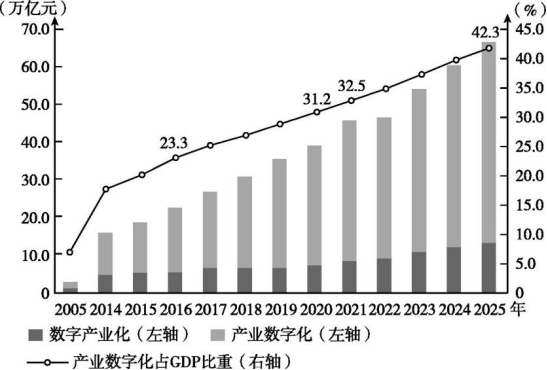
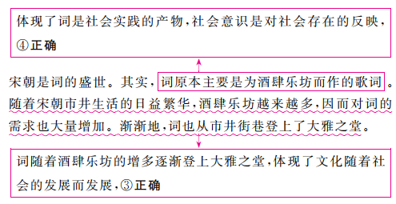
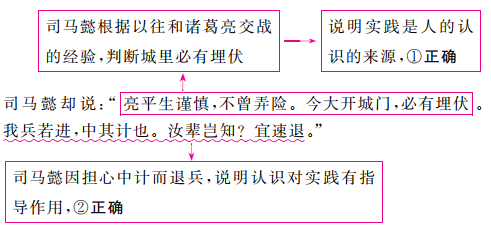
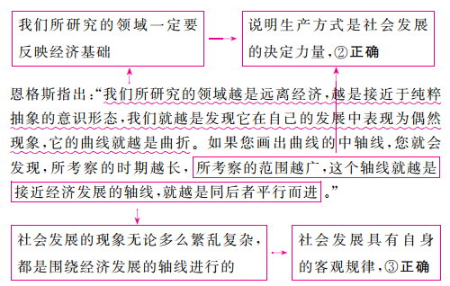

**江苏省2022年普通高中学业水平选择性考试**

政　治

一、选择题:共15题,每题3分,共45分。每题只有一个选项最符合题意。

1.党和人民百年奋斗,书写了中华民族几千年历史上最恢宏的史诗。下图主要表明中国共产党

①领导和执政地位是中国历史发展的必然结果

②坚持以人民为中心,与人民群众保持密切联系

③是中国人民的先锋队,领导中国人民逐梦前行

④加强自身建设,发挥共产党员的先锋模范作用

A.①③ B.①④ C.②③ D.②④

2.“不同楼层价格怎么算?”“噪声大不大,会影响采光吗?”……面对加装电梯的种种质疑,某小区召开多场协调会,充分听取群众意见。这得益于在当地政府支持下,该小区探索形成了由社区居委会委员、楼长、居民代表等组成的治理共同体。小区治理共同体

A.彰显了民主集中制的优势,实现了社区居民自我管理

B.强化了民主监督,调动了居民参与社区建设的积极性

C.拓展了基层民主自治的路径,保障居民直接行使民主权利

D.丰富了多元共治形式,实现了政府治理和居民自治的互动

3.标准化在推进国家治理体系和治理能力现代化中发挥着基础性、引领性作用。某市政府12345热线运用标准化原理优化再造相关政务流程。热线开通后,日均为民服务量从最初的1 000余件增长到3万余件,日均通话时长1 500余小时,年增长率为21%。该市在实践基础上,牵头起草了我国首个政府服务热线服务规范国家标准。材料表明,该市政府

A.创新社会治理方式,激发了社会活力

B.创新行政管理方式,提高了管理效能

C.坚持运用国家标准,确立了政府权威

D.坚持简政放权,增强了政府的执行力

4.扩大中等收入群体,缩小贫富差距,对推动高质量发展、实现全体人民共同富裕具有重要的现实意义。下列扩大中等收入群体的路径中合理的是

A.健全初次分配—增加资本收入—优化投资结构—扩大中等收入群体

B.压缩落后产能—增加就业人口—实现共享发展—扩大中等收入群体

C.增加教育投入—提高劳动者素质—推进按生产要素分配—扩大中等收入群体

D.实施乡村振兴战略—促进城乡协调发展—提高农民收入—扩大中等收入群体

5.资本市场注册制启动以来,社会资金不断向制造业集中。2021年,在股权投资市场中,制造业实现首次公开募股的企业达到113家,居各行业榜首,上市融资金额近750亿元。我国资本市场对新能源汽车、工业机器人等制造业“硬科技”的投资逐渐成为股权投资的主流赛道。材料说明

A.市场化融资手段能助推实体经济的创新发展

B.实体经济是国家强盛的重要支柱和坚实基础

C.股权投资能够促进我国制造业产业布局的优化

D.股权投资能推动虚拟经济和实体经济深度融合

6.全球已进入数字经济时代,为把握数字化发展新机遇,我国在“十四五”规划中提岀发展数字经济,推动数据要素的产业化、商业化、市场化,应用数字技术赋能传统产业,推进数字产业化和产业数字化。有学者对我国数字经济发展状况进行研究,其部分成果如下图所示。由此可见

①我国数字化创新引领能力不断提升　②数字经济是现代化经济体系的支撑　③数字经济已构筑起我国竞争新优势　④数字经济是改造提升传统产业的支点

A.①③ B.①④ C.②③ D.②④

7.在汉语中,鸳鸯不仅是一种鸟,也被视为夫妻恩爱、永不分离的象征。但是《红楼梦》被翻译成英文时,贾母的丫鬟鸳鸯常被译成“wild duck”(野鸭子),完全不能传达原有的词义。由此可见

①文化在交流中进一步传播和发展　②中华文化具有兼收并蓄的包容性　③中国的汉字文化内涵丰富、独树一帜　④中华文化具有自身的精神向往和美好追求

A.①② B.①④ C.②③ D.③④

8.2021年11月,“中华风韵”交响音乐会在美国纽约林肯中心奏响,女高音歌唱家凯莉和弗莱克表演了根据中国古诗词改编的歌曲《咏鹅·咏雪》,小提琴演奏家胡盛华与纽约城市芭蕾舞团交响乐团合作表演了小提琴协奏曲《梁祝》……众多的曲目为观众带来充满东方魅力的音乐盛宴。材料说明

A.不同民族的文化具有共性和普遍规律

B.民族平等是推动世界文化发展的基础

C.文化创新必须借鉴其他民族文化的积极成分

D.大众传媒对文化的发展具有重要的促进作用

9.宋朝是词的盛世。其实,词原本主要是为酒肆乐坊而作的歌词。随着宋朝市井生活的日益繁华,酒肆乐坊越来越多,因而对词的需求也大量增加。渐渐地,词也从市井街巷登上了大雅之堂。由此可见

①社会意识对社会存在具有反作用　②传统文化要与时俱进、推陈出新　③文化随着社会的发展而发展　④社会意识是对社会存在的反映

A.①② B.①③ C.②④ D.③④

10.“我在室内弹琴,看见窗外鸽子飞,在这刹那间,飞舞的鸽子与室内的音乐产生了某种联系,彼此成为对方的背景:音乐是鸽子飞舞的伴奏,鸽子是音乐表达的内容。总之,鸽子与音乐产生和谐的美感。其实,它们隔了一层玻璃,鸽子与音乐根本就不相干。是什么把它们和谐在一起呢?是我。”这段话

A.把想象的东西当作了真实,是主观唯心主义的表现

B.割裂了音乐和鸽子的客观联系,是形而上学的表现

C.说明意识具有主动创造性,体现了意识的能动作用

D.说明人们通过合理化想象可以创造一个客观的世界

11.概率论与数理统计表明,空间上微观的随机性导出了宏观的决定性。微分动力系统的研究又揭示出,时间上微观的决定性呈现为宏观的随机性。气体分子一个一个随机活动于空间的局部,而整体上却遵从明显的规律……数学的严密论证帮助哲学家在一定程度上说明:决定的必然性与随机的偶然性不仅是对立的,而且是统一的。材料告诉我们

A.必须透过事物的现象看到本质

B.哲学为具体科学的发展提供指导

C.量的积累能够引起事物的质变

D.具体科学的发展为哲学提供基础

12.“凡事不宜刻,若读书则不可不刻;凡事不宜贪,若买书则不可不贪;凡事不宜痴,若行善则不可不痴。”这段话蕴含的哲理是

A.矛盾的同一性是相对的,斗争性是绝对的

B.任何事物都是普遍性和特殊性的对立统一

C.承认矛盾的普遍性是坚持唯物辩证法的前提

D.主要矛盾和次要矛盾在一定条件下相互转化

13.“空城计”是《三国演义》中的经典故事。当时诸葛亮坐于城楼之上,焚香操琴,镇定自若。司马昭认为诸葛亮已无兵可用,他是“故作此态”。司马懿却说:“亮平生谨慎,不曾弄险。今大开城门,必有埋伏。我兵若进,中其计也。汝辈岂知?宜速退。”于是令魏军尽皆退去。司马懿的言行说明

①实践是人的认识的来源　②认识对实践有指导作用　③必须用系统思维看问题　④必须按照客观规律办事

A.①② B.①③ C.②④ D.③④

14.面对同样一个鲜艳的苹果,饥肠辘辘的人看到的是美食,诗人联想到的是少女的脸庞,营养学家则会估量其中的维生素含量……苹果在不同的人眼中是不同的存在。因此有人认为,根本不存在客观的真实,存在的只是每一个人的感觉。这种观点

A.否认了价值判断具有主体差异性

B.颠倒了客观事物和感觉的先后关系

C.没有看到人的认识的辩证发展过程

D.不懂得实践方式决定人的思维方式

15.恩格斯指出:“我们所研究的领域越是远离经济,越是接近于纯粹抽象的意识形态,我们就越是发现它在自己的发展中表现为偶然现象,它的曲线就越是曲折。如果您画出曲线的中轴线,您就会发现,所考察的时期越长,所考察的范围越广,这个轴线就越是接近经济发展的轴线,就越是同后者平行而进。”这段话蕴含的哲理是

①意识形态对经济基础有反作用　②生产方式是社会发展的决定力量　③社会发展具有自身的客观规律　④意识形态表现为历史的偶然现象

A.①② B.①④ C.②③ D.③④

二、非选择题:共4题,共55分,包括必做题和选做题两部分。其中第16题—第18题为必做题,每个试题都必须作答。第19题为选做题,包括三小题,请选做其中的两小题;若多做,则按作答的前两小题评分。

16.(9分)随着数字化生活的发展,人们拥有的数字财产在飞速增多,网络游戏账号、虚拟货币、各种社交账号……人们在其中投入了大量的金钱、时间,甚至是感情,它们具有巨大的经济价值和精神价值。这些数字财产能否作为遗产继承以及如何继承成为人们热议的话题。

《中华人民共和国民法典》首次将数据、网络虚拟财产纳入保护范围,为我国民众数字化生活的行为规制和权利保护提供了一定的制度基础。但在当前的司法实践中,数字遗产法律保护存在数字遗产虚拟化、成本高以及个人隐私等阻碍,继承人往往得不到网络运营商的协助或配合,权属争议等问题的解决在诉讼中也缺乏针对性的法律依据。为此,需要着力针对包括网络平台在内的多方主体,就数字遗产继承法律关系中的相关权利和义务作出立法回应,构建系统性、立体化的法律调控体系,更好地为数字化生活提供制度保障。

结合材料,运用《政治生活》知识,说明为什么要顺应时代的发展,以立法积极回应民众数字遗产继承需求。

17.(22分)改革开放以来,地方分权尤其是财政包干对地区经济发展产生了正向激励,国内区域经济竞争成为我国经济增长的动力源之一。利用政策优惠和各种补贴来吸引投资是地方政府提升竞争力的重要手段。这些手段强化了地方政府在经济发展中的主体地位,给我国经济发展注入巨大动力。然而,各地在追求地方经济发展中也出现了不同程度的地方保护,形成了诸多区域经济壁垒,带来了产能过剩、低层次重复建设等副作用,使国内市场的优势难以充分发挥。

这些年我国在消除区域经济壁垒方面取得了显著成效,但地方保护也出现了一些新的特征,从过去的商品领域逐渐转向了服务业和生产要素领域,制约了我国社会主义市场经济的健康发展和良性运行。进入新发展阶段,消除区域经济壁垒已成为我国构建以国内大循环为主体、国内国际双循环相互促进的新发展格局的必然要求。

　　结合材料,回答下列问题:

(1)消除区域经济壁垒有助于畅通国内大循环,请运用《经济生活》相关知识说明其作用路径。(12分)

(2)国内区域经济竞争既然是中国经济增长的重要动力,为什么现在却要规范竞争以消除区域经济壁垒?请运用矛盾的观点加以解释。(10分)

18.(12分)20世纪30年代,4名共产党特工受命执行秘密任务,由于叛徒的出卖,他们从跳伞降落的那一刻起,就置身于敌人布下的天罗地网。电影《悬崖之上》的故事由此展开。

电影的主角不是一位战无不胜的超级英雄,而是一群有血有肉的“平凡”的地下工作者,是隐蔽战线上的无名英雄。然而,正是这些无名英雄演绎了最伟大、最动人的故事,他们明知自己必然会牺牲,甚至在历史上连名字都不可能留下,却依然视死如归,勇往直前,正如《悬崖之上》留给观众印象最深的台词:“把最后一颗子弹留给自己。”

对英雄的向往和崇敬,几乎流淌在每一个民族的血液里,但每个民族的英雄却各不相同。西方崇尚个人主义,其电影中塑造的英雄大多是“超人”“007”那样敢于冒险、单打独斗式的角色。而我国电影中的英雄凸显的是民族精神和人民至上,是爱国主义、集体情怀、民族气节的集中表达,正是许许多多这样的英雄,铸就了中华民族的脊梁。

有人觉得中国式英雄形象不够“高大”,认为我们的电影也应该塑造“超人”式英雄。结合材料,请你写一篇短文对此观点加以反驳。

要求:①运用《文化生活》相关知识;②观点明确,理由充分,逻辑清晰,结构合理;③学科术语使用规范,字数在250字左右。

19.(12分)【选做题】本题包括A、B、C三小题,请选定其中两小题作答。若多做,则按作答的前两小题评分。

A.【经济全球化与对外开放】

国际科技竞争是常态,良性竞争既让本国更快更强,也促进了世界共同进步。在学科交叉整合不断发展的情况下,制造科技割裂只会阻碍全球科技进步。我国已经参与涉及科技的200多个国际组织和多边机制,是促进完善全球科技治理的重要力量。新冠肺炎疫情期间,我国积极加强科学研究方面的数据和信息共享,依托国家生物信息中心,建立了全球共享的新冠病毒信息库,截至2022年4月,已为180个国家和地区超过33万用户提供了服务。

习近平总书记指出:“越是面临封锁打压,越不能搞自我封闭、自我隔绝,而是要实施更加开放包容、互惠共享的国际科技合作战略。”结合材料谈谈你对这句话的理解。(6分)

B.【经济学常识】

材料一　“在这里看到的利润,与剩余价值是一回事,不过它具有一个神秘化的形式……因为在一极上,劳动力的价格表现为工资这个转化形式,所以在另一极上,剩余价值表现为利润这个转化形式。”——马克思

材料二　假定某企业共投资1 000万元,其中700万元用于购买生产资料,300万元用于购买劳动力,支付工人工资。企业工人共为企业创造剩余价值200万元。

请计算该企业的利润率,并根据生产剩余价值的方法,说明企业提高利润率的方式。(6分)

C.【国家和国际组织常识】

全球数字经济飞速发展,但由于国家间存在的企业所得税税制差异和征管漏洞,新的国际税收问题层出不穷,影响着数字经济的进一步发展。近年来,经济合作与发展组织(OECD)一直在推进全球税制协商,先后通过多种方式致力于解决数字经济下的国际税收难题。

面对联邦债务飙升,美国政府积极推行以提高联邦税率等为核心内容的加税增收措施。一些企业为了寻找更低的税率而外迁,导致税收外流。税率不低于15%的全球最低税的国际税收环境成为美国税制改革的基础。为此,美国极力说服欧盟,尤其是税率低于15%的欧盟成员国,争取欧盟与其保持一致。有专家指出,美国上届共和党政府要减税,本届民主党政府要加税,不管加税还是减税,都是为了把税收留在美国,本质上仍是受“美国优先”的思维所支配。

2021年10月,OECD宣布136个国家和司法管辖区达成了全球协议,以确保各全球企业支付的最低税率为15%。该协议将于2023年实施。

结合材料,对全球企业所得税最低税协议的协商及达成进行评价。(6分)

**江苏省2022年普通高中学业水平选择性考试**

　　总评:试题突出对考生关键能力和思维方法的考查,题型涉及传导题、统计图题、反驳类试题、评价类试题等,考查考生辨识与判断、推理与论证、反思与评价等能力,引导考生运用科学的思维方法分析、解决现实问题。

价值引领:本套试题突出核心价值引领,注重发挥政治学科的积极导向作用。第1题强调党的百年奋斗史,培养考生对中国共产党的真挚情感和理性认同;第2题以小区治理共同体为载体考查基层群众自治制度,引导考生积极参与公共生活,培养责任担当意识;第6题以数字经济发展为素材,引导考生树立科学精神;第16题强调以立法积极回应民众数字遗产继承需求,引导考生认识权利与义务的关系,增强法治意识。

基础广度:试题强化基本概念、基本原理的考查,经济生活部分突出对新发展理念的考查,如第4题强调共享发展,第5题、第6题涉及创新发展,第17题涉及区域协调发展等;哲学部分突出对哲学重要原理的考查,如第9题涉及社会存在与社会意识,第12题、第17题第(2)问涉及矛盾观等,引导教学回归课程标准、回归教材,以夯实考生知识基础。

文化暖度:试题注重弘扬中华优秀传统文化,彰显文化底色,如第7题以《红楼梦》中“鸳鸯”的英文翻译为情境,第8题以“中华风韵”交响音乐会为背景,第9题涉及宋词等,引导考生从中华优秀传统文化中汲取营养,树立文化自信。

▶本卷答案仅供参考

1.C　中国共产党　图反映了中国共产党和中国人民的无限循环互动,表明中国共产党坚持以人民为中心,与人民群众保持密切联系,②正确。图中信息显示,中国共产党引领人民向前进,表明中国共产党是中国人民的先锋队,领导中国人民逐梦前行,③正确。该图主要反映了坚持党的领导是人民的选择,不体现党的领导和执政地位是中国历史发展的必然结果,①不选。图反映了党和人民的关系,不体现党加强自身建设和发挥共产党员的先锋模范作用,④不选。

2.C　基层群众自治制度　面对加装电梯的种种质疑,该小区召开多场协调会充分听取群众意见,这发扬了民主,但没有体现集中,A不选。小区治理共同体主要体现了民主管理,没有强化民主监督,B不选。该小区探索形成的治理共同体,拓展了基层民主自治的路径,有利于保障居民直接行使民主权利,C正确。该小区治理共同体是在政府支持下形成的,政府并没有直接参与治理,材料未体现政府治理和居民自治的互动,D不选。

3.B　政府职能　

材料强调该市政府12345热线运用标准化原理优化再造相关政务流程,促进了行政效能的提高,并没有强调其创新社会治理方式,A不选。材料说的是该市政府牵头起草了相关国家标准,且“确立了政府权威”说法不妥,B不选。材料未体现“简政放权”,D不选。

4.D　我国的分配制度　实施乡村振兴战略,可以缩小城乡差距,促进城乡协调发展,提高农民收入,从而扩大中等收入群体,D正确。初次分配包括按劳分配和按要素分配,健全初次分配未必能增加资本收入、优化投资结构,且增加资本收入可能导致居民收入差距扩大,A错误。压缩落后产能,会导致一部分人失业,就业人口可能会减少,B错误。提高劳动者素质与推进按生产要素分配之间没有必然联系,C错误。

5.A　建设现代化经济体系　2021年我国制造业上市融资金额近750亿元,我国资本市场对新能源汽车、工业机器人等制造业“硬科技”的投资逐渐成为股权投资的主流赛道,这说明市场化融资手段能助推实体经济的创新发展,A符合题意。材料主要反映了股权投资向制造业集中,没有强调实体经济对国家的重要性,B不选。材料没有体现股权投资促进我国制造业产业布局的优化,也没有体现股权投资推动虚拟经济和实体经济的深度融合,C、D不选。

6.B　创新发展　图反映了我国数字产业化和产业数字化规模不断扩大,产业数字化占GDP的比重不断提高,这表明应用数字技术赋能传统产业,取得重大成果,也表明我国数字化创新引领能力不断提升,数字经济是改造提升传统产业的支点,①④正确。实体经济是建设现代化经济体系的重要支撑,②说法错误。该图反映了我国数字经济发展的状况及趋势,但其不能说明数字经济已构筑起我国竞争新优势,发展数字经济是构筑竞争新优势的战略选择,③不选。

7.D　弘扬中华优秀传统文化　鸳鸯不仅是一种鸟,也被视为夫妻恩爱、永不分离的象征,英文翻译不能传达“鸳鸯”原有的词义,这表明中国的汉字文化内涵丰富、独树一帜,中华文化具有自身的精神向往和美好追求,③④正确。材料反映文化在交流中存在个别障碍,不体现文化在交流中进一步发展,①不选。兼收并蓄强调吸收其他文化的有益成果,材料未体现中华文化兼收并蓄的包容性,②不选。

8.A　文化的世界性与民族性　外国歌唱家表演中国的歌曲,中国演奏家与外国交响乐团合作表演《梁祝》,说明不同民族的文化具有共性和普遍规律,A正确。尊重文化多样性是推动世界文化发展的基础,B不选。C中“必须”表述绝对,不选。材料没有涉及大众传媒的作用,且大众传媒的作用具有两面性,未必会促进文化的发展,D错误。

9.D　社会存在与社会意识　

材料强调词的产生和发展,体现了社会存在决定社会意识,未体现社会意识的反作用,①不选。材料强调文化与社会实践的关系,不涉及传统文化的与时俱进、推陈出新,②不选。

10.C　意识的特点　通过人的合理想象,飞舞的鸽子与室内的音乐有了某种联系,彼此成为对方的背景,这说明意识具有主动创造性,C正确。鸽子和音乐都是客观存在的,作者的想象是建立在客观事物的基础之上的,并不是主观唯心主义的表现,A不选。作者通过联想把音乐和鸽子联系在一起,并没有割裂二者的客观联系,不属于形而上学,B不选。意识具有主动创造性,人们通过合理化想象可以创造一个理想的世界,客观世界是本来就存在的,不能被创造,D错误。

11.D　哲学与具体科学　数学的严密论证帮助哲学家在一定程度上说明了事物的对立统一关系,这体现了具体科学的发展是哲学发展的基础,不体现哲学对具体科学的作用,B不选,D正确。材料主要强调具体科学对哲学的作用,不强调透过现象看本质,A不选。材料不涉及量变与质变的关系,且量变积累到一定程度才能引起事物的质变,C错误。

12.B　矛盾观　“凡事不宜刻,若读书则不可不刻”意思是凡事不应太苛刻,惟有读书,要求不严是不行的,“凡事不宜刻”强调矛盾的普遍性,“读书则不可不刻”则强调矛盾具有特殊性,故这段话体现了任何事物都是普遍性与特殊性的对立统一,B符合题意。A强调矛盾的同一性和斗争性的区别,C强调承认矛盾的普遍性,D强调主次矛盾之间的关系,在材料中均未体现,排除。

13.A　实践与认识

司马懿的言行体现了实践与认识的关系,不涉及系统思维,也不体现按照客观规律办事,③④不选。

14.B　哲学的基本问题、实践与认识　有人认为,根本不存在客观的真实,存在的只是每一个人的感觉,这种观点把人的感觉放在第一位,颠倒了客观事物和感觉的先后关系,属于主观唯心主义观点,B符合题意。“苹果在不同的人眼中是不同的存在”体现了价值判断的主体差异性,题中观点并没有否认价值判断的主体差异性,A不选。C、D本身说法正确,但题中观点没有涉及,排除。

15.C　社会历史的发展

恩格斯的话强调了经济对意识形态的决定作用,不涉及意识形态对经济的反作用,①不选。意识形态是对经济基础的反映,其产生都有一定的物质原因,并不都表现为历史的偶然现象,④错误。

16.我国是人民民主专政的社会主义国家,人民当家作主,以立法方式回应民众需求有利于维护人民的合法权益。社会主义民主是最真实的民主,随着经济发展和社会进步,广大人民的利益得到日益充分的实现。全面依法治国是中国特色社会主义的本质要求和重要保障,以立法方式回应民众需求有利于完善法律制度,厘清数字遗产继承中的权利和义务关系。

人民当家作主、全面依法治国　依据本题的知识限定和问题指向,可从国家、法律、人民需求等角度阐述这样做的原因。材料指出“随着数字化生活的发展,人们拥有的数字财产在飞速增多……”,据此可从国家性质角度指出,我国是人民民主专政的社会主义国家,人民当家作主,以立法方式回应民众需求有利于维护人民的合法权益;材料强调民法典“首次将数据、网络虚拟财产纳入保护范围,为……提供了一定的制度基础”,这体现了人民的权益有了制度保障和法律保障,据此可从社会主义民主的真实性角度分析原因;材料指出“就数字遗产继承法律关系中的相关权利和义务作出立法回应,构建系统性、立体化的法律调控体系”等,据此可从全面依法治国的角度,指出以立法方式回应民众需求有利于完善法律制度、厘清数字遗产继承中权利和义务的关系。

17.(1)①消除区域经济壁垒有助于打破地方保护和市场分割,形成公平竞争、充分开放的全国统一大市场,有利于深化供给侧结构性改革,优化资源配置,为畅通国内大循环创造有利的市场环境。②消除区域经济壁垒有助于不同区域间技术等生产要素自由流动,促进技术创新,突破国内经济发展的技术瓶颈,为畅通国内大循环创造有利的技术条件。③消除区域经济壁垒有助于维护消费者利益和社会公共利益,激发国内需求潜力,为畅通国内大循环创造有利的需求条件。④消除区域经济壁垒有助于优化营商环境,有利于吸引外资,实现内外联动,为畅通国内大循环创造有利的国际环境。

(2)矛盾就是对立统一,而矛盾双方的力量是不平衡的,在一定条件下矛盾的主要方面和次要方面相互转化,区域经济竞争曾给中国经济发展注入巨大动力,其积极作用是主要的,但随着社会发展,区域经济竞争也产生了很多负面效应,形成了区域经济壁垒,制约了我国社会主义市场经济的健康发展和良性运行,因此需要规范竞争,消除区域经济壁垒。矛盾具有特殊性,要求我们坚持具体问题具体分析,在社会发展的不同阶段,根据实际情况对政策进行动态调整是马克思主义的活的灵魂的具体表现。

建设现代化经济体系、矛盾观　第(1)问知识限定为经济生活,解题思路如下:

第(2)问,知识限定为矛盾观,属于原因类试题,分析材料可知国内区域经济竞争利弊并存,在不同时期的作用和侧重点是不同的,据此可提取材料信息,并对接矛盾观的相关知识组织答案,具体思路如下:

18.要点示例:①文化具有多样性。不同民族、各个国家的文化各具特色。“超人”式英雄与西方文化中的个人主义相适应,而中华文化具有集体主义传统,中国式英雄应植根于中华文化土壤,不应简单抄袭西方模式。②社会实践是文化发展的源泉和动力。中国革命和建设的伟大成就是无数“平凡”人物的劳动实践创造的,他们就是我们心目中的“超人”,我们的电影应把镜头对准他们,讴歌他们的劳动和奉献。③建设社会主义文化强国,要坚持中国特色社会主义文化发展道路,坚守中华文化立场,立足当代中国现实。我们的电影应坚持以人民为中心的创作导向,而不是聚焦所谓的“超人”。

文化的多样性、文化创新、发展中国特色社会文化　本题要求写一篇短文反驳设问中的观点,知识限定为《文化生活》,具有一定的开放性。设问中的观点认为中国式英雄形象不够“高大”,我们的电影也应该塑造“超人”式英雄,该观点并没有认识到中外文化存在的差异。依据材料中“西方崇尚个人主义”“我国电影中的英雄凸显的是民族精神和人民至上”等信息,可从文化具有多样性,文化创作要立足社会实践、坚守中华文化立场、坚持以人民为中心等角度对设问中的观点加以反驳。注意要先阐述理论,再结合材料论证分析。

19.A　科技合作有利于发挥各国在科技领域的比较优势,推动各国科技资源在全球范围内的有效配置。一些国家制造科技割裂的目的是维持技术垄断,这会加剧全球经济的不稳定性,对发展中国家的经济安全构成极大威胁。面临封锁打压,我国实施更加积极主动的开放战略,通过科技合作完善互利共赢、多元平衡、安全高效的开放型经济体系。

经济全球化与对外开放　解答本题,可先提取材料关键信息,再链接经济全球化与对外开放的知识加以解读。具体思路如下:国际科技竞争是常态,良性竞争既让本国更快更强,也促进了世界共同进步→科技合作有利于发挥各国在科技领域的比较优势,推动科技资源在全球范围内的有效配置;在学科交叉整合不断发展的情况下,制造科技割裂只会阻碍全球科技进步→科技割裂加剧了全球经济的不稳定性,对发展中国家的经济安全构成极大威胁;“我国……是促进完善全球科技治理的重要力量”“我国积极加强科学研究……提供了服务”→我国实施更加积极主动的开放战略,通过科技合作完善互利共赢、多元平衡、安全高效的开放型经济体系。

B　该企业的利润率为20%。资本家获得剩余价值的方法主要有两种:绝对剩余价值的生产和相对剩余价值的生产。利润是剩余价值的转化形式,提高利润率的方法相应地分为两种:一种是在工人必要劳动时间不变的情况下,延长工作日的长度;一种是在工作日长度不变的情况下,提高社会劳动生产率,缩短必要劳动时间。

马克思的剩余价值理论　本题考查利润率的计算及提高利润率的方法。当剩余价值被看作全部预付资本的产物时,被称为利润,利润与全部预付资本之比,就是利润率。据此,可以计算出该公司的利润率为:200÷1 000×100%=20%。利润是剩余价值的转化形式,因此可结合资本家获得剩余价值的方法,说明企业提高利润率的方式。

C　国际组织可以促进国际社会各领域的交流、协作、合作,调停和解决国际政治冲突和经济纠纷,促进世界和平与发展。OECD推进全球税制协商,有利于解决数字经济发展中遇到的国际税收问题。欧盟具有广泛的国际影响力,在国际事务中有着重要影响,发挥着重大作用。美国为推进国内税制改革,需要争取欧盟与其保持一致。美国是两党制国家,但两党都代表资产阶级的利益和意志,在全球最低税率协商中坚持“美国优先”是维护资产阶级利益和意志的具体表现。

国际组织、美国的两党制　本题属于评价类试题,解答时可认真分析材料信息,针对不同主体在全球企业所得税最低税协议的协商及达成过程中的态度和举措,分别对其加以评价。材料指出“经济合作与发展组织(OECD)一直在推进全球税制协商”“美国极力说服欧盟”“美国上届共和党政府……本届民主党政府……思维所支配”,据此可调用国际组织的作用,欧盟的地位、作用,美国两党制的实质等有关知识进行解答。
