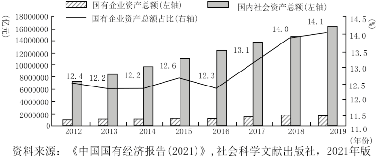
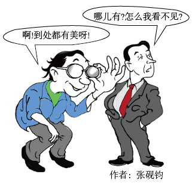

**2022年6月浙江省普通高校招生选考科目\
思想政治试题**

**一、判断题（本大题共10小题，每小题1分，共10分。判断下列说法是否正确，正确的请将答题纸相应题号后的T涂黑，错误的请将答题纸相应题号后的F涂黑）**

1\. 小明用数字人民币购买了“冰墩墩”玩偶，数字人民币执行了流通手段职能。（ ）

2\. 发展慈善等社会公益事业有助于推动浙江共同富裕示范区建设。（ ）

3\. 街道办事处和居民委员会作为基层群众性自治组织，在疫情防控中发挥着重要作用。（ ）

4\. 维护国家统一和民族团结是我国生存发展的政治基石。（ ）

5\. 中国特色社会主义制度的最大优势是中国共产党领导。（ ）

6\. 网络流行语作为一种文化现象是经济社会的集中表现。（ ）

7\. 国产电影《长津湖》受欢迎的重要原因在于其坚持以人民为中心的创作导向。（ ）

8\. 一般说来，一个人的世界观影响其做事做人的方式方法。（ ）

9\. 个性是被共性包含的个性。（ ）

10\. 在某些时候，社会提供的客观条件并非是人们实现人生价值的前提。（ ）

**二、选择题I（本大题共22小题，每小题2分，共44分。每小题列出的四个备选项中只有一个是符合题目要求的，不选、多选、错选均不得分）**

11\. 2022年4月，国际原油价格相较于2021年每桶上涨了几十美元。此时，生产者将会（ ）

A. 扩大生产规模 B. 压缩生产规模 C. 维持原有生产规模 D. 视获利情况而定生产规模

12\. 近两年我国居民人均可支配收入平均实际增长5.1%，增速比疫情前的2019年放缓0.7%，居民的消费能力、消费意愿有所减弱。为了防止消费增速持续放缓，国家应（ ）

①进一步鼓励企业扩大投资

②鼓励居民将线上消费作为主要消费方式

③出台更多刺激消费政策

④多渠道增加居民收入

A. ①② B. ①③ C. ②④ D. ③④

13\. 下图为2012-2019年国有企业资产总额占国内社会资产总额的比例变化情况。

根据图中信息，可以看出（ ）

①国有经济的控制力逐渐增强

②国有企业资产总额在国内社会资产总额中的占比波动上升

③国有企业资产总额稳步提高

④公有资产总额在国内社会资产总额中的优势不断扩大

A. ①② B. ①④ C. ②③ D. ③④

14\. 统计显示，2021年我国企业研发经费占全社会研发经费的76%，但目前企业研发投入主要集中在试验发展方面，创新链的中端应用研究投入不到位，前端的基础研究投入更是不足。为了使企业成为创新主体，增强企业核心竞争力，国家要（ ）

①对投入基础研究的企业实行税收优惠

②加大对所有企业研发活动的投入

③加大对企业研发活动的行政干预

④加强对知识产权的保护

A. ①③ B. ①④ C. ②③ D. ②④

15\. 近年来，我国加快跨境电商、海外仓等新业态新模式的建设，大幅降低国际贸易专业化门槛，积极扩大优质产品和服务进口，深化通关便利化改革。这些举措（ ）

①有助于稳定对外贸易

②有助于构建新发展格局

③旨在扩大国内消费

④旨在扩大对外投资

A. ①② B. ①④ C. ②③ D. ③④

16\. 疫情发生以来，面对上亿市场主体、数亿人就业创业，我国政府向企业实施了大规模的减税降费，其目的在于（ ）

①提高企业经济效益

②直接纾解企业困难

③优化经济结构

④“放水养鱼”，涵养税源

A. ①② B. ①③ C. ②④ D. ③④

17\. 我国推动义务教育优质均衡发展和城乡一体化，依据常住人口规模配置教育资源。这是（ ）

①保障公民政治权利重要体现

②公民法定权利扩大的重要体现

③人权保障进步的重要体现

④我国国家性质的重要体现

A. ①② B. ①④ C. ②③ D. ③④

18\. 近年来，我国各级政府大力推进“互联网+政务服务”，从“数字政府”到“智慧治理”，从“只进一扇门”到“最多跑一次”，有效打通政务服务“最后一公里”，为解决企业和群众办事难、办事慢、办事繁等问题发挥了重要作用。这表明（ ）

①服务型政府的理念得到深入贯彻

②我国政府已成为一个全能型政府

③我国政府依法行政的效能不断提升

④我国政府的基本职能发生根本转变

A. ①② B. ①③ C. ②④ D. ③④

19\. 近20年来，我国司法行政机关通过特定程序选任人民群众担任人民监督员，加强对有关国家机关及其组成人员履职情况的监督。这类监督属于（ ）

A. 国家司法机关的监督 B. 人民政协的监督 C. 国家监察机关的监督 D. 社会与公民的监督

20\. 《中华人民共和国地方各级人民代表大会和地方各级人民政府组织法》修改过程中，全国人大常委会多次征求全国人大代表有关部门、地方人大基层立法联系点、高校及研究机构的意见，两次向社会公众征求意见，最终形成法律文本，由十三届全国人大五次会议审议通过。这表明（ ）

①全国人大常委会依法行使最高立法权

②我国在立法过程中坚持全过程人民民主

③人民代表大会是我国的根本政治制度

④人民代表大会制度运行中坚持民主集中制原则

A. ①② B. ①③ C. ②④ D. ③④

21\. 党的十八大以来，中共中央召开或委托有关部门召开政党协商会议170余次，先后就国家重大问题同党外人士真诚协商、听取意见。各民主党派中央、无党派人士深入考察调研，提出书面意见建议730余件，许多转化为国家重大决策。这表明（ ）

①协商民主可以提升人民民主效能

②协商民主有助于推动决策科学化和民主化

③党的主张通过法定程序上升为国家意志

④共产党和民主党派通力合作、共同执政

A. ①② B. ①④ C. ②③ D. ③④

22\. 习近平主席强调，中美关系不是一道是否搞好的选择题，而是一道如何搞好的必答题。中美双方应建立相互尊重、和平共处、合作共赢的战略框架。这是基于（ ）

A. 竞争、合作与冲突是国际关系的基本形式

B. 建立公正合理的国际政治经济新秩序是两国共同的战略目标

C. 中美两国的根本利益是一致的

D. 中美两国存在着广泛的共同利益

23\. “天下治乱，系乎风俗”是我国古人总结的一句有关廉洁文化的警句。这一警句对我们的启示有（ ）

①要重视和发挥社会风俗对廉洁政治生态形成的潜移默化作用

②弘扬传统文化对当今廉政建设具有重要的现实意义

③植根于优秀传统文化的廉洁文化是实现政治清明的宝贵资源

④廉洁文化可以为广大党员干部提供基本的行为准则

A. ①② B. ①④ C. ②③ D. ③④

24\. 阿木爷爷不用一根钉子、一滴胶水，靠着榫与卯之间的咬合支撑，就能做出鲁班凳、苹果锁、将军案和拱形桥等精致木器。阿木爷爷凭借精湛绝伦的工艺迅速在网络上走红，他的作品不仅让国人啧啧称奇，也让许多外国人叹为观止。这从一个侧面表明中华文化（ ）

①通过传播，方显价值

②既是民族的又是世界的

③独树一帜，独领风骚

④既相对稳定又顺时而变

A. ①③ B. ①④ C. ②③ D. ②④

25\. 随着物质生活水平的提高，人们在文化生活中既可选择“单向度视听”，也可选择“沉浸式体验”；既可以成为“喝彩叫好的看客”，也可以成为“亲身参与的创客”。人们在文化生活中可以有多种选择的原因是（ ）

①物质文明和精神文明同步发展

②市场经济发展激发了文化市场活力

③科学技术促进了大众传媒的发展

④人们辨别不同性质文化的眼力不断提高

A ①② B. ①④ C. ②③ D. ③④

26\. 某研究中心创立的古籍自动整理系统，既可以对古籍内容进行深度处理，又可以将大部头的典籍、海量的文字转化为一幅幅知识图谱，如从《宋元学案》中自动提取“弟子”“家学”“交游”等人物关系，可视化呈现“宋代学术关系网络图”，让古籍“活起来”。这说明（ ）

①现代科技的运用有利于文化资源的收集、选择、传递和储存

②文化创新离不开对良莠并存的中外文化进行批判性继承

③现代科技的运用有利于推动中华优秀传统文化的创造性转化

④文化创新必须以中华优秀传统文化、革命文化为根基

A. ①② B. ①③ C. ②④ D. ③④

27\. 下列观点中属于古代朴素唯物主义思想的有（ ）

①原子和虚空是世界的本原

②宇宙便是吾心，吾心便是宇宙

③形存则神存，形谢则神灭

④不唯上、不唯书、只唯实

A. ①② B. ①③ C. ②④ D. ③④

28\. 受疫情影响，一些人滋生出悲观情绪。然而，消极悲观对生活不会有帮助。正像阿尔文·托夫勒在《第三次浪潮》中所说：“悲观无用，不如思考蓝图，闯过布满暗礁的海。”这是因为（ ）

①高昂的精神可以催人向上使人奋进

②量的积累一定导致事物原有性质的改变

③事物发展的前途是光明的

④联系是普遍的、客观的、必然的

A. ①② B. ①③ C. ②④ D. ③④

29\. 历经半个多世纪探索，“枫桥经验”铺就了一座座连接党心民心的连心桥，巩固了公安民警与人民群众鱼水深情的警民桥，架设了社会和谐、乡村和美、百姓和顺美好愿景的平安桥。如今，“枫桥经验”在全国各地生根发芽，开花结果。这告诉我们（ ）

①经过实践检验的正确认识对社会发展起积极的推动作用

②立足自身需要可以建立新的具体联系

③认识是一个由实践到认识，再从认识到实践的反复过程

④人可以认识、把握、创造和利用社会规律造福人类

A. ①③ B. ①④ C. ②③ D. ②④

30\. 随着脱贫攻坚取得全面胜利，不少曾经的扶贫工作队队长，无缝衔接担任了乡村振兴工作队队长。他们面临从以前管好“每棵苗”到现在抚育“一片林”、从以前作答“客观题”到现在应对“主观题”、从以前“串门多”到现在“出门多”等一系列挑战。从哲学上看，这是基于（ ）

①发展的不同阶段有不同的矛盾

②主要矛盾发生变化

③任何事物都是主观与客观的具体的历史的统一

④认识具有反复性、无限性、上升性

A. ①② B. ①④ C. ②③ D. ③④

31\. 下列选项中与下边漫画哲学寓意最相符合的是用（ ）

A. 不同的人对同一事物一定有不同认识

B. 把握事物的本质比认识事物的现象更重要

C. 价值观影响人们对事物的认识和评价

D. 通过“思维的眼晴”人们就能揭示事物的本质和规律

32\. 党员干部始终要把人民群众安危冷暖放在心上，及时回应民生关切，着力解决人民群众普遍关心关注的民生问题，不断满足人民对美好生活的向往。其蕴含的哲理是（ ）

①人民群众是社会历史的主体

②社会意识是对社会存在的反映

③群众路线是我们党的生命线和根本工作路线

④人民群众能够主宰社会发展趋势

A. ①③ B. ①④ C. ②③ D. ②④

**三、选择题II（本大题共5小题，每小题3分，共15分。每小题列出的四个备选项中只有一个是符合题目要求的，不选、多选、错选均不得分）**

33\. 下图为一张未完成的英国和美国政治体制部分内容比较表。请你根据两国政治体制的实际，在标有①②③④空格中依次应填入的内容是（ ）

<table>
<colgroup>
<col style="width: 28%" />
<col style="width: 28%" />
<col style="width: 42%" />
</colgroup>
<thead>
<tr>
<th style="text-align: left;">
国别

内容
</th>
<th style="text-align: left;">英国</th>
<th style="text-align: left;">美国</th>
</tr>
</thead>
<tbody>
<tr>
<td style="text-align: left;">国家元首</td>
<td style="text-align: left;">国王</td>
<td style="text-align: left;">总统</td>
</tr>
<tr>
<td style="text-align: left;">元首产生的方式</td>
<td style="text-align: left;">世袭</td>
<td style="text-align: left;">选举</td>
</tr>
<tr>
<td style="text-align: left;">元首任期</td>
<td style="text-align: left;">终身制</td>
<td style="text-align: left;">任期制</td>
</tr>
<tr>
<td style="text-align: left;">元首的实权</td>
<td style="text-align: left;">①</td>
<td style="text-align: left;">有</td>
</tr>
<tr>
<td style="text-align: left;">政府首脑</td>
<td style="text-align: left;">首相</td>
<td style="text-align: left;">总统</td>
</tr>
<tr>
<td style="text-align: left;">政府产生方式</td>
<td style="text-align: left;">②</td>
<td style="text-align: left;">总统任命</td>
</tr>
<tr>
<td style="text-align: left;">国家权力中心</td>
<td style="text-align: left;">议会</td>
<td style="text-align: left;">③</td>
</tr>
<tr>
<td style="text-align: left;">行政权</td>
<td style="text-align: left;">内阁</td>
<td style="text-align: left;">总统</td>
</tr>
<tr>
<td style="text-align: left;">立法权</td>
<td style="text-align: left;">议会</td>
<td style="text-align: left;">国会</td>
</tr>
<tr>
<td style="text-align: left;">政府首脑与议会的关系</td>
<td style="text-align: left;">④</td>
<td style="text-align: left;">总统不对国会负责并与国会相互制约</td>
</tr>
</tbody>
</table>

A. 无、国王任命、国会、首相要向议会负责

B. 有、首相组阁、总统、首相对议会负责

C. 有、党首组阁、国会、内阁对议会负责

D. 无、首相组阁、总统、首相要向议会负责

34\. 近年来，美国社会在疫情防控、堕胎权利、枪支管控等问题上日趋对立，民主、共和两党在基础设施建设、社会福利法案等涉及经济民生立法方面的政治斗争更加激烈，国会几近失能。共和党领袖甚至在国会发表长达8.5小时的演讲，以阻止民主党所提法案的表决。这表明（ ）

①美国的民主政治日益脱离公众的意愿和社会需要

②美国是一个实行资产阶级两党制的典型国家

③美国两党制是不同利益集团之间相互监督和制衡的机制保障

④美国政治制度的阶级局限性和消极作用是显而易见的

A. ①② B. ①④ C. ②③ D. ③④

35\. 下列行为符合我国法律规定的是（ ）

①甲以商业秘密方式保护其发明，其他人实施与甲相同的发明均构成侵权

②乙经乐曲著作权人授权，将该乐曲作自己健身操伴奏并走红网络

③丙将其创作的歌剧著作财产权转让给某公司，该公司将歌剧的表演权转让给他人

④丁公司生产的电动单车使用类似某全球知名汽车“BMW”商标标识

A. ①② B. ①④ C. ②③ D. ③④

36\. 2019年1月，张某在H市购买一处房产。2021年5月，张某与王某结婚，双方书面约定：婚姻关系存续期间，购买的不动产归共同所有，取得的其他财产归各自所有。2021年9月，王某在N市购买一处房产。2022年3月，张某发表小说作品获稿酬5万元，王某获得其父母赠与小车一辆。关于财产的归属，下列说法正确的是（ ）

A. H市和N市房产归张某、王某共同所有

B. H市房产归张某所有，N市房产归王某所有

C. 稿酬5万元和小车归张某、王某共同所有

D. 稿酬5万元归张某所有，小车归王某所有

37\. 吴某家住西城区，在东城区经营一家炒货店，经调查认定，吴某在经营中存在虚假宣传事实，违反了《中华人民共和国广告法》相关规定。据此，东城区市场监督局对吴某作出行政处罚。吴某不服，向法院提起诉讼。下列说法正确的是（ ）

①本案由东城区市场监督局所在地基层人民法院管辖

②吴某可以委托一至二名律师作为诉讼代理人帮助自己诉讼

③本案既可以由东城区人民法院管辖，也可以由西城区人民法院管辖

④吴某如果对判决不服，还可以采取行政复议方式解决争议

A. ①② B. ①③ C. ②④ D. ③④

**四、综合题（本大题共4小题，共31分）**

38\. 近年来，全国统一大市场建设工作取得重要进展，但实践中仍然存在市场分割、地方保护和市场监管规则不统一等问题。2022年4月，《中共中央国务院关于加快建设全国统一大市场的意见》发布，提出了立破并举的措施。从立的角度，明确要抓好“五统一”，即强化市场基础制度规则统一、推进市场设施高标准联通、打造统一的要素和资源市场、推进商品和服务市场高水平统一、推进市场监管公平统一。从破的角度，明确要进一步规范不当市场竞争和市场干预行为，打破各种显性、隐性壁垒。

结合材料，回答下列问题：

（1）运用《经济生活》中“生产与消费”“市场秩序”的有关知识，说明《意见》提出的立破举措的合理性。

（2）运用《生活与哲学》中对立统一的有关知识，说明建立统一大市场要坚持立破并举的理由。

39 黄震是2022年中国青年五四奖章个人获得者。他在北大读大三时，恰逢中国第一个载人飞船成功发射。从那时起，黄震就把投身航天事业作为自己报效祖国的最好选择。大学毕业后，他主动选择到航天科技集团五院工作。他真诚待人、虚心好学、兢兢业业，迅速成长为技术骨干，带领团队进行我国空间站技术攻关。2013年五四青年节，习近平总书记专门到航天城，勉励广大航天人为实现中华民族伟大复兴的中国梦而奋斗。黄震和他的团队深受鼓舞，更加坚定了毕生从事航天事业的信念。现在，黄震正带领他的团队为早日实现我国载人登月梦想进行集智创新、日夜攻关。

结合材料，运用《文化生活》中“担当民族复兴大任的时代新人”的有关知识，谈谈黄震逐梦航天动人事迹对青年学生的启示。

40\. 2022年2月4日发表的“中俄联合声明”，呼吁捍卫和平、发展、公平、正义、民主、自由的全人类共同价值，对一系列重大国际问题明确表达了两国共同的看法，强调双方倡导并推动建设新型大国关系。俄乌冲突爆发后，鉴于俄乌危机的复杂历史经纬和俄罗斯对乌克兰发动“特别军事行动”的实际，中国政府明确提出遵守联合国宪章宗旨和原则、尊重和保障各国主权和领土完整，照顾当事方合理安全关切，以和平方式解决争端，构建均衡、有效、可持续的欧洲安全机制等四点意见；在联大第11次紧急特别会议表决要求俄罗斯“立即、彻底、无条件”从乌克兰撤军时投了弃权票；通过多种途径和方式积极寻求俄乌危机的和平解决。

结合材料，运用《国家和国际组织常识》中的有关知识，回答下列问题：

（1）联合国的宗旨有哪些？

（2）面对俄乌危机和冲突，中国政府为什么提出上述四点意见并积极寻求俄乌危机的和平解决？

41\. 张某与李某签订合同，将其经营的丝绸门店转卖给李某。合同约定：李某需要在一年内按月分期付款向张某付清门店费用；李某将自家一件名贵古董交给张某予以质押。李某按照约定支付了一个月的款项后，又与他人签订丝绸门店（该门店与张某门店同街相望）购买合同。嗣后，李某不再按约向张某支付款项。张某决定提前终止合同，私下将名贵古董卖给了王某，王某当场取走该名贵古董。

结合本案，运用《生活中的法律常识》中的有关知识，回答下列问题：

（1）从合同履行的原则角度，说明张某决定提前终止合同的合法性。

（2）指出本案中名贵古董所有权的最终归属，并说明理由
