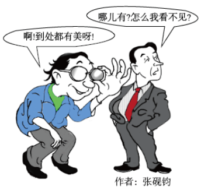

**2022年6月浙江省普通高校招生选考科目\
思想政治试题**

**一、判断题（本大题共10小题，每小题1分，共10分。判断下列说法是否正确，正确的请将答题纸相应题号后的T涂黑，错误的请将答题纸相应题号后的F涂黑）**

1\. 小明用数字人民币购买了“冰墩墩”玩偶，数字人民币执行了流通手段职能。（ ）

【答案】正确

【解析】

【详解】数字人民币是一种法定货币，所以可以履行货币的职能。小明用数字货币购买了冰墩墩玩偶，在此数字货币充当了商品交换的媒介，故这里的数字人民币在执行流通手段职能。故本题正确。

2\. 发展慈善等社会公益事业有助于推动浙江共同富裕示范区建设。（ ）

【答案】正确

【解析】

【详解】第三次分配是建立在自愿性的基础上，以募集，自愿捐赠和自主等慈善公益方式对社会资源和社会财富进行的分派，它依靠“精神力量”，奉行“道德原则”。第三次分配主要是对前两种分配的补充，对缩小社会贫富差距，实现更合理的收入分配和公平有重要意义，所以发展慈善等社会公益事业有助于推动浙江实现共同富裕。

故本题正确。

3\. 街道办事处和居民委员会作为基层群众性自治组织，在疫情防控中发挥着重要作用。（ ）

【答案】错误

【解析】

【详解】基层群众性自治组织指的是农村的村民委员会和城市的居民委员会，而街道办事处是政府派出机关，不是基层群众性自治组织，故题干表述错误。

故本题错误。

4\. 维护国家统一和民族团结是我国生存发展的政治基石。（ ）

【答案】错误

【解析】

【详解】维护国家统一和民族团结是我国公民的政治义务，我国生存发展的政治基石是四项基本原则，故题中表述错误。

故本题错误。

5\. 中国特色社会主义制度的最大优势是中国共产党领导。（ ）

【答案】正确

【解析】

【详解】中国共产党的领导是中国特色社会主义最本质特征，是中国特色社会主义制度的最大优势。

故本题正确。

6\. 网络流行语作为一种文化现象是经济社会的集中表现。（ ）

【答案】错误

【解析】

【详解】经济是基础，政治是经济的集中表现，文化是经济和政治的反映。故题干表述错误。

故本题错误。

7\. 国产电影《长津湖》受欢迎的重要原因在于其坚持以人民为中心的创作导向。（ ）

【答案】正确

【解析】

【详解】国产电影《长津湖》受欢迎的重要原因在于其坚持以人民为中心的创作导向，满足了人民的文化生活需求。

故本题正确。

8\. 一般说来，一个人的世界观影响其做事做人的方式方法。（ ）

【答案】正确

【解析】

【详解】世界观与方法论的关系是：世界观决定方法论，方法论体现世界观。故一般来说，一个人的世界观会影响其做人做事的方式方法。

故本题正确。

9\. 个性是被共性包含的个性。（ ）

【答案】错误

【解析】

【详解】共性与个性的关系是：共性寓于个性，通过个性来表现；个性包含共性，不包含共性的事物是没有的。故题中观点颠倒了个性与共性的关系。

故本题错误。

10\. 在某些时候，社会提供的客观条件并非是人们实现人生价值的前提。（ ）

【答案】错误

【解析】

【详解】社会提供客观条件是人们实现人生价值的前提，完全脱离社会的“个人奋斗”和“自我实现”实际上是不可能的,人的价值只能在社会中实现,所以题干表述不对。

故本题错误。

**二、选择题I（本大题共22小题，每小题2分，共44分。每小题列出的四个备选项中只有一个是符合题目要求的，不选、多选、错选均不得分）**

11\. 2022年4月，国际原油价格相较于2021年每桶上涨了几十美元。此时，生产者将会（ ）

A. 扩大生产规模 B. 压缩生产规模 C. 维持原有生产规模 D. 视获利情况而定生产规模

【答案】D

【解析】

【详解】ABCD：价格变动对生产有影响。题干中：国际原油价格上涨，如果其他条件不变，则国际原油生产者获利增加，一般情况下，会扩大生产规模，增加产量。但如果生产、加工原油的成本增加，这时候即使原油价格上涨，但原油生产者的利润可能保持不变，甚至还会下降，故这个时候，原油生产者可能会维持甚至压缩生产规模。因此，面对国际原油价格上涨，此时，生产者将会视获利情况而定生产规模，故ABC排除，D符合题意。

故本题选D。

12\. 近两年我国居民人均可支配收入平均实际增长5.1%，增速比疫情前的2019年放缓0.7%，居民的消费能力、消费意愿有所减弱。为了防止消费增速持续放缓，国家应（ ）

①进一步鼓励企业扩大投资

②鼓励居民将线上消费作为主要消费方式

③出台更多刺激消费的政策

④多渠道增加居民收入

A. ①② B. ①③ C. ②④ D. ③④

【答案】D

【解析】

【详解】①：题干问的是：为了防止消费增速持续放缓，所以国家最应该在消费（需求）端有所作为，故①不符合题意。

②：是线上消费还是线下消费，只是实现消费的方式不同而已，但这并不能有效防止消费增速持续放缓，故②排除。

③④：收入是消费的前提和基础。由题干得知：近两年随着居民人均可支配收入增速放缓，人们的消费能力和消费意愿有所减弱，所以国家应该出台更多刺激消费的政策，并想办法多渠道增加居民收入，故③④符合题意。

故本题选D。

13\. 下图为2012-2019年国有企业资产总额占国内社会资产总额的比例变化情况。

根据图中信息，可以看出（ ）

①国有经济的控制力逐渐增强

②国有企业资产总额在国内社会资产总额中的占比波动上升

③国有企业资产总额稳步提高

④公有资产总额在国内社会资产总额中的优势不断扩大

A. ①② B. ①④ C. ②③ D. ③④

【答案】C

【解析】

【详解】①：图中显示国有资产总额及占比近年来稳步提高，得不出控制力逐渐增强的结论。故①排除

②：图中显示近年来国有资产占比虽有小幅波动，但稳步提高。故②符合题意。

③：图中国有资产总额柱状图显示国有资产总额稳步提高。故③符合题意。

④：图中显示的是国有资产总额稳步提高，强调的是国有企业资产总额占国内社会资产总额的比例变化，而公有资产还包括集体资产，材料未涉及。故④排除。

故本题选C。

14\. 统计显示，2021年我国企业研发经费占全社会研发经费的76%，但目前企业研发投入主要集中在试验发展方面，创新链的中端应用研究投入不到位，前端的基础研究投入更是不足。为了使企业成为创新主体，增强企业核心竞争力，国家要（ ）

①对投入基础研究的企业实行税收优惠

②加大对所有企业研发活动的投入

③加大对企业研发活动的行政干预

④加强对知识产权的保护

A. ①③ B. ①④ C. ②③ D. ②④

【答案】B

【解析】

【详解】①④：为推动企业成为创新主体，提升竞争力，国家需要加大知识产权保护力度；加大对基础研究研发企业的税收支持力度。故①④符合题意。

②：研发投入主体是企业，国家通过税收等手段鼓励、刺激其加大投入，而不是不直接投入。故②排除。

③：企业是自主经营的市场主体，国家不能对其经营进行直接行政干预。故③表述错误。

故本题选B。

15\. 近年来，我国加快跨境电商、海外仓等新业态新模式的建设，大幅降低国际贸易专业化门槛，积极扩大优质产品和服务进口，深化通关便利化改革。这些举措（ ）

①有助于稳定对外贸易

②有助于构建新发展格局

③旨在扩大国内消费

④旨在扩大对外投资

A. ①② B. ①④ C. ②③ D. ③④

【答案】A

【解析】

【详解】①：国家上述举措有利于对外贸易稳定增长。故①符合题意。

②：国家的举措有助于构建国内国际双循环的新发展格局。故②符合题意。

③：材料目的不是为了扩大国内消费。故③排除。

④：这些举措有助于扩大优质产品和服务进口，而不是扩大对外投资。故④排除。

故本题选A。

16\. 疫情发生以来，面对上亿市场主体、数亿人就业创业，我国政府向企业实施了大规模的减税降费，其目的在于（ ）

①提高企业经济效益

②直接纾解企业困难

③优化经济结构

④“放水养鱼”，涵养税源

A. ①② B. ①③ C. ②④ D. ③④

【答案】C

【解析】

【详解】①：企业经济效益的提高受多种因素的影响。减税降费的目的在于帮助企业纾解困难，并不是提高企业经济效益。故①排除。

②：减税降费，减轻企业税负，直接纾解企业困难。故②符合题意。

③：减税降费，助企脱困，这和优化经济结构无直接关联。故③不符合题意。

④：减税降费，助企脱困，激发市场主体活力，稳定就业，促进经济发展，这能达到“放水养鱼”，涵养税源的目的。故④符合题意。

故本题选C。

17\. 我国推动义务教育优质均衡发展和城乡一体化，依据常住人口规模配置教育资源。这是（ ）

①保障公民政治权利的重要体现

②公民法定权利扩大的重要体现

③人权保障进步的重要体现

④我国国家性质的重要体现

A. ①② B. ①④ C. ②③ D. ③④

【答案】D

【解析】

【详解】①：我国公民的政治权利包括选举权和被选举权、监督权、政治自由。国家此举意在推动义务教育优质均衡发展和城乡一体化，不是保障公民政治权利。故①排除。

②：公民权利由宪法、法律规定，不能随意扩大。故②排除。

③④：国家推动义务教育优质均衡发展和城乡一体化，推动实现教育公平，是我国人权进步的重要体现；也体现我国是人民民主专政的社会主义国家。故③④符合题意。

故本题选D。

18\. 近年来，我国各级政府大力推进“互联网+政务服务”，从“数字政府”到“智慧治理”，从“只进一扇门”到“最多跑一次”，有效打通政务服务“最后一公里”，为解决企业和群众办事难、办事慢、办事繁等问题发挥了重要作用。这表明（ ）

①服务型政府的理念得到深入贯彻

②我国政府已成为一个全能型政府

③我国政府依法行政的效能不断提升

④我国政府的基本职能发生根本转变

A. ①② B. ①③ C. ②④ D. ③④

【答案】B

【解析】

【详解】①：政府不是万能的，我国政府不是全能型政府。故①表述错误。

②③：材料表明政府转变职能，推进服务型政府建设；同时依法行政水平、治理效能不断提升。故②③符合题意。

④：我国政府的基本职能是管理和服务。材料表明政府转变职能，提升服务水平和治理效能，但“政府的基本职能发生根本转变”表述错误。故④排除。

故本题选B。

19\. 近20年来，我国司法行政机关通过特定程序选任人民群众担任人民监督员，加强对有关国家机关及其组成人员履职情况的监督。这类监督属于（ ）

A. 国家司法机关的监督 B. 人民政协的监督 C. 国家监察机关的监督 D. 社会与公民的监督

【答案】D

【解析】

【详解】A：国家司法机关指的是人民法院、人民检察院，选任人民群众担任人民监督员进行的监督不属于国家司法机关的监督，A排除。

BC：材料强调的是社会和公民的监督，不涉及人民政协的监督，也不涉及国家监察机关的监督，BC排除。

D：材料中“选任人民群众担任人民监督员”以加强对有关国家机关及其组成人员履职情况的监督，这反映的是社会与公民的监督，D符合题意。

故本题选D。

20\. 《中华人民共和国地方各级人民代表大会和地方各级人民政府组织法》修改过程中，全国人大常委会多次征求全国人大代表有关部门、地方人大基层立法联系点、高校及研究机构的意见，两次向社会公众征求意见，最终形成法律文本，由十三届全国人大五次会议审议通过。这表明（ ）

①全国人大常委会依法行使最高立法权

②我国在立法过程中坚持全过程人民民主

③人民代表大会是我国的根本政治制度

④人民代表大会制度运行中坚持民主集中制原则

A. ①② B. ①③ C. ②④ D. ③④

【答案】C

【解析】

【详解】①：全国人大行使最高立法权，全国人大常委会依法行使国家立法权，①错误。

②④：地方组织法修订过程中，多次征求全国人大代表有关部门、地方人大基层立法联系点、高校及研究机构的意见，两次向社会公众征求意见，最终形成法律文本，由十三届全国人大五次会议审议通过，这表明我国在立法过程中坚持全过程人民民主，也表明人民代表大会制度运行中坚持民主集中制原则，②④正确。

③：人民代表大会制度是我国的根本政治制度，人民代表大会是国家权力机关，③错误。

故本题选C。

21\. 党的十八大以来，中共中央召开或委托有关部门召开政党协商会议170余次，先后就国家重大问题同党外人士真诚协商、听取意见。各民主党派中央、无党派人士深入考察调研，提出书面意见建议730余件，许多转化为国家重大决策。这表明（ ）

①协商民主可以提升人民民主效能

②协商民主有助于推动决策科学化和民主化

③党的主张通过法定程序上升为国家意志

④共产党和民主党派通力合作、共同执政

A. ①② B. ①④ C. ②③ D. ③④

【答案】A

【解析】

【详解】①②：召开政党协商会议，就国家重大问题同党外人士真诚协商、听取意见，各民主党派中央、无党派人士深入考察调研，提出书面意见建议，许多转化为国家重大决策，这表明我国的协商民主可以提升人民民主效能，我国的协商民主有助于推动决策科学化和民主化，①②正确。

③：材料未涉及全国人大或其常委会，也就不能表明“党的主张通过法定程序上升为国家意志”，③排除。

④：中国共产党是执政党，各民主党派是参政党，“共同执政”说法错误，④排除。

故本题选A。

22\. 习近平主席强调，中美关系不是一道是否搞好的选择题，而是一道如何搞好的必答题。中美双方应建立相互尊重、和平共处、合作共赢的战略框架。这是基于（ ）

A. 竞争、合作与冲突是国际关系的基本形式

B. 建立公正合理的国际政治经济新秩序是两国共同的战略目标

C. 中美两国的根本利益是一致的

D. 中美两国存在着广泛共同利益

【答案】D

【解析】

【详解】A：竞争、合作与冲突是国际关系的基本形式，这与题干构不成因果关系，材料只强调了中美两国的合作，A排除。

B：中国主张建立公正合理的国际政治经济新秩序，美国推行霸权主义和强权政治，B错误。

C：中美两国可以有共同的国家利益，但其根本利益不可能一致，C错误。

D：中美双方应建立相互尊重、和平共处、合作共赢的战略框架，因为中美两国存在着广泛的共同利益，D正确。

故本题选D。

23\. “天下治乱，系乎风俗”是我国古人总结的一句有关廉洁文化的警句。这一警句对我们的启示有（ ）

①要重视和发挥社会风俗对廉洁政治生态形成的潜移默化作用

②弘扬传统文化对当今廉政建设具有重要的现实意义

③植根于优秀传统文化的廉洁文化是实现政治清明的宝贵资源

④廉洁文化可以为广大党员干部提供基本的行为准则

A. ①② B. ①④ C. ②③ D. ③④

【答案】B

【解析】

【详解】①④：“天下治乱，系乎风俗”意思是天下是安定还是混乱，取决于社会风俗，这启示我们要重视和发挥社会风俗对廉洁政治生态形成的潜移默化作用，对广大党员干部而言，廉洁文化可以为广大党员干部提供基本的行为准则，①④符合题意。

②：传统文化既有精华，也有糟粕，不能一味弘扬，②错误。

③：中国特色社会主义文化源自于中华民族五千多年文明历史所孕育的中华优秀传统文化，熔铸于党领导人民在革命、建设、改革中创造的革命文化和社会主义先进文化，植根于中国特色社会主义伟大实践，应该是廉洁文化源自于中华优秀传统文化，植根于中国人民的社会实践，③错误。

故本题选B。

24\. 阿木爷爷不用一根钉子、一滴胶水，靠着榫与卯之间的咬合支撑，就能做出鲁班凳、苹果锁、将军案和拱形桥等精致木器。阿木爷爷凭借精湛绝伦的工艺迅速在网络上走红，他的作品不仅让国人啧啧称奇，也让许多外国人叹为观止。这从一个侧面表明中华文化（ ）

①通过传播，方显价值

②既是民族的又是世界的

③独树一帜，独领风骚

④既相对稳定又顺时而变

A. ①③ B. ①④ C. ②③ D. ②④

【答案】C

【解析】

【详解】①：中华文化的价值并不是只有通过传播才能显现，“通过传播、方显价值”说法过于绝对化，①错误。

②：阿木爷爷的精致木器制作工艺表明中华文化是民族的，“他的作品不仅让国人喷啧称奇，也让许多外国人叹为观止”又表明中华文化也是世界的，②符合题意。

③：阿木爷爷的精致木器制作工艺表明中华文化独树一帜，独领风骚，③正确切题。

④：材料不能体现“顺时而变”，④排除。

故本题选C。

25\. 随着物质生活水平的提高，人们在文化生活中既可选择“单向度视听”，也可选择“沉浸式体验”；既可以成为“喝彩叫好的看客”，也可以成为“亲身参与的创客”。人们在文化生活中可以有多种选择的原因是（ ）

①物质文明和精神文明同步发展

②市场经济发展激发了文化市场活力

③科学技术促进了大众传媒的发展

④人们辨别不同性质文化的眼力不断提高

A. ①② B. ①④ C. ②③ D. ③④

【答案】C

【解析】

【详解】①：应该是物质文明和精神文明协调发展，而不是“同步发展”，①错误。

②：随着物质生活水平的提高，人们在文化生活中可以有多种选择，这说明市场经济发展激发了文化市场活力，②符合题意。

③：“单向度视听”、“沉浸式体验”、“喝彩叫好的看客”、“亲身参与的创客”，这些文化活动的形式说明了科学技术促进了大众传媒的发展，③符合题意。

④：材料反映人们参与文化生活、进行文化消费的方式，而未涉及文化的性质问题，也就不能体现人们辨别不同性质文化的眼力是否在不断提高，④排除。

故本题选C。

26\. 某研究中心创立的古籍自动整理系统，既可以对古籍内容进行深度处理，又可以将大部头的典籍、海量的文字转化为一幅幅知识图谱，如从《宋元学案》中自动提取“弟子”“家学”“交游”等人物关系，可视化呈现“宋代学术关系网络图”，让古籍“活起来”。这说明（ ）

①现代科技的运用有利于文化资源的收集、选择、传递和储存

②文化创新离不开对良莠并存的中外文化进行批判性继承

③现代科技的运用有利于推动中华优秀传统文化的创造性转化

④文化创新必须以中华优秀传统文化、革命文化为根基

A. ①② B. ①③ C. ②④ D. ③④

【答案】B

【解析】

【详解】①③：某研究中心创立的古籍自动整理系统，既可以对古籍内容进行深度处理，又可以将大部头的典籍、海量的文字转化为一幅幅知识图谱，说明现代科技的运用有利于文化资源的收集、选择，传递和储存；从《宋元学案》中自动提取“弟子”“家学”“交游”等人物关系，可视化呈现“宋代学术关系网络图”，让古籍“活起来”。这说明现代科技的运用有利于推动中华优秀传统文化的创造性转化，①③正确。

②：文化创新离不开对中华传统文化的批判性继承，②排除。

④：对传统文化的批判性继承是文化创新的根基，④排除。

故本题选B。

27\. 下列观点中属于古代朴素唯物主义思想的有（ ）

①原子和虚空是世界的本原

②宇宙便是吾心，吾心便是宇宙

③形存则神存，形谢则神灭

④不唯上、不唯书、只唯实

A. ①② B. ①③ C. ②④ D. ③④

【答案】B

【解析】

【详解】①：原子和虚空是世界的本原，意思是世界的本原是不可再分的物质微粒，将物质与物质的具体形态等同起来，属于古代朴素唯物主义，①正确。

②：宇宙便是吾心，吾心便是宇宙，认为“心”是万物的本原，属于主观唯心主义，②排除。

③：形存则神存，形谢则神灭 ，承认世界的本原是物质的，但将物质与物质的具体形态等同起来，属于古代朴素唯物主义，③正确。

④：不唯上、不唯书、只唯实，意思是要从实际出发，实事求是地研究和处理问题，属于辩证唯物主义，④排除。

故本题选B。

28\. 受疫情影响，一些人滋生出悲观情绪。然而，消极悲观对生活不会有帮助。正像阿尔文·托夫勒在《第三次浪潮》中所说：“悲观无用，不如思考蓝图，闯过布满暗礁的海。”这是因为（ ）

①高昂的精神可以催人向上使人奋进

②量的积累一定导致事物原有性质的改变

③事物发展的前途是光明的

④联系是普遍的、客观的、必然的

A. ①② B. ①③ C. ②④ D. ③④

【答案】B

【解析】

【详解】①③：“悲观无用，不如思考蓝图，闯过布满暗礁的海。”这是因为高昂的精神可以催人向上使人奋进，事物发展的前途是光明的， ①③正确。

②：量的积累达到一定程度才会发生质变，改变原有事物的性质，②排除。

④：联系是普遍的、客观的、多样性的。联系有偶然联系也有必然联系，不一定是必然的，④排除。

故本题选B。

29\. 历经半个多世纪探索，“枫桥经验”铺就了一座座连接党心民心的连心桥，巩固了公安民警与人民群众鱼水深情的警民桥，架设了社会和谐、乡村和美、百姓和顺美好愿景的平安桥。如今，“枫桥经验”在全国各地生根发芽，开花结果。这告诉我们（ ）

①经过实践检验的正确认识对社会发展起积极的推动作用

②立足自身需要可以建立新的具体联系

③认识是一个由实践到认识，再从认识到实践的反复过程

④人可以认识、把握、创造和利用社会规律造福人类

A. ①③ B. ①④ C. ②③ D. ②④

【答案】A

【解析】

【详解】①③：“枫桥经验”架设了社会和谐、乡村和美、百姓和顺美好愿景的平安桥。如今，“枫桥经验”在全国各地生根发芽，开花结果。这告诉我们经过实践检验的正确认识对社会发展起积极的推动作用，认识是一个由实践到认识，再从认识到实践的反复过程，①③正确。

②：联系是客观的，人们可以根据事物固有的联系，建立新的具体联系。“立足自身需要”的说法错误，②排除。

④：规律是客观的，人不能创造规律，④排除。

故本题选A。

30\. 随着脱贫攻坚取得全面胜利，不少曾经的扶贫工作队队长，无缝衔接担任了乡村振兴工作队队长。他们面临从以前管好“每棵苗”到现在抚育“一片林”、从以前作答“客观题”到现在应对“主观题”、从以前“串门多”到现在“出门多”等一系列挑战。从哲学上看，这是基于（ ）

①发展的不同阶段有不同的矛盾

②主要矛盾发生变化

③任何事物都是主观与客观的具体的历史的统一

④认识具有反复性、无限性、上升性

A. ①② B. ①④ C. ②③ D. ③④

【答案】A

【解析】

【详解】①②：扶贫攻坚全面胜利前后，扶贫干部的角色不同，工作任务不同，从哲学上看这是基于发展的不同阶段有不同的矛盾，主要矛盾发生变化，①②正确切题；

③：真理是主观与客观具体的历史的统一，③说法错误；

④：材料涉及的是扶贫实践，不是认识，不体现认识的特点，④不选。

故本题选A。

31\. 下列选项中与下边漫画哲学寓意最相符合的是用（ ）

A. 不同的人对同一事物一定有不同认识

B. 把握事物的本质比认识事物的现象更重要

C. 价值观影响人们对事物的认识和评价

D. 通过“思维的眼晴”人们就能揭示事物的本质和规律

【答案】C

【解析】

【详解】C：漫画反映，有人善于发现美，而有人却看不见美的存在，这说明价值观影响人们对事物的认识和评价，C正确切题;

A：不同的人对同一事物不一定有不同的认识，A说法错误；

B：材料涉及的是不同的人对同一事物的不同认识，并不涉及现象和本质的相关内容，而且把握事物的本质比认识事物的现象无法比较哪个更重要，B不选；

D：“思维的眼睛”是人们揭示事物的本质和规律的必要条件，不是充分条件，D不选。

故本题选C。

32\. 党员干部始终要把人民群众安危冷暖放在心上，及时回应民生关切，着力解决人民群众普遍关心关注民生问题，不断满足人民对美好生活的向往。其蕴含的哲理是（ ）

①人民群众是社会历史的主体

②社会意识是对社会存在的反映

③群众路线是我们党的生命线和根本工作路线

④人民群众能够主宰社会发展趋势

A. ①③ B. ①④ C. ②③ D. ②④

【答案】A

【解析】

【详解】①③：材料强调是党员干部要坚持以人民为中心，这蕴含的哲理是人民群众是社会历史的主体，群众路线是我们党的生命线和根本工作路线，①③正确入选；

②：材料并未体现社会意识是对社会存在的反映，②不选；

④：社会发展的趋势尤其客观规律，并不是由人民群众主宰，④不选。

故本题选A。

**三、选择题II（本大题共5小题，每小题3分，共15分。每小题列出的四个备选项中只有一个是符合题目要求的，不选、多选、错选均不得分）**

33\. 下图为一张未完成的英国和美国政治体制部分内容比较表。请你根据两国政治体制的实际，在标有①②③④空格中依次应填入的内容是（ ）

<table>
<colgroup>
<col style="width: 28%" />
<col style="width: 28%" />
<col style="width: 42%" />
</colgroup>
<thead>
<tr>
<th style="text-align: left;">
国别

内容
</th>
<th style="text-align: left;">英国</th>
<th style="text-align: left;">美国</th>
</tr>
</thead>
<tbody>
<tr>
<td style="text-align: left;">国家元首</td>
<td style="text-align: left;">国王</td>
<td style="text-align: left;">总统</td>
</tr>
<tr>
<td style="text-align: left;">元首产生的方式</td>
<td style="text-align: left;">世袭</td>
<td style="text-align: left;">选举</td>
</tr>
<tr>
<td style="text-align: left;">元首任期</td>
<td style="text-align: left;">终身制</td>
<td style="text-align: left;">任期制</td>
</tr>
<tr>
<td style="text-align: left;">元首的实权</td>
<td style="text-align: left;">①</td>
<td style="text-align: left;">有</td>
</tr>
<tr>
<td style="text-align: left;">政府首脑</td>
<td style="text-align: left;">首相</td>
<td style="text-align: left;">总统</td>
</tr>
<tr>
<td style="text-align: left;">政府产生方式</td>
<td style="text-align: left;">②</td>
<td style="text-align: left;">总统任命</td>
</tr>
<tr>
<td style="text-align: left;">国家权力中心</td>
<td style="text-align: left;">议会</td>
<td style="text-align: left;">③</td>
</tr>
<tr>
<td style="text-align: left;">行政权</td>
<td style="text-align: left;">内阁</td>
<td style="text-align: left;">总统</td>
</tr>
<tr>
<td style="text-align: left;">立法权</td>
<td style="text-align: left;">议会</td>
<td style="text-align: left;">国会</td>
</tr>
<tr>
<td style="text-align: left;">政府首脑与议会的关系</td>
<td style="text-align: left;">④</td>
<td style="text-align: left;">总统不对国会负责并与国会相互制约</td>
</tr>
</tbody>
</table>

A. 无、国王任命、国会、首相要向议会负责

B. 有、首相组阁、总统、首相对议会负责

C. 有、党首组阁、国会、内阁对议会负责

D. 无、首相组阁、总统、首相要向议会负责

【答案】D

【解析】

【详解】ABCD：英国是君主立宪制国家，国家元首是国王，国王无实权。英国实行代议制，政府以议会为基础产生，政府首脑从政见基本相同的议员中挑选阁员人选。政府总揽国家的行政权力，政府首脑向议会负责。美国是总统制国家，总统直接行使国家最高行政权力，总统是国家权力中心，D正确，ABC错误。

故本题选D。

34\. 近年来，美国社会在疫情防控、堕胎权利、枪支管控等问题上日趋对立，民主、共和两党在基础设施建设、社会福利法案等涉及经济民生立法方面的政治斗争更加激烈，国会几近失能。共和党领袖甚至在国会发表长达8.5小时的演讲，以阻止民主党所提法案的表决。这表明（ ）

①美国的民主政治日益脱离公众的意愿和社会需要

②美国是一个实行资产阶级两党制的典型国家

③美国两党制是不同利益集团之间相互监督和制衡的机制保障

④美国政治制度的阶级局限性和消极作用是显而易见的

A. ①② B. ①④ C. ②③ D. ③④

【答案】B

【解析】

【详解】①：美国民主、共和两党在疫情防控、枪支管控等问题上日趋对立，在基础设施建设等民生方面政治斗争更加激烈，表明美国的民主政治日益脱离群众的意愿和社会需要，①符合题意。

②：材料强调的是美国两党制存在的问题，没有强调美国是一个实行资产阶级两党制的国家，②不符合题意。

③：美国两党制是资产阶级不同利益集团之间相互监督和制衡的机制保障，③排除。

④：美国两党制的政治斗争表明了美国政治制度的阶级局限性和消极作用越发显现，④符合题意。

故本题选B。

35\. 下列行为符合我国法律规定的是（ ）

①甲以商业秘密方式保护其发明，其他人实施与甲相同的发明均构成侵权

②乙经乐曲著作权人授权，将该乐曲作为自己健身操伴奏并走红网络

③丙将其创作的歌剧著作财产权转让给某公司，该公司将歌剧的表演权转让给他人

④丁公司生产的电动单车使用类似某全球知名汽车“BMW”商标标识

A. ①② B. ①④ C. ②③ D. ③④

【答案】C

【解析】

【详解】①：发明人如果选择以商业秘密方式来保护其发明，则只要该发明保密得当，就可以一直受保护。但是，一旦他人独立做出相同的发明，或者以正当方式获得该技术信息，则他人可以实施该发明，不构成侵权，①错误。

②：使用著作权人作品的，必须经过著作权人的同意，因此，该选项符合我国法律规定，②正确。

③：著作财产权包括对作品的使用、收益、处分权。著作权人可以将著作财产权转让给他人，受让人可以再次转让著作财产权，③正确。

④：商标注册人享有注册商标专用权，丁公司在生产的电动车上使用类似某全球知名汽车的商标标识，侵犯了该企业的商标专用权，④错误。

故本题选C。

36\. 2019年1月，张某在H市购买一处房产。2021年5月，张某与王某结婚，双方书面约定：婚姻关系存续期间，购买的不动产归共同所有，取得的其他财产归各自所有。2021年9月，王某在N市购买一处房产。2022年3月，张某发表小说作品获稿酬5万元，王某获得其父母赠与小车一辆。关于财产的归属，下列说法正确的是（ ）

A. H市和N市房产归张某、王某共同所有

B. H市房产归张某所有，N市房产归王某所有

C. 稿酬5万元和小车归张某、王某共同所有

D. 稿酬5万元归张某所有，小车归王某所有

【答案】D

【解析】

【详解】A：H市的房产是婚前张某所购财产，应归张某所有；N市房产是婚后财产，应归张某、王某共同所有，A错误。

B：N市房产是婚后财产，应归张某、王某所有，B错误。

C：按双方约定财产的规定，稿酬5万元归张某所有，C错误。

D：稿酬5万元归张某所有，王某获得的父母赠与的小车归王某所有，D正确。

故本题选D。

37\. 吴某家住西城区，在东城区经营一家炒货店，经调查认定，吴某在经营中存在虚假宣传事实，违反了《中华人民共和国广告法》相关规定。据此，东城区市场监督局对吴某作出行政处罚。吴某不服，向法院提起诉讼。下列说法正确的是（ ）

①本案由东城区市场监督局所在地基层人民法院管辖

②吴某可以委托一至二名律师作为诉讼代理人帮助自己诉讼

③本案既可以由东城区人民法院管辖，也可以由西城区人民法院管辖

④吴某如果对判决不服，还可以采取行政复议方式解决争议

A. ①② B. ①③ C. ②④ D. ③④

【答案】A

【解析】

【详解】①：行政案件原则上，由最初作出具体行政行为的行政机关所在地法院管辖。该案例中东城区市场监督局对吴某作出行政处罚，应由东城区市场监督局所在地基层人民法院管辖，①正确。

②：行政诉讼代理人，是指依照法律规定，或由法院指定，或受当事人委托，以当事人的名义，在代理权限范围内为当事人进行行政诉讼活动，但其诉讼法律后果由当事人承受的的人。《行政诉讼法》第29条规定:“当事人、法定代理人可以委托一至二人代为诉讼”。因此，吴某可以委托一至二名律师作为诉讼代理人帮助自己诉讼，②正确。

③：本案应由东城区基层人民法院管辖，③错误。

④：对法院判决不服不能申请行政复议，但依法可提起上诉和再审程序，④错误。

故本题选A。

**四、综合题（本大题共4小题，共31分）**

38\. 近年来，全国统一大市场建设工作取得重要进展，但实践中仍然存在市场分割、地方保护和市场监管规则不统一等问题。2022年4月，《中共中央国务院关于加快建设全国统一大市场的意见》发布，提出了立破并举的措施。从立的角度，明确要抓好“五统一”，即强化市场基础制度规则统一、推进市场设施高标准联通、打造统一的要素和资源市场、推进商品和服务市场高水平统一、推进市场监管公平统一。从破的角度，明确要进一步规范不当市场竞争和市场干预行为，打破各种显性、隐性壁垒。

结合材料，回答下列问题：

（1）运用《经济生活》中“生产与消费”“市场秩序”的有关知识，说明《意见》提出的立破举措的合理性。

（2）运用《生活与哲学》中对立统一的有关知识，说明建立统一大市场要坚持立破并举的理由。

【答案】（1）交换是连接生产和消费的桥梁和纽带。《意见》抓好“五统一”，有助于扩大交换范围和提高交换效率，进而促进生产和消费。公平、公正的市场秩序，统一开放、竞争有序的现代市场体系，是使市场在资源配置中起决定性作用的基础。良好的市场秩序依赖公平开放透明的市场规则来维护。《意见》立破并举，统一规则、打破壁垒，有助于形成良好的营商环境和竞争秩序，有利于企业公平竞争，实现资源的合理配置，促进我国经济高质量发展。

（2）矛盾双方既相互排斥、相互对立，又相互依赖、相互渗透在一定条件下相互转化，由此推动事物的变化发展。在我国经济发展过程中，市场统一和市场分割是对立统一的关系。基于矛盾固有的两个基本属性，《意见》坚持立破并举，破壁垒抓统一，旨在创造条件推动市场分割向市场统一的转化，由此推动我国经济发展。

【解析】

【分析】背景素材：立破并举，加快建设全国统一大市场

考点考查：生产与消费、市场秩序、对立统一

能力考查：获取和解读信息、调度和运用知识、描述和阐释事物

核心素养：科学精神

【小问1详解】

第一步：审设问。（明确主体、作答范围、问题限定和作答角度。）

本题需要运用《经济生活》中“生产与消费”“市场秩序”的有关知识，说明《意见》提出的立破举措的合理性。回答此类问题一般按照“必要性+重要性+意义”作答。

第二步：审材料。（通过标点符号、段落等，提取材料有效信息。）

有效信息①：“五统一”。→可联系交换是连接生产和消费的桥梁和纽带。

有效信息②：立破并举的措施。→可联系公平、公正的市场秩序，统一开放、竞争有序的现代市场体系重要性。

有效信息③：立破并举的目的。→可得出良好的市场秩序依赖公平开放透明的市场规则来维护及其意义。

第三步：整合信息，组织答案。

得分点①： 交换是连接生产和消费的桥梁和纽带+分析材料。

得分点②： 公平、公正的市场秩序，统一开放、竞争有序的现代市场体系，是使市场在资源配置中起决定性作用的基础+分析材料。

得分点③： 良好的市场秩序依赖公平开放透明的市场规则来维护+分析材料。

【小问2详解】

第一步：审设问。（明确主体、作答范围、问题限定和作答角度。）

本题需要调用运用《生活与哲学》中对立统一的有关知识，说明建立统一大市场要坚持立破并举的理由。

回答此类问题一般按照“必要性+重要性+意义”作答。

第二步：审材料。（通过标点符号、段落等，提取材料有效信息。）

有效信息①：市场统一和市场分割是对立统一的关系。→可联系矛盾双方既相互排斥、相互对立，又相互依赖、相互渗透。

有效信息②：《意见》坚持立破并举，破壁垒抓统一。→可联系矛盾双方在一定条件下相互转化，由此推动事物的变化发展。

第三步：整合信息，组织答案。

得分点①： 矛盾双方既相互排斥、相互对立，又相互依赖、相互渗透+分析材料。

得分点②：矛盾双方在一定条件下相互转化，由此推动事物的变化发展+分析材料。

【点睛】为什么（原因）类：

【题型特点】此类一般设问以“为什么说”，“为什么要”等形式呈现。

【解题技巧】一般按照“必要性+重要性+意义”作答。一般情况下要回答“这样说”“这样做”的依据，意义（重要性）、必要性、可能性等，有时也要回答不这样做的危害。解答中，一般应由近及远，由直接到间接，先经济后政治有次序、有条理展开说明。

39\. 黄震是2022年中国青年五四奖章个人获得者。他在北大读大三时，恰逢中国第一个载人飞船成功发射。从那时起，黄震就把投身航天事业作为自己报效祖国的最好选择。大学毕业后，他主动选择到航天科技集团五院工作。他真诚待人、虚心好学、兢兢业业，迅速成长为技术骨干，带领团队进行我国空间站技术攻关。2013年五四青年节，习近平总书记专门到航天城，勉励广大航天人为实现中华民族伟大复兴的中国梦而奋斗。黄震和他的团队深受鼓舞，更加坚定了毕生从事航天事业的信念。现在，黄震正带领他的团队为早日实现我国载人登月梦想进行集智创新、日夜攻关。

结合材料，运用《文化生活》中“担当民族复兴大任的时代新人”的有关知识，谈谈黄震逐梦航天动人事迹对青年学生的启示。

【答案】（1）黄震在大学期间就立志从事航天事业，后来受到总书记鼓舞，更加坚定理想信念，启示青年学生要志存高远，树立中国特色社会主义共同理想。\
（2）黄震立志报国、真诚待人、虚心好学、兢兢业业，迅速成长为技术骨干并带领团队进行技术攻关，启示青年学生要把社会主义核心价值观作为自己的价值准则，提高个人的思想道德修养和科学文化素养。\
（3）黄震用热血青春、攻坚克难，勇攀航天事业新高峰，启示青年学生要脚踏实地、重在行动，成为担当民族复兴大任的时代新人。

【解析】

【分析】背景素材：黄震获中国青年五四奖章。

考点考查：培育担当民族复兴大任的时代新人。

能力考查：获取和解读信息，调动和运用知识，描述和阐述事物。

核心素养：政治认同、科学精神、公共参与。

【详解】第一步：审设问。明确主体、作答范围、问题限定和作答角度。

本题的设问主体为 青年学生，需要调用《文化生活》中“担当民族复兴大任的时代新人”的有关知识，分析黄震逐梦航天动人事迹对青年学生的启示，属于启示类主观题。考生作答时，首先需要解读材料中黄震逐梦航天动人事迹的具体内容有哪些，再根据其事迹谈启示

第二步：审材料。通过标点符号、段落等，提取材料有效信息。

有效信息①：从那时起，黄震就把投身航天事业作为自己报效祖国的最好选择；大学毕业后，他主动选择到航天科技集团五院工作；更加坚定了毕生从事航天事业的信念→可联系：坚定理想信念。

有效信息②：他真诚待人、虚心好学、兢兢业业，迅速成长为技术骨干，带领团队进行我国空间站技术攻关→可联系：提高个人的思想道德修养和科学文化索养，从公民层面践行社会主义核心价值观。

有效信息③：集智创新、日夜攻关→可联系：脚踏实地、重在行动。

第三步：整合信息，组织答案。

得分点①：坚定理想信念，志存高远。

得分点②：提高个人的思想道德修养和科学文化素养，践行社会主义核心价值观。

得分点③：脚踏实地、重在行动。

【点睛】非选择题的审题要求：

（1）审设问：一是明确题目考查的知识范围和考查意图，正确联想相关知识，形成综合性的信息认识；二是明确设问的指向性和规定性，分清题干要求答题的类别，即回答“是什么”、或“为什么”、或“怎么样”、或“怎样体现”中哪一类。

（2）审主体：明确主体有几个，不同主体的言论和行为各是什么。这些应从解读设问和材料中获取。

（3）审材料：获取材料中有效信息，抓住关键词、关键句子。这样做，一是为了正确联想相关知识，二是进一步明确答题的主体，不同主体的言论和行为各是什么；三是关键的句子要作为“材料语言”写入答案要点中。审材料实质上就是为了进一步证实“审设问和审主体”的正确与否。

40\. 2022年2月4日发表的“中俄联合声明”，呼吁捍卫和平、发展、公平、正义、民主、自由的全人类共同价值，对一系列重大国际问题明确表达了两国共同的看法，强调双方倡导并推动建设新型大国关系。俄乌冲突爆发后，鉴于俄乌危机的复杂历史经纬和俄罗斯对乌克兰发动“特别军事行动”的实际，中国政府明确提出遵守联合国宪章宗旨和原则、尊重和保障各国主权和领土完整，照顾当事方合理安全关切，以和平方式解决争端，构建均衡、有效、可持续的欧洲安全机制等四点意见；在联大第11次紧急特别会议表决要求俄罗斯“立即、彻底、无条件”从乌克兰撤军时投了弃权票；通过多种途径和方式积极寻求俄乌危机的和平解决。

结合材料，运用《国家和国际组织常识》中的有关知识，回答下列问题：

（1）联合国的宗旨有哪些？

（2）面对俄乌危机和冲突，中国政府为什么提出上述四点意见并积极寻求俄乌危机的和平解决？

【答案】（1）维持国际和平及安全；发展国际间以尊重人民平等权利及自决原则为基础的友好关到系；促成国际合作，以解决国际间属于经济、社会文化和人类福利性质之国际问题；构成一个协调各国行动的中心，以达成上述共同目的。

（2）俄罗斯发动对乌克兰“特别军事行动”一定程度上挑战了联合国及其会员国应遵行的原则，如各会员国必须以和平方式解决国际争端，各会员国必须避免使用武力或以武力相威胁，不侵害别国的领土完整、政治独立等。俄乌冲突有其复杂的历史经纬，不能把俄乌冲突的原因和责任简单地归结于俄罗斯国。事实上，北约东扩威胁俄罗斯的安全是俄乌危机的主要原因。中国是联合国重要成员，是负责任的大国，历来坚持遵守和维护联合国宪章的宗旨和原则，坚持在人类和平与发展事业中发挥建设性作用，坚持以多边主义实现共同安全。

【解析】

【分析】背景素材：俄乌冲突。

考点考查：联合国的宗旨及原则，中国与联合国。

能力考查：获取和解读信息，调动和运用知识，描述和阐述事物。

核心素养：政治认同、法治意识、科学精神。

【小问1详解】

第一步：审设问。明确主体、作答范围、问题限定和作答角度。

本题属于典型的简答题型，考生根据教材知识记忆直接作答即可。

第二步：审材料。通过标点符号、段落等，提取材料有效信息。

有效信息：联合国的宗旨→可联系：维持国际和平及安全；发展国际间以尊重人民平等权利及自决原则为基础的友好关到系；促成国际合作，以解决国际间属于经济、社会文化和人类福利性质之国际问题；构成一个协调各国行动的中心，以达成上述共同目的。

第三步：整合信息，组织答案。

得分点：维持国际和平及安全；发展国际间以尊重人民平等权利及自决原则为基础的友好关到系；促成国际合作，以解决国际间属于经济、社会文化和人类福利性质之国际问题；构成一个协调各国行动的中心，以达成上述共同目的。

【小问2详解】

（2）第一步：审设问。明确主体、作答范围、问题限定和作答角度。

本题的设问主体为中国政府，需要调用《国家和国际组织常识》中的有关知识，分析中国政府提出上述四点意见并积极寻求俄乌危机的和平解决的原因，属于原因类主观题，作答时，考生首先需要明确中国政府提出了哪四点意见，再根据每条意见具体阐释原因。

第二步：审材料。通过标点符号、段落等，提取材料有效信息。

有效信息①：中国政府明确提出遵守联合国宪章宗旨和原则、尊重和保障各国主权和领土完整→可联系：俄罗斯发动对乌克兰“特别军事行动”一定程度上挑战了联合国及其会员国应遵行的原则、北约东扩威胁俄罗斯的安全。

有效信息②：照顾当事方合理安全关切→可联系：不侵害别国的领土完整、政治独立，不干涉他国内政。

有效信息③：以和平方式解决争端→可联系：联合国及其会员国应遵行避免使用武力或以武力相威胁、以和平方式解决国际争端的原则。

有效信息④：构建均衡、有效、可持续的欧洲安全机制→可联系：中国是负责任的大国，坚持多边主义。

第三步：整合信息，组织答案。

得分点①：俄罗斯发动对乌克兰“特别军事行动”一定程度上挑战了联合国及其会员国应遵行的原则，如如各会员国必须以和平方式解决国际争端，各会员国必须避免使用武力或以武力相威胁，不侵害别国的领土完整、政治独立。

得分点②：北约东扩威胁俄罗斯的安全。

得分点③：中国是负责任的大国，坚持多边主义。

【点睛】非选择题的审题要求：

（1）审设问：一是明确题目考查的知识范围和考查意图，正确联想相关知识，形成综合性的信息认识；二是明确设问的指向性和规定性，分清题干要求答题的类别，即回答“是什么”、或“为什么”、或“怎么样”、或“怎样体现”中哪一类。

（2）审主体：明确主体有几个，不同主体的言论和行为各是什么。这些应从解读设问和材料中获取。

（3）审材料：获取材料中有效信息，抓住关键词、关键句子。这样做，一是为了正确联想相关知识，二是进一步明确答题的主体，不同主体的言论和行为各是什么；三是关键的句子要作为“材料语言”写入答案要点中。审材料实质上就是为了进一步证实“审设问和审主体”的正确与否。

41\. 张某与李某签订合同，将其经营的丝绸门店转卖给李某。合同约定：李某需要在一年内按月分期付款向张某付清门店费用；李某将自家一件名贵古董交给张某予以质押。李某按照约定支付了一个月的款项后，又与他人签订丝绸门店（该门店与张某门店同街相望）购买合同。嗣后，李某不再按约向张某支付款项。张某决定提前终止合同，私下将名贵古董卖给了王某，王某当场取走该名贵古董。

结合本案，运用《生活中的法律常识》中的有关知识，回答下列问题：

（1）从合同履行的原则角度，说明张某决定提前终止合同的合法性。

（2）指出本案中名贵古董所有权的最终归属，并说明理由。

【答案】（1）根据本案事实，李某违反了合同履行的诚实信用原则和全面履行原则（又称正确履行原则或适当履行原则）

（2）本案中名贵古董的最终所有权人为王某。根据我国民法规定，名贵古董属于动产，交付即取得所有权。王某应取得名贵古董的合法所有权。

【解析】

【分析】背景素材：生活中的案例

考点考查：合同履行的原则、动产所有权的取得方式

能力考查：描述和阐述事物的能力

核心素养：法治意识

【小问1详解】

第一步：审设问，明确主体、作答范围、问题限定和作答角度。

本题以生活中的案例为话题设置相关情境，从《生活中的法律常识》角度设置问题，考查学生对合同履行的原则知识的把握。

第二步：审材料，通过标点符号、段落等，提取材料有效信息。

有效信息①：李某按照约定支付了一个月款项后，又与他人签订丝绸门店→可联系违反了合同履行的诚实信用原则；

有效信息②：嗣后，李某不再按约向张某支付款项→联系违反了合同履行的全面履行原则。

第三步：整合信息，组织答案。

得分点：合同履行的原则：诚实信用原则、全面履行原则、协作履行原则。

【小问2详解】

第一步：审设问，明确主体、作答范围、问题限定和作答角度。

本题以生活中的案例为话题设置相关情境，从《生活中的法律常识》角度设置问题，考查学生对动产所有权的取得方式知识的把握。

第二步：审材料，通过标点符号、段落等，提取材料有效信息。

有效信息：张某私下将名贵古董卖给了王某，王某当场取走该名贵古董→可联系根据我国民法规定，名贵古董属于动产，交付即取得所有权。王某应取得名贵古董的合法所有权。

第三步：整合信息，组织答案。

得分点：案中名贵古董的最终所有权人为王某；动产的取得方式：交付即取得所有权。

【点睛】非选择题的审题要求：

（1）审设问：一是明确题目考查的知识范围和考查意图，正确联想相关知识，形成综合性的信息认识；二是明确设问的指向性和规定性，分清题干要求答题的类别，即回答“是什么”、或“为什么”、或“怎么样”、或“怎样体现”中哪一类。

（2）审主体：明确主体有几个，不同主体的言论和行为各是什么。这些应从解读设问和材料中获取。

（3）审材料：获取材料中有效信息，抓住关键词、关键句子。这样做，一是为了正确联想相关知识，二是进一步明确答题的主体，不同主体的言论和行为各是什么；三是关键的句子要作为“材料语言”写入答案要点中。审材料实质上就是为了进一步证实“审设问和审主体”的正确与否
