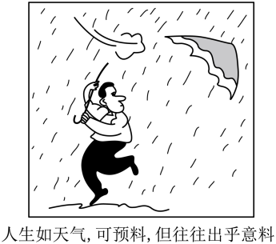
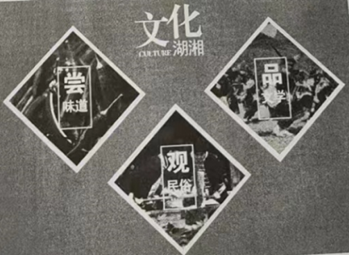

**湖南省2022年普通高中学业水平选择性考试**

**思想政治**

**一、选择题：本题共16小题，每小题3分，共48分。在每小题给出的四个选项中，只有一项是符合题目要求的。**

1\. 某轮胎企业积极探索数字化转型，建立与消费者直接联系，基于库存和销售数据及时调整产能计划，优化产品营销，提升服务体验，延展商业模式，个人零售成为新的业务增长点。2021年,在同期轮胎市场负增长的背景下，企业却实现了销量逆势增长近50%。数字化转型对该企业发展的作用体现在（ ）

①改进制造工艺，降低生产成本

②精准对接市场，促进产品销售

③提升服务水平，优化客户体验

④提高产品质量，增加产品价值

A. ①③ B. ①④ C. ②③ D. ②④

2\. 2021年底召开的中央经济工作会议提出，要正确认识和把握资本的特性和行为规律。要发挥资本作为生产要素的积极作用，同时有效控制其消极作用。既要依法加强对资本的有效监管，防止资本野蛮生长，也要支持和引导资本规范健康发展。这要求（ ）

①完善市场准入制度，加强对资本的源头治理

②健全行业监管机制，消除垄断和资本逐利性

③营造公平市场环境，激发各类市场主体活力

④积极参与国际循环，引领资本全球化的进程

A. ①③ B. ①④ C. ②③ D. ②④

3\. 某村建立股份合作社，绿化荒山、修建池塘……优美的生态环境吸引了全国各地的游客和会务、影像项目，村民通过提供食宿、销售特色手工产品获利丰厚。村集体收入大幅增长，收益重点用于环境改造、运营支出和村民福利。发展这种集体经济可以（ ）

①促进产业融合发展，推进乡村振兴

②推动各种所有制经济取长补短、共同发展

③巩固公有制主体地位，充分发挥其主导作用

④建立村集体和农户利益共同体，促进共同富裕

A. ①② B. ①④ C. ②③ D. ③④

4\. 《中共中央国务院关于加快建设全国统一大市场的意见》强调，要加快建设高效规范、公平竞争、充分开放的全国统一大市场，为构建高水平社会主义市场经济体制提供重要支撑。能正确反映其内在联系的是（ ）

A. ①③ B. ①④ C. ②③ D. ②④

5\. 避暑民宿的消费量通常会呈现季节性的变化，冬季低而夏季高，这一变化使得其均衡价格和均衡数量之间出现了明显的季节性关系。以P表示价格，Q表示数量，S表示供给，D表示需求，下标w表示冬季，下标s表示夏季。不考虑其他因素，下列图示能正确反映避暑民宿消费季节性变化的是（ ）

6\. 某区聚焦社区居民的操心事、烦心事、揪心事，动员居民参与社区提案，推动“社区参与有序化、社区议题合理化、社区协商规范化、社区共识最大化、社区服务精准化”。该区在基层治理方面的做法能够（ ）

①保障居民享有更多民主权利

②调动居民参与社区建设的积极性

③增强居民参与民主管理的实际本领

④创新自治组织形式，维护居民合法权益

A. ①② B. ①④ C. ②③ D. ③④

7\. “您好，请扫码。”“我这手机扫不了，你看政府给我发的这张卡，你能不能扫我？”“没问题，显示您是绿码，请进。”某地为破解老年人“扫码难题”，运用信息技术手段，为他们专门制作发放二维码卡片，变“我扫你”为“你扫我”。“反向扫码”的这一小小变化折射出政府（ ）

①发挥信息技术优势，重视基本民生需求的兜底保障

②防范公共治理风险，突出现代信息技术的关键作用

③补齐公共服务短板，优先满足特殊群体的个体需求

④解决急难愁盼问题，始终坚持全心全意为人民服务

A. ①③ B. ①④ C. ②③ D. ②④

8\. 执法检查是人大监督的法定形式和重要途径。进入新时代，全国人大常委会紧扣法律规定开展检查，重点查找法律实施不到位、不规范的问题，督促有关方面履行法定职责、落实法律责任、依法推进工作。由此可见，全国人大常委会（ ）

A. 创新监督形式，正确行使质询权

B. 作为最高国家权力机关，行使监督权

C. 切实履行监察职能，强化对国家机关的监察

D. 加强法律实施情况监督，推进法治国家建设

9\. 新时代的中国青年，在多个国际机制青年领域合作文件的制定过程中，积极贡献智慧、提出主张：在全球20多个国家，开展医疗卫生、农业技术、经济管理等志愿服务；在北京冬奥会、冬残奥会上，超越语言的障碍、文化的差异，搭建起“一起向未来”的桥梁。一系列行动展示出中国青年（ ）

①立足各国国家利益，践行共商共建共享理念

②顺应世界多极化趋势，建立国际政治经济新秩序

③具有全球视野，为世界和平发展贡献智慧与力量

④不负未来之托，担当构建人类命运共同体的青春使命

A. ①② B. ①③ C. ②④ D. ③④

10\. 革命题材电视剧《觉醒年代》激发了人们对建党先驱无限怀念。2021年夏天，在上海龙华烈士陵园赵世炎等先烈的墓前，堆放着“寄”往百年前的信笺。“肉体已逝，脊梁仍在。”“自从知道你的故事，我爱上了历史。谢谢你，让我能坐在阳光下读书。”从这些与革命先烈跨越时空的对话中，我们感受到（ ）

①现代传媒显示出丰富民族精神的强大功能

②伟大建党精神早已融入中国人民、中华民族的血脉

③即使时代变迁，中华民族精神依然是中华民族永远的精神火炬

④中华民族精神作为人们文化素养的核心和标志，能增强人的精神力量

A. ①③ B. ①④ C. ②③ D. ②④

11\. 千年陆路湘桂古道作为文化线路遗产，其主要构成是以沿途保存的遗址或遗存为主要对象。湖南广西相关部门加大古道沿线的文物和遗址保护力度，做好古道文化游的整合、活化与利用工作。这有利于（ ）

①发挥自然遗产优势，促进湘桂文化交融

②在求同存异中，彰显中华文化的包容性

③保护文化传承的载体，展现文化的多样性

④整合利用文化资源，挖掘文化遗产的价值

A. ①② B. ①③ C. ②④ D. ③④

12\. 漫画《人生如天气，可预料，但往往出乎意料》(作者：于昌伟)启示我们（ ）

①面对人生的出乎意料，要正确发挥主观能动性

②可预料与出乎意料相互否定，符合辩证否定观

③“思维的眼睛”能揭示事物内部规律，人生可预料

④人能够能动地认识世界，应该精确预见人生未来

A. ①③ B. ①④ C. ②③ D. ②④

13\. 花色各样的中国瓷器名扬四海，瓷器颜色主要由釉里所含的金属元素决定。青瓷的釉里含有铁元素，而白瓷的釉是单纯的石灰釉，铁的含量越少越好。青花瓷融中则含有钴元素。由此，下列说法正确的是（ ）

①每一件瓷器都是普遍性与特殊性的统一

②不同颜色瓷器的特殊性寓于其普遍性之中

③具体分析瓷器的普遍性才能区别不同颜色的瓷器

④把握金属元素的特殊性才能制造不同颜色的瓷器

A. ①② B. ①④ C. ②③ D. ③④

14\. 人类历史告诉我们，越是困难时刻，越要坚定信心。任何艰难曲折都不能阻挡历史前进的车轮。面对重重挑战，我们决不能丧失信心、犹疑退缩，而是要坚定信心、激流勇进。这表明（ ）

①发展的前途是光明的，要敢于超越事物发展的规律

②面对挫折与考验，我们要懂得冷静思考、量力而行

③设想世界历史会一帆风顺，是不辩证的、不科学的

④我们要树牢底线思维，勇敢面对前进道路上的挑战

A. ①② B. ①③ C. ②④ D. ③④

15\. 恩格斯说，“每一历史时代主要的经济生产方式和交换方式以及必然由此产生的社会结构，是该时代政治的和精神的历史所赖以确立的基础，并且只有从这一基础出发，这一历史才能得到说明”。从中可以认识到（ ）

①每一历史时代的各种经济生产方式都会产生相应的上层建筑

②物质生活的生产方式制约着整个社会生活、政治生活和精神生活的过程

③每一历史时代，人们调整社会关系的实践构成了社会生活的政治领域

④一个时代的国家设施、法的观点是从物质生活资料生产的基础上发展起来的

A. ①② B. ①③ C. ②④ D. ③④

16\. 20世纪80年代引进短道速滑项目以来，几代短道速滑运动员奋勇拼搏，为国争金夺银，展示了中国体育健儿的风貌品格，彰显了人们在所热爱的事业上踔厉奋发,笃行不怠的追求。这启示我们（ ）

①要在不懈奋斗和奉献中创造精彩人生

②站在不同的立场上会有不同的价值观

③在个人和社会统一中实现人生价值

④顽强拼搏的精神是实现人生价值的前提

A. ①③ B. ①④ C. ②③ D. ②④

**二、非选择题：共52分**

17\. 阅读材料，完成下列要求

消费是最终需求，是畅通国内大循环的关键环节和重要引擎，对经济具有持久拉动力，事关保障和改善民生。

材料一

2001—2020年的中国居民消费率

（说明：根据《中国统计年鉴2021》相关数据计算得到）

| 国家  | 人均GDP在3000—10000美元所在的年份 | 居民消费率（%）    |
|:--- |:----------------------- |:----------- |
| 中国  | 2008—                   | 35.44—39.65 |
| 韩国  | 1997—                   | 48.27—50.44 |
| 日本  | 1973—                   | 61.18—67.02 |
| 美国  | 1961—1977               | 59.61—61.26 |
| 英国  | 1972—                   | 64.90—68.78 |
| 德国  | 1971—                   | 53.95—54.59 |

若干国家人均GDP在3000—10000美元时的居民消费率

（说明：根据World Bank Open Data相关数据计算得到，其中美国居民消费率1961—1969年的数据缺失）

材料二 2022年，国务院进一步扩大税费减免政策的适用主体范围，将阶段性缓交保险费政策由五个特困行业扩大到所有经营困难的中小微企业、个体户，支持高校毕业生自主创业，落实大众创业、万众创新相关政策。

X县政府争取中央财政专项补贴，支持社会力量启动某养老项目，为社会提供1235个普惠养老床位，为老年人提供连续性、协调性和整体性的医养护一体化服务，并带动区域内相关养老配套产业发展。

C市政府启动三千万元消费券及消费红包惠民大派送，围绕国际品牌集聚、大宗商品商贸、文旅融合等十大内容开展促消费活动，政府投入加上撬动社会资本，投入资金将超一亿元。

（1）请说明材料一反映的经济信息。

（2）请结合材料二，运用经济生活知识，分析政府在促进消费方面是如何作为的。

18\. 阅读材料，完成下列要求。

习近平总书记指出，“保证和支持人民当家作主不是一句口号、不是一句空话，必须落实到国家政治生活和社会生活之中”。召开党的二十大，是党和国家政治生活中的一件大事。党的十九届六中全会决定，党的二十大于2022年下半年在北京召开。自2022年4月15日起，党的二十大相关工作网络征求意见正式启动。这是党的历史上第一次将党的全国代表大会相关工作面向全党全社会公开征求意见。广大人民群众可通过人民日报社、新华社、中央广播电视总台所属官网、新闻客户端以及“学习强国”学习平台开设的专栏提出意见建议。人民网“领导留言板”与人民日报客户端一起，授权开设“我为党的二十大建言献策”专栏，各地网友踊跃参与，栏目上线12小时，就收到有效留言近万件。根据安排，对收集的意见建议，有关部门将进行汇总整理和分析研究，为党的二十大相关工作提供参考。

党的二十大相关工作开展网络征求意见是中国民主的生动实践。请结合材料，运用政治生活知识加以说明。

19\. 阅读材料，完成下列要求。

长江拥有独特的生态系统，是我国重要的生态宝库。2018年，习近平总书记在长江岳阳段考察时强调：“修复长江生态环境，是新时代赋予我们的艰巨任务，也是人民群众的热切期盼。”“绝不容许长江生态环境在我们这一代人手上继续恶化下去，一定要给子孙后代留下一条清洁美丽的万里长江！”

治理污染不讲条件，严控空间不让分毫，修复生态不打折扣。湖南扛牢“守护好一江碧水”政治责任，以“一湖四水”为主战场，继全部清理洞庭湖区黑杨林后，将洞庭湖区被围圈的湖面“还湖于湖”，全部退出湖区造纸产能，推进重点工矿区转型升级，……2021年长江湖南段两岸种植营造林1786.6万亩、石漠化综合治理391.5万亩、水土流失治理574.7万亩，恢复湿地面积3.49万亩，生态环境持续向好，在确保“一江清水向东流”中彰显新担当。

请结合材料，运用联系客观性的知识，谈谈如何给子孙后代留下一条清洁美丽的万里长江。

20\. 阅读材料，完成下列要求。

材料一 中国共产党自成立以来，就以马克思主义为指导，肩负起实现中华民族和中华文化复兴的历史使命，是中华优秀传统文化的忠实传承者和弘扬者。

（1）请结合材料，运用文化生活知识，阐述在实现中华民族伟大复兴的进程中，中国共产党对待传统文化的“变”与“不变”。

材料二 中国传统文化博大精深，学习和掌握其中的各种思想精华，对树立正确的世界观、人生观、价值观很有益处。我们要弘扬优秀传统文化，从中汲取砥砺奋进的精神力量。

（2）请你在“尝味道”“品文学”“观民俗”三个主体中任选一个，根据所选主体，策划一个推广湖湘优秀传统文化的方案。

要求：自拟标题，阐明推广的目的和形式，不得透露任何个人信息，字数在150字左右。
