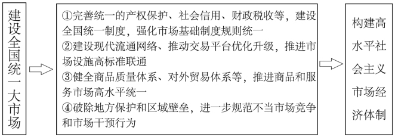
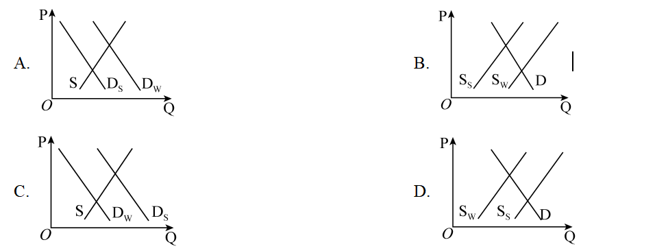
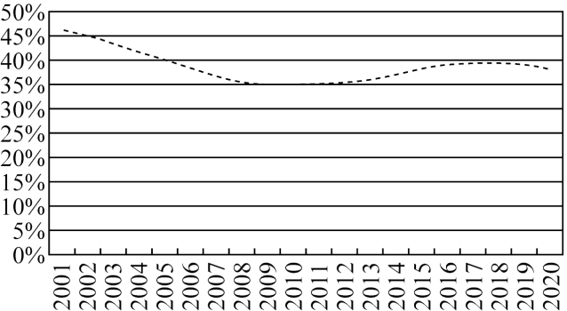
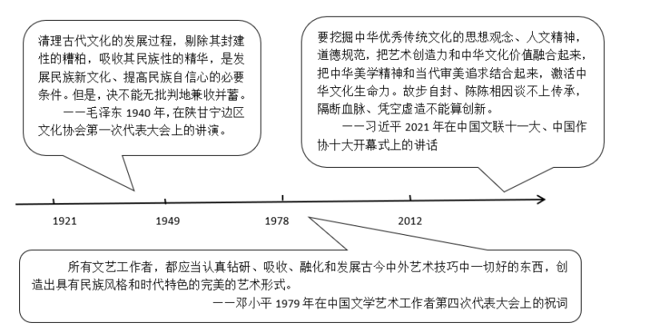

**湖南省2022年普通高中学业水平选择性考试**

**思想政治**

**一、选择题：本题共16小题，每小题3分，共48分。在每小题给出的四个选项中，只有一项是符合题目要求的。**

1\. 某轮胎企业积极探索数字化转型，建立与消费者的直接联系，基于库存和销售数据及时调整产能计划，优化产品营销，提升服务体验，延展商业模式，个人零售成为新的业务增长点。2021年,在同期轮胎市场负增长的背景下，企业却实现了销量逆势增长近50%。数字化转型对该企业发展的作用体现在（ ）

①改进制造工艺，降低生产成本

②精准对接市场，促进产品销售

③提升服务水平，优化客户体验

④提高产品质量，增加产品价值

A. ①③ B. ①④ C. ②③ D. ②④

【答案】C

【解析】

【详解】②③：材料强调建立与消费者的直接联系，基于库存和销售数据及时调整产能计划，优化产品营销，提升服务体验，这说明数字化转型有利于企业精准对接市场，促进产品销售，也有利于企业提升服务水平，优化客户体验，②③正确切题。

①：材料涉及的是企业的数字化转型，是经营模式的调整，并不涉及改进制造工艺，降低生产成本，①排除。

④：社会必要劳动时间决定商品的价值，该企业的数字化转型并不能增加产品价值，④不选。

故本题选C。

2\. 2021年底召开的中央经济工作会议提出，要正确认识和把握资本的特性和行为规律。要发挥资本作为生产要素的积极作用，同时有效控制其消极作用。既要依法加强对资本的有效监管，防止资本野蛮生长，也要支持和引导资本规范健康发展。这要求（ ）

①完善市场准入制度，加强对资本的源头治理

②健全行业监管机制，消除垄断和资本逐利性

③营造公平市场环境，激发各类市场主体活力

④积极参与国际循环，引领资本全球化的进程

A. ①③ B. ①④ C. ②③ D. ②④

【答案】A

【解析】

【详解】①③：材料强调既要依法加强对资本的有效监管，防止资本野蛮生长，也要支持和引导资本规范健康发展，强调的是规范资本市场的市场秩序，这要求完善市场准入制度，加强对资本的源头治理，营造公平市场环境，激发各类市场主体活力，①③正确切题。

②：资本以营利为目的，消除资本的逐利性说法错误，②不选。

④：从实际来看，我国不引领资本全球化的进程，④不选。

故本题选A。

3\. 某村建立股份合作社，绿化荒山、修建池塘……优美的生态环境吸引了全国各地的游客和会务、影像项目，村民通过提供食宿、销售特色手工产品获利丰厚。村集体收入大幅增长，收益重点用于环境改造、运营支出和村民福利。发展这种集体经济可以（ ）

①促进产业融合发展，推进乡村振兴

②推动各种所有制经济取长补短、共同发展

③巩固公有制主体地位，充分发挥其主导作用

④建立村集体和农户利益共同体，促进共同富裕

A. ①② B. ①④ C. ②③ D. ③④

【答案】B

【解析】

【详解】①④：材料表明，通过发展这种集体经济，村集体收入大幅增长，收益重点用于环境改造、运营支出和村民福利，这说明发展这种集体经济可以促进产业融合发展，推进乡村振兴，也可以建立村集体和农户利益共同体，促进共同富裕，①④正确切题。

②：材料强调的是集体经济，并不是各种所有制经济取长补短、共同发展，②不选；

③：国有经济发挥主导作用，③说法错误。

故本题选B。

4\. 《中共中央国务院关于加快建设全国统一大市场的意见》强调，要加快建设高效规范、公平竞争、充分开放的全国统一大市场，为构建高水平社会主义市场经济体制提供重要支撑。能正确反映其内在联系的是（ ）

A. ①③ B. ①④ C. ②③ D. ②④

【答案】D

【解析】

【详解】①：强化市场基础制度规则统一包括完善统一的产权保护制度、市场准入制度、公平竞争制度和社会信用制度，该选项中“统一的财政税收”说法错误。故①排除。

②：建设全国统一大市场，需要建设现代流通网络、推动交易平台优化升级，推进市场设施高标准联通，由此为构建高水平社会主义市场经济体制提供重要支撑。故②正确。

③：健全对外贸易体系与建设全国统一大市场无关，故③排除。

④：建设全国统一大市场，通过破除地方保护和区域壁垒，进一步规范不当市场竞争和市场干预行为，能够为构建高水平社会主义市场经济体制提供重要支撑。故④正确。

故本题选D。

5\. 避暑民宿的消费量通常会呈现季节性的变化，冬季低而夏季高，这一变化使得其均衡价格和均衡数量之间出现了明显的季节性关系。以P表示价格，Q表示数量，S表示供给，D表示需求，下标w表示冬季，下标s表示夏季。不考虑其他因素，下列图示能正确反映避暑民宿消费季节性变化的是（ ）

【答案】C

【解析】

【详解】避暑民宿的消费量通常会呈现季节性的变化，冬季低而夏季高，也即是夏季的需求高于冬季的需求，但避暑民宿的供给是不变的，由此夏季的价格高于冬季的价格。

A：题肢表示供给不变，夏季的需求小于冬季的需求，夏季价格低于冬季价格。故A不符合题意。

B：题肢表示需求不变，夏季供给小于冬季供给，夏季价格高于冬季价格。故B排除。

C：题肢表示供给不变，冬季需求小于夏季需求，夏季的价格高于冬季的价格。故C符合题意。

D：题肢表示需求不变，冬季供给小于夏季供给，冬季价格高于夏季价格。故D排除。

故本题选C。

6\. 某区聚焦社区居民的操心事、烦心事、揪心事，动员居民参与社区提案，推动“社区参与有序化、社区议题合理化、社区协商规范化、社区共识最大化、社区服务精准化”。该区在基层治理方面的做法能够（ ）

①保障居民享有更多民主权利

②调动居民参与社区建设的积极性

③增强居民参与民主管理的实际本领

④创新自治组织形式，维护居民合法权益

A. ①② B. ①④ C. ②③ D. ③④

【答案】C

【解析】

【详解】①：公民权利由宪法、法律规定，不能随意增加。故①表述有误。

②：该区聚焦居民的操心事、烦心事、揪心事，调动居民有序参与、凝聚共识，带动了居民参与社区建设的积极性。故②符合题意。

③：该区推动社区居民有序、规范参与，通过社区协商，增强居民参与民主管理的实际本领。故③符合题意。

④：基层自治组织形式是村委会和居委会。材料中的做法没有创新自治组织形式。故④排除。

故本题选C。

7\. “您好，请扫码。”“我这手机扫不了，你看政府给我发的这张卡，你能不能扫我？”“没问题，显示您是绿码，请进。”某地为破解老年人“扫码难题”，运用信息技术手段，为他们专门制作发放二维码卡片，变“我扫你”为“你扫我”。“反向扫码”的这一小小变化折射出政府（ ）

①发挥信息技术优势，重视基本民生需求的兜底保障

②防范公共治理风险，突出现代信息技术的关键作用

③补齐公共服务短板，优先满足特殊群体的个体需求

④解决急难愁盼问题，始终坚持全心全意为人民服务

A. ①③ B. ①④ C. ②③ D. ②④

【答案】B

【解析】

【详解】①④：材料中变“我扫你”为“你扫我”的“反向扫码”案例，是政府为解决老年人出行难的问题，保障民生需求，编织民生保障兜底网的具体举措，体现了我们政府始终坚持全心全意为人民服务的宗旨，故①④符合题意。

②：材料主旨更强调政府转变职能，创新服务方式的体现，而非技术本身，同时“关键作用”也不准确，故②不选。

③：政府要切实履行社会建设的职能，保障民生，但不能优先满足特殊群体的个体需求，故③说法错误。

故本题选B。

8\. 执法检查是人大监督的法定形式和重要途径。进入新时代，全国人大常委会紧扣法律规定开展检查，重点查找法律实施不到位、不规范的问题，督促有关方面履行法定职责、落实法律责任、依法推进工作。由此可见，全国人大常委会（ ）

A. 创新监督形式，正确行使质询权

B. 作为最高国家权力机关，行使监督权

C. 切实履行监察职能，强化对国家机关的监察

D. 加强法律实施情况监督，推进法治国家建设

【答案】D

【解析】

【详解】A：人大代表具有质询权，全国人大常委会在全国人大闭会期间代行其部分职能，故A错误。

B：全国人大是最高权力机关，全国人大常委会是全国人大的常设机构，故B错误。

C：监察委切实履行监察职能，强化对国家机关的监察，而不是全国人大常委会，故C错误。

D：全国人大常委会依法开展检查，重点查找法律实施不到位、不规范的问题，督促有关方面履行法定职责、落实法律责任、依法推进工作。说明了全国人大常委会加强法律实施情况监督，推进法治国家建设，故D正确。

故本题选D。

9\. 新时代的中国青年，在多个国际机制青年领域合作文件的制定过程中，积极贡献智慧、提出主张：在全球20多个国家，开展医疗卫生、农业技术、经济管理等志愿服务；在北京冬奥会、冬残奥会上，超越语言的障碍、文化的差异，搭建起“一起向未来”的桥梁。一系列行动展示出中国青年（ ）

①立足各国国家利益，践行共商共建共享理念

②顺应世界多极化趋势，建立国际政治经济新秩序

③具有全球视野，为世界和平发展贡献智慧与力量

④不负未来之托，担当构建人类命运共同体的青春使命

A. ①② B. ①③ C. ②④ D. ③④

【答案】D

【解析】

【详解】①：中国青年应立足我国国家利益，维护我国国家利益，而不是立足各国国家利益，故①错误。

②：建立国际政治经济新秩序主体是国家，而不是青年，故②错误。

③④：新时代的中国青年，在多个国际机制青年领域合作文件的制定过程中，积极贡献智慧、提出主张，说明了中国青年积极为世界和平发展贡献智慧与力量，勇于担当构建人类命运共同体的青春使命，故③④正确。

故本题选D。

10\. 革命题材电视剧《觉醒年代》激发了人们对建党先驱的无限怀念。2021年夏天，在上海龙华烈士陵园赵世炎等先烈的墓前，堆放着“寄”往百年前的信笺。“肉体已逝，脊梁仍在。”“自从知道你的故事，我爱上了历史。谢谢你，让我能坐在阳光下读书。”从这些与革命先烈跨越时空的对话中，我们感受到（ ）

①现代传媒显示出丰富民族精神的强大功能

②伟大建党精神早已融入中国人民、中华民族的血脉

③即使时代变迁，中华民族精神依然是中华民族永远的精神火炬

④中华民族精神作为人们文化素养的核心和标志，能增强人的精神力量

A. ①③ B. ①④ C. ②③ D. ②④

【答案】C

【解析】

【详解】①：现代传媒只是传播文化的手段，并没有丰富民族精神的功能，①排除。

②③：革命题材电视剧激发了人们对建党先驱的无限怀念，“肉体已逝，脊梁仍在”，表明伟大建党精神早已融入中国人民、中华民族的血脉；即使时代变迁，中华民族精神依然是中华民族永远的精神火炬，②③符合题意。

④：人们的文化素养的核心和标志是世界观、人生观和价值观，④说法错误。

故本题选C。

11\. 千年陆路湘桂古道作为文化线路遗产，其主要构成是以沿途保存的遗址或遗存为主要对象。湖南广西相关部门加大古道沿线的文物和遗址保护力度，做好古道文化游的整合、活化与利用工作。这有利于（ ）

①发挥自然遗产优势，促进湘桂文化交融

②在求同存异中，彰显中华文化的包容性

③保护文化传承的载体，展现文化的多样性

④整合利用文化资源，挖掘文化遗产的价值

A. ①② B. ①③ C. ②④ D. ③④

【答案】D

【解析】

【详解】①：千年陆路湘桂古道作为文化线路遗产，是以沿途保存的遗址或遗存为主要对象，表明不是纯自然遗产，而是文化遗产，①不符合题意。

②：中华文化的包容性，即求同存异、兼收并蓄。 "求同存异"，就是能与其他民族的文化和谐相处；"兼收并蓄"．就是能在文化交往中吸收、借鉴其他民族文化中的积极成分。 材料没有涉及在求同存异中，彰显中华文化的包容性，②不符合题意。

③：千年陆路湘桂古道作为文化线路遗产，加大古道沿线的文物和遗址保护力度有利于保护文化传承的载体，对于展现世界文化的多样性具有独特作用，③符合题意。

④：湖南广西相关部门做好古道文化游的整合、活化与利用工作，有利于整合利用文化资源，挖掘文化遗产的价值，④符合题意。

故本题选D。

12\. 漫画《人生如天气，可预料，但往往出乎意料》(作者：于昌伟)启示我们（ ）

①面对人生的出乎意料，要正确发挥主观能动性

②可预料与出乎意料相互否定，符合辩证否定观

③“思维的眼睛”能揭示事物内部规律，人生可预料

④人能够能动地认识世界，应该精确预见人生的未来

A. ①③ B. ①④ C. ②③ D. ②④

【答案】A

【解析】

【详解】①：由漫画可知，人生难免有波澜，有出乎意料，但要积极面对，正确发挥主观能动性，才是正确的选择，①符合题意。

②：辩证否定是自己否定自己、自己发展自己，而不是外力之间的相互否定，②说法错误。

③：虽然有些事情不可预料，但是意识具有自觉选择性和主动创造性，通过“思维的眼睛”能揭示事物内部规律，人生是可预料，③符合题意。

④：人能够能动地认识世界，但客观事物是复杂多样的，同时受人们实践水平的制约，并不是都能精准预见，人生往往出乎意料，④说法不科学。

故本题选A。

13\. 花色各样的中国瓷器名扬四海，瓷器颜色主要由釉里所含的金属元素决定。青瓷的釉里含有铁元素，而白瓷的釉是单纯的石灰釉，铁的含量越少越好。青花瓷融中则含有钴元素。由此，下列说法正确的是（ ）

①每一件瓷器都是普遍性与特殊性的统一

②不同颜色瓷器的特殊性寓于其普遍性之中

③具体分析瓷器的普遍性才能区别不同颜色的瓷器

④把握金属元素的特殊性才能制造不同颜色的瓷器

A. ①② B. ①④ C. ②③ D. ③④

【答案】B

【解析】

【详解】①④：瓷器颜色主要由釉里所含的金属元素决定。但是像青瓷的釉、白瓷的釉，青花瓷的釉含的金属元素不同，说明了每一件瓷器都是普遍性与特殊性的统一，要把握金属元素的特殊性才能制造不同颜色的瓷器，故①④正确。

②：矛盾的普遍性寓于特殊性之中，并通过特殊性表现出来，故②错误。

③：具体分析瓷器的特殊性才能区别不同颜色的瓷器，故③错误。

故本题选B

14\. 人类历史告诉我们，越是困难时刻，越要坚定信心。任何艰难曲折都不能阻挡历史前进的车轮。面对重重挑战，我们决不能丧失信心、犹疑退缩，而是要坚定信心、激流勇进。这表明（ ）

①发展前途是光明的，要敢于超越事物发展的规律

②面对挫折与考验，我们要懂得冷静思考、量力而行

③设想世界历史会一帆风顺，是不辩证的、不科学的

④我们要树牢底线思维，勇敢面对前进道路上的挑战

A. ①② B. ①③ C. ②④ D. ③④

【答案】D

【解析】

【详解】①：规律是客观的，是不以人的意志为转移的，我们要尊重客观规律，按客观规律办事，不能超越规律，故①错误。

②：面对困难和挫折时我们要勇于挑战，坚定信心，尽力而为，战胜困难，而不是量力而行，故②错误。

③：人类历史告诉我们，越是困难时刻，越要坚定信心，说明世界历史不会是一帆风顺的，那些设想世界历史会一帆风顺，是不辩证的、不科学的，故③正确。

④：任何艰难曲折都不能阻挡历史前进的车轮。面对重重挑战，我们决不能丧失信心、犹疑退缩，而是要坚定信心、激流勇进。说明了面对挫折与考验，我们要勇敢面对前进道路上的挑战，④正确。

故本题选D。

15\. 恩格斯说，“每一历史时代主要的经济生产方式和交换方式以及必然由此产生的社会结构，是该时代政治的和精神的历史所赖以确立的基础，并且只有从这一基础出发，这一历史才能得到说明”。从中可以认识到（ ）

①每一历史时代的各种经济生产方式都会产生相应的上层建筑

②物质生活的生产方式制约着整个社会生活、政治生活和精神生活的过程

③每一历史时代，人们调整社会关系的实践构成了社会生活的政治领域

④一个时代国家设施、法的观点是从物质生活资料生产的基础上发展起来的

A. ①② B. ①③ C. ②④ D. ③④

【答案】C

【解析】

【详解】①：每一历史时代主要的经济生产方式都会产生相应的上层建筑，故①错误。

②④：“每一历史时代主要的经济生产方式和交换方式以及必然由此产生的社会结构，是该时代政治的和精神的历史所赖以确立的基础，并且只有从这一基础出发，这一历史才能得到说明”。说明经济基础决定上层建筑，社会的政治、法律制度以及各种思想观点和意识形态，国家设施、法的观点等等都是从物质生活资料生产的基础上发展起来的，故②④正确。

③：“每一历史时代主要的经济生产方式和交换方式以及必然由此产生的社会结构，是该时代政治的和精神的历史所赖以确立的基础，强调的是一定的社会政治、精神和法律等上层建筑依赖于一定的社会经济结构，故③不符合题意。

故本题选C。

16\. 20世纪80年代引进短道速滑项目以来，几代短道速滑运动员奋勇拼搏，为国争金夺银，展示了中国体育健儿的风貌品格，彰显了人们在所热爱的事业上踔厉奋发,笃行不怠的追求。这启示我们（ ）

①要在不懈奋斗和奉献中创造精彩人生

②站在不同的立场上会有不同的价值观

③在个人和社会的统一中实现人生价值

④顽强拼搏的精神是实现人生价值的前提

A. ①③ B. ①④ C. ②③ D. ②④

【答案】A

【解析】

【详解】①③：几代短道速滑运动员奋勇拼搏，为国摘金夺银，展示了中国体育健儿的风貌品格，彰显了人们在所热爱的事业上踔厉奋发，笃行不怠的追求。启示我们要奉献中创造价值，在个人和社会的统一中实现人生价值，要在砥砺自我中走向成功，故①③正确。

②：材料体现了几代短道速滑运动员，都树立了正确价值观，有着共同的价值观念，奋勇拼搏，为国争金夺银，没有体现不同的立场会有不同的价值观，故②不符合题意。

④：社会提供的客观条件是实现人生价值的前提，故④错误。

故本题选A。

**二、非选择题：共52分**

17\. 阅读材料，完成下列要求

消费是最终需求，是畅通国内大循环的关键环节和重要引擎，对经济具有持久拉动力，事关保障和改善民生。

材料一

2001—2020年的中国居民消费率

（说明：根据《中国统计年鉴2021》相关数据计算得到）

| 国家  | 人均GDP在3000—10000美元所在的年份 | 居民消费率（%）    |
|:--- |:----------------------- |:----------- |
| 中国  | 2008—                   | 35.44—39.65 |
| 韩国  | 1997—                   | 48.27—50.44 |
| 日本  | 1973—                   | 61.18—67.02 |
| 美国  | 1961—1977               | 59.61—61.26 |
| 英国  | 1972—                   | 64.90—68.78 |
| 德国  | 1971—                   | 53.95—54.59 |

若干国家人均GDP在3000—10000美元时的居民消费率

（说明：根据World Bank Open Data相关数据计算得到，其中美国居民消费率1961—1969年的数据缺失）

材料二 2022年，国务院进一步扩大税费减免政策的适用主体范围，将阶段性缓交保险费政策由五个特困行业扩大到所有经营困难的中小微企业、个体户，支持高校毕业生自主创业，落实大众创业、万众创新相关政策。

X县政府争取中央财政专项补贴，支持社会力量启动某养老项目，为社会提供1235个普惠养老床位，为老年人提供连续性、协调性和整体性的医养护一体化服务，并带动区域内相关养老配套产业发展。

C市政府启动三千万元消费券及消费红包惠民大派送，围绕国际品牌集聚、大宗商品商贸、文旅融合等十大内容开展促消费活动，政府投入加上撬动社会资本，投入资金将超一亿元。

（1）请说明材料一反映的经济信息。

（2）请结合材料二，运用经济生活知识，分析政府在促进消费方面是如何作为的。

【答案】（1）2001-2007年我国居民的消费率在下降； 2007-2012年我国居民的消费率比较平稳； 2012-2020年我国居民的消费率有所上升，但增长缓慢；当国家人均GDP在3000—10000美元时，我国居民消费率远低于发达国家，这说明我国居民消费水平较低，消费能力较弱，消费结构有待优化。

（2）①实施积极的财政政策，进一步扩大税费减免政策的适用主体范围，降低企业的制度性经营成本，以促进其投资和消费；\
②通过财政专项补贴，支持社会力量启动某养老项目，完善社会基本公共服务，带动区域内相关养老配套产业发展，满足居民的消费需求。\
③通过发放消费券和消费红包，带动社会资本，开展促消费活动，以减轻居民消费成本，刺激居民消费。

【解析】

【分析】考查背景：消费

考查考点：宏观调控、影响消费水平的因素等

考查能力：调动和运用知识、描述和阐释事物

学科素养：政治认同、科学精神

【小问1详解】

第一步，审设问。

明确本题要求说明材料一反映的经济信息。

第二步，审材料，提取有效信息。

有效信息①2001—2020年的中国居民消费率图→2001-2007年我国居民的消费率在下降； 2007-2012年我国居民的消费率比较平稳； 2012-2020年我国居民的消费率有所上升，但增长缓慢。

有效信息②“国家”、“人均GDP在3000—10000美元所在的年份”、“居民消费率”→当国家人均GDP在3000—10000美元时，我国居民消费率远低于发达国家，这说明我国居民消费水平较低，消费能力较弱，消费结构有待优化。

第三步，整合信息，组织答案。

得分点①2001-2007年我国居民的消费率在下降； 2007-2012年我国居民的消费率比较平稳； 2012-2020年我国居民的消费率有所上升，但增长缓慢。

得分点②当国家人均GDP在3000—10000美元时，我国居民消费率远低于发达国家，这说明我国居民消费水平较低，消费能力较弱，消费结构有待优化。

【小问2详解】

第一步，审设问。

明确本题要求结合材料二，运用经济生活知识，分析政府在促进消费方面是如何作为的。

第二步，审材料，提取有效信息。

有效信息①国务院进一步扩大税费减免政策的适用主体范围，将阶段性缓交保险费政策由五个特困行业扩大到所有经营困难的中小微企业、个体户，支持高校毕业生自主创业，落实大众创业。万众创新相关政策→实施积极的财政政策，进一步扩大税费减免政策的适用主体范围，降低企业的制度性经营成本，以促进其投资性其消费；

有效信息②X县政府争取中央财政专项补贴，支持社会力量启动某养老项目，为社会提供1235个普惠养老床位，为老年人提供连续性、协调性和整体性的医养护一体化服务，并带动区域内相关养老配套产业发展→通过财政专项补贴，支持社会力量启动某养老项目，完善社会基本公共服务，带动区域内相关养老配套产业发展，满足居民的消费需求。

有效信息③C市政府启动三千万元消费券及消费红包惠民大派送，围绕国际品牌集聚、大宗商品商贸、文旅融合等十大内容开展促消费活动，政府投入加上撬动社会资本，投入资金将超一亿元→通过发放消费券和消费红包，带动社会资本，开展促消费活动，以减轻居民消费成本，刺激居民消费。

第三步，整合信息，组织答案。

得分点①实施积极的财政政策＋降低企业的制度性经营成本，以促进其投资性其消费；

得分点②通过财政专项补贴，支持社会力量启动某养老项目，完善社会基本公共服务，带动区域内相关养老配套产业发展，满足居民的消费需求。

得分点③通过发放消费券和消费红包，带动社会资本，开展促消费活动，以减轻居民消费成本，刺激居民消费。

【点睛】非选择题的审题要求：（1）审设问：一是明确题目考查的知识范围和考查意图，正确联想相关知识，形成综合性的信息认识；二是明确设问的指向性和规定性，分清题干要求答题的类别，即回答“是什么”、或“为什么”、或“怎么样”、或“怎样体现”中哪一类。（2）审主体：明确主体有几个，不同主体的言论和行为各是什么。这些应从解读设问和材料中获取。（3）审材料：获取材料中有效信息，抓住关键词、关键句子。这样做，一是为了正确联想相关知识，二是进一步明确答题的主体，不同主体的言论和行为各是什么；三是关键的句子要作为“材料语言”写入答案要点中。审材料实质上就是为了进一步证实“审设问和审主体”的正确与否。

18\. 阅读材料，完成下列要求。

习近平总书记指出，“保证和支持人民当家作主不是一句口号、不是一句空话，必须落实到国家政治生活和社会生活之中”。召开党的二十大，是党和国家政治生活中的一件大事。党的十九届六中全会决定，党的二十大于2022年下半年在北京召开。自2022年4月15日起，党的二十大相关工作网络征求意见正式启动。这是党的历史上第一次将党的全国代表大会相关工作面向全党全社会公开征求意见。广大人民群众可通过人民日报社、新华社、中央广播电视总台所属官网、新闻客户端以及“学习强国”学习平台开设的专栏提出意见建议。人民网“领导留言板”与人民日报客户端一起，授权开设“我为党的二十大建言献策”专栏，各地网友踊跃参与，栏目上线12小时，就收到有效留言近万件。根据安排，对收集的意见建议，有关部门将进行汇总整理和分析研究，为党的二十大相关工作提供参考。

党的二十大相关工作开展网络征求意见是中国民主的生动实践。请结合材料，运用政治生活知识加以说明。

【答案】①中国特色社会主义制度的最大优势是中国共产党领导，中国共产党坚持科学执政、民主执政。党的历史上第一次将党的全国代表大会相关工作面向全党全社会公开征求意见，这是一次重大的创新举措，彰显中国共产党在密切党群关系的道路上又更进一步。\
②我国是人民民主专政的社会主义国家，人民是国家的主人，开展党的二十大相关工作网络征求意见，充分彰显了以习近平同志为核心的党中央发扬民主、集思广益的优良作风，是我们党坚持以人民为中心、尊重人民主体地位、走好群众路线的重要体现。\
③广大人民群众可通过各种渠道提出意见建议，这是推进全过程人民民主的生动实践，是适应互联网时代新要求、推进国家治理体系和治理能力现代化的有益探索。\
④党的二十大相关工作开展网络征求意见实现了党的领导、人民当家作主、依法治国三者有机统一，将中国民主推上了一个新的高度。

【解析】

【分析】背景素材：党的二十大开展网络征求意见。

考点考查：政治生活的有关知识。

能力考查：获取和解读信息，调动和运用知识，描述和阐述事物。

核心素养：政治认同、科学精神、公共参与。

【详解】第一步：审设问，明确主体、作答范围、问题限定和作答角度。

本题需要调用“政治生活”的有关知识，结合材料说明党的二十大相关工作开展网络征求意见是中国民主的生动实践。回答体现类主观题，一般需要明确材料所给措施，然后对点分析。

第二步：审材料，通过标点符号、段落等，提取材料有效信息。

有效信息①：自2022年4月15日起，党的二十大相关工作网络征求意见正式启动。这是党的历史上第一次将党的全国代表大会相关工作面向全党全社会公开征求意见。→中国共产党坚持科学执政、民主执政，与时俱进。

有效信息②：保证和支持人民当家作主不是一句口号、不是一句空话······向全社会公开征求意见。→党坚持以人民为中心、尊重人民主体地位、走好群众路线。

有效信息③：广大人民群众可通过人民日报社、新华社、中央广播电视总台所属官网、新闻客户端以及“学习强国”学习平台开设的专栏提出意见建议。→全过程人民民主的生动实践。

第三步：整合信息，组织答案。

得分点①：中国共产党坚持科学执政、民主执政。

得分点②：党坚持以人民为中心、尊重人民主体地位、走好群众路线。

得分点③：全过程人民民主。

得分点④：综述：党的领导、人民当家作主、依法治国三者有机统一。

【点睛】非选择题的审题要求：

（1）审设问：一是明确题目考查的知识范围和考查意图，正确联想相关知识，形成综合性的信息认识；二是明确设问的指向性和规定性，分清题干要求答题的类别，即回答“是什么”、或“为什么”、或“怎么样”、或“怎样体现”中哪一类。

（2）审主体：明确主体有几个，不同主体的言论和行为各是什么。这些应从解读设问和材料中获取。

（3）审材料：获取材料中有效信息，抓住关键词、关键句子。这样做，一是为了正确联想相关知识，二是进一步明确答题的主体，不同主体的言论和行为各是什么；三是关键的句子要作为“材料语言”写入答案要点中。审材料实质上就是为了进一步证实“审设问和审主体”的正确与否。

19\. 阅读材料，完成下列要求。

长江拥有独特的生态系统，是我国重要的生态宝库。2018年，习近平总书记在长江岳阳段考察时强调：“修复长江生态环境，是新时代赋予我们的艰巨任务，也是人民群众的热切期盼。”“绝不容许长江生态环境在我们这一代人手上继续恶化下去，一定要给子孙后代留下一条清洁美丽的万里长江！”

治理污染不讲条件，严控空间不让分毫，修复生态不打折扣。湖南扛牢“守护好一江碧水”政治责任，以“一湖四水”为主战场，继全部清理洞庭湖区黑杨林后，将洞庭湖区被围圈的湖面“还湖于湖”，全部退出湖区造纸产能，推进重点工矿区转型升级，……2021年长江湖南段两岸种植营造林1786.6万亩、石漠化综合治理391.5万亩、水土流失治理574.7万亩，恢复湿地面积3.49万亩，生态环境持续向好，在确保“一江清水向东流”中彰显新担当。

请结合材料，运用联系客观性的知识，谈谈如何给子孙后代留下一条清洁美丽的万里长江。

【答案】①联系具有客观性，要从事物固有的联系中把握事物，切忌主观随意性。人与自然是有机整体，长江拥有独特的生态系统，是我国重要的生态宝库，历史上对该区域过度、无序、劫掠开发导致长江生态环境严重恶化，告诉我们要尊重自然，从人与自然的固有联系中认识和改造自然，坚持人与自然和谐共生。②人对事物的联系并不是无能为力的，人们可以根据事物固有的联系，改变事物的状态，调整原有的联系，建立新的联系。新时代，我们只有坚持绿色发展理念，在修复长江生态环境中彰显新担当、努力作为，才能确保“一江清水向东流”，让生态环境持续向好。

【解析】

【分析】背景素材：修复长江生态环境，刻不容缓

考点考查： 联系客观性的知识

能力考查：描述和阐释事物

核心素养：科学精神、政治认同

【详解】第一步：审设问。（明确主体、作答范围、问题限定和作答角度。）

本题需要调用联系客观性的有关知识，谈谈如何给子孙后代留下一条清洁美丽的万里长江。回答此类问题一般可采用定点法，具体的解题思路是：定点——联系——梳理——作答。

第二步：审材料。（通过标点符号、段落等，提取材料有效信息。）

有效信息①：长江生态环境由于不当开发，曾经持续恶化恶化。→可联系联系具有客观性，切忌主观随意性。

有效信息②：在确保“一江清水向东流”中彰显新担当。→可联系人对事物的联系并不是无能为力的。

第三步：整合信息，组织答案。

得分点①：联系的客观性+材料分析。

得分点②：人们可以根据事物固有的联系，改变事物的状态，调整原有的联系，建立新的联系+材料分析。

【点睛】怎么办（对策）类：

（1）题型特点：此类题的设问一般来讲都是给出了确定的主体，如党、国家、政府、公民、企业、消费者和个人等。并且指定了要回答的某一方面内容。

（2）解题技巧：可采用定点法，具体的解题思路是：定点——联系——梳理——作答。

定点：确定考核的知识点是什么；

联系：联系所给材料与所学知识；

梳理作答：将材料所给的信息与考核的知识点一一对照，二者相符的就是要点，作答时要做到观点和材料相结合。

20\. 阅读材料，完成下列要求。

材料一 中国共产党自成立以来，就以马克思主义为指导，肩负起实现中华民族和中华文化复兴的历史使命，是中华优秀传统文化的忠实传承者和弘扬者。

（1）请结合材料，运用文化生活知识，阐述在实现中华民族伟大复兴的进程中，中国共产党对待传统文化的“变”与“不变”。

材料二 中国传统文化博大精深，学习和掌握其中的各种思想精华，对树立正确的世界观、人生观、价值观很有益处。我们要弘扬优秀传统文化，从中汲取砥砺奋进的精神力量。

（2）请你在“尝味道”“品文学”“观民俗”三个主体中任选一个，根据所选主体，策划一个推广湖湘优秀传统文化的方案。

要求：自拟标题，阐明推广的目的和形式，不得透露任何个人信息，字数在150字左右。

【答案】（1）① 传统文化有双重作用，对今天人们的思想观念、生活方式和中国的发展道路具有深刻影响。正确态度是取其精华，去其糟粕，批判继承，古为今用，我们要弘扬优秀传统文化，从中汲取砥砺奋进的精神力量，激发全民族文化创造活力，增强文化自信和文化自觉，提升我国的文化软实力。\
②传统文化具有鲜明的民族性，传统文化是民族文化发展的根基，是维系民族生存和发展的精神纽带，今天仍能激起人们强烈的民族认同感和民族自信心。传承发展中华优秀传统文化有利于弘扬和培育中华民族精神，但同时要面向世界、博采众长，以我为主，为我所用。\
③传统文化具有相对稳定性，传统文化在世代相传中保留着基本特征，同时，它的具体内涵又能够因时而变。必须在继承的基础上发展和创新，在发展的过程中继承，立足实践，批判地继承发展好传统文化，不断推陈出新，革故鼎新，成为自觉的文化传承者和享用者，实现中华民族伟大复兴。\
④反对全盘否定传统文化的历史虚无主义与全盘肯定的守旧主义。

（2）第一、“尝味道”：\
推广目的：品舌尖上的美食，领略源远流长的湖湘传统饮食文化；了解美食和传统习俗、传统节日。\
推广形式：从当地政府、文化企业、市民角度思考。如网络点餐、印制精美推介手册、城市志愿者服务。\
第二、“品文学”：\
推广的目的：领略源远流长博大精深的湖湘传统文化；培养文化自信心和文化自豪感。\
推广形式：从当地政府、文化企业、市民角度思考。如借力科技、网络创新传统文化、推动文化传播手段创新 、印制精美文化手册、组织开展读书宣传活动。\
第三、“观民俗”：\
推广的目的：观传统民俗文化，领略博大精深的湖湘优秀传统文化的多姿多彩和创造力；了解传统习俗和传统节日。\
推广形式：从当地政府、文化企业、市民角度思考。如网络、科技手段推广民俗文化、印制精美推介手册、城市志愿者服务等。

【解析】

【分析】背景素材： 中国共产党对待传统文化的“变”与“不变”、弘扬优秀传统文化

考点考查： 文化传承与创新、传统文化知识、中华文化等知识

能力考查：获取和解读信息、调度和运用知识、描述和阐释事物、论证和探究问题

核心素养：科学精神、公共参与、政治认同

【小问1详解】

第一步：审设问。（明确主体、作答范围、问题限定和作答角度。）

本题需要调用文化生活的有关知识，阐述在实现中华民族伟大复兴的进程中，中国共产党对待传统文化的“变”与“不变”。回答此类问题可用定点法，具体的解题思路是：定点——联系——梳理——作答。

第二步：审材料。（通过标点符号、段落等，提取材料有效信息。）

有效信息①：传统文化双重作用。→可联系正确态度是取其精华，去其糟粕，批判继承，古为今用。

有效信息②：传统文化具有鲜明的民族性。→可联系传承发展中华优秀传统文化，同时要面向世界、博采众长。

有效信息③：传统文化具有相对稳定性。→可得出立足实践，批判地继承发展好传统文化，不断推陈出新，革故鼎新。

有效信息④：历史虚无主义与全盘肯定的守旧主义不可取。→可得出反对全盘否定传统文化的历史虚无主义与全盘肯定的守旧主义。

第三步：整合信息，紧扣材料、组织答案。

【小问2详解】

第一步：审设问。（明确主体、作答范围、问题限定和作答角度。）

本题需要在“尝味道”“品文学”“观民俗”三个主体中任选一个，根据所选主体，策划一个推广湖湘优秀传统文化的方案。

回答此类问题要围绕主体，观点明确，注意学科术语使用规范。

第二步：审材料。（通过标点符号、段落等，提取材料有效信息。）

有效信息①：中国传统文化博大精深。→可联系“尝味道”。

有效信息②：弘扬优秀传统文化。→可联系“观民俗”。

有效信息③：汲取砥砺奋进的精神力量。→可联系“品文学”。

第三步：整合信息，联想相关知识，然后拟定提纲，组织答案。

本题具有开放性，言之成理即可。

【点睛】拟定提纲类探究题

①通过材料关键信息，联想相关知识，然后拟定提纲。

②围绕主题，观点明确。

③论证充分，逻辑清晰。

④学科术语使用规范。
