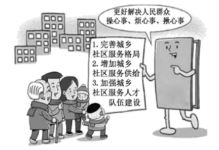
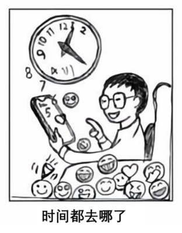

**道德与法治试题**

**一、选择题：本题共25小题，每小题2分，共50分。在每小题给出的四个选项中，只有一项是符合题目要求的。**

1\. 2021年是中国共产党成立100周年。2022年我们将迎来（ ）

A. 中国共产党第二十次全国代表大会

B. 全面建成小康社会

C. 基本实现社会主义现代化

D. 第二个百年奋斗目标的实现

2\. 下框时事新闻共同反映的主题是（ ）

<table>
<colgroup>
<col style="width: 100%" />
</colgroup>
<tbody>
<tr>
<td style="text-align: left;">
★中老铁路建成通车：对中国—东盟自由贸易区、大漏公河次区域经济合作将产生积极影响。

★我国与“一带一路”沿线国家货物贸易额创新高：我国推动共建“一带一路”取得实打实的成就。
</td>
</tr>
</tbody>
</table>

A. 独立自主，自力更生 B. 互利共赢，共同发展

C. 对话协商，兼收并蓄 D. 积极参与，合作治理

3\. 我国已经到了扎实推动共同富裕的历史阶段。关于分阶段促进共同富裕，下列排序正确的是（ ）

①全体人民共同富裕基本实现

②全体人民共同富裕迈出坚实步伐

③全体人民共同富裕取得更为明显的实质性进展

A. ①—②—③ B. ①—③—② C. ②—①—③ D. ②—③—①

4\. 从图中信息可以推断出国家重视

A. 农村供水保障 B. 农村环境整治

C. 城镇环境基础设施建设 D. 城乡社区服务体系建设

5\. 下列新闻解读与时事新闻相匹配的是（ ）

|     |                           |                      |
|:---:|:-------------------------:|:--------------------:|
| 序号  | 时事新闻                      | 新闻解读                 |
| ①   | 人民币国际储备货币地位进一步提升          | 彰显出中国的实力、活力与魅力       |
| ②   | 《推进生态农场建设的指导意见》印发         | 提高我国新能源开发与利用水平       |
| ③   | 《儿童青少年学习用品近视防控卫生要求》正式实施   | 有助于缓解青少年用眼疲劳，降低近视发生率 |
| ④   | 中国量子计算原型机“祖冲之二号”和“九章二号”问世 | 表明我国总体科技发展水平位居世界前列   |

A. ①② B. ①③ C. ②④ D. ③④

6\. 小闽：你做事果断，但有些马虎，若能细心点就更好啦

小福：你说得有理，我会慢慢改进的。

上述对话给我们的启示是（ ）

①勇于自我批评 ②重视他人评价 ③做更好的自己 ④懂得欣赏自己

A. ①③ B. ①④ C. ②③ D. ②④

7\. 下列对校园生活“微行为”的“微点评”，正确的是（ ）

|     |                   |            |
|:---:|:-----------------:|:----------:|
| 序号  | 微行为               | 微点评        |
| ①   | 与好朋友一起参加班委竞选      | 用心去关怀对方    |
| ②   | 小组交流时，对不合理的观点提出质疑 | 具有批判性思维    |
| ③   | 经常与老师探讨学习和生活中的问题  | 能够与老师和谐相处  |
| ④   | 建议班级调整值日规则，得到大家赞同 | 正确面对交往中的冲突 |

A. ①② B. ①④ C. ②③ D. ③④

8\. 自然界中，光秃秃的树干会长出新芽，断尾的壁虎会长出新的尾巴，被压在石头下的小草也可能从缝隙中生长出来…这些现象启示我们（ ）

①战胜挫折，需要具有坚强的意志 ②面对困境，应该寻求他人的帮助

③遇到困难，不同的人有相同反应 ④身处逆境，要发掘自身生命力量

A. ①③ B. ①④ C. ②③ D. ②④

9\. 河北阜平44名山里娃组成的“马兰花儿童声合唱团”，努力学习外语和音乐，在北京冬奥会开幕式和闭幕式上两度登台，用希腊语演唱《奥林匹克圣歌》，质朴的歌声感动了世界。孩子们用行动展现了（ ）

①超越自我的执着信念 ②团结向上的精神风貌

③公而忘私的高尚情操 ④勇于创造的价值追求

A. ①② B. ①③ C. ②④ D. ③④

10\. 水滴是散的，积聚起来就是辽阔的海洋：沙石是散的，堆积起来就是巍峨的大山。由此可以感悟出（ ）

A. 个人意愿必须服从集体规则要求 B. 集体的力量取决于成员数量的多少

C. 个人汇聚到集体中能产生强大的力量 D. 集体的力量在一定程度上可以改变一个人

11\. 为了远山孩子的呼唤，滇西支教团队，一群来自五湖四海的人，33年来先后10批次，近500人次到云南西部偏僻山区支教，累计培养出2万多名合格的初高中毕业生，输送出1万多名大中专生，写下了教育史上可歌可敬的篇章。若要报道这一事迹，最适合的标题是（）

A. 同伴携手齐奋进，呵护友谊见真情 B. 山高水远任重长，万水千山总关情

C. 见贤思齐学榜样，理解宽容暖人心 D. 浩荡东风千万里，壮美神舟日日新

12\. 从材料可以看出（ ）

|                                                     |                                                                                                                                                                             |                                                                            |
|:--------------------------------------------------- |:--------------------------------------------------------------------------------------------------------------------------------------------------------------------------- |:-------------------------------------------------------------------------- |
| 2021年10月23日，十三届全国人大常委会第三十一次会议表决通过了《中华人民共和国家庭教育促进法》。 |  | 第四条 未成年人的父母或者其他监护人负责实施家庭教育。国家和社会为家庭教育提供指导、支持和服务。国家工作人员应当带头树立良好家风，履行家庭教育责任。 |

①法律是由国家制定 ②国家建立了完备的法律制度

③未成年人自我约束意识增强 ④法律为未成年人健康成长护航

A. ①③ B. ①④ C. ②③ D. ②④

13\. 福建某地检察院联合教育局，聘任多名中小学生担任法治副校长的“法治小助理”，承担校园法治教育宣传员和监督员的职责。该举措有利于（ ）

①引导学生学法知法守法 ②鼓励学生参与法治实践

③提高青少年的执法能力 ④加强青少年的司法保护

A. ①② B. ①③ C. ②④ D. ③④

14\. 针对图中人物的行为，下列劝告合适的是（ ）

①要维护网络安全 ②要合理使用网络 ③要科学安排时间 ④要学会分工合作

A. ①② B. ①④ C. ②③ D. ③④

15\. 下列行为与故事主题相符的是（ ）

|                                                                       |
|:--------------------------------------------------------------------- |
| 汉朝人季布，十分重视承诺，凡是答应别人的事情一定做到。他因此在当地人中享有很高的声誉，广受欢迎。乡亲们说：“得黄金百斤，不如得季布一诺。” |

A. 小东参加学校的艺术社团活动 B. 小方外出就餐时，将剩余饭菜打包回家

C. 小晨与同学共同扶起摔倒的老人 D. 小曦与同学约定周末打篮球，准时赴约

16\. 在收到的快递包装盒上，发现有“充值19元赠送100元话费”的二维码广告，正确做法是（ ）

A. 立即扫码充值 B. 分享二维码给朋友 C. 不轻易扫码 D. 拨打119报警电话

17\. 陈某骑电动车闯红灯，被执勤交警依法处以30元罚款。据此判断，陈某（ ）

A. 违反刑事法律，承担刑事责任 B. 违反行政法律，承担行政责任

C. 违反民事法律，承担民事责任 D. 违反经济法律，承担赔偿责任

18\. 福建省创新营商环境评估机制，加强数字化监测督导，以企业群众满意度为评价标准，推行制度公开、流程公开、效率公开，把审批和服务全流程置于社会监督之下。这体现了政府（ ）

①实施宏观调控 ②保障公民的知情权监督权 ③推进政务公开 ④推动产业升级，提高生产效益

A ①③ B. ①④ C. ②③ D. ②④

19\. 我国宪法序言规定：“全国各族人民、一切国家机关和武装力量、各政党和各社会团体、各企业事业组织，都必须以宪法为根本的活动准则，并且负有维护宪法尊严、保证宪法实施的职责。”这表明（ ）

A. 宪法具有至高无上的权威 B. 宪法是国家法制统一的基础

C. 宪法内容涵盖了社会生活的方方面面 D. 宪法的制定和修改程序比其他法律严格

20\. 观察下图，可以得出的正确结论是（ ）

①人人都是发明者和创造者 ②创新让我们的生活更加美好

③我国发明创新成果逐年增加 ④人们保护知识产权的意识增强

A. ①② B. ①③ C. ②④ D. ③④

21\. 某村推行村民说事制度。定期召开村民说事会，如实记录村民说的“事”，提出相关问题后，由村党支部和村委会提出初步意见，再提交说事会进行决策。村民说事会议定办理的事项及办理情况全部公示并全程接受群众监督。该村的做法，体现了（ ）

A 说事会行政地位得到提高 B. 集中民智，村民间接参与基层管理

C. 村民的需求皆能得到满足 D. 有事好商量，众人的事情由众人商量

22\. 某地积极开展“微心愿”活动，陪老人聊天、给老人理发、帮助照看孩子…随着“微心愿”一个个实现，“你有困难我来帮”深入人心。“微心愿”活动，彰显的社会主义核心价值观是（ ）

①敬业 ②和谐 ③友善 ④平等

A. ①③ B. ①④ C. ②③ D. ②④

23\. 维护和促进民族团结，是每个公民的神圣职责和光荣义务。为履行好这一义务，中学生应该（ ）

①铸牢中华民族共同体意识 ②学习党的民族政策

③精通各民族的传统技艺 ④体验祖国各地的风土人情

A. ①② B. ①③ C. ②④ D. ③④

24\. 图中反映的是（ ）

A. 世界多极化 B. 经济全球化 C. 文化多样化 D. 社会信息化

25\. 30年来，一批又一批中国维和军人前赴后继、向险而行、英勇出征先后参加25项联合国维和行动，足迹遍布全球20多个国家和地区，为世界和平与发展注入正能量。中国军队参加联合国维和行动源于（ ）

①中华民族爱好和平 ②中国是负责任的大国 ③国与国之间的相互信任 ④世界各国共享发展机遇

A. ①② B. ①④ C. ②③ D. ③④

**二、非选择题：请根据下列各题要求，回答问题。共5题，共50分。**

26\. 判断说理

判断下列做法或说法是否正确（正确的在括号内打“正确”，错误的在括号内打“错误”），并说明理由。

（1）图5中同学的行为。

理由：\_\_\_\_\_\_\_\_\_\_\_\_\_\_\_\_\_\_\_\_\_\_\_\_\_\_\_\_\_\_\_\_\_\_\_\_\_\_\_\_\_

（2）小明说：“权利是法律赋予我的，怎么行使是我的自由。”

理由：\_\_\_\_\_\_\_\_\_\_\_\_\_\_\_\_\_\_\_\_\_\_\_\_\_\_\_\_\_\_\_\_\_\_\_\_\_\_\_\_\_

27\. 时事点评

我国加强国际传播能力建设，将讲好中国故事，传播好中国声音，展示真实、立体、全面的中国作为重要任务。坚持国家站位、全球视野，全方位、多角度向世界讲好中国故事、介绍中国经验传播好中国声音，让世界感知中国，让开放自信的中国在世界舞台上绽放光彩。

运用时事知识，对“我国加强国际传播能力建设”做出点评。

28\. 阅读材料，回答问题。

<table>
<colgroup>
<col style="width: 100%" />
</colgroup>
<tbody>
<tr>
<td style="text-align: left;">
相关链接：

去银行办事或者在车站买票，会发现在柜台办理业务的顾客与后面排队的顾客之间隔着一段距离，地上还画着一条黄线，这就是“一米线”。
</td>
</tr>
</tbody>
</table>

“一米线”是社会生活中的一道风景线。

镜头一 在设有“一米线”的公共场所，大多数人能自觉保持“一米线”的距离。

镜头二 在“一米线”外排队等候的人，有的容易产生焦躁情绪。

（1）运用所学知识，分析人们能自觉保持“一米线”距离的原因。

（2）如何让“一米线”外排队等候的人减少焦躁情绪的产生？

29\. 阅读材料，回答问题。

九年级（1）班同学围绕着“种子”主题，开展探究与分享活动，请你参与完成相关任务。

<table>
<colgroup>
<col style="width: 100%" />
</colgroup>
<tbody>
<tr>
<td style="text-align: center;">
分享一 农业“芯片”

★国以农为本，农以种为先。种子是农业的“芯片”，我们必须把种子牢牢擦在自己手里。这些年，我国粮食单产有较大幅度提升，50%以上归功于品种改良；我国农作物自主选育的品种种植面积占到95%以上，做到了“中国粮主要用中国种”。

★种质资源是种子的遗传资源，保护好种质资源才能培育出好种子。2021年，我国开展了新中国历史上规模最大的农业种质资源普查；投入试运行国家种质资源库，能满足未来50年、5000个物种、150万份种质资源的安全保存。

★“十四五”时期，我国将种业确定为农业科技攻关及农业农村现代化的重点任务，要在补齐短板、突破瓶颈上强化科技支撑。
</td>
</tr>
</tbody>
</table>

（1）结合分享一，运用所学知识，说明我国多措并举发展种业的意义。

<table>
<colgroup>
<col style="width: 100%" />
</colgroup>
<tbody>
<tr>
<td style="text-align: center;">
分享二 神奇种子

★我国的田野“深闺”蕴藏着众多神奇种子。例如，“珍珠玉米”具有神奇的魔力，用一口普普通通的锅，就能把玉米粒变成爆米花，爆米花率达99%以上；“庄红贡米”的营养价值高，铁和锌等微量元素含量是普通大米的8倍至15倍……

★我国计划用3年时间抢救性收集保护各地珍稀濒危种质资源、发掘优异新资源。
</td>
</tr>
</tbody>
</table>

（2）根据分享二，完成以下校园科普宣传活动方案中的①②部分。

<table>
<colgroup>
<col style="width: 47%" />
<col style="width: 52%" />
</colgroup>
<tbody>
<tr>
<td style="text-align: center;">
“神奇种子”校园科普宣传活动方案

目的：

①_________________________________

②_________________________________

形式：图文展板

……
</td>
<td style="text-align: left;"></td>
</tr>
</tbody>
</table>

30\. 阅读材料，回答问题。

让人民生活幸福是“国之大者”。它镌刻在中华民族伟大复兴的历史进程中，印证在人民的幸福生活里。

【思幸福之源】

|                                                                                                                                           |
|:----------------------------------------------------------------------------------------------------------------------------------------- |
| 材料一 党的十八大以来，中国特色社会主义进入新时代。中国共产党不忘初心，牢记使命，团结带领中国人民，发扬伟大民族精神，自信自强、守正创新，创造了新时代中国特色社会主义的伟大成就，中华民族迎来了从站起来、富起来到强起来的伟大飞跃，实现中华民族伟大复兴进入了不可逆转的历史进程。 |

（1）从材料一中，你能悟出哪些道理？

【晒幸福之美】

<table>
<colgroup>
<col style="width: 30%" />
<col style="width: 34%" />
<col style="width: 34%" />
</colgroup>
<tbody>
<tr>
<td colspan="3" style="text-align: left;">材料二 感恩奋进，福建人亮出了自己2021年的“幸福清单”</td>
</tr>
<tr>
<td style="text-align: left;">全年地区生产总值比上年增长8.0%，居民人均可支配收入比上年增长9.3%，居民人均生活消费支比上年增长13.2%。老百姓钱袋子鼓起来子越来越红火。</td>
<td style="text-align: left;">全省共有影院367家，公共图书馆95个，文化馆97个，博物馆138个，文化系统各类艺术表演团体演出0.78万场，观众477.94万人次。越来越多的人享受到更加优质、便捷的公共文化服务。</td>
<td style="text-align: left;">全省就业形势保持平稳，城镇新增就业52万人；住房保障更加有力，一批住房困难群众圆了安家梦；多渠道增加健康、养老、育幼等生活性服务业有效供给。人们生活更加安心、舒心。</td>
</tr>
</tbody>
</table>

（2）结合材料二，运用所学知识，分析福建是如何提升人民群众幸福感的人

【逐幸福之梦】

|                                         |
|:--------------------------------------- |
| 材料三 当代青年要心怀“国之大者”，在青春的赛道上奋力奔跑，争取跑出最好成绩！ |

（3）以“奋斗”“幸福”为关键词写一则寄语，激励自己不负时代，不负韶华，不负党和人民。
