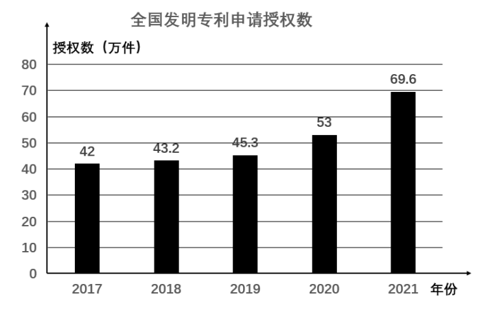
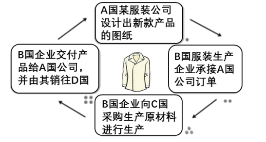
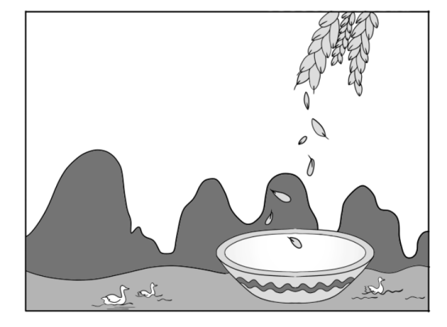

**道德与法治试题**

**一、选择题：本题共25小题，每小题2分，共50分。在每小题给出的四个选项中，只有一项是符合题目要求的。**

1\. 2021年是中国共产党成立100周年。2022年我们将迎来（ ）

A. 中国共产党第二十次全国代表大会

B. 全面建成小康社会

C. 基本实现社会主义现代化

D. 第二个百年奋斗目标的实现

【答案】A

【解析】

【详解】时事题，解析略。

2\. 下框时事新闻共同反映的主题是（ ）

<table>
<colgroup>
<col style="width: 100%" />
</colgroup>
<tbody>
<tr>
<td style="text-align: left;">
★中老铁路建成通车：对中国—东盟自由贸易区、大漏公河次区域经济合作将产生积极影响。

★我国与“一带一路”沿线国家货物贸易额创新高：我国推动共建“一带一路”取得实打实的成就。
</td>
</tr>
</tbody>
</table>

A. 独立自主，自力更生 B. 互利共赢，共同发展

C. 对话协商，兼收并蓄 D. 积极参与，合作治理

【答案】B

【解析】

【详解】本题考查构建人类命运共同体。

B：材料中，中老铁路建成通车、我国与“一带一路”沿线国家货物贸易额创新高，这些都体现了我国坚持构建人类命运共同体，坚持互利共赢，共同发展，故B正确；

ACD：选项说法不符合题意，故排除ACD；

故本题选B。

3\. 我国已经到了扎实推动共同富裕的历史阶段。关于分阶段促进共同富裕，下列排序正确的是（ ）

①全体人民共同富裕基本实现

②全体人民共同富裕迈出坚实步伐

③全体人民共同富裕取得更为明显的实质性进展

A. ①—②—③ B. ①—③—② C. ②—①—③ D. ②—③—①

【答案】D

【解析】

【详解】本题考查共同富裕的相关知识。

ABCD：我国根据发展阶段的新变化，明确了实现共同富裕的时间表：到“十四五”末，全体人民共同富裕迈出坚实步伐；到2035年,全体人民共同富裕取得更为明显的实质性进展；到本世纪中叶，全体人民共同富裕基本实现，D正确，ABC错误；

故本题选D。

4\. 从图中信息可以推断出国家重视

A. 农村供水保障 B. 农村环境整治

C. 城镇环境基础设施建设 D. 城乡社区服务体系建设

【答案】D

【解析】

【详解】本题考查共同富裕的相关知识。

A：农村供水保障不全面 ，A错误；

B： 农村环境整治不全面 ，B错误；

C： 城镇环境基础设施建设不全面 ，C错误；

D： 构建网络化管理、精细化服务、信息化支撑、开放共享的基层治理平台,制定实施城乡社区服务体系建设“十四五”规划，更好解决群众操心事烦心事揪心事，能推进社会主义民主政治的基础性工程，需提升现代科学技术在社会治理中的地位，推动城乡社区服务体系建设，D正确；

故本题选D。

5\. 下列新闻解读与时事新闻相匹配的是（ ）

|     |                           |                      |
|:---:|:-------------------------:|:--------------------:|
| 序号  | 时事新闻                      | 新闻解读                 |
| ①   | 人民币国际储备货币地位进一步提升          | 彰显出中国的实力、活力与魅力       |
| ②   | 《推进生态农场建设的指导意见》印发         | 提高我国新能源开发与利用水平       |
| ③   | 《儿童青少年学习用品近视防控卫生要求》正式实施   | 有助于缓解青少年用眼疲劳，降低近视发生率 |
| ④   | 中国量子计算原型机“祖冲之二号”和“九章二号”问世 | 表明我国总体科技发展水平位居世界前列   |

A. ①② B. ①③ C. ②④ D. ③④

【答案】B

【解析】

【详解】本题考查经济发展、科技的相关知识。

①：人民币加入SDR，成为国际储备货币一员，意味着人民币可以在全球经济交易中直接结算，这有利于提高我国开放型经济水平，更好地实施“走出去”战略，有利于提高我国在国际事务中的话语权，增强国际经济影响力，人民币国际储备货币地位进一步提升彰显出中国的实力、活力与魅力，①正确；

②：《推进生态农场建设的指导意见》印发内容向我们说明了我国要努力推进农村建设，加强农村的生态环境整治工作，②错误；

③：《儿童青少年学习用品近视防控卫生要求》正式实施关于加强儿童青少年近视防控工作的措施，体现了对未成年人的特殊保护和关爱，有利于保护未成年人的生命健康权，促进未成年人健康成长，有助于缓解青少年用眼疲劳，降低近视发生率，③正确；

④：中国量子计算原型机“祖冲之二号”和“九章二号”问世体现的是我国科技创新的成功，说明科研成果斐然，但我国总体科技发展水平还没有位居世界前列，④错误；

故本题选B。

6\. 小闽：你做事果断，但有些马虎，若能细心点就更好啦。

小福：你说得有理，我会慢慢改进的。

上述对话给我们的启示是（ ）

①勇于自我批评 ②重视他人评价 ③做更好的自己 ④懂得欣赏自己

A. ①③ B. ①④ C. ②③ D. ②④

【答案】C

【解析】

【详解】本题考查正确认识自己、做更好的自己的相关知识。

①：勇于自我批评与题意无关 ，①错误；

②③：小福：你说得有理，我会慢慢改进的，正确对待他人的评价告诉我们要正视现实，正确认识自己，要接受自己的缺点，又要看到自己的长处，给自己的恰当的定位，要做更好的自己，重视他人评价 ，②③正确；

④：懂得欣赏自己与题意无关，④错误；

故本题选C。

7\. 下列对校园生活“微行为”的“微点评”，正确的是（ ）

|     |                   |            |
|:---:|:-----------------:|:----------:|
| 序号  | 微行为               | 微点评        |
| ①   | 与好朋友一起参加班委竞选      | 用心去关怀对方    |
| ②   | 小组交流时，对不合理的观点提出质疑 | 具有批判性思维    |
| ③   | 经常与老师探讨学习和生活中的问题  | 能够与老师和谐相处  |
| ④   | 建议班级调整值日规则，得到大家赞同 | 正确面对交往中的冲突 |

A. ①② B. ①④ C. ②③ D. ③④

【答案】C

【解析】

【详解】本题考查批判思维、师生交往的相关知识。

①：与好友共同竞选班长，竞争不会伤害友谊，竞争与友谊可以共存，①错误；

②：根据所学知识可知，“学贵有疑”是指人要有批判精神，表现为对事情有自己的看法，并且敢于表达不同观点，敢于对不合理的事情说“不”，敢于向权威挑战，小组交流时，对不合理的观点提出质疑体现了具有批判性思维，②正确；

③：经常与老师探讨学习和生活中的问题体现了同学和老师之间的平等关系，师生之间互相尊重的道理，能够与老师和谐相处，③正确；

④：建议班级调整值日规则，属于批判性思维，④错误；

故本题选C。

8\. 自然界中，光秃秃的树干会长出新芽，断尾的壁虎会长出新的尾巴，被压在石头下的小草也可能从缝隙中生长出来…这些现象启示我们（ ）

①战胜挫折，需要具有坚强的意志 ②面对困境，应该寻求他人的帮助

③遇到困难，不同的人有相同反应 ④身处逆境，要发掘自身生命力量

A. ①③ B. ①④ C. ②③ D. ②④

【答案】B

【解析】

【详解】本题考查对挫折的正确认识。

①④：光秃秃的树干会长出新芽，断尾的壁虎会长出新的尾巴，被压在石头下的小草也可能从缝隙中生长出来，体现了战胜挫折，需要具有坚强的意志；身处逆境，要发掘自身生命力量，①④说法正确；

②：题文中体现的是面对困境要勇敢面对，没有体现出通过寻求他人的帮助面对困境，②说法正确与题不符；

③：遇到困难，不同的人会有不同的反应，③说法错误；

故本题选B。

9\. 河北阜平44名山里娃组成的“马兰花儿童声合唱团”，努力学习外语和音乐，在北京冬奥会开幕式和闭幕式上两度登台，用希腊语演唱《奥林匹克圣歌》，质朴的歌声感动了世界。孩子们用行动展现了（ ）

①超越自我的执着信念 ②团结向上的精神风貌

③公而忘私的高尚情操 ④勇于创造的价值追求

A. ①② B. ①③ C. ②④ D. ③④

【答案】A

【解析】

【详解】本题考查对自信、团队精神的相关知识的正确认识。

①：山里娃努力学习外语和音乐，，用希腊语演唱《奥林匹克圣歌》，体现了他们超越自我的执着信念 ，①说法正确；

②：“马兰花儿童声合唱团”的行动体现了团结向上的精神风貌，②说法正确；

③④：公而忘私和创造的品质在题文中没有体现，③④说法与题不符；

故本题选A。

10\. 水滴是散的，积聚起来就是辽阔的海洋：沙石是散的，堆积起来就是巍峨的大山。由此可以感悟出（ ）

A. 个人意愿必须服从集体规则的要求 B. 集体的力量取决于成员数量的多少

C. 个人汇聚到集体中能产生强大的力量 D. 集体的力量在一定程度上可以改变一个人

【答案】C

【解析】

【详解】本题考查正确认识集体的力量。

A：当集体规则与我们的个人意愿一致，并且能够保障个人利益时，我们更乐于积极遵守和维护，A说法错误；

B：集体的力量不仅取决于成员数量的多少，而且取决于成员之间的组织和配合，B说法错误；

C：把水滴、砂石比喻做个人，海把洋和大山比喻成集体，由此可以看出个人汇聚到集体中能产生强大的力量，C说法正确；

D：体现的是集体对个人的作用，D说法正确与题不符；

故本题选C。

11\. 为了远山孩子的呼唤，滇西支教团队，一群来自五湖四海的人，33年来先后10批次，近500人次到云南西部偏僻山区支教，累计培养出2万多名合格的初高中毕业生，输送出1万多名大中专生，写下了教育史上可歌可敬的篇章。若要报道这一事迹，最适合的标题是（）

A. 同伴携手齐奋进，呵护友谊见真情 B. 山高水远任重长，万水千山总关情

C. 见贤思齐学榜样，理解宽容暖人心 D. 浩荡东风千万里，壮美神舟日日新

【答案】B

【解析】

【详解】本题考查民族的相关知识。

A：呵护友谊见真情与题意无关 ，A错误；

B： “通过一群来自五湖四海的年轻人……展示了年轻一代军人的满腔热血及报效祖国的壮志豪情”,体现了该剧以正确的舆论引导人,以高尚的精神塑造人,以优秀的作品鼓舞人,体现了山高水远任重长，万水千山总关情 ，B正确；

C： 理解宽容暖人心与题意无关 ，C错误；

D： 浩荡东风千万里，壮美神舟日日新属于中华大地的变化，不符合题意，D错误；

故本题选B。

12\. 从材料可以看出（ ）

|                                                     |                                                                                                                                                                                                                                                                               |                                                                            |
|:--------------------------------------------------- |:----------------------------------------------------------------------------------------------------------------------------------------------------------------------------------------------------------------------------------------------------------------------------- |:-------------------------------------------------------------------------- |
| 2021年10月23日，十三届全国人大常委会第三十一次会议表决通过了《中华人民共和国家庭教育促进法》。 |  | 第四条 未成年人的父母或者其他监护人负责实施家庭教育。国家和社会为家庭教育提供指导、支持和服务。国家工作人员应当带头树立良好家风，履行家庭教育责任。 |

①法律是由国家制定的 ②国家建立了完备的法律制度

③未成年人自我约束意识增强 ④法律为未成年人健康成长护航

A. ①③ B. ①④ C. ②③ D. ②④

【答案】B

【解析】

【详解】本题考查法律的相关知识。

①：十三届全国人大常委会第三十一次会议表决通过了《中华人民共和国家庭教育促进法》体现了法律是由国家制定的 ，①正确；

②：我国的法律制度还不够完备，要不断完善法律体系，②错误；

③：未成年人自我约束意识增强没有体现， ③错误；

④：国家高度重视未成年人的健康成长。家庭教育促进法明确未成年人的父母或者其他监护人负责实施家庭教育，国家和社会为家庭教育提供指导、支持和服务。该法体现了对未成年人的特殊保护，有利于正确引导家庭对未成年人教育，体现了法律为未成年人健康成长护航，④正确；

故本题选B。

13\. 福建某地检察院联合教育局，聘任多名中小学生担任法治副校长的“法治小助理”，承担校园法治教育宣传员和监督员的职责。该举措有利于（ ）

①引导学生学法知法守法 ②鼓励学生参与法治实践

③提高青少年的执法能力 ④加强青少年的司法保护

A. ①② B. ①③ C. ②④ D. ③④

【答案】A

【解析】

【详解】本题考查法治的相关知识。

①②：依据题文描述和所学知识，中小学配备法治副校长，有利于增强学校师生权益的保护，推进青少年的法治教育，引导学生学法知法守法 ，鼓励学生参与法治实践，①②正确；

③：青少年不能执法 ，③错误；

④：司法保护是司法机关采取的措施，④错误；

故本题选A。

14\. 针对图中人物的行为，下列劝告合适的是（ ）

①要维护网络安全 ②要合理使用网络 ③要科学安排时间 ④要学会分工合作

A. ①② B. ①④ C. ②③ D. ③④

【答案】C

【解析】

【详解】本题考查合理利用网络。

①：公民要维护国家安全，其中包括维护网络安全，但和漫画内容无关，①说法与题不符；

②③：观察漫画内容可以看出凌晨一点还在玩手机，所以应该从合理使用网络、要科学安排时间角度进行劝告，②③说法正确；

④：分工合作在漫画中没有体现，④说法错误；

故本题选C。

15\. 下列行为与故事主题相符的是（ ）

|                                                                       |
|:--------------------------------------------------------------------- |
| 汉朝人季布，十分重视承诺，凡是答应别人的事情一定做到。他因此在当地人中享有很高的声誉，广受欢迎。乡亲们说：“得黄金百斤，不如得季布一诺。” |

A. 小东参加学校的艺术社团活动 B. 小方外出就餐时，将剩余饭菜打包回家

C. 小晨与同学共同扶起摔倒的老人 D. 小曦与同学约定周末打篮球，准时赴约

【答案】D

【解析】

【详解】本题考查诚信的相关知识。

A：小东参加学校的艺术社团活动属于亲社会行为 ，A错误；

B： 小方外出就餐时，将剩余饭菜打包回家属于勤俭节约 ，B错误；

C： 小晨与同学共同扶起摔倒的老人属于关爱他人 ，C错误；

D：季布一诺体现了诚信是一个人安身立命之本。孔子说：“人而无信，不知其可也。”诚信是我们融人社会的“通行证”，一个人真诚老实、笃守诺言，无论走到哪里都能赢得信任。相反，如果弄虚作假、口是心非，就会处处碰壁，甚至无法立身处世。 小曦与同学约定周末打篮球，准时赴约体现了遵守诺言，诚实守信，D正确；

故本题选D

16\. 在收到的快递包装盒上，发现有“充值19元赠送100元话费”的二维码广告，正确做法是（ ）

A. 立即扫码充值 B. 分享二维码给朋友 C. 不轻易扫码 D. 拨打119报警电话

【答案】C

【解析】

【详解】本题考查合理利用网络。

ABC：网络具有虚拟性，我们要增强自我保护的意识。我们要学会辨别网络信息，不轻易扫码，A、B说法错误，C说法正确；

D：119是火警电话，D说法错误；

故本题选C。

17\. 陈某骑电动车闯红灯，被执勤交警依法处以30元罚款。据此判断，陈某（ ）

A. 违反刑事法律，承担刑事责任 B. 违反行政法律，承担行政责任

C. 违反民事法律，承担民事责任 D. 违反经济法律，承担赔偿责任

【答案】B

【解析】

【详解】本题考查违法行为。

B：闯红灯，违反道路交通安全法这一行政法律，是行政违法行为，受到了行政处罚，罚款属于承担行政责任。故B正确；

AC：材料未涉及刑事责任、民事责任，故排除AC；

D：材料未涉及违反经济法律，承担赔偿责任，故排除D；

故本题选B。

18\. 福建省创新营商环境评估机制，加强数字化监测督导，以企业群众满意度为评价标准，推行制度公开、流程公开、效率公开，把审批和服务全流程置于社会监督之下。这体现了政府（ ）

①实施宏观调控 ②保障公民的知情权监督权 ③推进政务公开 ④推动产业升级，提高生产效益

A ①③ B. ①④ C. ②③ D. ②④

【答案】C

【解析】

【详解】本题考查对依法行政的正确认识。

①：社会主义市场经济中政府起着宏观调控的作用，①说法在题文中没有体现；

②③：福建省推行制度公开、流程公开、效率公开，有利于保障公民的知情权监督权 ，推进政务公开，推进依法行政，②③说法正确；

④：题文中没有体现出经济方面的成就，④说法与题不符；

故本题选C。

19\. 我国宪法序言规定：“全国各族人民、一切国家机关和武装力量、各政党和各社会团体、各企业事业组织，都必须以宪法为根本的活动准则，并且负有维护宪法尊严、保证宪法实施的职责。”这表明（ ）

A. 宪法具有至高无上的权威 B. 宪法是国家法制统一的基础

C. 宪法内容涵盖了社会生活的方方面面 D. 宪法的制定和修改程序比其他法律严格

【答案】A

【解析】

【详解】本题考查宪法的相关知识。

A：题干这段规定说明宪法是最高的行为准则，宪法是一切组织和个人的根本活动准则，公民的活动必须在法律许可的范围内，宪法具有至高无上的权威 ，A正确；

BD： 宪法是国家法制统一的基础 ， 宪法的制定和修改程序比其他法律严格观点正确，但与题干不一致，BD错误；

C： 宪法规定国家生活中最根本的问题 ，C错误；

故本题选A。

20\. 观察下图，可以得出的正确结论是（ ）

①人人都是发明者和创造者 ②创新让我们的生活更加美好

③我国发明创新成果逐年增加 ④人们保护知识产权的意识增强

A. ①② B. ①③ C. ②④ D. ③④

【答案】D

【解析】

【详解】本题考查创新的相关知识。

①：人人都是发明者和创造者没有体现， ①错误；

②：创新让我们的生活更加美好没有体现， ②错误；

③：全国发明专利申请授权数不断增加说明我国发明创新成果逐年增加 ，③正确；

④：题文描述的相关变化源于人们法治意识的增强，人们保护知识产权的意识不断增强，源于社会对创新的尊重和保护，④正确；

故本题选D。

21\. 某村推行村民说事制度。定期召开村民说事会，如实记录村民说的“事”，提出相关问题后，由村党支部和村委会提出初步意见，再提交说事会进行决策。村民说事会议定办理的事项及办理情况全部公示并全程接受群众监督。该村的做法，体现了（ ）

A. 说事会行政地位得到提高 B. 集中民智，村民间接参与基层管理

C. 村民的需求皆能得到满足 D. 有事好商量，众人的事情由众人商量

【答案】D

【解析】

【详解】本题考查社会主义民主的相关知识。

D：我国社会主义民主是新型的民主。题干中，村民说事会议定办理的事项及办理情况全部公示并全程接受群众监督。这体现了有事好商量，众人的事情由众人商量，故D正确；

A：材料未涉及说事会行政地位得到提高，故排除A；

B：该村的做法有利于村民直接参与基层管理，故排除B；

C：都得到满足，说法绝对，故排除C；

故本题选D。

22\. 某地积极开展“微心愿”活动，陪老人聊天、给老人理发、帮助照看孩子…随着“微心愿”一个个实现，“你有困难我来帮”深入人心。“微心愿”活动，彰显的社会主义核心价值观是（ ）

①敬业 ②和谐 ③友善 ④平等

A. ①③ B. ①④ C. ②③ D. ②④

【答案】C

【解析】

【详解】本题考查对社会主义核心价值观的正确认识。

①：敬业也是公民个人层面的价值准则，但题文中没有体现，①说法与题不符；

②③：“微心愿”活动体现的是强烈的社会责任感，体现了与人为善，有利于构建和谐社会，所以体现的是和谐、友善的社会主义核心价值观，②③说法正确；

④：平等是社会主义核心价值观社会层面的价值取向，但题文中没有体现，④说法与题不符；

故本题选C。

23\. 维护和促进民族团结，是每个公民的神圣职责和光荣义务。为履行好这一义务，中学生应该（ ）

①铸牢中华民族共同体意识 ②学习党的民族政策

③精通各民族的传统技艺 ④体验祖国各地的风土人情

A. ①② B. ①③ C. ②④ D. ③④

【答案】A

【解析】

【详解】本题考查民族的相关知识。

①②：维护和促进民族团结是每个公民的神圣职责和光荣义务,青少年也不例外。我们青少年应该树立中华民族共同体意识，尊重各民族的宗教信仰,风俗习惯和语言文字,学习党的民族政策，积极向周围的人宣传我国的民族政策,还要敢于同一切破坏民族团结的言行作斗争 ，①②正确；

③：精通各民族的传统技艺太绝对 ，③排除；

④：体验祖国各地的风土人情不符合现实，④排除；

故本题选A。

24\. 图中反映的是（ ）

A. 世界多极化 B. 经济全球化 C. 文化多样化 D. 社会信息化

【答案】B

【解析】

【详解】本题考查正确认识经济全球化的表现。

B：观察图示可以看出，商品生产和商品贸易在全球范围内进行，是经济全球化的表现，B说法正确；

ACD：世界正处于大发展大变革大调整时期，世界多极化、文化多样化和社会信息化深入发展，但题文中没有体现，A、C、D说法与题不符；

故本题选B。

25\. 30年来，一批又一批中国维和军人前赴后继、向险而行、英勇出征先后参加25项联合国维和行动，足迹遍布全球20多个国家和地区，为世界和平与发展注入正能量。中国军队参加联合国维和行动源于（ ）

①中华民族爱好和平 ②中国是负责任的大国 ③国与国之间的相互信任 ④世界各国共享发展机遇

A. ①② B. ①④ C. ②③ D. ③④

【答案】A

【解析】

【详解】本题考查正确认识世界舞台上的中国。

①②：中国维和军人前赴后继、向险而行、英勇出征先后参加25项联合国维和行动，为世界和平与发展注入正能量，源于中华民族爱好和平，是一个和平、负责任的大国，①②说法正确；

③④：体现的不是中国军队参加联合国维和行动的原因，③④说法与题不符；

故本题选A。

**二、非选择题：请根据下列各题要求，回答问题。共5题，共50分。**

26\. 判断说理

判断下列做法或说法是否正确（正确的在括号内打“正确”，错误的在括号内打“错误”），并说明理由。

（1）图5中同学的行为。

理由：\_\_\_\_\_\_\_\_\_\_\_\_\_\_\_\_\_\_\_\_\_\_\_\_\_\_\_\_\_\_\_\_\_\_\_\_\_\_\_\_\_

（2）小明说：“权利是法律赋予我的，怎么行使是我的自由。”

理由：\_\_\_\_\_\_\_\_\_\_\_\_\_\_\_\_\_\_\_\_\_\_\_\_\_\_\_\_\_\_\_\_\_\_\_\_\_\_\_\_\_

【答案】（1）（正确）理由：该同学主动分担家务，用行动表达孝敬之心，传承了中华传统美德，履行了法定义务。

（2）（错误）理由：公民享有法律赋予的权利，但行使权利有界限。在法律规定的范围内行使权利，是自由的；否则，就可能失去自由。

【解析】

【分析】考点考查：孝敬父母、权利

能力考查：分析材料提取观点的能力

核心素养：道德修养、法治观念、健全人格、责任意识

【小问1详解】

第一步：根据所学知识和材料信息，判断观点正误。

观点正误：正确

第二步：根据所学知识和材料信息，说明判断依据

判断依据：该同学主动分担家务，用行动表达孝敬之心，传承了中华传统美德，履行了法定义务

第三步：整合信息，组织答案。

小问2详解】

第一步：根据所学知识和材料信息，判断观点正误。

观点正误：错误

第二步：根据所学知识和材料信息，说明判断依据

判断依据：公民享有法律赋予的权利，但行使权利有界限。在法律规定的范围内行使权利，是自由的；否则，就可能失去自由。

第三步：整合信息，组织答案。

27\. 时事点评

我国加强国际传播能力建设，将讲好中国故事，传播好中国声音，展示真实、立体、全面的中国作为重要任务。坚持国家站位、全球视野，全方位、多角度向世界讲好中国故事、介绍中国经验传播好中国声音，让世界感知中国，让开放自信的中国在世界舞台上绽放光彩。

运用时事知识，对“我国加强国际传播能力建设”做出点评。

【答案】提高国际传播能力，能够让世界真实、立体、全面地了解中国；有助于提升我国的国际影响力、感召力和塑造力；有助于展现中国形象，增强民族自信。

【解析】

【分析】考点考查：正确认识世界舞台上的中国

能力考查：调动和运用所学知识分析问题的能力

核心素养：政治认同

【详解】第一步：审设问，明确主体，作答范围及作答角度。

本题的设问主体是国家，需要运用世界舞台上的中的有关知识，从评析类习题的角度进行作答。

第二步：审材料，提取关键词，链接教材知识。

关键词①：讲好中国故事，传播好中国声音→提高国际传播能力，让世界了解中国；

关键词②：让世界感知中国，让开放自信的中国在世界舞台上绽放光彩→提升我国的国际影响力、感召力和塑造力；有助于展现中国形象，增强民族自信。

第三步：整合信息，组织答案。

28\. 阅读材料，回答问题。

<table>
<colgroup>
<col style="width: 100%" />
</colgroup>
<tbody>
<tr>
<td style="text-align: left;">
相关链接：

去银行办事或者在车站买票，会发现在柜台办理业务的顾客与后面排队的顾客之间隔着一段距离，地上还画着一条黄线，这就是“一米线”。
</td>
</tr>
</tbody>
</table>

“一米线”是社会生活中的一道风景线。

镜头一 在设有“一米线”的公共场所，大多数人能自觉保持“一米线”的距离。

镜头二 在“一米线”外排队等候的人，有的容易产生焦躁情绪。

（1）运用所学知识，分析人们能自觉保持“一米线”距离的原因。

（2）如何让“一米线”外排队等候人减少焦躁情绪的产生？

【答案】（1）具有法治意识，遵守公共秩序，维护他人隐私；具有道德意识，尊重社会公德，既能自我尊重又能尊重他人。

（2）帮助人们转移注意力，如提供报刊、茶水等人性化服务；排队的人可以通过放松活动等方式自我调节情绪。

【解析】

【分析】考点考查：情绪、法治、道德

能力考查：分析材料提取观点的能力

核心素养：道德修养、法治观念、健全人格

【小问1详解】

第一步：审设问，明确主体、作答范围及作答角度

本题的设问主体为公民， 需要运用法治、道德的有关知识，从原因类习题的角度进行作答。

第二步：审材料，提取关键词，链接教材知识

关键词：在柜台办理业务的顾客与后面排队的顾客之间隔着一段距离→可链接的教材知识具有法治意识，遵守公共秩序，维护他人隐私；具有道德意识，尊重社会公德，既能自我尊重又能尊重他人。

第三步：整合信息，组织答案。

【小问2详解】

第一步：审设问，明确主体、作答范围及作答角度

本题的设问主体为学生， 需要运用情绪的有关知识，从措施类习题的角度进行作答。

第二步：审材料，提取关键词，链接教材知识

关键词：减少焦躁情绪→可链接的教材知识调控情绪的方法

第三步：整合信息，组织答案。

29\. 阅读材料，回答问题。

九年级（1）班同学围绕着“种子”主题，开展探究与分享活动，请你参与完成相关任务。

<table>
<colgroup>
<col style="width: 100%" />
</colgroup>
<tbody>
<tr>
<td style="text-align: center;">
分享一 农业“芯片”

★国以农为本，农以种为先。种子是农业的“芯片”，我们必须把种子牢牢擦在自己手里。这些年，我国粮食单产有较大幅度提升，50%以上归功于品种改良；我国农作物自主选育的品种种植面积占到95%以上，做到了“中国粮主要用中国种”。

★种质资源是种子的遗传资源，保护好种质资源才能培育出好种子。2021年，我国开展了新中国历史上规模最大的农业种质资源普查；投入试运行国家种质资源库，能满足未来50年、5000个物种、150万份种质资源的安全保存。

★“十四五”时期，我国将种业确定为农业科技攻关及农业农村现代化的重点任务，要在补齐短板、突破瓶颈上强化科技支撑。
</td>
</tr>
</tbody>
</table>

（1）结合分享一，运用所学知识，说明我国多措并举发展种业的意义。

<table>
<colgroup>
<col style="width: 100%" />
</colgroup>
<tbody>
<tr>
<td style="text-align: center;">
分享二 神奇种子

★我国的田野“深闺”蕴藏着众多神奇种子。例如，“珍珠玉米”具有神奇的魔力，用一口普普通通的锅，就能把玉米粒变成爆米花，爆米花率达99%以上；“庄红贡米”的营养价值高，铁和锌等微量元素含量是普通大米的8倍至15倍……

★我国计划用3年时间抢救性收集保护各地珍稀濒危种质资源、发掘优异新资源。
</td>
</tr>
</tbody>
</table>

（2）根据分享二，完成以下校园科普宣传活动方案中的①②部分。

<table>
<colgroup>
<col style="width: 47%" />
<col style="width: 52%" />
</colgroup>
<tbody>
<tr>
<td style="text-align: center;">
“神奇种子”校园科普宣传活动方案

目的：

①_________________________________

②_________________________________

形式：图文展板

……
</td>
<td style="text-align: left;"></td>
</tr>
</tbody>
</table>

【答案】（1）把种子牢牢攥在自己手里，有利于保障粮食安全，维护国家安全和利益；保护好种质资源，有利于保护种子品种，促进农业可持续发展；强化科技支撑，有利于增强种业自主创新能力，促进科技兴农。

（2）了解我国种子和种质资源状况，增强珍惜和保护意识；激发同学们探究科学的兴趣提升科学素养。

【解析】

【分析】考点考查：正确认识我国发展种业的意义、校园科普宣传活动方案如何实施

能力考查：调动和运用所学知识分析问题的能力

核心素养：政治认同、责任意识

【小问1详解】

第一步：审设问，明确主体，作答范围及作答角度。

本题的设问主体是国家，需要运用国家安全、粮食安全的有关知识，从意义类习题的角度进行作答。

第二步：审材料，提取关键词，链接教材知识。

关键词①：国以农为本，农以种为先。种子是农业的“芯片”→有利于保障粮食安全，维护国家安全和利益；

关键词②：种质资源是种子的遗传资源，保护好种质资源才能培育出好种子→有利于保护种子品种，促进农业可持续发展；

关键词③：我国将种业确定为农业科技攻关及农业农村现代化的重点任务→增强种业自主创新能力，促进科技兴农。

第三步：整合信息，组织答案。

【小问2详解】

本问为开放性试题，学生围绕了解我国的粮食安全、激发探究能力和科学素养、珍惜粮食等角度组织答案即可。

30\. 阅读材料，回答问题。

让人民生活幸福是“国之大者”。它镌刻在中华民族伟大复兴的历史进程中，印证在人民的幸福生活里。

【思幸福之源】

|                                                                                                                                           |
|:----------------------------------------------------------------------------------------------------------------------------------------- |
| 材料一 党的十八大以来，中国特色社会主义进入新时代。中国共产党不忘初心，牢记使命，团结带领中国人民，发扬伟大民族精神，自信自强、守正创新，创造了新时代中国特色社会主义的伟大成就，中华民族迎来了从站起来、富起来到强起来的伟大飞跃，实现中华民族伟大复兴进入了不可逆转的历史进程。 |

（1）从材料一中，你能悟出哪些道理？

【晒幸福之美】

<table>
<colgroup>
<col style="width: 30%" />
<col style="width: 34%" />
<col style="width: 34%" />
</colgroup>
<tbody>
<tr>
<td colspan="3" style="text-align: left;">材料二 感恩奋进，福建人亮出了自己2021年的“幸福清单”</td>
</tr>
<tr>
<td style="text-align: left;">全年地区生产总值比上年增长8.0%，居民人均可支配收入比上年增长9.3%，居民人均生活消费支比上年增长13.2%。老百姓钱袋子鼓起来子越来越红火。</td>
<td style="text-align: left;">全省共有影院367家，公共图书馆95个，文化馆97个，博物馆138个，文化系统各类艺术表演团体演出0.78万场，观众477.94万人次。越来越多的人享受到更加优质、便捷的公共文化服务。</td>
<td style="text-align: left;">全省就业形势保持平稳，城镇新增就业52万人；住房保障更加有力，一批住房困难群众圆了安家梦；多渠道增加健康、养老、育幼等生活性服务业有效供给。人们生活更加安心、舒心。</td>
</tr>
</tbody>
</table>

（2）结合材料二，运用所学知识，分析福建是如何提升人民群众幸福感的人

【逐幸福之梦】

|                                         |
|:--------------------------------------- |
| 材料三 当代青年要心怀“国之大者”，在青春的赛道上奋力奔跑，争取跑出最好成绩！ |

（3）以“奋斗”“幸福”为关键词写一则寄语，激励自己不负时代，不负韶华，不负党和人民。

【答案】（1）中国共产党领导是中国特色社会主义最本质的特征；中国共产党坚持以人民为中心的发展思想；伟大民族精神是激励中华儿女为实现中国梦而奋斗的不竭精神动力。

（2）发展经济，增加人民收入，提高人民生活水平；推动文化事业建设，满足人民群众精神文化生活需求；保障和改善民生，共享发展成果。

（3）青春的我们需要奋斗，发扬艰苦奋斗的精神，为人民的生活幸福作出自己的贡献！

【解析】

【分析】考点考查：对中国共产党、民族精神的正确认识，坚持以人民为中心的发展思想的举措，青少年肩负的历史使命

能力考查：调动和运用所学知识分析问题的能力

核心素养：政治认同、责任意识

【小问1详解】

第一步：审设问，明确主体，作答范围及作答角度。

本题的设问主体是学生，需要运用党的地位、民族精神的有关知识，从感悟类习题的角度进行作答。

第二步：审材料，提取关键词，链接教材知识。

关键词①：中国共产党不忘初心，牢记使命→中国共产党领导是中国特色社会主义最本质的特征；中国共产党坚持以人民为中心的发展思想；

关键词②：发扬伟大民族精神，自信自强、守正创新，创造了新时代中国特色社会主义的伟大成就→民族精神的重要性。

第三步：整合信息，组织答案。

【小问2详解】

第一步：审设问，明确主体，作答范围及作答角度。

本题的设问主体是政府，需要运用政府的举措的有关知识，从措施类习题的角度进行作答。

第二步：审材料，提取关键词，链接教材知识。

关键词①：地区生产总值、居民人均可支配收入的增长等→发展经济，增加人民收入；

关键词②：越来越多的人享受到更加优质、便捷的公共文化服务→满足人民的群众的文化需求；

关键词③：全省就业形势保持平稳→保障和改善民生，共享发展成果。

第三步：整合信息，组织答案。

【小问3详解】

本问为开放性试题，所写寄语围绕“奋斗”“幸福”等关键词即可。
