**2022年辽宁省普通高等学校招生选择性考试**

政　治

一、选择题:本题共16小题,每小题3分,共48分。在每小题给出的四个选项中,只有一个是符合题目要求的。

1.李大钊曾说,马克思主义是“世界改造原动的学说”,但必须研究它“怎样应用于中国今日的政治经济情形”。毛泽东指出,“离开中国特点来谈马克思主义,只是抽象的空洞的马克思主义”。习近平总书记指出,“坚持用马克思主义之‘矢’去射新时代中国之‘的’”。这些论述强调

①马克思主义为人类社会发展进步指明方向

②马克思主义是为人类求解放的人民的理论

③党必须不断推进马克思主义中国化时代化

④马克思主义是不断发展的开放的理论

A.①② B.①④ C.②③ D.③④

2.改革开放以来,我们既不走封闭僵化的老路,也不走改旗易帜的邪路,依靠人民群众创造了伟大奇迹,实现了从生产力相对落后到经济总量跃居世界第二的历史性突破,全面建成了小康社会,开启了全面建设社会主义现代化国家新征程。这表明

①改革开放必须坚持走中国特色社会主义道路

②改革开放必须突破制度约束,解放和发展生产力　③人民群众是改革开放的实践者、参与者和贡献者　④改革开放是我国取得一切成绩和进步的根本原因

A.①② B.①③ C.②④ D.③④

3.辽宁是抗日战争起始地、解放战争转折地、新中国国歌素材地、抗美援朝出征地、共和国工业奠基地、雷锋精神发祥地,与党的民族复兴伟业同频共振,孕育和传承的红色基因融入辽宁人民的血脉,书写了辉煌与荣光。上述成就的取得在于辽宁

①始终坚定不移地坚持中国共产党的坚强领导

②坚持以中国特色社会主义思想引领前进方向

③致力于中华民族有史以来最深刻的社会变革

④人民具有中华民族勇敢坚毅和忠诚担当的品质

A.①② B.①④ C.②③ D.③④

4.钢铁企业A(央企)和B(地方国企)重组,地方国资委将所持B企业51%股权无偿划转给A企业。两家企业在铁矿资源储备和采选技术方面都有优势,重组后可推进钢铁板块和铁矿石板块整合运作,粗钢产能将跃居世界第三。该重组有利于

①提高国有资本在钢铁行业中占比,放大国有资本功能　②实现A、B公司股权多元化,激发国有企业市场活力　③增加铁矿石供给,维护钢铁行业产业链供应链的稳定　④提升产业集中度,推动钢铁产业布局优化和结构调整

A.①② B.①③ C.②④ D.③④

5.药品集中带量采购是采购机构以公开招标的形式,用“团购”方式向药品供应商购买明确数量的药品。第六批国家集采药品上市后,患者惊喜发现,胰岛素价格降了近50%。下列关于“集采”的传导过程正确的是

①中标药企和医院的获利空间被压缩

②药品采购过程中的非必要环节减少

③药企和医院参与分摊医疗保障责任

④采用大范围的药企竞价或议价模式

⑤中标药品的采购价格回归合理区间

A.②→④→①→③ B.④→③→①→⑤

C.②→③→④→⑤ D.④→②→⑤→③

6.2022年3月30日,习近平总书记第10次参加首都义务植树活动,倡导人人爱绿植绿护绿的文明风尚。党坚持林草兴则生态兴理念,带领人民开展国土绿化,改善城乡人居环境,完善生态环境法律法规体系,美丽中国正在不断变为现实。材料表明

①倡导人人爱绿植绿护绿的文明风尚是法治政府的职能　②党在推动美丽中国的建设中坚持科学执政和依法执政　③改进党对生态文明建设的领导方式旨在坚持民主执政　④促进绿色发展要不断增强全民的生态意识和劳动意识

A.①② B.①③ C.②④ D.③④

7.为推动乡村振兴战略实施,某市在一批边远且经济相对落后的村、社区设立人大代表工作室。以此为依托,人大代表联系相关职能部门,及时解决群众急难愁盼问题。充分发挥人大代表工作室功能有利于

①协助所在地方党委改进和推进工作　②人大代表在村、社区行使国家权力　③加强群众、政府、人大之间的联系　④人大代表在人大闭会期间依法履职

A.①② B.①③ C.②④ D.③④

8.某区在下辖乡镇打造多家“和顺茶馆”,邀请党员、群众及法律工作者担任人民调解员。当居民、商家、游客发生利益纠纷时,调解员以茶馆为载体,为其提供便捷、专业的服务,从而有效化解社会矛盾。这种做法

①为人民群众提供了有效的法律援助　②充分体现了共建共管共治共享理念　③实现了自治、法治、德治“三治融合”　④创设了舒缓环境,使社会治理有温度

A.①③ B.①④ C.②③ D.②④

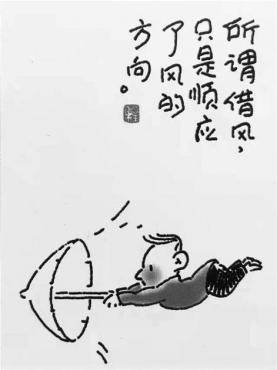

9.右面漫画(作者:程远)蕴含的哲学道理是

①欲借风力须顺风势

②任运自在随风飘荡

③驾伞乘风去我所向

④逆势而动方得如愿

A.①② B.①③ C.②④ D.③④

10.2021年入选中国“百年百大考古发现”的合浦汉墓群印证了史籍关于汉代海上丝绸之路的记载,其中出土了大量来自东南亚、南亚及地中海等区域的玻璃器。广西合浦作为航线东端起点,虽地处相对落后的边陲,其玻璃器制作水平却高于中原。可见

①海上丝绸之路沿线存在着跨区域的文化与技术交流　②合浦所处的地理位置构成了其与外界联系的不利条件　③海上丝绸之路是人们出于需要基于实际建立的人为联系　④合浦玻璃器制作水平提高表明海上丝绸之路目标的实现

A.①③ B.①④ C.②③ D.②④

11.“关关雎鸠,在河之洲。窈窕淑女,君子好逑。”(《诗经·关雎》)汉代统治者以此诗教化天下夫妇遵守封建道德规范以维护社会秩序。汉之后它有时也被看作情诗。今天我们将其理解为爱情中青年男女平等尊重的恋歌。对《关雎》的不同理解

①构成了不同时代各自独立意义的系统

②体现社会制度与其主导的价值观的根本一致

③表明艺术和经济基础之间存在直接对应关系

④反映了不同社会的经济关系和政治关系

A.①② B.①③ C.②④ D.③④

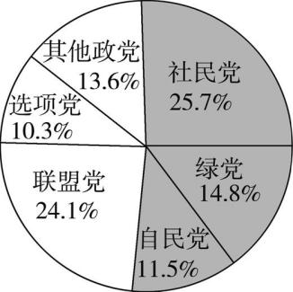

12.某国大选各主要政党支持率如右图所示。社民党积极回应选民社保诉求,获得了26%的工人群体和23%的失业群体的支持。因所获议席未过半数,社民党最终与绿党、自民党组成新一届联合政府,该党候选人出任总理。由此可见

①选举结果凸显了该国碎片化的政党格局　②联合执政旨在平衡政党之间的利益关系　③该国政府要接受议会监督并定期向议会报告工作　④社民党执政的原因是其代表了工人和失业群体的利益

A.①③ B.①④ C.②③ D.②④

13.2022年1月,“粮农组织——中国南南合作计划”第三期正式启动。中国将向粮农组织捐赠5 000万美元,围绕减贫、粮食安全等领域,加快落实联合国“2030年可持续发展议程”。这表明中国

①同国际社会一道推进全球发展事业　②为应对全球粮食安全贡献中国方案　③与联合国主要机构合作完善粮农治理　④以实际行动践行人类命运共同体理念

A.①② B.①④ C.②③ 　　　 D.③④

14.小曹在打印硕士毕业论文时遗落U盘,其同班同学小孙发现后,将U盘中小曹的搞怪视频上传到校内网论坛,引发学生围观,评论不乏挖苦调侃,导致小曹抑郁。学校知道后立即删除帖子并对小孙进行批评教育。下列说法正确的是

①小孙侵害了小曹的隐私权,但未侵害其身体权

②小孙父母应对小孙侵权行为依法承担民事责任

③责任承担可以采取赔礼道歉、消除影响的方式

④若小曹向法院提起诉讼,应适用举证责任倒置

A.①③ B.①④ C.②③ D.②④

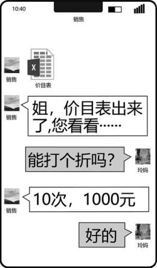

15.“双减”政策实施后,小玲妈妈为高一的小玲报名寒假兴趣班,微信记录如图所示。小玲去上课时被要求在报名表上签字,其上记载:课费不退。后受新冠肺炎疫情影响小玲未能完成剩余9次课程,小玲妈妈向兴趣班主张退费被拒,遂诉诸法院。本案中

①销售人员发送价目表的行为是要约邀请,具有法律约束力　②合同在回复“好的”时成立,“课费不退”不作为合同内容　③合同自小玲签字时生效,可以主张不可抗力请求退费　④合同系以书面形式订立,微信记录构成电子数据证据

A.①② B.①③ C.②④ D.③④

16.随着“神舟十三”搭载物的出舱,太空种子重新成为关注焦点。太空种子是指精选作物种子,通过航天器将其搭载到太空,在空间特殊环境下经过航天诱变使种子发生基因突变,然后再到地面进行培育,从中优选出来的种子。由此推出一定为真的是

①有的太空种子不是经过航天诱变培育出来的　②所有太空种子都是经过航天诱变培育出来的　③有的经过航天诱变培育出来的种子是太空种子　④所有经过航天诱变培育出来的种子都是太空种子

A.①② B.①④ C.②③ D.③④

二、非选择题:本题共4小题,共52分。

17.(12分)阅读材料,完成下列要求。

　　材料一　2022年1月1日,《区域全面经济伙伴关系协定》(RCEP)在中国正式生效实施。RCEP规则中加入了电子商务、政府采购、竞争等议题,提高了知识产权等议题的承诺水平。RCEP的生效实施不仅将逐步实现区域内90%以上的货物贸易零关税,而且有利于发挥区域内成员国比较优势,形成区域内产业链、供应链的闭环。

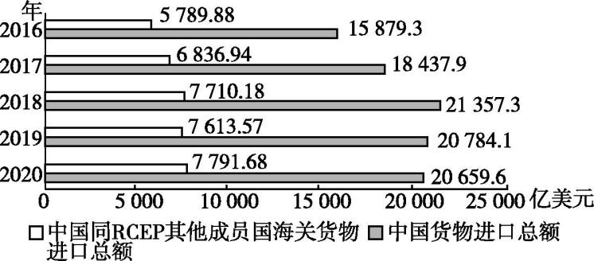

中国货物进口总额和中国同RCEP其他成员国海关货物进口总额

　　材料二　习近平总书记指出,构建新发展格局要避免“各自为政、画地为牢,不关心建设全国统一的大市场、畅通全国大循环,只考虑建设本地区本区域小市场、搞自己的小循环”。2022年,《中共中央 国务院关于加快建设全国统一大市场的意见》正式印发,明确提出建设全国统一大市场是构建新发展格局的基础支撑和内在要求。《意见》指出,建设全国统一大市场的主要目标是持续推动国内市场高效畅通和规模拓展,加快营造稳定公平透明可预期的营商环境,进一步降低市场交易成本,促进科技创新和产业升级,培育参与国际竞争合作新优势。

(1)运用当代国际政治与经济知识,解读材料一中的经济信息。(4分)

(2)结合材料一和材料二,运用经济与社会知识,谈谈RCEP生效实施与建设全国统一大市场在提升市场资源配置效率方面有哪些共通的突破点。(8分)

18.(12分)阅读材料,完成下列要求。

　　党的十九届六中全会通过的《中共中央关于党的百年奋斗重大成就和历史经验的决议》指出,“国泰民安是人民群众最基本、最普遍的愿望”“保证国家安全是头等大事”。

当新冠肺炎疫情暴发时,我们统筹医护人员和医疗物资调度,打击疫情期间的各类犯罪活动;当中印边界危机发生时,我们稳妥处置,捍卫领土主权;当国外安全形势恶化时,我们组织中国公民有序撤离……国家坚定地维护着政治、经济、军事、文化、社会、信息等各方面安全。人民群众对国家安全工作的满意度越来越高,越来越多的人认识到中国是世界上最安全的国家之一。

　　国家安全一切为了人民,一切依靠人民。洪水席卷而来时,共产党员投身防汛一线,共筑安全堤坝;突发公共安全事件时,民警全力应对,日夜值守,保障辖区安全;军港被暗中拍摄时,有市民依据我国保密法,拨打12339举报电话……正是人人守护家园,众志成城,才有了国家兴旺发达、长治久安。

　　结合材料,运用政治与法治知识,说明中国为什么能成为世界上最安全的国家之一。

19.(6分)阅读材料,完成下列要求。

　　沈某大学毕业后与周某共同投资设立“某市创美创意有限责任公司”。公司成立恰逢全国“两会”,沈某了解到神舟十五号将在年底前与神舟十四号在太空“会师”,于是决定以“神舟美绘”为主题,采用抽象画的方式呈现会师美景,并应用于创意解压系列产品。客户对此颇为青睐,遂与创美公司签订《独家许可使用合同》。创美公司要求全体员工对产品研创严格保密。两个月后产品研创成功,在准备履行合同时,发现市面上出现画样几近相同的抱枕。经调查:员工徐某在朋友圈发工作照片时带入该画样,朋友孙某点赞转发后,被A公司发现并用于自己的产品。客户遂主张违约责任。

结合材料,运用法律与生活知识,分析创美公司是否有权向A公司、孙某、徐某请求承担责任;若创美公司全部财产不足以承担违约责任,沈某和周某是否承担清偿责任。请分别说明理由。

20.(22分)阅读材料,完成下列要求。

　　掷铁饼是一项古老的奥林匹克项目。以掷铁饼为题材的经典雕塑作品,从艺术的视角展示奥林匹克文化,阐释和传递奥林匹克精神。

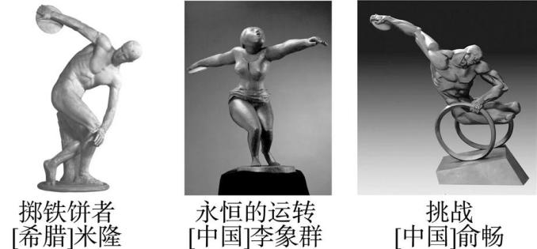

　　《掷铁饼者》是希腊雕塑家米隆创作于约公元前450年的作品,被誉为古希腊雕塑艺术的里程碑。这尊雕塑展示了希腊式掷铁饼方式,把人体的和谐、健美和青春的力量表达得淋漓尽致,被认为是“空间中凝固的永恒”。它超越传统对称的表达方式,强调动感,体现着人类对奥林匹克精神的不懈追求。它所凝结的力与美至今依然深深地影响和感染着我们。

《永恒的运转》是中国著名雕塑家李象群创作于1993年的作品,被瑞士洛桑国际奥委会博物馆收藏。受古希腊雕塑风格影响,又加入了汉唐元素和陶艺手法,作品以女孩的自由式旋转投掷方式展现东方艺术的典雅韵味,圆润的运动轨迹折射出人与自然的和谐共生,艺术和体育相互融合,展现奥林匹克精神生生不息。

《挑战》是中国雕塑家俞畅创作于1989年的成名作。雕塑通过简洁有力的手法,刻画了一位果敢坚毅的掷铁饼者形象。作品借鉴《掷铁饼者》的动作和势态,表现一个残疾人坐在轮椅上掷铁饼的瞬间,呈现出一种震撼人心的生命律动,给予人们不屈的力量、不服的决心、不灭的希望,奏响一首命运交响曲。

三尊雕塑承载了体育精神,运转的铁饼诠释了更快、更高、更强、更团结的奥林匹克格言,高高举起的手臂展现了青春该有的样子。

(1)三尊雕塑都蕴含了人类的共同精神却各具特色。结合材料,分析《掷铁饼者》与《永恒的运转》所体现的共性与个性的关系。(9分)

(2)结合材料,运用逻辑与思维中关于认识发展历程的知识,谈谈你对《挑战》的理解。(7分)

(3)结合材料,运用文化知识,以“青春该有的样子”为题,畅想青春。(6分)

要求:主题鲜明,表述清晰,逻辑严谨,字数150—200字。

**2022年辽宁省普通高等学校招生选择性考试**

　　总评:本卷加强试题情境设计,注重设置复杂情境考查考生对学科知识的综合运用能力。如第12题以某国大选各主要政党支持率饼状图为载体考查国家政权的组织形式及政党的相关知识;第15题以“双减”政策下的寒假兴趣班为素材,并辅之以微信聊天截图,考查合同的订立等法律知识;第17题以RCEP为背景,采取图文结合的方式,考查经济全球化、建设现代化经济体系等知识。

试题题型丰富多样,包括传导题、漫画题、统计图题、开放性试题等,多视角、多层次考查考生的素养和能力。如第5题以传导题的形式,考查考生对知识的运用能力和逻辑推理能力;第9题的漫画题,题干题肢的设计很简洁,但对考生的文学素养要求较高。

本卷答案仅供参考

1.D　马克思主义

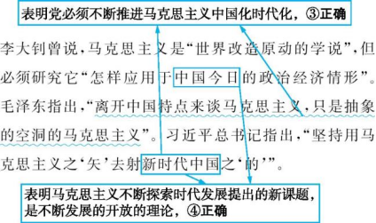

材料强调要不断推进马克思主义中国化时代化,未强调马克思主义为人类社会发展进步指明方向、马克思主义是为人类求解放的人民的理论,①②不选。

2.B　改革开放

**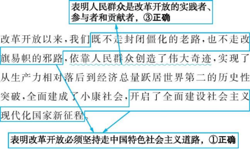**

改革开放要突破旧的体制机制的约束,解放和发展生产力,②错误。改革开放以来,我国取得一切成绩和进步的根本原因,归结起来就是:中国共产党带领全国人民,开辟了中国特色社会主义道路,形成了中国特色社会主义理论体系,确立了中国特色社会主义制度,发展了中国特色社会主义文化,④观点错误。

3.B　坚持中国共产党的领导、社会历史的主体　从新民主主义革命时期到社会主义革命和建设时期,辽宁始终坚持中国共产党的领导,与党的民族复兴伟业同频共振,书写了辉煌与荣光,①符合题意。“孕育和传承的红色基因融入辽宁人民的血脉,书写了辉煌与荣光”表明辽宁取得的成就离不开辽宁人民勇敢坚毅和忠诚担当的品质,④符合题意。中国特色社会主义思想晚于抗日战争、解放战争、新中国成立,②排除。社会主义基本制度的确立是中华民族有史以来最深刻最伟大的社会变革,③与设问不构成因果关系。

4.D　企业的经营　钢铁企业A(央企)和B(地方国企)重组,并不能提高国有资本在钢铁行业中的占比,也不能实现A、B公司股权多元化,①②不选。钢铁企业A(央企)和B(地方国企)重组后,可推进钢铁板块和铁矿石板块整合运作,粗钢产能将跃居世界第三,这表明该重组有利于增加铁矿石供给,维护钢铁行业产业链供应链的稳定,也有利于提升产业集中度,推动钢铁产业布局优化和结构调整,③④正确。

5.D　科学的宏观调控、社会保障+传导　“公开招标”“团购”表明药品集中带量采购采用的是大范围的药企竞价或议价模式,④应排第一位。实行药企直接竞价或议价模式,减少了药品采购过程中的非必要环节,②应排第二位。药品采购过程中的非必要环节减少,有利于降低采购成本,使中标药品的采购价格回归合理区间,⑤应排第三位。药品的价格下降,意味着药企和医院参与分摊医疗保障责任,这有利于减轻患者用药负担,③应排第四位。正确传导过程为④→②→⑤→③。虽然药品的价格下降了,但中标药企可通过以量换价的方式提高市场占有率,其获利空间未必会缩小,医院的获利空间也不一定会被压缩,①排除。

6.C　坚持和加强党的全面领导　

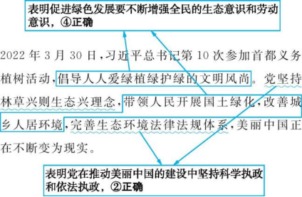

材料体现的是党坚持林草兴则生态兴理念,改善城乡人居环境,没有体现法治政府的职能,①不选。改进党对生态文明建设的领导方式,是为了能够更好地满足人民群众对美好生活的需要,而不是为了坚持民主执政,③不选。

7.D　人民代表大会制度　材料不涉及地方党委,也就不涉及人大代表协助所在地方党委改进和推进工作,①排除。人大代表不能直接行使国家权力,②错误。以人大代表工作室为依托,人大代表联系相关职能部门,及时解决群众急难愁盼问题,这有利于加强群众、政府、人大之间的联系,有利于人大代表在人大闭会期间依法履职,③④正确。

8.D　社会治理　材料强调调解员以茶馆为载体,有效化解社会矛盾,并没有体现为人民群众提供法律援助,①不选。“和顺茶馆”邀请党员、群众及法律工作者担任人民调解员,为居民、商家、游客提供便捷、专业的服务,有效化解了社会矛盾,这种做法创设了舒缓环境,使社会治理有温度,同时也充分体现了共建共管共治共享理念,②④入选。材料没有体现法治,③不选。

9.B　发挥主观能动性与尊重客观规律　“所谓借风,只是顺应了风的方向”强调顺应大势,借风而行,欲借风力须顺风势、驾伞乘风去我所向符合漫画寓意,①③正确。“任运自在”“逆势而动”均不符合漫画主旨,②④不选。

10.A　文化交流、联系　

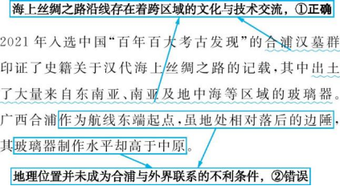

联系是客观的,但这并不意味着人对事物的联系无能为力,人们可以根据事物固有的联系,改变事物的状态,调整原有的联系,建立新的联系,海上丝绸之路是人们出于需要基于实际建立的人为联系,③正确切题。海上丝绸之路的目标涉及多个方面,④夸大了合浦玻璃器制作水平提高的意义,排除。

11.C　文化与经济、政治,经济基础与上层建筑　

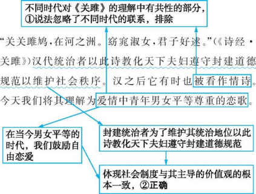

文化具有相对独立性,③中“直接对应关系”说法错误。经济、政治决定文化。封建社会的经济政治关系,决定了汉代统治者以此诗教化天下夫妇遵守封建道德规范以维护社会秩序,我们今天的经济政治关系决定了我们将此诗理解为爱情中青年男女平等尊重的恋歌,这说明对《关雎》的不同理解反映了不同社会的经济关系和政治关系,④正确。

12.A　政党　根据各主要政党支持率以及社民党因所获议席未过半数,最终与其他政党组成新一届联合政府可知,选举结果凸显了该国碎片化的政党格局,①正确。联合执政旨在执掌国家政权,而不是平衡政党之间的利益关系,②排除。因所获议席未过半数,社民党最终与绿党、自民党组成新一届联合政府,该党候选人出任总理,说明该国是议会制国家,该国政府要接受议会监督并定期向议会报告工作,③符合题意。社民党积极回应选民社保诉求,获得相当数量的工人群体和失业群体的支持,但这并不意味着社民党执政的原因是其代表了工人和失业群体的利益,④不选。

13.B　构建人类命运共同体、中国与联合国　中国将向粮农组织实施捐赠,并围绕减贫、粮食安全等领域,加快落实联合国“2030年可持续发展议程”,表明中国同国际社会一道推进全球发展事业,以实际行动践行人类命运共同体理念,①④正确。材料强调中国以实际行动推进全球发展事业,践行人类命运共同体理念,不强调中国对全球粮食安全贡献中国方案,②不选。联合国设有大会、安理会等6个主要机构,还设有多个专门机构。粮农组织是联合国的一个专门机构,③表述有误。

14.A　侵权责任、民事行为能力类型、隐私权　自然人享有身体权,自然人的身体完整和行动自由受法律保护。任何组织或者个人不得侵害他人的身体权。隐私是自然人的私人生活安宁和不愿为他人知晓的私密空间、私密活动、私密信息。自然人享有隐私权。任何组织或者个人不得以刺探、侵扰、泄露、公开等方式侵害他人的隐私权,材料中小孙的行为侵害了小曹的隐私权,其可以以赔礼道歉、消除影响等方式承担侵权责任,①③正确。民法典规定,无民事行为能力人、限制民事行为能力人造成他人损害的,由监护人承担侵权责任。小孙是小曹的同班同学,小曹即将硕士毕业,按常理推断,小孙应为完全民事行为能力人,应对侵权行为依法承担民事责任,②错误。民事诉讼实行“谁主张,谁举证”的举证原则。在有些情况下,当案件当事人因欠缺专业知识或者远离证据而难以举证时,法律出于公平合理的考虑,实行举证责任倒置原则,即当事人提出诉讼主张时,由对方负责举证。题中情形不适用举证责任倒置原则,④错误。

知识拓展　常见的举证责任倒置情形

　　因污染环境、破坏生态发生纠纷,由行为人就法律规定的不承担责任或者减轻责任的情形及其行为与损害之间不存在因果关系承担举证责任;建筑物、构筑物或者其他设施及其搁置物、悬挂物发生脱落、坠落造成他人损害,由所有人、管理人或者使用人对其没有过错承担举证责任。

15.C　合同的订立　要约邀请是希望他人向自己发出要约的表示,不具有法律约束力,①排除。材料中的合同系以书面形式订立,微信记录构成电子数据证据,合同在回复“好的”时成立,“课费不退”是报名表上记载的内容,不属于合同内容,②④符合题意。合同在回复“好的”时成立,后受新冠肺炎疫情影响小玲未能完成剩余课程,可以主张不可抗力请求退费,③排除。

16.C　 性质判断换质位推理

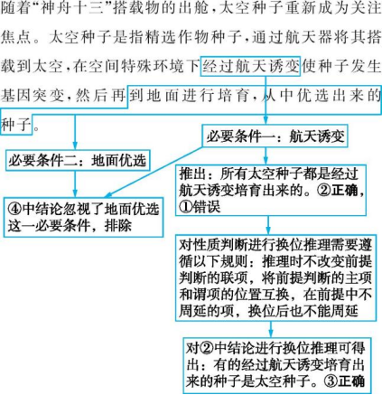

17.(1)①2016—2020年,中国货物进口总额总体呈增长趋势,中国同RCEP其他成员国海关货物进口总额也呈增长趋势,且中国同RCEP其他成员国海关货物进口总额在中国货物进口总额中占比较大,说明中国对外开放水平不断提高,也说明RCEP区域内的经济合作势在必行。②《区域全面经济伙伴关系协定》在中国正式生效实施,推进了区域内贸易自由化便利化,有利于推动我国构建新发展格局,促进区域经济发展互利共赢。

(2)①二者都发挥了市场在资源配置中的决定性作用,有利于推进贸易投资自由化便利化,促进生产要素自由流动。②二者都注重国家宏观调控,营造良好的市场环境,促进市场主体公平竞争。③二者都注重企业创新发展,提高市场竞争力。④二者都有利于畅通产业链供应链,推动构建新发展格局。

经济全球化、坚持新发展理念、建设现代化经济体系　 第(1)问,知识限定明确——当代国际政治与经济,属于解读信息类试题。具体思路如下:

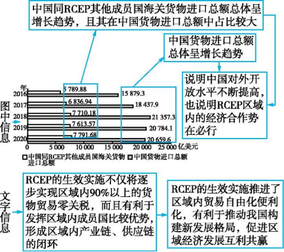

第(2)问,第一步,分析设问:

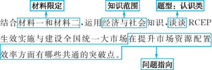

第二步,梳理思路。对比分析材料一和材料二,运用相关知识分析RCEP的生效实施与建设全国统一大市场在提升市场资源配置效率方面的共通之处,具体思路如下:

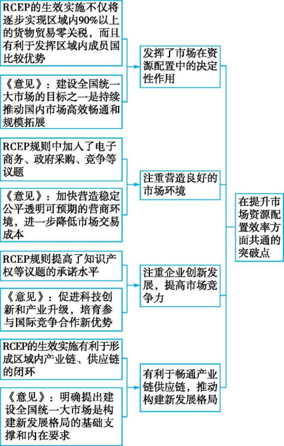

18.①社会主义民主是最真实的民主,国家安全一切为了人民,国泰民安是人民群众最基本、最普遍的愿望。②维护国家稳定是国家对内职能,防御外来侵略、保卫国家安全是国家对外职能,组织撤侨,打击各类犯罪活动,维护人民根本利益,稳妥处置涉外事件,捍卫领土主权。③中国共产党的根本宗旨是全心全意为人民服务,共产党员发挥先锋模范作用,每遇大事险情,人民受到威胁,共产党员总能挺身而出,护佑人民。④建设法治政府需要政府依法行政,公民权益受到侵害时,政府积极履职,维护社会安全。⑤公民积极履行义务,人人守护家园,众志成城,维护国家安全。

我国国家性质、国家职能、中国共产党的先进性、法治政府、维护国家安全　审设问可知,本题知识限定为政治与法治,属于原因类试题。解答本题,要审读材料,提取有效信息,衔接教材知识,实现理论与材料的有机结合,具体思路如下:

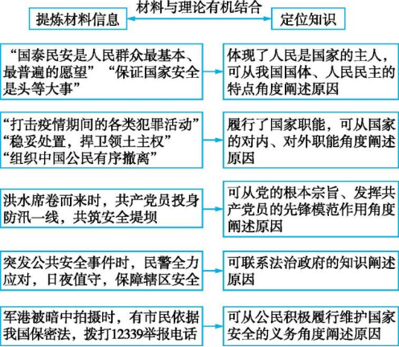

19.创美公司与客户签订《独家许可使用合同》,转移该图样的著作使用权,客户享有该图样的使用权。未经允许,其他人不能使用该作品,否则构成侵权。A公司未经允许,将该图样用于自己的产品,构成侵权,应承担侵权责任。创美公司要求全体员工对产品研创严格保密,徐某却在朋友圈发工作照时带入该画样,导致画样外流,根据民法典和劳动法相关规定,劳动者有保密义务,徐某应承担相应责任。朋友孙某在不知情的情况下转发该信息,属于善意第三人,但转发行为造成了严重影响,应立即删除该信息,消除影响,赔礼道歉。

沈某与周某共同投资设立“某市创美创意有限责任公司”,创美公司是有限责任公司,股东以其认缴的出资额为限对公司债务承担责任,所以,当创美公司全部财产不足以承担违约责任时,沈某和周某不承担清偿责任。

尊重知识产权、有限责任公司、诚信经营　第一步,分析设问:

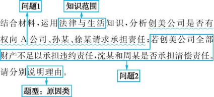

第二步,梳理思路。本题共两小问,涉及多个行为主体,要分析每个行为主体的做法以及各行为主体之间的关系,再运用相关法律知识作答。问题1:“客户对此颇为青睐,遂与创美公司签订《独家许可使用合同》”“被A公司发现并用于自己的产品”→可联系教材中民法典对著作权的限制,指出客户享有该图样的使用权,而A公司未经允许就使用,构成侵权,应该承担责任;“创美公司要求全体员工对产品研创严格保密”“员工徐某在朋友圈发工作照片时带入该画样”→可根据民法典和劳动法相关规定,指出劳动者有保密义务,徐某应承担相应责任;“朋友孙某点赞转发”→可联系侵权责任的承担方式的知识,指出孙某属于善意第三人,但转发行为造成了严重影响,应立即删除该信息,消除影响,赔礼道歉。问题2:“沈某大学毕业后与周某共同投资设立‘某市创美创意有限责任公司’”→可联系有限责任公司的责任承担方式的知识,指出沈某和周某承担有限责任。

20.(1)①矛盾的共性和个性相互联结。一方面,共性寓于个性之中,并通过个性表现出来;另一方面,个性离不开共性,个性中总是包含着共性。《掷铁饼者》《永恒的运转》各具特色,个性鲜明,但包含着同一主题:生生不息的体育精神和敢于争先的青年品格。②矛盾的共性和个性在一定条件下相互转化。在一定场合为共性的东西,在另一场合则是个性;反之亦然。《掷铁饼者》代表西方文化,《永恒的运转》代表中华文化。相对于雕塑个体特性而言,它们所蕴含的东西方文化的属性是共性的东西;而相对于世人普遍认可的体育精神和青年品格而言,东西方文化的差异则是个性。

(2)人们通过感官感知到的感性具体的认识是一种直观的整体表象,没有揭示事物的内部联系和本质,需要思维抽象通过各个上升环节,达到再现事物多样性的统一的思维具体,实现对认识对象整体本质和规律的认识。中国雕塑家俞畅凭借自己的观察,捕捉到残疾人掷铁饼的瞬间,再通过分离、提纯、简略化等思维抽象的重要环节,完成了呈现震撼人心的生命律动的雕塑作品,揭示了体育运动的本质和规律。　　

(3)示例:青年人的成长离不开文化滋养。不忘本来,是青年人的责任。《永恒的运转》展现了源远流长、博大精深的中华文化魅力,要坚定文化自信,继承、发扬中华优秀传统文化;生生不息的体育精神与中华民族精神相通,要弘扬伟大的中华民族精神。吸收外来,是青年人的情怀。《永恒的运转》《挑战》吸收外来文化有益成果,拓展自己的视野。面向未来,是青年人的担当。要把个人梦与国家梦结合,使自己成为担当民族复兴大任的时代新人。

矛盾的普遍性与特殊性的辩证关系、认识深化的历程、继承发展中华优秀传统文化、学习借鉴外来文化有益成果　第(1)问,第一步,分析设问:

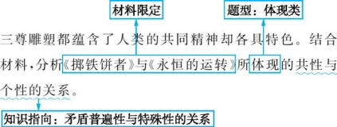

第二步,梳理思路。依据理论逻辑,对接材料信息,组织答案,思路如下:

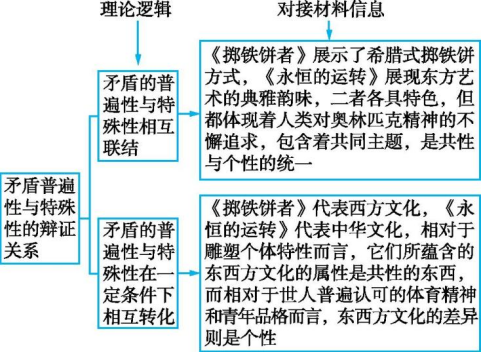

第(2)问,知识限定是逻辑与思维中认识发展历程的知识,属于认识类试题。答题时,可以先阐述认识发展的历程,即从感性具体到思维抽象,再从思维抽象到思维具体;然后根据第四段材料具体分析《挑战》这一作品的创作经历了从感性具体到思维抽象,再到思维具体的历程。第(3)问限定文化角度,要求以“青春该有的样子”为题,畅想青春,答案具有开放性。本题强调青年人的做法,要结合材料中《永恒的运转》《挑战》的创作过程畅想青春该有的样子。《永恒的运转》“受古希腊雕塑风格影响,又加入了汉唐元素和陶艺手法”,《挑战》借鉴了《掷铁饼者》的动作和势态,呈现出一种震撼人心的生命律动,给予人们不屈的力量、不服的决心、不灭的希望,据此可联系继承中华优秀传统文化、弘扬中华民族精神、吸收外来文化的有益成果等知识,阐述青年人要不忘本来、吸收外来、面向未来。
