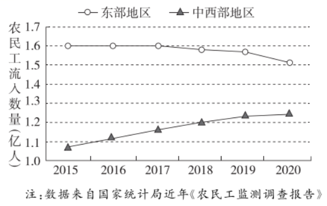
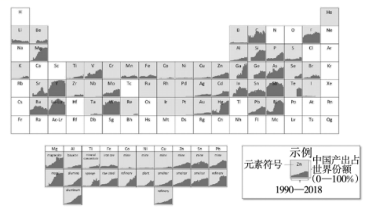
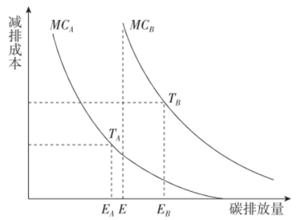
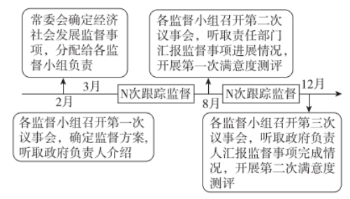
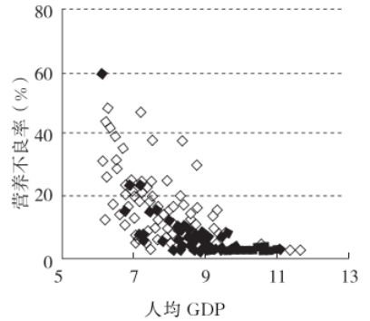
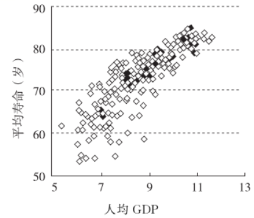

**2022年重庆市普通高中学业水平选择性考试**

**思想政治**

**一、单项选择题：本题共15小题，每小题3分，共45分。在每小题给出的四个选项中，只有一项是最符合题目要求的。**

少年强、青年强，则中国强。阅读材料，完成下列小题。

1\. 小计划大民生。2011年国务院启动“农村义务教育学生营养改善计划”，农村学生每天膳食补贴3元。截至2020年底，营养改善计划覆盖13.16万所学校3797.83万名学生，受益学生的体质健康合格率从2012年的70.3%提高至86.7%，在此基础上，这些学生身高、体重和学习成绩均有明显增长。该财政补贴计划（ ）

①促进社会公平与效率

②体现发展成果由人民共享的理念

③保障国民经济平稳运行

④表明财政政策是资源配置主导手段

A. ①② B. ①④ C. ②③ D. ③④

2\. 《2020年全国未成年人互联网使用情况研究报告》显示，我国6～18岁未成年人互联网普及率为94.9%，远高于成年群体，科学研究表明，未成年人正处于脑发育关键时期，长期沉溺网络可能造成脑功能损害，脑神经元的功能连接强化在虚拟世界，对现实世界的认知能力削弱。由此可知（ ）

A. 未成年人沉溺网络与脑功能损害之间是一种主观联系

B. 未成年人的脑健康发育是认知能力和水平提升的基础

C. 未成年人对网络的正确认知只有通过长期网络实践才能形成

D. 互联网普及率远高于成年人，说明未成年人更易于接受新事物

3\. 一颗法治的种子在青少年心中生根发芽。针对未成年人保护法修订草案，全国人大常委会法工委上海虹桥街道立法联系点向当地某中学学生征集意见。该校学生提出的意见被吸收采纳。同学们通过参与立法意见征集，体验了一堂生动的“法治实践课”。参与立法意见征集（ ）

A. 是中学生应当履行的政治义务 B. 有助于培养中学生的民主法治意识

C. 是中学生行使基本民主权利的体现 D. 表明中学生是国家立法职权的承担者

4\. 想去哪里去哪里，想看什么有什么。受益图书馆、博物馆、美术馆等公共文化设施的不断完善，青年享受的公共文化服务水平显著提高。与此同时，图书、电影、文艺演出等传统文化产业和数字创意新兴文化产业迅猛发展，青年所需所盼的文化产品日渐丰富，文化视野更加开阔，精神品位不断提升。由此可见（ ）

①精神文化生活空间决定社会文化发展水平

②文化生产力发展，促进青年人文化水平提高

③青年人真正所需所盼的文化是健康有益的文化

④对文化的多样化需求，提升了青年人精神文化品位

A. ①② B. ①④ C. ②③ D. ③④

【答案】1. A 2. B 3. B 4. D

【解析】

【1题详解】

①②：通过实施财政补贴的“农村义务教育学生营养改善计划”使学生的体质健康合格率提高，身高、体重和学习成绩均有明显增长，说明该财政补贴计划提高了农村学生生活水平，促进了社会公平与效率，并体现发展成果由人民共享的理念，①②正确。

③：促进国民经济平稳运行是指在经济增长滞缓或过热时运用财政政策保持社会总供给与总需求的基本平衡，材料强调的是财政补贴农村学生膳食，③不符合题意。

④：市场经济条件下资源配置的主要手段为市场，④错误。

故本题选A。

【2题详解】

A：由材料信息可知，未成年人沉溺网络与脑功能损害之间是一种客观联系，且联系具有客观性，A错误。

B：人脑是意识的生理基础，未成年人的脑健康发育是认知能力和水平提升的基础，B正确。

C：获得认知的途径既包括学习书本知识，也包括实践，C错误。

D：新事物是指符合客观规律、具有强大生命力和远大发展前途的事物，网络不是新事物，且材料强调的是未成年人长期沉溺网络可能造成脑功能损害，而不是未成年人更容易接受新事物，D排除。

故本题选B。

【3题详解】

B：基层立法联系点向中学生征集意见有助于法治中国建设，有助于培养学生的民主法治意识，B符合题意。

A：学生参与立法意见征集是行使参与权，是在行使权利，而不是履行义务，A不符合题意。

C：公民的基本民主权利是选举权和被选举权，材料未涉及，C排除。

D：国家立法职权的承担者是全国人民代表大会及其常务委员会，D错误。

故本题选B。

【4题详解】

③：为人民大众所喜闻乐见的社会主义文化是健康有益的，③正确。

④：青年所需所盼的文化产品日渐丰富，文化视野更加开阔，精神品位不断提升，可知文化塑造人生，④正确。

①：经济、政治决定文化，①错误。

②：文化生产力发展是青年文化水平提高的外在力量，内因在于青年的不断学习，因此文化生产力的发展与文化水平的提高无必然联系，②错误。

故本题选D。

5\. “灯塔工厂”点亮“中国智造”。“灯塔工厂”由达沃斯世界经济论坛等机构遴选，代表全球智能制造和数字化的最高水平。截至2021年底，全球“灯塔工厂”总数103家，中国拥有37家，占比超1/3。“灯塔工厂”作为数字化转型的龙头企业，有效赋能中小企业，引领中国制造向中国智造升级。材料表明（ ）

①技术创新打造中国智造核心优势

②“灯塔工厂”提升中小企业品牌效应

③智造水平决定国家的国际竞争力

④“灯塔工厂”引领中国智造弯道超车

A. ①③ B. ①④ C. ②③ D. ②④

【答案】B

【解析】

【详解】①④：“灯塔工厂”是科技创新与实体经济的深度融合，作为数字化转型的龙头企业，有效赋能中小企业，引领中国制造向中国智造升级，表明技术创新打造中国智造核心优势，“灯塔工厂”引领中国智造弯道超车，①④符合题意。

②：中小企业品牌效应提升的关键在于企业自身长期的成功经营，②错误。

③：当前的国际竞争是以经济和科技实力为基础的综合国力的较量，选项表述夸大了智造水平的作用，③错误。

故本题选B。

6\. 流动改变中国。改革开放以来，农民工“东南飞”。促进劳动力资源的跨地区优化配置，成为中国经济奇迹的重要支撑。近年来，农民工区域流动情况如下图所示，“东南飞”的农民工回流持续攀升。这说明（ ）

①东部和中西部地区的产业结构趋同

②农民工就地就近就业渠道不断增加

③劳动力资源在城乡间配置更趋合理

④区域发展不平衡问题得到逐步改善

A. ①③ B. ①④ C. ②③ D. ②④

【答案】D

【解析】

【详解】①：东部和中西部地区的产业结构差异明显，且材料未涉及产业结构情况，①排除。

②④：从图中可以看出，近年来“东南飞”的农民工回流持续攀升，说明农民工就地就近就业渠道不断增加，区域发展不平衡问题得到逐步改善，②④符合题意。

③：材料反映劳动力资源的跨地区配置情况，没有体现在城乡间配置更趋合理，③不符合题意。

故答案选D。

2021年6月美国发布“重塑国家供应链”报告。报告借用元素周期表的形式，展示了1990—2018年战略性和关键性资源（灰色方格中的元素）中国产出占世界份额的变化，如图所示。阅读材料，完成下列小题。

7\. 上图示反映了（ ）

①中国在全球产业分工格局中的位置

②经济增长导致中国对全球资源的依赖

③中国发展对全球经济贡献与日俱增

④生产全球化是世界经济发展强劲动力

A. ①③ B. ①④ C. ②③ D. ②④

8\. 该报告指责中国运用非市场的国家手段，在非洲等地攫取大量战略性和关键性资源，并存在破坏环境、强迫劳动等人权问题，报告认为，鉴于中国对战略性和关键性资源的全球统治力，美国必须构建包括日本、欧洲和澳大利亚等盟友或伙伴在内的新供应链体系。对该报告的正确认识是（ ）

①中国对美国唯一超级大国地位已构成严峻挑战

②美国在世界事务中长期奉行霸权主义、强权政治

③美国拼凑政治联盟的行为，阻碍世界的和平与发展

④战略性和关键性资源的争夺，是中美两国冲突的根源

A. ①③ B. ①④ C. ②③ D. ②④

9\. 针对该报告内容，下列说法正确的是（ ）

A. 经济资源的全球化配置体现了世界的普遍联系

B. 在经济资源产出方面，国与国之间的关系是对立的

C. 资源领域的科学规划决定了中国在国际供应链中的地位

D. 中国在资源产出方面的优势地位是“中国威胁论”产生的根源

【答案】7. A 8. C 9. A

【解析】

【7题详解】

①③：从图示可知1990—2018年战略性和关键性资源中国产出占世界份额增长较快，说明中国是全球经济的贡献者，在全球产业分工中占重要地位，①③符合题意。

②：材料未涉及中国对全球资源的依赖，②排除。

④：经济全球化是世界经济发展的强劲动力，而且材料不涉及生产全球化，④错误。

故本题选A。

【8题详解】

①：中国对美国唯一超级大国地位已构成严峻挑战是以美国为代表的西方国家制造的“中国威胁论”，①错误。

②：美国在报告中对中国的无理指责属于霸权主义、强权政治的行径，②正确。

③：美国构建包括日本、欧洲和澳大利亚等盟友或伙伴在内的新供应链体系的结盟行为阻碍世界的和平与发展，③正确。

④：国家利益的对立是国家间冲突的根源，④错误。

故本题选C。

【9题详解】

A：经济资源的全球化配置体现了世界是一个普遍联系的整体，A正确。

B：国与国之间既有共同利益也有利益的对立，国与国之间是对立统一的关系，B错误。

C：资源领域的科学规划只能影响中国在国际供应链中的地位，该选项的说法夸大了资源领域科学规划的作用，C错误。

D：“中国威胁论”产生的根源是美国的冷战思维和霸权逻辑，D错误。

故本题选A。

10\. 某地只有A，B两个企业，它们分别在TA，TB处生产。曲线MCA和MCB减排分别表示企业A和企业B的边际减排成本，如图所示。为减少碳排放，该地实行总额控制的碳交易制度，政府分配给每个企业的初始碳排放额度都为E。实行碳交易制度后（ ）

注：边际减排成本是企业生产过程中每多减排一单位的二氧化碳所要付出的成本。

①企业A将增加碳排放量

②本地企业碳排放总量不超过2E

③企业B将购买A的部分碳排放额度

④企业A可供出售碳排放额度为E-EA

A. ①③ B. ①④ C. ②③ D. ②④

【答案】D

【解析】

【详解】①：企业A有可能出售剩余的碳排放额度，而不是增加碳排放量，这样的做法违背碳交易制度的初衷，①错误。

②：材料中“该地实行总额控制的碳交易制度，政府分配给每个企业的初始获排放额度都为E”，而且某地只有A，B两个企业，因此，实行碳交易制度后，本地企业碳排放总量不超过2E，②正确。

③：B企业既可以提高科学技术节能减排，也可以购买A的部分碳排放额度，③错误。

④：政府分配给每个企业的初始碳排放额度都为E，因此，企业A可供出售的碳排放额度为E-EA，④正确。

故答案选D。

11\. 某市人大常委会以一年为一个周期，根据工作需要，设置若干代表监督小组，创建“3+2+N”监督工作模式，见下图，实现了监督事项见实效。该监督工作模式（ ）

①有助于人大代表更好地履行职责

②为人大代表行使决定权创设了新平台

③反映了人大常委会统筹管理经济社会事务

④探索建立人大常委会监督政府工作的长效机制

A. ①③ B. ①④ C. ②③ D. ②④

【答案】B

【解析】

【详解】①④：某市人大常委会设置若干代表监督小组，创建新监督工作模式取得良好效果，此举是在探索建立人大常委会监督政府工作的长效机制，有助于人大代表更好地履行职责，①④符合题意。

②：人大代表没有决定权，②排除。

③：人大常委会的职权是立法权、决定权、任免权、监督权，管理经济社会事务是政府的职能，③排除。

故本题选B。

谣言猛于虎，网络谣言有的无中生有、捕风捉影，有的移花接木、以偏概全……其共同点是，掩盖真相，传播假象。阅读材料，完成下列小题。

12\. 在疫情防控背景下，一些网络谣言的传播与扩散造成社会的焦虑与恐慌，增加了抗疫的难度。针对网络谣言，政府应（ ）

①深化简政放权，授权网络平台自我管理

②引导舆论宣传，及时公开相关信息并辟谣

③增强服务意识，拓宽网民的信息发布渠道

④坚持法定职责必须为，惩治造谣、传谣行为

A. ①③ B. ①④ C. ②③ D. ②④

13\. 自媒体时代，人人都是报道员。以偏概全的网络谣言因其包含“部分真相”，极具欺骗性。这一现象告诉我们（ ）

①只有全面整体地看问题，才能揭示事物的真相

②立场与价值观影响谣言制造者对于信息的筛选

③从“部分真相”到真相，是人类认识的必经阶段

④谣言因包含“部分真相”而具有了一定的真理性

A. ①② B. ①③ C. ②④ D. ③④

【答案】12. D 13. A

【解析】

【12题详解】

①：针对网络谣言，政府应加强监管、依法治理，一些网络平台在利益驱动下造谣传谣，“授权网络平台自我管理”不能解决网络谣言滋生蔓延问题，①排除。

②④：网络谣言的传播与扩散造成社会的焦虑与恐慌，为解决网络谣言滋生蔓延问题，政府应该积极作为，双管齐下：一方面，引导舆论宣传，及时公开相关信息并辟谣；另一方面要坚持依法行政，惩治造谣、传谣行为，②④正确。

③：一些网民法律意识淡薄，缺乏道德自律，肆意造谣传谣，“拓宽网民的信息发布渠道”并不能遏制网络谣言的传播与扩散，③排除。

故本题选D。

【13题详解】

①：以偏概全的网络谣言因其包含“部分真相”，极具欺骗性，从哲学角度看，这要求我们全面整体地看问题，克服以偏概全的错误，揭示事物的真相，①正确。

②：自媒体时代，人人都是报道员，这为造谣传谣提供了便利，而且由于受认识主体立场、价值观等的影响，谣言制造者对于信息的筛选可能产生偏差，容易滋生谣言，从而使得网络谣言此起彼伏，②正确。

③：我们要在实践中认识和发现真理，在实践中检验和发展真理，人类认识并非必须经历从“部分真相”到真相，③错误。

④：真理最基本的属性是客观性，包含“部分真相”的“谣言”仍然是谬误而不是真理，④错误。

故本题选A。

14\. 北京冬奥会使用了我国科技团队研制的凝胶冰雪，它采用一种亲水的高聚物网络，使冰晶在融化后被牢牢锁在网格中，从而在常温下“永不融化”。凝胶冰雪百分之九十以上成分是水，具有与自然冰雪几乎相同的视感和触感。“永不融化的冰雪”（ ）

A. 突破了自然规律的限制，是科学家的新发明

B. 是人类意识的产物，是“科技奥运”的充分体现

C. 使冰雪运动不再受季节限制，体现了人的主观能动性

D. 介于水的固、液态之间，处于从量变到质变的飞跃阶段

【答案】C

【解析】

【详解】A：规律是客观的，不能被突破，A错误。

B：“永不融化的冰雪”是人类实践活动的产物，而不是人类意识的产物，B错误。

C：我国科研团队采用亲水的高聚物网络，使冰品在融化后锁在网格中，在常温下“水不融化”，这是充分发挥人的主观能动性的体现，使冰雪运动不再受季节限制，C正确。

D：质变是事物根本性质的变化，即飞跃，“永不融化的冰雪”并没有改变“水”的根本性质，不属于质的飞跃，D错误。

故本题选C。

15\. 跨次元网剧《戏隐江湖》以国漫为主体架构，讲述了以京剧生旦净丑为原型设定的甲乙丙丁跨次元的奇幻冒险之旅。该剧标新立异的人物设计、不同次元人物和文化的穿梭碰撞，成为动漫国风化的创意亮点；用独具特色的表达方式，传播中国文化精神和审美价值，赢得青少年喜爱，这表明（ ）

①青少年的喜爱是文化创新的动力和源泉

②各种文化元素的融合是京剧创新的根本途径

③以青少年喜爱的动漫形式表现京剧有助于文化传承

④京剧元素与现代动漫的结合，创新了文化传播的手段和内容

A. ①② B. ①④ C. ②④ D. ③④

【答案】D

【解析】

【详解】①②：社会实践是文化创新的动力和源泉，立足于社会实践是文化创新的根本途径，①②错误。

③：继承传统文化过程中需要推陈出新、革故鼎新，以动漫形式表现京剧赢得青少年喜爱，能更好地传承京剧，③正确。

④：该剧把京剧元素与现代动漫的结合，成为动漫国风化的创意亮点；用独具特色的表达方式，传播中国文化精神和审美价值，赢得青少年喜爱，实现了创新文化传播的手段和内容的创新，④正确。

故本题选D

**二、非选择题：本题共2小题，共55分。**

16\. 人民健康是社会文明进步的基础，是民族昌盛和国家富强的重要标志，也是广大人民群众的共同追求。阅读材料，回答问题。

材料一 1953—2020年，中国取得GDP年均增长8.3%的经济奇迹。与此同时，人的发展也取得了举世瞩目的成就。根据著名经济史学家安格斯·麦迪森的数据，1949年中国人平均寿命只有35岁左右，2020年达到77.8岁，中国婴儿死亡率从1949年的200%下降到2020年的5.6‰。诺贝尔经济学奖获得者罗伯特·福格尔高度评价中国健康革命：欧洲和美国花了150年时间才从高死亡率的。阴霾里走出来，达到今天平均寿命超过70岁的高水平，而中国则在很短的时间内实现了这种革命性的转变。

材料二 2020年170多个国家（地区）经济发展（以取自然对数后的人均GDP衡量）与人的发展（以营养不良率、平均寿命衡量）之间的关系，下图所示。

注：①营养不良率是指食物摄入不足，无法持续满足膳食能量要求的人口占总人口的比例。②数据来自世界银行数据库。

（1）概述上图所示的信息。

（2）结合材料，运用《经济生活》知识，总结“经济发展与人的发展”的关系，并说明该关系背后的原因。

【答案】（1）图示反映了人均GDP越高，营养不良率越低、人均寿命越长。说明经济发展可降低人口营养不良率、延长人均寿命。

（2）关系：经济社会发展是人的全面发展的前提和基础，没有经济社会的发展，人的全面发展也就失去了基础和保障。人的全面发展是经济社，会发展的根本目的和动力，离开了人的全面发展，经济社会发展就失去了目标和动力。人的全面发展和经济社会发展是相互协调、相互促进的，人越全面发展，社会的物质文化财富就会创造得越多，人民的生活就越能得到改善；而物质文化条件越充分，越能促进人的全面发展。原因：①提高人民物质文化生活水平、推进人的全面发展同推进经济发展是互为前提和条件的。社会生产力和经济文化的发展水平是逐步提高、永无止境的历史过程，人的全面发展程度也是逐步提高、永无止境的历史过程。这两个历史过程相互结合、相互促进地向前发展。②实现人的全面发展，受生产力发展水平和社会现实条件的制约，这是一个长期的、渐进的过程，不能超越经济社会发展阶段。只能是随着社会财富的不断增加和社会文明的持续进步，人民群众的需要才能够日益充分地得到满足，人的全面发展才能日益充分地得到实现。

【解析】

【分析】背景素材：人民健康是社会文明进步的基础

考点考查：新发展理念、经济高质量发展

能力考查：获取和解读信息、调动和运用知识、描述和阐释事物

核心素养：政治认同、科学精神、公共参与

【小问1详解】

第一步：审设问。明确主体、知识范围、问题限定和作答角度。本题是图表题，解答本题需要学生认真分析图表及注释，并能用简练的语言归纳出图表及注释反映出来的全部信息。

第二步：审图表。审图表标题、图表数据和注释。具体结合图表进行信息解读，注意精练，不要啰嗦。

第三步：审材料。提取关键词，链接教材知识。

关键词①：人均GDP与营养不良率→可联系人均GDP越高，营养不良率越低；

关键词②：人均GDP与平均寿命→可联系人均GDP越高，人均寿命越长；

关键词③：2020年170多个国家（地区）经济发展（以取自然对数后的人均GDP衡量）与人的发展（以营养不良率、平均寿命衡量）之间的关系→可联系经济发展可降低人口营养不良率、延长人均寿命；

第四步：整合信息，组织答案。注意设问限定、图表信息以及教材知识与材料相结合。

【小问2详解】

第一步：审设问。明确主体、知识范围、问题限定和作答角度。本题的设问要求运用《经济生活》知识，总结“经济发展与人的发展”的关系，并说明该关系背后的原因。解答本题要把握材料关键信息，调动运用教材知识分析回答。

第二步：审材料。提取关键词，链接教材知识。

关键词①：1949年中国人平均寿命只有35岁左右，2020年达到77.8岁，中国婴儿死亡率从1949年的200%，下降到2020年的5.6%→可联系经济社会发展是人的全面发展的前提和基础，没有经济社会的发展，人的全面发展也就失去了基础和保障；

关键词②：欧洲和美国花了150年时间才从高死亡率的阴霾里走出来，达到今天平均寿命超过70岁的高水平。而中国则在很短的时间内实现了这种革命性的转变→可联系人的全面发展和经济社会发展是相互协调，相互促进的；

关键词③：中国取得GDP年均增长8.3%的经济奇迹。与此同时，人的发展也取得了举世瞩目的成就→可联系提高人民物质文化生活水平、推进人的全面发展同推进经济发展是互为前提和条件的；

关键词④：1949年中国人平均寿命只有35岁左右，2020年达到77.8岁，中国婴儿死亡率从1949年的200%下降到2020年的5.6‰→可联系实现人的全面发展，受生产力发展水平和社会现实条件的制约，这是一个长期的、渐进的过程，不能超越经济社会发展阶段。

第三步：整合信息，组织答案。注意设问限定以及教材知识与材料相结合。

17\. 阅读材料，回答问题。

材料一 晚清之时，国力衰弱，鸦片吸食者众，国人身体赢弱，被蔑称为“东亚病夫”。

1917年，毛泽东发表《体育之研究》指出：“国力茶弱，武风不振，民族之体质日趋轻细，此甚可忧之现象也。”民国时期，中国多次参加奥运会，未获得任何奖牌。

新中国成立后，党和国家非常重视体育工作。毛泽东发出“发展体育运动，增强人民体质”的号召，全国人民广泛开展群众体育运动。改革开放以来，随着中国国力的增强，体育运动得到快速发展。1984年，中国获得第一块奥运金牌。2008年北京举办第29届夏季奥运会，中国取得优异成绩，列金牌榜第一位。2022年北京举办第24届冬季奥运会，实现带动3亿人参与冰雪运动的目标。中国已成为体育大国。

材料二 习近平总书记指出：“伟大的事业孕育伟大的精神，伟大的精神推进伟大的事业。北京冬奥会、冬残奥会广大参与者珍惜伟大时代赋予的机遇，在冬奥申办、筹办、举办的过程中，共同创造了胸怀大局、自信开放、迎难而上、追求卓越、共创未来的北京冬奥精神。”

（1）结合材料一，运用《政治生活》知识，分析中国体育发展与社会主义制度关系。

（2）毛泽东在《体育之研究》一文中指出：“体育一道、配德育与智育，而德智皆寄于体，无体是无德智也。”请分析体育与德育智育的辩证关系。

（3）弘扬北京冬奥精神对于促进青少年健康成长、奋进新时代具有重要的意义。结合材料二，请就如何在青少年中弘扬北京冬奥精神提一条建议，并说明哲学依据。

（4）在北京冬奥会上，广大运动健儿弘扬新时代奥林匹克精神，体现出自尊自信、积极进取、超越自我、遵守规则、诚信自律、相互尊重、团队合作、正确的胜负观等体育品德，既赛出了成绩，又赢得人们的好评。写出你最想培育的体育品德，运用《文化生活》知识，说明理由，并就你个人如何培育这一品德谈谈想法。

【答案】（1）①社会主义制度是我国的根本制度，为中国体育发展提供制度保障。②人民民主专政是我国的国体，在我国社会主义制度中具有根本性意义，为中国体育发展提供国体保障。③人民民主专政的本质是人民当家作主，人民是国家的主人，我国社会主义民主是维护人民利益的最广泛、最真实、最管用的民主，中国体育发展为社会。主义制度的发展提供深厚的群众基础，也是中国人民真实地拥有广泛自由、民主、人权的生动写照，阐释了中国特色社会主义制度的优越性。④中国共产党领导是中国特色社会主义最本质的特征，是中国社会主义制度的最大优势，办好中国事情关键在党，在党的坚强有力的领导下。中国体育运动快速发展并取得优异成绩，说明坚持党的领导是中国体育发展的政治保证。

（2）①体育与德育智育是既对立又统一的辩证关系。矛盾的同一性是矛盾双方相互吸引、相互联结的属性和趋势，斗争性是指矛盾双方相互排斥、相互对立的属性。②德育智育是提升个人思想道德、科学文化素养的过程，为体育教育提供智力发展。体育是强身健体、提升个人身体素质的过程，为德育智育提供强健身体。③体育与德育智育，都是教育不可或缺的一部分，相互融合、相互促进、相辅相成，共同服务于全面贯彻党的教育方针，落实立德树人的根本任务。

（3）①建议：根据实际情况，通过新闻宣传、标语、主题班会等方式弘扬北京冬奥精神。②哲学依据：物质决定意识，要求我们坚持一切从实际出发。

（4）①品德：诚信自律。②理由：诚信是社会主义核心价值观的基本内容，诚信自律是我们自身的良好品德。③想法：文化对人的影响来自于特定的文化环境和各种各样的文化活动，培育诚信自律的体育品德，需要积极参与各种体育活动，广泛阅读书籍，从中汲取优良营养，促进人的全面发展。

【解析】

【分析】背景素材：弘扬北京冬奥精神，促进中国体育发展

考点考查：我国的政治制度、矛盾的基本属性、坚持一切从实际出发、文化对人的影响

能力考查：获取和解读信息、调动和运用知识、描述和阐释事物

核心素养：政治认同、科学精神、公共参与

【小问1详解】

第一步：审设问。明确主体、知识范围、问题限定和作答角度。本题的设问要求结合材料一，运用《政治生活》知识，分析中国体育发展与社会主义制度的关系。解答时从我国的政治制度角度分析。

第二步：审材料。提取关键词，链接教材知识。

关键词①：新中国成立后，党和国家非常重视体育工作→可联系教社会主义制度是我国的根本制度、人民民主专政是我国的国体、中国共产党领导是中国特色社会主义最本质的特征；

关键词②：毛泽东发出“发展体育运动，增强人民体质”的号召，全国人民广泛开展群众体育运动→可联系中国体育发展为社会主义制度的发展提供深厚的群众基础；

关键词③：改革开放以来，随着中国国力的增强，体育运动得到快速发展。2022年北京举办第24届冬季奥运会，实现带动3亿人参与冰雪运动的目标。中国已成为体育大国→可联系中国特色社会主义制度的优越性。

第三步：整合信息，组织答案。注意设问限定以及教材知识与材料相结合。

【小问2详解】

第一步：审设问。明确主体、知识范围、问题限定和作答角度。本题的设问要求分析体育与德育智育的辩证关系。本题属于分析说明类试题，解答时要结合教材知识进行分析作答

第二步：审材料。提取关键词，链接教材知识。

关键词①：体育一道、配德育与智育→可联系体育与德育智育是既对立又统一的辩证关系。矛盾的同一性是矛盾双方相互吸引、相互联结的属性和趋势，斗争性是指矛盾双方相互排斥、相互对立的属性；

关键词②：德智皆寄于体，无体是无德智也→可联系体育与德育智育相互融合、相互促进、相辅相成，共同服务于全面贯彻党教育方针，落实立德树人的根本任务；

第三步：整合信息，组织答案。注意设问限定以及教材知识与材料相结合。

【小问3详解】

第一步：审设问。明确主体、知识范围、问题限定和作答角度。本题要求结合材料二，就如何在青少年中弘扬北京冬奥精神提一条建议，并说明哲学依据，属于开放性试题。

第二步：审材料。提取关键词，链接教材知识。

关键词：如何在青少年中弘扬北京冬奥精神→可联系根据实际情况，通过新闻宣传、标语、主题班会等方式弘扬北京冬奥精神；物质决定意识，要求我们坚持一切从实际出发。

第三步：整合信息，组织答案注意设问限定以及教材知识与材料相结合。

【小问4详解】

第一步：审设问。明确主体、知识范围、问题限定和作答角度。本题要求写出你最想培育的体育品德，运用《文化生活》知识，说明理由，并就个人如何培育这一品德谈谈想法，属于开放性试题。

第二步：审材料。提取关键词，链接教材知识。

关键词：在北京冬奥会上，广大运动健儿弘扬新时代奥林匹克精神，体现出自尊自信、积极进取、超越自我、遵守规则、诚信自律、相互尊重、团队合作、正确的胜负观等体育品德，既赛出了成绩，又赢得人们的好评→围绕主题，结合实际，提出自己最想培育的体育品德，分析说明理由、提出想法。

第三步：整合信息，组织答案。注意设问限定以及教材知识与材料、时政信息等相结合。
