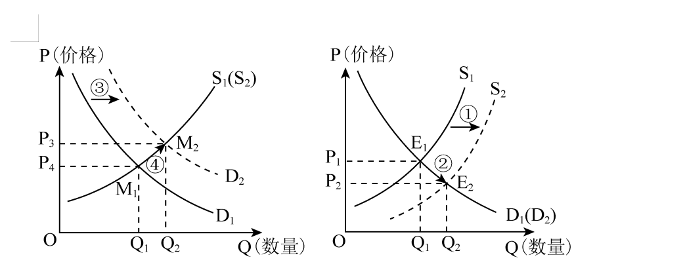

**2023年普通高等学校招生全国统一考试（全国乙卷）**

**思想政治**

**一、选择题。**

1\. 劳动课程成为义务教育阶段一门独立课程后，一些企业加大了儿童劳动工具的开发与生产，销售市场也不断升温，如浙江义乌小商品市场儿童使用的锅、碗、炉、勺、铲等厨具销售火爆。上述现象反映的经济道理是（ ）

①生产决定消费的内容，生产什么就消费什么

②市场需求引导供给，市场需要什么就生产什么

③生产为消费创造动力，供给转型才能扩大需求

④消费对生产有反作用，新消费热点催生新生产业态

A. ①③ B. ①④ C. ②③ D. ②④

2\. 某农机企业为了推广智能农业机械，推出一种新的营销服务模式。该模式允许农户选择短期租赁、系统代运营服务，农户支付较低服务费用后获得业务支持，如播种、杂草控制、施肥、灌溉、土壤分析等。目前，这种服务模式得到大面积推广。该模式被市场广泛认同的原因在于（ ）

①减少农机研发成本，扩大农机生产规模

②推动智能化生产，提高农产品销售价格

③加速农机运营周转，增加农机使用效益

④降低农户生产劳动强度，提高经营效率

A. ①② B. ①③ C. ②④ D. ③④

3\. 《管子》中记载：鲁梁两国百姓惯于织绨（古代一种织物）。齐国禁止国内织绨并要求所需绨服全部从鲁梁购买，同时齐桓公带头穿绨服，百姓纷纷仿效，结果绨价大涨。鲁梁国君遂要求百姓少种粮而全力发展绨业。然而一年多后，齐桓公率百姓改穿帛服，并封闭关卡与鲁梁断绝经济往来。很快鲁梁粮价飞涨，百姓陷入饥荒，纷纷投奔齐国。三年后，鲁梁臣服于齐国。从中可获得的启示是（ ）

①粮食安全是一国经济安全的底线

②生产分工会加剧一国经济发展不平衡

③经济结构单一存在潜在经济风险

④对外贸易畅通是一国经济发展的保证

A. ①③ B. ①④ C. ②③ D. ②④

4\. 为刺激消费增加生产，政府出台了一系列政策，对购买甲种产品发放消费补贴，对生产乙种产品的企业减税降费，由此引起这两种产品的供需变化，如下图所示。

 

注：①是指曲线S1到S₂的移动；②是指点E1到E₂的变动；③是指曲线D1到D₂的移动；④是指点M1到M₂的变动。

图中，正确反映两种产品政策效应是（ ）

A. 甲产品：①→②；乙产品：③→④

B 甲产品：③→④；乙产品：①→②

C. 甲产品：④→③；乙产品：②→①

D. 甲产品：②→①；乙产品：④→③

5\. 某地启动实施“党建聚力服务民生”专项行动，采取多种途径了解群众诉求，构建起区、街道、社区、小区纵向联动和街道社区、驻地单位、行业系统横向互通工作机制。2022年以来，确定街道、社区重点民生实事项目106个。到2023年初，累计投入资金3370余万元，完成率达98.1%,群众满意度达98.7%。该地惠民政策落实到位（ ）

①取决于经济组织和街道社区的纵向联动

②有赖于基层政府的机构调整和职能优化

③得益于建立高效便捷的民生诉求解决机制

④关键在于强化党建引领，提高社会综合治理能力

A. ①② B. ①③ C. ②④ D. ③④

6\. 为进一步贯彻实施行政处罚法，国务院发出通知，要求行政机关设置电子技术监控设备要确保符合标准、设置合理、标志明显，严禁违法要求当事人承担或者分摊设置电子技术监控设备的费用，严禁交由市场主体设置电子技术监控设备并由市场主体直接或者间接收取罚款。上述规定旨在（ ）

①规范行政处罚行为，提升执法效率

②促进监控设备合理利用，强化执法力度

③推进依法行政，保护当事人的合法权益

④厘清政府和市场关系，明确行政主体责任

A ①② B. ①③ C. ②④ D. ③④

7\. 截至2022年6月，中国同发展中国家建立农业合作区并派遣大批专家和技术人员，推广农业技术1000多项，带动项目区农作物平均增产30%～60%，超过150万农户从中受益。中国重视同发展中国家的农业科技交流，是因为（ ）

①中国的农业科技水平居于世界领先地位

②发展中国家的发展关系到世界的稳定和繁荣

③中国在解决发展中国家粮食安全问题上负有直接责任

④中国外交长期致力于缩小南北发展差距、消除发展赤字

A. ①② B. ①③ C. ②④ D. ③④

8\. 近年来，乡村球赛“火”了。村民把十里八乡的篮球赛亲切地称为“村BA”，把足球赛称为“村界杯”。这种贴近村民生活、步入烟火人间的草根球赛推动了全民健身运动在乡村的蓬勃开展，丰富了乡村的文化生活，也带来了经济效益和社会效益。由此可见（ ）

①健康文明的文化活动可以满足村民对美好生活的期盼

②乡村文化阵地需要用先进的、健康有益的文化去占领

③村民需要和接受的文化，就是值得倡导和扶持的文化

④丰富乡村文化生活是乡村精神文明建设的主要任务

A. ①② B. ①③ C. ②④ D. ③④

9\. 2023年是毛泽东“向雷锋同志学习”题词60周年。六十年来，雷锋精神历久弥新，成为一面永不褪色、光芒永存的精神旗帜；“学习雷锋好榜样”的歌声响彻中国大地，成为鼓卿和激励亿万青少年成长进步的强大动力。

雷锋精神是永恒的，因为它（ ）

①具有超越性，不受一定时期社会历史条件的影响

②是爱国主义、集体主义、社会主义精神的生动体现

③与时俱进，在不同时期具有完全不同的内容和形式

④适应了中国人民为实现民族复兴而团结奋斗的实践需要

A. ①② B. ①③ C. ②④ D. ③④

10\. 农村，这个曾被一些人视为“穷困”“闭塞”“落后”的地方，如今正吸引着越来越多的人去创业。据统计，2012年至2022年底，全国返乡入乡创业人员累计达1220万人。从过去“争相跳农门”变成“我要回农村”,说明（ ）

①任何价值观和价值判断都是对社会存在的能动反映

②正确的价值观和价值判断源于主体的知识和能力

③价值观和价值判断对人们的行为选择发挥着重要作用

④价值观和价值判断正确与否取决于其对主体的实践能否发挥导向作用

A. ①② B. ①③ C. ②④ D. ③④

11\. 党的二十大报告指出，问题是时代的声音，回答并指导解决问题是理论的根本任务。今天我们所面临问题的复杂程度、解决问题的艰巨程度明显加大，给理论创新提出了全新要求。这一论述的认识论根据是（ ）

①发展着的社会实践不断向认识提出新的课题

②社会实践为认识发展创造了越来越优越的条件

③满足社会实践的需要是认识的根本目的和归宿

④社会实践为验证认识正确与否提供了客观标准

A. ①② B. ①③ C. ②④ D. ③④

12\. 每当鲜花盛开的季节，赏花者纷至沓来。某公园用“你欣赏花的美丽，花欣赏你的高度”“把花朵留在枝头，让美丽留在心灵”等宣传语，代替“禁止折花”“摘花可耻”等警示语，营造人与自然和谐相处的环境，违规摘花的游客明显减少。该现象反映的哲学道理是（ ）

①改变人的思想观念就能变革客观现实

②人的思想观念对人的行为具有导向作用

③思想观念具有能动性，不受制于客观现实

④客观现实的变化会引起人的思想观念的改变

A ①② B. ①③ C. ②④ D. ③④

**二、非选择题。**

13\. 阅读材料，完成下列要求。

材料一 2012～2022年我国劳动年龄人口数量和城镇私营单位就业人员平均工资。

注：劳动年龄人口是指16～59岁的劳动适龄人口。

材料二 随着5G、人工智能、云计算等技术的快速发展，服务机器人越来越广泛地应用于商业、医疗、生产性服务等领域：迎宾机器人提供接待，咨询、引路、导览讲解，互动娱乐服务；医疗机器人提供导诊、远程诊疗服务；检修机器人检查电网、维护电路和电信设备，清洁机器人在粉尘环境下清扫施工现场……。

（1）解读材料一反映经济信息。

（2）有人说，广泛使用服务机器人，会引发失业潮，不利于就业稳定。结合材料一和材料二，运用经济知识对该观点加以评析。

14\. 阅读材料，完成下列要求。

《国民经济和社会发展第十四个五年规划和2035年远景目标纲要》提出，“深入实施区域重大战略、区域协调发展战略、主体功能区战略，健全区域协调发展体制机制"。新修正的《立法法》规定：“省、自治区、直辖市和设区的市、自治州的人民代表大会及其常务委员会根据区域协调发展的需要，可以协同制定地方性法规，在本行政区域或者有关区域内实施。"

赤水河流经云南、贵州和四川三省。长期以来，赤水河的保护面临跨行政区域污水排放标准、环境监管执法等不一致的问题。2021年5月底，在全国人大常委会的指导下，云南、贵州、四川三省人大常委会按照“同一文本、同步审议、同时公布、同时实施”的要求，分别审议并通过了关于加强赤水河流域共同保护的决定，同时审议并通过了各自的赤水河流域保护条例。决定和条例于同年7月1日起同步施行。

结合材料，运用《政治生活》知识，说明三省人大常委会开展区域协同立法的积极作用。

15\. 阅读材料，完成下列要求。

习总书记强调，“让收藏在博物馆里的文物、陈列在广阔大地上的遗产、书写在古籍里的文字都活起来，丰富全社会历史文化滋养。"

近年来，传统文化类节目成为电视荧屏上的一大亮点，从《经典咏流传》和诗以歌、咏唱中国经典名篇，到《中国诗词大会》以选手积极竞答、观众广泛参与、专家深度阐释的方式展示中国诗词之美；从《典籍里的中国》以影视化、戏剧化、故事化的方式展现典籍中蕴含的家国情怀，中国价值，到《中国成语大会》讲述成语所承载的历史文化内涵及其背后的中国智慧；从《上新了·故宫》寻觅故宫的历史脉络与文化元素，到《如果国宝会说话》解读国宝背后的中国精神、中国审美……经过创作者的深入发掘、精心编制、精彩演绎，沉淀着历史烟云，凝结着先贤智慧的文字、故事、典籍、文物、建筑遗产“活起来”,为观众带来一场场精彩纷呈的文化盛宴，形成持续不断的传统文化热。

（1）结合材料并运用《文化生活》知识，阐明推动优秀传统文化“活起来”“热起来”的意义。

（2）创新是传统文化富有生机与活力的重要保证，运用辩证否定观并结合材料加以说明。

（3）请就新时代青年如何为传承中华优秀传统文化作贡献提出两点建议。
