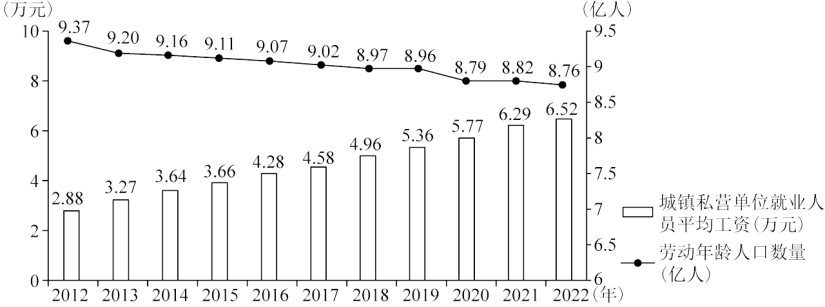
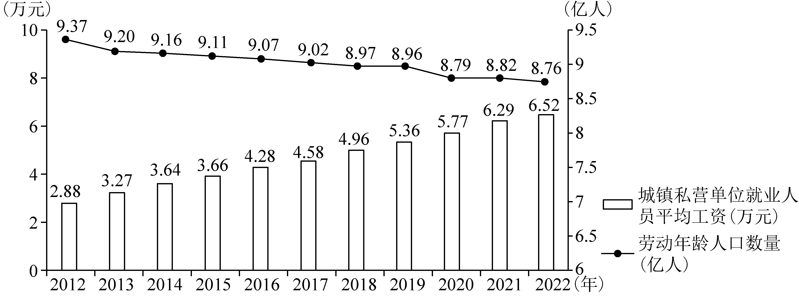

**2023年普通高等学校招生全国统一考试（全国乙卷）**

**思想政治**

**一、选择题。**

1\. 劳动课程成为义务教育阶段一门独立课程后，一些企业加大了儿童劳动工具的开发与生产，销售市场也不断升温，如浙江义乌小商品市场儿童使用的锅、碗、炉、勺、铲等厨具销售火爆。上述现象反映的经济道理是（ ）

①生产决定消费的内容，生产什么就消费什么

②市场需求引导供给，市场需要什么就生产什么

③生产为消费创造动力，供给转型才能扩大需求

④消费对生产有反作用，新消费热点催生新生产业态

A. ①③ B. ①④ C. ②③ D. ②④

【答案】D

【解析】

【详解】②④：劳动课程成为义务教育阶段一门独立课程后，一些企业加大了儿童劳动工具的开发与生产，销售市场也不断升温，这说明消费对生产有反作用，新消费热点催生新生产业态；劳动课程成为义务教育阶段一门独立课程会刺激儿童劳动工具的市场需求，这时企业加大儿童劳动工具的开发与生产，说明市场需求引导供给，市场需要什么就生产什么，②④正确。

①③：材料强调的是消费对生产的反作用，不是强调生产对消费的决定作用，且“供给转型才能扩大需求”说法过于绝对，①③排除。

故本题选D。

2\. 某农机企业为了推广智能农业机械，推出一种新的营销服务模式。该模式允许农户选择短期租赁、系统代运营服务，农户支付较低服务费用后获得业务支持，如播种、杂草控制、施肥、灌溉、土壤分析等。目前，这种服务模式得到大面积推广。该模式被市场广泛认同的原因在于（ ）

①减少农机研发成本，扩大农机生产规模

②推动智能化生产，提高农产品销售价格

③加速农机运营周转，增加农机使用效益

④降低农户生产劳动强度，提高经营效率

A. ①② B. ①③ C. ②④ D. ③④

【答案】D

【解析】

【详解】③④：某农机企业推出的营销服务模式允许农户选择短期租赁、系统代运营服务，农户支付较低服务费用后获得业务支持，被市场广泛认同。这是因为该模式能够加速农机运营周转，降低农户生产劳动强度，增加农机使用效益，提高经营效率，③④正确。

①：材料中的营销服务模式只需要农户支付较低服务费用，因此可以减少农民种植的成本，既减少使用农机的成本，材料并不涉及农机研发成本问题，①排除。

②：材料中的营销服务模式有利于推动智能化农业生产，提高农业劳动生产率，如果不考虑其他因素，这会使农产品价格降低，而不是提高，②排除。

故本题选D。

3\. 《管子》中记载：鲁梁两国百姓惯于织绨（古代一种织物）。齐国禁止国内织绨并要求所需绨服全部从鲁梁购买，同时齐桓公带头穿绨服，百姓纷纷仿效，结果绨价大涨。鲁梁国君遂要求百姓少种粮而全力发展绨业。然而一年多后，齐桓公率百姓改穿帛服，并封闭关卡与鲁梁断绝经济往来。很快鲁梁粮价飞涨，百姓陷入饥荒，纷纷投奔齐国。三年后，鲁梁臣服于齐国。从中可获得的启示是（ ）

①粮食安全是一国经济安全的底线

②生产分工会加剧一国经济发展不平衡

③经济结构单一存在潜在经济风险

④对外贸易畅通是一国经济发展的保证

A. ①③ B. ①④ C. ②③ D. ②④

【答案】A

【解析】

【详解】①③：齐国的策略，成功推动鲁梁两国少种粮而全力发展绨业，之后因齐国调整政策，鲁梁两国陷入饥荒，被迫臣服于齐国，这表明粮食安全是一国经济安全的底线，经济结构单一存在潜在经济风险，①③正确。

②：生产领域的国际分工与协作不断深化加强，是经济全球化发展的趋势。生产的合理分工，共同协作的完成，可以充分发挥各国的比较优势，推动世界范围内资源配置效率提高、科技进步、产业转移与结构升级，为世界经济发展提供强劲动力。因此生产分工不一定会加剧一国经济发展不平衡，②排除。

④：对外贸易畅通，有助于促进一国经济发展。但一国经济发展，根本上还是要依赖于自身，④排除。

故本题选A。

4\. 为刺激消费增加生产，政府出台了一系列政策，对购买甲种产品发放消费补贴，对生产乙种产品的企业减税降费，由此引起这两种产品的供需变化，如下图所示。

 

注：①是指曲线S1到S₂的移动；②是指点E1到E₂的变动；③是指曲线D1到D₂的移动；④是指点M1到M₂的变动。

图中，正确反映两种产品政策效应的是（ ）

A. 甲产品：①→②；乙产品：③→④

B. 甲产品：③→④；乙产品：①→②

C. 甲产品：④→③；乙产品：②→①

D. 甲产品：②→①；乙产品：④→③

【答案】B

【解析】

【详解】B：政府对购买甲种产品发放消费补贴，会促进人们对甲种产品的消费需求增加，这一变化是由政府政策引起，而非价格导致，表明价格没有改变，因此需求曲线应向右平移，即对应③。甲产品的消费需求增加，会促使甲产品的价格升高，从而刺激甲产品的生产者扩大生产规模，增加供给，即对应④。因此甲产品的变化情况是：③→④。政府对乙产品的生产企业减税降费，降低了其生产成本，会刺激生产者扩大生产规模，增加供给，但这一变化是由政府政策引起而不是由价格变化引起，因此供给曲线应向右平移，即对应①。乙产品的供给增加，会引起价格下降，从而刺激消费需求增加，即对应②。因此，乙产品的变化情况是：①→②，B正确。

ACD：通过以上分析发现，ACD均不符合题意，排除。

故本题选B。

5\. 某地启动实施“党建聚力服务民生”专项行动，采取多种途径了解群众诉求，构建起区、街道、社区、小区纵向联动和街道社区、驻地单位、行业系统横向互通工作机制。2022年以来，确定街道、社区重点民生实事项目106个。到2023年初，累计投入资金3370余万元，完成率达98.1%,群众满意度达98.7%。该地惠民政策落实到位（ ）

①取决于经济组织和街道社区的纵向联动

②有赖于基层政府的机构调整和职能优化

③得益于建立高效便捷的民生诉求解决机制

④关键在于强化党建引领，提高社会综合治理能力

A. ①② B. ①③ C. ②④ D. ③④

【答案】D

【解析】

【详解】①：某地启动实施“党建聚力服务民生”专项行动，采取多种途径了解群众诉求，构建起区、街道、社区、小区纵向联动和街道社区、驻地单位、行业系统横向互通工作机制，这表明经济组织和街道社区横向联动，不是纵向联动，①排除。

②：启动实施“党建聚力服务民生”专项行动，采取多种途径了解群众诉求，构建的这一互通工作机制，没有涉及基层政府的机构调整，②排除。

③：2022年以来确定街道、社区重点民生实事项目106个。到2023年初，累计投入资金3370余万元，完成率达98.1%，群众满意度达98.7%。该地惠民政策落实到位，得益于建立高效便捷的民生诉求解决机制，③正确。

④：启动实施“党建聚力服务民生”专项行动，表明关键在于强化党建引领，提高社会综合治理能力，④正确。

故本题选D。

6\. 为进一步贯彻实施行政处罚法，国务院发出通知，要求行政机关设置电子技术监控设备要确保符合标准、设置合理、标志明显，严禁违法要求当事人承担或者分摊设置电子技术监控设备的费用，严禁交由市场主体设置电子技术监控设备并由市场主体直接或者间接收取罚款。上述规定旨在（ ）

①规范行政处罚行为，提升执法效率

②促进监控设备合理利用，强化执法力度

③推进依法行政，保护当事人的合法权益

④厘清政府和市场关系，明确行政主体责任

A. ①② B. ①③ C. ②④ D. ③④

【答案】D

【解析】

【详解】③④：国务院发出的通知，对行政机关设置电子技术监控设备提出明确要求，旨在进一步贯彻实施行政处罚法 ，推进依法行政，保护当事人的合法权益，厘清政府和市场关系，明确行政主体责任 ，③④正确。

①②：材料主要强调规范执法行为，没有涉及提升行政机关的执法效率，没有涉及强化执法力度，①②排除。

故本题选D。

7\. 截至2022年6月，中国同发展中国家建立农业合作区并派遣大批专家和技术人员，推广农业技术1000多项，带动项目区农作物平均增产30%～60%，超过150万农户从中受益。中国重视同发展中国家的农业科技交流，是因为（ ）

①中国的农业科技水平居于世界领先地位

②发展中国家的发展关系到世界的稳定和繁荣

③中国在解决发展中国家粮食安全问题上负有直接责任

④中国外交长期致力于缩小南北发展差距、消除发展赤字

A. ①② B. ①③ C. ②④ D. ③④

【答案】C

【解析】

【详解】①：“十三五”发展报告发布我国农业科技整体实力进入世界前列，我国农业科技水平已从世界第二方阵迈入第一方阵，处于发展中国家领先地位，但不是世界领先地位，①排除。

②④：中国重视同发展中国家的农业科技交流，是因为发展中国家的发展关系到世界的稳定和繁荣 ，中国外交长期致力于缩小南北发展差距、消除发展赤字，②④正确。

③：保障粮食安全，解决发展中国家粮食安全问题，表明中国展现大国担当，但这不是我国的直接责任，③排除。

故本题选C。

8\. 近年来，乡村球赛“火”了。村民把十里八乡的篮球赛亲切地称为“村BA”，把足球赛称为“村界杯”。这种贴近村民生活、步入烟火人间的草根球赛推动了全民健身运动在乡村的蓬勃开展，丰富了乡村的文化生活，也带来了经济效益和社会效益。由此可见（ ）

①健康文明的文化活动可以满足村民对美好生活的期盼

②乡村文化阵地需要用先进的、健康有益的文化去占领

③村民需要和接受的文化，就是值得倡导和扶持的文化

④丰富乡村文化生活是乡村精神文明建设的主要任务

A. ①② B. ①③ C. ②④ D. ③④

【答案】A

【解析】

【详解】①②：“村BA”、“村界杯”等近村民生活、步入烟火人间的草根球赛推动了全民健身运动在乡村的蓬勃开展，丰富了乡村的文化生活，也带来了经济效益和社会效益。由此可见，健康文明的文化活动可以满足村民对美好生活的期盼，因此，乡村文化阵地需要用先进的、健康有益的文化去占领，①②正确。

③：村民需要和接受的文化未必是先进的文化，并非都是值得倡导和扶持的，③错误。

④：丰富乡村文化生活是乡村精神文明建设的目的，而不是任务，④错误。

故本题选A。

9\. 2023年是毛泽东“向雷锋同志学习”题词60周年。六十年来，雷锋精神历久弥新，成为一面永不褪色、光芒永存的精神旗帜；“学习雷锋好榜样”的歌声响彻中国大地，成为鼓卿和激励亿万青少年成长进步的强大动力。

雷锋精神是永恒的，因为它（ ）

①具有超越性，不受一定时期社会历史条件的影响

②是爱国主义、集体主义、社会主义精神的生动体现

③与时俱进，在不同时期具有完全不同的内容和形式

④适应了中国人民为实现民族复兴而团结奋斗的实践需要

A. ①② B. ①③ C. ②④ D. ③④

【答案】C

【解析】

【详解】②④：雷锋精神是永恒的，因为它是中华民族精神的时代表现，是爱国主义、集体主义、社会主义精神的生动体现；雷锋精神历久弥新，不断鼓舞和激励着全国人民和亿万青少年，这表明它适应了中国人民为实现民族复兴而团结奋斗的实践需要，②④正确。

①：社会存在决定社会意识，雷锋精神作为一种社会意识，必然会受到社会历史条件的影响和制约，①说法错误。

③：雷锋精神的具体内涵能够与时俱进，但其基本内涵具有相对稳定性，在不同时期有其共同要求，“在不同时期具有完全不同的内容和形式”说法错误，③排除。

故本题选C。

10\. 农村，这个曾被一些人视为“穷困”“闭塞”“落后”地方，如今正吸引着越来越多的人去创业。据统计，2012年至2022年底，全国返乡入乡创业人员累计达1220万人。从过去“争相跳农门”变成“我要回农村”,说明（ ）

①任何价值观和价值判断都是对社会存在的能动反映

②正确的价值观和价值判断源于主体的知识和能力

③价值观和价值判断对人们的行为选择发挥着重要作用

④价值观和价值判断正确与否取决于其对主体的实践能否发挥导向作用

A. ①② B. ①③ C. ②④ D. ③④

【答案】B

【解析】

【详解】①③：随着乡村战略的实施，城乡融合发展，我国农村发生了翻天覆地的变化，因此人们对农村的认识从过去“争相跳农门”变成“我要回农村”，说明任何价值观和价值判断都是对社会存在的能动性反映，体现了价值观和价值判断对人们的行为选择发挥着重要作用，①③正确。

②：正确的价值观和价值判断作为一种社会意识，源于实践，而不是主体的知识和能力，②错误。

④：价值观和价值判断正确与否取决于是否遵循社会发展的客观规律和是否站在最广大人民的立场上，④错误。

故本题选B。

11\. 党的二十大报告指出，问题是时代的声音，回答并指导解决问题是理论的根本任务。今天我们所面临问题的复杂程度、解决问题的艰巨程度明显加大，给理论创新提出了全新要求。这一论述的认识论根据是（ ）

①发展着的社会实践不断向认识提出新的课题

②社会实践为认识发展创造了越来越优越的条件

③满足社会实践的需要是认识的根本目的和归宿

④社会实践为验证认识正确与否提供了客观标准

A. ①② B. ①③ C. ②④ D. ③④

【答案】B

【解析】

【详解】①：今天我们所面临问题复杂程度、解决问题的艰巨程度明显加大，给理论创新提出了全新要求，这表明发展着的社会实践不断向认识提出新的课题，①正确。

②：社会实践为认识发展提供越来越先进的认识工具，提升了人的认识能力，推动认识的发展，因此说社会实践为认识发展创造了越来越优越的条件有其道理，但是材料强调的是社会实践的发展遇到的新情况新问题，推动人们去认识去研究，②不符合题意。

③：“问题是时代的声音，回答并指导解决问题是理论的根本任务”表明满足社会实践的需要是认识的根本目的和归宿，③正确。

④：材料没有涉及社会实践的检验标准的功能，④排除。

故本题选B。

12\. 每当鲜花盛开的季节，赏花者纷至沓来。某公园用“你欣赏花的美丽，花欣赏你的高度”“把花朵留在枝头，让美丽留在心灵”等宣传语，代替“禁止折花”“摘花可耻”等警示语，营造人与自然和谐相处的环境，违规摘花的游客明显减少。该现象反映的哲学道理是（ ）

①改变人的思想观念就能变革客观现实

②人的思想观念对人的行为具有导向作用

③思想观念具有能动性，不受制于客观现实

④客观现实的变化会引起人的思想观念的改变

A. ①② B. ①③ C. ②④ D. ③④

【答案】C

【解析】

【详解】①：人的思想观念属于意识范畴，不具有直接现实性。人的思想观念发生改变后，必须通过实践才能变革客观现实，①排除。

②④：公园里的宣传语代表了警示语，营造人与自然和谐相处的环境，违规摘花的游客明显减少，起到了很好的效果，表明客观现实的变化会引起人的思想观念的改变，人的思想观念对人的行为具有导向作用，②④正确。

③：思想观念具有能动性，能够能动地认识世界和改造世界。但客观现实是客观的，不以人的意志为转移，人们要正确地认识世界和改造世界，就必须使主观符合客观，从客观实际出发。“不受制于客观现实”的说法错误，③排除。

故本题选C。

**二、非选择题。**

13\. 阅读材料，完成下列要求。

材料一 2012～2022年我国劳动年龄人口数量和城镇私营单位就业人员平均工资。

注：劳动年龄人口是指16～59岁的劳动适龄人口。

材料二 随着5G、人工智能、云计算等技术的快速发展，服务机器人越来越广泛地应用于商业、医疗、生产性服务等领域：迎宾机器人提供接待，咨询、引路、导览讲解，互动娱乐服务；医疗机器人提供导诊、远程诊疗服务；检修机器人检查电网、维护电路和电信设备，清洁机器人在粉尘环境下清扫施工现场……。

（1）解读材料一反映的经济信息。

（2）有人说，广泛使用服务机器人，会引发失业潮，不利于就业稳定。结合材料一和材料二，运用经济知识对该观点加以评析。

【答案】（1）2012——2022年，我国劳动年龄人口数量总体呈减少趋势﹐城镇私营单位就业人员平均工资呈逐年增加趋势，企业招工难、用工贵的现象日益突出。

（2）①广泛使用服务机器人，在减少简单机械劳动岗位的同时，会增加机器人研发、维护等岗位，对于缺乏学习能力，难以适应人工智能的劳动者来说，会带来失业风险；反之，对于那些具有信息技术研发和运用能力的人来说，则会使其拥有更多就业机会。②服务机器人的广泛使用，一方面有利于缓解企业招工难、用工贵的问题，另一方面会促使劳动者提高技能和素质，进而促进就业结构优化、就业质量提高。

【解析】

【分析】背景素材：我国的就业问题

考点考查：劳动与就业、贯彻新发展理念，推动经济高质量发展等有关知识

能力考查：获取和解读信息，调动和运用知识，描述和阐述事物，论证和探究问题

核心素养：政治认同、科学精神

【小问1详解】

第一步：审设问。明确主体、知识范围、问题限定和作答角度。本题为图表信息解读类试题，要求解读材料一反映的经济信息。需要研读图表的标题、内容与注释等，调动教材知识，运用术语进行表述。一般来说既要解读图表的表层信息，也要进一步思考图表蕴含的原因、意义等深层信息。

第二步：审图表。提取关键词，链接教材知识。

关键词①： 根据图表中2012～2022年我国劳动年龄人口数量的变化数据及趋势——可知2012——2022年，我国劳动年龄人口数量总体呈减少趋势。推断会存在“用工难”问题。

关键词②： 根据图表中2012～2022年我国城镇私营单位就业人员平均工资变化数据及趋势——可知城镇私营单位就业人员平均工资呈逐年增加趋势，“用工贵”的现象日益突出。

第三步：整合信息，组织答案。注意设问限定、图表信息以及教材知识与材料相结合。

【小问2详解】

第一步：审设问。明确主体、知识范围、问题限定和作答角度。本题为辨析类试题。注意辨点在于：广泛使用服务机器人，会不会必然引发失业潮；是否不利于就业稳定。解答本题需要调用劳动与就业的相关知识，运用一分为二的辩证思想开展评析。

第二步：审材料。提取关键词，链接教材知识。

关键词①：“广泛使用服务机器人，会引发失业潮”→可联系广泛使用服务机器人，会增加机器人研发、维护等岗位，对于一部分劳动者来说是挑战，会带来失业风险；对于那些具有信息技术研发和运用能力的人来说，则使其拥有更多就业机会。

关键词②：材料一图表显示我国劳动年龄人口数量总体呈减少趋势。存在“用工难”“用工贵”问题→可联系广泛使用服务机器人减少了简单机械劳动岗位，促使劳动力资源优化配置。缓解企业招工难、用工贵的问题，也会促使劳动者提高技能和素质，进而提高就业质量。

第三步：整合信息，组织答案。注意设问限定以及教材知识与材料相结合。

14\. 阅读材料，完成下列要求。

《国民经济和社会发展第十四个五年规划和2035年远景目标纲要》提出，“深入实施区域重大战略、区域协调发展战略、主体功能区战略，健全区域协调发展体制机制"。新修正的《立法法》规定：“省、自治区、直辖市和设区的市、自治州的人民代表大会及其常务委员会根据区域协调发展的需要，可以协同制定地方性法规，在本行政区域或者有关区域内实施。"

赤水河流经云南、贵州和四川三省。长期以来，赤水河的保护面临跨行政区域污水排放标准、环境监管执法等不一致的问题。2021年5月底，在全国人大常委会的指导下，云南、贵州、四川三省人大常委会按照“同一文本、同步审议、同时公布、同时实施”的要求，分别审议并通过了关于加强赤水河流域共同保护的决定，同时审议并通过了各自的赤水河流域保护条例。决定和条例于同年7月1日起同步施行。

结合材料，运用《政治生活》知识，说明三省人大常委会开展区域协同立法的积极作用。

【答案】①开展区域协同立法，有利于三省统一标准，维护地方性法规的权威，推动新时代地方立法高质量发展；\
②有利于促进区域协调发展，形成赤水河保护的合力，加强赤水河流域共同保护；\
③有利于推进国家治理体系和治理能力现代化，使中国特色社会主义制度更加成熟、更加定型。

【解析】

分析】背景素材：赤水河流域地区开展协同立法

考点考查：人民代表大会制度、依法治国等有关知识

能力考查：获取和解读信息，调动和运用知识，描述和阐述事物，论证和探究问题

核心素养：政治认同、科学精神、法治意识

【详解】第一步：审设问，明确主体、作答范围、问题限定和作答角度。本题属于意义类主观题，要求考生说明三省人大常委会开展区域协同立法的积极作用。根据设问中“人大常委会”“立法”等关键信息，可知本题注意考查人民代表大会制度、依法治国等有关知识，应结合材料中三省的具体做法和要求，从意义角度进行分析。

第二步：审材料，提取关键词，链接教材知识。

关键词①：长期以来，赤水河的保护面临跨行政区域污水排放标准、环境监管执法等不一致的问题→可联系开展区域协同立法有利于三省统一标准，维护地方性法规的权威，推动新时代地方立法高质量发展。

关键词②：三省人大常委会按照“同一文本、同步审议、同时公布、同时实施”的要求，分别审议并通过了关于加强赤水河流域共同保护的决定→可联系有利于促进区域协调发展，形成赤水河保护的合力，加强赤水河流域共同保护。

关键词③：“深入实施区域重大战略、区域协调发展战略、健全区域协调发展体制机制”；“根据区域协调发展的需要，可以协同制定地方性法规，在本行政区域或者有关区域内实施”→可联系有利于推进国家治理体系和治理能力现代化，使中国特色社会主义制度更加成熟、更加定型。

第三步：整合信息，组织答案。注意设问限定以及教材知识与材料、时政信息等相结合。

15\. 阅读材料，完成下列要求。

习总书记强调，“让收藏在博物馆里的文物、陈列在广阔大地上的遗产、书写在古籍里的文字都活起来，丰富全社会历史文化滋养。"

近年来，传统文化类节目成为电视荧屏上的一大亮点，从《经典咏流传》和诗以歌、咏唱中国经典名篇，到《中国诗词大会》以选手积极竞答、观众广泛参与、专家深度阐释的方式展示中国诗词之美；从《典籍里的中国》以影视化、戏剧化、故事化的方式展现典籍中蕴含的家国情怀，中国价值，到《中国成语大会》讲述成语所承载的历史文化内涵及其背后的中国智慧；从《上新了·故宫》寻觅故宫的历史脉络与文化元素，到《如果国宝会说话》解读国宝背后的中国精神、中国审美……经过创作者的深入发掘、精心编制、精彩演绎，沉淀着历史烟云，凝结着先贤智慧的文字、故事、典籍、文物、建筑遗产“活起来”,为观众带来一场场精彩纷呈的文化盛宴，形成持续不断的传统文化热。

（1）结合材料并运用《文化生活》知识，阐明推动优秀传统文化“活起来”“热起来”的意义。

（2）创新是传统文化富有生机与活力的重要保证，运用辩证否定观并结合材料加以说明。

（3）请就新时代青年如何为传承中华优秀传统文化作贡献提出两点建议。

【答案】（1）①中华优秀传统文化是中华民族的突出优势，也是我们最深厚的文化软实力。推动优秀传统文化“活起来”“热起来”，有利于彰显中华优秀传统文化源远流长、博大精深的基本特征，弘扬中华优秀传统文化， 能够激发民族自信心和自豪感，铸牢中华民族共同体意识，发挥中华优秀传统文化的当代价值，推动中华优秀传统文化创造性转化、创新性发展，促进民族文化繁荣。\
②有利于发挥优秀文化对经济的促进作用，推动生产力的发展，增强综合国力。\
③有利于发挥优秀文化对个人的促进作用，提高人们的文化素质，满足人们日益增长的美好生活需要。

（2）①辩证否定，是事物自身的否定，是联系的环节和发展的环节，不是肯定一切和否定一切，而是既肯定又否定，既克服又保留，实质是扬弃。要求我们树立创新意识，坚持辩证法的革命批判精神与创新意识，要密切关注变化发展的实际，敢于突破与实际不相符合的成规陈说，注重研究新情况，善于提出新问题，敢于寻找新思路。\
②电视荧屏上的传统文化类系列节目，都是经过创作者的深入发掘、精心编制、精彩演绎，都是对中华传统文化进行扬弃的过程，保留着优秀传统文化的精华，又融入了时代精神，持续展现了中华优秀传统文化的恒久魅力，保证了中华优秀传统文化富有生机与活力。

（3）①深入挖掘中华优秀传统文化的思想精髓，积极主动传承中华优秀传统文化，使其焕发恒久魅力。\
②创新发展中华优秀传统文化，与中国式现代化的当代实践紧密结合，使其永葆生机活力。

【解析】

【分析】背景素材：传统文化类节目成为电视荧屏上的一大亮点，推动优秀传统文化“活起来”“热起来”

考点考查：文化生活的相关知识、 辩证否定观的知识

能力考查：描述和阐释事物、论证和探究问题

核心素养：政治认同、科学精神、公共参与

【小问1详解】

第一步：审设问。明确题型、作答范围、问题限定和作答角度。

本题为意义类主观题，要求运用文化生活的知识，阐明推动优秀传统文化“活起来”“热起来”的意义。

第二步：审材料，通过标点符号、段落等，提取材料有效信息。

有效信息①： 从《典籍里的中国》以影视化、戏剧化、故事化的方式展现典籍中蕴含的家国情怀，中国价值，到《中国成语大会》讲述成语所承载的历史文化内涵及其背后的中国智慧→可联系中华优秀传统文化的基本特征，激发民族自信心和自豪感，铸牢中华民族共同体意识，发挥中华优秀传统文化的当代价值，推动中华优秀传统文化创造性转化、创新性发展，促进民族文化繁荣。（文化对文化的作用）

有效信息②： 传统文化类节目成为电视荧屏上的一大亮点，形成持续不断的传统文化热→可联系发挥优秀文化对经济的促进作用，推动生产力的发展，增强综合国力。（文化对经济的作用）

有效信息③：为观众带来一场场精彩纷呈的文化盛宴，形成持续不断的传统文化热→可联系文化对个人的影响，优秀文化对个人的促进作用，提高人们的文化素质，满足人们日益增长的美好生活需要。（文化对个人的作用）

第三步：整合信息，组织答案。

【小问2详解】

第一步：审设问。明确题型、作答范围、问题限定和作答角度。

本题为说明类主观题，要求运用辩证否定观的知识说明创新是传统文化富有生机与活力的重要保证。从理论逻辑和材料逻辑两个角度来进行分析作答。

第二步：审材料，通过标点符号、段落等，提取材料有效信息。

有效信息①：《典籍里的中国》以影视化、戏剧化、故事化的方式展现典籍中蕴含的家国情怀，中国价值......经过创作者的深入发掘、精心编制、精彩演绎→可联系辩证否定观的原理与方法论。（理论逻辑）

有效信息②：经过创作者的深入发掘、精心编制、精彩演绎，沉淀着历史烟云，凝结着先贤智慧的文字、故事、典籍、文物、建筑遗产“活起来”,为观众带来一场场精彩纷呈的文化盛宴，形成持续不断的传统文化热→可联系对中华传统文化进行扬弃的过程，保留着优秀传统文化的精华，又融入了时代精神，持续展现了中华优秀传统文化的恒久魅力，保证了中华优秀传统文化富有生机与活力。（材料逻辑）

第三步：整合信息，组织答案。

【小问3详解】

本题是开放试题，要求就新时代青年如何为传承中华优秀传统文化作贡献提出两点建议。言之有理即可。参考角度：思想理论层面和当代实践层面。
