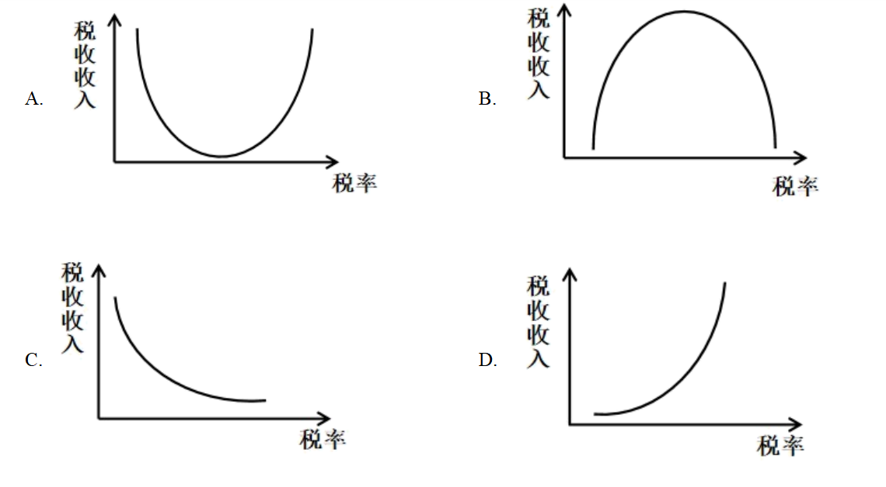

**2023年普通高等学校招生全国统一考试（全国甲卷）**

**思想政治**

**一、选择题。**

1\. 马克思劳动价值论认为，劳动是劳动者的体力和脑力的支出；劳动者通过就业取得报酬，从而获得生活来源，使社会劳动力能够不断地再生产。下列属于劳动力再生产所需费用的是（ ）

①房租

②教育培训费

③旅游支出

④娱乐平台会员费

A. ①② B. ①③ C. ②④ D. ③④

【答案】A

【解析】

【详解】①：劳动力再生产所需费用，是劳动者恢复劳动力所需的各种资料的价格总和，包括基本食物、衣物、住宿和医疗的费用，①入选。

②：马克思劳动价值论认为，劳动力扩大再生产费用，包括养家糊口、教育培训等活动所需的各种物质资料和服务的价值总和，故②符合题意。

③④：旅游支出和娱乐平台会员费均不属于劳动力再生产所需费用，③④排除。

故本题选A。

2\. 甲企业主要从事某种产品的代加工业务，使用境外客户提供的商标、关键零部件进行生产，由境外客户负责产品销售，获得的加工费占销售价格的5%。甲企业为改变其在产业链中的分工地位，实现转型发展，可采取的策略是（ ）

①扩大现有生产规模，增大产品利润空间

②拓宽境外客户来源，提高出口议价能力

③加强核心技术攻关，开发生产自有产品

④培育发展自有品牌，自主建立营销渠道

A. ①② B. ①③ C. ②④ D. ③④

【答案】D

【解析】

【详解】③④：该企业之所以在产业链中处于不利地位，主要在于其缺乏具有自主知识产权的品牌，只能从事代加工业务，因而利润微薄。若甲企业想改变其在产业链中的分工地位，实现转型发展，就需要向产业链两端发展，加强核心技术攻关，开发生产自有产品；同时培育发展自有品牌，自主建立营销渠道，③④入选。

①：扩大生产规模并不一定能增大利润空间，而且并不能改变其在产业链分工中利润微薄的不利局面，①排除。

②：材料中该企业只是承揽为国外某种产品进行代加工业务，并不负责产品销售，得到的是及其微博的加工费，它自身根本不具有出口议价能力，②不符合题意。

故本题选D。

3\. 2022年12月，中央经济工作会议将“着力扩大国内需求”作为2023年经济工作的重要任务，强调要继续实施积极的财政政策和稳健的货币政策，坚持经济运行稳字当头、稳中求进。以下政策举措有助于扩大国内需求的是（ ）

①加强对服务消费的金融支持

②减少地方政府专项债券发行

③加大对民生工程建设的投入

④提高商业银行法定存款准备金率

A. ①② B. ①③ C. ②④ D. ③④

【答案】B

【解析】

【详解】①：加大服务消费金融支持，属于稳健的货币政策，有利于促进消费，有助于扩大国内需求，①正确。

②：减少地方政府专项债权发行，地方财政支出减少，投资力度下降，属于紧缩的财政政策，不利于扩大国内需求，②不符合题意。

③：加大对民生工程建设的投入，发挥财政对民生领域的支持作用，增加政府财政支出，属于积极的财政政策，有助于扩大国内需求，③正确。

④：提高商业银行法定存款准备金率，信贷规模收缩，流通中的货币量减少，属于紧缩性的货币政策，不利于扩大国内需求，④不符合题意。

故本题选B。

4\. 《论语》里记载了一段鲁哀公与有若的对话：

哀公：今年荒年收成不大好，国库又不足，该怎么办呢？

有若：能否将老百姓的赋税从百分之二十降到百分之十呢？

哀公：收百分之二十的税国库里的钱都不够，如果减到百分之十，岂不是更加糟糕吗？

有若：如果百姓手中没有钱，国库里又怎么能有钱呢？如果百姓手中有了足够的钱，你又何必为国库里没有钱发愁呢？

下列图示中，与有若的观点相吻合的是（ ）

【答案】B

【解析】

【详解】ABCD：有若观点可以解读为：较高的税率将抑制经济的增长，使税基减小，税收收入下降；减税可以刺激经济增长，扩大税基，税收收入增加。有若的观点和西方“拉弗曲线”理论一致，“拉弗曲线”是描绘税收收入与税率关系的曲线，即当税率在一定的限度以下时，提高税率能增加政府税收收入，但超过这一限度时，再提高税率反而导致政府税收收入减少。B选项曲线与有若的观点相吻合，B符合题意，ACD均不符合题意。

故本题选B。

5\. 《证券期货业网络和信息安全管理办法》于2023年5月1日正式实施。该《办法》要求经营机构对收集客户生物特征的必要性和安全性进行风险评估，明确“不得将人脸、步态、指纹、虹膜、声纹等生物特征作为唯一的客户身份认证方式，强制客户同意收集其个人生物特征信息”。这一规定旨在（ ）

①消除证券期货业经营风险

②维护经营机构信息安全

③保护客户的隐私和个人信息

④规范经营机构的信息收集行为

A. ①② B. ①④ C. ②③ D. ③④

【答案】D

【解析】

【详解】①：材料中的规定旨在保护客户个人信息、规范经营机构的信息收集行为，但无法“消除证券期货业经营风险”，①说法错误。

②：材料中的规定旨在保护客户个人信息权益，而不是维护经营机构的信息安全，②不符合题意。

③：“不得将人脸、步态、指纹……等生物特征作为唯一的客户身份认证方式”的规定，说明经营机构不得违反必要原则，同时应当对其安全性进行风险评估，要注重保护客户的隐私和个人信息，③符合题意。

④：“不得强制客户同意收集其个人生物特征信息”的规定，说明经营机构应当遵循合法、正当原则，规范自身的信息收集行为，收集客户信息要征得客户的同意，④符合题意。

故本题选D。

6\. 国务院印发的《“十四五”国家老龄事业发展和养老服务体系规划》要求，各地要根据财政承受能力，出台基本养老服务清单，对健康、失能、经济困难等不同老年人群体，分类提供养老保障、生活照料、康复照护、社会救助等适宜服务。对上述要求理解正确的有（ ）

①市场是提高养老服务水平的决定性因素

②推动老龄事业发展要尽力而为、量力而行

③提供基本养老服务产品属于中央政府的事权

④保障基本养老服务是地方政府职能的重要内容

A. ①② B. ①③ C. ②④ D. ③④

【答案】C

【解析】

【详解】①：材料强调各地要根据财政承受能力，出台基本养老服务清单，这体现了社会保障水平与经济社会发展相适应。经济发展是社会保障的基础，是提高养老服务水平的决定性因素，①表述错误。

②：“各地要根据财政承受能力”，表明推动老龄事业发展要量力而行；“各地要出台基本养老服务清单，对相关老年群体提供适宜服务”，这表明推动老龄事业发展要尽力而为，②正确切题。

③：中央政府主要从宏观上谋划基本养老服务事业，提供基本养老服务产品属于微观层面事务，③错误。

④：国务院就老龄事业发展和养老服务体系对各地政府提出要求，这表明保障基本养老服务是地方政府职能的重要内容，④正确切题。

故本题选C。

“基层强则国家强，基层安则天下安”。党和国家历来高度重视加强基层治理工作。完成下面小题。

7\. 20世纪60年代初，浙江枫桥镇干部群众在基层社会治理实践中创造了“依靠群众就地化解矛盾”的“枫桥经验”，受到毛泽东的高度评价。党的十八大以来，“枫桥经验”在运用中不断发展创新，形成了多元预防调处化解社会矛盾纠纷的新时代“枫桥经验”。这表明，“枫桥经验”（ ）

①在变与不变的对立统一中不断完善

②在适应时代和实践新要求中不断丰富

③在解决社会的对抗性矛盾中不断发展

④在新事物代替旧事物的飞跃中不断创新

A. ①② B. ①③ C. ②④ D. ③④

8\. 近年来，某地积极探索推进基层治理现代化，打造区、街道、社区三级微服务平台，形成“党建引领、社区主导、社工参与、情感治理、数据赋能”五大机制，构建起以“大数据、微服务”为主要特色的社区治理和服务综合体系，被评为全国基层治理创新典型案例。这启示我们，加强基层治理（ ）

①要统筹发挥街道、社区的政府管理职能

②要以向基层放权赋能、减轻基层负担为前提

③需要推动政府治理同社会调节、居民自治良性互动

④要坚持系统治理、综合治理理念，提高治理智能化、专业化水平

A. ①② B. ①③ C. ②④ D. ③④

【答案】7. A 8. D

【解析】

【7题详解】

①②：20世纪60年代初浙江枫桥创造的“枫桥经验”在党的十八大以后得以不断发展创新，形成了多元预防调处化解社会矛盾纠纷的新时代，这说明事物是绝对运动和相对静止的统一， “枫桥经验”在变与不变的对立统一中不断完善，在适应时代和实践新要求中不断丰富发展，①②符合题意；

③：社会主义社会的基本矛盾是非对抗性的，而不是对抗性的。③说法错误。

④：“枫桥经验”在不断发展中仍保留了20世纪60年代的 “化解矛盾”等积极合理成分，并不是对旧事物的完全否定和代替，④说法不准确。

故本题选A。

【8题详解】

③④：材料中，该地打造区、街道、社区三级服务平台，推动基层治理创新，这启示我们，加强基层治理要推动政府治理同社会调节、居民自治良性互动；该地构建以“大数据”“微服务”为主要特色的社区治理和服务综合体系，这启示我们，加强基层治理要要坚持系统治理、综合治理理念、提高治理智能化、专业化水平，③④符合题意。

① ：社区不属于政府部门，不具有政府的管理职能，①说法错误。

② ：材料强调基层治理要推动政府、社会、居民良性互动，没有体现向基层放权赋能，也没有涉及减轻基层负担。②与题意不符。

故本题选D。

9\. 2022年中央广播电视总台春节联欢晚会上，舞蹈诗剧《只此青绿》以一股“青”流博得满堂彩。该节目把舞蹈与国画相结合，通过“青绿腰”等舞蹈动作生动演示了北宋名画《千里江山图》，把中国画“舞”活了，彰显出中华优秀传统文化的艺术张力和无穷魅力。这一现象反映的道理有（ ）

①优秀传统文化是艺术创新的源泉和动力

②文化创新是繁荣发展民族文化的必由之路

③对传统文化的批判性继承是文化创新的根基

④大众对传统文化的认同依赖于艺术形式的创新

A. ①② B. ①④ C. ②③ D. ③④

【答案】C

【解析】

【详解】①：社会实践是艺术创新的源泉和动力，①排除。

②③：舞蹈诗剧《只此青绿》以一股“青”流博得满堂彩。该节目把舞蹈与国画相结合，通过“青绿腰”等舞蹈动作生动演示了北宋名画《千里江山图》，把中国画“舞”活了，彰显出中华优秀传统文化的艺术张力和无穷魅力。这种文化创新，是对传统文化的批判性继承。而这种批判性继承，也是文化创新的根基，有利于繁荣发展民族文化，②③正确。

④：传统文化具有两面性，有精华也有糟粕。大众对优秀传统文化的认同，根本上还是依赖于对其内涵与当代价值的认同而非对其创新艺术形式的认同，④排除。

故本题选C。

10\. 党的二十大报告强调，只有把马克思主义基本原理同中国具体实际相结合、同中华优秀传统文化相结合，坚持运用辩证唯物主义和历史唯物主义，才能正确回答时代和实践提出的重大问题，才能始终保持马克思主义的蓬勃生机和旺盛活力。坚持和发展马克思主义，必须同中华优秀传统文化相结合，因为（ ）

①马克思主义具有吸收各种不同思想文化的开放性

②中华优秀传统文化赋予马克思主义鲜明的中国特色

③马克思主义提供了传承发展中华优秀传统文化的具体方案

④中华优秀传统文化能够促进马克思主义为中国人民所喜爱、所认同、所拥有

A. ①② B. ①③ C. ②④ D. ③④

【答案】C

【解析】

【详解】①：马克思主义吸收各种优秀或先进的思想文化，而不是吸收各种不同思想文化，①排除。

②④：坚持和发展马克思主义，必须同中华优秀传统文化相结合，就是因为中华优秀传统文化赋予马克思主义鲜明的中国特色，能够促进马克思主义为中国人民所喜爱、所认同、所拥有，②④正确。

③：马克思主义提供传承发展中华优秀传统文化的一般性指导，而不提供具体方案，③排除。

故本题选C。

11\. 在讲究效率、与时间赛跑的时代，“治愈”“解压”“诗和远方”等网络热词在青年群体中广泛传播，面对成长中的挑战与困难不“躺平”、不消沉、不抱怨，而是主动营造“治愈瞬间”、仔细体味“幸福时刻”，让人生充满温暖与亮色，成为青年人进行心理调适、积蓄昂扬斗志的新手段。这说明（ ）

①价值观正确与否取决于人们的价值评价

②价值观是社会存在的反映并随其发展而变化

③价值观往往因人而异，都应当得到包容与认同

④价值观对人生道路和生活方式的选择有着重要影响

A. ①② B. ①③ C. ②④ D. ③④

【答案】C

【解析】

【详解】①：价值观正确与否，不是取决于人们的价值评价，而是取决于是否遵循社会发展的客观规律和是否站在最广大人民的立场上，①排除。

②：在讲究效率、与时间赛跑的时代，“治愈”“解压”“诗和远方”等网络热词在青年群体中广泛传播，这表明价值观是社会存在的反映并随其发展而变化，②正确。

③：价值观是两面性，不是所有的价值观而是只有正确的价值观才应当得到包容与认同，③排除。

④：面对成长中的挑战与困难不“躺平”、不消沉、不抱怨，而是主动营造“治愈瞬间”、仔细体味“幸福时刻”，让人生充满温暖与亮色，成为青年人进行心理调适、积蓄昂扬斗志的新手段。这说明价值观对人生道路和生活方式的选择有着重要影响，④正确。

故本题选C。

12\. 党的二十大相关工作网络征求意见活动于2022年4月15日至5月16日开展，在人民日报社、新华社、中央广播电视总台所属官网、新闻客户端以及“学习强国”学习平台分别开设专栏，听取全社会意见建议，累计收到网民建言854.2万余条，为党的二十大相关工作提供了有益参考。从中获得的启示是（ ）

①人民群众的利益和诉求是制定决策的重要依据

②坚持党的群众路线需要探索创新有效的实现形式

③人是社会历史主体，每个人都推动社会历史发展

④只要坚持“到群众中去”，就能实现“从群众中来”

A. ①② B. ①④ C. ②③ D. ③④

【答案】A

【解析】

【详解】①②：党二十大相关工作通过网络等媒体全社会意见，这为党的二十大相关工作提供有益参考，这说明人民群众的利益和诉求是制定决策的重要依据，也说明坚持党的群众路线需要探索创新有效的实现形式，①②正确切题。

③：人民群众是社会历史的主体，是对社会历史起推动作用的人们，而不是“人是社会历史主体”，也不是“每个人都推动社会历史发展”，③表述错误。

④：从辩证法的角度看，从群众中来到群众中去的工作方法体现的是矛盾普遍性和特殊性的辩证关系。从群众中来，是问题的上传，从一个一个的问题中找出共性，研究出对策，到群众中去，用于指导解决群众的问题。所以应该是只有从群众中来，才能到群众中去，这才符合认识事物的秩序，④错误。

故本题选A。

**二、非选择题。**

13\. 阅读材料，完成下列要求。

一片绿地、一顶帐篷、一桌美食，和家人、好友一起享受美景美食、谈天说地……打开手机，仿佛半个朋友圈都在露营。

据统计，截至2023年3月，我国共有8.75万家露营企业，2022年新增3.51万家，新增量同比增长54.5%，帐篷、睡袋、折叠桌椅等商品产销量大幅度增长，企业不断推出“露营+钓鱼+瑜伽”“露营+烧烤+篝火晚会”“露营+亲子活动”等诸多新产品和新服务。2022年中国露营经济核心市场规模达到1134.7亿元，同比增长51.8%;带动市场规模为5816.1亿元，同比增长52.6%。

结合材料并运用经济知识，分析露营热的原因及其对促进经济发展的作用。

【答案】原因：居民收入增加，消费结构升级，推动露营需求快速升温；露营热也带动相关服务业发展,服务业发展又进一步促进露营热；消费对生产的调整和升级起着导向作用，露营热覆盖面宽，市场需求大，刺激露营企业的井喷式出现，增加供给；一个新的消费热点的出现，往往会带动一个产业的出现和成长，需求与供给的双向拉动，形成了新的消费增长点。\
作用：以露营为代表的微度假热潮是新消费热点。在这种热潮下，旅游休闲资源、产业链逐渐被调动起来，既满足了我国人民对美好生活的需求，提升生活休闲质量；也成为疫情后旅游业恢复发展重要的推动力量；还从居民需求端、产业供给端，为我国经济的企稳向好发展提供了新动能。

【解析】

【分析】背景素材：露营热现象

考点考查：影响消费的因素、生产与消费关系、消费的作用 、高质量发展

能力考查：获取和解读信息、调度和运用知识的、描述和阐释事物

核心素因素养：科学精神

【详解】【详解】第一步：审设问。明确主体、知识范围、问题限定和作答角度。本题需要调用经济的有关知识，从原因、意义角度分析作答。

第二步：审材料。提取关键词，链接教材知识。

关键词①：仿佛半个朋友圈都在露营……商品产销量大幅度增长→可联系教材知识居民收入增加，消费结构升级；消费对生产的导向作用；需求与供给的关系；

关键词②：一起享受美景美食……新增量同比增长……带动市场规模等→可联系教材知识既满足了我国人民对美好生活的需求；也成为疫情后旅游业恢复发展重要的推动力量；为我国经济的企稳向好发展提供了新动能。

第三步：整合信息，组织答案。注意设问限定以及教材知识与材料、时政信息等相结合。

14\. 阅读材料，完成下列要求。

党的二十大报告指出，扎实推进依法行政，强化行政执法监督机制和能力建设，严格落实行政执法责任制和责任追究制度。

为贯彻落实中央《关于更加有效发挥统计监督职能作用的意见》，某省2022年开展省级统计督察、执法检查。2022年5月，该省H市统计局进行统计执法检查，发现一家企业上报1至3月工业总产值的数据为9268.8万元，但实查数据为7620.6万元。相差1648.2万元。随后，市统计局根据《中华人民共和国统计法》相关条款规定，按照省统计局系统行政处罚数量实施细则，责令该企业改正违法行为，依法对其作出警告和罚款处罚。

结合材料，运用《政治生活》知识分析应如何加强统计执法监督。

【答案】①坚持党的领导，贯彻落实党的二十大报告的有关精神，推进统计执法监督工作，发挥党总揽全局、协调各方的领导核心作用。\
②推进政府依法行政、审慎用权，强化行政执法监督体制和能力建设，落实行政执法问责制度。\
③完善行政监督体系，贯彻落实民主集中制，推进政府统计部门自觉接受中央以及上级政府的监督。\
④政府统计部门应坚持对人民负责的原则，坚持求真务实的工作作风，做到法定职责必须为，严格执法，推进统计执法检查工作。

【解析】

【分析】背景素材：我国加强统计执法监督工作

考点考查：政治生活的有关知识

能力考查：描述和阐述事物、论证和探究问题

核心素养：政治认同、科学精神

【详解】第一步：审设问，明确主体、作答范围、问题限定和作答角度。

本题属于措施类主观题，要求考生分析应如何加强统计执法监督工作。首先应明确“统计工作”属于行政机关的工作，因此本题主要应调动为人民服务的政府的有关知识，结合材料中的做法和要求，从措施角度进行分析即可。

第二步：审材料，提取关键词，链接教材知识。

关键词①：党的二十大报告要求加强统计执法监督工作→可联系坚持党的领导，发挥党总揽全局、协调各方的领导核心作用。

关键词②：扎实推进依法行政，强化行政执法监督机制和能力建设严格落实行政执法责任制和责任追究制度→可联系推进政府依法行政、审慎用权，强化行政执法监督体制和能力建设，落实行政执法问责制度。

关键词③：贯彻落实中央的《意见》，某省开展省级统计督察、执法检查。该省H市统计局进行统计执法检查→可联系完善行政监督体系，贯彻落实民主集中制。

关键词④：市统计局根据国家法律和省统计局系统行政处罚裁量实施细则，责令企业改正违法行为，依法对其作出警告和罚款处罚→可联系政府应坚持对人民负责的原则，坚持求真务实的工作作风，坚持法定职责必须为，严格执法。

第三步：整合信息，组织答案。注意设问限定以及教材知识与材料、时政信息等相结合。

15\. 阅读材料，完成下列要求。

为解决传统菌业生产中日益突出的“菌林矛盾”这一世界难题，1983年，林占熺团队引进某原产于北非多年生禾本科植物，经过不断改良，培育出耐旱抗寒、适应范围广的优质草种；1986年，该团队“以草代木”栽培食、药用菌新技术的菌草研究取得突破，创造性地实现了菌与草的结合；1996年，林占熺正式将菌草的汉语拼音确定为菌草的英文名称。随着研究的深入，林占焓团队创立了“菌草学”这门新兴学科，拓展应用菌草技术于沙漠治理、饲料生产和生物质能源与材料开发等领域，菌草新兴生态产业逐渐成型。

菌草技术作为中国政府援助发展中国家实用技术培训项目、联合国“中国与其他发展中国家优先合作项目”，被推广到100多个国家，在荒漠化土地治理、助推居民脱贫致富中取得显著成效。在中国科技人员帮助下，菌草在巴布亚新几内亚种植成功，当地民众将菌草称作“中国草”，该国一部长把女儿的名字改成“菌草”。

科研、扶贫几十年，林占熺拒绝高薪聘请，克服种种困难，坚持把论文写在祖国大地上，写在农民的钱袋里，在全国科技扶贫中取得显著的经济效益和社会效益，获得“中国十大扶贫状元”等多项荣誉，登上了“时代楷模”领奖台。

（1）社会实践的需要推动我国菌草科学研究和技术创新不断取得新突破，运用认识论的知识对此加以阐释。

（2）结合材料并运用文化交流的知识，说明我国菌草技术的全球应用推广是如何提升中华文化国际影响力的。

（3）林占熺当选感动中国2022年度人物，他的事迹是如何感动你的，请列举两点。

【答案】（1）①实践是认识发展的动力。认识产生于实践的需要。实践不断产生新问题，提出新要求，推动人们进行新的探索和研究。\
②林占熺团队引进某原产于北非多年生禾本科植物，经过不断改良，培育出耐旱抗寒、适应范围广的优质草种；1986年该团队“以草代木”栽培食、药用菌新技术的菌草研究取得突破，创造性地实现了菌与草的结合；随着研究的深入，林占焓团队创立了“菌草学”这门新兴学科，拓展应用菌草技术于沙漠治理、饲料生产和生物质能源与材料开发等领域。

（2）①积极吸收各国优秀文明成果。引进某原产于北非多年生禾本科植物，经过不断改良，培育出耐旱抗寒、适应范围广的优质草种。\
②主动推动中华文化走向世界。菌草技术作为中国政府援助发展中国家实用技术培训项目、联合国“中国与其他发展中国家优先合作项目”，被推广到100多个国家，在荒漠化土地治理、助推居民脱贫致富中取得显著成效，增强了中华文化国际影响力。

（3）①具有浓厚的爱国主义思想。林占熺拒绝高薪聘请，克服种种困难，坚持把论文写在祖国大地上，写在农民的钱袋里。\
②具有忘我的爱岗敬业精神。林占熺引进外地草种，改良培育出优质草种；“以草代木”栽培食、药用菌新技术的菌草研究取得突破，创造性地实现了菌与草的结合；创立了“菌草学”这门新兴学科，拓展应用菌草技术于沙漠治理、饲料生产和生物质能源与材料开发等领域，菌草新兴生态产业逐渐成型。

【解析】

分析】背景材料：林占熺获得“中国十大扶贫状元” 、当选感动中国2022年度人物等荣誉

考点考查：认识论的有关知识、文化交流的有关知识

能力考查：描述和阐述事物、论证和探究问题

核心素养：政治认同、科学精神

【小问1详解】

第一步：审设问。明确主体，作答范围、问题限定和作答角度。

本题是说明类主观题，运用认识论的知识加以阐释。

第二步：读材料。通过标点符号，特色句式或段落等，提取材料中有效信息。

有效信息：林占熺团队引进外地草种，经过不断改良，培育出耐旱抗寒、适应范围广的优质草种；1986年该团队“以草代木”栽培食、药用菌新技术的菌草研究取得突破，创造性地实现了菌与草的结合；创立了“菌草学”这门新兴学科，拓展应用菌草技术于沙漠治理、饲料生产和生物质能源与材料开发等领域→可联系实践是认识发展的动力。认识产生于实践的需要。实践不断产生新问题，提出新要求，推动人们进行新的探索和研究。

第三步：整合信息，组织答案。

【小问2详解】

第一步：审设问。明确主体，作答范围、问题限定和作答角度。

本题是说明类主观题，要求运用文化交流的知识，说明我国菌草技术的全球应用推广是如何提升中华文化国际影响力的。

第二步：读材料。通过标点符号，特色句式或段落等，提取材料中有效信息。

有效信息①：引进某原产于北非多年生禾本科植物，经过不断改良，培育出耐旱抗寒、适应范围广的优质草种 →可联系积极吸收各国优秀文明成果。

有效信息②：菌草技术作为中国政府援助发展中国家实用技术培训项目、联合国“中国与其他发展中国家优先合作项目”，被推广到100多个国家，在荒漠化土地治理、助推居民脱贫致富中取得显著成效 →可联系主动推动中华文化走向世界。

第三步：整合信息，组织答案。

【小问3详解】

本题是开放试题，要求列举林占熺的事迹让人感动的两点。观点言之有理即可。参考角度：具有浓厚的爱国主义思想、具有忘我的爱岗敬业精神。
