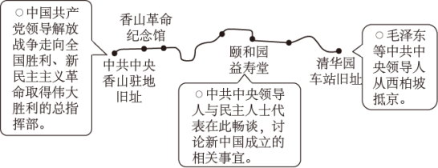
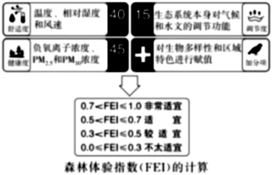
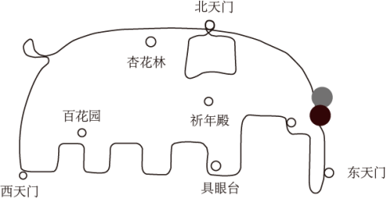
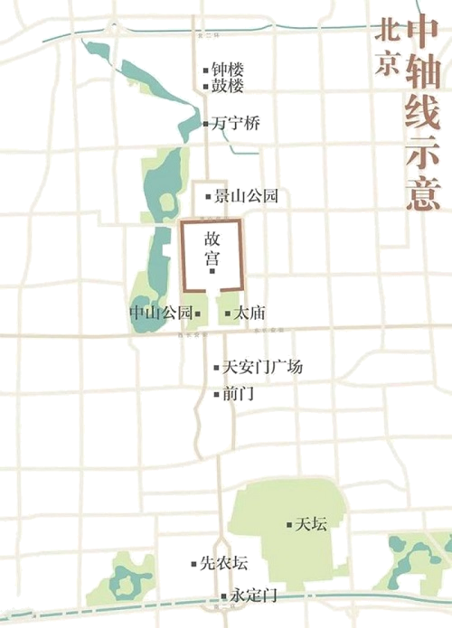

**2023年北京市高考政治试卷**

**一、第一部分，本部分共15题，每题3分，共45分。在每题列出的四个选项中，选出最符合题目要求的一项。**

1\. 红色文化主题游——“进京赶考之路（北京段）”示意图重走“进京赶考之路”，是追忆也是洗礼，其意义在于（ ）

①感受社会主义建设新征程的开启

②感悟共产党人“赶考”的清醒与坚定

③了解生产关系的根本性改变

④不忘初心，汲取前行力量

A. ①② B. ①③ C. ②④ D. ③④

2\. 在习近平新时代中国特色社会主义思想引领下，京津冀协同发展不断书写新篇章。

<table style="width:68%;">
<colgroup>
<col style="width: 68%" />
</colgroup>
<thead>
<tr>
<th style="text-align: left;">
三场京津冀协同发展座谈会，看中国的京津冀，看京津冀里的中国。

◇2014年第一次座谈会召开之际，中国经济发展进入新常态。座谈会提出要把京津冀协同发展上升为国家战略。

◇2019年第二次座谈会召开之际，我国社会主要矛盾已发生了事关全局的历史性变化，此次座谈会重点指向的正是解决发展不平衡不充分问题。

◇2023年第三次座谈会召开之际，新时代进入新征程。此次座谈会明确“努力使京津冀成为中国式现代化建设的先行区，示范区”。
</th>
</tr>
</thead>
<tbody>
</tbody>
</table>

对此，下列认识正确的是（ ）

①时代变迁，认识发展，生产方式和社会发展是精神运动的载体

②因时而动，循势而往，京津冀规划与国家发展进步同频共振

③规划引领，区域协同，运用创新精神推动规划与发展的矛盾转化

④先行示范，服务全局，以局部的大胆探索服务于整体的统筹发展

A. ①③ B. ①④ C. ②③ D. ②④

3\. 从2023年3月23日起，北京市园林绿化局联合市气象局正式发布森林体验指数，公众出游时可据此选择心仪的游憩目的地。

这一做法（ ）

A. 将繁多的数据变成简明的指数，说明人的实践具有主观能动性

B. 服务于公众的旅游感受，表明感性认识是理性认识的目标

C. 优化了城市森林空间布局，提升了林地、湿地的生态价值

D. 提供了差异化的基本公共服务，助力创造公众的高品质生活

4\. 大象跑、蘑菇跑、小怪兽跑……这些有趣的名字其实是热门跑步线路。在天坛公园，跑步者沿着特定线路，奔跑于古建筑之间，应用程序轨迹图上就会逐渐出现一只吉祥的“大象”，引来众多跑步者“打卡”。这一现象说明（ ）

①体育运动可以借助科技手段增加文化意蕴

②不同文化资源的融通可以丰富精神文化供给

③经济对文化实践和文化生活具有支配作用

④体育运动已成为传播传统文化的主要途径

A. ①② B. ①③ C. ②④ D. ③④

5\. “人见佳山水，辄曰‘如画’，见善丹青，辄曰‘逼真’。”清代画家王鉴的这句话道出了人们对美好事物的审美体验。可见，“如画”与“逼真”（ ）

A. 是对现实的描绘和升华，实现了思维和存在的同一

B. 表明事物的存在受到主体认识和体验的制约

C. 说明观念可以无限趋近于客观现实

D. 反映了山水与丹青的联系具有“人化”特点

6\. 画好一幅植物博物画，不仅需要精湛的绘画技艺，还需要长时间的细致观察，将所绘植物最鲜明的物种特征表现出来，植物博物画的创作（ ）

A. 以逆向思维消除了物与画之间的差别

B. 是在思维具体中复制了植物直观整体表象

C. 通过超前思维展现了植物完整生长过程

D. 体现了抽象思维和形象思维的辩证统一

7\. 2023年4月，“中国首次火星探测火星全球影像图”发布。借助这批影像，国际天文联合会根据相关规则，以中国的历史文化名村名镇命名了火星上的22个地理实体，杨柳青、古田、周庄、漠河等中国地名“刻印”在火星大地，基于上述材料，下列三段论推理违反“同一律”要求的是（ ）

A. 所有的文化名镇都在地球，有的杨柳青是文化名镇，所以，所有的杨柳青都在地球

B. 古田是历史名镇，古田是火星地理实体，所以有的火星地理实体是历史名镇

C. 有的周庄不是地球地名，有的火星地名不是周庄，所以有的火星地名是地球地名

D. 地球上的漠河是地名，火星上的漠河是地名，所以火星上的漠河是地球上的漠河

8\. 走路时留意观察路边井盖成了一位政协委员的“职业病”，“病根”源自一封群众来信，反映一条不长的路上就有多个“骑沿井”（如图），行人走路时容易踩空，存在安全隐患。这位委员把问题提交给有关部门后，得到了积极回应，如今上述问题已得到解决，全市范围内的改造工作也在有序推进。下列认识正确的是（ ）

①人民需要与诉求是政协委员履职的动力来源

②政协委员的中心工作是改善人居环境与城市更新

③政治协商是解决民生痛点难点问题的最后途径

④城市精细化治理成效的提升需要凝聚共识、协商推动

A. ①③ B. ①④ C. ②③ D. ②④

9\. 某居民去办理户政业务，因异地往返不便，一时难以提供相关证明。户籍民警了解到这一情况，主动告知该居民可以采用“个人承诺”的方式先期提交材料，后续由派出所联系有关部门进行核实，最终手续得以顺利完成。

<table style="width:70%;">
<colgroup>
<col style="width: 69%" />
</colgroup>
<thead>
<tr>
<th style="text-align: left;">
北京市户政领域适用“告知承诺制”的情形中，承诺内容如下：

◇申请人所填写的基本信息、提交的所需材料真实、合法、有效、完整。

◇申请人已经知晓告知的全部内容。

◇申请人愿意承担不实承诺的法律责任，以及告知的违诺失信惩戒后果。

◇申请人所作承诺是申请人真实意思的表示。
</th>
</tr>
</thead>
<tbody>
</tbody>
</table>

对上述材料的解读，正确的是（ ）

①申请人明确其承诺为真实的意思表示，体现了民事活动的自愿原则

②申请人承诺失实应承担法律责任，说明权力与责任是相匹配的

③政务信息资源共享渠道畅通，有助于“告知承诺制”的落实

④政府通过“减证”实现了便民利民，践行以人民为中心的思想

A ①② B. ①③ C. ②④ D. ③④

10\.

| 某化工公司发生管道泄漏事故，之后，附近的草莓采摘园主向法院提起诉讼，主张今年草莓歉收系该公司污染土壤所致，请求赔偿。经查，因当地长期过度开采地下水导致土壤层下沉，管道底部缺乏支撑出现裂缝，化学原料泄漏，从而污染了周围土壤。 |
| --------------------------------------------------------------------------------------------------------------- |

对本案分析正确的是（ ）

A. 化学原料泄漏是因不可抗力引起的，化工公司无需承担赔偿责任

B. 化工公司如能证明自己对损害的发生没有过错，则无需承担赔偿责任

C. 化工公司如能证明歉收并非化学原料泄漏所导致，则无需承担赔偿责任

D. 本案符合举证责任倒置情形，草莓采摘园主无需提交合法权益受损的证据

11\. “无救济则无权利。”权利需要得到保护，当发生纠纷时，法律提供了多种救济途径。下列救济途径符合法律规定的是（ ）

A. 某公司营业执照被市场监督管理局吊销，该公司只能向法院提起诉讼

B. 张某与祁某因购车发生纠纷，双方约定了仲裁，张某遂提出仲裁申请

C. 赵某与吴某因子女监护问题发生纠纷，双方约定了仲裁，赵某遂提出仲裁申请

D. 孙某夫妇因离婚财产分割发生纠纷，双方约定了仲裁，故不能向法院提起诉讼

12\. 近年来，我国实体经济第三产业加快发展，内部结构优化，对于做实做强做优实体经济发挥了重要作用。如图为我国实体经济第三产业内部的部分行业增加值所占比重的变化。

注：租赁和商务服务业包括企业管理服务、法律服务、咨询与调查、机械设备租赁、汽车租赁、计算机及通信设备租赁等。

据此推断正确的是（ ）

A. 租赁和商务服务业将会替代批发和零售业

B. 对住宿和餐饮业的服务需求量呈现下降趋势

C. 部分现代服务业增加值的增速高于实体经济第三产业

D. 第三产业内部的行业结构变化使产业劳动密集程度提高

13\. 公共数据是各级党政机关、企事业单位依法履职或提供公共服务过程中产生的数据类型，具有权威性、基础性、可控性、公益性等特点。“取之于民，用之于民”，北京市公共数据开放平台已向社会开放了大量公共数据。下列认识正确的是（ ）

①企业可利用公共数据提高劳动生产率

②开放公共数据会降低数据资源的价值

③公共数据要素的价值是由政府决定的

④将公共数据交由市场提供会出现供给不足

A. ①③ B. ①④ C. ②③ D. ②④

14\. 数字经济时代，数据安全的保护日益重要。

<table style="width:60%;">
<colgroup>
<col style="width: 59%" />
</colgroup>
<thead>
<tr>
<th style="text-align: left;">
◇中国规定关键信息基础设施的运营者在境内运营中收集和产生的个人信息和重要数据应当在境内存储；网络运营者应当对其收集的用户信息严格保密，并建立健全用户信息保护制度。

◇欧盟规定数据的控制者、处理者应该采取适当的措施防止数据泄露，如果发生泄露应及时告知监管机构，监管机构可以对违规行为处以罚款。
</th>
</tr>
</thead>
<tbody>
</tbody>
</table>

加强数据安全保护（ ）

①将导致科技企业成本的增加，扭转经济全球化趋势

②是因为国家安全利益是国家的最高利益，数据安全事关国家安全

③需要平衡处理技术进步、经济发展与保护国家安全和社会公共利益的关系

④需要在全球数据安全领域的国际合作中发挥欧盟等国际组织的主导作用

A. ①③ B. ①④ C. ②③ D. ②④

15\. “长安复携手，丝路启新程。”中吉乌公路、中塔公路、中哈原油管道、中国一中亚天然气管道是今天的“丝路”，货运列车和直飞航班是当代的“驼队”……从2013年提出共建“丝绸之路经济带”倡议到2023年召开中国一中亚峰会，中国同中亚国家的关系进入一个崭新时代。这是因为，中国与中亚国家（ ）

①有着深厚历史渊源、广泛的现实需求、坚实的民意基础

②和平合作、开放包容、互学互鉴、互利共赢

③同为发展中国家，有结盟的利益诉求

④共同建立起了适应国际力量对比新变化的全球治理体系

A. ①② B. ①④ C. ②③ D. ③④

**二、第二部分，本部分共5题，共55分。**

16\. 诗歌，是诗题和诗句的统一体，“先赋诗”和“先立题”分别代表了两种不同的创作路径。有些诗歌是即兴而作，诗人有感而发，赋诗之后再为其立一标题，有的诗歌则是因题而起，诗人先定立诗题，然后围绕题目构思诗歌的格律和内容，无论是“先赋诗而后立题”，抑或“先立题而后赋诗”，最终都指向诗题与诗句的契合。

从哲学角度，分析“赋诗”和“立题”的关联。

17\. “儿童散学归来早，忙趁东风放纸鸢。”北京扎燕风筝以燕子为造型，通过拟人化的手法，创造出一个和谐的燕子家族——肥燕、瘦燕、比翼燕、半瘦燕、小燕、雏燕，具有独特的文化魅力。

许多人致力于扎燕风筝文化的传承与创新，其中王某独创的雏燕风筝广受欢迎。

◇在学校的劳动课上，有老师使用王某的作品讲解风筝的画法和扎法，在老师的悉心指导下，每个同学都制作了自己的“雏燕”。

◇一直致力于推广扎燕风筝文化的张某购买了王某最新版雏燕风筝，将其拆解后又重新组装，并将这一过程拍成视频在网络上发布，引发网友广泛关注，吸引了很多人加入到扎燕风筝的创作中来。但有人指出，这样将别人独创的风等公开讲解，可能涉嫌侵犯著作权。

结合材料，运用《法律与生活》知识，谈谈在中华优秀传统文化传承与创新中，法律规定著作权并对其加以限制的意义。

18\. 北京中轴线文化遗产，是指北端为北京鼓楼、钟楼，南端为永定门，纵贯北京老城，全长7.8千米，由古代皇家建筑、城市管理设施和居中历史道路、现代公共建筑和公共空间共同构成的城市历史建筑群。

为推进中轴线申遗工作，北京市人大常委会组织开展了一系列活动：

<table style="width:61%;">
<colgroup>
<col style="width: 61%" />
</colgroup>
<thead>
<tr>
<th style="text-align: left;">
【调研活动】

◇查看皇史宬文物展示陈列和腾退修缮、钟鼓楼展览陈列、钟鼓楼周边环境整治、万宁桥本体保护及周边环境整治等情况，随行听取相关部门工作汇报。

◇赴正阳门、前门大街和永定门，视察《北京中轴线文化遗产保护条例》实施情况，听取市文物局、市文旅局、东城区和西城区相关部门负责同志现场汇报。

【代表之声】

代表1：建议注重文物的活化利用，让历史文化与现代生活融为一体。

代表2：中轴线申遗工作复杂、难度大，建议注意协调好遗产保护中公共利益和周边居民个人利益的关系。

代表3：希望继续加强对中轴线申遗的宣传推广，通过多种方式让群众了解中轴、体验中轴、热爱中轴，弘扬优秀传统文化。

……
</th>
</tr>
</thead>
<tbody>
</tbody>
</table>

（1）结合材料，分析市人大在中轴线申遗过程中所发挥的作用。

（2）从法治角度谈谈如何协调好文化遗产保护中公共利益和个人利益的关系。

为体验中轴线的可及之美，某学校设计了一系列研学线路，其中“中轴线古树之旅”考察了分布在故宫、景山等10处区域的古树名木，既能亲近自然又能感受历史，获得了全校好评。

一位学生也希望设计一条“好评”线路，于是对照“中轴线古树之旅”规划了一条“中轴线骑行之旅”，从永定门出发，骑车一路向北，途经正阳门、故宫、景山、万宁桥、钟楼。指导老师建议，应将交通的便捷性和沿途的安全风险考虑在内，才能有效提升体验感。

（3）运用《逻辑与思维》知识，识别材料中学生所运用的推理类型，并结合材料谈谈如何更好地发挥该推理类型的思维功能。

19\. 党的二十大报告指出，要增强国内大循环内生动力和可靠性，提升国际循环质量和水平。

【读数看优势】经过改革开放40多年的发展，我国已拥有14亿多人口，4亿多中等收入群体，全国居民年人均可支配收入近3.7万元。我国有近9亿劳动力，接受高等教育的人口已超过2.4亿，每年新增劳动力超过1500万，新增劳动力平均受教育年限达到14年。

（1）根据材料，运用《经济与社会》知识，概括我国的市场优势，并分析这些优势如何推动国内大循环。

【开放促循环】2022年北京地区进出口总值比上年增长19.7%；实际利用外商直接投资比上年增长12.7%，其中科学研究和技术服务业增长18.0%；对外直接投资比上年增长5.3%；专利授权量比上年增长2.0%。北京自由贸易试验区作为深化改革开放的试验田，自成立以来，采取了多项措施促进北京对外经济发展：

| 便利贸易投资 | 简化进出口货物通关流程；实行国际贸易单一窗口服务模式，实现口岸管理相关部门之间信息共享、监管互认、执法互助……                                              |
|:------ |:---------------------------------------------------------------------------------------------------- |
| 驱动科技创新 | 为高层次人才、创新创业人才购买和租赁住房、医疗保障、出入境等提供便利；支持符合条件的具有境外职业资格的专业人才从事专业服务；财政对入驻园区的高新技术等优质企业分档给予奖励；鼓励跨国公司设立研发中心…… |

（2）结合材料，运用《当代国际政治与经济》知识，分析北京自由贸易试验区的上述措施如何助力国际循环。

20\. 战略问题是一个政党、一个国家的根本性问题。

在党的二十大报告中，多次强调“战略”：“中华民族伟大复兴战略全局”“全面建成社会主义现代化强国，总的战略安排是分两步走”“保持战略定力”“新的战略机遇”“作出科学完整的战略部署”“采取一系列战略性举措”……

把握大趋势、下好“先手棋”，正是战略上的前瞻性思考，使我国在面对不确定性因素时能应对自如。

<table style="width:41%;">
<colgroup>
<col style="width: 40%" />
</colgroup>
<thead>
<tr>
<th style="text-align: left;">
我国的一系列重要战略：

◆科教兴国战略。

◆创新驱动发展战略。

◆乡村振兴战略。

◆……
</th>
</tr>
</thead>
<tbody>
<tr>
<td style="text-align: left;">
我国发展的诸多战略性有利条件：

◆中国共产党的坚强领导。

◆中国特色社会主义制度的显著优势。

◆持续快速发展积累的坚实基础。

◆长期稳定的社会环境。

◆自信自强的精神力量。
</td>
</tr>
</tbody>
</table>

以材料中的一个重要战略为例，综合运用所学，分析上述战略性有利条件在全面建设社会主义现代化国家中是如何发挥作用的。
