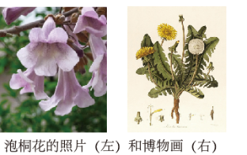
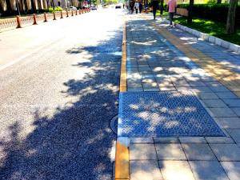
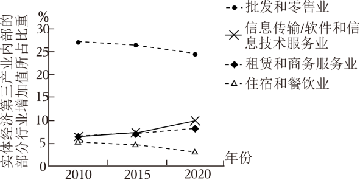

**2023年北京市高考政治试卷**

**一、第一部分，本部分共15题，每题3分，共45分。在每题列出的四个选项中，选出最符合题目要求的一项。**

1\. 红色文化主题游——“进京赶考之路（北京段）”示意图重走“进京赶考之路”，是追忆也是洗礼，其意义在于（ ）

①感受社会主义建设新征程的开启

②感悟共产党人“赶考”的清醒与坚定

③了解生产关系的根本性改变

④不忘初心，汲取前行力量

A. ①② B. ①③ C. ②④ D. ③④

【答案】C

【解析】

【详解】①：2021年，我国全面开启建设社会主义现代化国家新征程，①不符合题意。

②④：重走“进京赶考之路”，重温解放战争、新民主主义革命、新中国成立的历史，感悟共产党人“赶考“的清醒与坚定，有利于不忘初心，汲取前行力量，②④符合题意。

③：“进京赶考之路”中，生产关系没有根本性改变，③不符合题意。

故本题选C。

2\. 在习近平新时代中国特色社会主义思想引领下，京津冀协同发展不断书写新篇章。

<table style="width:68%;">
<colgroup>
<col style="width: 68%" />
</colgroup>
<thead>
<tr>
<th style="text-align: left;">
三场京津冀协同发展座谈会，看中国的京津冀，看京津冀里的中国。

◇2014年第一次座谈会召开之际，中国经济发展进入新常态。座谈会提出要把京津冀协同发展上升为国家战略。

◇2019年第二次座谈会召开之际，我国社会主要矛盾已发生了事关全局的历史性变化，此次座谈会重点指向的正是解决发展不平衡不充分问题。

◇2023年第三次座谈会召开之际，新时代进入新征程。此次座谈会明确“努力使京津冀成为中国式现代化建设的先行区，示范区”。
</th>
</tr>
</thead>
<tbody>
</tbody>
</table>

对此，下列认识正确的是（ ）

①时代变迁，认识发展，生产方式和社会发展是精神运动的载体

②因时而动，循势而往，京津冀规划与国家发展进步同频共振

③规划引领，区域协同，运用创新精神推动规划与发展的矛盾转化

④先行示范，服务全局，以局部的大胆探索服务于整体的统筹发展

A. ①③ B. ①④ C. ②③ D. ②④

【答案】D

【解析】

【详解】①：人脑是思维或精神运动的载体，①说法错误。

②：因时而动，循势而往，强调京津冀规划能根据国家发展进步而定，体现了发挥主观能动性与尊重客观规律的结合，因此京津冀规划与国家发展进步同频共振，②符合题意。

③：规划与发展不是矛盾关系，③不符合题意。

④：先行示范，服务全局，以局部的大胆探索服务于整体的统筹发展，京津冀的发展服务整个中国式现代化发展，④符合题意。

故本题选D。

3\. 从2023年3月23日起，北京市园林绿化局联合市气象局正式发布森林体验指数，公众出游时可据此选择心仪游憩目的地。

这一做法（ ）

A. 将繁多的数据变成简明的指数，说明人的实践具有主观能动性

B. 服务于公众的旅游感受，表明感性认识是理性认识的目标

C. 优化了城市森林空间布局，提升了林地、湿地的生态价值

D. 提供了差异化基本公共服务，助力创造公众的高品质生活

【答案】A

【解析】

【详解】A：北京市园林绿化局联合市气象局正式发布森林体验指数，是将繁多的数据变成简明的指数，说明人的实践具有主观能动性，故A符合题意。

B：感性认识是认识的初级阶段，理性认识是认识的高级阶段，感性认识有待于发展、深化为理性认识，理性认识依赖于感性认识。“感性认识是理性认识的目标”说法错误，B排除。

C：发布森林体验指数，只是对客观的反映，并不能优化城市森林空间布局，C排除。

D：应提供均等化的基本公共服务，而不是差异化的基本公共服务，D错误。

故本题选A。

4\. 大象跑、蘑菇跑、小怪兽跑……这些有趣的名字其实是热门跑步线路。在天坛公园，跑步者沿着特定线路，奔跑于古建筑之间，应用程序轨迹图上就会逐渐出现一只吉祥的“大象”，引来众多跑步者“打卡”。这一现象说明（ ）

①体育运动可以借助科技手段增加文化意蕴

②不同文化资源的融通可以丰富精神文化供给

③经济对文化实践和文化生活具有支配作用

④体育运动已成为传播传统文化的主要途径

A. ①② B. ①③ C. ②④ D. ③④

【答案】A

【解析】

【详解】①②：在天坛公园，跑步者沿着特定线路，奔跑于古建筑之间，应用程序轨迹图上就会逐渐出现一只吉祥的“大象”，引来众多跑步者“打卡”，可看出体育运动可以借助科技手段增加文化意蕴，不同文化资源的融通可以丰富精神文化供给，①②符合题意。

③：材料没有强调经济对文化的作用，③不符合题意。

④：文化传播的主要途径有商业活动、教育、人口迁徙等，体育运动已成为传播传统文化的主要途径说法不对，④说法错误。

故本题选A。

5\. “人见佳山水，辄曰‘如画’，见善丹青，辄曰‘逼真’。”清代画家王鉴的这句话道出了人们对美好事物的审美体验。可见，“如画”与“逼真”（ ）

A. 是对现实的描绘和升华，实现了思维和存在的同一

B. 表明事物的存在受到主体认识和体验的制约

C. 说明观念可以无限趋近于客观现实

D. 反映了山水与丹青的联系具有“人化”特点

【答案】A

【解析】

【详解】A：人见佳山水，辄曰“如画”，见善丹青，辄曰“逼真”，大致的意思是，人们看到壮丽山水，会说像画一样美；看到美丽的画画，会说，画的跟真的一样棒，可见“如画”与“逼真”体现了意识是对物质的反映，是对是对现实的描绘和升华，实现了思维和存在的同一，A正确。

B：错误，事物的存在是客观的，不会受到主体认识和体验的制约，B错误。

C：错误，观念可以反映客观现实，C排除。

D：材料讲的山水和丹青都是客观事物，不涉及山水与丹青的联系，D排除。

故本题选A。

6\. 画好一幅植物博物画，不仅需要精湛的绘画技艺，还需要长时间的细致观察，将所绘植物最鲜明的物种特征表现出来，植物博物画的创作（ ）

A. 以逆向思维消除了物与画之间的差别

B. 是在思维具体中复制了植物直观的整体表象

C. 通过超前思维展现了植物的完整生长过程

D. 体现了抽象思维和形象思维的辩证统一

【答案】D

【解析】

【详解】A：逆向思维是反向求索，是与原来的思路相反的思路，材料没有体现，A不符合题意。

B：思维具体是在理性认识的层次上反映事物具体整体的认识，感性具体是对事物的直观的整体表象，B说法错误。

C：超前思维是判断事物未来发展趋势的思维形态，材料没有体现，C不符合题意。

D：画好一幅植物博物画，需要长时间的细致观察，运用形象思维概括植物的形象特征，还要将所绘植物最鲜明的物种特征表现出来，运用抽象思维抽象和概括事物的本质和规律，D符合题意。

故本题选D。

7\. 2023年4月，“中国首次火星探测火星全球影像图”发布。借助这批影像，国际天文联合会根据相关规则，以中国的历史文化名村名镇命名了火星上的22个地理实体，杨柳青、古田、周庄、漠河等中国地名“刻印”在火星大地，基于上述材料，下列三段论推理违反“同一律”要求的是（ ）

A. 所有的文化名镇都在地球，有的杨柳青是文化名镇，所以，所有的杨柳青都在地球

B. 古田是历史名镇，古田是火星地理实体，所以有的火星地理实体是历史名镇

C. 有的周庄不是地球地名，有的火星地名不是周庄，所以有的火星地名是地球地名

D. 地球上的漠河是地名，火星上的漠河是地名，所以火星上的漠河是地球上的漠河

【答案】D

【解析】

【详解】同一律要求人们：在同一思维过程中，每一思想必须保持自身同一性，不能混淆概念，也不能转移论题。故意违反同一律的要求，所犯的逻辑错误叫作“偷换概念”或“偷换论题”。

A：杨柳青是小项，在前提中不周延，在结论中周延，违反三段论推理规则，犯了小项不当扩大的错误，但没有违反“同一律”要求，A排除。

B：“古田是历史名镇”中的“古田”是地球上的地名，“古田是火星地理实体”中的“古田”是火星上的地名，这个三段论推理犯了“四概念”的错误，但没有违反“同一律”要求，B排除。

C：两个否定的前提不能必然推出结论。结论为否定，当且仅当，前提中有一否定。该选项两个前提都是否定，违反三段论推理规则，但没有违反“同一律”要求，C排除。

D：火星上的漠河是火星上的一个地理实体的名称，地球上的漠河是地球上的一个地理实体的名称，此漠河非彼漠河，将两个不同概念的地理实体等同，犯了“偷换概念”的逻辑错误，违反了“同一律”要求，D正确。

故本题选D。

8\. 走路时留意观察路边井盖成了一位政协委员的“职业病”，“病根”源自一封群众来信，反映一条不长的路上就有多个“骑沿井”（如图），行人走路时容易踩空，存在安全隐患。这位委员把问题提交给有关部门后，得到了积极回应，如今上述问题已得到解决，全市范围内的改造工作也在有序推进。下列认识正确的是（ ）

①人民的需要与诉求是政协委员履职的动力来源

②政协委员的中心工作是改善人居环境与城市更新

③政治协商是解决民生痛点难点问题的最后途径

④城市精细化治理成效的提升需要凝聚共识、协商推动

A. ①③ B. ①④ C. ②③ D. ②④

【答案】B

【解析】

【详解】①④：政协委员将人民群众所反映的问题提交给有关部门，问题得到解决，说明人民的需要与诉求是政协委员履职的动力来源，全市范围内的改造工作也在有序推进，说明城市精细化治理成效的提升需要凝聚共识、协商推动，①④正确。

②：人民政协作为统一战线组织，它的任务就是最广泛地团结联系各方面人士，聚焦党和国家中心任务，把协商民主贯穿政治协商、民主监督、参政议政全过程，履行政治协商、民主监督、参政议政职能，更好凝聚共识，中心工作并非改善人居环境与城市更新，②错误。

③：解决民生痛点难点问题的途径有多个，除了政治协商，还有申诉、投诉、诉讼等多种途径，“最后途径”说法错误，③不选。

故本题选B。

9\. 某居民去办理户政业务，因异地往返不便，一时难以提供相关证明。户籍民警了解到这一情况，主动告知该居民可以采用“个人承诺”的方式先期提交材料，后续由派出所联系有关部门进行核实，最终手续得以顺利完成。

<table style="width:70%;">
<colgroup>
<col style="width: 69%" />
</colgroup>
<thead>
<tr>
<th style="text-align: left;">
北京市户政领域适用“告知承诺制”的情形中，承诺内容如下：

◇申请人所填写的基本信息、提交的所需材料真实、合法、有效、完整。

◇申请人已经知晓告知的全部内容。

◇申请人愿意承担不实承诺的法律责任，以及告知的违诺失信惩戒后果。

◇申请人所作承诺是申请人真实意思的表示。
</th>
</tr>
</thead>
<tbody>
</tbody>
</table>

对上述材料的解读，正确的是（ ）

①申请人明确其承诺为真实的意思表示，体现了民事活动的自愿原则

②申请人承诺失实应承担法律责任，说明权力与责任是相匹配的

③政务信息资源共享渠道畅通，有助于“告知承诺制”的落实

④政府通过“减证”实现了便民利民，践行以人民为中心的思想

A. ①② B. ①③ C. ②④ D. ③④

【答案】D

【解析】

【详解】①：根据民法，民事主体地位平等，民事活动应当遵循自愿、公平、诚信等原则，但该题是政府的管理，公民和政府不是地位平等的民事主体，①不符合题意。

②：申请人承诺失实应承担法律责任，说明权利与义务是相匹配的，权力与责任指的公权力，②说法错误。

③④：政务信息资源共享渠道畅通，有助于“告知承诺制”的落实，因异地往返不便，一时难以提供相关证明，主动告知该居民可以采用“个人承诺”的方式先期提交材料，政府通过“减证”实现了便民利民，践行以人民为中心的思想，③④符合题意。

故本题选D。

10\.

| 某化工公司发生管道泄漏事故，之后，附近的草莓采摘园主向法院提起诉讼，主张今年草莓歉收系该公司污染土壤所致，请求赔偿。经查，因当地长期过度开采地下水导致土壤层下沉，管道底部缺乏支撑出现裂缝，化学原料泄漏，从而污染了周围土壤。 |
| --------------------------------------------------------------------------------------------------------------- |

对本案分析正确的是（ ）

A. 化学原料泄漏是因不可抗力引起的，化工公司无需承担赔偿责任

B. 化工公司如能证明自己对损害的发生没有过错，则无需承担赔偿责任

C. 化工公司如能证明歉收并非化学原料泄漏所导致，则无需承担赔偿责任

D. 本案符合举证责任倒置情形，草莓采摘园主无需提交合法权益受损的证据

【答案】C

【解析】

【详解】A：化学原料泄露是因当地长期过度开采地下水导致的，不属于不可抗力，故A表述错误。

B：该案属于污染环境，适用无过错侵权，故不需要化工公司证明自己有没有过错，故B表述错误。

C：化工公司如能证明自己的行为与歉收无因果关系，则不需要承担赔偿责任，故C表述正确。

D：本案属于环境污染，符合举证责任倒置情形，但是不意味着草莓采摘园主不提供任何证据，主要证据由化工公司提供，故D表述错误。

故本题选C。

11\. “无救济则无权利。”权利需要得到保护，当发生纠纷时，法律提供了多种救济途径。下列救济途径符合法律规定的是（ ）

A. 某公司营业执照被市场监督管理局吊销，该公司只能向法院提起诉讼

B. 张某与祁某因购车发生纠纷，双方约定了仲裁，张某遂提出仲裁申请

C. 赵某与吴某因子女监护问题发生纠纷，双方约定了仲裁，赵某遂提出仲裁申请

D. 孙某夫妇因离婚财产分割发生纠纷，双方约定了仲裁，故不能向法院提起诉讼

【答案】B

【解析】

【详解】B：仲裁是解决纠纷的有效途径，当事人采用仲裁方式解决纠纷，应当双方自愿，达成仲裁协议。没有仲裁协议，一方申请仲裁的，仲裁委员会不予受理，A符合题意。

A：行政诉讼和行政复议是两个并行的法律救济制度。行政复议是行政机关内部的监督制度，是在行政诉讼之前进行的。而行政诉讼是司法救济，由人民法院作出诉讼裁决，是最终的解决办法，“某公司营业执照被市场监督管理局吊销，该公司只能向法院提起诉讼“表述不准确，B说法错误。

C：《中华人民共和国仲裁法》规定，婚姻、收养、监护、抚养、继承纠纷不能仲裁，C说法错误。

D：依据仲裁法的规定，离婚纠纷不适用仲裁法规定，所以不能申请仲裁解决纠纷，D说法错误。

故本题选B。

12\. 近年来，我国实体经济第三产业加快发展，内部结构优化，对于做实做强做优实体经济发挥了重要作用。如图为我国实体经济第三产业内部的部分行业增加值所占比重的变化。

注：租赁和商务服务业包括企业管理服务、法律服务、咨询与调查、机械设备租赁、汽车租赁、计算机及通信设备租赁等。

据此推断正确的是（ ）

A. 租赁和商务服务业将会替代批发和零售业

B. 对住宿和餐饮业的服务需求量呈现下降趋势

C. 部分现代服务业增加值增速高于实体经济第三产业

D. 第三产业内部的行业结构变化使产业劳动密集程度提高

【答案】C

【解析】

【详解】A：租赁和商务服务业与批发和零售业是实体经济第三产业内部的不同门类行业，不构成替代关系，A不选。

B：在我国实体经济第三产业加快发展、增加值增长的前提下，导致住宿和餐饮业在实体经济第三产业所占比重逐年下降发生的原因，可能是对住宿和餐饮业的服务需求量呈现下降，从而引起住宿和餐饮业增速下降；也可能是对住宿和餐饮业的服务需求量较为平稳或小幅增长，但其他行业增加值增长较快，在实体经济第三产业增加值中的比重迅速提高。因此，B不选。

C：由题干可知，我国实体经济第三产业加快发展、增加值增长，必然有部分现代服务业增加值的增速高于实体经济第三产业增加值的增速，起拉动作用，C入选。

D：批发和零售业、住宿和餐饮业都是劳动密集型行业，信息技术/软件和信息技术服务业、租赁和商务服务业都属于对高素质人才需求较强的人力资本密集型行业。批发和零售业、住宿和餐饮业在我国实体经济第三产业所占比重逐年下降，信息技术/软件和信息技术服务业、租赁和商务服务业所占比重逐年上升，因此，第三产业内部的行业结构变化使产业劳动密集程度下降，D不选。

故本题选C。

13\. 公共数据是各级党政机关、企事业单位依法履职或提供公共服务过程中产生的数据类型，具有权威性、基础性、可控性、公益性等特点。“取之于民，用之于民”，北京市公共数据开放平台已向社会开放了大量公共数据。下列认识正确的是（ ）

①企业可利用公共数据提高劳动生产率

②开放公共数据会降低数据资源的价值

③公共数据要素的价值是由政府决定的

④将公共数据交由市场提供会出现供给不足

A. ①③ B. ①④ C. ②③ D. ②④

【答案】B

【解析】

【详解】①：北京市公共数据开放平台已向社会开放了大量公共数据，公共数据具有权威性、基础性、可控性等特点。企业可利用公共数据提高自己的劳动生产率，①正确。

②：开放公共数据不会降低数据资源的价值，可以更好实现其社会价值，②排除。

③：社会必要劳动时间决定价值。公共数据要素的价值不是由政府决定的，③排除。

④：由于公共数据的公益性特点，没有营利性，因此将公共数据交由市场提供会出现供给不足，④正确。

故本题选B。

14\. 数字经济时代，数据安全保护日益重要。

<table style="width:60%;">
<colgroup>
<col style="width: 59%" />
</colgroup>
<thead>
<tr>
<th style="text-align: left;">
◇中国规定关键信息基础设施的运营者在境内运营中收集和产生的个人信息和重要数据应当在境内存储；网络运营者应当对其收集的用户信息严格保密，并建立健全用户信息保护制度。

◇欧盟规定数据的控制者、处理者应该采取适当的措施防止数据泄露，如果发生泄露应及时告知监管机构，监管机构可以对违规行为处以罚款。
</th>
</tr>
</thead>
<tbody>
</tbody>
</table>

加强数据安全保护（ ）

①将导致科技企业成本的增加，扭转经济全球化趋势

②是因为国家安全利益是国家的最高利益，数据安全事关国家安全

③需要平衡处理技术进步、经济发展与保护国家安全和社会公共利益的关系

④需要在全球数据安全领域的国际合作中发挥欧盟等国际组织的主导作用

A. ①③ B. ①④ C. ②③ D. ②④

【答案】C

【解析】

【详解】①：加强数据安全保护，从短期来看，可能需要科技企业增加研发投入，增加科技企业的成本，但是从长远来看，有利于科技企业赢得消费者的认可，从而促进企业的持续发展，此外加强数据安全保护是顺应经济全球化趋势的，是科技企业的责任，故①表述错误。

②：当今时代，数据安全是国家安全的重要组成部分，加强对数据的保护有利于维护国家安全，从而维护国家利益，故②符合题意。

③：一方面数据作为一种要素对经济发展具有重要作用，在市场经济条件下数据的处理技术也越来越先进，但同时也面临数据泄露的风险，影响国家安全和公共利益，因此加强数据安全保护需要协调好各方面的关系，故③符合题意。

④：需要在全球数据安全领域的国际合作中倡导国际关系民主化，而不是发挥欧盟等国际组织的主导作用，需要用公平公正的全球治理机制来解决这个问题，故④表述错误。

故本题选C。

15\. “长安复携手，丝路启新程。”中吉乌公路、中塔公路、中哈原油管道、中国一中亚天然气管道是今天的“丝路”，货运列车和直飞航班是当代的“驼队”……从2013年提出共建“丝绸之路经济带”倡议到2023年召开中国一中亚峰会，中国同中亚国家的关系进入一个崭新时代。这是因为，中国与中亚国家（ ）

①有着深厚的历史渊源、广泛的现实需求、坚实的民意基础

②和平合作、开放包容、互学互鉴、互利共赢

③同为发展中国家，有结盟的利益诉求

④共同建立起了适应国际力量对比新变化的全球治理体系

A. ①② B. ①④ C. ②③ D. ③④

【答案】A

【解析】

【详解】①②：2013年提出共建“丝绸之路经济带到中国与中亚国家的关系进入一个崭新的时代，原因在于中国与中亚有历史渊源，同时存在共同的国家利益，中国同中亚合作能够促进双方的发展，①②符合题意。

③：我国外交活动的基本立场是独立自主，我国坚持不结盟原则，③表述错误。

④：目前新的全球治理体系尚未建立，④表述错误。

故本题选A。

**二、第二部分，本部分共5题，共55分。**

16\. 诗歌，是诗题和诗句的统一体，“先赋诗”和“先立题”分别代表了两种不同的创作路径。有些诗歌是即兴而作，诗人有感而发，赋诗之后再为其立一标题，有的诗歌则是因题而起，诗人先定立诗题，然后围绕题目构思诗歌的格律和内容，无论是“先赋诗而后立题”，抑或“先立题而后赋诗”，最终都指向诗题与诗句的契合。

从哲学角度，分析“赋诗”和“立题”的关联。

【答案】矛盾就是对立统一，同一性和斗争性是矛盾的基本属性。斗争性是矛盾双方相互排斥、相互对立的属性。“先赋诗”和“先立题”分别代表了两种不同的创作路径；同一性是矛盾双方相吸引、相互联结的属性和趋势，无论是“先赋诗而后立题”，抑或“先立题而后赋诗”，最终都指向诗题与诗句的契合。矛盾双方的对立统一推动事物的运动变化和发展，由此构成事物发展的源泉和动力。诗歌创作要坚持诗题和诗句的有机统一，才能创作出优秀的诗词作品。

【解析】

【分析】背景素材：诗歌创作中“赋诗”和“立题”的关联

考点考查：矛盾的基本属性

能力考查：获取和解读信息、调动和运用知识、描述和阐释事物

核心素养：政治认同、科学精神

【详解】第一步：审设问。明确主体、知识范围、问题限定和作答角度。本题的设问要求为“ 分析‘赋诗’和‘立题’的关联”，属于原因类题型，需要调用哲学的有关知识，结合材料提供的有效信息，分析作答。

第二步：审材料。提取关键词，链接教材知识。

关键词①：先赋诗”和“先立题”分别代表了两种不同的创作路径。有些诗歌是即兴而作，诗人有感而发，赋诗之后再为其立一标题，有的诗歌则是因题而起，诗人先定立诗题，然后围绕题目构思诗歌的格律和内容→可联系矛盾双方的对立性。

关键词②：无论是“先赋诗而后立题”，抑或“先立题而后赋诗”，最终都指向诗题与诗句的契合→可联矛盾双方的同一性。

关键词③：综合整体材料→可联系矛盾双方的对立统一推动事物的运动、变化和发展。

第三步：整合信息，组织答案。注意设问限定以及教材知识与材料信息等相结合。

17\. “儿童散学归来早，忙趁东风放纸鸢。”北京扎燕风筝以燕子为造型，通过拟人化的手法，创造出一个和谐的燕子家族——肥燕、瘦燕、比翼燕、半瘦燕、小燕、雏燕，具有独特的文化魅力。

许多人致力于扎燕风筝文化的传承与创新，其中王某独创的雏燕风筝广受欢迎。

◇在学校的劳动课上，有老师使用王某的作品讲解风筝的画法和扎法，在老师的悉心指导下，每个同学都制作了自己的“雏燕”。

◇一直致力于推广扎燕风筝文化的张某购买了王某最新版雏燕风筝，将其拆解后又重新组装，并将这一过程拍成视频在网络上发布，引发网友广泛关注，吸引了很多人加入到扎燕风筝的创作中来。但有人指出，这样将别人独创的风等公开讲解，可能涉嫌侵犯著作权。

结合材料，运用《法律与生活》知识，谈谈在中华优秀传统文化传承与创新中，法律规定著作权并对其加以限制的意义。

【答案】①法律对知识产权的限制在著作权上包括合理使用和法定许可使用。在特定情形下，使用作品不需要著作人同意，也不必支付使用费，这就是合理使用，在学校的劳动课上，有老师使用王某的作品讲解风筝的画法和扎法，指导每个同学都制作了自己的“雏燕”，这属于合理使用的体现；除非权利人事先声明不许使用，他人可以不经著作权人同意，直接使用著作权人的作品，但应当按照规定支付使用费用，这属于作品的法定许可使用，王某致力于推广扎燕风筝文化，购买了王某最新版雏燕风筝，将其拆解后又重新组装，并将这一过程拍成视频在网络上发布，需要按规定支付相关的使用费用给张某，否则会构成侵权。②对著作权进行的限制的目的不仅在于保护作者的正当权益，更鼓励他们创作的积极性，促进中华优秀传统文化创造性转化与创新性发展；中华优秀传统文化源远流长、博大精深，促进优秀作品的传播与使用，能更好的展示其独特的魅力；更多的人参与到扎燕风筝的创作中来，有利于丰富人们的精神文化生活，增强人们的文化自信，推动经济的发展和人类社会的进步。

【解析】

【分析】背景素材：扎燕风筝文化的传承创新与著作权保护

考点考查：尊重保护知识产权、权利行使注意界限、创造性转化创新性发展

能力考查：获取和解读信息、调动和运用知识、描述和阐释事物

核心素养：政治认同、科学精神、法治意识

【详解】第一步：审设问。明确主体、知识范围、问题限定和作答角度。本题的设问要求为“法律规定著作权并对其加以限制的意义”，限定条件是“在中华优秀传统文化传承与创新中”，本题属于意义类题型，需要调用《法律与生活》的有关知识，结合材料提供的有效信息，从法理依据和扣题分析的角度分析作答。

第二步：审材料。提取关键词，链接教材知识。

关键词①：在学校的劳动课上，有老师使用王某的作品讲解风筝的画法和扎法，在老师的悉心指导下，每个同学都制作了自己的“雏燕”→可联系合理使用的相关知识。

关键词②：张某购买了王某最新版雏燕风筝，将其拆解后又重新组装，并将这一过程拍成视频在网络上发布，引发网友广泛关注，吸引了很多人加入到扎燕风筝的创作中来→可联系法定许可使用的相关知识。

关键词③：北京扎燕风筝具有独特的文化魅力，王某独创的雏燕风筝广受欢迎，每个同学都制作了自己的“雏燕”，吸引了很多人加入到扎燕风筝的创作中来→可联系中华优秀传统文化的传承与创新的相关知识。

第三步：整合信息，组织答案。注意设问限定以及教材知识与材料信息等相结合。

18\. 北京中轴线文化遗产，是指北端为北京鼓楼、钟楼，南端为永定门，纵贯北京老城，全长7.8千米，由古代皇家建筑、城市管理设施和居中历史道路、现代公共建筑和公共空间共同构成的城市历史建筑群。

为推进中轴线申遗工作，北京市人大常委会组织开展了一系列活动：

<table style="width:61%;">
<colgroup>
<col style="width: 61%" />
</colgroup>
<thead>
<tr>
<th style="text-align: left;">
【调研活动】

◇查看皇史宬文物展示陈列和腾退修缮、钟鼓楼展览陈列、钟鼓楼周边环境整治、万宁桥本体保护及周边环境整治等情况，随行听取相关部门工作汇报。

◇赴正阳门、前门大街和永定门，视察《北京中轴线文化遗产保护条例》实施情况，听取市文物局、市文旅局、东城区和西城区相关部门负责同志现场汇报。

【代表之声】

代表1：建议注重文物的活化利用，让历史文化与现代生活融为一体。

代表2：中轴线申遗工作复杂、难度大，建议注意协调好遗产保护中公共利益和周边居民个人利益的关系。

代表3：希望继续加强对中轴线申遗的宣传推广，通过多种方式让群众了解中轴、体验中轴、热爱中轴，弘扬优秀传统文化。

……
</th>
</tr>
</thead>
<tbody>
</tbody>
</table>

（1）结合材料，分析市人大在中轴线申遗过程中所发挥的作用。

（2）从法治角度谈谈如何协调好文化遗产保护中公共利益和个人利益的关系。

为体验中轴线的可及之美，某学校设计了一系列研学线路，其中“中轴线古树之旅”考察了分布在故宫、景山等10处区域的古树名木，既能亲近自然又能感受历史，获得了全校好评。

一位学生也希望设计一条“好评”线路，于是对照“中轴线古树之旅”规划了一条“中轴线骑行之旅”，从永定门出发，骑车一路向北，途经正阳门、故宫、景山、万宁桥、钟楼。指导老师建议，应将交通的便捷性和沿途的安全风险考虑在内，才能有效提升体验感。

（3）运用《逻辑与思维》知识，识别材料中学生所运用的推理类型，并结合材料谈谈如何更好地发挥该推理类型的思维功能。

【答案】（1）市人大行使了监督权，视察《北京中轴线文化遗产保护条例》实施情况，听取市文物局、市文旅局、东城区和西城区相关部门负责同志现场汇报，各个机关分工合作，协调一致地履行职责，使申遗工作协调有序的进行。

（2）在我国，公共利益与个人是相互依赖、相互包含的关系，当二者产生冲突时，应以公共利益为重，从长远看这是对个人利益的最大保护。文化遗产的保护中公共利益和个人利益根本上是一致的，保护好我国的文化遗产，更是对个人利益的保护，但是保护过程中可能会出现个人利益与公共利益冲突的情况，我们要以公共利益为重，促进我国文化遗产的保护。

（3）于是对照“中轴线古树之旅”规划了一条“中轴线骑行之旅”运用了类比推理。\
类比推理的根据越多越好，前提中确认对象的相同或相似属性越多越好，作为类比推理根据的相同属性越接近本质属性，相同属性与推出属性之间的相关程度越高，结论的可靠度程度越高，对照“中轴线古树之旅”规划了一条“中轴线骑行之旅”，从永定门出发，骑车一路向北，途经正阳门、故宫、景山、万宁桥、钟楼，为了更好的找出相似属性。前提中确认的属性不应该有与结论相互排斥的属性，指导老师建议，应将交通的便捷性和沿途的安全风险考虑在内，找出与之排斥的属性，更好的提升体验感。

【解析】

【分析】背景素材：北京中轴线文化遗产

考点考查：人大的职权、法治建设、学会归纳与类比推理

能力考查：获取和解读信息、调度和运用知识、描述和阐述事物

核心素养：政治认同、科学精神

【小问1详解】

第一步：审设问，明确主体、作答范围、问题限定和作答角度。本题属于意义类题型，需要调用我国的根本政治制度的有关知识，结合材料信息分析作答。

第二步：审材料，提取关键词，链接教材知识。

关键词：视察《北京中轴线文化遗产保护条例》实施情况，听取市文物局、市文旅局、东城区和西城区相关部门负责同志现场汇报→可联系教材市人大行使监督权。

第三步：整合信息，组织答案。注意设问限定以及教材知识与材料相结合。

【小问2详解】

第一步：审设问，明确主体、作答范围、问题限定和作答角度。本题属于措施类主观题，需要调用政治与法治的有关知识，结合材料提取信息分析作答。

第二步：审材料，提取关键词，链接教材知识。

关键词：北京中轴线文化遗产，纵贯北京老城，由古代皇家建筑、城市管理设施和居中历史道路、现代公共建筑和公共空间共同构成的城市历史建筑群。→可联系教材公共利益与个人是相互依赖、相互包含的关系，当二者产生冲突时，应以公共利益为重，从长远看这是对个人利益的最大保护。

第三步：整合信息，组织答案。注意设问限定以及教材知识与材料相结合。

【小问3详解】

第一步：审设问，明确主体、作答范围、问题限定和作答角度。本题属于措施类主观题，需要调用学会归纳与类比推理的有关知识，结合材料提取信息分析作答。

第二步：审材料，提取关键词，链接教材知识。

关键词①：对照“中轴线古树之旅”规划了一条“中轴线骑行之旅”→可联系教材运用了类比推理。

关键词②：从永定门出发，骑车一路向北，途经正阳门、故宫、景山、万宁桥、钟楼→可联系教材类比推理的根据越多越好，前提中确认对象的相同或相似属性越多越好，作为类比推理根据的相同属性越接近本质属性，相同属性与推出属性之间的相关程度越高，结论的可靠度程度越高

关键词③：指导老师建议，应将交通的便捷性和沿途的安全风险考虑在内→可联系教材前提中确认的属性不应该有与结论相互排斥的属性。

第三步：整合信息，组织答案。注意设问限定以及教材知识与材料相结合。

19\. 党的二十大报告指出，要增强国内大循环内生动力和可靠性，提升国际循环质量和水平。

【读数看优势】经过改革开放40多年的发展，我国已拥有14亿多人口，4亿多中等收入群体，全国居民年人均可支配收入近3.7万元。我国有近9亿劳动力，接受高等教育的人口已超过2.4亿，每年新增劳动力超过1500万，新增劳动力平均受教育年限达到14年。

（1）根据材料，运用《经济与社会》知识，概括我国的市场优势，并分析这些优势如何推动国内大循环。

【开放促循环】2022年北京地区进出口总值比上年增长19.7%；实际利用外商直接投资比上年增长12.7%，其中科学研究和技术服务业增长18.0%；对外直接投资比上年增长5.3%；专利授权量比上年增长2.0%。北京自由贸易试验区作为深化改革开放的试验田，自成立以来，采取了多项措施促进北京对外经济发展：

| 便利贸易投资 | 简化进出口货物通关流程；实行国际贸易单一窗口服务模式，实现口岸管理相关部门之间信息共享、监管互认、执法互助……                                              |
|:------ |:---------------------------------------------------------------------------------------------------- |
| 驱动科技创新 | 为高层次人才、创新创业人才购买和租赁住房、医疗保障、出入境等提供便利；支持符合条件的具有境外职业资格的专业人才从事专业服务；财政对入驻园区的高新技术等优质企业分档给予奖励；鼓励跨国公司设立研发中心…… |

（2）结合材料，运用《当代国际政治与经济》知识，分析北京自由贸易试验区的上述措施如何助力国际循环。

【答案】（1）市场优势：巨大的国内市场、人均可支配收入上升、劳动者素质提高\
①发挥消费对经济增长的基础性作用，引导需求侧改革，充分发挥我国作为世界最大市场的潜力和作用，构建完整的内需体系，靠自己的强大内需为国内大循环注入强劲动力。②劳动者素质提高，扩大高质量就业，完善收入分配制度，增加居民收入，为扩大消费夯实基础。

（2）①实施更高水平的投资和贸易自由化便利化政策，营造良好的营商环境，促进国际产能合作，培育国际竞争合作和竞争新优势，有利于推动商品、服务、资本等生产要素自由流动，更好利用全球资源和市场。②我国实施创新驱动发展战略，为科技创新、从事科学研究提供政策支持，为创新发展驱动战略提供人才支持，促进国内国际技术交流与合作，实现技术要素优化配置。

【解析】

【分析】背景素材：党的二十大报告

考点考查：《经济与社会》《当代国际政治与经济》的相关知识

能力考查：获取和解读信息、调动和运用知识、描述和阐述事物

核心素养：政治认同、科学精神

【小问1详解】

第一步：审设问。明确主体、知识范围、问题限定和作答角度。

本题的设问要求分析我国的市场优势如何推动国内大循环，需要调用《经济与社会》的有关知识，从措施的角度分析作答。

第二步：审材料。提取关键词，链接教材知识

关键词①：我国已拥有14亿多人口→可联系我国巨大的消费市场，发挥消费对经济增长的基础性作用。

关键词②：全国居民年人均可支配收入近3.7万元、劳动力数量多且有很多高等教育人口→可联系收入和劳动者素质提高，结合我国分配制度促进居民收入提高，发挥对经济的促进作用。

第三步：整合信息，组织答案。注意设问限定以及教材知识与材料、时政信息等相结合。

【小问2详解】

第一步：审设问。明确主体、知识范围、问题限定和作答角度。

本题的设问要求分析北京自由贸易试验区的上述措施如何助力国际循环，需要调用《当代国际政治与经济》的有关知识，从措施的角度分析作答。

第二步：审材料。提取关键词，链接教材知识

关键词①：简化进出口货物通关流程，实行国际贸易单一窗口服务模式→可联系贸易自由化便利化，营造良好的营商环境。

关键词②：为高层次人才提供各方面的便利以及对优质企业给予奖励和鼓励跨国公司设立研发中心等→可联系实施创新驱动发展战略，提供政策支持。

第三步：整合信息，组织答案。注意设问限定以及教材知识与材料、时政信息等相结合。

20\. 战略问题是一个政党、一个国家的根本性问题。

在党的二十大报告中，多次强调“战略”：“中华民族伟大复兴战略全局”“全面建成社会主义现代化强国，总的战略安排是分两步走”“保持战略定力”“新的战略机遇”“作出科学完整的战略部署”“采取一系列战略性举措”……

把握大趋势、下好“先手棋”，正是战略上的前瞻性思考，使我国在面对不确定性因素时能应对自如。

<table style="width:41%;">
<colgroup>
<col style="width: 40%" />
</colgroup>
<thead>
<tr>
<th style="text-align: left;">
我国的一系列重要战略：

◆科教兴国战略。

◆创新驱动发展战略。

◆乡村振兴战略。

◆……
</th>
</tr>
</thead>
<tbody>
<tr>
<td style="text-align: left;">
我国发展的诸多战略性有利条件：

◆中国共产党的坚强领导。

◆中国特色社会主义制度的显著优势。

◆持续快速发展积累的坚实基础。

◆长期稳定的社会环境。

◆自信自强的精神力量。
</td>
</tr>
</tbody>
</table>

以材料中的一个重要战略为例，综合运用所学，分析上述战略性有利条件在全面建设社会主义现代化国家中是如何发挥作用的。

【答案】答案示例：\
以乡村振兴为例——中国共产党坚强领导是实现乡村振兴的根本政治保证，党的全面领导是乡村振兴的根本，因此我们始终毫不动摇坚持党的全面领导；中国特色社会主义制度的显著优势是实现乡村振兴的根本制度保障，在实现乡村振兴的前进征程上，制度优势彰显乡村振兴战略优势，有中国特色社会主义制度保驾护航，我们就有了赢得主动、赢得未来的可靠保障；持续快速发展积累的坚实基础为实现乡村振兴提供物质基础，在产业基础、设施基础、人才基础等方面取得的成绩能够有效激活乡村振兴内生动力；长期稳定的社会环境为实现乡村振兴提供良好客观环境，为实现乡村经济持续快速发展注入强有劲的发展活力，提供强大支撑；自信自强的精神力量为实现乡村振兴的提供不竭精神动力，增强自信自强的精神力量，进一步发扬历史主动精神，保持永不懈怠的精神状态和一往无前的奋斗姿态，我们必将不断谱写新时代中国特色社会主义伟大事业新篇章。

【解析】

【分析】背景素材：战略性有利条件在全面建设社会主义现代化国家中的重要作用

考点考查：中国共产党的领导、中国特色社会主义制度、实现中华民族伟大复兴的中国梦、文化自信等

能力考查：调动和运用知识、描述和阐释事物

核心素养：政治认同、科学精神

【详解】第一步：审设问。明确主体、作答范围、问题限定和作答角度。

本题的设问要求分析上述战略性有利条件在全面建设社会主义现代化国家中是如何发挥作用的，未限定知识点，灵活性较强。具体作答时，先从材料中选择一个重要战略作为逻辑起点，然后再将该战略与战略性有利条件进行融合阐释，最后进行归纳总结。

第二步：审材料。提取关键词，链接教材知识。

关键词①：科教兴国战略、创新驱动发展战略、乡村振兴战略→可联系教育的作用、建设现代化经济体系、推动经济高质量发展等。

关键词②：中国共产党的坚强领导→可联系党的领导地位、新时代中国共产党的历史使命等。

关键词③：中国特色社会主义制度的显著优势→可联系中国特色社会主义制度的地位及优势等。

关键词④：持续快速发展积累的坚实基础、长期稳定的社会环境→可联系我国在社会主义建设中取得成就、中国特色社会主义进入新时代、实现中华民族伟大复兴的中国梦等。

关键词⑤：自信自强的精神力量→可联系文化的力量、坚定文化自信、意识的能动作用、社会意识对社会实践的反作用等。

第三步：整合信息，组织答案。注意教材信息与材料、时政信息相结合。
