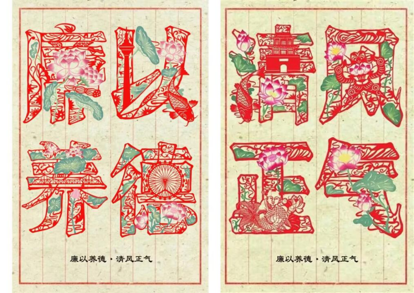
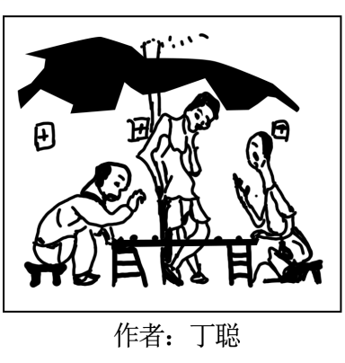

**2023年天津高考政治试卷**

**一、选择题。**

1\. 党的二十大报告强调“中国化时代化的马克思主义行”。中国化时代化的马克思主义贴近国情、贴近时代、贴近人民，回答了中国之问、世界之问、人民之问、时代之问，成为中国共产党能、中国特色社会主义好的理论支撑。强调“中国化时代化的马克思主义行”( )

①彰显了中国共产党人的理论自信

②要求我们不断开辟马克思主义中国化时代化新境界

③意味着中国化时代化的马克思主义是检验真理的标准

④明确中国化时代化的马克思主义是世界各国的行动指南

A. ①② B. ①④ C. ②③ D. ③④

【答案】A

【解析】

【详解】①②：强调“中国化时代化马克思主义行”，充分体现了中国共产党人的理论自信；同时也要求我们不断开辟马克思主义中国化时代化新境界，①②符合题意。

③：实践是检验真理的唯一标准，③错误。

④：要发挥马克思主义的指导作用必须与本国具体实际相结合，中国化时代化的马克思主义符合中国国情，是建设中国特色社会主义的行动指南,④错误。

故本题选A。

【点睛】

2\. “晋江经验”集中体现了习近平总书记推进县域现代化的思路。晋江在福建率先推出居住证制度，在教育就业等方面坚持同城同待遇、保障全覆盖；在发展经济的同时，积极推进文化惠民、让老百姓在家门口享受到丰富多彩的文化生活。晋江的这些做法折射出推进中国式现代化要（ ）

①构建新发展格局

②着力维护和促进社会公平正义

③实现区域优势互补

④坚持物质文明和精神文明协调发展

A. ①② B. ①③ C. ②④ D. ③④

【答案】C

【解析】

【详解】②④：晋江在教育、就业等方面坚持同城同待遇、保障全覆盖，体现了维护和促进社会公平正义；在发展经济的同时，积极推进文化惠民，体现了坚持物质文明和精神文明协调发展。②④符合题意。

①③：题干中没有构建新发展格局和区域协调发展的信息，①③不符合题意。

故本题选C。

【点睛】

3\. 2023年全国两会前夕，代表委员们走进群众收集意见建议，准备议案提案。在广东，杨登辉代表广泛征集建议，笔记本上写满技能人才培养的“金点子”；在河南，马萧林委员把调研重点放在红色遗产保护利用上，积极探索让文物“活”起来的有效方式……代表委员们（ ）

A. 深入基层汇集民意，是全过程人民民主的生动实践

B. 建言献策贡献智慧力量，使议案提案顺利转化为政府决策

C. 解决了群众关心的突出问题，助力党和国家事业兴旺发达

D. 把群众意见化为议案提案，是对国家大事行使决定权的表现

【答案】A

【解析】

【详解】A：杨登辉代表广泛征集建议，笔记本上写满技能人才培养的“金点子”；马萧林委员把调研重点放在红色遗产保护利用上，积极探索让文物“活”起来的有效方式’；这表明代表委员们深入基层汇集民意，是全过程人民民主的生动实践，A符合题意。

B：代表委员们的是向人大和政协提出议案提案，而不是向政府提出议案提案，“使议案提案转化为政府决策”表述不妥，B排除。

C：代表委员们收集意见建议，准备议案提案，还没有解决群众关心的突出问题，“解决了”表述错误，C排除。

D：人民代表大会行使决定权，代表和委员均没有决定权，D表述错误。

故本题选A。

【点睛】

4\. 司法公开是评判一个国家法治水平的重要标准。我国司法机关不断探索司法公开的新方式、新渠道，使人民群众通过政务网站、手机客户端等了解司法、走近司法、评价司法，让司法权在阳光下运行。这表明，司法公开( )

A. 发挥人民监督作用推进公正司法

B. 保证司法程序和司法结果的公正

C. 合理设定司法机关的权力与责任

D. 确保审判权和检察权依法独立行使

【答案】A

【解析】

【详解】A：我国司法机关不断探索司法公开的新方式、新渠道，使人民群众通过政务网站、手机客户端等了解司法、走近司法、评价司法，让司法权在阳光下运行。这表明司法公开有利于发挥人民监督作用推进公正司法，A正确。

B：程序的公正意味着当事人诉讼地位平等、司法过程严格依据诉讼法进行。保证司法程序和司法结果的公正在材料中没有体现，B不符合题意。

C：材料强调司法公开，合理设定司法机关的权力与责任与题意无关，C不符合题意。

D：认为司法公开能够“确保”审判权和检察权依法独立行使的观点过于绝对化，D排除。

故本题选A。

【点睛】

5\. 在与发展中国家的交往合作中，中国始终坚持做实事好事。在莫桑比克，中国帮助培育种植杂交水稻，出产的大米被当地人命名为“好味道”；在墨西哥，中国企业积极资助福利院等公益项目……中国为发展中国家做实事好事( )

A. 有效维护了发展中国家的主权

B. 旨在塑造我国良好的国家形象

C. 提升了中国在国际社会的代表性话语权

D. 展现了推动人类社会共同进步的大国担当

【答案】D

【解析】

【详解】D：中国为发展中国家做实事、好事，展现了中国促进共同发展、为人类作出贡献的负责任大国形象，D正确。

A：题干中不涉及发展中国家主权问题，A不符合题意。

B：中国为发展中国家做实事好事，客观上有利于塑造我国良好的国家形象，但目的是促进世界共同发展，B错误。

C：题干中并未反映中国在国际社会的代表性话语权提升的信息,C不符合题意。

故本题选D。

【点睛】

6\. 近年来，用竹子代替塑料的理念受到广泛认可竹子具有生长快、强度高、可塑性佳、可迅速无害化降解等特点；我国竹子种类丰富，种植业发达。“以竹代塑”理念兼顾生态和经济效益，有助于推动可持续发展。这一理念( )

A. 属于感性认识，还需要不断完善和发展

B. 基于竹子自身优良属性，符合我国的客观实际

C. 具有客观物质性，有利于推动我国竹产业发展

D. 立足已有经验，有利于推动“减塑”实践发展

【答案】B

【解析】

【详解】A：这一理念是理性认识，A不符合题意。

B：物质决定意识，一切从实际出发。“以竹代塑”理念受到广泛认可是因为竹子具有生长快、强度高、可塑性佳等优良属性且我国竹子种类丰富，种植业发达。这一理念符合我国客观实际，B符合题意。

C：这一理念属于意识的范畴，不具有客观物质性，C错误。

D：要立足实际，不能立足已有经验，D错误。

故本题选B。

【点睛】

7\. 怎样进火车站刷票，怎样在机器上挂号等，是一些人可能遇到的“生活挑战”。一位博主切中这些看似不起眼、实则广泛存在的生活需求，制作了系列短视频，收获大量关注与点赞，带来一股正能量。该博主( )

A. 创作的短视频帮助他人实现了人生价值

B. 创作的短视频的价值在于其内容的独特性

C. 将践行社会主义核心价值观外化为自己的物质追求

D. 既满足他人、社会需要，也得到社会对其价值的承认

【答案】D

【解析】

【详解】A：材料中强调的是该博主帮助他人解决生活中遇到的问题，而不是帮助他人实现人生价值，A不符合题意。

B：一事物所具有的能满足主体需要的积极功能和属性。该视频的价值在于通过视频内容满足人们广泛的生活需求，而不是因为视频本身价值独特，B错误。

C：社会主义核心价值观内化为人们的精神追求，外化为人们的自觉行动，C错误。

D：材料中该博主的视频满足了人们广泛的生活需求，并且得到大家点赞和关注，说明实现了个人价值和社会价值的统一，D符合题意。

故本题选D。

【点睛】

8\. 天津某高校面向全国开展清廉主题设计作品征集活动。在作品《剪纸清廉》中，“廉以养德，清风正气”八个汉字以传统剪纸的样式呈现，并融入了杨柳青年画、传统风筝、天津之眼等元素。该艺术创作( )

①展现时代风貌，涵养高尚情操

②丰富艺术内涵，推动认识发展

③融通不同资源，实现艺术创新

④追求社会效益，兼顾经济效益

A. ①② B. ①③ C. ②④ D. ③④

【答案】B

【解析】

【详解】①③：作品《剪纸清廉》以“廉以养德，清久正气”展现了时代风貌，有利于引导人们涵养高尚情操；《剪纸清廉》以传统剪纸的样式呈现，并融入了杨柳青年画、传统风筝、天津之眼等元素，这表明该作品通过融通不同资源，实现了艺术创新，①③符合题意。

②：题干中的作品以传统剪纸的样式呈现清廉文化，丰富了艺术的表现形式，而不是丰富其内涵，②排除。

④：该作品重在追求社会效益，未涉及兼顾经济效益，④不符合题意。

故本题选B。

【点睛】

9\. 中华优秀传统文化源远流长、博大精深。要发挥中华优秀传统文化的当代价值，必须实现创造性转化与创新性发展。下列选项中体现这一要求的是( )

A. 举办全景数字艺术互动展，带领观众沉浸《梵高的世界》

B. 外国游客春节期间在天津逛庙会品美食，体验中国民俗文化

C. 中国诗词大会上“苏东坡数字人”吟诵“小饼如嚼月，中有酥与饴”

D. 古有“雁塔题名”展示书法和荣誉，今有“到此一游”景区胡乱涂鸦

【答案】C

【解析】

【详解】C：中国诗词大会上“苏东坡数字人”吟诵“小饼如嚼月，中有酥与饴”，通过诗词大会让中华优秀传统文化更好的传承发展，体现了优秀传统文化的创造性转化与创新性发展，C符合题意。

A：带领观众沉浸《梵高世界》，是对外来文化的学习，A不符合题意。

B：外国游客春节期间在天津逛庙会品美食，体验中国民俗文化，但没有对中华优秀文化进行创造性转化与创新性发展，B不符合题意。

D：“到此一游”景区胡乱涂鸦体现了某些低素质现象，不属于优秀传统文化的创造性转化与创新性发展，D不符合题意。

故本题选C。

【点睛】

10\. 发展新能源汽车是我国从汽车大国迈向汽车强国的必由之路。新能源汽车是指采用新型动力系统，完全或主要依靠新型能源驱动的汽车“新能源汽车”( )

A. 是“汽车”的种概念

B. 反映了汽车的本质属性

C. 与“汽车”相比，其外延大

D. 与“汽车”的外延不相容

【答案】A

【解析】

【详解】A：新能源汽车概念与汽车概念是种属关系，“新能源汽车”是“汽车”的种概念，A正确。

B：新能源汽车概念揭示了新能源汽车的本质属性，B错误。

C：“新能源汽车”的外延是“汽车”外延的一部分，其外延小于“汽车”的外延，C错误。

D：“新能源汽车”的外延是“汽车”外延的一部分，其外延关系是相容的，D错误。

故本题选A。

【点睛】

11\. “他俩下棋一丁点儿意思也没有，但有几步还挺有趣。”为避免与观棋人犯相同的逻辑错误，在同一思维过程中( )

A. 不能违背排中律，持“两不可”的态度

B. 不能同时肯定论断“A”和论断“非A"

C. 应看到认识对象的复杂多样性及其变化发展

D. 应遵循逻辑规律，克服逻辑矛盾和辩证矛盾

【答案】B

【解析】

【详解】B：合乎逻辑的思维是具有一致性的思维。要避免思维出现不融贯一致的逻辑错误，就要遵循矛盾律的要求。通常用公式“A不是非A”来表示矛盾律的内容。论断“A”和它的否定论断“非 A”不能同真，其中必有一假。“他俩下棋一丁点儿意思也没有，但有几步还挺有趣。”这话反映在同一时间、从同一方面、对同一对象所形成的论断“A”和它的否定论断“非 A”同真，违反了矛盾律， 其逻辑错误叫作“自相矛盾”，B正确。

A：合乎逻辑的思维是具有明确性的思维。逻辑思维反对在“是”与“非”之间骑墙居中，在矛盾关系的论断之间持“两不可”的态度。这就要遵循排中律的要求。通常用公式“A或者非 A”来表示排中律的内容。这个公式的意思是说：在同一时间、从同一方面、对同一对象所形成的论断“A”和“非 A”不能同假，其中必有一真。漫画没有涉及排中律，A排除。

C：漫画强调不能违背矛盾律，不能犯“自相矛盾”的错误。但客观事物是变化发展的，此事物可以变成彼事物。从不同时间、不同方面对同一事物所作的相反论断，并不是自相矛盾的，C排除。

D：思维中出现的自相矛盾不同于唯物辩证法所讲的事物的客观矛盾。矛盾律及其要求是就同一时间、同一方面对同一对象所作的论断而言的，自相矛盾的论断是对客观实际的错误反映。漫画没有涉及辩证矛盾，D排除。

故本题选B。

【点睛】

12\. 周某经营的网店开展限时免单活动，公布规则为付款优先者享受。但在张某购买相关商品且符合免单条件时，周某未给张某免单。对此认识正确的是( )

A. 商品交付前张某已经取得该商品的所有权

B. 周某违约，应当依法承担相应的违约责任

C. 限时免单规则不属于双方约定的合同内容

D. 周某违背诚信原则，应依法承担侵权责任

【答案】B

【解析】

【详解】A：依照法律规定，动产所有权自交付时取得，材料中张某在交付前并未取得商品所有权，A错误。

BC：周某经营的网店开展限时免单活动，并公布相关规则，构成了合同约定，在张某购买相关商品且符合免单条件时，周某未给张某免单，违反了合同约定，应当承担违约责任，故B正确，C错误。

D：周某违背了诚信原则，违反了合同约定，应承担违约责任，该案例不涉及侵权责任，D错误。

故本题选B。

【点睛】

13\. 16周岁的小刘与某保安公司签订书面劳动合同，其中约定：“法定节假日一律不得休假”。今年“五一”来临之前，小刘已经连续工作了一个月有余，计划“五一”期间回家探亲，向单位相关负责人请假未被批准。下列说法正确的是( )

A. 小刘与保安公司签订的劳动合同无效

B. 小刘可以直接向保安公司所在地人民法院起诉

C. 小刘作为劳动者享有法律规定的休息休假的权利

D. 小刘不应享受劳动法规定的对未成年工的特殊劳动保护

【答案】C

【解析】

【详解】A：合同约定：“法定节假日一律不得休假”，符合用人单位免除自己的法定责任、排除劳动者权利的情形，因此该劳动合关于休假部分无效，并不是全部无效，A错误。

B：关于劳动争议须先仲裁再诉讼，不经仲裁不得诉讼，因此小刘不可以直接向法院提起诉讼，B错误。

C：休息休假属于劳动者的合法权利，C符合题意。

D：材料中小刘16周岁，属于未成年人，国家对年满16周岁未满18周岁的未成年人实行特殊劳动保护，D错误。

故本题选C。

【点睛】

**二、阅读题。**

14\. 阅读材料，回答问题

中国千年古县、国家首批全域旅游示范区……蓟州区的“金色名片”一张接一张近年来，蓟州区落实天津市乡村振兴总体决策部署，制定实施“农家院提升改造行动方案”，重点培育发展民宿产业，委托公司实施运营，提高产业品质和文旅消费水平；引导村集体统一利用、开发土地和旅游资源,推行“集体+合作社+农户”等经营模式,使村集体收入迈上一个新台阶。

结合材料，运用《经济与社会》知识，分析蓟州区在推进乡村振兴中是如何作为的。

【答案】①政府履行经济职能，制定行动方案；由公司运营民宿产业，发挥市场机制作用，提升该地旅游产业竞争力。②建立符合市场经济要求的集体经济运行机制，推行“集体+合作社+农户”等模式，发展壮大农村集体经济。

【解析】

【分析】背景材料：蓟州区落实天津市乡村振兴总体决策部署

考点考查：《经济与社会》的相关知识

能力考查：描述和阐释事物      

核心素养：政治认同、科学精神

【详解】第一步：审设问。明确主体、知识范围、问题限定和作答角度。本题属于措施类主观题，可从“如何做”角度作答，知识限定是《经济与社会》的知识，结合材料分析。

第二步：审材料。提取关键词，链接教材知识。

关键词①：蓟州区制定实施农家院提升改造行动方案，重点培育发展民宿产业，委托公司实施运营，提高产业品质和文旅消费水平；→可联系政府履行经济职能和发挥市场机制作用；

关键词②：蓟州区引导村集体统一利用、开发土地和旅游资源，推行“集体+合作社+农户”等经营模式， 使村集体收入迈上一个新台阶。→可联系建立符合市场经济要求的集体经济运行机制，发展壮大农村集体经济。

第三步：整合信息，组织答案。注意设问限定以及教材知识与材料、时政信息等相结合。

【点睛】

15\. 阅读材料，回答问题。

土特产貌似普通，内有乾坤。缺了“土”，产业根基不稳，失去“特”竞争优势不足，没有“产”，发展难以持续。做好“土特产”文章，要立足“土”，善用村里的山水草木、传统手艺等本土资源；突出“特”，既要扎根本地找亮点，还要跳出本地比较周边和全国；形成“产”，从源头种养延伸至加工、包装、销售等多个环节，从深耕一产拓展至三产融合。

结合材料，用联系的观点阐述如何做好“土特产”文章。

【答案】做好“土特产”文章要把握联系的普遍性、多样性、客观性，处理好整体和部分的关系。既要处理好“土”“特”“产”之间的关系，从“土”“特”“产”三个方面共同发力，又要处理好“土”“特”“产”各自内部关系，如要利用好本土固有的自然资源、文化资源优势，要在与周边和全国的比较中突出本地的特色,要形成完整的产业链条,促进乡村全面振兴。

【解析】

分析】背景素材：做好“土特产”文章

考点考查：联系的普遍性、联系的客观性、联系的多样性、整体与部分的辩证关系原理及其方法论要求

能力考查：获取和解读信息、调动和运用知识、描述和阐释事物、论证和探究问题

核心素养：政治认同、科学精神

【详解】第一步：审设问。明确主体、知识范围、问题限定和作答角度。本题的设问要求为“阐述如何做好‘土特产’文章”，属于说明类题型，需要调用“联系”的有关知识，结合材料提供的有效信息，分析作答。

第二步：审材料。提取关键词，链接教材知识。

关键词①：缺了“土”，产业根基不稳，失去“特”竞争优势不足，没有“产”，发展难以持续→可联系:整体与部分的辩证关系。

关键词②：要立足“土”，善用村里的山水草木、传统手艺等本土资源；既要扎根本地找亮点，还要跳出本地比较周边和全国；从源头种养延伸至加工、包装、销售等多个环节，从深耕一产拓展至三产融合→可联系:联系的普遍性、客观性和多样性。

第三步：整合信息，组织答案。注意设问限定以及教材知识与材料信息等相结合。

【点睛】

16\. 阅读材料，回答问题

航空发动机被喻为现代工业“皇冠上的明珠”，是大国重器。为贯彻习近平总书记“加快实现航空发动机及燃气轮机自主研发和制造生产”的动员令，中国航空发动机集团有限公司（简称“中国航发”）实施“铸心”工程，通过形势任务教育、组织生活会等，坚定理想信念，强化使命担当，将党组织的政治优势、组织优势汇聚成事业发展的优势；围绕解决关键核心技术领域“卡脖子”问题，先后组建2700余支党员突击队，推动一批关键核心技术难题取得重大突破，有效提升了航空发动机自主研发能力。

运用《政治与法治》知识，概括中国航发实施“铸心”工程的做法（9分）

【答案】坚持党的集中统一领导，加强党的建设，开展形势任务教育等活动，发挥党对企业的政治领导、思想引领、组织动员作用；组建党员突击队，发挥共产党员的先锋模范作用。

【解析】

【分析】背景素材：中国航发实施“铸心”工程

考点考查：政治与法治

能力考查：获取和解读信息、调动和运用知识、描述和阐述事物

核心素养：政治认同、科学精神

【详解】第一步：审设问，明确主体、作答范围、问题限定和作答角度。本题属于分析说明类主观题，需调用政治与法治的相关知识结合材料有效信息分析作答。

第二步：审材料，提取关键词，链接教材知识。

关键词①：为贯彻习近平总书记“加快实现航空发动机及燃气轮机自主研发和制造生产”的动员令，中国航空发动机集团有限公司实施“铸心”工程，通过形势任务教育、组织生活会等，坚定理想信念，强化使命担当，将党组织的政治优势、组织优势汇聚成事业发展的优势。→可联系教材坚持党的集中统一领导，加强党的建设，开展形势任务教育等活动，发挥党对企业的政治领导、思想引领、组织动员作用。

关键词②：围绕解决关键核心技术领域“卡脖子”问题，先后组建2700余支党员突击队，推动一批关键核心技术难题取得重大突破，有效提升了航空发动机自主研发能力。→可联系教材发挥共产党员的先锋模范作用。

第三步：整合信息，组织答案。注意设问限定以及教材知识与材料、时政信息等相结合。

【点睛】

17\. 阅读材料，回答问题。

科学家们100多年前就提出了许多奔赴外太空的构想，其中包括将多节火箭串联起来，组成一列多级火箭以提高速度。这一构想，如今已成为航天领域的重要应用。另外一个构想是建造一部太空电梯，用电梯把人和物资送往太空，但以什么样的方式和材料建造这个电梯是科学家们仍在探索的课题。

结合材料，从超前思维的角度分析人类奔赴外太空的构想。（答出两点即可）

【答案】多级火箭、太空电梯等构想运用了推理和想象等方法进行超前思维。这些构想为人类奔赴外太空提供多种可能，体现了超前思维的探索性。

【解析】

【分析】背景素材：人类奔赴外太空的构想

考点考查：超前思维

能力考查：获取和解读信息、调动和运用知识、描述和阐释事物

核心素养：政治认同、科学精神

【详解】第一步：审设问。明确主体、知识范围、问题限定和作答角度。本题设问可转化为：从超前思维的角度分析人类奔赴外太空的构想体现了什么道理，有什么意义。

第二步：审材料。提取关键词，链接教材知识。

关键词：将多节火箭串联起来，组成一列多级火箭以提高速度。这一构想，如今已成为航天领域的重要应用。另外一个构想是建造一部太空电梯，用电梯把人和物资送往太空→可联系推理和想象等方法、为人类奔赴外太空提供多种可能，体现了超前思维的探索性；

第三步：整合信息，组织答案。注意设问限定以及教材知识与材料、时政信息等相结合。

点睛】

18\. 阅读材料，回答回题

新时代以来，习近平主席围绕全球安全和发展等问题提出一系列重大倡议和主张，其核心理念是构建人类命运共同体。中国主张：全球治理要守法，要坚定维护以国际法为基础的国际秩序；要积极维护开放型世界经济体制；世界命运应该由各国共同掌握，国际规则应该由各国共同书写，全球事务应该由各国共同治理，发展成果应该由各国共享。

依据材料，运用《当代国际政治与经济》知识，说明中国主张的合理性。

【答案】①遵守国际法有利于维护国际关系稳定。②经济全球化有利于提高资源配置效率，为世界经济发展提供强劲动力。③国际关系民主化是世界和平的重要保证，有利于完善全球治理体系。④符合各国共同利益;符合和平与发展的时代主题。

【解析】

【分析】背景素材：全球安全和发展的中国主张

考点考查：认识国际关系、影响国际关系的决定因素、经济全球化的机遇与挑战、国际关系民主化

能力考查：获取和解读信息、调动和运用知识、描述和阐释事物、论证和探究问题

核心素养：政治认同、科学精神

【详解】第一步：审设问。明确主体、知识范围、问题限定和作答角度。本题的设问要求为“说明中国主张的合理性”，属于说明类题型，需要调用《当代国际政治与经济》的有关知识，结合材料提供的有效信息，分析作答。

第二步：审材料。提取关键词，链接教材知识。

关键词①：全球治理要守法，要坚定维护以国际法为基础的国际秩序→可联系:遵守国际法有利于维护国际关系稳定。

关键词②：要积极维护开放型世界经济体制→可联系:经济全球化有利于提高资源配置效率，为世界经济发展提供强劲动力。

关键词③：世界命运应该由各国共同掌握，国际规则应该由各国共同书写，全球事务应该由各国共同治理，发展成果应该由各国共享→可联系:国际关系民主化是世界和平的重要保证，有利于完善全球治理体系。

关键词④：中国的一系列主张→可联系:符合各国共同利益；符合和平与发展的时代主题。

第三步：整合信息，组织答案。注意设问限定以及教材知识与材料信息等相结合。
