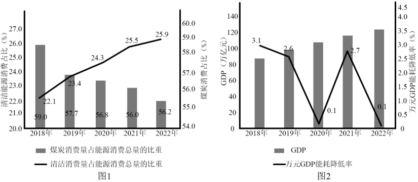

**2023年全省普通高中学业水平等级考试**

**思想政治**

**注意事项:**

**1.答卷前，考生务必将自己的姓名、考生号等填写在答题卡和试卷指定位置。**

**2.回答选择题时，选出每小题答案后，用铅笔把答题卡上对应题目的答案标号涂黑。如需改动，用橡皮擦干净后，再选涂其他答案标号。回答非选择题时，将答案写在答题卡上。写在本试卷上无效。**

**3.考试结束后，将本试卷和答题卡并交回。**

**一、选择题:本题共15小题，每小题3分，共45分。每小题只有一个选项符合题目要求。**

1\. 从马克思恩格斯的“为绝大多数人谋利益”到李大钊的“为大多数人谋幸福”，从毛泽东的“全心全意为人民服务”到习近平的“为民造福”，共产党人始终心怀人民群众，把群众的事一件一件办好。下列表述与材料主旨相同的是（ ）

①人民，只有人民，才是创造世界历史的动力

②人民对美好生活的向往，就是我们的奋斗目标

③尊重人民主体地位，尊重人民首创精神、拜人民为师

④全面小康、摆脱贫困是我们党给人民的交代

A. ①② B. ①③ C. ②④ D. ③④

2\. 2022年，全民健身“热气腾腾”。滑雪、滑冰、冰球，“带动三亿人参与冰雪运动”的愿望已然成为现实；贵州黔东南、福建泉州、河南新乡，乡村篮球赛为乡村振兴注入新力量；骑行、掷飞盘、玩腰旗橄榄球，户外运动蓬勃发展；“全民健身线上运动会”“云走齐鲁”在线健身成为新的生活方式。全民健身的开展可以（ ）

①拓展体育消费场景，促进体育产业转型升级

②增加体育用品支出，推动居民消费结构优化

③丰富体育服务供给，实现城乡公共服务均等化

④赋能乡村文化振兴，推动一二三产业融合发展

A. ①② B. ①④ C. ②③ D. ③④

3\. 图1是2018-2022年我国煤煤和清洁能源消费量占能源消费总量比重变化情况，图2是2018-2022年我国GDP、万元GDP能耗降低率变化情况。据此，下列推断正确的是（ ）

①煤炭消费比重回升说明市场上清洁能源供给量减少

②万元GDP能耗持续降低意味着能源消费总量不断下降

③煤炭和清洁能源消费比重的变化表明能源结构持续优化

④万元GDP能耗降低与GDP增长相协调意味着经济发展更有效率

A. ①② B. ①④ C. ②③ D. ③④

4\. 近年来，我国医保多项改革措施取得显著成效，建成全国统一的医保信息平台，2022年全国跨省异地就医直接结算基金支付809.19亿元；开展国家医保药品目录准入谈判，实现医保用药全国范围基本统一；国家集中采购7批294种药品，平均降价超过50%。关于医保改革，下列传导正确的是（ ）

①异地就医直接结算→提高社会福利水平→提高居民参加医疗保险积极性

②医保药品目录准入谈判→筛选创新药进入目录→提升医保基金使用效能

③统一医保用药范围→增加药品报销种类→满足居民高层次保险需求

④药品集中采购→通过市场化机制以量换价→降低居民医疗负担

A. ①② B. ①③ C. ②④ D. ③④

5\. 某村为推进特色田园综合体建设，成立村民自管组并建立“一问答”制度。自管组由党支部牵头，在广泛征求村民意见的基础上选举产生，负责收集并处理群众的问题和建议，不能处理的由村委会和镇政府出面解决。在各方的共同努力下，特色田园综合体建设取得明显成效。这一成效得益于（ ）

①建立党的基层组织，积极协调各方利益

②完善协同共治机制、提升基层治理能力

③优化基层职权配置，规范政府服务流程

④引导村民有序参与，提高民主协商效率

A. ①③ B. ①④ C. ②③ D. ②④

6\. 齐长城修筑于春秋战国时期，是我国现存有准确遗迹可考、年代最早的长城。2021年9月，山东省J县人民检察院在公益诉讼专项监督活动中发现齐长城遗址的部分区域遭到了破坏，遂向该县文旅局和遗址所在地镇政府分别发出检察建议，在履行监管职责、做好文物保护工作等方面提出建议。2022年9月，山东省人大常委会审议通过《山东省齐长城保护条例》。根据材料，在山东省的齐长城保护工作中（ ）

①人民检察院通过发出检察建议依法进行民主监督

②政府坚持对人民检察院负责，严格执行检察建议

③省人大常委会通过制定地方性法规完善制度保障

④各个国家机关在法治框架内协调一致地履行职责

A. ①② B. ①③ C. ②④ D. ③④

7\. 2023年2月，欧洲议会通过了《2035年欧洲新售燃油轿车和小货车零排放协议》。协议的目标是2035年开始在欧盟27国范围内停售新的燃油轿车和小货车。中国新能源车企纷纷通过投资建厂、品牌收购等方式进一步扩大在欧洲市场布局。据材料，下列说法正确的是（ ）

①欧盟通过实施经济一体化政策推动欧洲绿色发展

②欧洲议会通过行使最高决策权维护欧盟整体利益

③中国新能源车企欧投资建厂有助于克服贸易壁垒

④国际新能源汽车市场竞争加剧不利于全球资源配置

A. ①③ B. ①④ C. ②③ D. ②④

8\. 2022年6月，国际电信联盟第八届世界电信发展大会在卢旺达首都基加利举行，来自100多个国家和地区的千余名代表与会，会议通过了《基加利宣言》和(基加利行动计划》两份文件，呼吁各方加速弥合数字鸿沟，助力落实联合国2030年可持续发展议程。材料表明（ ）

①作为世界性国际组织，国际电信联盟是全球数字治理的重要载体

②数字鸿沟已成为数字时代阻碍发展中国家可持续发展的主要障碍

③国际电信联盟推动国际多边合作以应对全人类面临的共同课题

④《基加利行动计划》为推动南北问题的解决提供了路线图

A. ①② B. ①③ C. ②④ D. ③④

9\. 中国茶是日常生活，也是文化瑰宝。明代许次纾嗜花之品鉴，深谙茶理，他在《茶疏》中写道：“茶滋于水，水藉乎器，汤成于火。四者相须，缺一则废。”这茶理体现了（ ）

①联系是普遍的，要从整体上把握物并实现事物结构与功能的优化

②联系具有多样性，不同的联系构成事物的存在状态和发展趋势

③整体和部分密不可分，整体功能、状态及其变化会影响部分

④真理是具体的，真理和谬误在一定条件下能够相互转化

A. ①② B. ①④ C. ②③ D. ③④

10\. 今年全国两会期间，习近平提起看过的一个关于培养批“一县一业”重点基地的文件:“我看了以后皱了眉头，这个事情不好下指标，一个县是不是光靠一个产业去发展，要去深入调研，不能大笔挥，拨一笔钱，这个地方就专门发展养鸡、发展蘑菇，那个地方专门搞纺织，那样的话肯定要砸锅。”上述材料蕴含的哲理是（ ）

①一切从实际出发是把握规律、做好决策的根本立足点

②只有反映社会存在的产业决策，才对产业发展起积极作用

③正确的产业决策是把革命热情和科学态度相统一的基础

④调研是从感性认识上升到理性认识、形成正确决策的基本条件

A. ①③ B. ①④ C. ②③ D. ②④

11\. 月亮门是中国古典园林中开设在院墙上的园弧形洞门、因其形如一轮满月而得名。月亮门通常与云墙配合使用，在波浪形的云墙上开设门洞，看上去如同月亮在云间穿行。由于寓意美好且形态优美，月亮门的营造案例远传海外。下列理解正确的是（ ）

①月亮门与云瑞给人美的享受是主体活动对客体的积极意义

②人们对团圆的美满期盼通过月亮门的设计造型表达出来

③月亮门的独特魅力吸引国外民众认同中华文化

④实用性与装饰性的对立属性寓于月亮门优美造型的统一属性之中

A. ①② B. ①③

C. ②④ D. ③④

12\. 我们遭遇的风险挑战风高浪急，这些风险挑战既有国内的，也有国际的；既有传统的，也有非传统的。“非弘不能胜其重，非毅无以致其远”，面对风险挑战，唯有顽强拼搏，坚决斗争，才能赢得尊严、求得发展。据材料，下列判断或推理正确的是（ ）

①弘则能胜其重，毅则能致其远

②我们要赢得尊严、求得发展，就必须坚决斗争

③以“有些风险挑战是国内的”为前提，不能进行换质位推理

④“有些风险挑战是传统的"通过换质推理可得出“有些风险挑战不是现代的"

A. ①③ B. ①④ C. ②③ D. ②④

13\. 要构建一个符合推理规则的三段论，其结论为“有些属于国家所有的资源是受野生动物保护法保护的”，由野生动物保护法规定得出的①②③④四个判断中，可分别作为该三段论大前提、小前提的是（ ）

第二条：……本法规定保护的野生动物，是指珍贵、濒危的陆生、水生野生动物和有重要生态、科学、社会价值的陆生野生动物。……

第三条：野生动物资源属于国家所有。……

——————摘自《中华人民共和国野生动物保护法》

①有些受野生动物保护法保护的是珍贵、濒危的陆生野生动物

②珍贵、濒危的水生野生动物是受野生动物保护法保护的

③珍贵、潮危的陆生野生动物是受野生动物保护法保护的

④有些属于国家所有的资源是珍贵、濒危的陆生野生动物

A. ①一④ B. ②-④ C. ①一③ D. ③一④

14\. 甲公司与彭某的劳动合同约定“公司每月为彭某缴纳的社保和公积金，由彭某向公司全额支付补偿，否则暂停发放下月工资”。后彭某不满到手的工资太少，遂又在乙公司兼职销售直播，每晚直播3小时，时段和专勤事宜由乙公司统一安排。据此，下列说法正确的是（ ）

①彭某有权主张与甲公司合同中的“全额支付补偿”条款无效

②甲公司只要发现彭某为乙公司直播，就有权直接解聘彭某

③彭某应与乙公司补签书面劳动合同、双方劳动关系自合同生效之日起建立

④如果甲公司暂停向彭某发放工资，则劳动行政部门有权责令其支付

A ①② B. ①④ C. ②③ D. ③④

15\. 甲公司从乙公司购入一批配件，约定“因本合同发生的一切争议，均由A仲裁委员会仲裁”。后该批配件迟延两个月才交货，且用该批配件生产的甲公司产品造成了数起伤人事故。甲公司召回产品检验后，意外发现配件内部设计使用了自己的发明专利，因此要求乙公司承担侵权责任。乙公司则申请行政主管部门宣告甲公司的专利权无效。据此，下列说法正确的是（ ）

①针对配件迟延交货之事，甲公司无权请求法院判决乙公司承担违约责任

②针对甲公司产品造成的伤人事故，甲公司即使无过错也应向受害人承担责任

③若主管部门作出了专利权无效宣告，甲公司可向法院起诉且需承担举证责任

④即使乙公司申请失败，仍可通过证明自己系独立作出相同发明来实现免责

A. ①② B. ①④ C. ②③ D. ③④

**二、非选择题:本题共5小题，共55分。**

16\. 某校一个学习小组围绕“政务信息公开和个人信息保护”开展探究活动，收集到以下资料。

<table style="width:78%;">
<colgroup>
<col style="width: 78%" />
</colgroup>
<thead>
<tr>
<th style="text-align: center;">
某地保障房主管部门拟公示信息

申请人员个人信息：姓名、身份证号码、电话号码、户籍所在地、家庭人口情况、家庭人均居住建筑面积、家庭人均可支配月收入、申请住房门牌号。

申请结果信息：申请人员的摇号结果、配租结果。

相关法律法规：

《中华人民共和国政府信息公开条例》(2019年4月3日中华人民共和国国务院令第711号修订)第十九条:

“对涉及公众利益调整、需要公众广泛知晓或者需要公众参与决策的政府信息，行政机关应当主动公开。”

《中华人民共和国个人信息保护法》(2021年8月20日第十三届全国人民代表大会常务委员会第三十次会议通过)第五十一条:“个人信息处理者应当……采取下列措施确保个人信息处理活动符合法律、行政法规的规定，并防止……个人信息泄露、篡改、丢失……（三)采取相应的加密、去标识化等安全技术措施。”
</th>
</tr>
</thead>
<tbody>
</tbody>
</table>

结合材料，运用政治与法治、法律与生活知识，就如何处理好政务信息公开和个人信息保护的关系说明你的观点，并阐明理由。

17\. 材料一 基础设施是经济社会发展的重要支撑。中央提出,持续推进重点领域补短板投资，加快交通基础设施建设、完善社会民生基础设施等；系统布局新型基础设施，加快建设信息基础设施、前瞻布局创新基础设施等。

材料二 提前布局、超前部署基础性支撑性的重大科技基础设施，将会为更多的创新和应用场景留足孵化期。作为中央前瞻谋划的重大科技基础设施，北斗经过20多年的发展，从定位导航授时服务出发。一步步孵化出智能穿戴式设备、高精度时空服务等“北斗+”“+北斗”新业态(如下图)。2021年我国卫星导航与位置服务产业总体产值约4700亿元，凸显了重大科技基础设施的创新“溢出”和“杠杆”效应。但是，这类基础设施建设周期比较长，初期往往存在应用场景不丰富、市场规模小等困难。

卫星子航与位置服务业态示意图。

有观点认为，国家应超前开展各类基础设施投资以促进经济发展。结合材料，运用经济与社会、逻辑与思维知识，对该观点进行评析。

18\. 中国精神、中国力量

\[精神家园\]

一部中国史，就是一部各民族交融汇聚成中华民族共同体的历史。在历史演进中各民族形成了生死与共、命运与共的中华民族大家庭；在这里，茶马古道、河西走廊……成为民族团结融合之路；长江、黄河、瓷器、丝绸……成为引发强烈共鸣的中华文化符号和形象。

鸦片战争以后，国家蒙辱、人民蒙难、文明蒙尘，中华民族遭受了前所未有的劫难。面对劫难。各族人民更加深刻地体会到中华各民族一荣俱荣、休戚相关。中国共产党成立后，领导各族人民洗雪耻辱、扭转自身命运，书写了中华民族几千年历史上最恢宏的史诗，迎来了全体中华儿女踔厉奋发、共同创造美好生活的新时代。

（1）习近平指出，“必须构筑中华民族共有精神家园”。结合材料，运用文化传承与文化创新知识，阐述新时代我们应如何构筑中华民族共有精神家园。

\[精神灯塔\]

雷锋精神源于雷锋一人，又系于无数心怀山海的接棒者。60年来，学雷锋活动在全国持续深入开展，一个雷锋带动了一代又一代“雷锋”……

——摘编自《南方日报》

（2）“穿越60年，你和他的青春如此相似”，结合材料，运用矛盾的普遍性和特殊性辩证关系原理谈谈你的认识。

19\. 当好善解矛盾纠纷的行家里手。

\[民声\]

M镇人民调解委员会接到Z村村民张某反映，称邻居谭某故意将几颗果树挪到其承包地紧贴自己家进出的必经之路一侧，树枝阻碍了自己的面包车通行。调解员遂前往调解。

\[走访\]

调解员走坊了谭某，了解到前些年Z村组织土地承包，谭某分到的地正好被进出张某院子的必经之路分割成两半。为说服谭某接受承包方案，时任村主任张某斌代表村委会口头承诺，承包期内每年补偿谭某600元，但从今年初开始，现任村主任张某军不再支付补偿款，谭某多次沟通无果，认为村委会和张某合伙欺负人，自己不能再忍。

调解员又走访了张某、张某军和其他知情人，了解到新情况:去年谭某家杨树的树枝被风刮断，砸坏张某的面包车，张某要求赔偿。谭某认为刮风是自然现象，自己不应为此负责。此后两家再无来往。

结合材料，运用法律与生活知识，完成下列任务：

（1）〖释法〗调解员向谭某、张某和张某军分析了他们各自应承担的民事责任及法律依据。请将分析内容补充完整。

在村委会补偿的纠纷中:① 。

在树枝砸坏车的纠纷中:② 。

在挪树阻碍通行的纠纷中:③ 。

（2）〖化解〗整个调解过程中，除明晰具体法律关系外，调解员和各方当事人还应坚持什么原则才能真正化解矛盾。

调解员:④ 。

各方当事人:⑤ 。

20\. 察势者智，驭势者赢。一百多年来，中国共产党始终站在历史正确的一边，站在人类进步的一边，坚持立足中国、放眼世界，正确认识和处理同世界的关系，团结带领中国人民实现了从落后时代、赶上时代再到引领时代的伟大跨越，显著提升了中国的国际影响力、感召力、塑造力……

结合材料，运用中国特色社会主义，当代国际政治与经济知识，以“在历史前进的逻辑中前进”为主题撰写一篇短评。

要求:①围绕主题，观点明确:②论证充分，逻辑清晰:③学科术语使用规范:④总字数在250字左右。
