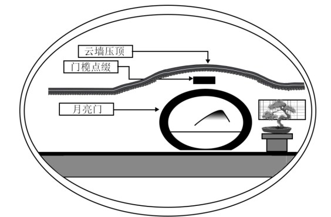
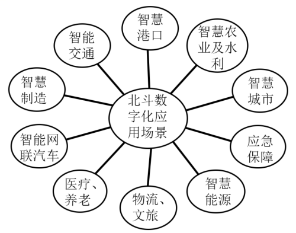
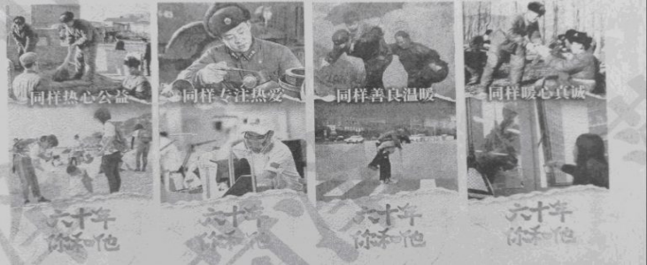

**2023年全省普通高中学业水平等级考试**

**思想政治**

**注意事项:**

**1.答卷前，考生务必将自己的姓名、考生号等填写在答题卡和试卷指定位置。**

**2.回答选择题时，选出每小题答案后，用铅笔把答题卡上对应题目的答案标号涂黑。如需改动，用橡皮擦干净后，再选涂其他答案标号。回答非选择题时，将答案写在答题卡上。写在本试卷上无效。**

**3.考试结束后，将本试卷和答题卡并交回。**

**一、选择题:本题共15小题，每小题3分，共45分。每小题只有一个选项符合题目要求。**

1\. 从马克思恩格斯的“为绝大多数人谋利益”到李大钊的“为大多数人谋幸福”，从毛泽东的“全心全意为人民服务”到习近平的“为民造福”，共产党人始终心怀人民群众，把群众的事一件一件办好。下列表述与材料主旨相同的是（ ）

①人民，只有人民，才是创造世界历史的动力

②人民对美好生活的向往，就是我们的奋斗目标

③尊重人民主体地位，尊重人民首创精神、拜人民为师

④全面小康、摆脱贫困是我们党给人民的交代

A. ①② B. ①③ C. ②④ D. ③④

【答案】C

【解析】

【详解】②④：材料强调以人民为中心，为人民着想，为人民谋幸福。因此，人民对美好生活的向往，就是我们的奋斗目标；全面小康、摆脱贫困是我们党给人民的交代都体现了共产党心怀人民群众，以人民利益为重，以人民为中心，为人民着想，为人民谋幸福和谋利益，②④正确。

①：该选项强调人民对历史的作用，而材料强调共产党以人民为中心，为人民着想，为人民谋幸福，该选项与材料主旨不符，排除①。

③：该选项强调人民的地位，而材料强调共产党以人民为中心，为人民着想，为人民谋幸福，该选项与材料主旨不符，排除③。

故本题选C。

2\. 2022年，全民健身“热气腾腾”。滑雪、滑冰、冰球，“带动三亿人参与冰雪运动”的愿望已然成为现实；贵州黔东南、福建泉州、河南新乡，乡村篮球赛为乡村振兴注入新力量；骑行、掷飞盘、玩腰旗橄榄球，户外运动蓬勃发展；“全民健身线上运动会”“云走齐鲁”在线健身成为新的生活方式。全民健身的开展可以（ ）

①拓展体育消费场景，促进体育产业转型升级

②增加体育用品支出，推动居民消费结构优化

③丰富体育服务供给，实现城乡公共服务均等化

④赋能乡村文化振兴，推动一二三产业融合发展

A. ①② B. ①④ C. ②③ D. ③④

【答案】A

【解析】

【详解】①：滑雪、滑冰、冰球，“带动三亿人参与冰雪运动”拓展了体育消费场景，促进体育产业转型升级，①符合题意。

②：乡村篮球赛、骑行、掷飞盘、玩腰旗橄榄球，户外运动蓬勃发展，“云走齐鲁”在线健身等活动，会增加消费者体育用品支出，推动居民消费结构优化，改善居民生活品质，②符合题意。

③：全民健身开展并没有实现城乡公共服务均等化，选项夸大了全民健身的作用，③排除。

④：全民健身的开展并没有推动一二三产业融合发展，④排除。

故本题选A。

3\. 图1是2018-2022年我国煤煤和清洁能源消费量占能源消费总量的比重变化情况，图2是2018-2022年我国GDP、万元GDP能耗降低率变化情况。据此，下列推断正确的是（ ）

①煤炭消费比重的回升说明市场上清洁能源供给量减少

②万元GDP能耗持续降低意味着能源消费总量不断下降

③煤炭和清洁能源消费比重的变化表明能源结构持续优化

④万元GDP能耗降低与GDP增长相协调意味着经济发展更有效率

A. ①② B. ①④ C. ②③ D. ③④

【答案】D

【解析】

【详解】①：图1显示煤炭消费比重在下降，①排除。

②：万元GDP能耗持续降低体现出经济结构在优化，生态文明建设取得良好效果，并不意味着能源消费总量下降，②排除。

③：煤炭能源消费比重在下降，清洁能源消费比重在上升，表明能源结构持续优化，③符合题意。

④：万元GDP能耗降低，GDP在不断增长，二者相协调意味着经济发展更有效率，更有质量，④符合题意。

故本题选D。

4\. 近年来，我国医保多项改革措施取得显著成效，建成全国统一的医保信息平台，2022年全国跨省异地就医直接结算基金支付809.19亿元；开展国家医保药品目录准入谈判，实现医保用药全国范围基本统一；国家集中采购7批294种药品，平均降价超过50%。关于医保改革，下列传导正确的是（ ）

①异地就医直接结算→提高社会福利水平→提高居民参加医疗保险积极性

②医保药品目录准入谈判→筛选创新药进入目录→提升医保基金使用效能

③统一医保用药范围→增加药品报销种类→满足居民高层次保险需求

④药品集中采购→通过市场化机制以量换价→降低居民医疗负担

A. ①② B. ①③ C. ②④ D. ③④

【答案】C

【解析】

【详解】①：医疗保险属于社会保险，不属于社会福利，因此医保改革不会提高社会福利水平，①传导错误。

②：开展国家医保药品目录准入谈判，筛选创新药进入目录，有利于提升医保基金使用效能，②传导正确

③：医疗保险属于社会保险，满足的是居民的基本保险需求，满足居民高层次保险需求的是商业保险，因此，医保改革不能满足居民高层次保险需求，③传导错误。

④：实现药品集中采购，是国家通过市场化机制以量换价，有利于降低居民医疗负担，④传导正确。

故本题选C。

5\. 某村为推进特色田园综合体建设，成立村民自管组并建立“一问答”制度。自管组由党支部牵头，在广泛征求村民意见的基础上选举产生，负责收集并处理群众的问题和建议，不能处理的由村委会和镇政府出面解决。在各方的共同努力下，特色田园综合体建设取得明显成效。这一成效得益于（ ）

①建立党的基层组织，积极协调各方利益

②完善协同共治机制、提升基层治理能力

③优化基层职权配置，规范政府服务流程

④引导村民有序参与，提高民主协商效率

A. ①③ B. ①④ C. ②③ D. ②④

【答案】D

【解析】

【详解】①：特色田园综合体建设取得明显成效得益于由党支部牵头，发挥基层党组织统领全局、协调各方得作用，而不是建立党的基层组织，①表述错误。

②④：村民自管组由党支部牵头，在广泛征求村民意见的基础上选举产生，负责收集并处理群众的问题和建议。村委会和镇政府出面解决自管组不能处理的问题和建议，可见它有利于完善协同共治机制、提升基层治理能力；也有利于引导村民有序参与，提高民主协商效率，②④符合题意。

③：材料不涉及规范政府服务流程，③不符合题意。

故本题选D。

6\. 齐长城修筑于春秋战国时期，是我国现存有准确遗迹可考、年代最早的长城。2021年9月，山东省J县人民检察院在公益诉讼专项监督活动中发现齐长城遗址的部分区域遭到了破坏，遂向该县文旅局和遗址所在地镇政府分别发出检察建议，在履行监管职责、做好文物保护工作等方面提出建议。2022年9月，山东省人大常委会审议通过《山东省齐长城保护条例》。根据材料，在山东省的齐长城保护工作中（ ）

①人民检察院通过发出检察建议依法进行民主监督

②政府坚持对人民检察院负责，严格执行检察建议

③省人大常委会通过制定地方性法规完善制度保障

④各个国家机关在法治框架内协调一致地履行职责

A. ①② B. ①③ C. ②④ D. ③④

【答案】D

【解析】

【详解】①：山东省J县人民检察院在公益诉讼专项监督活动中发现齐长城遗址的部分区域遭到了破坏，遂向该县文旅局和遗址所在地镇政府分别发出检察建议，这是行政系统外部监督中的司法监督，不是民主监督，排除①。

②：政府由人大产生，对人大负责，受人大监督，不是对人民检察院负责，②错误。

③：山东省人大常委会审议通过《山东省齐长城保护条例》，这说明省人大常委会通过制定地方性法规完善制度保障，③符合题意。

④：人民检察院开展公益诉讼专项监督活动，县文旅局和遗址所在地镇政府履行监管职责、做好文物保护工作，山东省人大常委会审议通过《山东省齐长城保护条例》，这说明各个国家机关在法治框架内协调一致地履行职责，④符合题意。

故本题选D。

7\. 2023年2月，欧洲议会通过了《2035年欧洲新售燃油轿车和小货车零排放协议》。协议的目标是2035年开始在欧盟27国范围内停售新的燃油轿车和小货车。中国新能源车企纷纷通过投资建厂、品牌收购等方式进一步扩大在欧洲市场布局。据材料，下列说法正确的是（ ）

①欧盟通过实施经济一体化政策推动欧洲绿色发展

②欧洲议会通过行使最高决策权维护欧盟整体利益

③中国新能源车企在欧投资建厂有助于克服贸易壁垒

④国际新能源汽车市场竞争加剧不利于全球资源配置

A. ①③ B. ①④ C. ②③ D. ②④

【答案】A

【解析】

【详解】①：欧洲议会通过该协议，其目标是2035年开始在欧盟27国范围内停售新燃油轿车和小货车，表明欧盟通过实施经济一体化政策，引导各国向机动车零排放目标前进，推动欧洲绿色发展，①正确。

②：欧洲理事会（欧盟首脑会议）是欧盟最高决策机构，欧洲议会是监督、咨询机构，因此欧洲议会无最高决策权，②错误。

③：中国新能源车企纷纷通过投资建厂、品牌收购等方式进一步扩大在欧洲市场布局，表明中欧各具经济优势，互补性强，双方良性商业交往有助于形成多边贸易体制，克服贸易壁垒，③正确。

④：跨国公司在全球范围内到处奔走，国际新能源汽车市场竞争加剧，有利于促进全球资源配置的优化和全球的科技合作与进步，④错误。

故本题选A。

8\. 2022年6月，国际电信联盟第八届世界电信发展大会在卢旺达首都基加利举行，来自100多个国家和地区的千余名代表与会，会议通过了《基加利宣言》和(基加利行动计划》两份文件，呼吁各方加速弥合数字鸿沟，助力落实联合国2030年可持续发展议程。材料表明（ ）

①作为世界性国际组织，国际电信联盟是全球数字治理的重要载体

②数字鸿沟已成为数字时代阻碍发展中国家可持续发展的主要障碍

③国际电信联盟推动国际多边合作以应对全人类面临的共同课题

④《基加利行动计划》为推动南北问题的解决提供了路线图

A. ①② B. ①③ C. ②④ D. ③④

【答案】B

【解析】

【详解】①③：国际电信联盟举行第八届世界电信发展大会，来自100多个国家和地区的千余名代表参会，会议通过了《基加利宣言》和(基加利行动计划》两份文件，呼吁各方加速弥合数字鸿沟，助力落实联合国2030年可持续发展议程。这表明国际电信联盟作为世界性国际组织，是全球数字治理的重要载体，积极推动国际多边合作以应对全人类面临的共同课题，①③符合题意。

②：霸权主义和强权政治是和平与发展的主要障碍，②错误。

④：《基加利行动计划》为与联合国2030年可持续发展目标密切相关的数字化发展指明了方向。它有利于解决南北问题，为新冠肺炎疫情之后加速数字化转型的路线图，④错误。

故本题选B。

9\. 中国茶是日常生活，也是文化瑰宝。明代许次纾嗜花之品鉴，深谙茶理，他在《茶疏》中写道：“茶滋于水，水藉乎器，汤成于火。四者相须，缺一则废。”这茶理体现了（ ）

①联系是普遍的，要从整体上把握物并实现事物结构与功能的优化

②联系具有多样性，不同的联系构成事物的存在状态和发展趋势

③整体和部分密不可分，整体的功能、状态及其变化会影响部分

④真理是具体的，真理和谬误在一定条件下能够相互转化

A. ①② B. ①④ C. ②③ D. ③④

【答案】A

【解析】

【详解】①②：好茶，好水、好器、好火候，缺一不可，方能成就一杯好茶，这茶理体现了联系是普遍的，要从整体上把握物并实现事物结构与功能的优化；联系具有多样性，不同的联系构成事物的存在状态和发展趋势，①②正确。

③：材料强调部分对整体的重要性，未强调整体的作用，③不符合题意。

④：材料未涉及真理和谬误在一定条件下相互转化，④不符合题意。

故本题选A。

10\. 今年全国两会期间，习近平提起看过的一个关于培养批“一县一业”重点基地的文件:“我看了以后皱了眉头，这个事情不好下指标，一个县是不是光靠一个产业去发展，要去深入调研，不能大笔挥，拨一笔钱，这个地方就专门发展养鸡、发展蘑菇，那个地方专门搞纺织，那样的话肯定要砸锅。”上述材料蕴含的哲理是（ ）

①一切从实际出发是把握规律、做好决策的根本立足点

②只有反映社会存在的产业决策，才对产业发展起积极作用

③正确的产业决策是把革命热情和科学态度相统一的基础

④调研是从感性认识上升到理性认识、形成正确决策的基本条件

A. ①③ B. ①④ C. ②③ D. ②④

【答案】B

【解析】

【详解】①：坚持一切从实际出发，是我们想问题、做决策、办事情的出发点和落脚点，坚持从实际出发的前提是深入实际、了解实际，做到实事求是，习近平强调要去深入调研，蕴含着一切从实际出发是把握规律、做好决策的根本立足点，①符合题意。

②：反映社会存在的产业决策未必是正确的决策，只有正确的决策才对产业发展起积极作用，②排除。

③：不能把产业决策作为把革命热情和科学态度相统一的基础，这样会陷入唯心主义，③排除。

④：通过调研获得感性认识，然后从感性认识上升到理性认识，调研是形成正确决策的基本条件，④符合题意。

故本题选B。

11\. 月亮门是中国古典园林中开设在院墙上的园弧形洞门、因其形如一轮满月而得名。月亮门通常与云墙配合使用，在波浪形的云墙上开设门洞，看上去如同月亮在云间穿行。由于寓意美好且形态优美，月亮门的营造案例远传海外。下列理解正确的是（ ）

①月亮门与云瑞给人美的享受是主体活动对客体的积极意义

②人们对团圆的美满期盼通过月亮门的设计造型表达出来

③月亮门独特魅力吸引国外民众认同中华文化

④实用性与装饰性的对立属性寓于月亮门优美造型的统一属性之中

A. ①② B. ①③

C. ②④ D. ③④

【答案】C

【解析】

【详解】②④：月亮门寓意美好且形态优美，寄托了人们对团圆的美满期盼，体现了意识的能动作用；月亮门既具有实用性，又包含装饰性，实用性与装饰性之间既对立又统一，表明矛盾的斗争性不能脱离同一性而存在，斗争性寓于同一性之中，②④正确。

①：亮门与云瑞给人美的享受，表明其具有美学价值，而哲学上的价值是指客体对主体的积极意义，而不是主体活动对客体的积极意义，①错误。

③：应认同本民族文化，尊重其他民族文化，而不是令国外民众认同中华文化，③错误。

故本题选C。

12\. 我们遭遇的风险挑战风高浪急，这些风险挑战既有国内的，也有国际的；既有传统的，也有非传统的。“非弘不能胜其重，非毅无以致其远”，面对风险挑战，唯有顽强拼搏，坚决斗争，才能赢得尊严、求得发展。据材料，下列判断或推理正确的是（ ）

①弘则能胜其重，毅则能致其远

②我们要赢得尊严、求得发展，就必须坚决斗争

③以“有些风险挑战是国内的”为前提，不能进行换质位推理

④“有些风险挑战是传统的"通过换质推理可得出“有些风险挑战不是现代的"

A. ①③ B. ①④ C. ②③ D. ②④

【答案】C

【解析】

【详解】①：依据材料，弘毅是胜其重、致其远必要条件，而不是充分条件。应为只有弘大刚强才能承担重任，只有强毅忍耐才能使道路走的更远，①排除。

②：顽强拼搏，坚决斗争是才能赢得尊严、求得发展的必要条件。其有效式是肯定后件就可以肯定前件，我们要赢得尊严、求得发展，就必须坚决斗争，②正确。

③：“有些风险挑战是国内”，换质后为“有些风险挑战不是非国内的”。这是一个特称否定判断，特称否定判断不能进行换位推理，③正确。

④：换质推理要把联项“是”改为“不是”，谓项改为与其相矛盾的概念。传统的风险挑战，其矛盾的概念应为非传统，故④错误。

故本题选C。

13\. 要构建一个符合推理规则的三段论，其结论为“有些属于国家所有的资源是受野生动物保护法保护的”，由野生动物保护法规定得出的①②③④四个判断中，可分别作为该三段论大前提、小前提的是（ ）

第二条：……本法规定保护的野生动物，是指珍贵、濒危的陆生、水生野生动物和有重要生态、科学、社会价值的陆生野生动物。……

第三条：野生动物资源属于国家所有。……

——————摘自《中华人民共和国野生动物保护法》

①有些受野生动物保护法保护的是珍贵、濒危的陆生野生动物

②珍贵、濒危的水生野生动物是受野生动物保护法保护的

③珍贵、潮危的陆生野生动物是受野生动物保护法保护的

④有些属于国家所有的资源是珍贵、濒危的陆生野生动物

A. ①一④ B. ②-④ C. ①一③ D. ③一④

【答案】D

【解析】

【详解】A：这个三段论中，中项是珍贵、濒危的陆生野生动物，在大小前提中都没有周延，犯中项没有周延的错误，A排除。

B：这个三段论中，水生野生动物和陆生野生动物是不同的概念，犯四概念错误，B排除。

C：正确的三段论要求大项、中项和小项各出现两次。这个三段论中，有些属于国家所有的资源作为小项只出现了一次，受野生动物保护法保护的作为大项出现了三次，不符合三段论推理规则，C排除。

D：这个三段论符合三段论推理规则，D入选。

故本题选D。

14\. 甲公司与彭某的劳动合同约定“公司每月为彭某缴纳的社保和公积金，由彭某向公司全额支付补偿，否则暂停发放下月工资”。后彭某不满到手的工资太少，遂又在乙公司兼职销售直播，每晚直播3小时，时段和专勤事宜由乙公司统一安排。据此，下列说法正确的是（ ）

①彭某有权主张与甲公司合同中的“全额支付补偿”条款无效

②甲公司只要发现彭某为乙公司直播，就有权直接解聘彭某

③彭某应与乙公司补签书面劳动合同、双方劳动关系自合同生效之日起建立

④如果甲公司暂停向彭某发放工资，则劳动行政部门有权责令其支付

A. ①② B. ①④ C. ②③ D. ③④

【答案】B

【解析】

【详解】①：依据《劳动法》和《住房公积金管理条例》，用人单位必须给职工缴纳社保和公积金，彭某向公司全额支付社保和公积金的行为违法，因此彭某有权主张与甲公司合同中的“全额支付补偿”条款无效，①正确。

②：彭某不满到手的工资太少，遂在乙公司兼职销售直播。如果不影响彭某与甲公司的合同约定，甲公司无权直接解聘彭某，②排除。

③：双方劳动关系自用工之日起建立，并非补签书面劳动合同生效之日起建立，③排除。

④：用人单位如果克扣或者无故拖欠劳动者工资的，劳动行政部门责令支付劳动者的工资报酬、经济补偿，并可以责令支付赔偿金。因此，如果甲公司暂停向彭某发放工资，则劳动行政部门有权责令其支付，④符合题意。

故本题选B。

15\. 甲公司从乙公司购入一批配件，约定“因本合同发生的一切争议，均由A仲裁委员会仲裁”。后该批配件迟延两个月才交货，且用该批配件生产的甲公司产品造成了数起伤人事故。甲公司召回产品检验后，意外发现配件内部设计使用了自己的发明专利，因此要求乙公司承担侵权责任。乙公司则申请行政主管部门宣告甲公司的专利权无效。据此，下列说法正确的是（ ）

①针对配件迟延交货之事，甲公司无权请求法院判决乙公司承担违约责任

②针对甲公司产品造成的伤人事故，甲公司即使无过错也应向受害人承担责任

③若主管部门作出了专利权无效宣告，甲公司可向法院起诉且需承担举证责任

④即使乙公司申请失败，仍可通过证明自己系独立作出相同发明来实现免责

A. ①② B. ①④ C. ②③ D. ③④

【答案】A

【解析】

【详解】①：双方约定“因本合同发生的一切争议，均由A仲裁委员会仲裁”，表明双方订立了有效的仲裁协议。法律规定，当事人达成仲裁协议，一方向人民法院起诉的，人民法院不予受理，但仲裁协议无效的除外。因此有效的仲裁协议可排除法院管辖权，甲公司无权向法院提起诉讼，故①正确。

②：甲公司生产的产品造成他人伤害，应当按照法律规定的无过错侵权责任中的生产者产品责任处理，即行为人只要损害了他人的民事权益，不论其有无过错，均应当承担侵权责任。故甲公司即使无过错也应向受害人承担责任，②正确。

③：甲公司起诉行政主管部门，属于行政诉讼，应当由作为被告的行政机关提供作出该行政行为的证据和所依据的规范性文件，而不是由甲公司承担主要举证责任，③错误。

④：发明人取得专利，是以公开其发明内容为条件，换取国家在限定时间内给予强有力的法律保护，其他人即使独立作出了相同的发明，也不得实施该发明，故④错误。

故本题选A。

**二、非选择题:本题共5小题，共55分。**

16\. 某校一个学习小组围绕“政务信息公开和个人信息保护”开展探究活动，收集到以下资料。

<table style="width:78%;">
<colgroup>
<col style="width: 78%" />
</colgroup>
<thead>
<tr>
<th style="text-align: center;">
某地保障房主管部门拟公示信息

申请人员个人信息：姓名、身份证号码、电话号码、户籍所在地、家庭人口情况、家庭人均居住建筑面积、家庭人均可支配月收入、申请住房门牌号。

申请结果信息：申请人员的摇号结果、配租结果。

相关法律法规：

《中华人民共和国政府信息公开条例》(2019年4月3日中华人民共和国国务院令第711号修订)第十九条:

“对涉及公众利益调整、需要公众广泛知晓或者需要公众参与决策的政府信息，行政机关应当主动公开。”

《中华人民共和国个人信息保护法》(2021年8月20日第十三届全国人民代表大会常务委员会第三十次会议通过)第五十一条:“个人信息处理者应当……采取下列措施确保个人信息处理活动符合法律、行政法规的规定，并防止……个人信息泄露、篡改、丢失……（三)采取相应的加密、去标识化等安全技术措施。”
</th>
</tr>
</thead>
<tbody>
</tbody>
</table>

结合材料，运用政治与法治、法律与生活知识，就如何处理好政务信息公开和个人信息保护的关系说明你的观点，并阐明理由。

【答案】①二者存在一定的冲突，政务信息公开，让权力在阳光下运行，这是建设法治政府的要求，可以增强政府的公信力和执行力，有效保障人民群众的知情权、参与权、表达权和监督权，然而，政务人员在处理和存储公民个人信息的过程中，泄露公民信息以及信息公开过程中披露或提供超出必要限度的个人信息等现象，使得公民个人信息存在一定的安全风险，最终导致了两者之间存在一定的冲突，若公开信息不规范，将有可能造成公民个人信息泄露，给人民群众人身和财产权利造成不良影响。\
②政府部门在公开政务信息时一定要处理好“信息公开”与“隐私保护”之间的关系，既要兼顾公众的知情权、表达权，也要保护好相关人员的个人隐私信息，不要让信息公开变成隐私信息“裸奔”，给公民造成极大的信息安全隐患。\
③政府信息公开需要实现公共利益和个体利益的平衡、依法履职和保护公民个人信息安全的平衡，相关部门要依法取得他人信息并确保信息安全，对公民个人敏感信息进行匿名化处理，要坚持合法、正当、必要的原则，不得过度处理。

【解析】

【分析】背景素材：政务信息公开和个人信息保护

考点考查：政治与法治、法律与生活的有关知识

能力考查：描述和阐述事物、论证和探究问题

核心素养：政治认同、科学精神 、法治意识

【详解】第一步：审设问，明确主体、作答范围、问题限定和作答角度。

本题属于分析说明类主观题，可从知识指向提取材料关键词并对接教材知识思考作答。运用政治与法治、法律与生活的有关知识，结合材料进行分析。

第二步：审材料，提取关键词，链接教材知识。

关键词①：对涉及公众利益调整、需要公众广泛知晓或者需要公众参与决策的政府信息，行政机关应当主动公开→可联系建设法治政府的要求。

关键词②：个人信息处理者应当……采取下列措施确保个人信息处理活动符合法律、行政法规的规定，并防止……个人信息泄露、篡改、丢失……（三)采取相应的加密、去标识化等安全技术措施→可联系既要兼顾公众的知情权、表达权，也要保护好相关人员的个人隐私信息，不要让信息公开变成隐私信息“裸奔”。

关键词③：如何处理好政务信息公开和个人信息保护的关系→可联系实现公共利益和个体利益的平衡、依法履职和保护公民个人信息安全的平衡。

第三步：整合信息，组织答案。注意设问限定以及教材知识与材料、时政信息等相结合。

17\. 材料一 基础设施是经济社会发展的重要支撑。中央提出,持续推进重点领域补短板投资，加快交通基础设施建设、完善社会民生基础设施等；系统布局新型基础设施，加快建设信息基础设施、前瞻布局创新基础设施等。

材料二 提前布局、超前部署基础性支撑性的重大科技基础设施，将会为更多的创新和应用场景留足孵化期。作为中央前瞻谋划的重大科技基础设施，北斗经过20多年的发展，从定位导航授时服务出发。一步步孵化出智能穿戴式设备、高精度时空服务等“北斗+”“+北斗”新业态(如下图)。2021年我国卫星导航与位置服务产业总体产值约4700亿元，凸显了重大科技基础设施的创新“溢出”和“杠杆”效应。但是，这类基础设施建设周期比较长，初期往往存在应用场景不丰富、市场规模小等困难。

卫星子航与位置服务业态示意图。

有观点认为，国家应超前开展各类基础设施投资以促进经济发展。结合材料，运用经济与社会、逻辑与思维知识，对该观点进行评析。

【答案】①观点有合理性，国家要提前布局、超前部署基础性支撑性的重大科技基础设施，有助于人们能动地认识世界，也有助于人们趋利避害，防患于未然，成功的改造世界，利用超前思维通过前瞻性思考，帮助人们规划和调整思路，贯彻创新驱动发展战略，抓住有利的发展机遇，推动企业供给侧结构改革，推动科技创新，培育新业态新模式，建设创新引领协同发展的产业体系，从而推动经济高质量发展。\
②但是，并不是各类基础设施投资都要超前开展，国家要坚持以人民为中心，推进重点领域补短板投资，加快交通基础设施建设、完善社会民生基础设施等，从而优化经济结构，推动经济社会持续健康发展。\
③要促进经济发展，还需要发挥完善社会主义市场经济体制，发挥市场在资源配置中的决定作用，实行科学的宏观调控，实现有效市场和有为政府的统一，尊重企业的市场主体地位，发挥新型举国体制优势、建设现代化经济体系，构建新发展格局。

【解析】

【分析】背景素材：基础设施是经济社会发展的重要支撑

考点考查：超前思维、推动经济高质量等有关知识。

能力考查：描述和阐述事物，论证和探究问题。

核心素养：政治认同、科学精神

【详解】第一步：审设问，明确主体、作答范围、问题限定和作答角度。本题属于辨析类主观题，可从知识指向提取材料关键词并对接教材知识思考作答。注意知识限定不要用错，结合材料进行分析。

第二步：审材料，提取关键词，链接教材知识。

关键词①：提前布局、超前部署基础性支撑性的重大科技基础设施，将会为更多的创新和应用场景留足孵化期→可联系教材知识利用超前思维进行前瞻性思考的意义。

关键词②：持续推进重点领域补短板投资，加快交通基础设施建设、完善社会民生基础设施等；系统布局新型基础设施，加快建设信息基础设施、前瞻布局创新基础设施等→可联系教材知识并不是各类基础设施投资都要超前开展。

关键词③：但是，这类基础设施建设周期比较长，初期往往存在应用场景不丰富、市场规模小等困难→可联系教材知识要促进经济发展，还需要发挥完善社会主义市场经济体制，发挥市场在资源配置中的决定作用，实行科学的宏观调控等。

第三步：整合信息，组织答案。注意设问限定以及教材知识与材料、时政信息等相结合。

18\. 中国精神、中国力量

\[精神家园\]

一部中国史，就是一部各民族交融汇聚成中华民族共同体的历史。在历史演进中各民族形成了生死与共、命运与共的中华民族大家庭；在这里，茶马古道、河西走廊……成为民族团结融合之路；长江、黄河、瓷器、丝绸……成为引发强烈共鸣的中华文化符号和形象。

鸦片战争以后，国家蒙辱、人民蒙难、文明蒙尘，中华民族遭受了前所未有的劫难。面对劫难。各族人民更加深刻地体会到中华各民族一荣俱荣、休戚相关。中国共产党成立后，领导各族人民洗雪耻辱、扭转自身命运，书写了中华民族几千年历史上最恢宏的史诗，迎来了全体中华儿女踔厉奋发、共同创造美好生活的新时代。

（1）习近平指出，“必须构筑中华民族共有精神家园”。结合材料，运用文化传承与文化创新知识，阐述新时代我们应如何构筑中华民族共有精神家园。

\[精神灯塔\]

雷锋精神源于雷锋一人，又系于无数心怀山海的接棒者。60年来，学雷锋活动在全国持续深入开展，一个雷锋带动了一代又一代“雷锋”……

——摘编自《南方日报》

（2）“穿越60年，你和他的青春如此相似”，结合材料，运用矛盾的普遍性和特殊性辩证关系原理谈谈你的认识。

【答案】（1）①中华优秀传统文化源远流长、博大精深，是中华民族的“根”与“魂”，是中华民族凝聚力和发展动力的重要来源，要推动实现中华优秀传统文化创造性转化、创新性发展，树立和突出各民族共享的中华文化符号和中华民族形象，塑造中华文化的丰满形象和精神面貌。②中华民族精神集中体现了中华民族的整体风貌和精神特征，体现了中华民族共同的价值追求。在新时代，应在中国共产党人的领导下，凝聚民族合力、赓续民族精神，不断为民族精神增添新的时代内容。③中国共产党正是以高度的文化自觉与文化自信，带领全国人民取得了革命、建设、改革的伟大胜利和辉煌成就，新时代构筑中华民族共有精神家园，要继续增强中华文化自觉，坚定中华文化自信。④要弘扬社会主义核心价值观，发挥其全社会价值追求“最大公约数”的作用，深化爱国主义教育，凝聚中华民族共有精神家园价值追求，引领中华民族共有精神家园的建设与发展。

（2）①矛盾的普遍性和特殊性相互联结，体现了共性和个性、一般与个别的关系。②一方面，矛盾的普遍性寓于特殊性之中，并通过特殊性表现出来，没有特殊性就没有普遍性。雷锋精神源于雷锋一人，雷锋所处的年代、他所做的事情与雷锋的接棒者所处的年代、所做的事情并不相同，每个人都是在自己的时代、领域里发光发热，雷锋是特别的先行者，是我们的榜样力量。③另一方面，矛盾的特殊性离不开普遍性，任何事物都是普遍性与特殊性的对立统一。虽然雷锋与接棒者存在诸多不同，但是我们的价值追求是一致的，精神内核是相似的，始终秉持着全心全意为人民服务的信念，无论处于哪个历史时期、无论社会环境如何变化，我们与雷锋永远是最熟悉的青春同行者。

【解析】

【分析】背景素材：中国精神和中国力量

考点考查：文化传承与文化创新、矛盾的普遍性和特殊性辩证关系的有关知识

能力考查：获取和解读信息、调动和运用知识、描述和阐释事物

核心素养：政治认同、科学精神、公共参与

【小问1详解】

第一步：审设问。明确主体、作答范围、问题限定和作答角度。

本题的设问要求阐述新时代我们应如何构筑中华民族共有精神家园，需要调用文化传承与文化创新的有关知识，从措施角度进行分析。

第二步：审材料。提取关键词，链接教材知识。

关键词①：成为引发强烈共鸣的中华文化符号和形象→可联系中华优秀传统文化源远流长、博大精深，要推动实现中华优秀传统文化创造性转化、创新性发展。

关键词②：成为民族团结融合之路→可联系中华民族精神与时代精神。

关键词③：洗雪耻辱、扭转自身命运，书写了中华民族几千年历史上最恢宏的史诗→可联系文化自信、弘扬社会主义核心价值观。

第三步：整合信息，组织答案。注意教材信息与材料、时政信息相结合。

【小问2详解】

第一步：审设问。明确主体、作答范围、问题限定和作答角度。

本题的设问要求谈谈你对“穿越60年，你和他的青春如此相似”这句话以及图片内容的认识，需要调用矛盾的普遍性和特殊性辩证关系原理的有关知识进行拓展分析。

第二步：审材料。提取关键词，链接教材知识。

关键词①：雷锋精神源于雷锋一人→可联系矛盾的普遍性寓于特殊性之中，并通过特殊性表现出来。

关键词②：一个雷锋带动了一代又一代“雷锋”→可联系矛盾的特殊性离不开普遍性，任何事物都是普遍性与特殊性的对立统一。

第三步：整合信息，组织答案。注意教材信息与材料、时政信息相结合。

19\. 当好善解矛盾纠纷的行家里手。

\[民声\]

M镇人民调解委员会接到Z村村民张某反映，称邻居谭某故意将几颗果树挪到其承包地紧贴自己家进出的必经之路一侧，树枝阻碍了自己的面包车通行。调解员遂前往调解。

\[走访\]

调解员走坊了谭某，了解到前些年Z村组织土地承包，谭某分到的地正好被进出张某院子的必经之路分割成两半。为说服谭某接受承包方案，时任村主任张某斌代表村委会口头承诺，承包期内每年补偿谭某600元，但从今年初开始，现任村主任张某军不再支付补偿款，谭某多次沟通无果，认为村委会和张某合伙欺负人，自己不能再忍。

调解员又走访了张某、张某军和其他知情人，了解到新情况:去年谭某家杨树的树枝被风刮断，砸坏张某的面包车，张某要求赔偿。谭某认为刮风是自然现象，自己不应为此负责。此后两家再无来往。

结合材料，运用法律与生活知识，完成下列任务：

（1）〖释法〗调解员向谭某、张某和张某军分析了他们各自应承担的民事责任及法律依据。请将分析内容补充完整。

在村委会补偿的纠纷中:① 。

在树枝砸坏车的纠纷中:② 。

在挪树阻碍通行的纠纷中:③ 。

（2）〖化解〗整个调解过程中，除明晰具体法律关系外，调解员和各方当事人还应坚持什么原则才能真正化解矛盾。

调解员:④ 。

各方当事人:⑤ 。

【答案】（1）①时任村主任张某斌代表村委会对谭某做过口头承诺，属于口同合同，村委会应继续履行合同。\
②树枝砸坏车的纠纷中，谭某家杨树的树枝被风刮断，砸坏张某的面包车，谭某应该承担侵权责任，给予赔偿。\
③在挪树阻碍通行的纠纷中，谭某故意将几颗果树挪到其承包地紧贴张某家进出的必经之路一侧，树枝阻碍了其面包车通行，根据不动产权利人应当为相邻权利人用水、排水、通行等提供必要的便利，谭某应当妥善处理，停止侵害，消除障碍。

（2）④人民调解员要尊重当事人的权利，不得违背法律、法规和国家政策，不收取任何费用。民法典确立的平等、自愿、公平、诚信、守法和公序良俗、绿色等基本原则。\
⑤各方当事人应坚持按照有利生产、方便生活、团结互助、公平合理的原则，正确处理相邻关系。法律、法规对处理相邻关系有规定的，依照其规定；法律、法规没有规定的，可以按照当地习惯。

【解析】

【分析】背景素材：Z村相邻权纠纷、合同纠纷

考点考查：法律与生活的相关知识

能力考查：描述和阐释事物、论证和探究问题

核心素养：法治意识

【小问1详解】

【详解】第一步：审设问。明确主体、知识范围、问题限定和作答角度。

本题需要调用法律与生活知识，从原因、意义措施角度分析作答。

第二步：审材料。提取关键词，链接教材知识。

关键词①：村委会补偿的纠纷中→可联系村委会应继续履行合同。

关键词②：树枝砸坏车的纠纷中→可联系谭某应该承担侵权责任，给予赔偿。

关键词③：挪树阻碍通行的纠纷中→可联系谭某应当妥善处理，停止侵害，消除障碍。

第三步：整合信息，组织答案。注意设问限定以及教材知识与材料、时政信息等相结合。

【小问2详解】

第一步：审设问。明确主体、知识范围、问题限定和作答角度。

本题需要调用法律与生活知识，从调解以及处理相邻关系的的要求等角度分析作答。

第二步：审材料。提取关键词，链接教材知识。

关键词：相邻权纠纷、合同纠纷→可联系调解员要尊重当事人的权利，不得违背法律、法规和国家政策，不收取任何费用。各方当事人按照有利生产、方便生活、团结互助、公平合理的原则，法律、法规对处理相邻关系有规定的，依照其规定；法律、法规没有规定的，可以按照当地习惯。民法典确立的平等、自愿、公平、诚信、守法和公序良俗、绿色等基本原则。

第三步：整合信息，组织答案。注意设问限定以及教材知识与材料、时政信息等相结合。

20\. 察势者智，驭势者赢。一百多年来，中国共产党始终站在历史正确的一边，站在人类进步的一边，坚持立足中国、放眼世界，正确认识和处理同世界的关系，团结带领中国人民实现了从落后时代、赶上时代再到引领时代的伟大跨越，显著提升了中国的国际影响力、感召力、塑造力……

结合材料，运用中国特色社会主义，当代国际政治与经济知识，以“在历史前进的逻辑中前进”为主题撰写一篇短评。

要求:①围绕主题，观点明确:②论证充分，逻辑清晰:③学科术语使用规范:④总字数在250字左右。

【答案】一个国家、一个民族要振兴，就必须在历史前进的逻辑中前进、在时代发展的潮流中发展。一百多年来，中国共产党团结带领中国人民，找到了实现中华民族伟大复兴的正确道路，进行了新民主主义革命，推进社会主义革命和建设，在改革开放中建设中国特色社会主义，坚持以党的伟大自我革命引领伟大社会革命，带领中华民族迎来了从站起来、富起来到强起来的伟大飞跃。当今世界面临百年之未有大变局，中国顺应和平与发展的时代主题，以实际行动构建人类命运共同体，完善全球治理体系，推动构建新型国际关系，积极融入经济全球化，为世界发展不断贡献中国智慧和中国力量。

【解析】

【分析】背景素材：在历史前进的逻辑中前进

考点考查：中国特色社会主义、当代国际政治与经济的有关知识

能力考查：调动和运用知识、描述和阐述事物

核心素养：政治认同、科学精神

【详解】第一步：审设问，明确主体、作答范围、问题限定和作答角度。本题属于开放类主观题，要求考生以“在历史前进的逻辑中前进”为主题撰写一篇短评。考生需要调用中国特色社会主义、当代国际政治与经济的知识结合材料分析作答。

第二步：审材料，提取关键词，链接教材知识。

关键词①：一百多年来，中国共产党始终站在历史正确的一边，团结带领中国人民实现了从落后时代、赶上时代再到引领时代的伟大跨越→可联系中国共产党带领中华民族迎来了从站起来、富起来到强起来的伟大飞跃。

关键词②：中国共产党始终站在历史正确的一边，站在人类进步的一边，放眼世界，正确认识和处理同世界的关系→可联系时代主题、人类命运共同体、经济全球化、为世界发展不断贡献中国智慧和中国力量等。

第三步：整合信息，组织答案注意设问限定以及教材知识与材料相结合。
