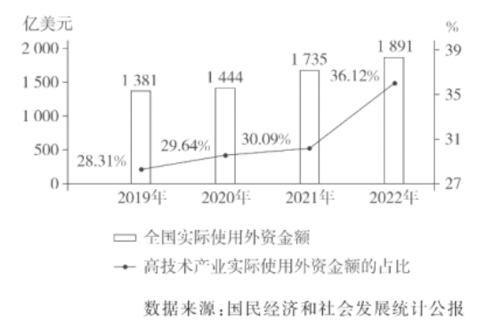

**2023年普通高中学业水平选择性考试（广东卷）**

**思想政治**

**本试卷满分100分，考试时间75分钟。**

**一、选择题：本大题共16小题，每小题3分，共48分。在每小题给出的四个选项中，只有一项是符合题目要求的。**

1\. 1956年，党的八大提出尽快把我国从落后的农业国变为先进的工业国；1987年，党的十三大提出把我国建设成为富强、民主、文明的社会主义现代化国家；2017年，党的十九大提出把我国建设成为富强民主文明和谐美丽的社会主义现代化强国；2022年，党的二十大提出以中国式现代化全面推进中华民族伟大复兴。从这一探索历程可见（ ）

①实现现代化彰显了中国共产党人的初心和使命

②实现现代化是中国共产党不懈奋斗的最高理想

③中国式现代化的提出有其历史逻辑和实践逻辑

④中国式现代化是发展中国家实现现代化的必由之路

A. ①③ B. ①④ C. ②③ D. ②④

2\. 党的二十大审议通过了《中国共产党章程（修正案）》，把党的十九大以来习近平新时代中国特色社会主义思想新发展写入党章，以更好反映以习近平同志为核心的党中央推进党的理论创新、实践创新、制度创新成果。这一修改（ ）

①全面具体地总结了十八大以来党和国家各项事业的伟大成就

②为更好坚持和发展中国特色社会主义提供了制度保障和法律依据

③更加彰显习近平新时代中国特色社会主义思想的真理力量和实践伟力

④适应形势和任务的发展变化，有利于更好发挥党章的规范和指导作用

A. ①② B. ①④ C. ②③ D. ③④

3\. 2022年1月，企业职工基本养老保险全国统筹信息系统启动。截至2022年6月底，全国所有省份完成基金财务系统部省对接，企业职工基本养老保险基金“一本账”基本形成，在全国范围内实现“五统一”，即统一缴费政策、统一基金收支管理、统一待遇调整、统一信息系统、统一经办服务管理。这有利于（ ）

①实现数据集中管理，提升数据要素价值

②加大社会保险费对个人所得税的抵减作用

③实时查询缴费信息，在线申领社会救助金

④改善公共服务能力，推动养老保险制度公平化

A ①③ B. ①④ C. ②③ D. ②④

4\. 2022年11月，广东省能源局首次提出一次能源价格传导机制，规定当综合煤价或天然气到厂价高于一定值时，煤机或气机平均发电成本超过允许上浮部分，按照一定比例对年度或月度等电量进行补偿，相关费用由全部工商业用户分摊。该规定（ ）

①将会降低火电企业的电量销售收益率

②明确了由市场决定电力行业的购销价格

③有利于将上游变动成本向下游用户传导

④体现了政府对市场资源配置的引导作用

A. ①② B. ①③ C. ②④ D. ③④

5\. 2019-2022年中国实际使用外资情况见下图。

上图反映出这一时期中国（ ）

①引进外资和对外投资协调发展

②非公有制经济中，外商投资规模不断扩大

③利用外资结构不断优化，推动经济高质量发展

④高技术产业是实际使用外资额增长最快的产业

A. ①② B. ①④ C. ②③ D. ③④

6\. 党中央决定深化机构改革，并为此深入开展研究论证。2023年2月，党的二十届二中全会审议通过了《党和国家机构改革方案》，党中央还举行民主协商会，就机构改革等事项向各民主党派中央代表通报情况，听取意见；3月，党中央把国家机构改革部分的内容按照法定程序提交全国人大审议并获得通过。对此，下列理解正确的是（ ）

①各民主党派通过参加民主协商会，共同行使领导权

②这一过程体现了党坚持科学执政、民主执政、依法执政

③全国人大拥有对《党和国家机构改革方案》的最终决定权

④党中央作出深化机构改革决策体现了党的领导核心地位

A. ①② B. ①③ C. ②④ D. ③④

7\. 某民族自治县围绕本省实施“百县千镇万村高质量发展工程”、促进城乡区域协调发展的部署，充分利用各种扶持政策，补短板、强弱项、固底板、扬优势，使该县各方面事业发展驶入快车道，各族群众的认同感和归属感不断攀升。由此可见（ ）

①民族地区的经济社会发展需要因地制宜采取措施

②城乡区域协调发展是民族平等、民族团结的前提

③该县积极利用相关政策促发展，有利于增强民族凝聚力

④民族地区繁荣发展状况取决于党和国家的政策优惠度

A. ①③ B. ①④ C. ②③ D. ②④

8\. 广东某镇成立客家细妹志愿者服务队，其中近八成队员是中共党员。在党员骨干带领下，服务队发动各村留守妇女参与各类志愿服务，协助调解家庭矛盾和邻里纠纷，解决困难群众需求，撑起乡村治理“半边天”。该服务队的成立与运行（ ）

①生动体现了基层共产党员的先锋模范作用

②是农村基层群众自治组织创新的有益尝试

③为调解民间纠纷、维护文明乡风提供了制度保证

④有利于发挥女性优势，为乡村振兴贡献“她”力量

A. ①② B. ①④ C. ②③ D. ③④

9\. 近年来，广东某法院加强涉侨审判工作，健全“海外联络员”“归侨陪审员”等工作机制，大力推广跨境诉讼“云服务”，多措并举满足广大海内外华侨华人的司法需求，为促进海内外侨胞与家乡深度融合发展增添了法治成色。这种做法（ ）

①表明广东已经全面建成完备的法律服务体系

②有利于团结广大侨胞助力中华民族伟大复兴

③体现了人民法院维护侨胞合法权益的实践创新

④旨在尊重和保障我国公民权利、践行司法为民

A. ①③ B. ①④ C. ②③ D. ②④

10\. “物勒工名”是我国古代长期延续的一种手工业管理制度，要求器物的制造者把自己的名字勒刻在器物上面，便于管理者检验与追责，“以考其诚”。久而久之，诚信敬业、精益求精的制度要求就内化为工匠的自觉意识，从而推动了传统工匠精神的形成与传承。“物勒工名” （ ）

①是传统工匠精神形成和发展的根源

②可为现代工匠精神的培育提供借鉴

③以满足民众物质文化需求为导向

④体现了中华优秀传统文化的核心思想理念

A. ①③ B. ①④ C. ②③ D. ②④

11\. 如图漫画（作者：于冰）所蕴含的哲理是（ ）

①质变是量变的必然结果

②矛盾双方既对立又统一

③事物的价值取决于人的选择

④正确的认识来自合理的判断

A. ①② B. ①③ C. ②④ D. ③④

12\. 20世纪80年代，自行车是我国居民出行最常见的代步工具。近年来，随着绿色低碳出行观念的普及，多地出现骑行热，凭借健身、时尚、科技等新元素，沉寂多年的自行车再次引发民众的消费热潮。这一现象说明（ ）

①人的意识活动具有目的性和选择性

②人们对美好生活的向往决定生活面貌

③事物的发展是间断性和飞跃性的统一

④社会意识对社会存在具有能动的反作用

A. ①③ B. ①④ C. ②③ D. ②④

13\. 中国是世界上最早发现漆树汁液可制作大漆并创造漆器的国家。殷周时代，漆器用于礼乐、饮食、馈赠等，而最美的漆器则用来祭祀祖先和神灵，殷周先人会用巧妙的手法虔诚地髹涂装饰祭祀之器来完成他们心中最美的礼仪。这表明（ ）

①人的活动方式体现了人的世界观

②美的源泉存在于人的经验感受之中

③通过实践活动可以建立事物的新联系

④人为事物的联系比自在事物的联系更有价值

A. ①② B. ①③ C. ②④ D. ③④

14\. 近年来，中国与上海合作组织各成员国一道，不断拓展合作新空间。中国—上海合作组织地方经贸合作示范区、中国—上海合作组织法律服务委员会等多边合作平台扎根落地，合作成果惠及各国人民。上述平台的运行（ ）

①加快了东南亚区域经济一体化进程

②旨在加强反恐合作，维护地区安全与稳定

③促进了中国与中亚商贸往来与司法合作

④推动了成员国之间的交流互鉴和成果共享

A. ①② B. ①④ C. ②③ D. ③④

15\. 甲公司与王某签订劳动合同，约定期限为2年，每周休息1天，若遇公司业务繁忙，须无条件接受安排，每2周休息1天。公司公布施行的《安全生产规程》要求员工注意安全，否则在工作过程中发生伤害，公司概不负责。王某入职3个月后因犯罪被依法追究刑事责任，公司遂解除其劳动合同。关于本案，下列说法正确的是（ ）

①公司有权解除劳动合同

②公司与王某关于休息时间的约定违法

③《安全生产规程》有关工伤的规定合法

④劳动合同既可以采取书面形式也可以采取口头形式

A. ①② B. ①③ C. ②④ D. ③④

16\. 校运会跳高决赛中，1号、5号两位选手激烈竞逐，吸引了全场师生的目光。

甲说：“5号肯定能打破学校跳高纪录。”

乙说：“如果1号能破学校纪录，那么5号也能破纪录。”

丙说：“我看好1号，但不觉得5号能破纪录。”

丁说：“我觉得他俩都能破纪录。”

结果证明，只有一人预测错误。由此推断（ ）

A. 只有1号选手打破纪录 B. 两位选手都没打破纪录

C. 只有5号选手打破纪录 D. 两位选手都打破了纪录

**二、非选择题：本大题共4小题，共52分。**

17\. 阅读材料，完成下列要求。

材料一 预制菜是以农、畜、禽、水产品为原料，经过分切、搅拌、腌制等环节加工而成的成品或半成品。广东省作为预制菜的策源地，针对行业痛点制定对策（见下表），产业发展卓有成效，在2022年《中国预制菜产业指数省份排行榜》中位居第一。

预制菜行业痛点和广东省主要做法

| 行业痛点               | 主要做法                                                    |
|:------------------ |:------------------------------------------------------- |
| 涉及食材种类多，企业生产工艺良莠不齐 | 出台《加快推进广东预制菜产业高质量发展十条措施》，制定《预制菜冷链配送规范》《预制菜产业园建设指南》等地方标准 |
| 农林牧渔产品的价格受自然条件影响大  | 采用“公司+基地+农户”的经营模式，与农户签订订单；加强中央厨房建设，实行统一采购               |
| 冷链运输损耗大            | 研发与营养保持、菜品保鲜、冷链物流相关的关键技术；支持建设仓储物流设施                     |
| 品牌知名度低             | 开发招牌菜和地方特色菜，开展直播带货等活动；支持出口到《区域全面经济伙伴关系协定》（RCEP）成员国      |

材料二 2022年12月15日，甲方（××预制菜有限责任公司）与乙方（××商场）签订预制菜买卖合同，合同金额100万元，交货时间为2023年1月5日，任何一方违约，违约方须向对方支付违约金11万元。合同签订后，乙方如约向甲方支付了定金10万元。后因临近春节，预制菜价格上涨，2022年12月25日，甲方致电乙方要求提价，乙方不同意，甲方遂要求解除合同，乙方亦拒绝。合同期满后，甲方未履行合同义务，乙方单方面向其所在地A市仲裁委员会申请仲裁，要求甲方承担违约金并双倍返还定金。

（1）结合材料一，运用《经济与社会》知识，说明广东省预制菜产业发展卓有成效的原因。

（2）结合材料二，运用《法律与生活》知识回答：A市仲裁委员会是否应当受理？乙方要求甲方承担违约金并双倍返还定金是否合法？请分别说明理由。

18\. 阅读材料，完成下列要求。

数字丝绸之路是推动“一带一路”高质量发展的新引擎，也是中国参与全球数字经济治理的重要平台。近年来，中国与多国共同发起了《“一带一路”数字经济国际合作倡议》，在数字基础设施、智慧城市等领域开展国际产能合作。截至2022年底，中国已与共建“一带一路”国家签署80多个政府间科技合作协定，与17个国家签署“数字丝绸之路”合作谅解备忘录，与23个国家建立“丝路电商”双边合作机制。中国—东盟区块链产业园、中国—马来西亚人工智能产业园、中阿网上丝绸之路经济合作试验区建设取得阶段性成果。

结合材料，运用经济全球化的知识，阐述中国与多国共建数字丝绸之路对世界经济发展的贡献。

19\. 阅读材料，完成下列要求。

高三某班组织学习2023年全国“两会”精神。同学们通过观看新闻报道、查询相关网站等方式搜集资料并展开讨论，发现代表提出的议案、建议具有以下特征：

一是数量多。会议期间，共提出议案271件，其中代表团提出19件，代表联名提出252件；共提出建议8314件，其中23个代表团以代表团名义提出203件，2144名代表提出8111件。

二是契合度高。议案、建议内容与党的二十大作出的各项战略部署及人民根本利益高度契合。如建议中，涉及加快构建新发展格局、着力推动高质量发展的占46.5%；涉及增进民生福祉、提高人民生活品质的占15.9%。

三是接地气。代表们深入实际调查研究、了解社情民意，通过“专题调研”“视察”“代表小组活动和座谈、走访”等方式形成的议案、建议，分别占议案总数的62%和建议总数的59.5%。

结合材料，运用《政治与法治》知识，说明全国人大代表是如何通过提出议案、建议进行履职的。

20\. 阅读材料，完成下列要求。

社交化阅读作为一种全新阅读模式，以线上分享、互动、传播为特征，正成为数字时代的阅读潮流。点开网络阅读平台上的一部小说，读者可以在每段后面写“段评”，每章后面写“章评”，还可以点赞、吐槽、纠错、编段子，妙趣横生。

传统阅读以作品为核心，侧重个人品读，不易受干扰。社交化阅读则以读者为核心，凸显阅读的社交属性，能极大地激发阅读兴趣，使读者在便捷获取大量信息的同时，还可以通过发帖、评论、弹幕等来帮助作者生成创作内容，获得与作者共创阅读内容的奇妙体验。与传统阅读相比，社交化阅读更容易分散注意力，产生浅阅读和泛娱乐化阅读等问题。

虽然社交化阅读日益流行，但传统阅读依然保持强大的生命力，在图书馆、书店或农家书屋等实体场景里浸润书香仍是许多人的优先选择。在阅读中传承文明，关系到个人的素质提升与国家的兴旺发达。无论阅读的模式、场景等如何变化，开卷有益始终不变，阅读的意义始终不变。

（1）有人认为，随着数字时代的发展，社交化阅读必将取代传统阅读。结合材料，运用矛盾的普遍性和特殊性辩证关系原理对这一观点进行辨析。

（2）结合材料，运用文化传承与文化创新的知识，分析阅读为什么会出现“变”与“不变”的现象。

（3）假设你是某社交化阅读平台上的作者，请运用两种创新思维方法，谈谈你将如何进行创作。要求：思维方法和具体做法相对应。
