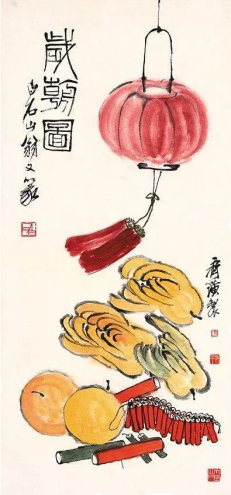

**绝密★启用前**

**2023年普通高等学校招生全国统一考试（新课标卷）**

**文科综合思想政治学科**

**一、选择题。**

1\. 马克思和恩格斯共同创立了科学社会主义，实现了社会主义从空想到科学的伟大飞跃。科学社会主义之所以是科学，是因为它（ ）

①对未来的共产主义社会进行了原则性描述

②对现存的资本主义社会进行了深刻的批判

③以唯物史观和剩余价值学说为理论基础

④找到了实现人类解放的社会力量和正确道路

A. ①② B. ①③ C. ②④ D. ③④

2\. 党的二十大报告强调，继续推进实践基础上的理论创新，首先要把握好新时代中国特色社会主义思想的世界观和方法论，坚持好、运用好贯穿其中的立场观点方法。必须坚持人民至上，必须坚持自信自立，必须坚持守正创新，必须坚持问题导向，必须坚持系统观念，必须坚持胸怀天下。“六个必须坚持”（ ）

①是新时代继续推进理论创新的科学方法

②实现了马克思主义中国化时代化新的飞跃

③是对中国之问、世界之问、人民之问、时代之问的系统回答

④是深刻领会习近平新时代中国特色社会主义思想必须把握的基本点

A. ①② B. ①④ C. ②③ D. ③④

3\. 2022年，国家知识产权局对全国20余个省（区、市）1万多个专利权人开展专利产业化过程中的主要制约因素专题调研。调研结果见图。

根据调研结果，要提高科技成果转化和产业化水平，政府应将重心放在（ ）

①加强专利技术交易市场或平台建设

②激励企业购买和引进国外专利技术

③吸纳社会资本、建设科研成果转化试验基地

④制定和完善专利产业化人才的培养和引进政策

A. ①② B. ①④ C. ②③ D. ③④

4\. 2023年政府工作报告指出，坚持以经济建设为中心，着力推动高质量发展。要实现高质量发展，需要转变发展方式、优化经济结构、转换增长动力。以下能直接促进我国经济结构优化的措施是（ ）

①坚持实施稳健的货币政策，保持物价水平总体稳定

②严格执行环保、质量、安全法规标准，淘汰落后产能

③强化金融稳定保障体系，依法规范和引导资本健康发展

④提高企业所得税征收中研发费用扣除比例，激发创新活力

A. ①② B. ①③ C. ②④ D. ③④

5\. 党的二十届二中全会通过的《党和国家机构改革方案》明确规定，中央社会工作部统一领导全国性行业协会商会党的工作，指导混合所有制企业、非公有制企业和新经济组织、新社会组织、新就业群体党建工作。在上述组织和群体中加强党建工作（ ）

①是夯实党的执政基础的需要

②是对政府机构职责的优化和调整

③有利于巩固和发展爱国统一战线

④能够进一步完善基层群众自治制度

A. ①② B. ①③ C. ②④ D. ③④

6\. 《第十三届全国人民代表大会第五次会议关于第十四届全国人民代表大会代表名额和选举问题的决定》规定：第十四届全国人民代表大会代表名额中，按照人口数分配的代表名额为2000名，省、自治区、直辖市根据人口数计算的名额数，按约每70万人分配1名。对上述规定理解正确的有（ ）

①我国公民享有平等的选举权

②全国人大代表通过等额选举产生

③我国选举制度坚持民主集中制原则

④全国人大代表由选民直接选举产生

A ①③ B. ①④ C. ②③ D. ②④

7\. “岁朝图”原是文人雅士为祈福新年而以鲜花、果蔬等为素材创作的绘画作品。到了近代，齐白石等绘画大师将“岁朝图”生活化、世俗化，他的“岁朝图”中寓意吉祥富贵的牡丹花绽放，鞭炮、红灯笼、酒杯等“俗物”汇聚，表达新年的喜悦和祝福，成为民众喜闻乐见的“年画”。人们喜欢齐白石“岁朝图”，是因为该作品（ ）

①充满民俗特色，展现传统节日欢庆氛围

②贴近民众生活，承载美好生活的精神追求

③反映作者理想，解构节日文化的传统内涵

④恪守传统风格，再现传统文化的清雅意蕴

A. ①② B. ①④ C. ②③ D. ③④

8\. 据中国科学院发布的嫦娥五号月球科研样品研究成果，月球最“年轻”玄武岩年龄为20亿年，表明月球在20亿年前仍存在岩浆活动，比以往月球样品限定的岩浆活动时间延长了约8亿年。该成果深化了人类对月球演化历史的认识，可见（ ）

①科学研究是推动认识发展的强大动力

②认识的发展是一个不断推翻前人认识的过程

③在继承基础上不断超越是真理发展的客观规律

④科学理论在一定条件下也能够检验认识的真理性

A. ①② B. ①③ C. ②④ D. ③④

9\. 据商务部统计，2023年1~3月，全国实际使用外资4084.5亿元人民币，同比增长4.9%。高技术产业实际使用外资1567.1亿元人民币，同比增长18%。其中，电子及通信设备制造、科技成果转化服务、研发与设计服务、医药制造领域引资分别增长55.7%、50.3%、24.6%和20.2%。据此可以判断（ ）

①中国经济加快转型升级，利用外资质量提升

②中国金融市场更加成熟，外商投资风险降低

③中国营商环境具有优势，对外资吸引力不减

④中国经济受外部冲击减弱，对外开放水平提高

A. ①② B. ①③ C. ②④ D. ③④

10\. 1993年至2023年1月，中国累计派出援助圭亚那医疗队18期263人次，在当地乔治敦公立医院、林登地区医院等开展医疗援助。为了帮助更多圭亚那民众，医疗队多次组织对偏远地区或弱势群体义诊活动，向孤儿院捐赠物资、赠送玩具和文具，为福利院儿童进行全面健康体检。开展对圭亚那的医疗援助（ ）

①增进了中圭两国的文化交流

②有助于改善圭亚那民生状况

③强化了中圭两国同盟关系

④创新了南南国家的合作形式

A. ①② B. ①③ C. ②④ D. ③④

11\. 某日，夏某到甲餐厅用餐，餐厅员工擅自将其品尝新菜的画面拍摄下来，并将照片作为宣传文章的内容发布在餐厅官方微信公众号上，照片中夏某的脸部和身体特征清晰可辨。夏某得知此事后，要求甲餐厅删除该照片，遭到拒绝。夏某遂向人民法院提起诉讼。对此，下列说法正确的是（ ）

①甲餐厅侵害了夏某的荣誉权

②甲餐厅侵害了夏某的肖像权

③甲餐厅发布的照片属于物证

④夏某与甲餐厅之间的诉讼属于民事诉讼

A. ①③ B. ①④ C. ②③ D. ②④

12\. 无农不稳，无粮则乱。无论社会现代化程度有多高，14亿多人口粮食和重要农产品稳定供给始终是头等大事。“只有把牢粮食安全主动权，才能把稳强国复兴主动权。”以引文中的判断为前提，可必然推出的结论是（ ）

①如果把牢了粮食安全主动权，则把稳了强国复兴主动权

②如果不能把牢粮食安全主动权，则不能把稳强国复兴主动权

③如果把稳了强国复兴主动权，则把牢了粮食安全主动权

④如果不能把稳强国复兴主动权，则不能把牢粮食安全主动权

A. ①② B. ①④ C. ②③ D. ③④

**二、非选择题**

13\. 阅读材料，完成下列要求。

宪法的生命在于实施，宪法的权威也在于实施。近年来，深圳、保定、南京等城市兴建宪法主题公园，以多种景观形式和宪法实践活动精彩呈“宪”。2022年12月9日对外开放的南京宪法公园，宪法主题雕塑、宣誓广场、宪法宣传教育展，亮点纷呈。其中，作为“宪之核”的宪法宣誓广场，于组合浮雕中凸显了“以人民为中心”的主旨。在江苏省暨南京市第五个“宪法宣传周”主题活动期间，律师向市民提供法律咨询服务；40名新入职的检察官、法官、行政执法人员，在市民的注视下进行宪法宣誓：“我宣誓，忠于中华人民共和国宪法，维护宪法权威……”

结合材料并运用《政治与法治》相关知识，阐述宪法主题公园的精彩呈“宪”对于坚持依宪治国、建设法治社会的作用。

14\. 阅读材料，完成下列要求。

2020年2月，党中央强调要尽快推动出台生物安全法，加快构建国家生物安全法律法规体系、制度保障体系。自2021年4月15日起，《中华人民共和国生物安全法》正式施行。

当前，在联合国、世界卫生组织框架下，国际社会围绕应对全球性重大新发突发传染病、防范生物武器和生物恐怖主义现实威胁、规范并促进生物科技研究应用、保护生物多样性等关键议题的讨论更趋深入。

习近平在博鳌亚洲论坛2022年年会上强调：“坚持统筹维护传统领域和非传统领域安全，共同应对地区争端和恐怖主义、气候变化、网络安全、生物安全等全球性问题．”

假如你将代表中国出席联合国安理会召开的生物安全会议，请拟一份发言提纲，简要阐明中国的立场。

15\. 阅读材料，完成下列要求。

胡凤益从小参与田间劳动，感受着农业劳作的限辛，梦想着“种一次就能年年收割”的庄稼。为圆少年时期的梦，上大学时他选择了农学专业，长期致力于“把一年生的水稻变成多年生的水稻”。2004年，胡凤益团队利用长雄野生稻无性繁殖特性，将多年生野生种和一年生栽培种杂交，选育出多年生后代群体，该成果获得云南省自然科学奖一等奖。培育多年生稻种的研究漫长又艰辛，他们克服了项目经费不足、田野工作辛苦等困难，目标在前却难见终点等困扰，坚持进行实地调查、科学实验、试验示范和理论研究，成功培育了一系列多年生稻栽培品种。多年生稻播种一次持续收获多年，具有广适、高产稳产等特点，节约了劳动力投入，减少了生产成本，提高了经济效益。2018年，他们培育的“多年生稻23”成为全球第一个商业化的多年生粮食作物品种，在国际多年生作物研发领域具有里程碑意义，2021年，胡风益团队“利用长雄野生稻无性繁殖特性培育多年生稻的方法”获得云南省技术发明奖一等奖。多年生稻研究成果入选美国《科学》杂志公布的2022年度十大科学突破榜单。

（1）运用价值观的知识并结合材料，分析胡凤益能够实现少年时期梦想的原因。

（2）运用《逻辑与思维》中创新思维的知识并结合材料，概括多年生稻培育过程中所运用到的思维方法的具体表现。（选择任意3项作答，若超过3项，只对前3项评分。）

| 思维方法 | 具体表现                                                                                           |
| ---- | ---------------------------------------------------------------------------------------------- |
| 联想思维 | \_\_\_\_\_\_\_\_\_\_\_\_\_\_\_\_\_\_\_\_\_\_\_\_\_\_\_\_\_\_\_\_\_\_\_\_\_\_\_\_\_\_\_\_\_\_   |
| 发散思维 | \_\_\_\_\_\_\_\_\_\_\_\_\_\_\_\_\_\_\_\_\_\_\_\_\_\_\_\_\_\_\_\_\_\_\_\_\_\_\_\_\_\_\_\_\_\_   |
| 聚合思维 | \_\_\_\_\_\_\_\_\_\_\_\_\_\_\_\_\_\_\_\_\_\_\_\_\_\_\_\_\_\_\_\_\_\_\_\_\_\_\_\_\_\_\_\_\_\_\_ |
| 逆向思维 | \_\_\_\_\_\_\_\_\_\_\_\_\_\_\_\_\_\_\_\_\_\_\_\_\_\_\_\_\_\_\_\_\_\_\_\_\_\_\_\_\_\_\_\_\_\_   |
| 超前思维 | \_\_\_\_\_\_\_\_\_\_\_\_\_\_\_\_\_\_\_\_\_\_\_\_\_\_\_\_\_\_\_\_\_\_\_\_\_\_\_\_\_\_\_\_\_\_   |

16\. 阅读材料，完成下列要求。

小张系成年人，为做生意向父亲老张借款10万元，在借条中承诺3年后归还。借款到期后，老张见小张生意红火，便要求小张还款。小张以父母有义务帮助扶持自己为由拒绝还款，并表示如果一定要还款则以后不照料老张的生活。老张无奈之下向人民调解委员会中请调解。

假如你是人民调解员，请运用《法律与生活》的相关知识，分析小张的做法和说法的不当之处，并给当事人提出两条解决纠纷的建议。
