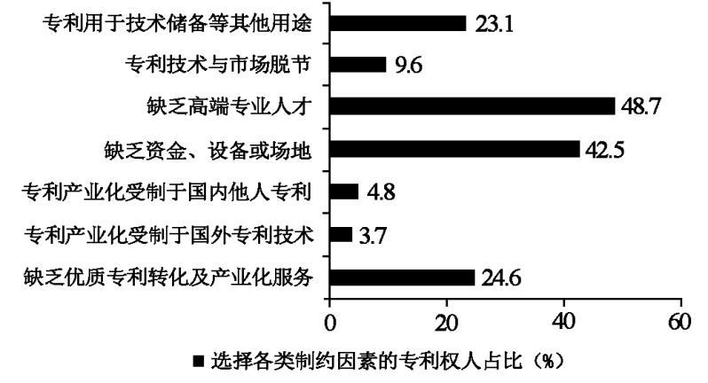

**绝密★启用前**

**2023年普通高等学校招生全国统一考试（新课标卷）**

**文科综合思想政治学科**

**一、选择题。**

1\. 马克思和恩格斯共同创立了科学社会主义，实现了社会主义从空想到科学的伟大飞跃。科学社会主义之所以是科学，是因为它（ ）

①对未来的共产主义社会进行了原则性描述

②对现存的资本主义社会进行了深刻的批判

③以唯物史观和剩余价值学说为理论基础

④找到了实现人类解放的社会力量和正确道路

A. ①② B. ①③ C. ②④ D. ③④

【答案】D

【解析】

【详解】③④：科学社会主义之所以科学，是因为它以唯物史观和剩余价值学说为理论基石，揭示了人类社会的一般规律和资本主义运行的特殊规律，找到了无产阶级这一实现人类解放的社会力量，指明了实现人类彻底解放的正确道路，这也是科学社会主义超越空想社会主义的地方。③④符合题意。

①②：空想社会主义也对资本主义社会进行了深刻的批判，对未来共产主义社会的图景进行了勾画，但他们主张阶级调和，反对阶级斗争，看不到广大人民群众特别是无产阶级的力量，没有找到社会变革的正确途径，因此这两个选项不能表明科学社会主义相对于空想社会主义的进步性，即不能说明其科学性，①②与题意不符。

故本题选D。

2\. 党的二十大报告强调，继续推进实践基础上的理论创新，首先要把握好新时代中国特色社会主义思想的世界观和方法论，坚持好、运用好贯穿其中的立场观点方法。必须坚持人民至上，必须坚持自信自立，必须坚持守正创新，必须坚持问题导向，必须坚持系统观念，必须坚持胸怀天下。“六个必须坚持”（ ）

①是新时代继续推进理论创新的科学方法

②实现了马克思主义中国化时代化新的飞跃

③是对中国之问、世界之问、人民之问、时代之问的系统回答

④是深刻领会习近平新时代中国特色社会主义思想必须把握的基本点

A. ①② B. ①④ C. ②③ D. ③④

【答案】B

【解析】

【详解】①④：“六个必须坚持”是新时代继续推进理论创新的科学方法，是深刻理解习近平新时代中国特色社会主义思想必须牢牢把握的基本点，也是继续推进理论创新必须始终坚持的基本点，①④符合题意。

②：习近平新时代中国特色社会主义思想是当代中国马克思主义，实现了马克思主义中国化新的飞跃。“六个必须坚持”并没有实现马克思主义中国化时代化新的飞跃，该选项夸大了“六个必须坚持”的地位和作用，②排除。

③：习近平新时代中国特色社会主义思想是对中国之问，世界之问，是人民之问，时代之问的系统回答，③与题意不符。

故本题选B。

3\. 2022年，国家知识产权局对全国20余个省（区、市）1万多个专利权人开展专利产业化过程中的主要制约因素专题调研。调研结果见图。

根据调研结果，要提高科技成果转化和产业化水平，政府应将重心放在（ ）

①加强专利技术交易市场或平台建设

②激励企业购买和引进国外专利技术

③吸纳社会资本、建设科研成果转化试验基地

④制定和完善专利产业化人才的培养和引进政策

A. ①② B. ①④ C. ②③ D. ③④

【答案】D

【解析】

【详解】③：调研结果中，缺乏资金设备或场地是专利产业化过程中的主要制约因素之一，占比42.5%，是各类制约因素中专利权人占比居第二位，因此政府有必要吸纳社会资本、建设科研成果转化试验基地，③正确。

④：调研结果中，缺少高端专业人才是专利产业化过程中的主要制约因素之一，占比48.7%，是各类制约因素中专利权人占比最高，因此政府有必要制定和完善专利产业化人才的培养和引进政策，④正确。

①：调研结果中，没有涉及专利技术交易市场或平台建设问题，①排除。

②：根据题意，要提高科技成果转化和产业化水平，政府主要抓好专利产业化人才的培养以及资金短缺问题，尤其是要做好高端人才的培养，独立自主自力更生地解决问题，而不是依赖购买和引进国外专利技术，②排除。

故本题选D。

4\. 2023年政府工作报告指出，坚持以经济建设为中心，着力推动高质量发展。要实现高质量发展，需要转变发展方式、优化经济结构、转换增长动力。以下能直接促进我国经济结构优化的措施是（ ）

①坚持实施稳健的货币政策，保持物价水平总体稳定

②严格执行环保、质量、安全法规标准，淘汰落后产能

③强化金融稳定保障体系，依法规范和引导资本健康发展

④提高企业所得税征收中研发费用扣除比例，激发创新活力

A. ①② B. ①③ C. ②④ D. ③④

【答案】C

【解析】

【详解】①：实施稳健的货币政策，保持物价水平总体稳定，与技术创新转型升级、经济结构优化无直接关联，①排除。

②：材料强调要转变发展方式、优化经济结构、转换增长动力，推动经济高质量发展。这对科技创新与质量提升方面提出了要求。严格执行环保、质量、安全法规标准，淘汰落后产能，能有效促进科技创新与质量提高，促进经济结构优化，②正确。

③：强化金融稳定与资本健康发展，与技术创新转型升级、经济结构优化无直接关联，③排除。

④：提高企业所得税征收中研发费用扣除比例，能有效激发企业创新活力，促进技术转型升级，实现科技创新和质量提高，促进经济结构优化，④正确。

故本题选C。

5\. 党的二十届二中全会通过的《党和国家机构改革方案》明确规定，中央社会工作部统一领导全国性行业协会商会党的工作，指导混合所有制企业、非公有制企业和新经济组织、新社会组织、新就业群体党建工作。在上述组织和群体中加强党建工作（ ）

①是夯实党的执政基础的需要

②是对政府机构职责的优化和调整

③有利于巩固和发展爱国统一战线

④能够进一步完善基层群众自治制度

A. ①② B. ①③ C. ②④ D. ③④

【答案】B

【解析】

【详解】①③：党的二十届二中全会通过的《党和国家机构改革方案》明确规定，要在混合所有制企业、非公有制企业和新经济组织、新社会组织、新就业群体加强党建工作。这有利于团结这类企业尤其是民企人士和个体经济人士，这是夯实党的执政基础的需要，有利于巩固和发展爱国统一战线，①③正确。

②：组建中央社会工作部是深化党中央机构改革的体现，不是对政府机构职责的优化和调整，②与题意不符。

④：材料中没有涉及完善基层群众自治制度，④排除。

故本题选B。

6\. 《第十三届全国人民代表大会第五次会议关于第十四届全国人民代表大会代表名额和选举问题的决定》规定：第十四届全国人民代表大会代表名额中，按照人口数分配的代表名额为2000名，省、自治区、直辖市根据人口数计算的名额数，按约每70万人分配1名。对上述规定理解正确的有（ ）

①我国公民享有平等的选举权

②全国人大代表通过等额选举产生

③我国选举制度坚持民主集中制原则

④全国人大代表由选民直接选举产生

A. ①③ B. ①④ C. ②③ D. ②④

【答案】A

【解析】

【详解】①③：第十三届全国人民代表大会作出了按照人口数分配十四届全国人民代表大会代表名额的相关规定，要求省、自治区、直辖市根据人口数计算名额数，这体现了我国公民享有平等的选举权，也说明我国选举制度坚持民主集中制原则，①③正确。

②：我国全国人大代表实行的是差额选举，②错误。

④：我国全国人大代表由选民间接选举产生，④错误。

故本题选A。

7\. “岁朝图”原是文人雅士为祈福新年而以鲜花、果蔬等为素材创作的绘画作品。到了近代，齐白石等绘画大师将“岁朝图”生活化、世俗化，他的“岁朝图”中寓意吉祥富贵的牡丹花绽放，鞭炮、红灯笼、酒杯等“俗物”汇聚，表达新年的喜悦和祝福，成为民众喜闻乐见的“年画”。人们喜欢齐白石“岁朝图”，是因为该作品（ ）

①充满民俗特色，展现传统节日的欢庆氛围

②贴近民众生活，承载美好生活的精神追求

③反映作者理想，解构节日文化的传统内涵

④恪守传统风格，再现传统文化的清雅意蕴

A. ①② B. ①④ C. ②③ D. ③④

【答案】A

【解析】

【详解】①②：近代齐白石等绘画大师将“岁朝图”生活化、世俗化，表达新年的喜悦和祝福，成为民众喜闻乐见的“年画”。人们之所以喜欢齐白石“岁朝图”，是因为该作品充满民俗特色，展现传统节日的欢庆氛围 ，贴近民众生活，承载美好生活的精神追求，这些正是民众期盼的，①②正确。

③：传统文化具有相对稳定性，在世代相传中仍保留着基本特征，其基本内涵是相对稳定的，而“解构”一词的意思是结构分解，即是把一个事物拆解，再重新建构分析，齐白石“岁朝图”并没有对节日文化的传统内涵进行解构，③排除。

④：齐白石等绘画大师将“岁朝图”生活化、世俗化，表达新年的喜悦和祝福，成为“年画”，这是对优秀传统文化的继承与发展，而不是恪守传统风格，④与题意不符。

故本题选A

8\. 据中国科学院发布的嫦娥五号月球科研样品研究成果，月球最“年轻”玄武岩年龄为20亿年，表明月球在20亿年前仍存在岩浆活动，比以往月球样品限定的岩浆活动时间延长了约8亿年。该成果深化了人类对月球演化历史的认识，可见（ ）

①科学研究是推动认识发展的强大动力

②认识的发展是一个不断推翻前人认识的过程

③在继承基础上不断超越是真理发展的客观规律

④科学理论在一定条件下也能够检验认识的真理性

A. ①② B. ①③ C. ②④ D. ③④

【答案】B

【解析】

【详解】①③：中国科学院发布的嫦娥五号月球科研样品研究成果深化了人类对月球演化历史的认识，由此可见，科学研究是推动认识发展的强大动力，同时也说明在继承基础上不断超越是真理发展的客观规律，①③符合题意。

②：认识的发展是自己否定自己，自己发展自己，并不是一个用新认识否定、代替已有认识的过程，而是对已有认识的超越。“不断推翻前人认识”说法错误，②排除。

④：实践是检验认识正确与否的唯一标准，科学理论不能够检验认识的真理性，④错误。

故本题选B。

9\. 据商务部统计，2023年1~3月，全国实际使用外资4084.5亿元人民币，同比增长4.9%。高技术产业实际使用外资1567.1亿元人民币，同比增长18%。其中，电子及通信设备制造、科技成果转化服务、研发与设计服务、医药制造领域引资分别增长55.7%、50.3%、24.6%和20.2%。据此可以判断（ ）

①中国经济加快转型升级，利用外资质量提升

②中国金融市场更加成熟，外商投资风险降低

③中国营商环境具有优势，对外资吸引力不减

④中国经济受外部冲击减弱，对外开放水平提高

A. ①② B. ①③ C. ②④ D. ③④

【答案】B

【解析】

【详解】①③：2023年1~3月，全国实际使用外资同比增长4.9%。其中，高技术产业实际使用外资同比增长18%。据此可以判断中国经济加快转型升级，利用外资质量提升，也可推断出中国营商环境具有优势，对外资吸引力不减，①③符合题意。

②：中国金融市场更加成熟，利用外资的数量和质量提升，但这并不意味着外商投资风险降低，②错误。

④：材料没有涉及中国经济受外部冲击减弱。材料中我国使用外资的状况可以说明我国具有一定的抗冲击能力，并不能说明中国经济受外部冲击减弱，④排除。

故本题选B。

10\. 1993年至2023年1月，中国累计派出援助圭亚那医疗队18期263人次，在当地乔治敦公立医院、林登地区医院等开展医疗援助。为了帮助更多圭亚那民众，医疗队多次组织对偏远地区或弱势群体的义诊活动，向孤儿院捐赠物资、赠送玩具和文具，为福利院儿童进行全面健康体检。开展对圭亚那的医疗援助（ ）

①增进了中圭两国的文化交流

②有助于改善圭亚那民生状况

③强化了中圭两国的同盟关系

④创新了南南国家的合作形式

A. ①② B. ①③ C. ②④ D. ③④

【答案】A

【解析】

【详解】①②：中国派出医疗队开展医疗援助，组织义诊活动，捐赠物资、赠送玩具和文具以及健康体检等，有利于增进中圭两国的文化交流，改善圭亚那民生状况，①②正确。

③：中国奉行独立自主的外交政策，不与任何国家结盟，中圭两国不属于同盟关系，③排除。

④：中国与圭亚那同属发展中国家，属于南南合作，但材料表明并没有创新合作形式，④排除。

故本题选A。

11\. 某日，夏某到甲餐厅用餐，餐厅员工擅自将其品尝新菜的画面拍摄下来，并将照片作为宣传文章的内容发布在餐厅官方微信公众号上，照片中夏某的脸部和身体特征清晰可辨。夏某得知此事后，要求甲餐厅删除该照片，遭到拒绝。夏某遂向人民法院提起诉讼。对此，下列说法正确的是（ ）

①甲餐厅侵害了夏某的荣誉权

②甲餐厅侵害了夏某的肖像权

③甲餐厅发布的照片属于物证

④夏某与甲餐厅之间的诉讼属于民事诉讼

A. ①③ B. ①④ C. ②③ D. ②④

【答案】D

【解析】

【详解】①：荣誉权，是指公民、法人所享有的，因自己的突出贡献或特殊劳动成果而获得的光荣称号或其他荣誉的权利。本案中不涉及夏某的荣誉权，甲餐厅并未侵害夏某的荣誉权，①不符合题意。

②：公民享有肖像权，未经肖像权人同意，不得制作、使用、公开肖像权人肖像，但是法律另有规定的除外。本案中，甲餐厅擅自拍摄夏某照片，并在无授权的情况下将该照片发布于微信公众号用作商业宣传，且在夏某提出删除的要求后予以拒绝，主观上具有侵权的故意，故甲餐厅侵害了夏某的肖像权，②正确。

③：物证是以物品或者文字为表现形式的实物证据，而本案中甲餐厅发布的照片是以数字化形式存储、处理、传输的，且能够证明案件事实的数据，属于电子数据证据，③说法错误。

④：民事诉讼解决平等主体之间的民事权利和义务纠纷。本案中夏某因肖像权被侵害，并与甲餐厅产生人身权利方面的民事纠纷，遂向人民法院提起的诉讼，属于民事诉讼，④正确。

故本题选D。

12\. 无农不稳，无粮则乱。无论社会现代化程度有多高，14亿多人口的粮食和重要农产品稳定供给始终是头等大事。“只有把牢粮食安全主动权，才能把稳强国复兴主动权。”以引文中的判断为前提，可必然推出的结论是（ ）

①如果把牢了粮食安全主动权，则把稳了强国复兴主动权

②如果不能把牢粮食安全主动权，则不能把稳强国复兴主动权

③如果把稳了强国复兴主动权，则把牢了粮食安全主动权

④如果不能把稳强国复兴主动权，则不能把牢粮食安全主动权

A. ①② B. ①④ C. ②③ D. ③④

【答案】C

【解析】

【详解】“只有把牢粮食安全主动权，才能把稳强国复兴主动权。”是一个必要条件假言判断，以该判断作为前提的推理属于必要条件假言推理。必要条件假言推理有两种有效式：否定前件式和肯定后件式。

①：该结论中，肯定了前件“把牢粮食安全主动权”，不能必然肯定后件“把稳强国复兴主动权”，属于必要条件假言推理的无效式，推理结构错误，①不符合题意。

②：该结论的推出使用了否定前件式，否定了前件“把牢粮食安全主动权”，一定能够否定后件“把稳强国复兴主动权”，属于必要条件假言推理的有效式，推理结构有效，结论正确，②符合题意。

③：该结论的推出使用了肯定后件式，肯定了后件“把稳强国复兴主动权”，一定能够肯定前件“把牢粮食安全主动权”，属于必要条件假言推理的有效式，推理结构有效，结论正确，③符合题意。

④：该结论中，否定了后件“把稳强国复兴主动权”，不能必然否定前件“把牢粮食安全主动权”，属于必要条件假言推理的无效式，推理结构错误，④不符合题意。

故本题选C。

**二、非选择题**

13\. 阅读材料，完成下列要求。

宪法的生命在于实施，宪法的权威也在于实施。近年来，深圳、保定、南京等城市兴建宪法主题公园，以多种景观形式和宪法实践活动精彩呈“宪”。2022年12月9日对外开放的南京宪法公园，宪法主题雕塑、宣誓广场、宪法宣传教育展，亮点纷呈。其中，作为“宪之核”的宪法宣誓广场，于组合浮雕中凸显了“以人民为中心”的主旨。在江苏省暨南京市第五个“宪法宣传周”主题活动期间，律师向市民提供法律咨询服务；40名新入职的检察官、法官、行政执法人员，在市民的注视下进行宪法宣誓：“我宣誓，忠于中华人民共和国宪法，维护宪法权威……”

结合材料并运用《政治与法治》相关知识，阐述宪法主题公园的精彩呈“宪”对于坚持依宪治国、建设法治社会的作用。

【答案】【参考版答案】①兴建宪法主题公园，精彩呈“宪”，彰显了宪法的国家根本大法的地位，宪法是一切组织和个人的根本活动准则，坚持依法治国首先坚持依宪治国。\
②宪法主题公园以多种景观形式和实践活动精彩呈“宪”，成为开展全民普法教育的宣传载体，有利于提高民众的宪法意识，推动全社会树立法治意识。\
③宪法主题公园精彩呈“宪”，国家机关工作人员开展宪法宣誓活动，有利于增强公职人员的宪法观念，树立宪法权威，坚持依宪治国，有助于提高社会法治化水平。\
④宪法主题公园精彩呈“宪”，在“宪法宣传周”期间，向市民提供法律咨询服务，有助于建设完备的法律服务体系，保证人民群众在遇到法律问题时获得有效的法律帮助。

【解析】

【分析】背景素材：南京宪法主题公园精彩呈“宪”

考点考查：政治与法治的相关知识

能力考查：描述和阐释事物、论证和探究问题

核心素养：政治认同、法治意识、公共参与

【详解】第一步：审设问。明确主体、作答范围、问题限定和作答角度。

本题属于意义类主观题，需要调用依宪治国、建设法治社会的有关知识，从宪法的地位、建设法治社会的措施等角度展开作答。

第二步：审材料。提取关键词，链接教材知识。

关键词①：宪法的生命、权威在于实施，各地兴建宪法主题公园，精彩呈“宪”→可联系宪法的地位，坚持依法治国首先坚持依宪治国。

关键词②：以多种景观形式和宪法实践活动精彩呈“宪”、宪法宣传教育展→可联系建设法治社会，深入开展法治宣传教育，推动全社会树立法治意识。

关键词③：新入职的检察官、法官、行政执法人员，在市民的注视下进行宪法宣誓→可联系建设法治社会，支持各类社会主体自我约束和管理，提高社会法治化水平。

关键词④：向市民提供法律咨询服务→可联系建设法治社会，建设完备的法律服务体系，为人民群众提供法律帮助。

第三步：整合信息，组织答案。注意设问限定以及教材知识与材料信息等相结合。

14\. 阅读材料，完成下列要求。

2020年2月，党中央强调要尽快推动出台生物安全法，加快构建国家生物安全法律法规体系、制度保障体系。自2021年4月15日起，《中华人民共和国生物安全法》正式施行。

当前，在联合国、世界卫生组织框架下，国际社会围绕应对全球性重大新发突发传染病、防范生物武器和生物恐怖主义现实威胁、规范并促进生物科技研究应用、保护生物多样性等关键议题的讨论更趋深入。

习近平在博鳌亚洲论坛2022年年会上强调：“坚持统筹维护传统领域和非传统领域安全，共同应对地区争端和恐怖主义、气候变化、网络安全、生物安全等全球性问题．”

假如你将代表中国出席联合国安理会召开的生物安全会议，请拟一份发言提纲，简要阐明中国的立场。

【答案】【参考版答案】主题：保护全球生态安全，中国在行动\
要点：①联合国在维护世界和平、推动共同发展、促进人类文明进步等方面发挥重要作用。国际组织可以促进国际社会在政治、经济、文化等领域开展交流、协调、合作,调停和解决国际政治冲突和经济纠纷,促进世界和平与发展。②维护世界和平，促进共同发展是我国外交政策的基本目标。中国特色的大国外交。③构建人类命运共同体的必要性，中国在构建人类命运共同体上的主张与实践。④和平与发展是当今时代的主题。

【解析】

【分析】背景素材：我国级国际社会关于生物安全的努力

考点考查：联合国和国际组织作用、时代主题、构建人类命运共同体、中国外交政策及其实践的相关知识

能力考查：描述和阐释事物、论证和探究问题

核心素养：政治认同、科学精神、法治意识、公共参与

【详解】第一步：审设问。明确主体、知识范围、问题限定和作答角度。本题要求考生以中国代表的身份拟写在联合国安理会召开的生物安全会议上的发言提纲，简要阐明中国的立场。试题具有开放性，考生可从联合国的作用、国际组织的作用、中国外交政策、人类命运共同体、时代主题等角度分析作答。

第二步：审材料。提取关键词，链接教材知识。

关键词①：在联合国、世界卫生组织框架下→可联系联合国作用、国际组织的作用的角度分析。

关键词②：中国倡导“坚持统筹维护传统领域和非传统领域安全，共同应对地区争端和恐怖主义、气候变化、网络安全、生物安全等全球性问题”→可联系中国的外交政策、中国外交实践的角度分析。

关键词③：国际社会共同应对生物领域全球性问题→可联系人类命运共同体、时代主题的角度分析。

第三步：整合信息，组织答案。注意设问限定以及教材知识与材料、时政信息等相结合。

15\. 阅读材料，完成下列要求。

胡凤益从小参与田间劳动，感受着农业劳作的限辛，梦想着“种一次就能年年收割”的庄稼。为圆少年时期的梦，上大学时他选择了农学专业，长期致力于“把一年生的水稻变成多年生的水稻”。2004年，胡凤益团队利用长雄野生稻无性繁殖特性，将多年生野生种和一年生栽培种杂交，选育出多年生后代群体，该成果获得云南省自然科学奖一等奖。培育多年生稻种的研究漫长又艰辛，他们克服了项目经费不足、田野工作辛苦等困难，目标在前却难见终点等困扰，坚持进行实地调查、科学实验、试验示范和理论研究，成功培育了一系列多年生稻栽培品种。多年生稻播种一次持续收获多年，具有广适、高产稳产等特点，节约了劳动力投入，减少了生产成本，提高了经济效益。2018年，他们培育的“多年生稻23”成为全球第一个商业化的多年生粮食作物品种，在国际多年生作物研发领域具有里程碑意义，2021年，胡风益团队“利用长雄野生稻无性繁殖特性培育多年生稻的方法”获得云南省技术发明奖一等奖。多年生稻研究成果入选美国《科学》杂志公布的2022年度十大科学突破榜单。

（1）运用价值观的知识并结合材料，分析胡凤益能够实现少年时期梦想的原因。

（2）运用《逻辑与思维》中创新思维的知识并结合材料，概括多年生稻培育过程中所运用到的思维方法的具体表现。（选择任意3项作答，若超过3项，只对前3项评分。）

| 思维方法 | 具体表现                                                                                           |
| ---- | ---------------------------------------------------------------------------------------------- |
| 联想思维 | \_\_\_\_\_\_\_\_\_\_\_\_\_\_\_\_\_\_\_\_\_\_\_\_\_\_\_\_\_\_\_\_\_\_\_\_\_\_\_\_\_\_\_\_\_\_   |
| 发散思维 | \_\_\_\_\_\_\_\_\_\_\_\_\_\_\_\_\_\_\_\_\_\_\_\_\_\_\_\_\_\_\_\_\_\_\_\_\_\_\_\_\_\_\_\_\_\_   |
| 聚合思维 | \_\_\_\_\_\_\_\_\_\_\_\_\_\_\_\_\_\_\_\_\_\_\_\_\_\_\_\_\_\_\_\_\_\_\_\_\_\_\_\_\_\_\_\_\_\_\_ |
| 逆向思维 | \_\_\_\_\_\_\_\_\_\_\_\_\_\_\_\_\_\_\_\_\_\_\_\_\_\_\_\_\_\_\_\_\_\_\_\_\_\_\_\_\_\_\_\_\_\_   |
| 超前思维 | \_\_\_\_\_\_\_\_\_\_\_\_\_\_\_\_\_\_\_\_\_\_\_\_\_\_\_\_\_\_\_\_\_\_\_\_\_\_\_\_\_\_\_\_\_\_   |

【答案】（1）【参考版答案】①价值观具有重要的导向作用，要树立正确的价值观，做出正确的价值判断和价值选择。②价值观是人生的重要向导，要选择正确的人生道路和生活方式。胡凤益从小就有“种一次就能年年收割”的梦想，这正确指引着他进行高考专业的选择，又在长期地坚持研究、试验，终于获得多年生稻栽培品种的成功培育，实现少年时期梦想。③社会主义核心价值观的基本内容为培育和践行社会主义核心价值观提供了基本遵循，胡凤益坚持自己的职业选择，克服诸多困难，长期躬耕于多年生稻的培育，取得丰硕研究成果的同时为我国水稻事业发展做出杰出贡献，使社会主义核心价值观内化为自己的精神追求，外化为自己的自觉行动，实现少年时期梦想。④正确的价值判断和价值选择应自觉遵循社会发展的客观规律、自觉站在最广大人民的立场上，胡凤益为减轻稻农的艰辛，长期探索多年生稻的生长发育规律，最终获得研究成果，实现少年时期梦想。⑤实现人生价值需要弘扬劳动精神，努力奉献，需要充分发挥主观能动性、顽强拼搏、自强不息，需要有坚定的理想信念,需要正确价值观的指引。胡凤益长期致力于水稻研究，克服困难，突破困扰，终于取得重大研究成果并获得国内外认可，实现了少年时期梦想。

（2） ①. 【参考版答案】想象：胡凤益从小参与田间劳动，感受着农业劳作的限辛，梦想着“种一次就能年年收割”的庄稼。 ②. 【参考版答案】调整工作的方向角度，从传统的一年生栽培，向多年生栽培的转化，将多年生野生种和一年生栽培种杂交，选育出多年生后代群体。 ③. 【参考版答案】演绎推理方法：利用长雄野生稻无性繁殖特性，将多年生野生种和一年生栽培种杂交，选育出多年生后代群体。 ④. 【参考版答案】与别人做法不同，他长期致力于“把一年生的水稻变成多年生的水稻”。 ⑤. 【参考版答案】注重调查研究：坚持进行实地调查、科学实验、试验示范和理论研究，成功培育了一系列多年生稻栽培品种。

【解析】

【分析】背景素材：胡凤益团队进行多年生稻种的研究与培育

考点考查：价值观的相关知识、创新思维的方法

能力考查：获取和解读信息、描述和阐释事物、调动和运用知识

核心素养：政治认同、科学精神

【小问1详解】

第一步：审设问。明确主体、知识范围、问题限定和作答角度。本题要求运用价值观的知识并结合材料，分析个人实现梦想的原因。

第二步：审材料。提取关键词，链接教材知识。

关键词①：运用价值观的知识→可联系价值观的导向作用原理及其方法论的角度分析。

关键词②：梦想着“种一次就能年年收割”庄稼，为圆此梦，进行高考志愿选择，并为之奋斗→可联系价值观的导向作用（人生道路和生活方式）的角度分析。

关键词③：胡凤益坚持自己的职业选择，克服诸多困难，长期躬耕于多年生稻的培育，取得丰硕研究成果的同时为我国水稻事业发展做出杰出贡献→可联系社会主义核心价值观的角度分析。

关键词④：胡凤益为减轻稻农的艰辛，长期探索多年生稻的生长发育规律，最终获得研究成果→可联系正确的价值判断和价值选择的角度分析。

关键词⑤：胡凤益长期致力于水稻研究，克服困难，突破困扰，终于取得重大研究成果并获得国内外认可→可联系人生价值的创造与实现的角度分析。

第三步：整合信息，组织答案。注意设问限定以及教材知识与材料信息等相结合。

【小问2详解】

第一步：审设问。明确主体、知识范围、问题限定和作答角度。试题要求概括胡凤益团队研究和培育多年生稻培育的过程中所运用到的创新思维的方法的具体表现。

第二步：审材料。提取关键词，链接教材知识。

关键词①：胡凤益从小参与田间劳动，感受着农业劳作的限辛，梦想着“种一次就能年年收割”的庄稼。利用长雄野生稻无性繁殖特性，将多年生野生种和一年生栽培种杂交，选育出多年生后代群体→可联系联想思维中的想象、逆向思维中的转换型逆向思维法的角度分析。

关键词②：将多年生野生种和一年生栽培种杂交，选育出多年生后代群体→可联系发散思维中的信息交合法、聚合思维中的演绎推理方法的角度分析。

关键词③：注重调查研究：坚持进行实地调查、科学实验、试验示范和理论研究，成功培育了-一系列多年生稻栽培品种→可联系超前思维中的注重调查研究的角度分析。

第三步：整合信息，组织答案。注意设问限定以及教材知识与材料信息等相结合。

16\. 阅读材料，完成下列要求。

小张系成年人，为做生意向父亲老张借款10万元，在借条中承诺3年后归还。借款到期后，老张见小张生意红火，便要求小张还款。小张以父母有义务帮助扶持自己为由拒绝还款，并表示如果一定要还款则以后不照料老张的生活。老张无奈之下向人民调解委员会中请调解。

假如你是人民调解员，请运用《法律与生活》的相关知识，分析小张的做法和说法的不当之处，并给当事人提出两条解决纠纷的建议。

【答案】【参考版答案】①履行是合同当事人按照合同约定实现各自权利义务的行为。根据民法典的规定，当事人应当按照约定全面履行自己的义务。小张系成年人，为做生意向父亲老张借款10万元，在借条中承诺3年后归还，应该履行合同义务，到期还款。\
②父母对丧失劳动能力、尚在读的、确无独立生活能力和条件的成年子女负有抚养义务，但父母对具有独立生活能力和条件的成年子女一般是没有抚养义务的。小张认为父母有义务帮助扶持自己的说法错误，应及时把借款还给父母。\
③成年子女对父母负有赡养、扶助和保护的义务，小张以还款为由拒绝照料老张生活的做法是错误的，必须承担起赡养父母的责任。\
④建议：通过人民调解委员会进行调解、通过民事诉讼解决纠纷。

【解析】

【分析】背景素材：成年人小张向父亲借款不还引发的民事纠纷

考点考查：法律与生活的相关知识

能力考查：获取和解读信息、调动和运用知识、描述和阐释事物

核心素养：政治认同、法治意识

【详解】第一步：审设问。明确题型、作答范围、问题限定和作答角度。本题为说明类、措施类主观题，要求运用法律与生活的相关知识，分析小张的做法和说法的不当之处并给当事人提出两条解决纠纷的建议。

第二步：审材料，通过标点符号、段落等，提取材料有效信息。

有效信息①：小张以父母有帮助扶持自己的义务为由拒绝还款→可调用的法理依据：根据民法典的规定，当事人应当按照约定全面履行自己的义务。《中华人民共和国民法典》第二十六条规定：父母对未成年子女负有抚养、教育和保护的义务。对于具有独立生活能力和条件的成年子女一般是没有抚养义务的。

有效信息②：小张以还款为由拒绝照料老张生活→可调用的法理依据：《中华人民共和国民法典》第二十六条规定：成年子女对父母负有赡养、扶助和保护的义务。本案中，小张以一定要还款就不照料老张生活的做法，是错误的，必须承担起赡养父母的责任。

有效信息③：老张无奈之下，向人民调解委员会申请调解→可联系多元解决纠纷的方式：通过人民调解委员会进行调解；通过民事诉讼解决纠纷。

第三步：整合信息，组织答案。组织答案时，要符合一定逻辑，体现层次感、段落化，并且注重使用学科术语。
