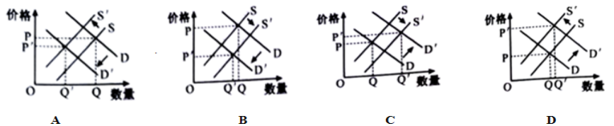

**2023年6月江苏普通高校招生选考政治**

**一、单项选择题：共15题，每题3分，共45分。每题只有一个选项最符合题意。**

1.党的二十大报告系统总结了新时代十年的伟大变革。某校高三学生在学习这一内容时，特别关注了其中关于理论成就的一段论述：

我们创立了新时代中国特色社会主义思想，明确坚持和发展中国特色社会主义的一系列治国理政新理念新思想新战略，实现了马克思主义中国化时代化一创新理论武装头脑、指导实践、推动工作，为新时代党和国家事业发展提供了根本遵循。

根据这段论述，我们可以概括出该理论成就的时代价值是：

A.凝练了党和人民的实践经验和集体智慧

B.提供了新时代党和国家事业发展的行动指南

C.彰显了中国特色社会主义制度 优势和时代特点

D.成功在新形势下坚持和发展了中国特色社会主义

2.当代资本主义国家通过大力推进科技创新提高劳动生产率、降低生产成本，一定程度摆脱了2008年国际金融危机的影响。据此，有观点认为，资本主义可以通过科技创新避免经济危机的发生。这一观点：

A.肯定了生产关系对生产力具有反作用

B.否定了资本主义社会基本矛盾不可克服

C.否定了资本主义社会具有自我调节的功能

D.肯定了社会主义取代资本主义是一个漫长的过程

3.新业态发展到哪里，党的组织和服务工作就推进到哪里。某地通过成立行业党建联盟为新就业群体提供各种暖心服务，并聘请他们担任红色物业监督员、社区兼职网格员。新就业群体在感受温暖、承担责任的过程中真正融入了社区。该地的做法：

①发挥了基层党组织的战斗堡垒作用

②体现了我国基层群众自治制度的显著特点         

③推动了共建共治共享社会治理共同体的建设

④提升了群众参与民主监督和民主决策的能力

A.①③       B.①④      C.②③       D.②④

4.为让提案立得住、能办理、做得到，某市政协多举措推进提案工作提质增效：严把提案质量关，淘汰不合格提案；优化移动履职平台，让提案的全流程都可以在网上办理；对提案办理答复为“不满意”的提案开展专题督办。该市政协这些措施：

A.发挥了政协参政议政职能，增强了立法的民主性

B.适应了协商民主制度化、规范化发展的客观要求

C.通过民主管理在建言资政和凝聚共识上双向发力

D.通过践行全过程人民民主保障人民享有更多民主权利

5.“温馨斋”私点作为老字号有较好的品牌声誉，当地消费者提起它就想起特殊的风味。后来当地某糕点铺使用“温馨居”字号，并在店铺招牌标注“童年的味道”。案例中该店铺：

A.行为构成不正当竞争       B.侵害了老字号的商标权

C.没有违背公序良俗和公共利益   D.使用“温馨居”字号应先注册商标

6.赵某与荀某育有一子赵甲，一女赵乙。荀某去世后，因赵甲长期在外地工作，赵乙照顺赵某的衣食起居。2016年2月，赵某自己写了一份遗嘱，内容为房子留给赵甲，存款留给赵乙。2018年5月，赵某又让人代写了一份遗嘱，并请邻居张某、李某担任见证人，遗嘱载明房子、存款均由赵乙继承。2022年11月，赵某去世。按法律规定，赵某遗产的分配应该是：

A.按照法定继承平均分配     B.赵甲、赵乙通过协商分配

C.房子给赵甲，存款给赵乙    D.房子、存款均由赵乙继承

7.马克思和恩格斯在《德意志意识形态》中指出：“国家内部的一切斗争——民主政体、贵族政体和君主政体相互之间的斗争，争取选举权的斗争等等，不过是一些虚幻的形式……在这些形式下进行着各个不同阶级间的真正的斗争。”对此理解正确的是：

A.国家是阶级矛盾不可调和的产物和表现

B.政权组织形式是多种因素综合作用的结果

C.各种形式政体都服务于统治阶级根本利益

D.利益集团无法从根本上解决不同阶级间的矛盾

8.《里斯本条约》规定，欧盟任何举措都不能影响成员国的权利，涉及欧盟的重大决议需要由政府间机构和成员国来制定。俄乌冲突爆发后，欧盟委员会推进能源自主和绿色转型的努力一方面受到“美国优先”的制约，另一方面受到成员国不同的能源结构、内部政策分歧等因素的影响，欧盟的共同能源和气候政策呈现出矛盾性的特征。材料说明：

A.国际组织参与国际事务受诸多因素制约而有局限性

B.以和平的方式解决国际争端是世界发展的前提条件

C.国际组织可以促进国际社会在各个领域开展合作

D.强大的国家综合实力是维护国家利益的有力保障

9.近年来，为应对一些西方国家挑起的“芯片战”,我国芯片企业积极进行科技攻关。伴随着国产芯片技术的进步和国产替代进程的加速，芯片企业业绩普遍好转。在其他条件不变的情况下，下图中(D、S分别代表需求曲线和供给曲线，P、Q分别代表价格和数量)能够反映我国国产芯片市场变化结果的是：

10.高质量发展是全面建设社会主义现代化国家的首要任务，也是中国式现代化的本质要求。我们要坚持以高质量发展为主题，推动经济实现质的有效提升和量的合理增长。下列传导路径中，能推动我国经济高质量发展的是：

A.完善产权保护制度→优化营商环境→扩大我国对外投资规模

B.增加银行存款准备金→增加货币供给量→扩大国内消费需求

C.构建国内统一大市场→促进要素自由流动→缩小居民收入差距

D.整合国有企业资源→优化国有经济结构→提升国有资本配置效率

11.有学者认为，中国纪录片在跨文化交流中，自信应该成为国际传播的底色，只有自信才会用逻辑讲述真实的故事；而共情是国际传播的基调，只有共情才能以情感传递共同价值。这一观点强调，提高中国纪录片国际传播力应该：

A.立足中国国情展示中华文化的魅力        B.在交流交融中推动世界文化的繁荣

C.推动中华优秀传统文化的传承创新        D.坚持文化的民族性和世界性的统一

12.春天的微风中飘散的不仅仅有花粉，一些植物病毒也可以借着花粉在花与花之间传播。某大学研究团队发现，在农业区采集的花朵携带着100多种不同病毒的基因组片段，而来自人类活动较少的草原上的花朵仅携带12种病毒。该团队认为，如果一块农田的植物物种趋于同质化，就可能使更多的病毒寄居在这里。得出这一结论是运用了：

A.求同法      B.求异法    C.类比推理      D.演绎推理

13.“夕照红于烧，晴空碧胜蓝”的景象早已深入人心。日出、日落时分，太阳接近地平线，在大气中只有极小尺寸的微尘时会发生瑞利散射，蓝色光被散射到其他位置，剩下的主要是直射的红色光，此时的太阳是红色的。然而在沙尘暴袭来时，人们会看到一种截然不同的夕阳景色——白色的太阳，这是由于浮尘颗粒较大产生无显色效应的米氏散射造成的。材料说明，正确认识事物需要：

A.运用联想思维  B.运用形象思维  C.把握事物的本质   D.由思维抽象到思维具体

14.下图漫画《分》中蕴含的哲学道理是：

A.事物量变会引起质变       B.要着重抓住事物的主要矛盾

C.事物发展是辩证否定的      D.要看到事物发展道路的曲折性

15.动物实验一直是人类测试、评估药物有效性和安全性的主要方法，过去两个世纪对猩猩、猴子等非人灵长类动物开展的实验，让人们意识到实验会给动物带来痛苦。随着数据分析、细胞建模、类器官、器官芯片等技术的进步，对药物安全性与有效性的考量不必再完全依赖于动物实验。材料说明：

①人们改造客观世界的同时也改造着主观世界

②实践是检验认识是否具有真理性 唯一标准

③正确的理论对社会实践具有积极的指导作用

④实践的发展为人们提供日益完善的认识工具

A.①②      B.①④       C.②③       D.③④

**二、非选择题：共5题，共55分。**

16.阅读材料，回答问题。

丁某(出租方)与15岁的赵某(承租方)于2022年8月25日签订《车辆租赁合同》,合同约定：丁某自2022年8月25日17时起将车辆交付给赵某使用，至2022年8月26日17时收回。租金共计人民币550元。

赵某在租赁车辆期间因操作不当造成车辆损坏。丁某认为，赵某损坏车辆造成损失，必须进行赔偿。赵某的父母认为，赵某所签合同没有经过父母同意或追认，丁某不应该出租车辆给赵某，责任应该由丁某承担。在协商无果的情况下，双方决定通过调解的方式解决纠纷。

**如果你是调解员，请运用《法律与生活》知识，就该案中各方的法律责任进行简要分析。** 

17.阅读材料，回答问题。

随着数字技术的发展，数据跨境流动日益频繁。2016年以来，由少数西方国家主导的《全面与进步跨太平洋伙伴关系协定》《数字经济伙伴关系协定》等协定开始包含数据跨境流动规则。但是由于部分国家搞排他性“小圈子”“筑墙设垒”,无视中国等多数国家的正当关切，数据跨境流动引发的国家安全问题没有得到很好解决。

近年来，就数据跨境流动治理，我国一方面积极完善《数据出境安全评估办法》等国内立法，正式申请加入《全面与进步跨太平洋伙伴关系协定》《数字经济伙伴关系协定》,积极推进数据治理国际合作，在确保数据安全的前提下推进数据有序流动；另一方面作为数字经济大国，以《全球数据安全倡议》为基础积极参与并推动跨境数据流动国际规则的制定，弥合数字鸿沟。

**结合材料，运用《当代国际政治与经济》知识，分析中国推动国际数据治理体系变革的原因。**

** **

18.阅读材料，回答问题。

面对社会治理中遇到的诸多困难和挑战，我国扩大了地方立法权。全国人大常委会既要监督地方立法，又要促进地方立法。推进备案审查工作不仅可以对违背上位法的规定进行纠正，还可以支持地方开展地方立法探索，从而推动有关方面完善法律法规制度。

**案例1 **某省物业管理条例规定“按时缴纳 物业费等相关费用”是小区业主参选业主委员会的前提条件之一。A市居民对此提出审查建议，认为这与民法典和国务院《物业管理条例》有关规定相抵触。接到审查建议，全国人大常委会法工委立即启动审查程序，并进行了回应：经过审查，以业主未按时缴纳物业费限制业主参选业主委员会，缺乏上位法依据，不符合立法原意和法治精神，制定机关应对相关规定进行修改。

**案例2 **针对非机动车事故发生率、伤亡率高，具有较大社会危害性的新情况，B市出台了非机动车安全管理条例。该市居民提出审查建议，认为条例中对于驾驶无号牌非机动车行为的处罚力度超出了道路交通安全法的相关处罚规定。全国人大常委会法工委启动审查程序并作出结论：该规定是地方人大基于管理需要对非机动车上道路行驶的新情况、新问题作出的回应，既符合法律的原则和精神，又一定程度补足了法律规定的滞后。

**结合材料并运用《政治与法治》知识，分析全国人大常委会法工委为什么既要维护法治统一，又要鼓励地方创造性开展地方立法工作。**

 

19.阅读材料，回答问题。

党的二十大报告指出，要深入推进环境污染防治，全面实行排污许可制，健全现代环境治理体系。某校党的二十大精神学习小组同学搜集相关资料，对“全面实行排污许可制”进行探究。

**【名词解析】**

排污许可制是依法规范企事业单位排污行为的环境管理制度。按照这一制度，实行排污许可管理的企事业单位应当按照排污许可证的要求排放污染物，未取得排污许可证的，不得排放污染物。排污权交易是指在污染物排放总量控制指标确定的条件下，分配污染物排放权利即排污权，并允许这种权利进行交易，以此控制污染物的排放。

**【案例链接】**

某市甲乙两家企业初始污染量分别为800单位、500单位，其单位污染治理成本分别为2.5万元、1万元。为降低污染水平，政府分别分配给甲、乙企业400单位的可交易排污权。在市场交易中，1单位排污权价格为2万元。甲向乙买入400单位排污权，支付一定成本，获得了排污权；乙卖出400单位排污权，虽增加了400单位治污责任，但获得了一定收益。

**请计算通过该交易甲企业节省的治污成本和乙企业增加的净收益；并运用《经济与社会》知识，分析实行排污权交易是如何促进环境污染防治的。**

 

20.阅读材料，回答问题

古遗址是认识中华文明形成与发展的重要物质载体。做好保护利用，让文化遗产活起来， 建设古遗址公园是较好的选项。在某古遗址公园建设讨论会上，围绕保护利用中村民是否应该搬迁的问题，与会者表达了不同的观点。

甲方：建设古遗址公园可将村民及其房屋纳入规划设计，村民房屋适当改造后可作 为基础设施并提供必要服务，村民也可参与文物保护利用工作，实现村民及其房屋与古遗址公园的融合共生，村民不必搬迁。

乙方：一处古遗址就是这个地区物质文化历史的数据库，是中华文明基因库的重要 组成部分。只要村民留在公园里，就容易造成遗址被破坏，对当地村民进行搬迁，该处古遗址将得到很好保护。

**（1）结合材料，运用唯物辩证法的相关知识，说明甲方不赞成搬迁的理由。**

** **

**（2）运用《逻辑与思维》知识，分析乙方推理的逻辑谬误。**

** **

**2023年6月江苏普通高校招生选考**

**政治参考答案**

**一、单项选择题：共15题，每题3分，共45分。每题只有一个选项最符合题意。**

1.B 2.B 3.A 4.B 5.A 6.D 7.C 8.A

9.C 10.D 11.D 12.B 13.A 14.D 15.B

**二、非选择题：共5题，共55分。**

16.①承租人赵某在签订合同时未满18周岁，为限制民事行为能力人，其签订合同的行为未经过其法定代理人的同意和追认，原告丁某与被告赵某签订的《车辆租赁合同》应为无效合同，丁某不应该出租车辆给赵某。

②被告赵某在租赁车辆期间因操作不当造成车辆损坏，存在过错，但被告赵某系未成年人未取得驾驶证，丁某签订《车辆租赁合同》时未对其驾驶资格进行审查便将车辆向其交付，也存在一定的过错，但是，综合考虑本案情况，被告赵某的过错程度较大。

③“无民事行为能力人、限制民事行为能力人造成他人损害的，由监护人承担侵权责任。监护人尽到监护职责的，可以减轻其侵权责任。”对于原告丁某主张的损失赔偿，应由被告赵某的父母承担大部分责任。\
17.①数据跨境流动日益频繁会对国家安全、主权管辖等带来一定挑战，而数据跨境流动规则无法解决数据跨境流动引发的各国在国家安全、主权管辖等方面的重大关切和规制分歧，推动国际数据治理体系变革是我国坚持总体国家安全观的必然要求。

②当今国际竞争的实质是以经济、科技实力为基础的综合国力的较量，推动国际数据治理体系变革有利于我国发展更高层次开放型经济，激发数字经济活力，更好参与全球竞争。

③我国始终高举多边主义火炬，倡导全人类共同价值，坚定维护以联合国为核心的国际体系和以国际法为基础的国际秩序，积极参与数字治理体系建设，主张构建网络空间命运共同体，完善全球治理，为推动国际数据治理体系变革提出中国方案，注入中国力量，是我国承担国际责任的体现。

18.①维护法制统一、尊严、权威，发挥法律应有的统一规范和约束作用。对A市与民法典和国务院有关规定相抵触的部分，全国人大常委会法工委责令修改，维护了国家法律的权威。

②增强治理的整体性，完善国家治理体系，提升国家治理水平和治理能力。承认B市符合法律的原则和精神的条例，弥补法律规定的滞后，形成完备的法律规范体系、高效的法治实施体系、有力的法治保障体系，有利于提高我国法治体系的整体效能。

③科学立法，提升立法的质量，更加扎实地推进依法治国。面对社会治理中遇到的诸多困难和挑战，我国扩大了地方立法权，顺应了经济社会发展要求，维护了最广大人民根本利益。

④推进国家重大发展战略的实施，促进区域协调发展，推动生态文明建设，实现高质量发展。根据国家治理需要，按照民主集中制原则，科学合理地配置国家机关的权力与责任，实现了党的领导、人民当家作主和依法治国的有机统一，有利于实现高质量发展。

19.（1）甲企业初始污染量为800单位，其单位污染治理成本为2.5万元，甲企业污染治理成本为800×2.5=2000万元。政府分配给甲的可交易排污权为400单位，则甲还需要投入的排污治理成本为400×2.5=1000万元，甲向乙购买了400的可交易排污权，可交易排污权需要支付400×2=800万元，甲节约了1000-800=200万元的治污成本。

乙企业初始污染量500单位，其单位污染治理成本为1万元。得出乙的治污成本为500×1=500万元。乙将政府分配给本企业的400单位可交易排污权卖给甲，1单位排污权价格为2万元，获利400×2=800万元，则乙企业的净收益是300万元。

（2）实行排污权交易，贯彻落实绿色发展理念，充分发挥市场在配置环境资源中的决定性作用，通过价格、供求、竞争机制起作用，引导企业加大排污治理，促使部分重污染、低产值企业主动关停转产，促进了新型环保节能项目的启动，加速了产业结构的调整，提升了产业技术水平，从而促进环境质量得到切实改善。

20.（1）①系统优化方法的原理要求我们用综合的思维方法来认识事物。着眼于事物的整体性，遵循系统内部的有序性，注重系统内部结构的优化趋向。

②立足整体，将村民及其房屋纳入整体规划设计；村民房屋适当改造后可作为基础设施并提供必要服务，村民参与到文物保护利用工作，实现了古遗址公园内部构成要素的有序性，实现村民及其房屋与古遗址公园的融合共生，遵循了系统内部结构的优化趋向，提高古遗址公园保护的整体价值。

（2）演绎推理是前提蕴含结论的必然推理，要确保得到真实的结论，演绎推理必须具备两个条件，一是作为推理根据的前提是真实的，二是推理结构正确。从推理根据的前提来看，充分条件的假言判断是有前一种情况就必有后一种情况，但村民留在公园里不一定会造成遗址被破坏，因此推理前提是错误的；“只要村民留在公园里，就容易造成遗址被破坏”是一个充分条件假言判断，正确的推理结构是“肯定前件式”和“否定后件式”，该推理结构采用的“否定前件式”推理结构不正确，因此乙方推理是错误的。
