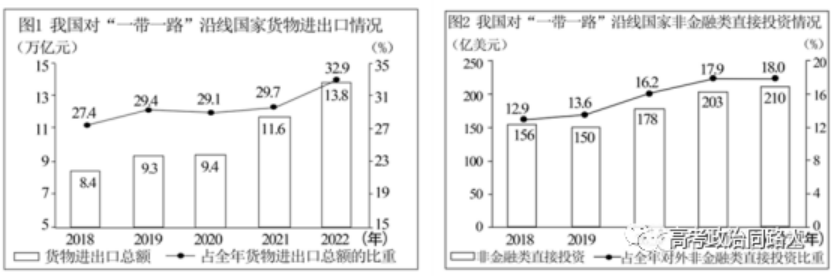

**2023年河北省普通高中学业水平选择性考试**

**思想政治**

**一、选择题：本大题共16小题，每小题3分，共48分。在每小题给出的四个选项中，只有一项是符合题目要求的。**

1.《自信之歌》写到：“帆船能到达彼岸，是把好了正确的方向；水珠能滴穿石头，是水滴不停地冲撞。亿万人民同心同德，让我们有能力乘风破浪。生生不息的民族精神，让我们有毅力拥抱理想。……自信就要脚踏实地，永远走在复兴的路上。”与上述歌词大意贴切的是:

①方向决定道路，道路决定命运                   

②保持政治定力，坚持实干兴邦

③青年兴则国家兴，青年强则国家强               

④时代是思想之母，实践是理论之源

A.①②       B.①③       C.②④       D.③④

2.马克思说：“把农业和工业结合起来，促使城乡对立逐步消灭。”习近平总书记科学研判我国发展新的历史方位和现阶段城乡发展实际，提出“重塑城乡关系，走城乡融合发展之路”“推动形成工农互促、城乡互补、协调发展、共同繁荣的新型工农城乡关系”的理念。这一理念：

①推动了马克思主义城乡关系思想中国化时代化   

②解决了城乡发展不平衡不充分的问题

③基于实践准确把握了我国城乡发展规律

④是新时代坚持和发展中国特色社会主义的基本方略

A.①③       B.①④       C.②③       D.②④

3.经济危机是一部对资本主义制度残酷罪行的判决书。危机显示出资本主义制度没有能力管理它所造成的生产力，物质丰富成了巨大的灾害，成了破产和贫困的根源。而人类劳动产品的销毁和贬值，却成了一种救命手段，用以激活因危机而周期性地瘫痪的经济机体。下列说法正确的是：

①劳动产品的销毁和贬值是解决资本主义经济危机的根本途径

②生产力的发展是造成资本主义社会破产和贫困的根源

③经济危机是资本主义生产的一切矛盾的总爆发

④经济危机是资本主义无法克服的痼疾

A.①②       B.①③       C.②④       D.③④

4.2016年安徽省凤阳县小岗村将设施大棚和“小岗村”品牌等资产折股量化到村民，成立小岗村创新发展有限公司，收益用于集体发展、社员分红等。截至2021年已经连续五年分红。小岗村股份经济合作社的投资行为：

①完善了该村公共服务体系                       

②增加了社员劳动性收入

③丰富了村集体经济的实现形式                   

④盘活了村集体资产

A.①②        B.①③        C.②④       D.③④

5.在社会各界的共同努力下，河北省逐步形成了组织化、专业化、多元化的慈善事业发展新格局。截至2023年3月，全省注册志愿者1203.8万人。某国有股份有限公司2018年以来，累计捐款1亿多元，诠释了企业、企业家的责任和担当。慈善：

①是社会保障体系的核心内容                

②在社会福利事业等方面发挥着重要作用

③有利于完善个人收入分配                  

④是再分配的调节手段

A.①③        B.①④         C.②③      D.②④

6.埃及前总理沙拉夫说，中国发展成为一个强大的现代文明国家离不开中国共产党的坚强领导，中国人民充分信任和支持中国共产党。在他看来，“以人民为中心”是中国共产党执政成功的“秘诀”,它“凝聚了社会的共识，形成了前进的动力”。上述观点与下列说法一致的是：

①全面建设社会主义现代化国家关键在党   

②民主执政是中国共产党的基本执政方式

③新时代党的建设必须以政治建设为主线

④中国共产党的根基在人民、血脉在人民、力量在人民

A.①③       B.①④        C.②③        D.②④

7.金银花产业是河北省邢台市巨鹿县产业振兴的重要抓手。省政协委员赴巨鹿县调研，围绕金银花标准化基地建设、招商引资等工作，与市县有关部门进行座谈。省政协聚焦企业发展难题，创办“政银企”委员议事堂品牌，搭建政府、银行、企业三方协商交流平台，积极助力中国式现代化河北场景建设。此举：

A.体现了人民政协的民主监督职能 

B.构建了共建共治共享的社会治理体系

C.发挥了人民政协增进共识的桥梁作用

D.表明了人民政协是乡村振兴的主体力量

8.大海边，一叠一叠的浪拍打着海岸。每一叠后浪都在推动着自己前面的前浪，每一叠后浪的前行都有它身后的后浪在推动着。后浪是靠不断推动前浪的前行，而最终让自己成为了前浪，后浪推前浪，一浪接一浪，如此往复，运动不息。下列说法符合题意的是：

①前浪与后浪的区别既是确定的，又是不确定的

②前浪与后浪的相互吸引是绝对的，相互排斥是相对的

③后浪在一定条件下可以转化为前浪

④后浪代替前浪是新事物对旧事物的否定

A.①③       B.①④       C.②③       D.②④

9.同是长江，几度遭贬的苏轼铁板铜琶高歌“大江东去”,而李煜则多愁怨叹“一江春水向东流”;同是明月，张九龄吟出“海上生明月，天涯共此时”,触发了思亲的无限情愫，而张若虚发问“江畔何人初见月，江月何年初照人”,引出的是深邃的哲理思考。从马克思主义哲学的角度看，材料表明：

①认识具有主体差异性                        

②认识是一个无限发展的过程

③认识是主体对客体的能动反映                

④认识根源于主体独特的内心感受

A.①②        B.①③        C.②④       D.③④

10.恩格斯指出：“在历史上出现的一切社会关系和国家关系，一切宗教制度和法律制度，一切理论观点，只有理解了每一个与之相应的时代的物质生活条件，并且从这些物质条件中被引申出来的时候，才能理解。”可见：

①社会意识依赖于社会物质生活条件            

②任何社会意识都具有相对独立性

③社会政治法律制度受生产方式制约            

④意识形态对经济基础具有反作用

A.①②        B.①③        C.②④       D.③④

11.在党的二十大报告中，习近平总书记强调中国坚持在和平共处五项原则基础上同各国发展友好合作。70年前，和平共处五项原则由周恩来首次提出，后表述为：互相尊重主权和领土完整、互不侵犯、互不干涉内政、平等互利、和平共处。下列与和平共处五项原则蕴含的中国智慧相一致的是：

①己所不欲，勿施于人                        

②画地为牢，以邻为壑

③小不能敌大，弱不能敌强                    

④万物并育而不相害，道并行而不相悖

A.①②        B.①④        C.②③       D.③④

12.历史上的今天：1955年6月9日，毛泽东为人民英雄纪念碑正面的碑心石题写“人民英雄永垂不朽”八个大字，深切缅怀英烈。抗日战争是近代以来我国牺牲最多的民族解放斗争，是世界反法西斯战争的重要组成部分。战争的惨烈教训让世界人民痛定思痛，建立了以联合国为主体的全球治理框架。以下说法错误的是：

A.抗日战争胜利奠定了中国作为联合国创始会员国和安理会常任理事国的地位

B.恢复新中国在联合国的合法席位使联合国的权威性显著增强

C.中华人民共和国代表是中国在联合国的唯一合法代表

D.联合国是具有全球权威性的政府组织

13.王某在某俱乐部滑轮滑时，未戴安全护具，不慎摔倒后受伤，并住院治疗。经查，该俱乐部在门口设置了温馨提示及入场须知。但未提供证据证明向王某作出了明确的安全警示以及说明防止危害发生的方法。于此，以下说法正确的是：

①王某未戴安全护具，未谨慎滑行是其受伤的原因，承担全部责任

②王某未戴安全护具，未谨慎滑行是其受伤的主要原因，承担主要责任

③俱乐部未尽到安全说明和警示义务是王某受伤的次要原因，承担次要责任

④俱乐部已经在门口设置了温馨提示及入场须知，尽到了安全保障义务

A.①③        B.①④       C.②③       D.②④

14.某旅行社开展“集满38个赞，免费游港澳”活动。按要求集赞后，丁某获得免费贵宾券。在行程中，丁某多次被该旅行社带到自费景点并强制购买价格虚高的商品。于此，以下说法正确的是：

①该旅行社集赞免费游的活动涉嫌虚假宣传

②该旅行社的强制消费行为侵犯了丁某的自主选择权

③旅行社“集满38个赞，免费游港澳”的意思表示属于承诺

④丁某要求旅行社赔偿需要证明旅行社行为有过错

A.①②        B.①③       C.②④        D.③④

15.北宋哲学家邵雍与其子在院里乘凉，忽见一人从院墙上探出身来环视一圈后缩了回去。儿子说，此人是贼。邵雍却说，如果他是贼，一看见咱俩就会马上缩回去，但他环视一圈后才缩回去，说明他在找东西，并且这个东西目标大，不需要进院查看，再看装扮，可以推测他是一个农民，在找牛。儿子出门询问，果真如此。下列属于演绎推理的是：

①曾有个贼在院墙上观察情况，此人在院墙上观察情况，故此人是贼

②贼看到院里有人都会马上缩回去，此人没有马上缩回去，故此人不是贼

③找目标大的东西不用进院查看，此人找牛，故此人不用进院查看

④曾有个农民来邵家找牛，此人是农民，故此人来找牛

A.①②        B.①④        C.②③       D.③④

16.国王给阿凡提出了三道难题，还说如果答错了就会杀了他。

国王：天上有多少颗星星?

阿凡提：有九百九十九万九千九百九十九颗。

国王：大地的中心在哪里?

阿凡提：在我这毛驴右前蹄踩着的地方。

国王：你知道自己什么时候死吗?

阿凡提：比您只早一天。

结合材料，下列属于判断的是：

①国王给阿凡提出了三道难题

②天上有多少颗星星

③如果国王不杀阿凡提，那么阿凡提没答错

④大地的中心在阿凡提毛驴右前蹄踩着的地方

A.①②        B.①③        C.②④        D.③④

**二、非选择题：本题共4题，共52分。**

17.阅读材料，完成下列要求。(18分)

  近代以来，从被动打开国门到主动对外开放，中华民族经历了从屈辱落后到日益走向伟大复兴的沧桑巨变。当前，中国已形成完备的工业体系、有效的市场体系和高水平的开放体系，成为140多个国家和地区的主要贸易伙伴，是全球最具吸引力的外国投资目的地之一。中国经济与世界经济深度融合，中国智慧、中国方案在世界舞台上大放光彩。2023年是“一带一路”倡议提出十周年。作为构建人类命运共同体的生动实践，共建“一带一路”以重大基础设施投资为重点，发挥中国技术、中国标准优势，为沿线发展中国家建成致富路、连心桥、发展港，也为国家间经贸合作注入强劲动能。

数据来源：国家统计局

**运用经济与社会、当代国际政治与经济知识，回答下列问题。**

**(1)解读上图中的经济信息。**

**(2)结合材料，阐述如何借助“一带一路”国际合作平台建设更高水平的开放型经济。**

18.阅读材料，完成下列要求。(12分)

  河北省司法厅出台行政执法禁止性清单，对“任性执法、选择性执法、一刀切式执法、运动式执法”进行专项督察。青海省格尔木市通过城市智慧管理平台加强行政执法协调监督，实现全程留痕和可回溯管理。浙江省杭州市萧山区加强群众监督，建立职责透视平台，从执法效率、执法规范、执法公正、执法温度等四个维度，接受企业和个体工商户等群体的评价。…… 各地各部门多措并举，推动政府严格规范公正文明执法。

**  结合材料，分析规范行政执法行为是怎样推动法治政府建设的。**

19.阅读材料，完成下列要求。(6分)

  某公司因无故开除员工于某，被劳动争议仲裁委员会裁决承担赔偿金1万元。因不满仲裁结果，该公司在支付赔偿金时，将1万元纸币兑换成100多斤重的硬币，令于某气愤不已。

**  运用法律与生活知识回答：于某若不服裁决，如何进一步维权；公司履行裁决的行为侵犯了于某什么权益，说明理由。**

20.阅读材料，完成下列要求。(16分)

  红色水利遗产是革命、建设和改革各历史时期，中国共产党带领广大人民克服重重困难建成的各类水利设施，是革命文化和社会主义先进文化的重要组成部分。全国首批革命文物名录收录了河南林县(今林州市)红旗渠、江西上犹县红军渠、西藏札达县英雄渠等86处红色水利遗产。红色水利遗产承载的“一不怕苦，二不怕死”、自力更生、艰苦奋斗的精神具有恒久生命力。

**(1)结合材料，运用文化传承与文化创新知识，说明为什么红色水利遗产承载的文化精神具有恒久生命力。**

**(2)燕赵大地英雄辈出，红色文化光辉灿烂。请聚焦一处河北红色文化遗产，运用创新思维方法为传承红色文化提一条建议。要求：主题鲜明，具有创新性、合理性。**
