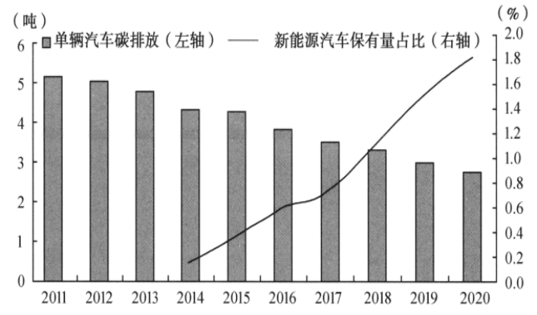
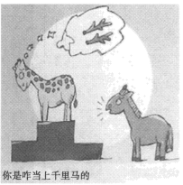

**思想政治试题**

**一、判断题（本大题共5小题，每小题1分，共5分。判断下列说法是否正确，正确的请将答题纸相应题号后的正确涂黑，错误的请将答题纸相应题号后的错误涂黑）**

1\. 新时代属于每一个人，每一个人都是新时代的见证者、开创者、建设者。（ ）

2\. 疫情期间我国经济增速放缓，主要归因于市场调节的局限性。（ ）

3\. 在我国，各民主党派接受中国共产党领导，同中国共产党通力合作。（ ）

4\. 法治政府是公开公正的政府，公开公正是指法定职责必须为、法无授权不可为。（ ）

5\. 无数普通人坚守和奋斗的故事佐证了社会历史是由普通个人的实践活动构成的。（ ）

**二、选择题Ⅰ（本大题共17小题，每小题2分，共34分。每小题列出的四个备选项中只有一个是符合题目要求的，不选、多选、错选均不得分）**

6\. 资本主义经济危机的周期性爆发至少证明两点：一方面，资本主义生产方式没有能力继续驾驭它的生产力。另一方面，这种生产力要求摆脱资本主义生产关系，建立适应它的生产关系。由此可以得到的结论是（ ）

①资本主义生产关系调整可以促进生产力发展

②资本主义生产关系和生产力发生尖锐冲突

③资本主义生产关系一定会适合生产力状况

④资本主义必然灭亡，社会主义必然胜利

A. ①② B. ①③ C. ②④ D. ③④

7\. 新民主主义革命胜利以后，党领导人民“没收官僚资本建立国营经济”“进行土地改革废除封建土地制度”“对农业、手工业和资本主义工商业进行改造”，走上了社会主义道路。这意味着我国（ ）

①建立了人民民主专政的国家政权

②实现了马克思主义中国化的第一次飞跃

③对生产资料私有制的社会主义改造取得决定性胜利

④社会主要矛盾发生了变化

A. ①② B. ①④ C. ②③ D. ③④

8\. 改革开放40多年来，我国消除绝对贫困，全面建成小康社会，实现了第一个百年奋斗目标，踏上实现第二个百年奋斗目标的新征程，中华民族迎来了从站起来、富起来到强起来的伟大飞跃。这充分说明，改革开放（ ）

A. 是党的全部理论和实践的主题 B. 实现了从富起来到强起来的伟大飞跃

C. 经历了由点到面的全方位推进过程 D. 是实现中华民族伟大复兴的关键一招

9\. 因为过度垦荒放牧，宁夏西海固曾经陷入“越穷越垦、越垦越穷”的循环。在党的领导下，渴望过上幸福生活的西海固人民艰苦奋斗，治山、治水、治穷一起发力。10年后，山坡绿了，村庄美了，老百姓的日子也红火了。从西海固人民梦想成真可以看出，中国梦（ ）

A. 归根到底是中国人民的梦 B. 是中国人民奉献世界的梦

C. 是每个中国人梦想的总和 D. 需要更为完善的制度保障其实现

10\. 党的二十大报告指出：“实践告诉我们，中国共产党为什么能，中国特色社会主义为什么好，归根到底是马克思主义行，是中国化时代化的马克思主义行。”中国化时代化的马克思主义行，是因为她（ ）

①做到了马克思主义与中国实际相结合

②构建了涵盖所有领域的理论体系

③立足时代之基、回答时代之问

④完成了对当代中国新情况新问题的探索

A. ①② B. ①③ C. ②④ D. ③④

11\. 由于国内取暖设备企业近年来不断提升产品品质，加之受到季节性和欧洲能源市场短期突发因素的影响，2022年前三季度，我国电热水器、电暖器等品类对欧洲出口实现快速增长，累计出口额分别为1.6亿美元、8.5亿美元。从中可以看出（ ）

A. 市场资源配置中发挥了作用 B. 市场竞争能够增加行业利润

C. 生产要素市场和商品市场相互作用相互影响 D. 统一开放的市场体系是资源配置的基础

12\. 下图为2011-2020年我国汽车产业发展部分指标变动情况。

资料来源：国务院发展研究中心课题组，《双碳目标下的绿色增长》，中信出版集团2022年10月版。

从图中信息可以看出，我国汽车产业发展（ ）

①体现了绿色发展理念

②缓解了人与自然的矛盾

③体现了创新发展理念

④改变了人们的生产生活方式

A. ①② B. ①③ C. ②④ D. ③④

13\. 2022年11月1日起施行的《促进个体工商户发展条例》，进一步明确了个体工商户的法律地位，明确了各部门、各地区在促进个体工商户发展方面的职责任务，并提出帮扶的各种具体措施。这将有助于（ ）

A. 贯彻按劳分配的社会主义分配原则 B. 创造财富的源泉充分涌流

C. 我国居民收入来源多样化 D. 提高劳动报酬在初次分配中的比重

14\. 习近平总书记提出：“时代是出卷人，中国共产党是答卷人，人民是阅卷人。”这一精辟论述（ ）

①生动诠释了中国共产党的初心和使命

②充分体现了全心全意为人民服务的根本宗旨

③成功开启了我国改革开放的历史新时期

④深刻揭示了党的指导思想既一脉相承又与时俱进

A. ①② B. ①③ C. ②④ D. ③④

15\. “设区的市人民代表大会常务委员会应当将民生实事项目实施情况列入年度监督工作计划，通过专题调研、组织人大代表开展视察等方式，监督本级人民政府实施民生实事项目。”这一规定表明

A. 市人大代表由民主选举产生

B. 市人大常委会向本级人民代表大会负责并报告工作

C. 市人大常委会对本级人民政府具有监督权

D. 市人大代表在市人代会闭会期间应与群众保持联系

16\. 党的十八大以来，中央持续推动管理服务下移、权限下放、资源下沉，各地不断探索机制创新和体制变革，力求落实人财物向基层倾斜，使基层政府责权利相匹配，将基层从“治理末梢”变成“治理靶心”。治理重心下移是（ ）

A. 规范行政机关自由裁量权的要求 B. 完善我国基层群众自治制度的要求

C. 提升基层政务服务效能的要求 D. 丰富基层群众自治组织形式的要求

17\. 在推进共同富裕示范区建设进程中，浙江省人大常委会围绕山区26县高质量发展、收入分配“扩中”“提低”等重大改革任务，并结合各方面的具体情况，找准立法切口，让每一部法规都装满民意。这一做法（ ）

A. 拓宽了公民有序参与立法的途径 B. 回应了现实生活中的不同利益诉求

C. 规范了公民和其他组织的权利与义务 D. 完善了立法机关与社会公众的沟通机制

18\. 《尔雅》是由汉初学者编纂的一部术语词典，阐释了4300余个术语的内涵，涉及天文、地理、日常、社会、人事、学习和习俗等，依据其所释名物可以推求古代生活的风貌。由此可知（ ）

①时代的进步推动术语研究发展

②意识活动具有能动创造性

③生产方式制约着社会生活面貌

④术语学也是对社会存在的反映

A. ①③ B. ①④ C. ②③ D. ②④

19\. 漫画《你是咋当上千里马的》（作者：李肖飏）讽刺了一种社会现象。下列选项符合漫画寓意的是（ ）

①注重实效，以行证知

②求实于名，未必得实

③非知之艰，行之惟艰

④不采华名，不兴伪事

A. ①② B. ①③ C. ②④ D. ③④

20\. 20世纪上半叶，京剧表演大师梅兰芳曾赴日、美、苏演出，引起轰动。京剧表演艺术由此得到这些国家的持续关注和研究，与这些国家的戏剧观念发生碰撞和融合，对这些国家的戏剧及其他艺术产生了深远影响。由此可知（ ）

①文化既是民族的又是世界的

②文化交流构成了文化发展的重要动力

③文化交流互鉴应以我为主，为我所用

④中国传统文化是在批判中不断发展的

A. ①② B. ①③ C. ②④ D. ③④

21\. 1000年前，意大利翁布里亚人利用山地丘陵地貌，开创了橄榄梯田耕作系统；700年前，北非沙漠中的游牧民族将独特的水资源管理方法与沙漠知识相结合，形成了绿洲农业系统……今天，各国都在加强农业文化遗产的保护与利用，进一步挖掘其价值。这表明（ ）

①文化是一个民族生存和发展的精神根基

②文化多样性是民族文化发展的内在要求

③农业文化遗产是文化传承和发展的重要载体

④每一种文化都扎根于本民族本国家的土壤中

A. ①② B. ①③ C. ②④ D. ③④

22\. 广袤的神州大地上，处处留下青年奋斗的足印。从攻克“卡脖子”的科技难题到写好乡村振兴的宏大文章，从筑梦经济建设大舞台到服务社会民生最基层，无数青年扛起责任，勇毅担当，用拼搏奉献书写了新时代青春答卷。他们用行动（ ）

①弘扬社会主义核心价值观

②构筑中华民族精神

③证明中国人民是具有伟大奋斗精神的人民

④表明中华民族精神在不同时期有不同表现

A. ①② B. ①③ C. ②④ D. ③④

**三、选择题Ⅱ（本大题共7小题，每小题3分，共21分。每小题列出的四个备选项中只有一个是符合题目要求的，不选、多选、错选均不得分）**

23\. 美国是典型的总统制国家。在2022年国会中期选举中，共和党赢得众议院多数席位，重新获得在该院辩论哪些法案以及何时辩论的决定权。这有可能使拜登政府提出的立法倡议搁浅。由此可见，在总统制国家（ ）

①总统由议会多数党领袖担任

②行政机关难以履行职能

③总统会受到议会的制约

④行政机关与立法机关分立

A. ①② B. ①④ C. ②③ D. ③④

24\. 《不扩散核武器条约》第十次审议大会于2022年8月在联合国总部召开。大会审议了条约执行情况，各缔约国代表就核裁军、核不扩散及和平利用核能等进行谈判，但会议未能达成成果文件。这说明（ ）

①国际法是世界和平的保障

②遵守国际法符合各国利益

③维护世界持久和平任重道远

④国家利益和国家实力决定国际关系

A. ①② B. ①④ C. ②③ D. ③④

25\. 从1990年4月到2022年6月底，中国军队参加了25项联合国维和行动，累计派出维和官兵近5万人次，是安理会常任理事国中最多的。除了完成维和任务，中国维和军人还积极参与派驻国的医疗卫生、人道救援、环境保护等工作。中国维和军人用实际行动（ ）

①彰显中国在联合国的地位和作用

②承担全球和平与发展的更多责任

③促使多起地区冲突走向政治解决

④支持联合国在全球开展各项工作

A. ①② B. ①③ C. ②④ D. ③④

26\. 即将参加高考的小白碰到麻烦事：楼上邻居家小学生每晚8点跳绳半小时；学校未经许可将其侧面照片用于招生宣传片，同学议论她爱出风头；妈妈怀疑她早恋，查看她手机上的聊天记录。下列说法中正确的是（ ）

A. 邻居小学生的行为属于行使不动产权利，是正当的

B. 学校未经小白许可使用她的侧面照，即使不以营利为目的也构成侵犯肖像权

C. 父母有权对子女的行为进行必要的约束和引导，查阅子女手机不构成侵权

D. 解决小白与妈妈的纠纷，可以选择便捷经济的仲裁途径

27\. 某私立高中招聘的语文教师万河，出版《蓓蕾诗选》时采用了自己所教学生小童的两首诗歌。小童认为万老师的行为侵犯了自己的著作权，向人民法院起诉。学校因此解除与万河的劳动合同。万河不服，向人民法院起诉，要求恢复劳动关系。下列说法中符合法律规定的是（ ）

①因两起案件相互牵连，法院应当将两案合并审理

②若小童与万河达成庭外和解，则学校不能仅以师生发生诉讼关系为由解除劳动合同

③小童起诉万河属民事诉讼，若不能证明该两首诗歌为自己的作品，则承担败诉后果

④若万河在《蓓蕾诗选》中指明作者小童和作品出处，则构成作品的合理使用

A. ①② B. ①④ C. ②③ D. ③④

28\. “有的M岛人都说谎，K不是M岛人，所以，K不说谎。”假定这个三段论的两个前提都是真实的，那么，这个三段论（ ）

A. 是有效的 B. 犯大项不当扩大的逻辑错误

C. 犯中项不周延的逻辑错误 D. 犯小项不当扩大的逻辑错误

29\. 漫画《相似》（作者：张昕）告诉我们（ ）

①相同或相似属性越多，类比的可靠性越高

②相同属性越接近本质属性，类比的可靠性越高

③事物属性之间既有相似性，也有差异性

④类比要在比较的基础上得出新的结论

A. ①③ B. ①④ C. ②③ D. ②④

**四、综合题（本大题共5小题，共40分）**

30\. 某国有航天科技集团公司党委旗帜鲜明地讲政治，坚决贯彻党的路线方针政策，确保企业发展的政治方向正确；完善党委理论学习中心组等理论学习制度，推动理论武装入脑入心、走深走实，确保用习近平新时代中国特色社会主义思想引领企业发展；制定党建责任清单，在每个航天发射型号工作团队设立临时党组织，激励党员践承诺、当先锋，确保党组织成为企业发展的中流砥柱。经过不断努力，该公司党的政治优势、组织优势转化为企业的创新优势和发展优势，多次圆满完成国家重大航天任务，为我国航天科技实现高水平自立自强作出了突出贡献。

结合材料，回答下列问题：

（1）运用《政治与法治》相关知识，分析该公司是如何通过党的建设加强党的领导的。

（2）运用“坚持两个毫不动摇”相关知识，说明加强党的领导对发展壮大国有经济的意义。

31\. 近年来，我国各大盐碱地集中区遵循“盐随水来，盐随水去”的水盐运动规律，从自身的水盐条件出发，进行分类改造，唤醒“沉睡”的耕地资源。松嫩平原因季节性降雨不均，土地盐碱化严重，故采用培育耕层、以稻治碱、连通河湖的方法，涵养生态，沃土好水种出了优质稻。内蒙古河套灌区因大水漫灌，只灌不排，耕地出现次生盐碱化问题，但不同地块的盐碱化程度不同，故分别采用“留”“用”“改”方法，科学灌溉，解开了次生盐碱化症结。新疆地区盐碱地全年干旱少雨，于是推广有机肥还田，培育种植“吃盐植物”，收效同样明显。

结合材料，回答下列问题：

（1）运用“矛盾基本属性”的知识，分析我国盐碱地与可耕地相互转化的条件。

（2）运用《哲学与文化》其他知识，就如何综合利用盐碱地提一条建议，并说明理由。

32\. 话合作谋发展，“一带一路”创辉煌；同呼吸共命运，历史车轮不可挡。

材料一 “一带一路”倡议提出10年来，中国已与150个国家、32个国际组织签署200余份共建“一带一路”合作文件。截至2022年8月底，中国与沿线国家货物贸易额累计约12万亿美元，对沿线国家非金融类直接投资超过1400亿美元，中国企业在沿线国家创造就业岗位超过34万个。

材料二 金港高速是“一带一路”倡议与柬埔寨“四角战略”成功对接的范例。中国技术、经验帮助柬埔寨实现经济社会发展，给当地百姓带来出行便利。包括柬埔寨在内的沿线国家在不同场合多次表示，“一带一路”合作项目从不附加任何政治条件，中国是真朋友。

材料三 截至12月14日，美国已在2022年七次加息，利用美元霸权对外输出通货膨胀，使深度依赖美元借贷和对外贸易的发展中国家的资产流向美国。

以美国为首的一些西方国家宣称，中国打着共建“一带一路”的旗号，凭借经济实力上的优势支配他国，掠夺他国财富，搞经济霸权。结合材料，运用《当代国际政治与经济》相关知识，写一篇短文对这一观点加以驳斥。

要求：观点正确；知识运用准确；材料提取恰当；论述清晰；论证有力；300字以内。

33\. 王宏大与刘文昌准备开设一家有限责任公司，拟取名“普罗旺斯”（法国地名音译），拟以宅基地使用权、两套商品房所有权及其建设用地使用权、100万元现金和一部漫画作品出资。公司成立后，与童漫签订劳动合同约定：服务期5年，年薪30万元人民币，赠送140平方米房屋一套，但5年内不得结婚，否则解聘，并收回房屋。童漫入职一个月后，公司为其办理了赠送房屋的产权登记。半年后，童漫登记结婚。

结合材料，运用《法律与生活》相关知识，回答下列问题：

（1）列举本案中的用益物权，并说明哪项财产不能作为公司财产。

（2）分析童漫是否应当退还房屋。

（3）说明“普罗旺斯”公司名称是否合适。

34\. 现代化是近代以来人类寻求自我进步的重要方式，人类正是在现代化进程中一步步走向现代化。中国式现代化，不是西方现代化的翻版，而是中华文明的现代发展。中国式现代化是人口规模巨大的现代化，是全体人民共同富裕的现代化，是物质文明和精神文明相协调的现代化，是人与自然和谐共生的现代化，是走和平发展道路的现代化。党领导人民破除西方现代化迷信，坚持从中国国情出发，经过长期的探索实践，成功走出中国特色社会主义现代化道路，为人类实现现代化提供了新选择。

结合《逻辑与思维》相关知识，分析上述材料运用了哪些思维方法来阐述中国式现代化
