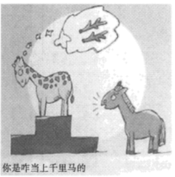

**思想政治试题**

**一、判断题（本大题共5小题，每小题1分，共5分。判断下列说法是否正确，正确的请将答题纸相应题号后的正确涂黑，错误的请将答题纸相应题号后的错误涂黑）**

1\. 新时代属于每一个人，每一个人都是新时代的见证者、开创者、建设者。（ ）

【答案】**正确**

【解析】

【详解】中国梦归根结底是人民的梦，新时代归根结底是人民的新时代。新时代属于每一个人，每一个人都是新时代的见证者、开创者、建设者，故题干说法正确。

2\. 疫情期间我国经济增速放缓，主要归因于市场调节的局限性。（ ）

【答案】**错误**

【解析】

【详解】新冠期间我国经济增速缓慢的原因主要是受疫情的影响，导致了经济活动活力降低，无论是从供给侧还是需求侧，市场主体的活力与信心都受到了打击。因此，不是市场本身的机制因素，不是市场调节的局限性，故观点错误。

3\. 在我国，各民主党派接受中国共产党领导，同中国共产党通力合作。（ ）

【答案】**正确**

【解析】

【详解】在我国，中国共产党是执政党，各民主党派是参政党。各民主党派接受中国共产党领导，同中国共产党通力合作，共同致力于社会主义事业。故本题说法正确。

4\. 法治政府是公开公正的政府，公开公正是指法定职责必须为、法无授权不可为。（ ）

【答案】**错误**

【解析】

【详解】法治政府是公开公正的政府，公开公正是指全面推进政务公开，让权力在阳光下运行。通过公开公正执法，能够增强政府公信力和执行力，有效保障人民群众的知情权、参与权、表达权和监督权。法定职责必须为、法无授权不可为强调权责法定的政府。故本题说法错误。

5\. 无数普通人坚守和奋斗的故事佐证了社会历史是由普通个人的实践活动构成的。（ ）

【答案】**错误**

【解析】

【详解】依据教材，人民群众是社会历史的主体。社会历史是由人的实践活动构成的，每个人都是历史活动的参与者，但人们在历史发展中所起作用的性质和大小是不同的。唯物史观从社会存在决定社会意识、生产方式决定社会发展的基本观点出发，强调社会发展的历史首先是物质生活资料生产的历史，是人民群众创造的历史。故本题观点错误。

**二、选择题Ⅰ（本大题共17小题，每小题2分，共34分。每小题列出的四个备选项中只有一个是符合题目要求的，不选、多选、错选均不得分）**

6\. 资本主义经济危机的周期性爆发至少证明两点：一方面，资本主义生产方式没有能力继续驾驭它的生产力。另一方面，这种生产力要求摆脱资本主义生产关系，建立适应它的生产关系。由此可以得到的结论是（ ）

①资本主义生产关系调整可以促进生产力发展

②资本主义生产关系和生产力发生尖锐冲突

③资本主义生产关系一定会适合生产力状况

④资本主义必然灭亡，社会主义必然胜利

A. ①② B. ①③ C. ②④ D. ③④

【答案】C

【解析】

【详解】①：当生产关系适合生产力发展状况时，它对生产力的发展起推动作用；当生产关系不适合生产力发展状况时，它对生产力的发展起阻碍作用，因此调整生产关系不一定能促进生产力发展，①排除。

②④：资本主义经济危机的周期性爆发，“资本主义生产方式没有能力继续驾驭它的生产力”，这强调资本主义生产关系和生产力发生尖锐冲突。“这种生产力要求摆脱资本主义生产关系，建立适应它的生产关系”，这说明随着生产力的发展，资本主义终究要被社会主义所取代，②④正确。

③：经济危机是资本主义无法克服痼疾，表明资本主义生产关系很难一直适合生产力状况。生产力的状况决定生产关系的性质，生产力的变化、发展，迟早会引起生产关系的变革。随着生产力的发展，资本主义生产关系一定会不适合生产力状况， ③排除。

故本题选C。

7\. 新民主主义革命胜利以后，党领导人民“没收官僚资本建立国营经济”“进行土地改革废除封建土地制度”“对农业、手工业和资本主义工商业进行改造”，走上了社会主义道路。这意味着我国（ ）

①建立了人民民主专政的国家政权

②实现了马克思主义中国化的第一次飞跃

③对生产资料私有制的社会主义改造取得决定性胜利

④社会主要矛盾发生了变化

A. ①② B. ①④ C. ②③ D. ③④

【答案】D

【解析】

【详解】①：新中国的成立，建立了人民民主专政的国家政权，①排除。

②：毛泽东思想是马克思主义中国化的第一次飞跃，②排除。

③④：材料强调，新民主主义革命胜利以后，党领导人民进行生产资料的社会主义改造，走上了社会主义道路。这意味着我国对生产资料私有制的社会主义改造取得决定性胜利 ，也说明了我国社会主要矛盾发生了变化，不在是无产阶级和资产阶级之间的矛盾，而是人民对于建立先进的工业国同落后的农业国的现实之间的矛盾，是人民对于经济文化迅速发展的需要同当前经济文化不能满足人民需要的状况之间的矛盾，③④正确。

故本题选D。

8\. 改革开放40多年来，我国消除绝对贫困，全面建成小康社会，实现了第一个百年奋斗目标，踏上实现第二个百年奋斗目标的新征程，中华民族迎来了从站起来、富起来到强起来的伟大飞跃。这充分说明，改革开放（ ）

A. 是党的全部理论和实践的主题 B. 实现了从富起来到强起来的伟大飞跃

C. 经历了由点到面的全方位推进过程 D. 是实现中华民族伟大复兴的关键一招

【答案】D

【解析】

【详解】A：中国特色社会主义是改革开放以来党的全部理论和实践的主题，排除A。

B：改革开放实现了从站起来到富起来的伟大飞跃。我国正在为建设社会主义现代化强国而努力，该选项的说法不符合事实，B错误。

C：该选项强调的是我国对外开放的地域和领域不断扩大，材料不涉及，排除C。

D：改革开放40多年来，我国全面建成小康社会，实现了第一个百年奋斗目标，踏上实现第二个百年奋斗目标的新征程，中华民族迎来了从站起来、富起来到强起来的伟大飞跃。这充分说明，改革开放是实现中华民族伟大复兴的关键一招，是决定实现“两个一百年”的奋斗目标、实现中华民族伟大复兴的关键一招，D正确。

故本题选D。

9\. 因为过度垦荒放牧，宁夏西海固曾经陷入“越穷越垦、越垦越穷”的循环。在党的领导下，渴望过上幸福生活的西海固人民艰苦奋斗，治山、治水、治穷一起发力。10年后，山坡绿了，村庄美了，老百姓的日子也红火了。从西海固人民梦想成真可以看出，中国梦（ ）

A. 归根到底是中国人民的梦 B. 是中国人民奉献世界的梦

C. 是每个中国人梦想的总和 D. 需要更为完善的制度保障其实现

【答案】A

【解析】

【详解】A：在党的领导下，通过西海固人民的艰苦奋斗，西海固人民过上了梦寐以求的幸福生活，西海固人民梦想成真，这说明中国梦归根到底是中国人民的梦，A正确。

B：材料不涉及中国梦与世界梦的关系，不涉及中国梦是中国人民奉献世界的梦 ，排除B。

C：中国梦归根到底是人民的梦，但不是每个中国人梦想的简单相加，该选项中“总和”的说法错误，排除C。

D：材料强调中国梦与人民的关系，不涉及中国梦需要更为完善的制度保障其实现，排除D。

故本题选A。

10\. 党的二十大报告指出：“实践告诉我们，中国共产党为什么能，中国特色社会主义为什么好，归根到底是马克思主义行，是中国化时代化的马克思主义行。”中国化时代化的马克思主义行，是因为她（ ）

①做到了马克思主义与中国实际相结合

②构建了涵盖所有领域的理论体系

③立足时代之基、回答时代之问

④完成了对当代中国新情况新问题的探索

A. ①② B. ①③ C. ②④ D. ③④

【答案】B

【解析】

【详解】①③：中国化时代化的马克思主义行，是因为她立足时代之基、回答时代之问，做到了与中国实际相结合，同中华优秀传统文化相结合，符合中国国情，①③符合题意。

②：中国化时代化的马克思主义行，不是因为构建了涵盖所有领域的理论体系，而是因为这些理论体系能够与时俱进，与中国国情相适应，起到了行动指南作用，②错误。

④：中国化时代化的马克思主义在实践中不断对当代中国新情况新问题进行探索，及时正确地指导中国革命和中国特色社会主义现代化建设。实践无止境，中国化时代化的马克思主义也无止境，④错误。

故本题选B。

11\. 由于国内取暖设备企业近年来不断提升产品品质，加之受到季节性和欧洲能源市场短期突发因素的影响，2022年前三季度，我国电热水器、电暖器等品类对欧洲出口实现快速增长，累计出口额分别为1.6亿美元、8.5亿美元。从中可以看出（ ）

A. 市场在资源配置中发挥了作用 B. 市场竞争能够增加行业利润

C. 生产要素市场和商品市场相互作用相互影响 D. 统一开放的市场体系是资源配置的基础

【答案】A

【解析】

【详解】A：材料强调国外对电热水器、电暖器等品类的需求量增加，因此，我国电热水器、电暖器等品类对欧洲出口实现快速增长，这说明市场在资源配置中发挥了作用，A正确。

B：行业利润受多种因素的影响，市场竞争未必能增加行业利润，B排除。

C：材料强调我国电热水器、电暖器等品类对欧洲出口实现快速增长，这不涉及生产要素市场和商品市场的关系，C排除。

D：统一开放、竞争有序的现代市场体系，是市场在资源配置中起决定性作用的基础，而且材料也没有涉及统一开放的市场体系对资源配置的作用，D排除。

故本题选A

12\. 下图为2011-2020年我国汽车产业发展部分指标变动情况。

资料来源：国务院发展研究中心课题组，《双碳目标下的绿色增长》，中信出版集团2022年10月版。

从图中信息可以看出，我国汽车产业发展（ ）

①体现了绿色发展的理念

②缓解了人与自然矛盾

③体现了创新发展的理念

④改变了人们的生产生活方式

A. ①② B. ①③ C. ②④ D. ③④

【答案】B

【解析】

【详解】①③：从图中信息可以看出，我国汽车产业单车碳排放量逐年下降，而新能源汽车保有量则增长迅速，说明我国汽车产业发展体现了绿色发展的理念和创新发展的理念，①③符合题意。

②：绿色发展注重的是解决人与自然和谐共生问题，图示表明我国新能源汽车产业贯彻绿色发展理念，但看不出缓解了人与自然的矛盾，②与题意不符。

④：我国汽车产业发展贯彻绿色发展和创新发展的理念，有利于改变生产生活方式，但图示看不出改变了人们的生产生活方式，④与题意不符。

故本题选B。

13\. 2022年11月1日起施行的《促进个体工商户发展条例》，进一步明确了个体工商户的法律地位，明确了各部门、各地区在促进个体工商户发展方面的职责任务，并提出帮扶的各种具体措施。这将有助于（ ）

A. 贯彻按劳分配的社会主义分配原则 B. 创造财富的源泉充分涌流

C. 我国居民收入来源多样化 D. 提高劳动报酬在初次分配中的比重

【答案】B

【解析】

【详解】B：《促进个体工商户发展条例》进一步明确了个体工商户的法律地位，明确了各部门、各地区在促进个体工商户发展方面的职责任务，并提出帮扶的各种具体措施。这将有助于贯彻落实生产要素参与收益分配的政策，使各种创造财富的源泉充分涌流，B符合题意。

A：《促进个体工商户发展条例》有利于贯彻按生产要素分配的政策，不涉及贯彻按劳分配的社会主义分配原则，A与题意不符。

C：我国实行按劳分配为主体、多种分配方式并在的分配制度，居民收入来源已经多样化，C错误。

D：《促进个体工商户发展条例》有助于贯彻落实生产要素参与收益分配的政策，而不是提高劳动报酬在初次分配中的比重，D错误。

故本题选B。

14\. 习近平总书记提出：“时代是出卷人，中国共产党是答卷人，人民是阅卷人。”这一精辟论述（ ）

①生动诠释了中国共产党的初心和使命

②充分体现了全心全意为人民服务的根本宗旨

③成功开启了我国改革开放的历史新时期

④深刻揭示了党的指导思想既一脉相承又与时俱进

A. ①② B. ①③ C. ②④ D. ③④

【答案】A

【解析】

【详解】①②：“时代是出卷人，中国共产党是答卷人，人民是阅卷人。”这一精辟论述生动诠释了中国共产党的初心和使命，充分体现了中国共产党全心全意为人民服务的根本宗旨，①②符合题意。

③：1978年12月召开的党的十一届三中全会，重新确立了马克思主义的思想路线、政治路线和组织路线，作出实行改革开放的重大决策，成功开启了我国改革开放的历史新时期，③不选。

④：题意不涉及党的指导思想既一脉相承又与时俱进，④不选。

故本题选A。

15\. “设区的市人民代表大会常务委员会应当将民生实事项目实施情况列入年度监督工作计划，通过专题调研、组织人大代表开展视察等方式，监督本级人民政府实施民生实事项目。”这一规定表明

A. 市人大代表由民主选举产生

B. 市人大常委会向本级人民代表大会负责并报告工作

C. 市人大常委会对本级人民政府具有监督权

D. 市人大代表在市人代会闭会期间应与群众保持联系

【答案】C

【解析】

【详解】A：材料不涉及人大代表的产生，排除A。

B：材料强调设区的市人民代表大会常务委员会监督本级人民政府实施民生实事项目，这不涉及市人大常委会与本级人民代表大会的关系，排除B。

C：材料强调设区的市人民代表大会常务委员会将民生实事项目实施情况列入年度监督工作计划，通过一定方式，监督本级人民政府实施民生实事项目，这说明市人大常委会对本级人民政府具有监督权，C正确。

D：材料强调是人大的监督权，不涉及人大代表与人民的关系，排除D。

故本题选C。

16\. 党的十八大以来，中央持续推动管理服务下移、权限下放、资源下沉，各地不断探索机制创新和体制变革，力求落实人财物向基层倾斜，使基层政府责权利相匹配，将基层从“治理末梢”变成“治理靶心”。治理重心下移是（ ）

A. 规范行政机关自由裁量权的要求 B. 完善我国基层群众自治制度的要求

C. 提升基层政务服务效能的要求 D. 丰富基层群众自治组织形式的要求

【答案】C

【解析】

【详解】A：行政自由裁量权是指行政主体依据法律、法规赋予的职责权限，基于法律、法规及行政的目的和精神，针对具体的行政法律关系，自由选择而作出的公正而合理的行政决定的权力。材料强调中央持续推动管理服务下移、权限下放、资源下沉，使基层政府责权利相匹配，这与规范行政机关自由裁量权无关，排除A。

B：“基层群众自治制度”，是依照宪法和法律，由居民（村民）选举的成员组成居民（村民）委员会，实行自我管理，自我教育，自我服务，自我监督的制度，材料不涉及我国的基层群众自治制度，B排除。

C：材料强调中央持续推动管理服务下移、权限下放、资源下沉，使基层政府责权利相匹配，推动基层治理能力和水平提升，可见，治理重心下移是对既有社会治理结构的调适，是提升基层政务服务效能的要求 ，C正确。

D：基层群众自治组织是村委会和居委会。治理重心下移并没有丰富基层群众自治组织形式，D排除。

故本题选C。

17\. 在推进共同富裕示范区建设进程中，浙江省人大常委会围绕山区26县高质量发展、收入分配“扩中”“提低”等重大改革任务，并结合各方面的具体情况，找准立法切口，让每一部法规都装满民意。这一做法（ ）

A. 拓宽了公民有序参与立法的途径 B. 回应了现实生活中的不同利益诉求

C. 规范了公民和其他组织的权利与义务 D. 完善了立法机关与社会公众的沟通机制

【答案】B

【解析】

【详解】B：浙江省人大常委会围绕山区26县高质量发展、收入分配“扩中”“提低”等重大改革任务，并结合各方面的具体情况，找准立法切口，让每一部法规都装满民意。这一做法回应了现实生活中的不同利益诉求，B正确。

AC：材料没有涉及公民有序参与立法，没有涉及公民和其他组织的权利与义务，AC错误。

D：我国的立法机关是全国人大及其常委会，浙江省人大常委会是权力机关，不是立法机关。且材料只是强调立法要代表民意，反映人民的意愿，没有体现完善与社会公众的沟通机制，D错误。

故本题选B。

18\. 《尔雅》是由汉初学者编纂的一部术语词典，阐释了4300余个术语的内涵，涉及天文、地理、日常、社会、人事、学习和习俗等，依据其所释名物可以推求古代生活的风貌。由此可知（ ）

①时代的进步推动术语研究发展

②意识活动具有能动创造性

③生产方式制约着社会生活面貌

④术语学也是对社会存在的反映

A. ①③ B. ①④ C. ②③ D. ②④

【答案】D

【解析】

【详解】②④：《尔雅》阐释了4300余个术语的内涵，涉及天文、地理、日常、社会、人事、学习和习俗等，依据其所释名物可以推求古代生活的风貌。由此可知，意识活动具有能动创造性，术语学也是对社会存在的反映，通过这些术语可以探求当时社会的状况，②④符合题意。

①：材料表明依据其所释名物可以推求古代生活的风貌，不体现时代的进步推动术语研究发展，①与题意不符。

③：材料强调这些术语反映了当时社会生活风貌，不体现生产方式制约着社会生活面貌，③与题意不符。

故本题选D。

19\. 漫画《你是咋当上千里马的》（作者：李肖飏）讽刺了一种社会现象。下列选项符合漫画寓意的是（ ）

①注重实效，以行证知

②求实于名，未必得实

③非知之艰，行之惟艰

④不采华名，不兴伪事

A. ①② B. ①③ C. ②④ D. ③④

【答案】C

【解析】

【详解】②④：漫画讽刺了徒有其名，未必是实的社会现象，告诉我们要实事求是，求真务实。“求实于名，未必得实”意思是追求真相只有名字未必能得到真相；“不采华名，不兴伪事”意思是不采用华而不实的名称，不兴作伪诈的事业。它们所包含的寓意与题意相同，②④符合题意。

①：“注重实效，以行证知”意思是用实践去检验认识是否正确，①与题意不符。

③：“非知之艰，行之惟艰”意思是懂得道理并不难，实际做起来就难了，③与题意不符。

故本题选C。

20\. 20世纪上半叶，京剧表演大师梅兰芳曾赴日、美、苏演出，引起轰动。京剧表演艺术由此得到这些国家的持续关注和研究，与这些国家的戏剧观念发生碰撞和融合，对这些国家的戏剧及其他艺术产生了深远影响。由此可知（ ）

①文化既是民族的又是世界的

②文化交流构成了文化发展的重要动力

③文化交流互鉴应以我为主，为我所用

④中国传统文化是在批判中不断发展的

A. ①② B. ①③ C. ②④ D. ③④

【答案】A

【解析】

【详解】①②：京剧表演艺术由此得到这些国家的持续关注和研究，与这些国家的戏剧观念发生碰撞和融合，对这些国家的戏剧及其他艺术产生了深远影响。由此可知文化既是民族的又是世界的，文化交流构成了文化发展的重要动力，①②正确。

③：材料强调中国的京剧与这些国家的戏剧观念发生碰撞和融合，没有涉及文化交流互鉴时要应以我为主，为我所用，③错误。

④：中国传统文化有两面性，需要“取其精华，去其糟粕”，是在批判中不断发展的，这个观点的表述本身正确，但材料没有涉及，④错误。

故本题选A。

21\. 1000年前，意大利翁布里亚人利用山地丘陵地貌，开创了橄榄梯田耕作系统；700年前，北非沙漠中的游牧民族将独特的水资源管理方法与沙漠知识相结合，形成了绿洲农业系统……今天，各国都在加强农业文化遗产的保护与利用，进一步挖掘其价值。这表明（ ）

①文化是一个民族生存和发展的精神根基

②文化多样性是民族文化发展的内在要求

③农业文化遗产是文化传承和发展的重要载体

④每一种文化都扎根于本民族本国家的土壤中

A. ①② B. ①③ C. ②④ D. ③④

【答案】D

【解析】

【详解】③④：今天，各国都在加强农业文化遗产的保护与利用，进一步挖掘其价值，其中重要的原因，就是因为农业文化遗产是文化传承和发展的重要载体，每一种文化都扎根于本民族本国家的土壤中，③④符合题意。

①：民族文化是一个民族生存和发展的精神根基，①错误。

②：材料表明每一个民族的文化，都是人类实践创造的成果，都有其独特魅力和价值，不强调文化多样性是民族文化发展的内在要求，②与题意不符。

故本题选D。

22\. 广袤的神州大地上，处处留下青年奋斗的足印。从攻克“卡脖子”的科技难题到写好乡村振兴的宏大文章，从筑梦经济建设大舞台到服务社会民生最基层，无数青年扛起责任，勇毅担当，用拼搏奉献书写了新时代青春答卷。他们用行动（ ）

①弘扬社会主义核心价值观

②构筑中华民族精神

③证明中国人民是具有伟大奋斗精神的人民

④表明中华民族精神在不同时期有不同表现

A. ①② B. ①③ C. ②④ D. ③④

【答案】B

【解析】

【详解】①③：从攻克“卡脖子”的科技难题到写好乡村振兴的宏大文章，从筑梦经济建设大舞台到服务社会民生最基层，无数青年扛起责任，勇毅担当，用拼搏奉献书写了新时代青春答卷。他们用行动证明中国人民是具有伟大奋斗精神的人民，用实际行动弘扬和践行社会主义核心价值观，①③符合题意。

②：材料表明新时代青年用行动弘扬中华民族精神而不是构筑中华民族精神，②错误。

④：材料表明新时代青年用实际行动弘扬以爱国主义为核心的中华民族精神和以改革创新为核心的时代精神，不体现中华民族精神在不同时期有不同表现，④与题意不符。

故本题选B。

**三、选择题Ⅱ（本大题共7小题，每小题3分，共21分。每小题列出的四个备选项中只有一个是符合题目要求的，不选、多选、错选均不得分）**

23\. 美国是典型的总统制国家。在2022年国会中期选举中，共和党赢得众议院多数席位，重新获得在该院辩论哪些法案以及何时辩论的决定权。这有可能使拜登政府提出的立法倡议搁浅。由此可见，在总统制国家（ ）

①总统由议会多数党领袖担任

②行政机关难以履行职能

③总统会受到议会的制约

④行政机关与立法机关分立

A. ①② B. ①④ C. ②③ D. ③④

【答案】D

【解析】

【详解】③④：在2022年国会中期选举中，共和党赢得众议院多数席位，重新获得在该院辩论哪些法案以及何时辩论的决定权。这有可能使拜登政府提出的立法倡议搁浅。由此可见，在总统制国家行政机关与立法机关分立，总统会受到议会的制约，③④符合题意。

①：在总统制国家，总统由选民选举直接选举或间接选举产生，不是由议会多数党领袖担任，①错误。

②：在总统制国家，总统是国家元首、政府首脑，直接行使国家最高行政权力，对选民负责，独立于议会之外，不对议会负责，但在某些大事上会受到议会的制约，②说法错误。

故本题选D。

24\. 《不扩散核武器条约》第十次审议大会于2022年8月在联合国总部召开。大会审议了条约执行情况，各缔约国代表就核裁军、核不扩散及和平利用核能等进行谈判，但会议未能达成成果文件。这说明（ ）

①国际法是世界和平的保障

②遵守国际法符合各国利益

③维护世界持久和平任重道远

④国家利益和国家实力决定国际关系

A. ①② B. ①④ C. ②③ D. ③④

【答案】D

【解析】

【详解】①：材料强调《不扩散核武器条约》第十次审议大会会议未能达成成果文件，这不涉及国际法是世界和平的保障，①排除。

②：遵守国际法符合各国共同利益，而不是各国利益，②错误。

③④：材料强调在《不扩散核武器条约》第十次审议大会会议上，各缔约国代表就核裁军、核不扩散及和平利用核能等进行谈判，但未能达成成果文件，这说明维护世界持久和平任重道远 ，也说明了国家利益和国家实力决定国际关系，国家间也存在着利益的差别乃至对立，③④正确。

故本题选D。

25\. 从1990年4月到2022年6月底，中国军队参加了25项联合国维和行动，累计派出维和官兵近5万人次，是安理会常任理事国中最多的。除了完成维和任务，中国维和军人还积极参与派驻国的医疗卫生、人道救援、环境保护等工作。中国维和军人用实际行动（ ）

①彰显中国在联合国的地位和作用

②承担全球和平与发展的更多责任

③促使多起地区冲突走向政治解决

④支持联合国在全球开展各项工作

A. ①② B. ①③ C. ②④ D. ③④

【答案】A

【解析】

【详解】①②：中国维和军人除了完成维和任务，还积极参与派驻国的医疗卫生、人道救援、环境保护等工作。用实际行动承担全球和平与发展的更多责任，彰显中国在联合国的地位和作用，①②符合题意。

③：材料不体现中国维和军人用实际行动促使多起地区冲突走向政治解决，③与题意不符。

④：中国支持联合国按照宪章精神开展的各项工作，而不是无原则地支持联合国在全球开展各项工作，④错误。

故本题选A。

26\. 即将参加高考的小白碰到麻烦事：楼上邻居家小学生每晚8点跳绳半小时；学校未经许可将其侧面照片用于招生宣传片，同学议论她爱出风头；妈妈怀疑她早恋，查看她手机上的聊天记录。下列说法中正确的是（ ）

A. 邻居小学生的行为属于行使不动产权利，是正当的

B. 学校未经小白许可使用她的侧面照，即使不以营利为目的也构成侵犯肖像权

C. 父母有权对子女的行为进行必要的约束和引导，查阅子女手机不构成侵权

D. 解决小白与妈妈的纠纷，可以选择便捷经济的仲裁途径

【答案】B

【解析】

【详解】A：相邻关系一方在为自己便利行使权利时，应当照顾到相邻方的利益。邻居小学生的行为已经影响到相邻关系的学习和生活，A错误。

B：学校未经小白许可使用她的侧面照，即使不以营利为目的也构成侵犯肖像权，B正确。

C：父母有权对子女的行为进行必要的约束和引导，但未经同意查阅子女手机构成侵权，C错误。

D：解决小白与妈妈的纠纷，最好方式是自行协商，通过和解达成合意，解决纠纷，而不是选择便捷经济的仲裁途径，D错误。

故本题选B。

27\. 某私立高中招聘的语文教师万河，出版《蓓蕾诗选》时采用了自己所教学生小童的两首诗歌。小童认为万老师的行为侵犯了自己的著作权，向人民法院起诉。学校因此解除与万河的劳动合同。万河不服，向人民法院起诉，要求恢复劳动关系。下列说法中符合法律规定的是（ ）

①因两起案件相互牵连，法院应当将两案合并审理

②若小童与万河达成庭外和解，则学校不能仅以师生发生诉讼关系为由解除劳动合同

③小童起诉万河属民事诉讼，若不能证明该两首诗歌为自己的作品，则承担败诉后果

④若万河在《蓓蕾诗选》中指明作者小童和作品出处，则构成作品的合理使用

A. ①② B. ①④ C. ②③ D. ③④

【答案】C

【解析】

【详解】①：这是两起不同的民事诉讼，适应的法律不同，法院不应当将两案合并审理，①错误。

②：若小童与万河达成庭外和解，则学校不能仅以师生发生诉讼关系为由解除劳动合同，②正确。

③：小童起诉万河属民事诉讼，若不能证明该两首诗歌为自己的作品，则承担败诉后果，③正确。

④：因万河在《蓓蕾诗选》中采用小童的两首诗歌属于商业性质，即使指明作者和出处，也不是合理使用，可以是法定许可使用，④错误。

故本题选C。

28\. “有的M岛人都说谎，K不是M岛人，所以，K不说谎。”假定这个三段论的两个前提都是真实的，那么，这个三段论（ ）

A. 是有效的 B. 犯大项不当扩大的逻辑错误

C. 犯中项不周延的逻辑错误 D. 犯小项不当扩大的逻辑错误

【答案】B

【解析】

【详解】AB：大项或小项如果在前提中不周延，那么在结论中也不得周延。说谎作为大项在前提中不周延，但在结论中周延了，因此，这个三段论犯了大项不当扩大的逻辑错误，是无效的，B正确，排除A。

C：中项不周延是指三段论中的中项，在大、小前提中一次也不周延以致无法必然推出结论的错误逻辑。有的M岛人都说谎，在此M岛人不周延，而K不是M岛人，这句话中M岛人是周延的，因此，符合作为中项至少周延一次，所以，这个三段论并没有犯中项不周延的逻辑错误，排除C。

D：材料中的三段论犯的是大项不当扩大的逻辑错误，而不是犯小项不当扩大的逻辑错误，排除D。

故本题选B。

29\. 漫画《相似》（作者：张昕）告诉我们（ ）

①相同或相似属性越多，类比的可靠性越高

②相同属性越接近本质属性，类比的可靠性越高

③事物的属性之间既有相似性，也有差异性

④类比要在比较的基础上得出新的结论

A. ①③ B. ①④ C. ②③ D. ②④

【答案】C

【解析】

【详解】②③：漫画中树与树之间、人与人之间，既有相似，也有差异，可知事物的属性之间既有相似性，也有差异性，在进行类比时，既要看到事物的相同或相似属性，又要看到它们的属性之间的差异性，它们的相同属性越接近本质属性，类比的可靠性越高，②③符合题意。

①：漫画体现的是作为类比推理根据的相同属性越是接近本质属性，相同属性与推出属性之间的相关程度越高，结论的可靠程度就越高，而不是强调类比的根据越多越好，①不符合题意。

④：漫画反映了事物之间的相似与差异，没有体现类比要在比较的基础上得出新的结论，④不符合题意。

故本题选C

**四、综合题（本大题共5小题，共40分）**

30\. 某国有航天科技集团公司党委旗帜鲜明地讲政治，坚决贯彻党的路线方针政策，确保企业发展的政治方向正确；完善党委理论学习中心组等理论学习制度，推动理论武装入脑入心、走深走实，确保用习近平新时代中国特色社会主义思想引领企业发展；制定党建责任清单，在每个航天发射型号工作团队设立临时党组织，激励党员践承诺、当先锋，确保党组织成为企业发展的中流砥柱。经过不断努力，该公司党的政治优势、组织优势转化为企业的创新优势和发展优势，多次圆满完成国家重大航天任务，为我国航天科技实现高水平自立自强作出了突出贡献。

结合材料，回答下列问题：

（1）运用《政治与法治》相关知识，分析该公司是如何通过党的建设加强党的领导的。

（2）运用“坚持两个毫不动摇”相关知识，说明加强党的领导对发展壮大国有经济的意义。

【答案】（1）公司党委坚决贯彻党的路线方针政策，推进党的政治建设，确保了企业发展的政治方向，加强了党的政治领导。该公司完善理论学习制度，推动习近平新时代中国特色社会主义思想入脑人心，推进党的思想建设；制定党建责任清单、成立临时党组织等落实了党的组织建设。两者加强了党的思想领导和组织领导。

（2）发展壮大国有经济，要以提高国有资本效率、增强国有企业活力为中心。加强党对国有企业的全面领导，促使党的政治、组织优势转化为企业的创新和发展优势，有助于提高国有企业的效率和活力，不断增强国有经济的竞争力和创新力，进而壮大国有经济。

【解析】

【分析】背景素材：某国有航天科技集团公司通过加强党建促进发展

考点考查：党的建设、党的领导、两个毫不动摇等

能力考查：获取和解读信息、调动和运用知识、描述和阐释事物

核心素养：政治认同、科学精神、公共参与

【小问1详解】

第一步：审设问，明确主体、作答范围、问题限定和作答角度。

本题要求运用《政治与法治》相关知识，分析该公司是如何通过党的建设加强党的领导的。属于措施类主观题，知识限定明确，属微观考查。解答时，考生可根据材料内容和设问要求调动教材知识，然后结合材料提取信息，坚持理论与材料相结合。

第二步：审材料，通过标点符号、段落等，提取材料有效信息。

有效信息①：某国有航天科技集团公司党委旗帜鲜明地讲政治，坚决贯彻党的路线方针政策，确保企业发展的政治方向正确→可从政治领导角度，说明该公司党委坚决贯彻党的路线方针政策，推进党的政治建设，确保了企业发展的政治方向；

有效信息②：完善党委理论学习中心组等理论学习制度，推动理论武装入脑入心、走深走实，确保用习近平新时代中国特色社会主义思想引领企业发展→可从思想领导角度，说明该公司完善理论学习制度，推动习近平新时代中国特色社会主义思想入脑人心，推进党的思想建设；

有效信息③：制定党建责任清单，在每个航天发射型号工作团队设立临时党组织，激励党员践承诺、当先锋，确保党组织成为企业发展的中流砥柱→可从组织领导角度，说明该公司制定党建责任清单、成立临时党组织等落实了党的组织建设。

第三步：整合信息，组织答案。

解答本题，考生可根据设问要求，运用党的领导相关知识，结合材料中的关键信息，从党的政治领导、思想领导、组织领导等角度组织答案，做到观点和材料相结合。

【小问2详解】

第一步：审设问，明确主体、作答范围、问题限定和作答角度。

本题要求运用“坚持两个毫不动摇”相关知识，说明加强党的领导对发展壮大国有经济的意义。属于意义类主观题，知识限定明确，属微观考查。解答时，考生可根据材料内容和设问要求调动教材知识，然后结合材料提取信息，坚持理论与材料相结合。

第二步：审材料，通过标点符号、段落等，提取材料有效信息。

有效信息：经过不断努力，该公司党的政治优势、组织优势转化为企业的创新优势和发展优势，多次圆满完成国家重大航天任务，为我国航天科技实现高水平自立自强作出了突出贡献→可从毫不动摇地发展壮大国有经济角度，说明加强党对国有企业的全面领导，促使党的政治、组织优势转化为企业的创新和发展优势，有助于提高国有企业的效率和活力，不断增强国有经济的竞争力和创新力，进而壮大国有经济。

第三步：整合信息，组织答案。

解答本题，考生可根据设问要求，运用两个毫不动摇的相关知识，结合材料中的关键信息，从毫不动摇发展壮大国有经济角度组织答案，做到观点和材料相结合。

31\. 近年来，我国各大盐碱地集中区遵循“盐随水来，盐随水去”的水盐运动规律，从自身的水盐条件出发，进行分类改造，唤醒“沉睡”的耕地资源。松嫩平原因季节性降雨不均，土地盐碱化严重，故采用培育耕层、以稻治碱、连通河湖的方法，涵养生态，沃土好水种出了优质稻。内蒙古河套灌区因大水漫灌，只灌不排，耕地出现次生盐碱化问题，但不同地块的盐碱化程度不同，故分别采用“留”“用”“改”方法，科学灌溉，解开了次生盐碱化症结。新疆地区盐碱地全年干旱少雨，于是推广有机肥还田，培育种植“吃盐植物”，收效同样明显。

结合材料，回答下列问题：

（1）运用“矛盾基本属性”的知识，分析我国盐碱地与可耕地相互转化的条件。

（2）运用《哲学与文化》其他知识，就如何综合利用盐碱地提一条建议，并说明理由。

【答案】（1）矛盾双方既相互对立、相互排斥，又相互依存、相互贯通，在一定的条件下可以相互转化。在我国盐碱地集中区，盐碱地是“沉睡”的耕地资源，是潜在的可耕地，在遵循水盐运动规律的前提下，发挥主观能动性，因地制宜，分类改造，可以转化为可耕地；可耕地是现实的耕地资源，但当水盐条件发生变化时，诸如发生不合理的灌溉时，在水盐运动规律的作用下，可耕地也会盐碱化，从现实的耕地资源变成潜在的耕地资源。

（2）参考答案示例：

建议：通过实地调研，在弄清楚土壤的实际水盐条件的基础上，采取相应措施：培育、种植耐盐碱的植物，或在盐碱洼地养殖喜咸的水产，还可以建设可供研究和参观的盐碱地实践基地等。

理由：不同事物有不同矛盾，注意观察矛盾的特殊性，从实际情况出发，才能正确认识和解决问题。

【解析】

【分析】背景材料：我国盐碱地治理

考查知识：矛盾的基本属性、矛盾特殊性等有关知识

考查能力：调动和运用知识、描述和阐释事物

学科素养：政治认同、科学精神

【小问1详解】

第一步，审设问。明确本题考查的知识是矛盾基本属性，设问指向是分析我国盐碱地与可耕地相互转化的条件。

第二步，审材料，提取关键词，链接教材知识。

关键词①：运用“矛盾基本属性”的知识→可联系矛盾双方既相互对立、相互排斥，又相互依存、相互贯通，在一定的条件下可以相互转化。

关键词②：我国各大盐碱地集中区遵循“盐随水来，盐随水去”的水盐运动规律，从自身的水盐条件出发，进行分类改造，唤醒“沉睡”的耕地资源→可联系盐碱地是潜在的可耕地，在遵循水盐运动规律的前提下，发挥主观能动性，因地制宜，分类改造，可以转化为可耕地。

关键词③：内蒙古河套灌区因大水漫灌，只灌不排，耕地出现次生盐碱化问题→可联系当水盐条件发生变化时，诸如发生不合理的灌溉时，在水盐运动规律的作用下，可耕地也会盐碱化，从现实的耕地资源变成潜在的耕地资源。

第三步，整合信息、组织答案。注意设问要求与材料信息、课本知识的结合。

【小问2详解】

本题具有开放性。可结合材料中“运动规律”、“从自身的水盐条件出发，进行分类改造”、“科学灌溉”等关键性信息，从尊重客观规律、一切从实际出发、具体问题具体分析等角度说明如何综合利用盐碱地提一条建议，并说明理由即可。在回答时，注意阐述的理由，要与所提建议要一致。

32\. 话合作谋发展，“一带一路”创辉煌；同呼吸共命运，历史车轮不可挡。

材料一 “一带一路”倡议提出10年来，中国已与150个国家、32个国际组织签署200余份共建“一带一路”合作文件。截至2022年8月底，中国与沿线国家货物贸易额累计约12万亿美元，对沿线国家非金融类直接投资超过1400亿美元，中国企业在沿线国家创造就业岗位超过34万个。

材料二 金港高速是“一带一路”倡议与柬埔寨“四角战略”成功对接的范例。中国技术、经验帮助柬埔寨实现经济社会发展，给当地百姓带来出行便利。包括柬埔寨在内的沿线国家在不同场合多次表示，“一带一路”合作项目从不附加任何政治条件，中国是真朋友。

材料三 截至12月14日，美国已在2022年七次加息，利用美元霸权对外输出通货膨胀，使深度依赖美元借贷和对外贸易的发展中国家的资产流向美国。

以美国为首的一些西方国家宣称，中国打着共建“一带一路”的旗号，凭借经济实力上的优势支配他国，掠夺他国财富，搞经济霸权。结合材料，运用《当代国际政治与经济》相关知识，写一篇短文对这一观点加以驳斥。

要求：观点正确；知识运用准确；材料提取恰当；论述清晰；论证有力；300字以内。

【答案】示例：\
①中国是经济全球化的贡献者。改革开放以来，我们始终敞开胸襟、拥抱世界，积极作出中国贡献。“一带一路”倡议提出10年来，中国已与150个国家、32个国际组织签署200余份共建“一带一路”合作文件。截至2022年8月底，中国与沿线国家货物贸易额累计约12万亿美元，对沿线国家非金融类直接投资超过1400亿美元，中国企业在沿线国家创造就业岗位超过34万个。\
②在发展过程中，我国坚持对外开放的基本国策，奉行互利共赢的开放战略，不断提升发展的内外联动性，在实现自身发展的同时更多惠及其他国家和人民。包括柬埔寨在内的沿线国家在不同场合多次表示，“一带一路”合作项目从不附加任何政治条件，中国是真朋友。\
③中国的发展为世界各国的发展提供了机遇。中国经济快速增长，为世界各国提供了更广阔的市场、更充足的资本、更丰富的产品、更宝贵的合作机会，为全球经济的稳定和增长提供了持续强大的推动力。中国同一大批国家的联动发展，使全球经济发展更加平衡。中国改革开放持续推进，为开放型世界经济的发展提供了重要动力。美国已在2022年七次加息，利用美元霸权对外输出通货膨胀，使深度依赖美元借贷和对外贸易的发展中国家的资产流向美国。这种依靠美元霸权掠夺他国财富的行径与中国形成鲜明对比。

【解析】

【分析】背景素材：中国倡导“一带一路”10年来，为世界发展作出巨大贡献

考点考查： 中国是经济全球化的贡献者、对外开放的基本国策，奉行互利共赢的开放战略、中国的发展为世界各国的发展提供了机遇

能力考查：描述和阐释事物、论证和探究问题

核心素养：政治认同、公共参与、科学精神

【详解】本题是开放试题。要求运用《当代国际政治与经济》相关知识，写一篇短文对西方某些国家的错误观点加以驳斥。答案不固定，注意切合主题。参考角度：中国是经济全球化的贡献者；对外开放的基本国策，奉行互利共赢的开放战略；中国的发展为世界各国的发展提供了机遇等。

33\. 王宏大与刘文昌准备开设一家有限责任公司，拟取名“普罗旺斯”（法国地名音译），拟以宅基地使用权、两套商品房所有权及其建设用地使用权、100万元现金和一部漫画作品出资。公司成立后，与童漫签订劳动合同约定：服务期5年，年薪30万元人民币，赠送140平方米房屋一套，但5年内不得结婚，否则解聘，并收回房屋。童漫入职一个月后，公司为其办理了赠送房屋的产权登记。半年后，童漫登记结婚。

结合材料，运用《法律与生活》相关知识，回答下列问题：

（1）列举本案中的用益物权，并说明哪项财产不能作为公司财产。

（2）分析童漫是否应当退还房屋。

（3）说明“普罗旺斯”公司名称是否合适。

【答案】（1）本案中的用益物权有宅基地使用权和建设用地使用权。宅基地使用权是农民的财产权，不得转让，不能作为公司出资。

（2）劳动合同中“5年内不得结婚”的约定因排除当事人结婚权利（自由）而无效，童漫结婚不构成违约，房屋所有权已经合法转移，无须返还房屋。

（3）“普罗旺斯”会让人误以为是外国公司，作为中国的公司，取名应当遵循公序良俗原则，选择汉语词汇。

【解析】

【分析】背景素材：出资开设公司

考点考查：保护财产权、订立合同的相关知识

能力考查：获取和解读信息、调动和运用知识、描述和阐释事物

核心素养：科学精神、法治意识

【小问1详解】

第一步：审设问，明确主体、作答范围、问题限定和作答角度。本题要求分析列举材料中的用益物权，并明确哪项财产不能作为公司财产。首先要明确用益物权的内容，是指非所有人对他人所有之物享有的占有、使用和收益的权利，包括土地承包经营权、建设用地使用权、宅基地使用权、居住权、地役权。

第二步：审材料，提取材料有效信息，链接教材知识。

有效信息：拟以宅基地使用权、两套商品房所有权及其建设用地使用权→说明本案中的用益物权有宅基地使用权和建设用地使用权。

第三步：整合信息，组织答案。

【小问2详解】

第一步：审设问，本题要求分析童漫是否应当退还房屋。

第二步：审材料，提取材料有效信息。

有效信息：签订劳动合同约定：服务期5年，年薪30万元人民币，赠送140平方米房屋一套，但5年内不得结婚，否则解聘，并收回房屋→劳动合同中“5年内不得结婚”的约定，属于违反法律的情形，导致合同全部或部分无效。且公司为童漫办理了赠送房屋的产权登记，房屋所有权已经合法转移，故无须返还房屋。

第三步：整合信息，组织答案。

【小问3详解】

根据我国法律法规，公司注册名称需要使用符合国家规范的汉字，不可以含有有损于国家、社会公共利益的、可能对公众造成欺骗或者误解的文字。普罗旺斯是法国的地名，会对公众造成一定的误解，所以名称不合适。

34\. 现代化是近代以来人类寻求自我进步的重要方式，人类正是在现代化进程中一步步走向现代化。中国式现代化，不是西方现代化的翻版，而是中华文明的现代发展。中国式现代化是人口规模巨大的现代化，是全体人民共同富裕的现代化，是物质文明和精神文明相协调的现代化，是人与自然和谐共生的现代化，是走和平发展道路的现代化。党领导人民破除西方现代化迷信，坚持从中国国情出发，经过长期的探索实践，成功走出中国特色社会主义现代化道路，为人类实现现代化提供了新选择。

结合《逻辑与思维》相关知识，分析上述材料运用了哪些思维方法来阐述中国式现代化。

【答案】①用辩证思维阐述中国式现代化。中国式现代化既有现代化的普遍性，又有鲜明的中国特色，对西方现代化不做简单肯定和否定，是肯定与否定的统一，是对分析与综合的思维方法的灵活运用，是从中国国情出发、特色鲜明的现代化新样板。

②用创新思维阐述中国式现代化。党领导人民通过长期实践探索，攻坚克难，破旧立新，走出中国式现代化道路，开辟了人类走向现代化的新路径。

【解析】

【分析】背景素材：中国式现代化

考点考查：辩证思维、肯定与否定、分析与综合、创新思维

能力考查：描述和阐释事物、论证和探究问题

核心素养：政治认同、公共参与、科学精神

【详解】第一步：审设问。明确题型、作答范围、问题限定和作答角度。

本题为体现类主观题，运用《逻辑与思维》相关知识分析材料运用了哪些思维方法来阐述中国式现代化。从辩证思维、肯定与否定、分析与综合、创新思维 等角度来进行说明。

第二步：审材料，通过标点符号、段落等，提取材料有效信息。

有效信息①：党领导人民破除西方现代化迷信，坚持从中国国情出发，经过长期的探索实践，成功走出中国特色社会主义现代化道路，为人类实现现代化提供了新选择→可联系辩证思维，肯定与否定的统一，分析与综合的思维方法。

有效信息②：中国式现代化，不是西方现代化的翻版，而是中华文明的现代发展→可联系创新思维。

第三步：整合信息，组织答案。注意设问限定以及教材知识与材料、时政信息等相结合。
