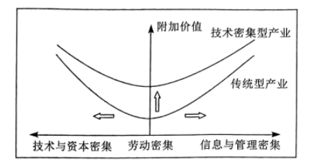
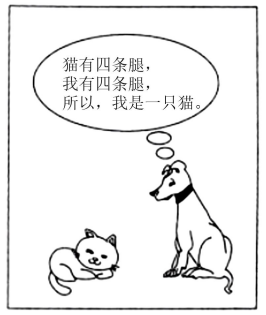
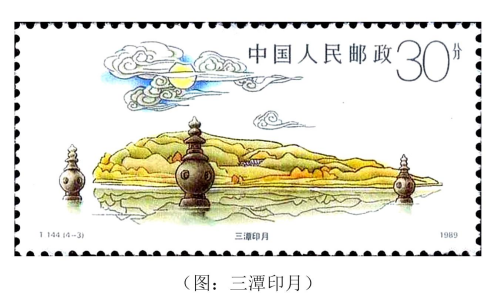

**机密★启用前**

**2023年湖北省普通高中学业水平选择性考试**

**思想政治**

**本试卷共8页，21题。全卷满分100分。考试用时75分钟。**

**★祝考试顺利★**

**注意事项：**

**1．答题前，先将自己的姓名、准考证号、考场号、座位号填写在试卷和答题卡上，并认真核准准考证号条形码上的以上信息，将条形码粘贴在答题卡上的指定位置。**

**2．请按题号顺序在答题卡上各题目的答题区域内作答，写在试卷、草稿纸和答题卡上的非答题区域均无效。**

**3．选择题用2B铅笔在答题卡上把所选答案的标号涂黑；非选择题用黑色签字笔在答题卡上作答；字体工整，笔迹清楚。**

**4．考试结束后，请将试卷和答题卡一并上交。**

**一、选择题：本题共16小题，每小题3分，共48分。在每小题给出的四个选项中，只有一项是符合题目要求的。**

1\. 改革开放40多年来，入围世界500强的中国企业数量不断增加，1997年中国（大陆）只有4家，2020年以133家位居世界第一，2022年再创新高达到145家，中国企业国际竞争力显著增强。中国企业在世界500强企业中的地位变化见证了中国发展奇迹。这表明改革开放（ ）

①是推动当代中国发展根本动力

②是中国大踏步赶上时代的重要法宝

③极大改变了中国企业和中国的面貌

④是中国取得一切成绩和进步的决定性因素

A. ①③ B. ①④ C. ②③ D. ②④

2\. 聚焦产业链供应链有序运行，我国创新宏观调控，通过减税降费充分发挥了税收的调控性、导向性和激励性作用，不断突破供给侧堵点，有效维护了我国产业链供应链安全稳定和自主可控。该机制的作用路径是（ ）

①实行减税降费

②高新技术企业创新积极性增强

③关键技术完全自主创新

④支持小微企业纾困

⑤打通大中小企业之间的微循环

⑥保障产业链安全稳定

A. ①→③→②→⑥ B. ①→④→③→⑥

C. ①→④→⑤→⑥ D. ①→⑤→④→⑥

3\. 下图中的“微笑曲线”显示的是全球化背景下产业升级的不同方向。

据此可以推断出（ ）

①传统型产业向技术密集型产业升级途径多样

②传统型产业和技术密集型产业可以互相转化

③传统型产业与新技术的融合是产业升级的一种趋势

④全球化过程中技术密集型产业将替代传统型产业

A. ①③ B. ①④ C. ②③ D. ②④

4\. 不可降解的一次性塑料制品价格低廉、使用方便，却易污染环境，浪费资源，长远来看，更会对自然界和人类造成不可挽回的损害。尽管“限塑令”已推行近15年，一次性塑料制品的生产和使用依然普遍。其原因在于（ ）

①使用的非排他性导致需求增加

②使用的便利性刺激需求增加

③使用的广泛性决定供给增加

④无视环境成本的自发性造成供给增加

A ①③ B. ①④ C. ②③ D. ②④

5\. 当前，碳中和共识正在全球范围内加速形成，碳中和将重构产业和地区竞争规则，“零碳竞争力”由此成为提升国家核心竞争力的重要因素。世界各主要国家纷纷加大零碳产业投资，围绕能源转型和减少二氧化碳排放展开技术革新。国内一些大型企业积极转型，“零碳工厂”“零碳标准”持续涌现。提升“零碳竞争力”（ ）

①助推能源行业结构性变革

②旨在构建人类命运共同体

③能够培育国际竞争新优势

④重塑世界经济发展新格局

A. ①② B. ①③ C. ②④ D. ③④

6\. 联合国2023年水事会议在纽约举行，共同讨论缓解全球水危机的方案。联合国秘书长古特雷斯呼吁，各国政府必须制定和实施计划，确保所有人都能够公平获得水资源，并积极开展水资源相关对话，携手合作，共同管理这一宝贵资源。这表明（ ）

①国际社会应立足共同利益，深化水资源治理的交流与合作

②联合国在促进全球水资源治理的国际合作中发挥重要作用

③各国应以全球发展为出发点，制定水资源管理政策和计划

④世界各国能够加强对话合作，确保水资源分配的公平公正

A. ①② B. ①④ C. ②③ D. ③④

7\. 锣鼓文化是某村的传统特色文化，该村党支部发挥这一特色，利用微信群打造“击鼓议事堂”，实现群众事群众说、群众议、群众定。每当村里需要就重大事项作出决策，村党支部（“击鼓队”）就会在微信群发出信息，如同击响“议事鼓”，村民代表便集聚一堂，积极建言献策。“击鼓议事堂”这一形式（ ）

①发挥了基层党组织引领作用

②完善了基层自治的议事规则

③丰富了基层自治的组织形式

④提高了基层自治治理效能

A. ①② B. ①④ C. ②③ D. ③④

8\. 新一轮国务院机构改革方案明确了国家知识产权局由国家市场监督管理总局管理的国家局调整为国务院直属机构，商标、专利等领域执法职责继续由市场监管综合执法队伍承担，相关执法工作接受国家知识产权局专业指导。该项改革方案（ ）

①旨调整优化政府机构职责，提高知识产权管理水平

②合理调整上下级政府间的关系，建设职能科学的政府

③扩大知识产权局的职权，适应创新型国家建设的需要

④完善国家知识产权管理体制，助推知识产权强国建设

A. ①③ B. ①④ C. ②③ D. ②④

9\. 立法法是规范国家立法制度和立法活动、维护社会主义法治统一的基本法律，但立法法本身也需要随着社会生活的变化而修正。继2015年第一次修改后，十四届全国人大一次会议通过了关于修改《中华人民共和国立法法》的决定。新修订的立法法对设区的市可以制定地方性法规和地方政府规章的事项进行了调整，增加“基层治理”，并将“环境保护”修改为“生态文明建设”。这表明（ ）

①立法法是国家机关制定和修改法律的最基本的法律依据

②扩大设区的市立法权限，适应地方创新治理的实际需要

③全国人大行使立法权完善立法体制机制，提高立法质量

④地方各级国家权力机关应当按照法定职权开展立法工作

A ①② B. ①④ C. ②③ D. ③④

10\. 甲乙毗邻而居，二人因琐事多次争吵，关系交恶。甲为泄愤，故意将空调外机移装在正对着乙卧室窗户的墙上，噪音和热浪导致乙无法开窗通风透气。乙找甲交涉，要求其移除，甲辩称：“我是安装在自家的外墙上，又没有侵犯你的地盘，嫌吵你可以关窗”。根据我国民法典的规定，甲的行为（ ）

①违反了民法的绿色原则

②违反了民法的诚信原则

③侵害了乙的所有权

④是行使自己的所有权，所以并无不法

A. ①③ B. ①④ C. ②③ D. ②④

11\. 高梵自小很有画画的天赋，三岁时画了一幅《我爱妈妈》的画送给妈妈。50年后，妈妈将这幅珍藏的画给了高梵，已成为画家的高梵大受震撼，不久将此画在个人画展中展出。关于这幅画的著作权，下列说法正确的是（ ）

①画作完成已经超过50年，高梵不再享有著作权

②画作公开展出后，高梵才享有著作权

③高梵对画作享有完整的著作权

④高梵死后50年，任何人都可以免费使用这幅画

A. ①② B. ①③ C. ②④ D. ③④

12\. “我怎么可能是一只猫？”漫画中的小狗或许被它自己的结论弄迷糊了。从演绎推理的角度看，小狗犯了（ ）

A. “四概念”的错误 B. “中项不周延”的错误

C. “大项不当扩大”的错误 D. “小项不当扩大”的错误

13\. 某校举办教职工健康长跑比赛，分男女两组记名次。赛后，赵老师说：“我是女子组的最后，但不是全校最后。”钱老师说：“我是女子组的第三。”孙老师说：“我是男子组的最后。”李老师说：“我是男子组的第一，全校第三。”四位老师所言属实，他们到达终点的先后排序是（ ）

A. 李、钱、赵、孙 B. 钱、李、赵、孙

C. 李、赵、钱、孙 D. 李、钱、孙、赵

14\. “十三五”期间，水产育种人聚焦渔业种苗问题，突破水产育种的“卡脖子”难题，填补多项技术空白，写好“蓝色种业”大文章，使得渔业的科技进步贡献率由2015年的58%提高到2020年的63%。上述事例说明（ ）

①科研意识转变程度决定科研水平达到的高度

②实践提出的问题引导科学研究的发展方向

③实践主体的能动性是检验科技进步的标准

④创新能力的提高推动实践发展和认识深化

A. ①③ B. ①④ C. ②③ D. ②④

15\. 苏轼是北宋的治水能臣，在西湖边留下了以湖面小石塔为标界来监测水位和水面种植区域的“三潭印月”（如下图）。针对“吴中”之地“居民与水争尺寸，以故常被水患”，他主张“让地与水”，提出“堤防省（注：减少）而水患衰”的理念。苏轼治水的理念启示我们（ ）

①传统治水理念源于社会实践又引导社会实践

②要合理调整人与自然的关系以利民生福祉发展

③要突破自然条件制约，积极主动推动矛盾转化

④要顺应自然保护自然，实现人与自然和谐共生

A. ①③ B. ①④ C. ②③ D. ②④

16\. 古人早就观察到藕断丝连的现象，并从荷花茎秆中提取出丝状纤维，搓捻成线，用于织造。当代中国设计师不仅从古代文献中恢复了失传的藕丝织造技艺，而且推陈出新，制作出色泽自然、触感柔软又抗褶皱的个性化、艺术化的织物。传统藕丝织造技艺的当代复兴表明（ ）

①古代文献是传统文化创造性转化的基础

②文化创新要满足人民群众的多样化需要

③传统技艺的传承不必囿于形式

④社会主义文化繁荣的核心在于文化传承

A. ①③ B. ①④ C. ②③ D. ②④

**二、非选择题：本题共5小题，共52分。**

17\. 阅读材料，完成下列要求。

近年来，浙江省舟山市在中街山列岛海洋特别保护区打造海洋牧场，探索“绿水青山”转化为“金山银山”的科学路径。

2015年，中街山列岛41.8平方千米海域被列入首批国家级海洋牧场示范区。2017年至2020年间，当地共投放5300个人工鱼礁单体，上覆海草和藻类底栖植物，构筑起空间大小为5.69万立方米的立体式海洋生物之家，海洋牧场生态环境持续改善。通过实施增殖放流，不断丰富渔业资源，每年增殖放流各类鱼苗均在1000万尾以上，实现海洋牧场鱼类的品种和数量双提升。得益于海洋生态环境的改善和生物多样性的恢复，该海域养殖的水产品跟野生的十分接近，在市场上很受欢迎。渔民由传统的生产性捕捞转向网箱养殖，每年伏季休渔期，当地都会开展包括海钓在内的休闲经营活动。从“传统捕鱼”到“网箱养鱼”再到“休闲钓鱼”，“三条鱼”见证了当地渔民的普遍增收，昔日的小渔村变成具有浓郁海岛特色的富裕村。

运用《经济与社会》知识，分析该地探索“绿水青山”转化为“金山银山”的路径。

18\. 阅读材料，完成下列要求。

在全面建成小康社会的征程中，湖北J村党委顺时而动，应势而为，通过“党建强村、产业兴村、民主治村、文化活村、生态美村”，带领村民闯出一条致富路、幸福路。

该村党委大力加强党建，组织党员进网格、到车间、联群众、亮身份。坚持村级重大事项决策广泛征求意见，听取民意，请专家论证，确保科学决策。通过优惠政策招商安商，盘活集体资产，实现了技改、转型、扩规的“一举三得”，为该村集体经济发展注入新动能。2022年，该村企业实现工业总产值30多亿元，村集体经济收入近6000万元。坚持经济发展的成果向群众倾斜，每年向村民发放“11补贴1补偿”红利1000多万元，村民物质生活水平显著提高。积极做强村级文化阵地，丰富群众精神生活。带领群众走绿色发展路，改善人居环境，打造诗情画意的现代新型村庄。

经过多年努力，该村连续三届蝉联“全国文明村”，并被授予“全国先进基层党组织”“湖北省宜居村庄”“湖北省生态村”等称号，群众的获得感、幸福感和安全感得到极大增强。

运用《政治与法治》知识，简述该村党委在“带领村民闯出一条致富路、幸福路”过程中是如何发挥作用的。

19\. 阅读材料，完成下列要求。

当前，世界经济复苏艰难，发展鸿沟不断拉大，大国战略竞争升级，粮食、能源、气候等全球性挑战前所未有，文明隔阂、文明冲突、文明优越依然存在。2021年、2022年、2023年，习近平主席相继提出全球发展倡议、全球安全倡议、全球文明倡议，为破解当前人类面临的困境提供了重要理念和思想指引。

全球发展倡议旨在全力破解发展难题、创造发展机遇，推动构建互利共赢的全球发展共同体。全球安全倡议旨在为消除国际安全隐患、妥善解决国际冲突提供思路，推动构建平衡、有效、可持续的安全治理架构。全球文明倡议则系统阐释推动不同文明交流互鉴、包容共存的中国方案，努力开创世界各国人文交流、文化交融、民心相通新局面。三大倡议有机统一，为处于变局中的世界注入了更多确定性。

运用《当代国际政治与经济》知识，谈谈你对“三大倡议有机统一，为处于变局中的世界注入了更多确定性”的理解。

20\. 阅读材料，完成下列要求。

粟（小米）是世界上最古老的栽培农作物之一。约16000年前，黄河流域的先民发现了青狗尾草的天然变异现象，于是选出穗大、不落粒的青狗尾草驯化出小米。随着小米的广泛种植，先民逐渐形成以小米种植兼渔猎采集的生活方式。约公元前4500年，小米经中亚传入印度，又沿地中海北岸及多瑙河流域传到希腊、荷兰等地，从而走向世界。从此，在世界历史上，小米在农业生产、日常烹饪、医药服用等方面占有重要的地位。

在漫长的农耕社会里，粟演化成一种文化符号，被赋予一定的文化内涵。《诗经》中有“黄鸟黄鸟，无集于穀，无啄我粟”的咏叹，苏东坡更赋有“寄蜉蝣于天地，渺沧海之一粟”的诗句。小米在梵语、波斯语中分别被称为Cinaka和Shu-shu，与“秦”“粟”谐音。英语称小米为millet，它来自中古法语，中古法语又来自拉丁语milium，所以小米的拉丁学名叫Miilacium，源自印欧语mele，是“压碎”“磨碎”的意思，由于磨成的粉很细小，无法计数，于是有了million（百万）一词。这不仅能够反映外国文化与中华文化之间具有一定联系，也可以佐证小米由我国传播出去的历史事实。

从青狗尾草华丽转身而成的小米，是中华民族贡献给全人类的珍贵礼物。运用“社会历史的主体”和“文化交流与文化交融”的知识对此加以说明。

21\. 阅读材料，完成下列要求。

2017年，方某在电梯内劝阻一位老人吸烟，两人发生争执，老人因为情绪激动诱发心脏病，倒地死亡。视频记录显示，两人并未发生肢体冲突，老人也一直没有熄灭手里的烟。事后老人家属与方某在派出所就赔偿金额未能达成协议，于是到法院起诉方某，索赔40万元。一审法院认为，方某的行为与老人死亡并无必然因果关系，但考虑“公平原则”，判决方某补偿老人家属1.5万元。

一审判决后，当地媒体对案件进行了报道，随后事件发酵，扩散到全国，引起热议。网民甲说：“人死比天大，家属应该直接找当事人闹的，肯定赔的比法院判的多。”法科生乙说：“就我所学的民法知识，我觉得一分钱都不应该赔。”控烟专家丙对记者说：“这个判决让我很担心，将对热心劝阻吸烟者造成巨大冲击，会严重阻碍中国控烟的进程。”丁对戊说：“我觉得方某的行为不但没有错，而且应该鼓励。”戊说：“我不同意你的观点，方某的行为没错我不反对，但鼓励我认为谈不上。”丁反驳说：“你既然不同意我的观点，却又承认方某没错，这不是自相矛盾吗？”

老人家属认为一审法院判赔金额太少，依法提起上诉。二审法院最终撤销了一审判决，改判方某不承担侵权责任。事后方某接受记者采访时说：“以后遇到在公共场所的抽烟者，我还是会理性劝阻的。”

（1）运用《法律与生活》《政治与法治》知识，评析甲乙丙的说法。

（2）运用《逻辑与思维》知识，判断丁戊的对话中谁的话不合逻辑并说明理由。
