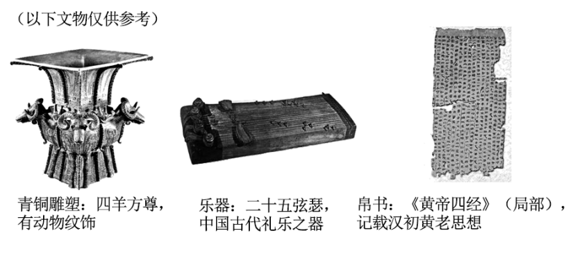

**湖南省2023年普通高中学业水平选择性考试**

**思想政治**

**注意事项：**

**1.答卷前，考生务必将自己的姓名、准考证号填写在本试卷和答题卡上。**

**2.回答选择题时，选出每小题答案后，用铅笔把答题卡上对应题目的答案标号涂**

**黑。如需改动，用橡皮擦干净后，再选涂其他答案标号。回答非选择题时，将答案写在答题卡上。写在本试卷上无效。**

**3.考试结束后，将本试卷和答题卡一并交回。**

**一、选择题：本题共16小题，每小题3分，共48分。在每小题给出的四个选项中，只有一项是符合题目要求的。**

1\. 中国特色社会主义开创于改革开放新时期，但了解其形成和发展的脉络，认识其历史必然性和科学真理性，应该拉长时间尺度，放在世界社会主义演进的历程中去把握。从这一历程来看（ ）

①科学社会主义在二十一世纪的中国焕发出强大生机活力

②中国特色社会主义不断发展并已跨越社会主义初级阶段

③中国特色社会主义正成为振兴世界社会主义的中流砥柱

④冷战结束后世界社会主义运动低潮状态得到了根本改变

A. ①② B. ①③ C. ②④ D. ③④

2\. 马克思和恩格斯在《德意志意识形态》中写道，在共产主义社会里，“任何人都没有特殊的活动范围，而是都可以在任何部门内发展，社会调节着整个生产，因而使我有可能随自己的兴趣今天干这事，明天干那事，上午打猎，下午捕鱼，傍晚从事畜牧，晚饭后从事批判，这样就不会使我老是一个猎人、渔夫、牧人或批判者。”对此理解正确的是（ ）

①这是对未来共产主义社会形态的全面描绘

②人的自由发展是共产主义社会的基本前提

③追求人的自由发展是共产主义的价值旨归

④共产主义社会人们将摆脱传统分工的束缚

A. ①② B. ①③ C. ②④ D. ③④

3\. 从期盼"第三新文明”到创造“人类文明新形态"深刻昭示（ ）

①第三新文明的设想为推动人类文明繁荣发展贡献了最佳道路

②各国历史的多样性是由人类社会发展的一般进程反映出来的

③中国共产党是带领中国人民创造人类文明新形态的核心力量

④人类文明新形态是坚持和发展中国特色社会主义的实践成果

A. ①② B. ①③ C. ②④ D. ③④

4\. 近年来，我国人口出生率持续走低，如不加以干预，就会对未来人口和经济社会安全构成潜在风险。为此，需要加快建立生育支持政策体系，降低生育、养育、教育成本。以下政策作用路径正确的是（ ）

①发放育儿补贴→减轻税费负担→降低生育成本→增强生育意愿

②延长生育假期→提供时间便利→降低生育成本→增强生育意愿

③发展普惠托育→完善公共服务→降低养育成本→增强生育意愿

④均衡发展教育→提高教育质量→降低教育成本→增强生育意愿

A. ①② B. ①④ C. ②③ D. ③④

5\. 拔河、插秧、赶小猪，乡村燃起“土味”运动会，带动了体育兴村的乡村振兴新模式。某村因地制宜，大力发展攀岩项目，抱回了“全国攀岩第一村”的金字招牌，连续4年举办了全国美丽乡村攀岩系列赛，吸引游客10多万人次，促进村集体年均增收150万元。体育兴村的创新实践有利于（ ）

①创造以城带乡新机制，促进农民增收

②提高农民健康水平，推进乡风文明建设

③促进农村产业融合，加快推进农村现代化

④完善农村基本经营制度，发展壮大集体经济

A. ①② B. ①④ C. ②③ D. ③④

6\. 某市社区治理中，在基层党组织领导下，打破化解矛盾仅靠干部单向协调的思维惯性，充分发动群众参与，把群众代表请上“评判席",融入“法理情”,共评共商共断群众诉求的是与非，把矛盾化解在基层。这种做法（ ）

①把党的组织优势转化为基层治理效能

②调动了多元主体参与基层治理的积极性

③是基层政权转变治理方式的生动实践

④结合了法律的教化作用和道德的规范作用

A. ①② B. ①④ C. ②③ D. ③④

7\. 在新一轮国家机构改革中，重组后的科技部不再参与具体科研项目评审和管理，而是强化战略规划、资源统筹、综合协调等宏观管理职责，推动健全新型举国体制，优化科技创新全链条管理，促进科技成果转化。重组科技部旨在（ ）

①为提升科技创新整体效能提供基本政治制度保障

②优化部门职能配置，以科技力量赋能国家治理

③理顺科技创新管理体系，助力解决“卡脖子”问题

④强化政府宏观管理职责，促进科技和经济社会发展

A. ①② B. ①③ C. ②④ D. ③④

8\. “学思想、强党性、重实践、建新功”是学习贯彻习近平新时代中国特色社会主义思想主题教育的总要求。精准扶贫理念推动中国减贫事业取得巨大成就；构建人类命运共同体理念显著提升我国国际影响力、感召力；……在习近平新时代中国特色社会主义思想的科学指引下，我国创造了一个个令人刮目相看的人间奇迹。这表明（ ）

①真理性认识更具有能动创造性和直接现实性

②理论是在实践指导下沿着科学性方向不断深化的

③理论的感召力从根本上源于在科学指导实践中展现的真理力量

④学思想目的在于把思想变成改造主观世界和客观世界的强大武器

A. ①② B. ①③ C. ②④ D. ③④

9\. 三湘巨变，时光为证。一秒钟，“天河”新一代超级计算机可完成20亿亿次高精度运算。一分钟，“潇湘二号”卫星绕地球百分之一圈。一小时，湖南可下线12台挖掘机。……每一秒，每一分，每一个日夜，构筑湖南“时间”,成就中国力量。这表明（ ）

①三湘巨变凸显出量的积累必然引起质变

②三湘巨变蕴含着新事物取代旧事物的趋势

③湖南“时间”反映了世界的永恒变化和发展

④湖南“时间”到中国力量是共性到个性的转化

A. ①③ B. ①④ C. ②③ D. ②④

10\. 方圆之境，一眼千年。在一块宋代铜镜的背面浮雕上，我们有幸目睹一场“镜上足球赛"——有人高髻笄发，作踢球状；有人戴幞头，着长服，半蹲膝，身稍前倾，作认真接球姿势。伴随了中国人数千年的铜镜已然成为一种文化意象，映照至今。由此可知（ ）

①浮雕画面蕴含着古代中国人民朝气蓬勃的体育精神

②铜镜与体育的生动融合拓宽了文化发展的基本路径

③铜镜是中华传统文化的传承和表现的物化形式之一

④铜镜文化是中华优秀传统文化独特魅力的集中体现

A. ①③ B. ①④ C. ②③ D. ②④

11\. 2022年A国大选中，工党获得联邦议会多数席位，击败了自由党-国家党联盟。在获得A国总督任命后，工党党首成为新一任总理。此前，A国某州政府曾与B国签订了合作文件，但最终被自由党-国家党联盟主导的联邦政府以违反《对外关系法案》为由否决。工党成功执政有望缓和与B国关系、恢复该合作。由此可推断出（ ）

①A国在国家结构形式上采用的是复合制

②A国实行多党制，更能以民主方式保障阶级利益

③A国实行君主立宪制，在实际运行中与民主共和制大体相同

④A国政府领导人的更替是A国和B国关系可能变化的主要原因

A. ①② B. ①③ C. ②④ D. ③④

12\. 2023年是“一带一路”倡议提出十周年，世界大多数国家认可“一带一路”倡议并签署了合作协议。十年间，“一带一路”打造了可靠的“朋友圈”,强化了全球互联互通网络，助力全球治理体系的建设与改革，极大提升了我国对外开放的广度与深度。这体现出（ ）

①主权国家具有独立权和平等权

②国家利益是国家合作的基础

③中国方案在全球治理中发挥重要作用

④公共外交是解决全球发展失衡问题的首要手段

A ①③ B. ①④ C. ②③ D. ②④

13\. 民法典规范各类民事主体的各种人身关系和财产关系，涉及社会生活的方方面面。下列漫画描述的情境符合民法典规范的是（ ）

A. ①② B. ①④ C. ②③ D. ③④

14\. 党的二十大报告强调"完善公益诉讼制度"。公益诉讼制度捍卫公共利益，从顶层设计到实践落地，从局部试点到全面推开，受到广泛关注。以下案例属于公益诉讼范畴的是（ ）

①某医疗科技公司诉某健康科技公司名誉权纠纷案

②陈某在某世界自然遗产地“金顶摩崖”刻字案

③孙某与某通信公司隐私权、个人信息保护纠纷案

④罗某侵害抗美援朝“冰雕连”英雄烈士名誉、荣誉案

A. ①② B. ①③ C. ②④ D. ③④

15\. 某校组织学生深入乡村进行社会调查研究。经过走访，他们以判断形式形成了关于某村调查结论：所有家庭都不是贫困户；有些回乡创业的村民是大学毕业生；李家老屋是红色资源。在上述调查结论中（ ）

①“贫困户”是不周延的

②“大学毕业生”是不周延

③“回乡创业的村民”是周延的

④“李家老屋”是周延的

A. ①② B. ①③ C. ②④ D. ③④

16\. 为了推动学雷锋活动常态化，把雷锋精神代代传承下去，某班开展学雷锋活动，可选活动方式有“参加环保志愿服务”“参观雷锋纪念馆”“慰问福利院老人”。全班男生：如果不参观雷锋纪念馆，就不参加环保志愿服务。全班女生：要么参加环保志愿服务，要么慰问福利院老人。以下能满足全班同学要求的方案是（ ）

①参观雷锋纪念馆，并慰问福利院老人

②只慰问福利院老人，不参观雷锋纪念馆

③参加环保志愿服务，并慰问福利院老人

④只参加环保志愿服务，不参观雷锋纪念馆

A. ①② B. ①④ C. ②③ D. ③④

**二、非选择题：共52分。**

17\. 阅读材料，完成下列要求。

材料一 进入新时代以来，我国不断通过制度创新和体制机制创新，破除民营企业市场准入门槛，激发民营企业的积极性，严格保护民营经济市场主体经营自主权、财产权等合法权益，引导民营经济健康发展、高质量发展。面对新时代新挑战，广大民营企业奋力拼搏，发挥经营自主灵活的优势，发展韧性不断增强，发展活力不断迸发，民营经济已成为发展主力军和转型升级排头兵，还是创新创业主战场和推动实现共同富裕的重要力量。

材料二 2022年，我国民营企业进出口规模所占比重达到50.9%,对我国外贸增长贡献率达到80.8%,民营企业外贸第一大主体地位继续巩固。同时，民营企业在对外开放中也遇到一些问题和挑战。如，全球贸易壁垒高企，民营企业开拓国际市场风险与障碍增多；发达经济体通过各种措施推动制造业企业回流，外加东南亚等地区制造业的崛起，我国民营企业原有的比较优势受到冲击；部分民营企业处于产业链低端，技术创新由于各种原因陷入低端锁定的困境。

（1）结合材料一，运用经济与社会知识，说明我国民营经济的韧性与活力来自哪里。

（2）结合材料二，运用“经济全球化与中国”的知识，说明我国政府应如何助力民营企业在对外开放中形成竞争新优势。

18\. 阅读材料，完成下列要求。

党的十八大以来，以习近平同志为核心的党中央全面加强对人大工作的领导，人大工作取得历史性成就，人民代表大会制度更加成熟更加定型。某校以“人民代表大会制度更加成熟更加定型”为主题策划展览，以下为部分展出材料：

<table style="width:100%;">
<colgroup>
<col style="width: 8%" />
<col style="width: 91%" />
</colgroup>
<thead>
<tr>
<th>"数"说人大</th>
<th>
十三届全国人大及其常委会制定法律47件，修改法律111件次，作出法律解释1件；累计督促推动制定机关修改完善或者废止各类规范性文件约2.5

万件；举办了全国人大代表学习班26期；出台关于加强和改进全国人大代表工作的具体措施35条。
</th>
</tr>
</thead>
<tbody>
<tr>
<td rowspan="2">工作剪影</td>
<td>2023年1月，全国人大常委会法工委某基层立法联系点召开座谈会，征求农村集体经济组织法(草案)的立法意见，村民积极参与讨论。</td>
</tr>
<tr>
<td>十三届全国人大常委会连续5年开展执法检查，持续助力污染防治攻坚战和生态文明建设。某人大代表说："执法检查过程中，我们确实感到天变蓝了，水变清了，海洋环境也变好了。”</td>
</tr>
</tbody>
</table>

为什么说人民代表大会制度更加成熟更加定型?结合材料，运用政治与法治知识加以分析。

19\. 阅读材料，完成下列要求。

1994年，甲媒体委托张某为即将拍摄的动画片创作人物形象，张某先用铅笔勾勒了三个人物概念图。后由甲媒体在原基础上进行再创作，重塑了三个人物形象，载明“人物设计：张某"。

2012年，张某与乙公司签订《著作权转让合同》,转让金额为伍万元人民币，并交割。乙公司向A省版权局成功申请三个人物概念图的作品登记，作者为张某，著作权人为乙公司。

2013年，甲媒体就重塑的三个人物形象图向B直辖市版权局申请作品登记，取得相应作品登记证书，作者为张某，著作权人为甲媒体。

2019年，甲媒体发现乙公司已把重塑的三个人物形象图，加载至某商城电子商务平台运营。甲媒体认为乙公司构成侵权，遂起诉至人民法院。

<table style="width:100%;">
<colgroup>
<col style="width: 99%" />
</colgroup>
<thead>
<tr>
<th>
相关资料

《中华人民共和国著作权法》第十三条改编、翻译、注释、整理已有作品而产生的作品，其著作权由改编、翻译、注释、整理人享有，但行使著作权时不得侵犯原作品的著作权。
</th>
</tr>
</thead>
<tbody>
</tbody>
</table>

结合材料，运用法律与生活知识，判断甲媒体诉乙公司侵权是否成立，并说明理由。

20\. 阅读材料，完成下列要求。

【中国式现代化打破了“现代化=西方化”的迷思】

习近平总书记指出：“我国现代化同西方发达国家有很大不同。西方发达国家是一个‘串联式’的发展过程，工业化、城镇化、农业现代化、信息化顺序发展，发展到目前水平用了二百多年时间。我们要后来居上，把‘失去的二百年’找回来，决定了我国发展必然是一个‘并联式’的过程，工业化、信息化、城镇化、农业现代化是叠加发展的。”现代化的“并联式”过程是中国与西方发达国家在现代化发展时空特征上的最显著区别。

（1）中国式现代化必然是一个“并联式”的发展过程。结合材料，运用具体问题具体分析的知识加以说明。

【中国式现代化促进人类文明的整体进步】

人类只有肤色语言之别，文明只有姹紫嫣红之别，但绝无高低优劣之分。“文明冲突论”认为，世界各种文明之间存在着很大差异，这种差异会导致不同民族和国家之间的冲突、敌视甚至战争。中国式现代化破解“文明冲突论”,紧紧扎根中国土壤，立足中华文明发展逻辑，在顺应时代发展潮流的基础上，以辩证方式处理不同文明之间的关系，坚持以文明交流超越文明隔阂，以文明互鉴超越文明冲突，以文明共存超越文明优越，弘扬中华文明蕴含的全人类共同价值，为推动人类文明进步贡献了中国智慧。

（2）结合材料，运用文化知识，说明中国式现代化是如何破解“文明冲突论”,为推动人类文明进步贡献中国智慧的。

【推进中国式现代化需要丰富人民精神世界】

文物承载灿烂文明，传承历史文化，维系民族精神，是老祖宗留给我们的宝贵遗产，是加强社会主义精神文明建设的深厚滋养。在推进中国式现代化进程中，要通过活化利用让文物重现璀璨光彩，融入现代生活，“让文物活起来”。

（3）运用发散思维检核表法中任意一种方法，结合某一具体文物，谈谈怎样让该文物“活”起来。

要求：指出所用具体思维方法，阐明创新路径及其预期效果，不得透露任何个人信息，字数在150字以内。(以下文物仅供参考)

