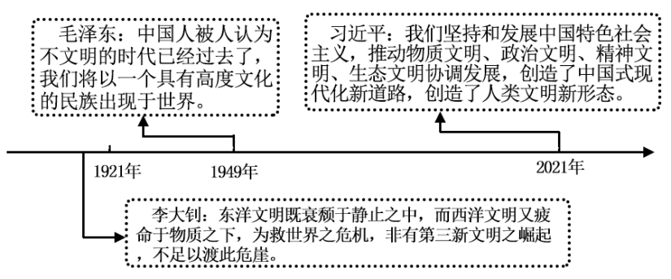
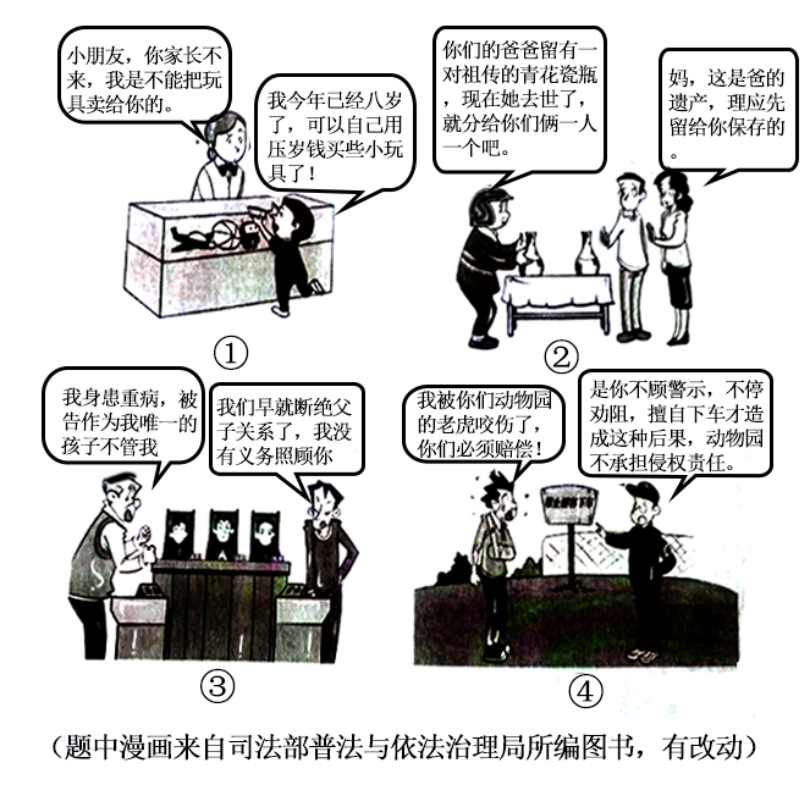

**湖南省2023年普通高中学业水平选择性考试**

**思想政治**

**注意事项：**

**1.答卷前，考生务必将自己的姓名、准考证号填写在本试卷和答题卡上。**

**2.回答选择题时，选出每小题答案后，用铅笔把答题卡上对应题目的答案标号涂**

**黑。如需改动，用橡皮擦干净后，再选涂其他答案标号。回答非选择题时，将答案写在答题卡上。写在本试卷上无效。**

**3.考试结束后，将本试卷和答题卡一并交回。**

**一、选择题：本题共16小题，每小题3分，共48分。在每小题给出的四个选项中，只有一项是符合题目要求的。**

1\. 中国特色社会主义开创于改革开放新时期，但了解其形成和发展的脉络，认识其历史必然性和科学真理性，应该拉长时间尺度，放在世界社会主义演进的历程中去把握。从这一历程来看（ ）

①科学社会主义在二十一世纪的中国焕发出强大生机活力

②中国特色社会主义不断发展并已跨越社会主义初级阶段

③中国特色社会主义正成为振兴世界社会主义的中流砥柱

④冷战结束后世界社会主义运动低潮状态得到了根本改变

A. ①② B. ①③ C. ②④ D. ③④

【答案】B

【解析】

【详解】①③：认识中国特色社会主义的历史必然性和科学真理性，要放在世界社会主义演进的历程中去把握，说明科学社会主义在二十一世纪的中国焕发出强大生机活力，取得的历史成果证明了中国特色社会主义正成为振兴世界社会主义的中流砥柱，①③正确。

②：中国特色社会主义处于社会主义初级阶段，“已跨越”不符合事实，②说法错误。

④：冷战结束后，世界仅剩5个社会主义国家，仅从社会主义国家的数量上来看，世界社会主义运动仍然处于低潮，“得到了根本改变”说法错误，④不选。

故答案选B。

2\. 马克思和恩格斯在《德意志意识形态》中写道，在共产主义社会里，“任何人都没有特殊的活动范围，而是都可以在任何部门内发展，社会调节着整个生产，因而使我有可能随自己的兴趣今天干这事，明天干那事，上午打猎，下午捕鱼，傍晚从事畜牧，晚饭后从事批判，这样就不会使我老是一个猎人、渔夫、牧人或批判者。”对此理解正确的是（ ）

①这是对未来共产主义社会形态的全面描绘

②人的自由发展是共产主义社会的基本前提

③追求人的自由发展是共产主义的价值旨归

④共产主义社会人们将摆脱传统分工的束缚

A. ①② B. ①③ C. ②④ D. ③④

【答案】D

【解析】

【详解】①：“任何人都可以在任何部门内发展”是对共产主义社会中人的自由发展的描写，并没有对未来共产主义社会形态的全面描绘，①说法错误。

②③：《共产党宣言》阐述了未来共产主义社会的理想目标，指出“在那里，每个人的自由发展是一切人的自由发展的条件。”实现人的自由而全面的发展，是马克思主义追求的根本价值目标，是共产主义社会的根本特征，生产力的高度发展是共产主义社会的基本前提，②说法错误，③符合题意。

④：共产主义社会之所以能实现人的自由而全面发展，“不会使我老是一个猎人、渔夫、牧人或批判者”，其中一个重要的原因是人类从旧的社会关系束缚下解放出来，摆脱一切剥削压迫和旧式分工的束缚，成为社会关系的主人，④符合题意。

故本题选D。

3\. 从期盼"第三新文明”到创造“人类文明新形态"深刻昭示（ ）

①第三新文明的设想为推动人类文明繁荣发展贡献了最佳道路

②各国历史的多样性是由人类社会发展的一般进程反映出来的

③中国共产党是带领中国人民创造人类文明新形态的核心力量

④人类文明新形态是坚持和发展中国特色社会主义的实践成果

A. ①② B. ①③ C. ②④ D. ③④

【答案】D

【解析】

【详解】①：第三新文明的设想让当时人们看到了中华文明走向新生的光明前景，为推动人类文明繁荣发展贡献了有借鉴意义的现代性方案，但不能说是最佳道路，故①错误。

②：普遍性通过特殊性表现出来。人类社会发展的一般进程是由各国、各地区、各民族历史的多样性反映出来的，故②错误。

③：由李大钊“第三新文明的设想”、毛泽东“具有高度文化的民族”到习近平“创造人类文明新形态”体现了中国共产党是带领中国人民创造人类文明新形态的核心力量，故③正确。

④：“我们坚持和发展中国特色社会主义，推动物质文明、政治文明、精神文明、社会文明、生态文明协调发展，创造了中国式现代化发展道路，创造了人类文明新形态”体现了人类文明新形态是坚持和发展中国特色社会主义的实践成果，故④正确。

故本题选D。

4\. 近年来，我国人口出生率持续走低，如不加以干预，就会对未来人口和经济社会安全构成潜在风险。为此，需要加快建立生育支持政策体系，降低生育、养育、教育成本。以下政策作用路径正确的是（ ）

①发放育儿补贴→减轻税费负担→降低生育成本→增强生育意愿

②延长生育假期→提供时间便利→降低生育成本→增强生育意愿

③发展普惠托育→完善公共服务→降低养育成本→增强生育意愿

④均衡发展教育→提高教育质量→降低教育成本→增强生育意愿

A. ①② B. ①④ C. ②③ D. ③④

【答案】C

【解析】

【详解】①：发放育儿补贴，可以减轻育儿经济压力，提升人们的生育意愿，但与“减轻税费负担”无关。①排除。

②：延长生育假期，可以延长父母陪伴、照料婴幼儿的时间，为其提供时间便利，在一定程度上降低父母生育、养育孩子的经济成本，有助于提高人们的生育意愿。②符合题意。

③：普惠托育是指面向3岁以下婴幼儿家庭，按照政府指导价格提供的符合相关标准和规范的托育服务。发展普惠托育服务是“十四五”规划确定的重点任务，也是降低生育、养育、教育成本，促进人口长期均衡发展的重大举措。③符合题意。

④：从长期来看，提高教育质量，推动教育均衡发展，有利于降低生育、养育和教育成本，提高优生优育服务水平。④排除。

故本题选C。

5\. 拔河、插秧、赶小猪，乡村燃起“土味”运动会，带动了体育兴村的乡村振兴新模式。某村因地制宜，大力发展攀岩项目，抱回了“全国攀岩第一村”的金字招牌，连续4年举办了全国美丽乡村攀岩系列赛，吸引游客10多万人次，促进村集体年均增收150万元。体育兴村的创新实践有利于（ ）

①创造以城带乡新机制，促进农民增收

②提高农民健康水平，推进乡风文明建设

③促进农村产业融合，加快推进农村现代化

④完善农村基本经营制度，发展壮大集体经济

A. ①② B. ①④ C. ②③ D. ③④

【答案】C

【解析】

【详解】①：“土味”运动会，带动了体育兴村的乡村振兴新模式，有助于促进农民增收，但材料没有涉及以城带乡机制，①排除。

②③：体育兴村的创新实践，能吸收游客，促进村集体增收，有利于提高农民健康水平，推进乡风文明建设，促进农村产业融合，加快推进农村现代化，②③正确。

④：农村基本经营制度是指以家庭承包经营为基础、统分结合的双层经营体制。材料没有涉及农村基本经营制度的完善，④排除。

故本题选C。

6\. 某市社区治理中，在基层党组织领导下，打破化解矛盾仅靠干部单向协调的思维惯性，充分发动群众参与，把群众代表请上“评判席",融入“法理情”,共评共商共断群众诉求的是与非，把矛盾化解在基层。这种做法（ ）

①把党的组织优势转化为基层治理效能

②调动了多元主体参与基层治理的积极性

③是基层政权转变治理方式的生动实践

④结合了法律的教化作用和道德的规范作用

A. ①② B. ①④ C. ②③ D. ③④

【答案】A

【解析】

【详解】①②：基层党组织领导发动群众，把群众代表请上“评判席”，融入“法理情”，共评共商共断群众诉求的是与非，把矛盾化解在基层，这充分调动了多元主体参与基层治理的积极性，是把党的组织优势转化为基层治理效能，①②符合题意。

③：材料反映的是社区治理，属于基层民主自治范畴，不涉及基层政权，也不能说明题中做法是否是基层政权转变治理方式的生动实践，③排除。

④：应该是结合了法律的规范作用和道德的教化作用，而不是“结合了法律的教化作用和道德的规范作用”，④错误。

故本题选A。

7\. 在新一轮国家机构改革中，重组后的科技部不再参与具体科研项目评审和管理，而是强化战略规划、资源统筹、综合协调等宏观管理职责，推动健全新型举国体制，优化科技创新全链条管理，促进科技成果转化。重组科技部旨在（ ）

①为提升科技创新整体效能提供基本政治制度保障

②优化部门职能配置，以科技力量赋能国家治理

③理顺科技创新管理体系，助力解决“卡脖子”问题

④强化政府宏观管理职责，促进科技和经济社会发展

A. ①② B. ①③ C. ②④ D. ③④

【答案】D

【解析】

【详解】③④：重组后科技部强化战略规划、资源统筹、综合协调等宏观管理职责，推动健全新型举国体制，优化科技创新全链条管理，促进科技成果转化，旨在促进科技和经济社会发展相结合，理顺科技创新管理体系，更好统筹科技力量在关键核心技术上攻坚克难，助力解决“卡脖子”问题，加快实现高水平科技自立自强，③④符合题意。

①：我国的基本政治制度主要包括中国共产党领导的多党合作和政治协商制度、民族区域自治制度和基层群众自治制度，重组科技部属于优化机构设置和职能配置，不属于“基本政治制度保障”，①排除。

②：材料强调是重组科技部对于新时代我国实现科技自立自强具有重要价值和实践意义，未体现科技力量赋能国家治理，②排除。

故本题选D。

8\. “学思想、强党性、重实践、建新功”是学习贯彻习近平新时代中国特色社会主义思想主题教育的总要求。精准扶贫理念推动中国减贫事业取得巨大成就；构建人类命运共同体理念显著提升我国国际影响力、感召力；……在习近平新时代中国特色社会主义思想的科学指引下，我国创造了一个个令人刮目相看的人间奇迹。这表明（ ）

①真理性认识更具有能动创造性和直接现实性

②理论是在实践指导下沿着科学性方向不断深化的

③理论的感召力从根本上源于在科学指导实践中展现的真理力量

④学思想的目的在于把思想变成改造主观世界和客观世界的强大武器

A. ①② B. ①③ C. ②④ D. ③④

【答案】D

【解析】

【详解】①：实践具直接现实性，真理没有直接现实性，①错误。

②：实践是认识的基础，认识指导实践，理论指导实践，“理论是在实践指导下”说法错误，②排除。

③：实践是认识的来源，“精准扶贫理念推动中国减贫事业取得巨大成就”、“构建人类命运共同体理念显著提升我国国际影响力、感召力”，等等，这些说明“理论的感召力从根本上源于在科学指导实践中展现的真理力量”，③正确切题。

④：实践是认识的目的。学习贯彻习近平新时代中国特色社会主义思想主题教育，因为在习近平新时代中国特色社会主义思想的科学指引下，我国创造了巨大的人间奇迹，这说明学思想的目的在于把思想变成改造主观世界和客观世界的强大武器，④正确切题。

故本题选D。

9\. 三湘巨变，时光证。一秒钟，“天河”新一代超级计算机可完成20亿亿次高精度运算。一分钟，“潇湘二号”卫星绕地球百分之一圈。一小时，湖南可下线12台挖掘机。……每一秒，每一分，每一个日夜，构筑湖南“时间”,成就中国力量。这表明（ ）

①三湘巨变凸显出量的积累必然引起质变

②三湘巨变蕴含着新事物取代旧事物的趋势

③湖南“时间”反映了世界的永恒变化和发展

④湖南“时间”到中国力量是共性到个性的转化

A. ①③ B. ①④ C. ②③ D. ②④

【答案】C

【解析】

【详解】①：量变达到一定程度才能引起质变，①错误。

②③：一秒钟，“天河”新一代超级计算机可完成20亿亿次高精度运算。一分钟，“潇湘二号”卫星绕地球百分之一圈。一小时，湖南可下线12台挖掘机。体现了三湘巨变蕴含着新事物取代旧事物的趋势，湖南“时间”反映了世界的永恒变化和发展，②③正确。

④：湖南“时间”到中国力量，是个性到共性的转化，④排除。

故本题选C。

10\. 方圆之境，一眼千年。在一块宋代铜镜的背面浮雕上，我们有幸目睹一场“镜上足球赛"——有人高髻笄发，作踢球状；有人戴幞头，着长服，半蹲膝，身稍前倾，作认真接球姿势。伴随了中国人数千年的铜镜已然成为一种文化意象，映照至今。由此可知（ ）

①浮雕画面蕴含着古代中国人民朝气蓬勃的体育精神

②铜镜与体育的生动融合拓宽了文化发展的基本路径

③铜镜是中华传统文化的传承和表现的物化形式之一

④铜镜文化是中华优秀传统文化独特魅力的集中体现

A. ①③ B. ①④ C. ②③ D. ②④

【答案】A

【解析】

【详解】①：铜镜上的“镜上足球赛"，生动描绘了中国古代人民的体育竞技场景，浮雕画面蕴含着古代中国人民朝气蓬勃的体育精神，①正确。

②：文化发展的基本路径有坚定理想信念坚持以人民为中心，立足时代之基回答时代问题，融通不同资源实现综合创新，铜镜与体育的生动融合并没有拓宽文化发展的基本路径，②排除。

③：伴随了中国人数千年的铜镜已然成为一种文化意象，映照至今，体现出铜镜是中华传统文化的传承和表现的物化形式之一，③正确。

④：中华文化的力量，集中表现为民族精神的力量。中华民族精神，深深根植于绵延数千年的优秀传统文化之中。铜镜文化不是中华优秀传统文化独特魅力的集中体现，④排除。

故本题选A。

11\. 2022年A国大选中，工党获得联邦议会多数席位，击败了自由党-国家党联盟。在获得A国总督任命后，工党党首成为新一任总理。此前，A国某州政府曾与B国签订了合作文件，但最终被自由党-国家党联盟主导的联邦政府以违反《对外关系法案》为由否决。工党成功执政有望缓和与B国关系、恢复该合作。由此可推断出（ ）

①A国在国家结构形式上采用的是复合制

②A国实行多党制，更能以民主方式保障阶级利益

③A国实行君主立宪制，在实际运行中与民主共和制大体相同

④A国政府领导人的更替是A国和B国关系可能变化的主要原因

A. ①② B. ①③ C. ②④ D. ③④

【答案】A

【解析】

【详解】①：材料中“联邦议会、州政府及联邦政府”等词可知A国在国家结构形式上采用的是联邦制的复合制，①入选。

②：材料中“自由党-国家党联盟主导的联邦政府、工党获得联邦议会多数席位”等关键词可知A国实行多党制，更能以民主方式保障阶级利益，②入选。

③：材料中“在获得A国总督任命后，工党党首成为新一任总理和工党获得联邦议会多数席位”可知A国实行议会制民主共和制，而不是君主立宪制，③不选。

④：材料中“工党成功执政有望缓和与B国关系、恢复该合作。”可知A国政府领导人的更替是A国和B国关系可能变化的原因之一，但不一定是“主要原因”，④不选。

故本题选A。

12\. 2023年是“一带一路”倡议提出十周年，世界大多数国家认可“一带一路”倡议并签署了合作协议。十年间，“一带一路”打造了可靠的“朋友圈”,强化了全球互联互通网络，助力全球治理体系的建设与改革，极大提升了我国对外开放的广度与深度。这体现出（ ）

①主权国家具有独立权和平等权

②国家利益是国家合作的基础

③中国方案在全球治理中发挥重要作用

④公共外交是解决全球发展失衡问题的首要手段

A. ①③ B. ①④ C. ②③ D. ②④

【答案】A

【解析】

【详解】①③：世界大多数国家认可“一带一路”倡议并签署了合作协议，说明主权国家具有独立权和平等权，强化了全球互联互通网络，助力全球治理体系的建设与改革，极大提升了我国对外开放的广度与深度，说明中国方案在全球治理中发挥重要作用，①③正确。

②：国家间的共同利益是国家合作的基础，②说法错误。

④：材料未涉及公共外交，且并非是“首要手段”，④排除。

故本题选A

13\. 民法典规范各类民事主体的各种人身关系和财产关系，涉及社会生活的方方面面。下列漫画描述的情境符合民法典规范的是（ ）

A. ①② B. ①④ C. ②③ D. ③④

【答案】B

【解析】

【详解】①：八周岁以上的未成年人属于限制民事行为能力人，不能进行商品买卖活动，①情境中的描述正确。

②：法定继承第一顺序为配偶、子女、父母。《民法典》第1130条规定：同一顺序的法定继承人在继承遗产时，一般情况下，应当按继承人的人数均等分配遗产数额，②情境中的描述错误。

③：根据《民法典》第一百五十三条规定，违背公序良俗的民事法律行为是无效的。公序良俗原则是指民事主体的行为应当遵守公共秩序，符合善良风俗，不得违反国家的公共秩序和善良风俗。断绝父子关系有违公序良俗原则，这个行为是无效的。所以小李依然有义务照顾赡养老李，③情境中的描述错误。

④：动物园的动物造成他人损害的，动物园应当承担侵权责任；游客无视动物园警示，不遵守园区规定，在动物园被动物袭击造成损害，如果动物园方能够证明已经尽到管理职责的，不承担侵权责任，④情境中的描述正确。

故答案选B。

14\. 党的二十大报告强调"完善公益诉讼制度"。公益诉讼制度捍卫公共利益，从顶层设计到实践落地，从局部试点到全面推开，受到广泛关注。以下案例属于公益诉讼范畴的是（ ）

①某医疗科技公司诉某健康科技公司名誉权纠纷案

②陈某在某世界自然遗产地“金顶摩崖”刻字案

③孙某与某通信公司隐私权、个人信息保护纠纷案

④罗某侵害抗美援朝“冰雕连”英雄烈士名誉、荣誉案

A. ①② B. ①③ C. ②④ D. ③④

【答案】C

【解析】

【详解】①③：民事诉讼是指公民之间、法人之间、其他组织之间以及他们相互之间因财产关系和人身关系提起的诉讼。某医疗科技公司诉某健康科技公司名誉权纠纷案，孙某与某通信公司隐私权、个人信息保护纠纷案，属于民事诉讼，①③不符合题意。

②④：公益诉讼制度的法律依据是对污染环境、侵害众多消费者合法权益等损害社会公共利益的行为，法律规定的机关和有关组织可以向人民法院提起诉讼。人民检察院在履行职责中发现破坏生态环境和资源保护、食品药品安全领域侵害众多消费者合法权益等损害社会公共利益的行为，在没有前款规定的机关和组织或者前款规定的机关和组织不提起诉讼的情况下，可以向人民法院提起诉讼。陈某在某世界自然遗产地“金顶摩崖”刻字案，罗某侵害抗美援朝“冰雕连”英雄烈士名誉、荣誉案，属于公益诉讼范畴，②④正确。

故本题选C。

15\. 某校组织学生深入乡村进行社会调查研究。经过走访，他们以判断形式形成了关于某村的调查结论：所有家庭都不是贫困户；有些回乡创业的村民是大学毕业生；李家老屋是红色资源。在上述调查结论中（ ）

①“贫困户”是不周延的

②“大学毕业生”是不周延的

③“回乡创业的村民”是周延的

④“李家老屋”是周延的

A. ①② B. ①③ C. ②④ D. ③④

【答案】C

【解析】

【详解】①：在否定判断中的谓项是周延的，因此“贫困户”是周延的，①说法错误。

②：在肯定判断中的谓项是不周延的，因此“大学毕业生”是不周延的，②说法正确。

③：在特称肯定判断中的主项是不周延的，因此有些回乡创业的村民中的“回乡创业的村民”是不周延的，③说法错误。

④：在单称肯定判断中的主项是周延的，因此“李家老屋”是周延的，④说法正确。

故本题选C。

16\. 为了推动学雷锋活动常态化，把雷锋精神代代传承下去，某班开展学雷锋活动，可选活动方式有“参加环保志愿服务”“参观雷锋纪念馆”“慰问福利院老人”。全班男生：如果不参观雷锋纪念馆，就不参加环保志愿服务。全班女生：要么参加环保志愿服务，要么慰问福利院老人。以下能满足全班同学要求的方案是（ ）

①参观雷锋纪念馆，并慰问福利院老人

②只慰问福利院老人，不参观雷锋纪念馆

③参加环保志愿服务，并慰问福利院老人

④只参加环保志愿服务，不参观雷锋纪念馆

A. ①② B. ①④ C. ②③ D. ③④

【答案】A

【解析】

【详解】③：全班女生：要么参加环保志愿服务，要么慰问福利院老人。这是不相容选言判断，在进行不相容的选言推理时，如果肯定了选言判断前提中的一部分选言支，结论就可以否定剩下的另一部分选言支；如果否定了选言判断前提中的一部分选言支，结论就可以肯定剩下的另一部分选言支。 参加环保志愿服务，一定不能慰问福利院老人，③排除。

④：全班男生：如果不参观雷锋纪念馆，就不参加环保志愿服务。这是充分条件假言判断，以此为依据进行推理可以得出：不参观雷锋纪念馆，不参加环保志愿服务；参加环保志愿服务，参观雷锋纪念馆，排除④。

①：根据男生的观点，参观雷锋纪念馆，可能参加环保志愿服务，也可能不参加环保志愿服务；根据女生的观点，不参加环保志愿服务，可以慰问福利院老人，①正确。

②：根据女生的观点，慰问福利院老人，不参加环保志愿服务；根据全班男生观点，不参加环保志愿服务，可能参观雷锋纪念馆，也可能不参观雷锋纪念馆，②正确。

故本题选A。

**二、非选择题：共52分。**

17\. 阅读材料，完成下列要求。

材料一 进入新时代以来，我国不断通过制度创新和体制机制创新，破除民营企业市场准入门槛，激发民营企业的积极性，严格保护民营经济市场主体经营自主权、财产权等合法权益，引导民营经济健康发展、高质量发展。面对新时代新挑战，广大民营企业奋力拼搏，发挥经营自主灵活的优势，发展韧性不断增强，发展活力不断迸发，民营经济已成为发展主力军和转型升级排头兵，还是创新创业主战场和推动实现共同富裕的重要力量。

材料二 2022年，我国民营企业进出口规模所占比重达到50.9%,对我国外贸增长贡献率达到80.8%,民营企业外贸第一大主体地位继续巩固。同时，民营企业在对外开放中也遇到一些问题和挑战。如，全球贸易壁垒高企，民营企业开拓国际市场风险与障碍增多；发达经济体通过各种措施推动制造业企业回流，外加东南亚等地区制造业的崛起，我国民营企业原有的比较优势受到冲击；部分民营企业处于产业链低端，技术创新由于各种原因陷入低端锁定的困境。

（1）结合材料一，运用经济与社会知识，说明我国民营经济的韧性与活力来自哪里。

（2）结合材料二，运用“经济全球化与中国”的知识，说明我国政府应如何助力民营企业在对外开放中形成竞争新优势。

【答案】（1）①国家鼓励、支持、引导非公有制经济发展，通过制度创新，营造促进民营经济发展的制度环境，破除体制机制障碍。②国家健全市场环境和法治环境，促进各种所有制主体依法平等使用资源要素、公开公平公正参与竞争、同等受到法律保护，营造促进民营经济发展的良好环境和社会氛围。③民营企业顺应时代发展潮流，找准市场定位，制定正确的经营战略，努力提高企业管理水平，完善管理体制机制。④民营企业提高自主创新能力，提高生产技术水平和研发能力，推动发展转型升级，增加就业，积极承担社会责任，推动经济发展和提高人民生活水平。

（2）①我国政府和企业要共同携手，运用我们的智慧，充分利用世贸组织赋予的权利，有效应对国际贸易壁垒，为发展更高层次开放型经济营造良好的外部环境。②我国政府鼓励、支持、引导民营经济转变对外发展方式，着力培育开放型经济发展新优势，形成以技术、品牌、质量、服务为核心的出口竞争新优势，拓展对外贸易。③我国政府应促进民营企业加强国际产能合作和技术合作，加快培育国际经济合作和竞争新优势，保护外商投资合法权益，实行高水平的贸易和投资自由化便利化政策，鼓励外资投资我国制造业。④我国继续坚持对外开放的基本国策，坚持引进来和走出去相结合，坚持实施更大范围、更宽领域、更深层次对外开放，实现互利共嬴。

【解析】

【分析】背景素材：我国鼓励民营企业发展

考点考查：两个毫不动摇、企业的经营与发展、经济高质量发展、“经济全球化与中国”

能力考查：获取和解读信息、调动和运用知识、描述和阐释事物

核心素养：政治认同、科学精神

【小问1详解】

第一步：审设问。明确主体、知识范围、问题限定和作答角度。本题设问主体为民营经济、本题知识范围限定为两个“毫不动摇”、国家对非公有制经济的态度、企业经营成功的主要因素，要求分析我国民营经济的韧性与活力？解答时，获取材料信息，多角度结合知识要点作答。

第二步：审材料。提取关键词，链接教材知识。

关键词①：通过制度创新和体制机制创新，破除民营企业市场准入门槛，激发民营企业的积极性→可联系国家对非公有制经济的态度。

关键词②：严格保护民营经济市场主体经营自主权、财产权等合法权益→可联系两个“毫不动摇”。

关键词③：面对新时代新挑战，广大民营企业奋力拼搏，发挥经营自主灵活的优势，发展韧性不断增强，发展活力不断迸发→可联系企业经营成功的主要因素：经营战略。

关键词④：转型升级排头兵、创新创业主战场、实现共同富裕的重要力量→可联系企业经营成功的主要因素：自主创新、社会责任。

第三步：整合信息，组织答案。注意设问限定以及教材知识与材料等相结合。

【小问2详解】

第一步：审设问。明确主体、知识范围、问题限定和作答角度。本题设问主体为政府，本题知识限定为“经济全球化与中国”，要求分析政府应如何助力民营企业在对外开放中形成竞争新优势。解答时，获取材料信息，结合知识要点作答。

第二步：审材料。提取关键词，链接教材知识。

关键词①：民营企业在对外开放中遇到的问题和挑战，如，全球贸易壁垒高企，民营企业开拓国际市场风险与障碍增多→可联系发展更高层次的开放型经济：利用世贸组织赋予的权利，有效应对国际贸易壁垒。

关键词②：我国民营企业原有的比较优势受到冲击，部分民营企业处于产业链低端，技术创新由于各种原因陷入低端锁定→可联系我国对外开放如何适应新形势：两个新优势：开放型经济发展新优势、出口竞争新优势。

关键词③：发达经济体通过各种措施推动制造业企业回流，外加东南亚等地区制造业的崛起→可联系我国对外开放如何适应新形势：一个政策、一个新优势：实行高水平的贸易和投资自由化便利化政策、国际经济合作和竞争新优势。

关键词④：政府要保证民营企业外贸第一大主体地位，发挥民营企业在外贸中的作用→可联系发展更高层次的开放型经济、独立自主与对外开放：“引进来”与“走出去”并重，扩大对外开放，奉行互利共赢的开放战略。

第三步：整合信息，组织答案注意设问限定以及教材知识与材料等相结合。

18\. 阅读材料，完成下列要求。

党的十八大以来，以习近平同志为核心的党中央全面加强对人大工作的领导，人大工作取得历史性成就，人民代表大会制度更加成熟更加定型。某校以“人民代表大会制度更加成熟更加定型”为主题策划展览，以下为部分展出材料：

<table style="width:100%;">
<colgroup>
<col style="width: 8%" />
<col style="width: 91%" />
</colgroup>
<thead>
<tr>
<th>"数"说人大</th>
<th>
十三届全国人大及其常委会制定法律47件，修改法律111件次，作出法律解释1件；累计督促推动制定机关修改完善或者废止各类规范性文件约2.5

万件；举办了全国人大代表学习班26期；出台关于加强和改进全国人大代表工作的具体措施35条。
</th>
</tr>
</thead>
<tbody>
<tr>
<td rowspan="2">工作剪影</td>
<td>2023年1月，全国人大常委会法工委某基层立法联系点召开座谈会，征求农村集体经济组织法(草案)的立法意见，村民积极参与讨论。</td>
</tr>
<tr>
<td>十三届全国人大常委会连续5年开展执法检查，持续助力污染防治攻坚战和生态文明建设。某人大代表说："在执法检查过程中，我们确实感到天变蓝了，水变清了，海洋环境也变好了。”</td>
</tr>
</tbody>
</table>

为什么说人民代表大会制度更加成熟更加定型?结合材料，运用政治与法治知识加以分析。

【答案】①坚持党的全面领导，经法定程序将党的主张上升为国家意志，为人大制度更加成熟更加定型提供了政治保证；②全国人大及其常委会积极行使立法权、监督权，促进法制健全和执法规范，改进人大代表工作，为人大制度更加成熟更加定型提供了法治保障；③基层立法联系点的设立，充分体现了全国人大及其常委会坚持全过程人民民主，坚持民主立法，健全立法机关和社会公众沟通机制，拓宽公民有序参与立法的途径，提高村民参与立法的积极性，为人大制度更加成熟更加定型提供了群众基础；④人大制度是坚持党的领导、人民当家作主、依法治国有机统一的根本政治制度。党的十八大以来，人大工作取得历史性成就，充分体现了人大制度更加成熟更加完善。

【解析】

【分析】背景素材：人民代表大会制度更加成熟更加定型

考点考查：政治与法治的相关知识

能力考查：描述和阐释事物、论证和探究问题

核心素养：政治认同、科学精神、法治意识

【详解】第一步：审设问。明确主体、知识范围、问题限定和作答角度。

本题设问主体为人民代表大会制度、本题知识范围限定为党的领导、人民民主的特点、全国人大的职权、人民民主的制度保障，要求分析人民代表大会制度更加成熟更加定型的原因。解答时，获取材料信息，结合知识要点作答。

第二步：审材料。提取关键词，链接教材知识。

关键词①：以习近平同志为核心的党中央全面加强对人大工作的领导，人大工作取得历史性成就→可联系党的领导：由依法执政联想到党的全面领导为人大制度更加成熟更加定型提供政治保证。

关键词②：全国人大及其常委会关于法的立改废释的工作、全国人大常委会开展执法检查→可联系全国人大的职权：由全国人大的立法权、监督权联想到全国人大及其常委会的履职履责为人大制度更加成熟更加定型提供法治保障。

关键词③：基层立法联系点召开座谈会，征求立法意见，百姓积极参与讨论→可联系人民民主的特点：由基层立法联系点的工作联想到全过程人民民主、科学立法、民主立法，联想到立法机关和社会公众的沟通机制以及公民的有序参与。

关键词④：党的部署、全国人大的工作、公众的参与→可联系人民民主的制度保障：坚持党的领导、人民当家作主、依法治国有机统一，进而总结党的十八大以来，人大工作取得历中性成就，最后做出结论：人大制度更加成孰更加完善。

第三步：整合信息，组织答案。注意设问限定以及教材知识与材料等相结合。

【点睛】本题以“人民代表大会制度更加成熟更加定型”为主题的策划展览为背景，属于“原因类”主观题。分析时，通常要分析这样做的依据、必要性和意义，“依据”即与试题设问、试题材料相关联的理论知识；“必要性”一般教材也会有相应的论述，或者从材料中提炼；“意义”需考生围绕试题主题阐发，一般用“……有利于……”、“只有……，才能……”的句式或者动词（促进、增强、推动、保障，等等）引领的句式表述。组织答案时可以把依据、必要性和意义糅合，也可单独表述，从材料中人大及其常委会的相关工作整合或提炼，整合或提炼时注意知识依据的引领。试题考查获取和解读信息的能力、调动和运用知识的能力。

19\. 阅读材料，完成下列要求。

1994年，甲媒体委托张某为即将拍摄的动画片创作人物形象，张某先用铅笔勾勒了三个人物概念图。后由甲媒体在原基础上进行再创作，重塑了三个人物形象，载明“人物设计：张某"。

2012年，张某与乙公司签订《著作权转让合同》,转让金额为伍万元人民币，并交割。乙公司向A省版权局成功申请三个人物概念图的作品登记，作者为张某，著作权人为乙公司。

2013年，甲媒体就重塑的三个人物形象图向B直辖市版权局申请作品登记，取得相应作品登记证书，作者为张某，著作权人为甲媒体。

2019年，甲媒体发现乙公司已把重塑的三个人物形象图，加载至某商城电子商务平台运营。甲媒体认为乙公司构成侵权，遂起诉至人民法院。

<table style="width:100%;">
<colgroup>
<col style="width: 99%" />
</colgroup>
<thead>
<tr>
<th>
相关资料

《中华人民共和国著作权法》第十三条改编、翻译、注释、整理已有作品而产生的作品，其著作权由改编、翻译、注释、整理人享有，但行使著作权时不得侵犯原作品的著作权。
</th>
</tr>
</thead>
<tbody>
</tbody>
</table>

结合材料，运用法律与生活知识，判断甲媒体诉乙公司侵权是否成立，并说明理由。

【答案】甲媒体诉乙公司侵权成立。\
理由：①1994年，张某用铅笔勾勒了三个人物概念图，对三个人物概念图享有著作权。2012年，张某与乙公司签订《著作权转让合同》，乙公司成功申请三个人物概念图的作品登记，著作权转让给乙公司，乙公司获得三个人物概念图的著作权。\
②改编、翻译、注释、整理已有作品而产生的作品，其著作权由改编、翻译、注释、整理人享有。甲媒体在原基础上进行再创作，重塑了三个人物形象，并于2013年取得相应作品登记证书，甲媒体享有重塑的三个人物形象图的著作权。\
③他人未经著作权人许可使用著作权人的作品，就可能构成侵权。乙公司将重塑的三个人物形象加载至某商城电子商务平台运营，侵犯了甲媒体著作权。

【解析】

【分析】背景素材：侵权案例纠纷

考点考查：著作权的相关知识

能力考查：描述和阐释事物

核心素养：科学精神、法治精神

【详解】第一步：审设问，明确主体、作答范围、问题限定和作答角度。本题要求运用法律与生活知识，判断甲媒体诉乙公司侵权是否成立，首先应表明立场，并说明理由，属于原因分析类试题。

第二步：审材料，提取材料有效信息，链接教材知识。

有效信息①：张某与乙公司签订《著作权转让合同》→可联系乙公司成功申请三个人物概念图的作品登记，著作权转让给乙公司，乙公司获得三个人物概念图的著作权。

有效信息②：《中华人民共和国著作权法》第十三条→可联系甲媒体在原基础上进行再创作，重塑了三个人物形象，并于2013年取得相应作品登记证书，甲媒体享有重塑的三个人物形象图的著作权。

有效信息③：已把重塑的三个人物形象图，加载至某商城电子商务平台运营→可联系行使著作权时不得侵犯原作品的著作权。

第三步：整合信息，组织答案。

20\. 阅读材料，完成下列要求。

【中国式现代化打破了“现代化=西方化”的迷思】

习近平总书记指出：“我国现代化同西方发达国家有很大不同。西方发达国家是一个‘串联式’的发展过程，工业化、城镇化、农业现代化、信息化顺序发展，发展到目前水平用了二百多年时间。我们要后来居上，把‘失去的二百年’找回来，决定了我国发展必然是一个‘并联式’的过程，工业化、信息化、城镇化、农业现代化是叠加发展的。”现代化的“并联式”过程是中国与西方发达国家在现代化发展时空特征上的最显著区别。

（1）中国式现代化必然是一个“并联式”的发展过程。结合材料，运用具体问题具体分析的知识加以说明。

【中国式现代化促进人类文明的整体进步】

人类只有肤色语言之别，文明只有姹紫嫣红之别，但绝无高低优劣之分。“文明冲突论”认为，世界各种文明之间存在着很大差异，这种差异会导致不同民族和国家之间的冲突、敌视甚至战争。中国式现代化破解“文明冲突论”,紧紧扎根中国土壤，立足中华文明发展逻辑，在顺应时代发展潮流的基础上，以辩证方式处理不同文明之间的关系，坚持以文明交流超越文明隔阂，以文明互鉴超越文明冲突，以文明共存超越文明优越，弘扬中华文明蕴含的全人类共同价值，为推动人类文明进步贡献了中国智慧。

（2）结合材料，运用文化知识，说明中国式现代化是如何破解“文明冲突论”,为推动人类文明进步贡献中国智慧的。

【推进中国式现代化需要丰富人民精神世界】

文物承载灿烂文明，传承历史文化，维系民族精神，是老祖宗留给我们的宝贵遗产，是加强社会主义精神文明建设的深厚滋养。在推进中国式现代化进程中，要通过活化利用让文物重现璀璨光彩，融入现代生活，“让文物活起来”。

（3）运用发散思维检核表法中任意一种方法，结合某一具体文物，谈谈怎样让该文物“活”起来。

要求：指出所用具体思维方法，阐明创新路径及其预期效果，不得透露任何个人信息，字数在150字以内。(以下文物仅供参考)

【答案】（1）①矛盾的特殊性要求我们坚持具体问题具体分析。具体问题具体分析是指在矛盾普遍性原理的指导下，具体分析矛盾的特殊性，并找出解决矛盾的正确方法。具体问题具体分析是正确认识事物的基础，是正确解决矛盾的关键。\
②中国式现代化遵循了现代化的一般规律，具有各国现代化的共同特征，更有基于自己国情的中国特色，符合本国实际。中国的现代化起步晚，要赶超西方发达国家，就要推进工业化、信息化、城镇化、农业现代化“并联式”叠加发展，而不能像西方发达国家那样“串联式”发展，这是符合中国特色的现代化发展道路，是中华民族伟大复兴的唯一正确道路。

（2）①文化多样性是发展本民族文化的内在要求，也是实现世界文化繁荣的必然要求。尊重世界文化多样性，坚持各民族平等、以文明交流超越文明隔阂、化解文明冲突。尊重差异，理解个性，共同促进人类文明繁荣进步。\
②中华文化是中华民族共同的精神标识，涵养着中华民族共同的价值观。弘扬中华优秀传统文化，坚持求同存异、和而不同、和平发展，推动各种文明交流互鉴，构建人类命运共同体，促进人类文明的整体进步。\
③正确对待外来文化，既胸怀天下、保持开放，又立足中国国情，坚守中华文化发展立场，推动人类文明在深度交流与交融中进步。

（3）参考示例：\
①思维方法:检核表法中的他用，是指挖掘现事物的其他用途，或者稍加改变后作他用。\
②创新路径：以四羊方尊的外观为参考，使用普通轻便的质，制作成其他尺寸的“四羊方尊”，可用作笔筒或花瓶等底部印上二维码，可扫码收听文物讲解视频。\
③预期效果：让人们了解四羊方尊的流传历史、文物特征制作工艺等，从审美、历史文化等角度发挥其艺术价值。

【解析】

【分析】背景素材：中国式现代化

考点考查：具体问题具体分析的有关知识、文化的有关知识、发散思维的有关知识

能力考查：描述阐释事物、论证和探究问题

核心素养：政治认同、科学精神、公共参与

【小问1详解】

第一步：审设问。明确主体、知识范围、问题限定和作答角度。

本题的设问要求运用具体问题具体分析的知识加以说明中国式现代化必然是一个“并联式”的发展过程。本题考查知识明确具体，属于分析说明类试题，解答时把握材料关键信息，调动运用知识分析回答。

第二步：审材料。提取关键词，链接教材知识。

关键词①：我国现代化同西方发达国家有很大不同。西方发达国家是一个‘串联式’的发展过程，我国发展必然是一个‘并联式’的过程→可联系具体问题具体分析的含义及作用（理论逻辑）。

关键词②：西方发达国家是一个‘串联式’的发展过程，我国发展必然是一个‘并联式’的过程，工业化、信息化、城镇化、农业现代化是叠加发展的。现代化的“并联式”过程是中国与西方发达国家在现代化发展时空特征上的最显著区别→可联系中国式现代化遵循了现代化的一般规律，具有各国现代化的共同特征，更有基于自己国情的中国特色，符合本国实际（事实逻辑）。

第三步：整合信息，组织答案。注意设问限定以及教材知识与材料相结合。

【小问2详解】

第一步：审设问。明确主体、知识范围、问题限定和作答角度。

本题的设问要求运用文化知识，说明中国式现代化是如何破解“文明冲突论”,为推动人类文明进步贡献中国智慧的。本题属于措施类试题，解答本题要把握材料关键信息，调动运用教材知识分析回答。

第二步：审材料。提取关键词，链接教材知识。

关键词①：人类只有肤色语言之别，文明只有姹紫嫣红之别，但绝无高低优劣之分→可联系尊重世界文化多样性的正确态度和遵循原则。

关键词②：紧紧扎根中国土壤，立足中华文明发展逻辑，在顺应时代发展潮流的基础上，以辩证方式处理不同文明之间的关系→可联系立足中国国情，坚守中华文化发展立场。

关键词③：坚持以文明交流超越文明隔阂，以文明互鉴超越文明冲突，以文明共存超越文明优越，弘扬中华文明蕴含的全人类共同价值，为推动人类文明进步贡献了中国智慧→可联系弘扬中华优秀传统文化、正确对待外来文化。

第三步：整合信息，组织答案。注意设问限定以及教材知识与材料相结合。

【小问3详解】

此题属于开放性试题，这类试题的答案不是唯一的，允许考生发表不同的看法，鼓励创造性思维。试题在考查考生表达能力的同时，考查考生创新意识和创新能力。解答本题首先明确发散思维检核表法中的方法，可以从他用、借用、改变、扩大、缩小、代替、调整、颠倒等角度分析，并注意结合文物“活”起来加以分析。
