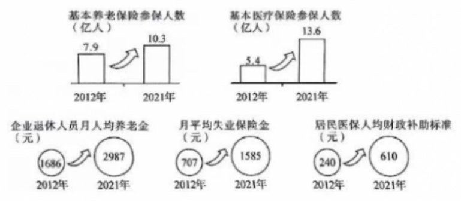

**2023年福建省普通高中学业水平选择性考试**

**思想政治试题**

1.1923年，年仅31岁的林祥谦在京汉铁路工人大罢工中被捕后英就义，是第一位中国共产党烈士。一百多年来，无数像林祥谦这样的共产党人为实现共产主义理想奋斗终身，是因为他们坚信共产主义（ ）

①符合生产关系发展的客观要求

②顺应社会历史发展的必然趋势

③是推动人类社会发展的根本动力

④是实现全人类解放的崇高事业

1. ①③ B.①④ C.②③ D.②④
   
   2.2022年，福建实施稳经济一揽子政策和接续措施，夯实筑牢工业“压舱石”，消费成逆势增长“强引擎”，投资“马车”蹄疾步稳，实现了经济发展质的有效提升和量的合理增长，全年地区生产总值首次跨过5万亿元大关，位居全国第8。要继续保持经济提质增量的良好发展势头，应该（ ）
   
   ①深化放管服改革→优化营商环境→释放市场主体活力→推动经济持续健康发展
   
   ②加大财政对居民消费的补贴力度→激发消费潜力→升级消费结构→拉动消费增长
   
   ③加大民生基础设施投资→鼓励生产要素投入→扩大房地产规模→提升经济总量
   
   ④鼓励清洁能源技术研发→培育新动能产业→推动产业升级→促进经济高质量发展

<!-- -->

1. ①③ B.①④ C.②③ D.②④

3．下图是新时代十年来我国社会保障的有关数据（数据来源：人力资源和社会保障部等）。 

该图反映了我国（ ）

A．社会保障体系与我国经济社会发展相适应

B．社会保障让每个公民享受相同的保障权益

C．社会保障覆盖范围持续扩大且保障水平稳步提高

D．社会保障作为规范个人收入分配秩序的手段实现了多样化

4.农村厕所革命被全国政协列为2022年民主监督十大选题之丁。全国政协成立专题调研小组，运用专项监督、提案监督、会议监督等形式，开展民主性监督调研，形成调研报告，与国务院相关部门进行深入座谈，有些改则建议被采纳并直接写进2023年中央一号文件。人民政协在推进农村改则行动中（ ）

①发挥了协商民主的独特优势

②通过参政议政行使国家权力

③创新了民主监督的内容和形式

④促进了政府决策科学化

A.①③ B.①④ C.②③ D.②④

5.某区人大常委会开通“扫码找代表”微信公众号，让人大代表更产泛收集民情民意，更深度参与社会治理，做到百姓“码”上反映，代表马上处理。该区创新人大代表工作形式有利于

①贯彻民主集中制原则（ ）

②健全代表联络机制

③维护人大代表的权利

④保障人民群众的质询权

A.①② B.①③ C.②④ D.③④

6.在2023年最高人民检察院向全国人大提交的工作报告中，多组数据呈现“一升一降”的特点引人注目。例如，帮助信息网络犯罪活动罪等新型危害经济社会管理秩序犯罪的起诉人数上升：抢劫、故意杀人等严重暴力犯罪和涉枪涉爆、毒品犯罪起诉案件总量持续下降。“一升一降”说明（ ）

①依法治国取得新成效，社会秩序持续向好

②司法办案重点适时调整，犯罪活动得到有效遇制

③全民法治观念与时俱进，社会法治化水平稳步提高

④法治保障力度不断提升，人民群众安全感日益增强

A.①② B.①④ C.②③ D.③④

7.中国发起成立金砖国家职业教育联盟，以职业教育破解“金砖+”国家发展不平衡不充分问题，为推进更高质量、更有效率、更加公平、更可持续、更为安全的全球发展铺设“金砖快线”。这体现了中国（ ）

①努力构建与其他金砖国家牢固的同盟关系

②在国际组织中发挥重要的建设性作用

③为解决发展中国家的发展问题提供中国智慧

④积极推动国际政治秩序朝着公正合理的方向发展

A.①② B.①④ C.②③ D.③④

佾（yi）舞源于周朝礼乐，成于祭孔乐舞，是集诗、礼、乐于一体的国礼舞蹈，蕴含着中正和谐、伦常有序的儒家精神，可以让人谦和有礼。据此回答8、9题。

8.近年来，福建省F市深入研究佾舞的礼仪内涵、佾礼规制、舞蹈动作和道具使用，整理相关的图谱画册和乐理典籍，并在此基础上申报国家级非遗项目。佾舞申遗的意义在于（ ）

①恢复传统儒家文化，构建和谐社会

②提供精神指引，提高道德实践能力

③继承优秀传统文化，厚植文化底额

④展示中华文化魅力，增强文化自信

A.①② B.①③ C.②④ D.③④

9.佾舞成功入选国家级非遗名录后，F市积极推广佾舞进校园活动，组织佾舞古诗词吟唱活动，举办佾舞文化讲座、弱冠佾生行成人礼活动，还在各地开展佾舞展演活动，让古老的佾舞焕发出生机和活力。这启示我们，让中华优秀传统文化“活”起来需要（ ）

A．立足社会实践，丰富文化表现形式

B．融通不同资源，进行文化综合创新

C.顺应时代要求，拓展传统文化内涵   

D.坚持博采众长，借鉴外来优秀文化

2022年是中国空间站全面建成的关键之年。90后天体物理学博士刘某决定用记录中国空间站成长与变化的影像作为献礼，让更多人透过他的望远镜看清中国人的“太空家园”。据此回答10、11、12题。

10.只有用光学跟踪软件控制望远镜，才能从地面跟踪拍摄空间站。但现有的软件，要么开发年代久远，要公设计不够成熟，都难以正常运行。因此，刘博士决定自已开发软件。刘博士做出这种决定运用的推理有（ ）

①相容选言推理之否定肯定式

②不相容选言推理之否定肯定式

③充分条件假言推理之否定后件就要否定前件式

④必要条件假言推理之否定前件就要否定后件式

A.①③ B.①④ C.②③ D.②④

11.在开发软件与拍摄过程中，刘博士从一次次失败中发现“空间站不根据我算出的轨迹走”，进而改变策略采用“空间站走到哪儿，我就跟到哪儿”的“光学识别追踪”拍摄法。“空间站走到哪儿，我就跟到哪儿”与下列选项所蕴含的哲理相通的是（ ）

①未有此气，已有此理

②阴阳二气充满太虚，此外更无他物

③理者，物之固然，事之所以然也

④不是风动，不是幡动，仁者心动

A.①② B.①④ C.②③ D.③④

12.刘博士团队借助新的光学跟踪软件，带近400斤设备追“星”50多次，克服种种困难，成功拍摄中国空间站从“一”“土”“L”到“T”“十”等12个构型的高清影像，完整记录了它从小到大的成长与变化。刘博士团队成功追“星”对青年成长的启示是（ ）

①要在破砺自我中创造和实现人生价值

②追求票高的人生自标就可以实现人生价值

③努力增长个人才干是实现人生价值的根本途径

④实现人生价值要把个人发展和社会需要相统一

A.①③ B.①④ C.②③ D.②④

13.对新生儿遗传性耳聋基因进行检测时，某科研团队遇到一个难题：如何把识别基因序列的微米级磁珠通过儿纳米长的探针连接到芯片上（1微米三1000纳米）。他们观然到毛毛虫的脚虽然小，但足够多，能将硕大身体紧紧附着在植物叶面上。从中受到启发，他们通过增大探针的密度成功实现磁珠和芯片的连接该团队解决难题的过程运用了（ ）

A.类比推理 B.归纳推理 C.发散思维 D.聚合思维

14.郑某入职某游戏公司，没有签订书面劳动合同，但与公司口头约定：郑某从事游戏测试工作：公司每月支付工资2万元，一半以现金支付，一半以公司游戏币支付：郑某自愿不缴纳社会保险费。入职后，郑某因醉驾被追究刑事贵任。本案中（ ）

①公司与郑某之间不存在劳动关系

②公司支付郑某工资的方式是合法的

③郑某自愿不缴纳社会保险费的约定是无效的

④郑某被道究刑事责任，公司有权开除郑某

A.①② B.①④ C.②③ D.③④

15.某日，韦某不慎坠河，陈某跳河施救。韦某获救，但陈某不幸满亡。陈某家属因陈某死亡的赔偿等问题将韦某诉至法院。经审理，法院判决韦某给予陈某家属适当补偿。以下说法符合法律规定的是（ ）

①韦某没有过错，应适用无过错责任原则

②该判决贯彻民法典倡导的公平、公序良俗等基本原则

③陈某的行为属于见义勇为，而韦某是该行为的受益人

④陈某的配偶、子女、父母、兄弟姐妹都应依法获得补偿

A.①② B.①④ C.②③ D.③④

16.阅读材料，完成下列要求。（14分）

习近平同志担任中共宁德地委书记期间，就闽东地区如何摆脱贫困、加快经济社会的发展，提出了许多富有创见的理念、观点和方法。这些理念、观点和方法在新发展阶段仍然具有重要的指导意义。

材料一1989年，习近平同志在宁德工作时，对科技教育与经济发展之间的关系有了系统性思考，指出“对贫困地区来说，要强调科技教育对经济发展的重大意义，但由于经济实力有限，科技教育又面临着资金不足的局面”，同时要求我们“要用长远的战略眼光来看待科技教育，要把科技教育作为闽东经济社会发展的头等大事来抓：在经济实力不足的情况下，要讲求办科技教育的效益”。

材料二 大黄鱼是我国沿海特有的经济鱼类，福建省宁德海域是重要的大黄鱼内湾性产卵场，曾因过度捕捞导致大黄鱼种群变可危。30多年前，习近平同志在当地大黄鱼育苗技术专家递交的《关于开发闽东海水鱼类养殖技术的报告》上作出批示，要求集中力量进行科研攻关。宁德与高校合作建成大黄鱼育种国家重点实验室和国家级大黄鱼遗传育种中心，建立起成熟的大黄鱼基因组选择育种技术体系；组织科技人员对渔民进行技术培训：大力推动养殖设施改造，配备了自动投喂、网箱移位报警等深海养殖装备，引入5G智慧海洋管理平台远程监管养殖海域。到2021年，宁德大黄鱼养殖业已形成集种苗、养殖、加工、研发、电商、仓储物流、冷链运输、品牌营销于一体的产业链，产量占全国养殖总量的80%以上，年产值达100亿元，出口60多个国家和地区。

（1）结合材料一，运用矛盾基本属性知识，分析科技教育和经济发展之间的关系。（8分）

（2）结合材料二，运用经济学知识，说明科技是怎样促进宁德大黄鱼养殖业发展的。（6分）

17.阅读材料，完成下列要求。（18分）7周岁的小明在A商店购买了一款儿童玩具。小明在玩玩具时，玩具因质量问题爆炸导致小明轻伤。经查，该玩具由B公司生产，A商店销售。对于本案，小明的父母找了几位朋友咨询维权问题。他们说： 

（1）运用《逻辑与思维》知识，把甲的三段论推理补充完整，并运用三段论的基本规则分析其推理结构是否正确。（8分）①补充甲的三段论推理。大前提：<u>                          </u>小前提：小明是无民事行为能力人。结论：所以，小明购买玩具的行为无效。②分析甲的推理结构是否正确。

（2）运用《法律与生活》知识，分析乙、丙、丁的说法是否符合法律规定（10分）

18.阅读材料，完成下列要求。（20分）党的二十大擘画了以中国式现代化全而推进中华民族伟大复兴的宏伟蓝图。中国式现代化是中国共产党领导的走和平发展道路的现代化。

材料一 党的十八大以来，党中央以“八项规定”作为切入点，从逼制“舌尖上的浪费”、整治“车轮上的属败”、纠正“会所里的歪风”，到治理“指尖上的形式主义”，以上率下推进作风建设，为党和国家事业发展提供坚实的作风保障。面对新征程上的新挑战新考验，党的二十大对作风建设作出新的部署，持续深化党的自我革命，确保党始终站在时代潮流最前列、站在攻坚克难最前沿、站在最广大人民之中，不断为推进现代化进程引领方向、凝聚力量。

材料二 自2013年提出共建“一带一路”倡议以来，中国在“一带一路”共建国家建成了一大批交通、通讯等基础设施项目：修建了一批中小学校、职业技术学校，开设了培训中心、“鲁班工坊”：截至2021年底，在86个国家累计投资农业项目超过820个，向40多个国家和地区派出了近1100名农业专家和技术员：积极开展国际减贫经验交流研讨，分享减贫经验，受到国际社会广泛费誉。

（1）结合材料一，运用《政治与法治》知识，说明在推进中国式现代化中，中国共产党持续推进作风建设深化自我革命的理由。（8分）

（2）从下列方框中选择两个最符合材料一主旨的关键词，并运用《中国特色社会主义》知识，写出你的感想。（4分）

要求：不得抄袭给定材料；字数不超过80字。

◇美好生活 ◇人类进步 ◇伟大斗争

◇伟大斗争 ◇共同富裕 ◇和平发展

（3）结合材料二，运用《当代国际政治与经济》知识，分析中国推动共建“一带一路”对中国式现代化的积极影响。（8分）
