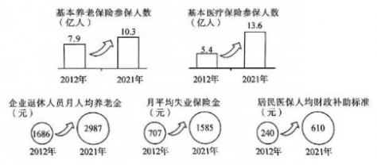
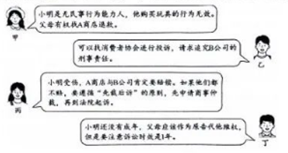

**2023年福建省普通高中学业水平选择性考试**

**思想政治试题**

1.1923年，年仅31岁的林祥谦在京汉铁路工人大罢工中被捕后英就义，是第一位中国共产党烈士。一百多年来，无数像林祥谦这样的共产党人为实现共产主义理想奋斗终身，是因为他们坚信共产主义（ ）

①符合生产关系发展的客观要求

②顺应社会历史发展的必然趋势

③是推动人类社会发展的根本动力

④是实现全人类解放的崇高事业

1. ①③ B.①④ C.②③ D.②④
   
   2.2022年，福建实施稳经济一揽子政策和接续措施，夯实筑牢工业“压舱石”，消费成逆势增长“强引擎”，投资“马车”蹄疾步稳，实现了经济发展质的有效提升和量的合理增长，全年地区生产总值首次跨过5万亿元大关，位居全国第8。要继续保持经济提质增量的良好发展势头，应该（ ）
   
   ①深化放管服改革→优化营商环境→释放市场主体活力→推动经济持续健康发展
   
   ②加大财政对居民消费的补贴力度→激发消费潜力→升级消费结构→拉动消费增长
   
   ③加大民生基础设施投资→鼓励生产要素投入→扩大房地产规模→提升经济总量
   
   ④鼓励清洁能源技术研发→培育新动能产业→推动产业升级→促进经济高质量发展

<!-- -->

1. ①③ B.①④ C.②③ D.②④

3．下图是新时代十年来我国社会保障的有关数据（数据来源：人力资源和社会保障部等）。 

该图反映了我国（ ）

A．社会保障体系与我国经济社会发展相适应

B．社会保障让每个公民享受相同的保障权益

C．社会保障覆盖范围持续扩大且保障水平稳步提高

D．社会保障作为规范个人收入分配秩序的手段实现了多样化

4.农村厕所革命被全国政协列为2022年民主监督十大选题之丁。全国政协成立专题调研小组，运用专项监督、提案监督、会议监督等形式，开展民主性监督调研，形成调研报告，与国务院相关部门进行深入座谈，有些改则建议被采纳并直接写进2023年中央一号文件。人民政协在推进农村改则行动中（ ）

①发挥了协商民主的独特优势

②通过参政议政行使国家权力

③创新了民主监督的内容和形式

④促进了政府决策科学化

A.①③ B.①④ C.②③ D.②④

5.某区人大常委会开通“扫码找代表”微信公众号，让人大代表更产泛收集民情民意，更深度参与社会治理，做到百姓“码”上反映，代表马上处理。该区创新人大代表工作形式有利于

①贯彻民主集中制原则（ ）

②健全代表联络机制

③维护人大代表的权利

④保障人民群众的质询权

A.①② B.①③ C.②④ D.③④

6.在2023年最高人民检察院向全国人大提交的工作报告中，多组数据呈现“一升一降”的特点引人注目。例如，帮助信息网络犯罪活动罪等新型危害经济社会管理秩序犯罪的起诉人数上升：抢劫、故意杀人等严重暴力犯罪和涉枪涉爆、毒品犯罪起诉案件总量持续下降。“一升一降”说明（ ）

①依法治国取得新成效，社会秩序持续向好

②司法办案重点适时调整，犯罪活动得到有效遇制

③全民法治观念与时俱进，社会法治化水平稳步提高

④法治保障力度不断提升，人民群众安全感日益增强

A.①② B.①④ C.②③ D.③④

7.中国发起成立金砖国家职业教育联盟，以职业教育破解“金砖+”国家发展不平衡不充分问题，为推进更高质量、更有效率、更加公平、更可持续、更为安全的全球发展铺设“金砖快线”。这体现了中国（ ）

①努力构建与其他金砖国家牢固的同盟关系

②在国际组织中发挥重要的建设性作用

③为解决发展中国家的发展问题提供中国智慧

④积极推动国际政治秩序朝着公正合理的方向发展

A.①② B.①④ C.②③ D.③④

佾（yi）舞源于周朝礼乐，成于祭孔乐舞，是集诗、礼、乐于一体的国礼舞蹈，蕴含着中正和谐、伦常有序的儒家精神，可以让人谦和有礼。据此回答8、9题。

8.近年来，福建省F市深入研究佾舞的礼仪内涵、佾礼规制、舞蹈动作和道具使用，整理相关的图谱画册和乐理典籍，并在此基础上申报国家级非遗项目。佾舞申遗的意义在于（ ）

①恢复传统儒家文化，构建和谐社会

②提供精神指引，提高道德实践能力

③继承优秀传统文化，厚植文化底额

④展示中华文化魅力，增强文化自信

A.①② B.①③ C.②④ D.③④

9.佾舞成功入选国家级非遗名录后，F市积极推广佾舞进校园活动，组织佾舞古诗词吟唱活动，举办佾舞文化讲座、弱冠佾生行成人礼活动，还在各地开展佾舞展演活动，让古老的佾舞焕发出生机和活力。这启示我们，让中华优秀传统文化“活”起来需要（ ）

A．立足社会实践，丰富文化表现形式

B．融通不同资源，进行文化综合创新

C.顺应时代要求，拓展传统文化内涵   

D.坚持博采众长，借鉴外来优秀文化

2022年是中国空间站全面建成的关键之年。90后天体物理学博士刘某决定用记录中国空间站成长与变化的影像作为献礼，让更多人透过他的望远镜看清中国人的“太空家园”。据此回答10、11、12题。

10.只有用光学跟踪软件控制望远镜，才能从地面跟踪拍摄空间站。但现有的软件，要么开发年代久远，要公设计不够成熟，都难以正常运行。因此，刘博士决定自已开发软件。刘博士做出这种决定运用的推理有（ ）

①相容选言推理之否定肯定式

②不相容选言推理之否定肯定式

③充分条件假言推理之否定后件就要否定前件式

④必要条件假言推理之否定前件就要否定后件式

A.①③ B.①④ C.②③ D.②④

11.在开发软件与拍摄过程中，刘博士从一次次失败中发现“空间站不根据我算出的轨迹走”，进而改变策略采用“空间站走到哪儿，我就跟到哪儿”的“光学识别追踪”拍摄法。“空间站走到哪儿，我就跟到哪儿”与下列选项所蕴含的哲理相通的是（ ）

①未有此气，已有此理

②阴阳二气充满太虚，此外更无他物

③理者，物之固然，事之所以然也

④不是风动，不是幡动，仁者心动

A.①② B.①④ C.②③ D.③④

12.刘博士团队借助新的光学跟踪软件，带近400斤设备追“星”50多次，克服种种困难，成功拍摄中国空间站从“一”“土”“L”到“T”“十”等12个构型的高清影像，完整记录了它从小到大的成长与变化。刘博士团队成功追“星”对青年成长的启示是（ ）

①要在破砺自我中创造和实现人生价值

②追求票高的人生自标就可以实现人生价值

③努力增长个人才干是实现人生价值的根本途径

④实现人生价值要把个人发展和社会需要相统一

A.①③ B.①④ C.②③ D.②④

13.对新生儿遗传性耳聋基因进行检测时，某科研团队遇到一个难题：如何把识别基因序列的微米级磁珠通过儿纳米长的探针连接到芯片上（1微米三1000纳米）。他们观然到毛毛虫的脚虽然小，但足够多，能将硕大身体紧紧附着在植物叶面上。从中受到启发，他们通过增大探针的密度成功实现磁珠和芯片的连接该团队解决难题的过程运用了（ ）

A.类比推理 B.归纳推理 C.发散思维 D.聚合思维

14.郑某入职某游戏公司，没有签订书面劳动合同，但与公司口头约定：郑某从事游戏测试工作：公司每月支付工资2万元，一半以现金支付，一半以公司游戏币支付：郑某自愿不缴纳社会保险费。入职后，郑某因醉驾被追究刑事贵任。本案中（ ）

①公司与郑某之间不存在劳动关系

②公司支付郑某工资的方式是合法的

③郑某自愿不缴纳社会保险费的约定是无效的

④郑某被道究刑事责任，公司有权开除郑某

A.①② B.①④ C.②③ D.③④

15.某日，韦某不慎坠河，陈某跳河施救。韦某获救，但陈某不幸满亡。陈某家属因陈某死亡的赔偿等问题将韦某诉至法院。经审理，法院判决韦某给予陈某家属适当补偿。以下说法符合法律规定的是（ ）

①韦某没有过错，应适用无过错责任原则

②该判决贯彻民法典倡导的公平、公序良俗等基本原则

③陈某的行为属于见义勇为，而韦某是该行为的受益人

④陈某的配偶、子女、父母、兄弟姐妹都应依法获得补偿

A.①② B.①④ C.②③ D.③④

16.阅读材料，完成下列要求。（14分）

习近平同志担任中共宁德地委书记期间，就闽东地区如何摆脱贫困、加快经济社会的发展，提出了许多富有创见的理念、观点和方法。这些理念、观点和方法在新发展阶段仍然具有重要的指导意义。

材料一1989年，习近平同志在宁德工作时，对科技教育与经济发展之间的关系有了系统性思考，指出“对贫困地区来说，要强调科技教育对经济发展的重大意义，但由于经济实力有限，科技教育又面临着资金不足的局面”，同时要求我们“要用长远的战略眼光来看待科技教育，要把科技教育作为闽东经济社会发展的头等大事来抓：在经济实力不足的情况下，要讲求办科技教育的效益”。

材料二 大黄鱼是我国沿海特有的经济鱼类，福建省宁德海域是重要的大黄鱼内湾性产卵场，曾因过度捕捞导致大黄鱼种群变可危。30多年前，习近平同志在当地大黄鱼育苗技术专家递交的《关于开发闽东海水鱼类养殖技术的报告》上作出批示，要求集中力量进行科研攻关。宁德与高校合作建成大黄鱼育种国家重点实验室和国家级大黄鱼遗传育种中心，建立起成熟的大黄鱼基因组选择育种技术体系；组织科技人员对渔民进行技术培训：大力推动养殖设施改造，配备了自动投喂、网箱移位报警等深海养殖装备，引入5G智慧海洋管理平台远程监管养殖海域。到2021年，宁德大黄鱼养殖业已形成集种苗、养殖、加工、研发、电商、仓储物流、冷链运输、品牌营销于一体的产业链，产量占全国养殖总量的80%以上，年产值达100亿元，出口60多个国家和地区。

（1）结合材料一，运用矛盾基本属性知识，分析科技教育和经济发展之间的关系。（8分）

（2）结合材料二，运用经济学知识，说明科技是怎样促进宁德大黄鱼养殖业发展的。（6分）

17.阅读材料，完成下列要求。（18分）7周岁的小明在A商店购买了一款儿童玩具。小明在玩玩具时，玩具因质量问题爆炸导致小明轻伤。经查，该玩具由B公司生产，A商店销售。对于本案，小明的父母找了几位朋友咨询维权问题。他们说： 

（1）运用《逻辑与思维》知识，把甲的三段论推理补充完整，并运用三段论的基本规则分析其推理结构是否正确。（8分）①补充甲的三段论推理。大前提：<u>                          </u>小前提：小明是无民事行为能力人。结论：所以，小明购买玩具的行为无效。②分析甲的推理结构是否正确。

（2）运用《法律与生活》知识，分析乙、丙、丁的说法是否符合法律规定（10分）

18.阅读材料，完成下列要求。（20分）党的二十大擘画了以中国式现代化全而推进中华民族伟大复兴的宏伟蓝图。中国式现代化是中国共产党领导的走和平发展道路的现代化。

材料一 党的十八大以来，党中央以“八项规定”作为切入点，从逼制“舌尖上的浪费”、整治“车轮上的属败”、纠正“会所里的歪风”，到治理“指尖上的形式主义”，以上率下推进作风建设，为党和国家事业发展提供坚实的作风保障。面对新征程上的新挑战新考验，党的二十大对作风建设作出新的部署，持续深化党的自我革命，确保党始终站在时代潮流最前列、站在攻坚克难最前沿、站在最广大人民之中，不断为推进现代化进程引领方向、凝聚力量。

材料二 自2013年提出共建“一带一路”倡议以来，中国在“一带一路”共建国家建成了一大批交通、通讯等基础设施项目：修建了一批中小学校、职业技术学校，开设了培训中心、“鲁班工坊”：截至2021年底，在86个国家累计投资农业项目超过820个，向40多个国家和地区派出了近1100名农业专家和技术员：积极开展国际减贫经验交流研讨，分享减贫经验，受到国际社会广泛费誉。

（1）结合材料一，运用《政治与法治》知识，说明在推进中国式现代化中，中国共产党持续推进作风建设深化自我革命的理由。（8分）

（2）从下列方框中选择两个最符合材料一主旨的关键词，并运用《中国特色社会主义》知识，写出你的感想。（4分）

要求：不得抄袭给定材料；字数不超过80字。

◇美好生活 ◇人类进步 ◇伟大斗争

◇伟大斗争 ◇共同富裕 ◇和平发展

（3）结合材料二，运用《当代国际政治与经济》知识，分析中国推动共建“一带一路”对中国式现代化的积极影响。（8分）

**参考答案及其详解**

1.D

本题以加强对青年学生的理想信念教育着眼点，以福建籍林祥谦烈士英勇就义100周年的地方特色素材为情境设题，要求考生运用社会发展规律、《共产党宣言》的内容等相关知识，探寻优秀共产党人坚定共产主义信仰的原因，考查考生理解、判断和运用知识的能力。共产主义是解放全人类的票高事业，符合人类社会发展的进程和趋势，故②符合题意：生产力是社会发展的最终决定力量，共产主义符合生产力发展的客观要求，故排除①：社会基本矛盾是推动人类社会发展的根本动力，故排除③。

2.B

本题是一道经济类推导型试题，以高质量发展为背景，聚焦福建经济发展的特色和成就，要求考生运用市场经济、推动高质量发展的相关知识，探究保持经济提质增量的良好发展势头的路径，对考生分析和推理的能力要求较高。深化放管服改革能够为市场主体提供更好的营商环境，释放市场主体活力，推动经济持续健康发展：鼓励清洁能源技术研发是培育新动能产业的重要措施，可以推动产业升级，促进经济高质量发展，故①④符合题意。加大财政对居民消费的补贴力度确实会激发消费潜力，即增加消费需求，但未必因此带来消费结构升级，故②不选。房地产不属于民生基础设施的范畴，因此加大对民生基础设施的投资、鼓励生产要素的投人不能推理得出扩大房地产规模，故③不选。

3.C

本题以新时代十年巨变为背景，以图文的形式展现我国社会保障建设的伟大成就，要求考生运用社会保障和完善个人收人分配的相关知识解读图文信息，通过分析与综合相结合的方法得出正确结论。图中信息显示，新时代十年来，我国基本养老保险参保人数、基本医疗保险参保人数不断增加，反映了我国社会保障覆盖范围持续扩大：企业退休人员月人均养老金、月平均失业保险金、居民医保人均财政补助标准持续增长，反映了我国的社会保障水平稳步提高，故C选项符合题意；社会保障体系由社会保险、社会救助、社会福利、社会优抚等要素构成，图中信息只涉及社会保险的有关情况，没有涉及整个社会保障体系，故排除A选项：国家要公平对待每个公民并确保其享受相应的社会保障权益，要更多地维护好弱势群体的利益，并非每个公民享有的社会保障权益都是相同的，故排除B选项；规范收人分配秩序要通过保护合法收人、增加低收人者收人、护大申等收人群体、调节过高收人、取缔非法收人等集道来实现。社会保障是再分配调节机制的重要手段，不是规范收人分配积序的手段，故排除D选项。

4.B

本题以人民政协在推进农村厕所革命中积极履职为话题，考查考生获取和解读信息的能力、对我国政党制度知识的理解和运用的能力，增进考生对中国特色社会主义制度的认同。人民政协与国务院相关部门进行深入座谈是发连协商民主独特优势的体现，敬1符合题意：人民政协开展民主性监督调研，形成调研报告，体现了人民政协的民主监督和参政议政的职能，但人民政协不是国家机关，不能行使国家权力，故排除②：材料信息不涉及创新民主监督的内容和形式，故排除③：人民政协的有些改厕建议被采纳并直接写进2023年中央一号文件是促进政府决策科学化的体现，故④符合题意

5.A

本题以某区人大常委会创新人大代表工作形式设置试题情境，考食考生运用人民代表大会制度的相关知识解读材料信息的能力，加深对人民负责的原则的政治认同。人大常委会开通“扫码找代表”微信公众号，既方便人大代表收集民情民意，也方便人民群众反映问题，一方面有利于健全代表联络机制，另一方面体现了人大对人民负责，是贯彻民主集中制原则的重要体现，故①②符合题意：人大代表收集民情民意是人大代表履行密切联系群众的职责而不是权利，故排除③；百姓“码”上反映体现的是人民群众的参与权、表达权、监督权等权利，质询权属于人大代表的权利，故排除④。

6.B

本题以推进全面依法治国为背景，以最高人民检察院工作报告中关于不同类型司法案件的特点为素材：要求考生运用法治的相关知识归纳概括材料所反映的我国法治建设的成就，考查考生归纳推理的能力，引导考生树立法治思维、增强法治信仰。材料中新型危害经济社会管理秩序犯罪的起诉人数上升，暴力犯罪和涉枪涉爆、毒品犯罪起诉案件总量持续下降，说明我国依法有效惩治犯罪，全面依法治国取得新成效，促使社会秩序持续向好，也说明国家通过司法提升法治保障力度，使人民群众的安全感日益增强，故①④符合题意：材料说的是司法办案领域，而不是司法办案重点，也无法说明全民法治观念与时俱进，故排除②③。

7.C

本题以中国推动构建人类命运共同体背景，以中国发起成立金砖国家职业教育联盟为话题，要求考生运用我国外交政策的相关知识分析材科所体现的政治观点，考查考生理解、分析和运用知识的能力。材料中中国发起成立金砖国家职业教育联盟，破解“金砖+”国家发展不平衡不充分的问题，说明我国在国际组织中发挥重要的建设性作用，解决发展中国家的发展间题提供中国智慧，故②③符合题意：我国奉行不结盟政策，故排除①：材料说的是中国为解决“金砖+”国家发展中存在的问题贡献智慧和力量，与积极推动国际政治新秩序发展无关，故排除④

8.D

第8题基于舞亮相“中国一中亚峰会”的时政背景，以舞申遗的意义为切入点，考查考生运用文化传承的相关知识理解和分析问题的能力，引导考生增强对中华优秀传统文化的认同。传统儒家文化存在糟，恢复传统偶家文化是复古主义的表现，是错误的，故排除：文化为人们提供精神指引，俏舞中蕴含的儒家人文精神能为人们提供精神指引，但俏舞申遗并不能提供精神指引、提高人的道德实践能力，而是有利于传承优秀传统文化，厚植文化底蕴，也有利于展示中华文化魅力，增强文化自信，故排除②，③④符合题意

9.A

第9题以俏舞的推广和传承话题，要求考生运用文化发展的基本路径的相关知识，分析F市让古老俏舞焕发生机的做法对激活中华优秀传统文化的启示，考查考生对信息的提炼概括并转化为学科知识以解决实际问题的能力，同时引导考生增强公共参与意识。F市以多种形式开展俏舞进校园活动并在各地开展舞展演活动，这启示我们激活优秀传统文化应立足社会实践，丰富文化表现形式，故A选项符合题意B、C、D选项所述与F市的做法不相符，故应排除。

10.B

第10题以刘博士为追“星”决定自已开发光学跟踪软件为情境，要求考生对刘博士运用的推理方式进行研判，考查考生分析、比较、判断的能力，引导考生培养科学精神。题干信息可以整合为：光学跟踪软件，要么开发年代久远，要么设计不够成熟，要么自已开发。这一选言判断单从连结词看好像是不相容的，但实际上三个选言支断定的情况是可以同时并存的，因此它属于相容选言判断。开发年代久远或设计不够成熟的软件都难以正常运行，因此刘博士决定自已开发软件，这是相容选言推理的否定肯定式：故1符合题意，2与题意不符：“只有用光学跟踪软件控制望远镜，才能从地面跟踪拍摄空间站”是必要条件假言判断。开发年代久远或设计不够成熟的光学跟踪软件都难以运行，即无法控制望远镜，这否定了必要条件假言判断的前件，所以，就能否定其后件，推知不能从地面跟踪拍摄空间站。这里使用的是必要条件假言推理之否定前件就要否定后件式，故③与题意不符，④符合题意。

11.C

第11题以刘博士的“光学识别追踪”拍摄法创设试题情境，借助古语考查考生对哲学基本问题的理解和判断能力，培养考生的科学精神。题干中“空间站走到哪儿，我就跟到哪儿”属于唯物主义观点。①选项的说法承认先有精神性的“理”，后有物质性的“气”，属于唯心主义观点，与题意不符；②选项的说法主张世界的本源在于物质性的阴阳二气，属于唯物主义观点，符合题意：③选项的说法认为规律是事物本身所固有的，体现了唯物主义观点，符合题意：④选项的说法否认运动是物质的运动，主张运动是心灵（意识）的运动，是唯心主义观点，与题意不符。

12.B

第12题以刘博士团队不畏艰难，成功记录中国空间站的成长变化过程为情境，要求考生运用价值的创造和实现的相关知识，分析刘博士团队的成功对青年成长的启示，着重考查考生分析归纳的能力，引导考生树立正确人生价值观。刘博士团队克服种种困难成功拍摄中国空间站构型变化的影像，让更多人透过他的望远镜看清中国人的“太空家园”，启示青年学生要在砥砺自我中创造和实现人生价值，要在个人与社会的统一中创造和实现人生价值，故①④符合题意：②的说法太绝对，忽视了实践的作用，应予排除；在劳动和奉献中创造价值是实现人生价值的根本途径，故排除③。

13.A

本题选取了某科研团队解决新生儿遗传性耳聋基因检测过程中的技术难题这一科技情境素材，考查考生运用推理和创新思维的相关知识获取和解读信息、分析和解决问题的能力，引导考生增强创新意识、培养科学素养。该科研团队将毛毛虫和芯片两种事物的要素和功能等相似属性进行类比：一是要素对比，毛毛虫的脚小、腿多、身体硕大：芯片的探针小、磁珠大。二是功能对比，脚虽然小，但足够多，能将顾大的身体系系附看在叶面上。由此推知通过增大纳米级探针的密度把微米级磁珠连接到芯片上。所以，只有A选项符合题意，B、C、D选项与题意不符。

14.D

本题以郑某用口头约定的方式人职某游戏公司的案例创设生活化情境，要求考生运用劳动合同的订立和劳动者的权利与义务的相关知识对案例进行剖析，考查考生获取解读信息的能力、迁移运用知识的能力，引导考生增强法治意识，觉尊法守法用法。郑某与公可没有签订书面劳动合同，并不影响劳动关系的成立，故排除①；工资必须以货币形式支付，不能以游戏币支付，故排除②；用人单位为劳动者缴纳社会保险费，是用人单位的法定义务，也是劳动者享有的法定权利，不能以约定的方式来免除用人单位的法定义务或劳动者的法定权利，故③正确：劳动者被依法追究刑事责任的，用人单位可以解除劳动合同，故④正确。

15.C

本题以陈某见义勇为的案例为情境设题，贴近生活实际，考查考生对民法基本原则和法定继承相关知识的理解和运用能力，引导考生增强法治意识、树立法治信仰。陈某跳河施救是见义勇为的行为，韦某没有实施侵权行为，因此不适用侵权中的无过错责任原则，故排除①：韦某对于陈某的死亡没有过错，也没有实施侵权行为，但韦某作为见义勇为行为的受益人，应当给予陈某家属适当补偿，符合民法的公平、公序良俗等原则，故②③符合题意：；陈某的配偶、子女、父母是第一顺序继承人，兄弟姐妹是第二顺序继承人，依法获得相应的补偿主体应当首先是第一顺序继承人，故④不符合题意。

16.（1）结合材料一，运用矛盾基本属性知识，分析科技教育和经济发展之间的关系。（8分）①矛盾的基本属性是同一性和斗争性，我们要用对立统一的观点看问题。②矛盾双方相互排斥、相互对立，科技教育与经济发展相互制约。③矛盾双方相互依赖、相互贯通，在一定条件下可以相互转化。经济发展为科技教育提供资金保障，科技教育为经济发展提供技术支撑和智力支持。

16.（2）结合材料二，运用经济学知识，说明科技是怎样促进宁德大黄鱼养殖业发展的。（6分）①科技创新改进育种技术，为大黄鱼养殖业发展提供优质种源②开展科技培训，提高大黄鱼养殖户的素质。③加强技术改造，提升大黄鱼养殖技术和管理水平。④科技推动产业升级，实现大黄鱼养殖业的高质量发展。

17.（1）运用《逻辑与思维》知识，把甲的三段论推理补充完整，并运用三段论的基本规则分析其推理结构是否正确。（8分）①大前提：无民事行为能力人购买玩具的行无效。②一个形式结构正确的三段论只能有三个不同的项，甲的推理中只有三个不同的项：中项在前提中至少周延一次，甲推理中的中项是周延的；前提中不周延的项在结论中不得周延，甲推理中的大项在前提中是不周延的，在结论中也没有周延。综上，甲的推理结构符合三段论推理的基本规则，是正确的。

17.（2）运用《法律与生活》知识，分析乙、丙、丁的说法是否符合法律规定。（10分）①乙的说法不符合法律规定。消费者协会承担调解职能，无权追究违法经营者的刑事责任，②内关于A商店与B公司应赔偿的说法符合法律规定。A商店与B公司是经营者，适用产品责任。③丙关于“先裁后诉”的说法不符合法律规定。商事仲裁与诉讼只能选择其一。④丁关于小明父母是原告的说法不符合法律规定。小明是权利受害者，应是原告，父母是法定代理人/监护人。④丁关于诉讼时效的说法不符合法律规定，诉讼时效为三年。

18.（1）结合材料一，运用政治与法治》知识，说明在推进中国式现代化中，中国共产党持续推进作风建设深化自我革命的理由。（8分）①中国共产党是我国最高政治领导力量。推进中国式现代化，必须坚持党的领导。②持续推进作风建设深化党的自我革命，永葆党的先进性和纯洁性，增强党的政治领导力、思想引领力、群众组织力、社会号召力，确保党永保旺盛生命力和强大战斗力。③持续推进作风建设，深化党的自我革命，才能巩固党长期执政的群众基础，为推进中国式现代化凝心聚力。

18.（2）从下列方框中选择两个最符合材料一主旨的关键词，并运用《中国特色社会主义》知识，写出你的感想。（4分）说明：材料的主旨是面对党内存在的突出问题和党面临的重大风险挑战，中国共产党持续推进作风建设深化自我革命，据此可以选定两个关键词为“伟大斗争”“伟大工程”，然后按照两者的内在联系，运用《中国特色社会主义》的知识写出感想，言之有理即可。

18.（3）结合材料二，运用《当代国际政治与经济》知识，分析中国推动共建“一带一路”对中国式现代化的积极影响。（8分）①中国推动共建“一带一路”，与沿线国家共享发展机会，促进共同繁荣，维护世界和平，构建人类命运共同体，为中国式现代化创造有利的外部环境。②中国推动共建“一带一路”，与沿线国家加强基础设施建设、人员交流、教育培训、农业发展等方面的合作，提高对外开放水平，促进中国自身发展，推进中国式现代化，
