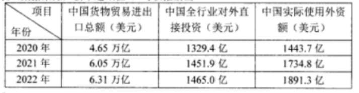
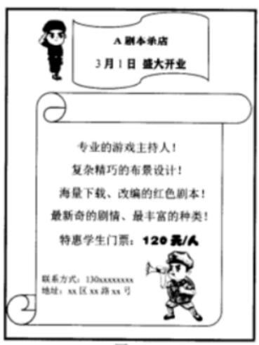
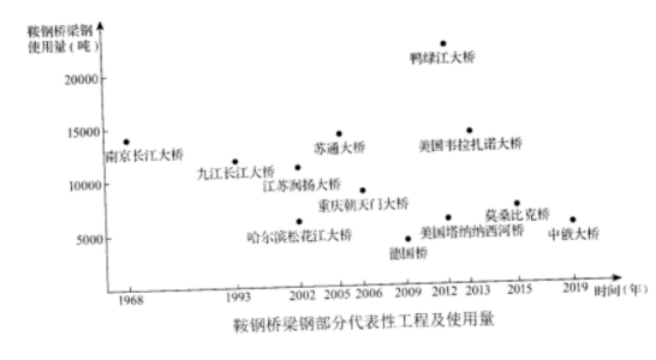
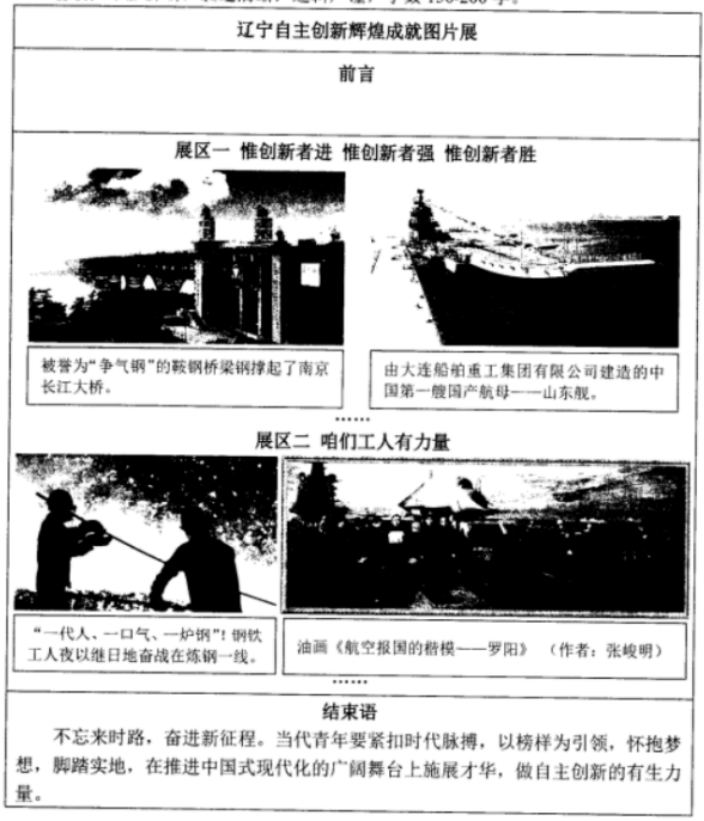

**2023年辽宁省高考政治试题**

**一、选择题：本题共16小题，每小题3分，共48分。在每小题给出的四个选项中，只有一个是符合题目要求的。**

1\. 习近平指出：“概括提出并深入阐释中国式现代化理论，是党的二十大的一个重大理论创新。”“新中国成立特别是改革开放以来，我们用几十年时间走完西方发达国家几百年走过的工业化历程，创造了经济快速发展和社会长期稳定的奇迹……实践证明，中国式现代化走得通、行得稳。”这印证了（ ）

①中国的现代化成就是在中国式现代化理论指导下取得的

②中国式现代化为推进中华民族伟大复兴开辟了广阔前景

③中国式现代化理论实现了马克思主义中国化时代化新的飞跃

④中国的现代化既遵循了现代化的一般规律，又符合中国实际

A. ①② B. ①③ C. ②④ D. ③④

2\. 辽沈战役是党中央及时抓住战略决战时机打响具有决定意义的重要战役，历时52天血与火的洗礼取得胜利，使全国军事形势达到一个新的转折点。历史昭示未来。这启示我们，在新时代东北振兴、辽宁振兴的“辽沈战役”中要（ ）

①树立正确的历史观，抓住机遇，努力实现振兴发展新突破

②坚持以人民为中心的发展思想，放手发动和依靠人民群众

③以顽强斗争赢得主动，努力形成对国家重大战略的有力支撑

④积极融入新发展格局，紧紧依靠改革创新探索合适的发展道路

A. ①② B. ①③ C. ②④ D. ③④

3\. 下列对漫画所反映的劳动力市场问题的推导过程符合经济学原理的是（ ）

①专业选择先于供求信息获得→劳动者在专业选择上具有盲目性→供求难以匹配

②劳动者只看重自身眼前利益→劳动力价格上升使企业需求下降→供求难以匹配

③行业间工资和福利存在差距→劳动者向高工资高福利行业集中→局部供求失衡

④企业获得市场信息有滞后性→企业难以及时调整需求适应供给→局部供求失衡

A. ①③ B. ①④ C. ②③ D. ②④

4\. 近年来，农村快递数量上升，暴露出农村快递运力不足、成本高等问题。为解决以上问题，某市采用公交公司与11家快递公司联运的方式，多举措激发各市场主体活力。图2中措施与直接结果匹配正确的是（ ）

A. 甲-② 丙-④ B. 乙-① 丁-③

C. 丙-① 乙-④ D. 丁-② 甲-③

5\. 某市生态环境局推进“排污许可制”改革，明确企业环评审批证与排污许可证同步申领，减少了审批时间。同时，该局搭建排污许可证证后监管平台，将监管、监测、监察等信息查询功能对企业开放，实现信息共享。这些做法能够推动（ ）

①企业持证排污，助力产业结构优化

②机构的法定化，促进政府积极作为

③社会共同监督，改善企业营商环境

④政企建立互信，提升生态治理水平

A. ①② B. ①④ C. ②③ D. ③④

6\. 甲公司向市场监督管理局投诉乙公司侵犯其商标权，该局受理后展开调查，经查明事实，对乙公司作出行政处罚。乙公司不服，向法院提起行政诉讼，法院维持该行政处罚决定，驳回了乙公司的诉讼请求，乙公司未上诉。这体现了该局（ ）

①依法履行法定职责，规范地行使了行政权力

②对争议事实进行查证，有效化解了行政争议

③运用了行政裁决、行政诉讼等纠纷解决机制

④维护了当事人的合法权益，彰显了公平正义

A. ①② B. ①④ C. ②③ D. ③④

7\. 李先生向社区提出了解决人车分流问题的建议。在街道党总支牵头下，社区多次召开物业、商铺及李先生等居民共同参与的意见征求会议，最终形成了反映整体诉求的社区生活秩序优化方案。方案的落地增强了人们的归属感和幸福感。这一过程（ ）

①提高了公众维权意识和协商式监督的积极性

②体现了对社区治理成果认同和共享的广泛性

③实现公众意见征询从决策前向决策后的延伸

④表明党和人民是利益一致、同心同向的整体

A. ①③ B. ①④ C. ②③ D. ②④

8\. 植保无人机、北斗导航、免耕播种机……各种新农具正成为农业生产的“新武器”,操作新农具的多是被称为“新农人”的大学生，他们依靠科技和专业知识成为农村致富带头人，其辐射效应推动了乡村面貌的嬗变和农业发展的全方位转型。这表明（ ）

①新农具是推动农业生产关系变革的物质条件

②农业新技术构成了农业生产力发展的新动力

③新农人的出现有利于优化农业生产力的结构

④新农人的专业知识为乡村振兴注入精神活力

A. ①③ B. ①④ C. ②③ D. ②④

9\. “春分之日，玄鸟至”(《逸周书·时训解》)。在周代，古人就已经靠观察燕子等候鸟春归的时间来确定节气、规划农时。中原地区的燕子多是在春分前后飞回筑巢育雏，周天子便在春分之日祭祀神灵，祈求子孙繁茂。由此可见（ ）

①人能借观察燕来与春到间的关系把握自然变化规律

②依据对规律的认识去规划农时属于实际的农耕活动

③将燕来与子孙繁茂相联系是对客观对象反映的结果

④把握燕来与人活动的联系是为了实现人与自然和谐

A. ①③ B. ①④ C. ②③ D. ②④

10\. 下列各民族谚语与漫画蕴含的哲理相近的是（ ）

①“刀在石上磨，人在干中学”(哈尼族)

②“十个嘴把式，顶不住一个手把式”(汉族)

③“十耳听不如双眼见，十眼见不如双手干”(傣族)

④“不吃菜叶不知饥饱，不挖河水不知深浅”(阿昌族)

A. ①③ B. ①④ C. ②③ D. ②④

11\. 2023年2月，全球多个主要经济体公布2022年对华贸易年报，韩国、德国、英国和欧盟对华投资较上年增幅分别为64.2%、52.9%、40.7%和92.2%。结合材料及下表(数据来源：新华通讯社)，可以推断出（ ）

①外资对中国经济发展前景保持乐观

②中国在全球贸易中的地位日益上升

③中外经贸投资合作近三年持续共赢

④欧盟已经成为中国最大的贸易伙伴

A. ①③ B. ①④ C. ②③ D. ②④

12\. 缺乏互信的两国开展合作，现有甲、乙两个项目。其中，甲需两国合力完成，但收益巨大；乙可两国合力，也可一国独立完成，但整体收益远低于甲的一半。因资金有限，在同一时期两国只能选择一个项目投资且无法撤资，合力完成项目后收益两国均分。对于两国决策者来说，对国家最有利的选择是（ ）

①防范对方失信行为

②开展两国对话协商

③向大型项目甲投资

④向小型项目乙投资

A ①→③ B. ①→④ C. ②→③ D. ②→④

13\. 某村成立合作社，发展“采茶+茶艺”的文旅融合模式，村民积极响应。张爷爷以承包地的经营权入股合作社，用作采茶园。他还把宅基地上的房屋租给合作社，用于经营茶楼，租期5年。文旅融合模式拓宽了村民的收入渠道。下列说法正确的是（ ）

①张爷爷对其承包地享有抵押权，对其宅基地享有所有权

②合作社对张爷爷房屋可以占有、使用，享有用益物权

③张爷爷与合作社之间的房屋租赁合同应当采用书面形式

④张爷爷与合作社的法律地位平等，均享有民事权利能力

A. ①② B. ①④ C. ②③ D. ③④

14\. 网络平台利用其收集的消费者偏好、消费金额、消费次数等信息进行差异定价的情况频频发生。最近，某平台对钻石会员销售的高档宾馆住宿费定价高于线下一倍多，给消费者利益造成损害。下列判断正确的是（ ）

①平台根据不同消费者的信息进行差异定价，侵犯消费者知情权

②消费能力、特殊消费偏好属于个人信息，但均不属于个人隐私

③消费者若想向平台主张损害赔偿，要承担损害事实的举证责任

④消费者若主张平台侵犯其个人信息权益，要证明平台存过错

A. ①② B. ①③ C. ②④ D. ③④

15\. 雾凇俗称树挂，玉树琼花，宛若仙境。其形成条件严苛，需要独特的气象条件与自然要素。不同地区形成雾凇的条件存在一定差异，但湿度大、风力小、气温日较差大是形成雾凇的共同条件。以下选项一定为真的是（ ）

①湿度大、风力小、气温日较差大，所以雾凇产生了

②雾凇产生了，所以湿度大、风力小、气温日较差大

③湿度小或风力大或气温日较差小，所以雾凇没产生

④雾凇没产生，所以并非湿度大、风力小、气温日较差大

A. ①② B. ①④ C. ②③ D. ③④

16\. 糖是人类必需的能量来源，但长期过量摄入会导致代谢紊乱等问题。人们为了追求健康，在通过运动促进糖脂代谢的同时，愈加注重“减糖”。由于人对甜味本能的热爱，用甜味剂代替有甜味的糖成为一种选择，安全优质的代糖应运而生。由此可知（ ）

①代糖与糖无差别的同一使人们对甜味的需要得以满足

②代糖产生体现了对甜味需要的满足从糖到代糖的迁移

③代糖是对甜味的热爱与“减糖”需求共同作用的结果

④代糖的产生是运用超前意识对糖过量摄入问题的解决

A. ①② B. ①④ C. ②③ D. ③④

**二、非选择题：本题共3小题，共52分。**

17\. 阅读材料，完成下列要求。

党和国家监督体系是党在长期执政条件下实现自我革命的重要制度保障。习近平在十九届中央纪委四次全会的重要讲话中将财会监督纳入党和国家监督体系，突出其政治属性。2023年2月，中共中央办公厅、国务院办公厅印发《关于进一步加强财会监督工作的意见》(以下简称《意见》),强调把推动党中央、国务院重大决策部署贯彻落实作为财会监督工作的首要任务。

实现碳达峰碳中和是党中央的重大战略决策，需要绿色金融等相关政策的推动，以及政府、企业等投入巨量的资金支持。因此，党进一步加强财会监督工作，能够更好地依法依规对相关国家机关、企事业单位、其他组织和个人的财政、财务、会计活动实施监督，为碳达峰碳中和工作保驾护航。

《意见》要求，综合运用检查核查等方式开展财会监督，健全财会监督法律法规制度，严肃查处财经领域违纪违规行为，将工作推进情况作为领导班子和有关领导干部考核的重要内容，促进财会益舒与其他各类监督贯通协调，确保党中火政令畅通。《意见》的贯彻落实将助力实现碳达峰碳中和目标，推动美丽中国建设。

结合材料，运用政治与法治知识，分析党进一步加强财会监督工作对贯彻落实碳达峰碳中和决策部署作用。

18\. 阅读材料，完成下列要求。

“红色剧本杀”以角色扮演方式在游戏中传承红色基因，这种沉浸式体验深受青少年喜爱。A剧本杀店张贴海报，吸引玩家纷至沓来。某日，大三学生小明约同学去该店玩以某英雄连事迹为主线的情景式剧本杀。在游戏过程中，小明发现剧本内容包含对某英烈的侮辱性言辞。震惊之余，小明与主持人发生争执，不牢固的布景装置导致了小明小腿骨折。小明向执法机关举报了该店。

结合材料，运用法律与生活知识，分析A剧本杀店涉嫌哪些违法行为；若小明诉至法院请求损害赔偿，可提出哪些理由。

19\. 阅读材料，完成下列要求。

材料一 【筚路蓝缕破茧成蝶】

独立自主是中华民族精神之魂。新中国成立之初，在建的南京长江大桥突然遭遇国外钢材断供。面对桥梁钢关键技术领域的“卡脖子”问题，周恩来指示要炼出我们自己的“争气钢”,并将自主研发桥梁钢的任务交给鞍钢。

为了啃下这块“硬骨头”,鞍钢集结全厂力量开展技术攻关。技术人员根据钢材用途的特殊要求，研究并确定桥梁钢的强度、韧性等各项参数，以及碳、锰等元素不同占比对钢材性能的影响。研究表明，一定含量的碳和锰能够提高钢材的强度和硬度，但当它们的含量超过一定比例时，会带来钢材塑性、韧性等性能不同程度的下降。技术人员经过不断对比、调整，确定钢材的屈服强度、化学成分及配比。与此同时，他们对生产环节也进行了技术改造，结合一线工人的实践，通过大量实验、反复测试，发现问题、总结经验，解决了一个又一个技术难题，取得了研发的成功。工人们日夜奋战，在短时间内生产出了“争气钢”,满足了南京长江大桥建设的需要，填补了我国建设大跨度桥梁钢种的空白。

材料二 【踔厉前行奋楫扬帆】

自1995年始，鞍钢开启大规模技术改造，引进国内外先进技术和设备，整体工艺装备和技术研发水平得到大幅度提高，也提升了产品质量和档次。2001年以来，鞍钢先后中标多个受人瞩目的重大桥梁工程，其中作为世界最长跨海大桥的港珠澳大桥使用鞍钢桥梁钢总量达17万吨。在2005年至2006年国内桥梁钢招标总量中，鞍钢桥梁钢已占54.5%,鞍钢用“钢筋铁骨”撑起中国桥梁的半壁江山。鞍钢在不断的发展中走向国际市场，一方面，与国内外企业和研究机构、大学联合研制更高性能的桥梁钢；另一方面，凭借技术和成本优势，中标欧美、非洲、亚洲等多项国外桥梁工程，实现了多点开花。

（1）结合材料一，运用哲学知识阐述鞍钢人在桥梁钢研发生产过程中发挥的主体作用。

（2）结合材料一，说明技术人员在桥梁钢研发过程中是如何运用分析与综合的辩证思维方法的。

（3）结合材料，运用经济与社会、当代国际政治与经济知识，分析鞍钢桥梁钢逐步融入全球市场的过程。

（4）“争气钢”的故事极大鼓舞了同学们。某高中决定举办“辽宁自主创新辉煌成就图片展”。结合材料和以下展板，运用文化知识，为该展览撰写前言。

要求：主题鲜明，表述清晰，逻辑严谨，字数150-200字。

