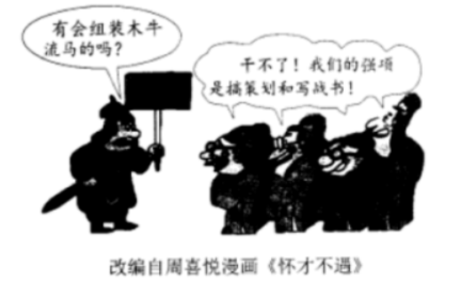
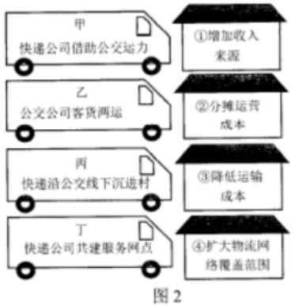
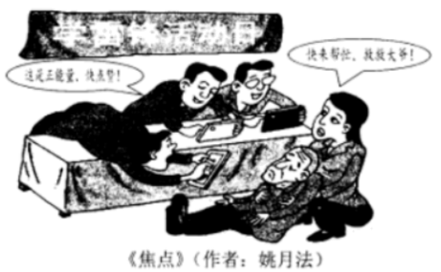

**2023年辽宁省高考政治试题**

**一、选择题：本题共16小题，每小题3分，共48分。在每小题给出的四个选项中，只有一个是符合题目要求的。**

1\. 习近平指出：“概括提出并深入阐释中国式现代化理论，是党的二十大的一个重大理论创新。”“新中国成立特别是改革开放以来，我们用几十年时间走完西方发达国家几百年走过的工业化历程，创造了经济快速发展和社会长期稳定的奇迹……实践证明，中国式现代化走得通、行得稳。”这印证了（ ）

①中国的现代化成就是在中国式现代化理论指导下取得的

②中国式现代化为推进中华民族伟大复兴开辟了广阔前景

③中国式现代化理论实现了马克思主义中国化时代化新的飞跃

④中国的现代化既遵循了现代化的一般规律，又符合中国实际

A. ①② B. ①③ C. ②④ D. ③④

【答案】C

【解析】

【详解】①：在马克思主义现代化理论的指导下，中国共产党团结带领中国人民开辟了中国式现代化新道路，①不选。

②④：中国式现代化道路用几十年时间走完西方发达国家几百年走过的工业化历程，创造了经济快速发展和社会长期稳定的奇迹，即遵循了现代化的一般规律，又符合中国实际，为推进中华民族伟大复兴开辟了广阔前景，②④入选。

③：习近平新时代中国特色社会主义思想实现了马克思主义中国化时代化新的飞跃，③不选。

故本题选C。

2\. 辽沈战役是党中央及时抓住战略决战时机打响的具有决定意义的重要战役，历时52天血与火的洗礼取得胜利，使全国军事形势达到一个新的转折点。历史昭示未来。这启示我们，在新时代东北振兴、辽宁振兴的“辽沈战役”中要（ ）

①树立正确的历史观，抓住机遇，努力实现振兴发展新突破

②坚持以人民为中心的发展思想，放手发动和依靠人民群众

③以顽强斗争赢得主动，努力形成对国家重大战略的有力支撑

④积极融入新发展格局，紧紧依靠改革创新探索合适的发展道路

A. ①② B. ①③ C. ②④ D. ③④

【答案】D

【解析】

【详解】①：材料未涉及树立正确的历史观，①不合题意。

②：材料未涉及坚持以人民为中心的发展思想，放手发动和依靠人民群众，②不合题意。

③④：辽沈战役是党中央及时抓住战略决战时机打响的具有决定意义的重要战役，历时52天血与火的洗礼取得胜利，使全国军事形势达到一个新的转折点。历史昭示未来。这启示我们，在新时代东北振兴、辽宁振兴的“辽沈战役”中要以顽强斗争赢得主动，努力形成对国家重大战略的有力支撑，积极融入新发展格局，紧紧依靠改革创新探索合适的发展道路，③④正确。

故本题选D。

3\. 下列对漫画所反映的劳动力市场问题的推导过程符合经济学原理的是（ ）

①专业选择先于供求信息获得→劳动者在专业选择上具有盲目性→供求难以匹配

②劳动者只看重自身眼前利益→劳动力价格上升使企业需求下降→供求难以匹配

③行业间工资和福利存在差距→劳动者向高工资高福利行业集中→局部供求失衡

④企业获得市场信息有滞后性→企业难以及时调整需求适应供给→局部供求失衡

A. ①③ B. ①④ C. ②③ D. ②④

【答案】A

【解析】

【详解】①：对于劳动者而言，自身的专业选择先于供求信息获得，导致劳动者在专业选择上具有盲目性，因此供求难以匹配，①说法正确。

②：漫画说明劳动者的专长和市场需求不一致，没有体现出劳动者只看重自身眼前利益。而且劳动者只看重自身眼前利益与劳动力价格上升使企业需求下降之间没有必然联系，②不选。

③：漫画怀才不遇，劳动者主要集中在搞策划等方面，却没有一线技工，说明行业间工资和福利存在差距，导致劳动者向高工资高福利行业集中，导致局部供求失衡，③入选。

④：企业无法及时调整需求适应供给不是导致供给和需求失衡的原因，而且应该是劳动力去适应市场需求，④观点不符合题意。

故本题选A。

4\. 近年来，农村快递数量上升，暴露出农村快递运力不足、成本高等问题。为解决以上问题，某市采用公交公司与11家快递公司联运的方式，多举措激发各市场主体活力。图2中措施与直接结果匹配正确的是（ ）

A. 甲-② 丙-④ B. 乙-① 丁-③

C. 丙-① 乙-④ D. 丁-② 甲-③

【答案】D

【解析】

【详解】甲：快递公司借助公交运力，有利于快递公司降低运输成本，对应③。

乙：公交公司客货两运，公交公司可增加货运的收入，对应①。

丙：快递沿公交线下沉进村，拓宽了物流运输范围，扩大了物流网络覆盖范围，对应④。

丁：快递公司共建服务网点，一定程度上减少了运营成本，对应②。

应该选：丁-② 甲-③。

故答案选D。

5\. 某市生态环境局推进“排污许可制”改革，明确企业环评审批证与排污许可证同步申领，减少了审批时间。同时，该局搭建排污许可证证后监管平台，将监管、监测、监察等信息查询功能对企业开放，实现信息共享。这些做法能够推动（ ）

①企业持证排污，助力产业结构优化

②机构的法定化，促进政府积极作为

③社会共同监督，改善企业营商环境

④政企建立互信，提升生态治理水平

A. ①② B. ①④ C. ②③ D. ③④

【答案】B

【解析】

【详解】①④：该市生态环境局明确企业环评审批证与排污许可证同步申领，企业持证排污，助力产业结构优化，减少污染，同时该市生态环境局搭建排污许可证证后监管平台，实现信息共享，政企建立互信，形成合力，提升生态治理水平，①④入选。

②：该市生态环境局推进“排污许可制”改革，积极作为，保护生态环境，但是与机构法定化无关，②不选。

③：材料体现的是搭建排污许可证证后监管平台，并将信息对企业公开，政企建立互信，没有体现社会共同监督，改善营商环境，③不选。

故本题选B。

6\. 甲公司向市场监督管理局投诉乙公司侵犯其商标权，该局受理后展开调查，经查明事实，对乙公司作出行政处罚。乙公司不服，向法院提起行政诉讼，法院维持该行政处罚决定，驳回了乙公司的诉讼请求，乙公司未上诉。这体现了该局（ ）

①依法履行法定职责，规范地行使了行政权力

②对争议事实进行查证，有效化解了行政争议

③运用了行政裁决、行政诉讼等纠纷解决机制

④维护了当事人的合法权益，彰显了公平正义

A. ①② B. ①④ C. ②③ D. ③④

【答案】B

【解析】

【详解】①④：甲公司向市场监督管理局投诉乙公司侵犯其商标权，该局受理后展开调查，经查明事实，对乙公司作出行政处罚。这体现了该局依法履行法定职责，规范地行使了行政权力，维护了当事人合法权益，彰显了公平正义，①④符合题意。

②：材料反映该局对乙公司侵犯其商标权进行了查证，并对侵权者作出行政处罚，不存在化解行政争议问题，②与题意不符。

③：材料反映该局运用法律手段和行政手段处理商标侵权，不涉及运用了行政裁决、行政诉讼等纠纷解决机制，③与题意不符。

故本题选B。

7\. 李先生向社区提出了解决人车分流问题的建议。在街道党总支牵头下，社区多次召开物业、商铺及李先生等居民共同参与的意见征求会议，最终形成了反映整体诉求的社区生活秩序优化方案。方案的落地增强了人们的归属感和幸福感。这一过程（ ）

①提高了公众维权意识和协商式监督的积极性

②体现了对社区治理成果认同和共享的广泛性

③实现公众意见征询从决策前向决策后的延伸

④表明党和人民是利益一致、同心同向的整体

A. ①③ B. ①④ C. ②③ D. ②④

【答案】D

【解析】

【详解】②④：在街道党总支牵头下，社区多次召开物业、商铺及李先生等居民共同参与的意见征求会议，最终形成了反映整体诉求的社区生活秩序优化方案。方案的落地增强了人们的归属感和幸福感。这一过程体现了社会主义协商民主的重要性，表明党和人民是利益一致、同心同向的整体，有利于增强对社区治理成果认同和共享的广泛性，②④符合题意。

①：本题强调公民参与民主决策的重要性，没有涉及维权意识和协商式监督，①不合题意。

③：材料中方案的落地实现公众意见征询从决策后向决策前的延伸，③排除。

故本题选D。

8\. 植保无人机、北斗导航、免耕播种机……各种新农具正成为农业生产的“新武器”,操作新农具的多是被称为“新农人”的大学生，他们依靠科技和专业知识成为农村致富带头人，其辐射效应推动了乡村面貌的嬗变和农业发展的全方位转型。这表明（ ）

①新农具是推动农业生产关系变革的物质条件

②农业新技术构成了农业生产力发展的新动力

③新农人的出现有利于优化农业生产力的结构

④新农人的专业知识为乡村振兴注入精神活力

A. ①③ B. ①④ C. ②③ D. ②④

【答案】C

【解析】

【详解】①：生产工具是生产力发展水平的标志，新农具的使用，有利于提高农业生产效率，发展现代农业，未涉及生产关系的变革，①不符合题意。

②：农业新技术有利于转变农业发展方式，发挥科技促进农业增产增效的潜力，构成了农业生产力发展的新动力，②正确。

③：被称为“新农人”的大学生，他们依靠科技和专业知识成为农村致富带头人，这说明新农人的出现有利于优化农业生产力的结构，③正确。

④：新农人的专业知识为乡村振兴注入智力支持，被称为“新农人”的大学生为农业发展提供人才支撑，而非精神活力，④排除。

故本题选C。

9\. “春分之日，玄鸟至”(《逸周书·时训解》)。在周代，古人就已经靠观察燕子等候鸟春归的时间来确定节气、规划农时。中原地区的燕子多是在春分前后飞回筑巢育雏，周天子便在春分之日祭祀神灵，祈求子孙繁茂。由此可见（ ）

①人能借观察燕来与春到间的关系把握自然变化规律

②依据对规律的认识去规划农时属于实际的农耕活动

③将燕来与子孙繁茂相联系是对客观对象反映的结果

④把握燕来与人活动的联系是为了实现人与自然和谐

A. ①③ B. ①④ C. ②③ D. ②④

【答案】A

【解析】

【详解】①：在周代，古人就已经靠观察燕子等候鸟春归的时间来确定节气、规划农时，说明人能借观察燕来与春到间的关系把握自然变化规律，①符合题意。

②：错误，不能把对规律的认识作为依据，②排除。

③：周天子便在春分之日祭祀神灵，祈求子孙繁茂，周天子将燕来与子孙繁茂相联系，是主观臆造的联系，也是对客观对象反映的结果，③符合题意。

④：错误，把握燕来与人活动的联系是为了确定节气、规划农时，指导农耕活动，④排除。

故本题选A。

10\. 下列各民族谚语与漫画蕴含的哲理相近的是（ ）

①“刀在石上磨，人在干中学”(哈尼族)

②“十个嘴把式，顶不住一个手把式”(汉族)

③“十耳听不如双眼见，十眼见不如双手干”(傣族)

④“不吃菜叶不知饥饱，不挖河水不知深浅”(阿昌族)

A. ①③ B. ①④ C. ②③ D. ②④

【答案】C

【解析】

【详解】漫画中，面对老人摔倒，好几个旁观人员只顾拍照点赞，而不付诸救助实践，启示我们要树立实践第一的观点。

①：“刀在石上磨，人在干中学”，比喻人在艰苦困难的环境中，可以煅炼成材，可以学到很多东西，侧重强调实践是认识的来源，①排除。

②：“十个嘴把式，顶不住一个手把式”，强调说不如做，强调要去实践，实践第一的观点，②正确。

③：“十耳听不如双眼见，十眼见不如双手干”，意思是耳朵听到的不如眼睛看到的，眼睛看到的不如亲手做的，强调实践的重要性，要树立实践第一的观点，③正确。

④：“不吃菜叶不知饥饱，不挖河水不知深浅”，强调要想获得认识，需要去实践，侧重实践是认识来源，④排除。

故本题选C。

11\. 2023年2月，全球多个主要经济体公布2022年对华贸易年报，韩国、德国、英国和欧盟对华投资较上年增幅分别为64.2%、52.9%、40.7%和92.2%。结合材料及下表(数据来源：新华通讯社)，可以推断出（ ）

①外资对中国经济发展前景保持乐观

②中国在全球贸易中的地位日益上升

③中外经贸投资合作近三年持续共赢

④欧盟已经成为中国最大贸易伙伴

A. ①③ B. ①④ C. ②③ D. ②④

【答案】A

【解析】

【详解】①：2022年韩国、德国、英国和欧盟对华投资较上年都有较大的增幅，说明外资对中国经济发展前景保持乐观，①入选。

②：材料体现的是中国货物贸易进出口总额不断增长，中国对外直接投资和实际使用外资也是不断增长的，但是无法判断中国在全球贸易中的地位日益上升，②不选。

③：从2020年到2022年，中国货物贸易进出口总额不断增长，中国对外直接投资和实际使用外资也是不断增长的，这表明中外经贸投资合作近三年持续共赢，③入选。

④：欧盟对华投资较上年增幅为92.2%，只能看出是增幅较大，无法判断欧盟已经成为中国最大的贸易伙伴，④不选。

故本题选A。

12\. 缺乏互信的两国开展合作，现有甲、乙两个项目。其中，甲需两国合力完成，但收益巨大；乙可两国合力，也可一国独立完成，但整体收益远低于甲的一半。因资金有限，在同一时期两国只能选择一个项目投资且无法撤资，合力完成项目后收益两国均分。对于两国决策者来说，对国家最有利的选择是（ ）

①防范对方失信行为

②开展两国对话协商

③向大型项目甲投资

④向小型项目乙投资

A. ①→③ B. ①→④ C. ②→③ D. ②→④

【答案】C

【解析】

【详解】①②：甲乙两国虽然缺乏互信，但是两国合作带来的经济利益是巨大的，符合双发的利益，因而双方应该开展两国对话协商，①不选，②入选。

③④：在两国协商对话的前提下，甲国的合作项目收益巨大，且最终两国平分，乙的项目收益远远低于甲的一半，因而应该向大型项目甲投资，③入选，④不选。

所以两国应该是互信的基础上，投资甲的项目，其顺序是②→③ 。

故本题选C。

13\. 某村成立合作社，发展“采茶+茶艺”的文旅融合模式，村民积极响应。张爷爷以承包地的经营权入股合作社，用作采茶园。他还把宅基地上的房屋租给合作社，用于经营茶楼，租期5年。文旅融合模式拓宽了村民的收入渠道。下列说法正确的是（ ）

①张爷爷对其承包地享有抵押权，对其宅基地享有所有权

②合作社对张爷爷的房屋可以占有、使用，享有用益物权

③张爷爷与合作社之间的房屋租赁合同应当采用书面形式

④张爷爷与合作社的法律地位平等，均享有民事权利能力

A. ①② B. ①④ C. ②③ D. ③④

【答案】D

【解析】

【详解】①：张爷爷对其承包地和宅基地享有使用权，没有所有权，①错误。

②：根据我国民法典的有关规定，房屋出租不属于用益物权，而是属于债权。合作社对张爷爷的房屋可以占有、使用，而不享有用益物权，②错误。

③：对于权利义务关系复杂、金额较大以及履行期限较长的合同，应当采取书面形式，因此，张爷爷与合作社之间的房屋租赁合同应当采用书面形式，③正确。

④：材料中“他还把宅基地上的房屋租给合作社，用于经营茶楼，租期5年”，说明张爷爷与合作社存在民事法律关系，二者法律地位平等,均享有民事权利能力，④正确。

故本题选D。

14\. 网络平台利用其收集的消费者偏好、消费金额、消费次数等信息进行差异定价的情况频频发生。最近，某平台对钻石会员销售的高档宾馆住宿费定价高于线下一倍多，给消费者利益造成损害。下列判断正确的是（ ）

①平台根据不同消费者的信息进行差异定价，侵犯消费者知情权

②消费能力、特殊消费偏好属于个人信息，但均不属于个人隐私

③消费者若想向平台主张损害赔偿，要承担损害事实的举证责任

④消费者若主张平台侵犯其个人信息权益，要证明平台存在过错

A. ①② B. ①③ C. ②④ D. ③④

【答案】B

【解析】

【详解】①：平台根据不同消费者的信息进行差异定价，隐瞒了商品及服务的真实价格，侵犯了消费者的知情权，①正确。

②：信息与隐私权密切相关，受到法律保护。处理个人信息，应当遵循合法、正当、必要原则，不得过度处理。网络平台利用其收集的消费者偏好、消费金额、消费次数等信息进行“大数据杀熟”，违反了民法典中对个人信息处理的合法性、正当性和必要性原则，属于侵犯了个人隐私，②错误。

③：根据民事诉讼举证规则，消费者主张平台存在侵权行为，则应当承担损害事实的举证责任，③正确。

④：《中华人民共和国个人信息保护法》规定，处理个人信息侵害个人信息权益造成损害，个人信息处理者不能证明自己没有过错的，应当承担损害赔偿等侵权责任。因此应当由平台承担证明自己不存在过错的举证责任，④排除。

故本题选B。

15\. 雾凇俗称树挂，玉树琼花，宛若仙境。其形成条件严苛，需要独特的气象条件与自然要素。不同地区形成雾凇的条件存在一定差异，但湿度大、风力小、气温日较差大是形成雾凇的共同条件。以下选项一定为真的是（ ）

①湿度大、风力小、气温日较差大，所以雾凇产生了

②雾凇产生了，所以湿度大、风力小、气温日较差大

③湿度小或风力大或气温日较差小，所以雾凇没产生

④雾凇没产生，所以并非湿度大、风力小、气温日较差大

A. ①② B. ①④ C. ②③ D. ③④

【答案】C

【解析】

【详解】①：不同地区形成雾凇的条件存在一定差异，但湿度大、风力小、气温日较差大是形成雾凇的共同条件，从题干可以看出湿度大、风力小、气温日较差大是形成雾凇的必要条件，必要条件的假言判断正确的结构是肯后肯前式或者否前否后式。湿度大、风力小、气温日较差大，所以雾凇产生了，这是肯前肯后式得不出必然结论，①不符合题意。\
②③：湿度大、风力小、气温日较差大是形成雾凇的必要条件，必要条件的假言判断正确的结构是肯后肯前式或者否前否后式。雾凇产生了，所以湿度大、风力小、气温日较差大这是肯后肯前式。湿度小或风力大或气温日较差小，所以雾凇没产生，这是否前否后式，②③符合题意。\
④：雾凇没产生，所以并非湿度大、风力小、气温日较差大，这是否后否前式得不出必然结论，④不符合题意。\
故本题选C。

16\. 糖是人类必需的能量来源，但长期过量摄入会导致代谢紊乱等问题。人们为了追求健康，在通过运动促进糖脂代谢的同时，愈加注重“减糖”。由于人对甜味本能的热爱，用甜味剂代替有甜味的糖成为一种选择，安全优质的代糖应运而生。由此可知（ ）

①代糖与糖无差别的同一使人们对甜味的需要得以满足

②代糖产生体现了对甜味需要的满足从糖到代糖的迁移

③代糖是对甜味的热爱与“减糖”需求共同作用的结果

④代糖的产生是运用超前意识对糖过量摄入问题的解决

A. ①② B. ①④ C. ②③ D. ③④

【答案】C

【解析】

【详解】①：代糖是一种甜味剂，不会产生糖的长期过量摄入问题，因而代糖与糖是有差别的同一，①不选。

②③：由于人对甜味本能的热爱，用甜味剂代替有甜味的糖成为一种选择，安全优质的代糖应运而生，这是对对甜味需要的满足从糖到代糖的迁移，代糖的产生是对甜味的热爱与“减糖”需求共同作用的结果，②③入选。

④：糖长期过量摄入会导致代谢紊乱等问题。人们为了追求健康，在通过运动促进糖脂代谢的同时，愈加注重“减糖”，是在产生相关问题后，再研究的代糖，因而没有体现超前意识，④不选。

故本题选C。

**二、非选择题：本题共3小题，共52分。**

17\. 阅读材料，完成下列要求。

党和国家监督体系是党在长期执政条件下实现自我革命的重要制度保障。习近平在十九届中央纪委四次全会的重要讲话中将财会监督纳入党和国家监督体系，突出其政治属性。2023年2月，中共中央办公厅、国务院办公厅印发《关于进一步加强财会监督工作的意见》(以下简称《意见》),强调把推动党中央、国务院重大决策部署贯彻落实作为财会监督工作的首要任务。

实现碳达峰碳中和是党中央的重大战略决策，需要绿色金融等相关政策的推动，以及政府、企业等投入巨量的资金支持。因此，党进一步加强财会监督工作，能够更好地依法依规对相关国家机关、企事业单位、其他组织和个人的财政、财务、会计活动实施监督，为碳达峰碳中和工作保驾护航。

《意见》要求，综合运用检查核查等方式开展财会监督，健全财会监督法律法规制度，严肃查处财经领域违纪违规行为，将工作推进情况作为领导班子和有关领导干部考核的重要内容，促进财会益舒与其他各类监督贯通协调，确保党中火政令畅通。《意见》的贯彻落实将助力实现碳达峰碳中和目标，推动美丽中国建设。

结合材料，运用政治与法治知识，分析党进一步加强财会监督工作对贯彻落实碳达峰碳中和决策部署的作用。

【答案】①党进一步加强财会监督工作，把党的领导落实到财会监督全过程各方面，发挥党的全面领导和党中央集中统一领导的政治优势。\
②坚持依法监督，强化法治思维，更好地依法依规对贯彻落实碳达峰碳中和决策部署实施监督，为碳达峰碳中和工作保驾护航。\
③坚持协同联动，健全财会监督体系，构建高效衔接、运转有序的工作机制，助力实现碳达峰碳中和目标，推动美丽中国建设。

【解析】

【分析】背景素材：党和国家监督体系是党在长期执政条件下实现自我革命的重要制度保障

考点考查：党的领导等有关知识

能力考查：获取和解读信息、调动和运用知识、描述和阐述事物　

核心素养：政治认同、科学精神

【详解】第一步：审设问，明确主体、作答范围、问题限定和作答角度。本题属于分析说明类主观题，可从知识指向提取材料关键词并对接教材知识思考作答。注意知识限定不要用错，结合材料进行分析。

第二步：审材料，提取关键词，链接教材知识。

关键词①：中共中央办公厅、国务院办公厅印发《关于进一步加强财会监督工作的意见》，强调把推动党中央、国务院重大决策部署贯彻落实作为财会监督工作的首要任务→可联系教材知识发挥党的全面领导和党中央集中统一领导的政治优势。

关键词②：党进一步加强财会监督工作，能够更好地依法依规对相关国家机关、企事业单位、其他组织和个人的财政、财务、会计活动实施监督，为碳达峰碳中和工作保驾护航→可联系教材知识坚持依法监督，强化法治思维。

关键词③：综合运用检查核查等方式开展财会监督，健全财会监督法律法规制度，严肃查处财经领域违纪违规行为，将工作推进情况作为领导班子和有关领导干部考核的重要内容，促进财会益舒与其他各类监督贯通协调，确保党中政令畅通→可联系教材知识坚持协同联动，构建高效衔接、运转有序的工作机制。

第三步：整合信息，组织答案。注意设问限定以及教材知识与材料相结合。

18\. 阅读材料，完成下列要求。

“红色剧本杀”以角色扮演方式在游戏中传承红色基因，这种沉浸式体验深受青少年喜爱。A剧本杀店张贴海报，吸引玩家纷至沓来。某日，大三学生小明约同学去该店玩以某英雄连事迹为主线的情景式剧本杀。在游戏过程中，小明发现剧本内容包含对某英烈的侮辱性言辞。震惊之余，小明与主持人发生争执，不牢固的布景装置导致了小明小腿骨折。小明向执法机关举报了该店。

结合材料，运用法律与生活知识，分析A剧本杀店涉嫌哪些违法行为；若小明诉至法院请求损害赔偿，可提出哪些理由。

【答案】（1）①剧本内容包含对某英烈的侮辱性言辞，侵犯了英烈的名誉权，损害社会共利益。\
②不牢固的布景装置导致了小明小腿骨折，侵犯了小明的身体权和健康权。\
③在宣传海报中，“海量下载，改变的红色剧本”涉嫌侵犯他人的著作权。\
（2）理由：\
①民事主体享有名誉权和荣誉权，任何组织或者个人不得以侮辱、诽谤等方式侵害他人的名誉权，也不得非法剥夺他人的荣誉称号，不得诋毁、贬损他人的荣誉。自然人享有生命权、身体权、健康权、姓名权、肖像权、名誉权、荣誉权、隐私权。②英烈和小明合法权益受到了损害，该店主观上存在过错，该店行为与损害结果之间存在因果关系。

【解析】

【分析】背景素材：小明与剧本杀店的纠纷

考点考查：积极维护人身权利、尊重知识产权、侵权责任与权利界限的相关知识

能力考查：描述和阐释事物

核心素养：政治认同、科学精神、法治意识

【详解】第一步：审设问。明确主体、知识范围、问题限定和作答角度。

本题需要调用法律与生活的有关知识，分析剧本杀店的违法行为和小明可以提起的申请赔偿的理由，从积极维护人身权利、尊重知识产权、侵权责任与权利界限等方面分析作答。

第二步：审材料。提取关键词，链接教材知识。

该店涉嫌哪些违法行为：

关键词①：小明发现剧本内容包含对某英烈的侮辱性言辞→可联系侵犯了英烈的名誉权；

关键词②：不牢固的布景装置导致了小明小腿骨折→可联系侵犯了小明的身体权和健康权；

关键词③：海量下载，改变的红色剧本→可联系著作权的相关知识。

理由：

关键词①：若小明诉至法院请求损害赔偿，可提出哪些理由→可联系《民法典》关于积极维护人身权利的相关规定；

关键词②：震惊之余，小明与主持人发生争执，不牢固的布景装置导致了小明小腿骨折→可联系一般侵权的构成要件。

第三步：整合信息，组织答案。注意设问限定以及教材知识与材料、时政信息等相结合。

19\. 阅读材料，完成下列要求。

材料一 【筚路蓝缕破茧成蝶】

独立自主是中华民族精神之魂。新中国成立之初，在建的南京长江大桥突然遭遇国外钢材断供。面对桥梁钢关键技术领域的“卡脖子”问题，周恩来指示要炼出我们自己的“争气钢”,并将自主研发桥梁钢的任务交给鞍钢。

为了啃下这块“硬骨头”,鞍钢集结全厂力量开展技术攻关。技术人员根据钢材用途的特殊要求，研究并确定桥梁钢的强度、韧性等各项参数，以及碳、锰等元素不同占比对钢材性能的影响。研究表明，一定含量的碳和锰能够提高钢材的强度和硬度，但当它们的含量超过一定比例时，会带来钢材塑性、韧性等性能不同程度的下降。技术人员经过不断对比、调整，确定钢材的屈服强度、化学成分及配比。与此同时，他们对生产环节也进行了技术改造，结合一线工人的实践，通过大量实验、反复测试，发现问题、总结经验，解决了一个又一个技术难题，取得了研发的成功。工人们日夜奋战，在短时间内生产出了“争气钢”,满足了南京长江大桥建设的需要，填补了我国建设大跨度桥梁钢种的空白。

材料二 【踔厉前行奋楫扬帆】

自1995年始，鞍钢开启大规模技术改造，引进国内外先进技术和设备，整体工艺装备和技术研发水平得到大幅度提高，也提升了产品质量和档次。2001年以来，鞍钢先后中标多个受人瞩目的重大桥梁工程，其中作为世界最长跨海大桥的港珠澳大桥使用鞍钢桥梁钢总量达17万吨。在2005年至2006年国内桥梁钢招标总量中，鞍钢桥梁钢已占54.5%,鞍钢用“钢筋铁骨”撑起中国桥梁的半壁江山。鞍钢在不断的发展中走向国际市场，一方面，与国内外企业和研究机构、大学联合研制更高性能的桥梁钢；另一方面，凭借技术和成本优势，中标欧美、非洲、亚洲等多项国外桥梁工程，实现了多点开花。

（1）结合材料一，运用哲学知识阐述鞍钢人在桥梁钢研发生产过程中发挥主体作用。

（2）结合材料一，说明技术人员在桥梁钢研发过程中是如何运用分析与综合的辩证思维方法的。

（3）结合材料，运用经济与社会、当代国际政治与经济知识，分析鞍钢桥梁钢逐步融入全球市场的过程。

（4）“争气钢”的故事极大鼓舞了同学们。某高中决定举办“辽宁自主创新辉煌成就图片展”。结合材料和以下展板，运用文化知识，为该展览撰写前言。

要求：主题鲜明，表述清晰，逻辑严谨，字数150-200字。

【答案】（1）①意识具有能动作用，人能够能动地认识世界和改造世界。面对问题，鞍钢人充分发挥主观能动性，炼出自己的“蒸汽钢”。\
②实践是人们改造客观世界的物质性活动，具有能动性和社会历史性。鞍钢人深入研究，日夜奋战，取得了研发的成功。\
③人是生产力中最活跃的因素，人民群众是社会历史的主体。鞍钢人在桥梁钢研发生产过程中独立自主，开展技术攻关，填补了桥梁钢种的空白。

（2）①在辩证思维中，分析与综合是方向相反却又相辅相成的对立统一关系。综合是分析的先导，分析是综合的基础，分析为综合做准备。\
②技术人员研发过程中，研究并确定桥梁钢的各项参数，再经过不断对比、调整，总结经验，解决了技术难题，取得了研发的成功。

（3）①在建国初，面对“卡脖子”问题，我国坚持独立自主、自力更生，生产出了“争气钢”，填补了建设大跨度桥梁钢种的空白。\
②改革开放以后，我国逐步健全社会主义市场经济体制，坚持对外开放基本国策，引进国内外先进技术和设备，提升了鞍钢桥梁钢的质量和档次。\
③入世以来，我国进一步发展更高层次的开放型经济，将独立自主和对外开放有机结合，中标国外桥梁工程，将鞍钢桥梁钢逐步融入全球市场。

（4）创新是引领发展的第一动力，惟创新者进、惟创新者强、惟创新者胜；面对桥梁钢关键技术领域的“卡脖子”问题，鞍钢人，独立自主、自力更生，生产出了“争气钢”、山东舰，彰显着中国在现代军事建设领域的巨大进步，代表着中国海军建设的最高水平和国家实力的象征。咱们工人有力量，炼钢人向我们传递着精益求精的工匠精神，是我们学习的榜样；新时代，他们是未来的希望，肩负着精益求精的技术创新；新时代，新征程，新使命，新召唤，工人阶级将无愧于先锋队的称号，为中国的发展贡献蓬勃的力量。

【解析】

【分析】背景素材： 鞍钢人在桥梁钢研发生产过程中踔厉前行，奋楫扬帆

考点考查：哲学、新发展理念、独立自主、自力更生与对外开放、分析与综合的辩证思维方法的相关知识

能力考查：描述和阐述事物，论证和探究问题

核心素养：政治认同、科学精神

【小问1详解】

第一步：审设问。明确主体、知识范围、问题限定和作答角度。

本题的设问要求为阐述鞍钢人在桥梁钢研发生产过程中发挥的主体作用，需要调用意识的能动作用、实践的含义和特征、人民群众是历史的主体的有关知识，从体现类角度分析作答。

第二步：审材料。提取关键词，链接教材知识。

关键词①：为了啃下这块“硬骨头”，鞍钢集结全厂力量开展技术攻关→可联系意识具有能动作用；

关键词②：技术人员根据钢材用途的特殊要求，研究并确定桥梁钢的强度、韧性等各项参数，以及碳、锰等元素不同占比对钢材性能的影响→可联系实践的含义、特征；

关键词③：工人们日夜奋战，在短时间内生产出了“争气钢”，满足了南京长江大桥建设的需要，填补了我国建设大跨度桥梁钢种的空白→可联系人民群众是历史的主体。

第三步：整合信息，组织答案。注意设问限定以及教材知识与材料信息相结合。

【小问2详解】

第一步：审设问。明确主体、知识范围、问题限定和作答角度。

本题要求说明技术人员在桥梁钢研发过程中运用分析与综合的辩证思维方法的措施，需要调用分析与综合的辩证思维方法的有关知识，从措施角度分析作答。

第二步：审材料提取关键词，链接教材知识。

关键词：技术人员根据钢材用途的特殊要求，研究并确定桥梁钢的强度、韧性等各项参数，以及碳、锰等元素不同占比对钢材性能的影响→可联系综合与分析的关系。

第三步：整合信息，组织答案。注意设问限定以及教材知识与材料信息相结合。

【小问3详解】

第一步：审设问。明确主体、知识范围、问题限定和作答角度。

本题要求说明鞍钢桥梁钢逐步融入全球市场的过程，需要调用独立自主、自力更生与对外开放的有关知识，从说明角度分析作答。

第二步：审材料。提取关键词，链接教材知识。

关键词①：面对桥梁钢关键技术领域的“卡脖子”问题，周恩来指示要炼出我们自己的“争气钢”，并将自主研发桥梁钢的任务交给鞍钢→可联系坚持独立自主、自力更生；

关键词②：自1995年始，鞍钢开启大规模技术改造，引进国内外先进技术和设备，整体工艺装备和技术研发水平得到大幅度提高，也提升了产品质量和档次→可联系我国逐步健全社会主义市场经济体制，坚持对外开放基本国策；

关键词③：2001年以来，鞍钢先后中标多个受人瞩目的重大桥梁工程，鞍钢在不断的发展中走向国际市场→可联系入世以来，我国进一步发展更高层次的开放型经济，将独立自主和对外开放有机结合。

第三步：整合信息，组织答案。注意设问限定以及教材知识与材料信息相结合。

【小问4详解】

第一步：审设问。明确主体、知识范围、问题限定和作答角度。

本题要求给“辽宁自主创新辉煌成就图片展”写前言，属于开放性试题，需要调用文化的有关知识，撰写前言。

第二步：审材料。提取关键词，链接教材知识。

关键词①：惟创新者进、惟创新者强、惟创新者胜→可联系创新是引领发展的第一动力；

关键词②：咱们工人有力量→可联系精益求精的工匠精神。

第三步：整合信息，组织答案。注意设问限定以及教材知识与材料信息相结合。

联系文化相关知识，按照题干要求言之有理即可。

【点睛】开放性试题一定注意审清设问，明确主题，围绕主题进行论述，论述时要注意与教材知识相结合，运用学科术语，规范答题，注意逻辑清晰，字数符合要求。
