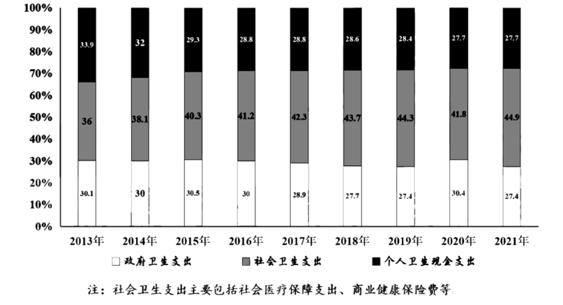
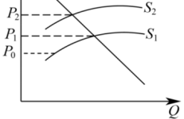

**2023重庆高考思想政治**

**本卷满分100分，考试时间75分钟。**

**一、单项选择题：本题共16小题，每小题3分，共45分。在每小题给出的四个选项中，只有一项是符合题目要求的。**

1\. 习总书记指出：“要深刻认识，共产主义远大理想与中国特色社会主义共同理想的辩证关系。”既不能离开发展中国特色社会主义事业实现民族复兴的现实工作而空谈远大理想，也不能因为实现共产主义远大理想是一个漫长过程而违背甚至丢掉远大理想。能支撑这一观点的是( )

A. 发展中国特色社会主义的最高目标是实现共产主义

B. 实现中华民族的伟大复兴，也就实现了共产主义的远大理想

C. 实现共产主义是一个漫长的过程，现在没有必要谈共产主义

D. 中国特色社会主义共同理想具有现实性，共产主义远大理想，缺乏现实基础

2\. 习近平总书记在党的二十大报告中明确指出：积极推进实践基础上的理论创新，首先要把握好新时代中国特色社会主义思想的世界观和方法论，坚持好、运用好贯穿其中的立场观点方法“六个必须坚持”，即必须坚持人民至上、必须坚持自信自立、必须坚持守正创新、必须坚持问题导向、必须坚持系统观念、必须坚持胸怀天下。对此作出概括和阐述( )

A. 推进实践基础上的理论创新，必须坚持习近平新时代中国特色社会主义思想的世界观和方法论

B. 习近平新时代中国特色社会主义思想是马克思主义世界观和方法论的中国化和时代化

C. 习近平新时代中国特色社会主义思想为解决矛盾问题提供路线图、方法论和具体举措

D. 习近平新时代中国特色社会主义思想揭示了社会发展规律，决定了社会主义运动发展的方向

3\. 明代思想家顾宪成在东林书院留下“风声雨声读书声声入耳，家事国事天下事事关心”。该对联( )

A. 以直言判断形式描述当时复杂的学习环境

B. 以选言判断形式呼吁要认真读书学习知识

C. 以假言判断形式揭示了读书爱国的条件关系

D. 以联言判断形式的倡导将读书与爱国相结合

4\. 何石宝，硕士毕业后，怀揣着对农业的梦想，从家乡湖南来到了齐鲁大地扎根在平原县这片热土，贡献着自己所学的知识，同时也拥有了一个新标签——“新农人”，将自己所学的专业知识与农业种植相结合，产量创新高，被评为“粮王”，由此可见( )

①科学种植是推动农业发展的第一动力

②新农人是提高农业生产的主要人力资本支撑

③农业现代化为新农人施展才干提供舞台

④农业大国国情决定农业生产，具有人才优势

A. ①③ B. ①④ C. ②③ D. ②④

5\. 国有企业规模大的地区，民营企业往往越活跃；民营企业发展迅速的地区，国有企业市场竞争力越强。2022年，全国民营经济第一强省广东有19家民营企业跻身世界500强企业，民营经济大省浙江和福建有7家民营企业入围世界500强企业，由此可见( )

①民营经济的活力源于国有经济的引导

②国有经济和民营经济优势互补，相辅相成

③民营经济的发展增强了国有经济的主导地位

④国有经济和民营经济的协力共进有利于增强经济活力

A. ①② B. ①③ C. ②④ D. ③④

6\. 卫生费用支出构成，反映了一定经济社会个人的卫生费用负担比例，题6图展示了2013～2021年我国卫生总费用支出的构成比例，由此可知( )

①卫生费用支出涉及各主体经济利益的协调

②社会卫生支出的国民收入再分配功能日益增强

③个人卫生现金支出占比减少反映了民众消费意愿的变化

④政府卫生支出占比相对稳定说明医疗卫生领域市场调节有效

A. ①② B. ①④ C. ②③ D. ③④

7\. 我国外贸法以及国务院行使外贸管理权的变迁过程如题表所示，由此可知( )

<table style="width:71%;">
<colgroup>
<col style="width: 10%" />
<col style="width: 61%" />
</colgroup>
<tbody>
<tr>
<td colspan="2" style="text-align: left;">题表</td>
</tr>
<tr>
<td style="text-align: left;">1994年</td>
<td style="text-align: left;">全国人大确立外贸经营审批制度</td>
</tr>
<tr>
<td style="text-align: left;">2004年</td>
<td style="text-align: left;">全国人大取消外贸经营审批制度，确立外贸经营备案登记制度</td>
</tr>
<tr>
<td style="text-align: left;">2019年</td>
<td style="text-align: left;">经全国人大授权，在自贸区试点外贸经营备案登记制度</td>
</tr>
<tr>
<td style="text-align: left;">2022年</td>
<td style="text-align: left;">全国人大，外贸经营备案登记制度</td>
</tr>
</tbody>
</table>

①外贸立法与改革之间呈现出了良性互动

②国务院在自贸区无权制定外贸行政法规

③先行先试是外贸法制定修改的必备程序

④国务院行使外贸管理权的方式逐步优化

A. ①③ B. ①④ C. ②③ D. ②④

8\. 中共中央委托各民主党派对于长江沿岸各省开展长江生态环境保护民主监督，要求各级政府为民主党派监督调研提供支持并且认真听取监督建议，实施好长江生态修复和环境保护工程，这体现了( )

①中国共产党坚持科学执政、民主执政

②民主党派的监督建议对政府有强制力

③民主党派的民主监督是政府履职的政治前提

④中国共产党同各民主党派既合作又相互监督

A. ①② B. ①④ C. ②③ D. ③④

9\. 我乡村振兴助把力，重庆某村两委鼓励村民参加“五好家庭创建”“创业孵化实训”“美丽庭院改造等活动”，以家庭或村民小组为单位进行公开评比，并给予物质精神奖励，激发村民自治内生动力，这些措施( )

A. 反映村民参与基层自治方式的多样性

B. 是村民直接行使民主决策权利的体现

C. 有利于形成共建共享乡村治理新格局

D. 使村民对两委工作做更有效的评议

聚焦社会关注，回应群众关切。为推行“综合查一次”行政执法模式改革。对同一对象开展“一张清单”行政执法模式改革，对同一对象开展“一张清单”，“全科式”联合执法检查。某市开发了“技术+场景”数字化应用平台。该平台覆盖众多跨部门、跨领域、跨层级协同执法场景，为破解重复执法、多头执法提供智能支撑。阅读材料完成下面小题。

10\. 该市的做法( )

①实现了行政执法效果最大化

②是转变政府职能的具体体现

③有利于提升行政执法的能力

④表明政府全面履行基本职能

A. ①③ B. ①④ C. ②③ D. ②④

11\. 对材料理解正确的是( )

①“一张清单、全科式”执法检查的优势在于可以以偏概全

②“聚焦社会关注，回应群众关切”贯彻了党的群众观点和群众路线

③跨部门、跨领域、多头执法体现了数量变化引起质变

④以行政执法模式改革，体现问题导向的创新思维

A. ①③ B. ①④ C. ②③ D. ②④

1956年，科学家首次提出“用机器模拟人工智能”经过几年的发展，人工智能局部智能水平上超越人类，但人脑是一个集知情于一体的通用智能系统。根据材料，完成下面小题。

12\. 关于人工智能说法正确的是( )

①“人工智能”是人脑系统的延伸和拓展

②“人工智能”是否实现取决于是否符合社会发展的客观规律

③意识具有目的性，能根据因果规律准确预测人工智能未来发展

④用机器模拟人工智能发挥了意识创造人为事物联系的功能

A. ①② B. ①④ C. ②③ D. ③④

13\. 人工智能局部智能水平上超越人类，对此说法正确是( )

A. 说明意识的反复性决定了实践的曲折性

B. 体现了认识与实践之间的矛盾关系的彻底消失

C. 说明人工智能的发展是连续性与间断性的统一

D. 体现了从感性具体到思维具体，思维具体再到思维抽象

14\. 酉阳摆手舞，源于古代巴人的生活，表现了巴人劳动智慧的豪放性格。随着乡村振兴摆手舞重焕生机，成为旅游保留节目。当地小学结合地域文化，创编摆手律动操，让学生传承优秀传统文化的同时，也感受到劳动人民艰苦奋斗的精神。下列说法正确的是( )

①摆手舞因历史悠久而具有划时代魅力

②摆手舞在乡村振兴中获得经济效益越大，社会效益就越大

③摆手律动操以物化形式发挥了文化育人，增强精神力量的作用

④创编摆手律动操体现了对优秀传统文化的创造性转化和创新性发展

A. ①② B. ①④ C. ②③ D. ③④

15\. 我们在生活中应当树立法制意识，尊重法律规则，下列选项正确的是( )

①甲遗弃的宠物狗咬伤行人，行人有权要求甲承担赔偿责任

②乙从家中抛掷酒瓶后砸伤行人，行人有权要求乙承担赔偿责任

③丙无视攀爬景区雕塑时摔伤，并有权要求景区经营者承担部分赔偿责任

④丁边看手机边走路，撞上某单位门口合法安装的防护栏而受伤，丁有权要求该单位承担部分赔偿责任

A. ①② B. ①③ C. ②④ D. ③④

16\. 甲（17周岁）与乙公司签订的劳动合同，约定从事仓储管理工作。合同中甲承诺自愿放弃缴纳社保后果自负。甲因在工作时间经常打游戏导致所管理物资多次丢失给公司造成重大损失。下列说法正确的是( )

A. 甲是未成年人与其签订的劳动合同不能生效

B. 甲作出自愿放弃缴纳社保且后果自负的承诺有效

C. 若甲和乙公司履行劳动合同发生纠纷甲可以直接向人民法院提出诉讼

D. 甲因严重失职给公司造成重大损害，乙公司可据此解除与甲的劳动合同

17\. 阅读材料，完成下列要求。

材料一 我国在光伏制造领域有显著成本，技术等竞争优势，拥有全球光伏供应链约80%的份额。2022年光伏产品出口额约512.5亿美元，同比增长80.3%，但逆全球化趋势在光伏供应链中抬头，美国2022年通过《通胀削减法案》，拿出3690亿美元的补贴发展本土清洁技术，并在2023年5月宣称确认对进口光伏面板恢复征收关税；欧盟通过标准制定和行政支持，计划2030年至少40%的清洁技术及产品实现本土生产。世界资源研究所指出，若光伏链转移到美国和欧洲达成目标能源2050年全球净零碳排放目标将延后6～11年。

材料二 我国政府积极统筹能源安全保障和绿色低碳转型，持续推动可再生能源技术和发展，模式创新，实施可再生能源替代行动，推进一大批可再生能源重大工程。2022年我国可再生能源发电量相当于减少国内二氧化碳排放量约22.6亿吨，出口的光伏产品帮助其他国家减排二氧化碳5.73亿吨，总计减排量约占全球同期可再生能源折算减排量41%。

材料三 沙漠、戈壁等荒漠化土地占我国国土面积仅四分之一，拥有全国60%以上的太阳能资源可开发量。今年青海、宁夏、内蒙古等地积极探索沙漠区太阳能板上发电、板下种植（枸杞、黄芪、红枣等）、板间养殖（牛羊）的“光伏+综合发展模式”，形成光伏发电、农业种养、观光旅游等多业态融合的产业发展和生态治理示范区，把不毛之地变成“草原绿洲”和“致富良田”。

（1）由于税赋转嫁，进口关税由进口国消费者和他国出口商共同承担，在其他条件不变的情况下，假设美国向进口光伏产品每单位征收一定量的关税。美国国美光伏产品供给曲线由S1到S2变化，则美国消费者应承担的单位光伏产品的关税是多少？

（2）结合材料一，运用《经济与社会》《当代国际与政治》相关知识，从“对全球光伏供应链影响”的角度，分析欧美国家逆全球化贸易政策对达成2050年全球净零碳排放目标的冲击。

（3）结合材料二，运用《政治与法治》《当代国际政治与经济》的知识，分析我国推动经济社会绿色化，低碳化发展的重大意义。

（4）根据能源“不可能三角”理论，“人类在追求清洁能源时不可能在同一系统内同时满足供给安全，环境友好，价格低廉三个目标要求”。但这个不可能三角，正被我国“沙漠光伏”打破。结合材料，请用创新思维分析我国如何破解能源“不可能三角”。

（5）结合材料一和材料三，运用一切从实际出发的相关知识，说明我国是如何积极探索“光伏+”综合发展模式的。

18\. 阅读材料，完成下列要求。

我国民法典是一部“绿意盎然”的民法典，在总则编首次规定了“绿色原则”，在物权编、合同编、侵权责任编等设置了具体的“绿色条款”。

<table style="width:86%;">
<colgroup>
<col style="width: 23%" />
<col style="width: 62%" />
</colgroup>
<tbody>
<tr>
<td colspan="2" style="text-align: left;">题表</td>
</tr>
<tr>
<td style="text-align: left;">总则编</td>
<td style="text-align: left;">民事主体从事民事活动，应当有利于节约资源、保护生态环境。(第9条)</td>
</tr>
<tr>
<td style="text-align: left;">合同编</td>
<td style="text-align: left;">当事人在履行合同过程中，应当避免浪费资源、污染环境和破坏生态。(第509条)</td>
</tr>
<tr>
<td style="text-align: left;">侵权责任编</td>
<td style="text-align: left;">因污染环境、破坏生态造成他人损害的，侵权人应当承担侵权责任。(第1229条)</td>
</tr>
</tbody>
</table>

结合材料，谈谈民法典“绿色原则”“绿色条款”，对推动经济社会绿色化、低碳化发展的价值。
