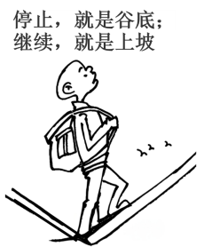
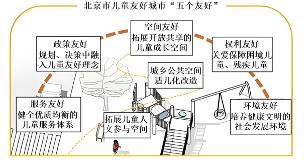

**北京市2024年普通高中学业水平等级性考试**

**思想政治**

**本试卷满分100分，考试时间90分钟。**

**第一部分分**

**一、选择题（本大题共15小题，每小题3分，共45分。在每小题给出的四个选项中，只有一项是最符合题目要求的）**

1\. 辛亥革命后，各种政治力量反复较量，中国共产党脱颖而出，团结带领人民夺取了新民主主义革命胜利，建立了人民当家作主的新中国。新中国成立后，党领导人民召开人民代表大会，通过了一九五四年宪法，确立了人民代表大会制度。75年来，我国社会生产力、综合国力、人民生活水平实现了历史性跨越。下列分析正确的是（ ）

①中国共产党深刻改变了中国人民和中华民族的前途命运

②“五四宪法”以国家根本法的形式确认了中国人民掌握国家权力的历史变革

③政治制度是推动社会历史发展的决定力量

④美好生活是社会主义社会发展的直接动力

A. ①② B. ①③ C. ②④ D. ③④

2\. 基层是国家治理的末梢，是党和政府联系服务群众的“最后一公里”。整治形式主义为基层减负，是一项重要政治任务。身边有什么问题线索，对基层减负有哪些意见建议，都可以到“留言板”说说。下列选项正确的是（ ）

①公开征集问题线索和减负建议，坚持了群众观点与群众路线

②直面基层工作难点，为基层减负，要以征集的意见建议作为行动出发点

③理顺基层事务职责，要坚持问题导向，勇于面对矛盾，善于化解矛盾

④形式是事物存在基础，要坚持内容与形式的统一，以形式减量促服务增量

A. ①② B. ①③ C. ②④ D. ③④

3\. 将青山唤作“翠微”，“十里楼台倚翠微”；将信使唤作“鸿雁”，“鸿雁几时到，江湖秋水多”；将日月星辰唤作“曜灵”“望舒”“白榆”……天地万物，草木摇落，飞禽走兽，稚子鱼虫，多有其雅称，富有诗意。这说明（ ）

A. 人们的精神世界归根到底是由语言文字塑造的

B. 雅称是人们想象出来的观念，是一种个体意识

C. 事物美感来自于自然界本身，不以人的意志为转移

D. 雅称呈现了意境之美，蕴含着中华文化的丰富内涵

4\. 每年春天和秋天，有数百万只鸟在迁徙途中经过北京。某社区在专业团队的支持下，基于已有的湿地环境进行微地形改造，根据鸟类需要，补植白皮松、丁香等植物，形成立体植物群落，引入鸢尾等水生植物，形成丰富的水生植物群落，吸引了多种鸟类在社区栖息。这一做法（ ）

①基于社区条件，遵循客观规律，保护了生物多样性

②根据鸟类需要，从其主体性出发，为之提供适宜栖息的环境

③建立了生物间自在事物的联系，践行了生态保护理念

④运用综合思维，优化社区湿地环境，实现人与自然和谐共生

A. ①② B. ①④ C. ②③ D. ③④

5\. 长城是中华文明的重要象征。延庆区八达岭镇石峡村的乡亲们自发守护石峡关长城，传承长城文化。习近平总书记回信勉励他们接续努力、久久为功，带动更多人了解长城、保护长城。下列选项正确的是（ ）

A. “长城”和“中华文明的重要象征”在外延上是一致的

B. “石峡关长城”和“长城”是属种关系

C. “接续努力、久久为功”，说明要把握好事物发展过程中渐进性和飞跃性关系

D. “带动更多人了解长城、保护长城”，此处的“带动”关系为对称关系

6\. “你劳动的样子真美。”某中学开设了植物栽培、面点制作、陶瓷修复、三维打印等劳动课程。就课程参与情况，下列说法合乎逻辑的是（ ）

①由“李同学或报了植物栽培课，或报了面点制作课”为假，能推出“李同学既没报植物栽培课，也没报面点制作课”为真

②由“有的陶瓷修复课的学生不是三班同学”为真，能推出“有的三班同学不是陶瓷修复课的学生”为真

③由“张同学既报了陶瓷修复课，又报了三维打印课”为假，能推出“张同学或没报陶瓷修复课，或没报三维打印课”为真

④关于植物栽培课学生能否在“劳动最美丽”展示活动中获奖，王同学说“或者获奖，或者获不了奖，我都不赞同”

A. ①③ B. ①④ C. ②③ D. ②④

7\. 消费价格调查，俗称采价，是获取居民消费价格指数（CPI）源头数据的基础，直接关系到数据质量。关于电影票的采价，下列说法正确的是（ ）

|                                                                                                                                                                                                          |                                                                |
|:-------------------------------------------------------------------------------------------------------------------------------------------------------------------------------------------------------- |:-------------------------------------------------------------- |
| 哪儿采 | 电影院、购票网站等可购买电影票的场所或平台                                          |
| 选择哪些场次                                                                                                                                                                                                   | 选择当月排片场次多、观影人数多的热门电影，至少选择1部3D电影、1部2D电影，如当期无3D电影，可选择不同类型的2D电影代替 |
| 如何采价及计算                                                                                                                                                                                                  | 每旬采集1次，每月共采集3次（其中至少包括两次周末）。尽量选择黄金时间段的场次，每月3次价格采集结束后，计算均价       |

①推理的前提只涉及部分调查对象，运用了不完全归纳推理，其结论具有或然性

②采价的场次越多，类比的根据就越多，结论的可靠程度就越高

③采价分析了观察对象与属性之间的内在联系，运用了演绎推理，其结论具有必然性

④科学设计CPI采价方案，采集数据并加以分析，由个别性前提推出一般性结论

A. ①② B. ①④ C. ②③ D. ③④

8\. 2024“觉醒年代”研学行依托中国共产党早期北京革命活动旧址群，围绕重点文物和史料设置研学项目。师生们就课题（如图）开展研究，参与研讨会、实地研学考察，撰写研究报告。研学行的意义在于（ ）

<table style="width:40%;">
<colgroup>
<col style="width: 39%" />
</colgroup>
<tbody>
<tr>
<td style="text-align: left;">
研究课题

①北大红楼与伟大建党精神

②李大钊与马克思主义早期传播

③新时代红色文化内涵挖掘及传播

④北大红楼历史

⑤共产党早期北京革命活动片区

⑥蒙藏旧址与铸牢人类命运共同体意识
</td>
</tr>
</tbody>
</table>

①依托党的早期活动，探究社会主义改造的伟大变革

②了解有志青年投身革命事业的故事，传承红色基因，赓续红色血脉

③感受中华民族觉醒的脉动，领略马克思主义中国化时代化的第一次历史性飞跃

④充分发挥“第一手材料”与“第二手材料”的作用，弘扬伟大建党精神

A. ①② B. ①③ C. ②④ D. ③④

9\. 一座理想的儿童友好城市应该是什么样的?如图展示了北京市儿童友好城市的“五个友好”。关于儿童友好城市建设，下列观点正确的是（ ）

①针对儿童群体的特殊优待和保护，属于特权，但并未违反平等原则

②开通“通学公交线”体现了“服务友好”，强化了城市的基层自治

③儿童参与社会公共事务的讨论，有助于“政策友好”“空间友好”等目标的实现

④落实“五个友好”，维护儿童生存、发展、受保护和参与的权利，需要各方形成合力

A. ①② B. ①③ C. ②④ D. ③④

10\. 张某在楼道内长期堆放大量杂物，堵住了消防通道，影响了邻居李某通行，双方为此发生纠纷。下列说法正确的是（ ）

①李某在业主群陈述张某堆放杂物的事实，致张某社会评价降低，侵害了张某的名誉权

②业主对楼道享有共有的权利，但行使权利时不得违反法律和违背公序良俗

③李某和张某可以向人民调解委员会申请调解纠纷，双方应依照约定履行达成的协议

④李某有权向法院提起行政诉讼，请求法院判令张某承担排除妨碍的侵权责任

A. ①② B. ①④ C. ②③ D. ③④

11\. “宝藏秘境，奇幻之旅，198元特价（无额外消费）……”，F公司发布了一则探洞游广告。王某报名参加，签订了旅游合同，并在F公司要求下到指定商店购买了安全绳。下列说法正确的是（ ）

A. 合同载明“游客需自担风险和责任”，F公司可据此免责

B. F公司发布的广告欺骗了王某，侵害了王某的知情权和个人信息权益

C. 王某因所购安全绳断裂受伤，可向法院起诉要求经营者赔偿损害

D. F公司与王某发生侵权纠纷，该公司应对其没有过错承担举证责任

12\. 水是生命之源。随着我国市政公用事业市场化改革，水务市场参与主体多元化，政府对居民生活用水实行“阶梯式水价”。

|                                                                 |
|:--------------------------------------------------------------- |
| 大型国有水务企业占国内80%的供水业务。规模较大，市场化较早，多为专业化水务环境综合服务商，集投资、建设、运营、技术服务于一体 |
| 国际水务企业占国内10%的供水业务。拥有雄厚资本、先进技术和管理经验、成熟的市场化运营机制                   |
| 区域性水务企业占国内10%的供水业务。规模有限，市场化较晚                                   |

下列说法正确的是（ ）

①水是混合型公共物品和战略资源，供水应由国有经济占支配地位

②国有企业主导供水市场，通过获得垄断利润实现资产保值增值

③多种所有制水务企业相互竞争，有利于增强国有水务企业活力

④向下调整“阶梯式水价”的阶梯价格，促使居民减少生活用水量

A. ①③ B. ①④ C. ②③ D. ②④

13\. 截至2023年底，我国冰箱、洗衣机、空调等主要品类家电保有量超过30亿台。当前，我国正处于家电报废的高峰期，每年有1亿至1.2亿台的废旧家电被淘汰。废旧家电回收的合理做法是（ ）

①降低回收废旧家电的环保标准，提高回收利润率

②建设废旧家电回收网络交易平台，提高交易效率

③发展中小微废旧家电回收企业，促进分散化经营

④鼓励家电以旧换新，促进废旧家电资源循环利用

A. ①③ B. ①④ C. ②③ D. ②④

14\. 区域国别学是一门对世界不同国家和区域的政治、经济、文化、社会、军事、人文、地理、资源等进行全面研究的交叉学科。当前，世界之变、时代之变、历史之变正以前所未有的方式展开，新形势新任务推动着我国区域国别学研究向纵深发展。我国的区域国别学研究（ ）

①立足时代需要，与国家发展紧密相连

②有助于增进对其他国家和区域的了解

③旨在研究发达国家的经济、文化、风俗人情

④可以开创我国与区域性国际组织合作的新局面

A. ①② B. ①④ C. ②③ D. ③④

15\. 文化遗产合作是中法两国文化关系中颇具活力的亮点。中国秦始皇帝陵博物院与法国文化遗产科学基金会签署协议书，双方联合开展秦始皇帝陵火烧木材和巴黎圣母院火烧木材遗迹保护修复以及价值认知研究。下列分析正确的是（ ）

①双方签署的协议书具有国际法效力

②木质遗存保护这一共性问题是双方合作的重要基础

③共同开展文化遗产研究，推动了国际关系民主化

④中法文化遗产保护合作是两国文明伙伴关系的生动写照

A. ①③ B. ①④ C. ②③ D. ②④

**第二部分**

**二、非选择题（本大题共6小题，共55分）**

16\. 五色交辉，相得益彰；八音合奏，终和且平。

翻译是促进人类文明交流的重要工作。中国历史上佛经汉译，近代西方学术文化著作汉译，马克思主义经典翻译传播，十七、十八世纪中国文化经典在欧洲的流传，对人类文明进步产生了积极作用。

翻译架起了中外文明交流互鉴的桥梁。通过准确传神的翻译，既可以让我们认识世界，又可以让世界更好地认识中国。

结合材料，运用《哲学与文化》知识，阐明翻译在文明发展中的作用。

17\. “凭学生证半价?不！到这里参观应免费。”某市检察机关在履职中发现，有部分爱国主义教育基地未落实未成年人保护法新规，存在缩小免票主体范围、附加免票条件等违法向未成年人收取门票费的情况。

《中华人民共和国未成年人保护法》

第四十四条爱国主义教育基地、图书馆、青少年宫、儿童活动中心、儿童之家应当对未成年人免费开放；博物馆、纪念馆、科技馆、展览馆、美术馆、文化馆、社区公益性互联网上网服务场所以及影剧院、体育场馆、动物园、植物园、公园等场所，应当按照有关规定对未成年人免费或者优惠开放。

|                                                                                      |                                                                          |                                                                           |
|:------------------------------------------------------------------------------------ |:------------------------------------------------------------------------ |:------------------------------------------------------------------------- |
| ①市检察院依法启动行政公益诉讼诉前程序就爱国主义教育基地向未成年人收取门票费违反法律规定、价格主管部门应履行监管职责等问题，阐明法律依据，会同有关部门对整改方案进行磋商 | ②相关区检察院向本区发改委制发诉前检察建议，督促其落实未成年人保护法，要求爱国主义教育基地对未成年人免费开放，并在收费场所醒目位置及购票平台公示 | ③发改委持续跟进各爱国主义教育基地对未成年人免费开放的落实情况，采取措施，督促整改。目前，全市爱国主义教育基地均依法落实了对未成年人免费开放的规定 |

结合材料，说明在这一过程中法治是如何发挥作用的。

18\. 发展新质生产力是推动高质量发展的内在要求和重要着力点。

材料一 新质生产力是由技术革命性突破、生产要素创新性配置、产业深度转型升级而催生的当代先进生产力，它以劳动者、劳动资料、劳动对象及其优化组合的质变为基本内涵，以全要素生产率大幅提升为核心标志。

据此，某同学作出如下推理：

新质生产力是由技术革命性突破、生产要素创新性配置、产业深度转型升级而催生的当代先进生产力，有的绿色生产力是由技术革命性突破、生产要素创新性配置、产业深度转型升级而催生的当代先进生产力，所以，有的绿色生产力是新质生产力。

（1）写出该推理的类型，判断正确与否，并说明理由。

材料二 发展新质生产力进行时。

政策引领

2024年国务院《政府工作报告》将“大力推进现代化产业体系建设，加快发展新质生产力”作为主要工作任务。

工信部等部门发布的《关于加快传统制造业转型升级的指导意见》提出，到2027年传统制造业高端化、智能化、绿色化、融合化发展水平明显提升。

工信部等部门发布的《关于推动未来产业创新发展的实施意见》，全面布局未来产业发展，重点推进未来制造、未来信息、未来材料、未来能源、未来空间和未来健康六大方向产业发展。

产业观察

“新三样”——新能源汽车、锂离子蓄电池和太阳能蓄电池具有较高的技术门槛和附加值，且符合绿色转型趋势。中国新能源企业持续投入科技研发，不断优化迭代产品，“新三样”叫响全球，2023年出口首次突破万亿元大关，比上一年增长29.9%。

地区动态

北京依据自身的人才和技术等优势，加快打造人工智能技术创新策源地和产业发展新高地，从提升智能算力供给、强化产业基础研究、推进数据要素集聚、加快大模型创新应用、打造一流发展环境等方面推动北京通用人工智能产业发展。目前，北京已拥有人工智能核心企业1000多家，全面覆盖人工智能芯片、深度学习框架、图像语音语义识别等领域。

（2）结合材料一和材料二，运用《经济与社会》知识，就如何发展新质生产力提出建议，并说明理由。

19\. 法安天下，德润人心。人民法院应切实将社会主义核心价值观融入司法裁判。下列是法院受理的三个案件：

案件一

林某是A公司某部门负责人，公司与其签订的劳动合同中约定任职期间林某对公司的信息负有保密义务。林某将A公司的客户信息私自提供给竞争对手B公司，造成A公司经济损失。A公司向法院起诉林某，要求其承担违约责任，支付违约金。法院支持了A公司的诉讼请求。

案件二

C公司是某食品生产商，因不满D公司网店售卖的同类食品价格比自己网店的售价低，遂向电商平台投诉，提供虚假材料，谎称D公司食品侵犯其商标权，导致平台对D公司采取了惩处措施，损害了D公司的商业信誉和商品声誉。D公司向法院起诉C公司，要求其赔偿损失、赔礼道歉。

案件三

吴某突发疾病，路过的医生刘某进行初步判断之后，立即对他进行心肺复苏。最终吴某脱离生命危险，但心肺复苏造成其肋骨骨折。吴某向法院起诉刘某，要求其赔偿损失。法院驳回了吴某的诉讼请求。

阅读材料，参考示例，完成下表。

|     |          |                                                                                                                                     |
|:--- |:-------- |:----------------------------------------------------------------------------------------------------------------------------------- |
| 案件  | 裁判结果     | 裁判理由                                                                                                                                |
| 案件一 | 支持原告诉讼请求 | 根据劳动合同法的规定，劳动者应履行劳动合同中约定的义务。林某与A公司签订的劳动合同中约定了保密义务，其将A公司的客户信息提供给竞争对手B公司，损害了A公司利益，构成违约行为，应承担违约责任，支付违约金。同时，林某的行为有违职业道德，不符合敬业等社会主义核心价值观 |
| 案件二 | ①        | ②                                                                                                                                   |
| 案件三 | 驳回原告诉讼请求 | ③                                                                                                                                   |

20\. “全球南方”是新兴市场国家和发展中国家的集合体。中国在推动自身发展进程中始终坚持同南方国家相互支持、取长补短，携手打造现代化全球南方。

全球发展和南南合作基金已支持实施200多个项目，覆盖60多个国家。中国还同联合国南南合作办公室开展了跨境电商能力建设研修项目，近百个国家的上千名学员踊跃参加，受到广泛好评。

2024年3月，中非智库论坛第十三届会议在坦桑尼亚达累斯萨拉姆举行。会上，代表们就“中国与非洲共同树立现代化发展合作典范”等议题进行深入探讨。论坛发表了《中非智库关于深化全球发展合作的共识》，呼吁国际社会本着相互尊重、团结合作、开放共赢、共同繁荣原则，深化发展合作，推动各国携手走向现代化，共筑人类命运共同体。

“中非智库论坛”是经中国外交部、商务部批准设立的中非学术交流高端平台。假如你是论坛的中方参会代表，参与“中国与非洲共同树立现代化发展合作典范”议题的讨论，运用《当代国际政治与经济》知识，阐述你的观点。

21\. 党的十八大以来，我们党创立了习近平新时代中国特色社会主义思想，为中国式现代化提供了根本遵循。

进一步全面深化改革，要锚定完善和发展中国特色社会主义制度、推进国家治理体系和治理能力现代化这个总目标，紧扣推进中国式现代化这个主题。

进一步全面深化改革，要抓住主要矛盾和矛盾的主要方面。要坚持和发展我国基本经济制度，构建高水平社会主义市场经济体制，健全宏观经济治理体系和推动高质量发展体制机制，完善支持全面创新、城乡融合发展等体制机制，进一步解放和发展社会生产力、增强社会活力，推动生产关系和生产力、上层建筑和经济基础更好相适应。

抓改革、促发展，归根到底就是为了让人民过上更好的日子。要从人民的整体利益、根本利益、长远利益出发谋划和推进改革。

改革有破有立，得其法则事半功倍，不得法则事倍功半甚至产生负作用。进一步全面深化改革，要坚持科学方式方法。改革要坚持守正创新，更加注重系统集成，要重谋划，更要重落实。

“进一步全面深化改革，要紧扣推进中国式现代化这个主题，突出改革重点，把牢价值取向，讲求方式方法，为完成中心任务、实现战略目标增添动力。”结合材料，综合运用所学，谈谈你对这句话的理解。
