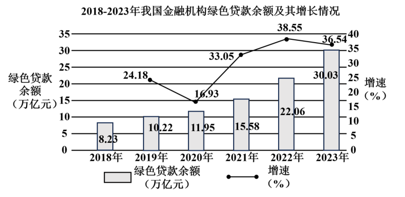
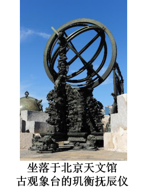

**2024年全省普通高中学业水平等级考试**

**思想政治**

**注意事项：**

**1．答卷前，考生务必将自己的姓名、考生号等填写在答题卡和试卷指定位置。**

**2．回答选择题时，选出每小题答案后，用铅笔把答题卡上对应题目的答案标号涂黑。如需改动，用橡皮擦干净后，再选涂其他答案标号。回答非选择题时，将答案写在答题卡上。写在本试卷上无效。**

**3．考试结束后，将本试卷和答题卡一并交回。**

**一、选择题：本题共15小题，每小题3分，共45分。每小题只有一个选项符合题目要求。**

1\. 新中国成立后，毛泽东提出，“中国应当对于人类有较大的贡献”。新的历史条件下，习近平指出，“只要是对全人类有益的事情，中国就应该义不容辞地做，并且做好”。下列选项能够体现材料主旨的是（ ）

①坚持胸怀天下是中国共产党百年奋斗的重要历史经验

②人类的前途命运应该由世界各国人民来把握和决定

③中国式现代化展现了不同于西方现代化模式的新图景

④吸收借鉴人类文明优秀成果，中国才能更好地赢得未来

A. ①③ B. ①④ C. ②③ D. ②④

2\. 贷款余额是指在某一时间点上银行尚未收回的各类贷款本金总额，反映银行的信贷规模。截至2023年末，中国银行等六大国有银行的绿色贷款余额达17.86万亿元。图是2018-2023年我国金融机构绿色贷款余额及其增长情况。据材料，可以推断出（ ）

①绿色贷款余额增加使市场流动性出现了过剩

②国有银行在绿色信贷领域发挥着主导作用

③金融机构绿色贷款安全性、收益率逐年提高

④企业绿色发展的营商环境不断优化

A. ①② B. ①③ C. ②④ D. ③④

3\. 2023年，山东省搭建黄河大集平台，通过“线上+线下”“文化+旅游+好品+传播”模式，推动优质农产品上网直播销售，以补贴优惠的方式促进品牌产品下乡，让一个个黄河大集“集”得更远、“聚”得更多。搭建黄河大集平台可以（ ）

①拓展农村市场边界，增强生产动力

②畅通城乡经济循环，增加商品供给

③提升全产业链水平，促进产业融合

④形成规模经济效应，降低制度成本

A. ①② B. ①④ C. ②③ D. ③④

4\. 山东某市运用数字化技术打造新型智慧医疗服务体系。激活医疗数据资源，建立基于健康管理的分级诊疗制度；在村卫生室设置“智慧药柜”，村民可随时买到常用药品；组建影像、心电、检验、急救“一张网”，市人民医院与各乡镇卫生院、村卫生室互联互通，实现分散检查、集中诊断、结果共享。建设新型智慧医疗服务体系能够（ ）

①促进医疗资源均衡布局，提高资源配置效率

②完善基层医疗卫生体系，丰富社会保障形式

③推动优质医疗资源下沉，增强基层服务能力

④扩大基本医疗保障范围，减轻群众就医负担

A. ①② B. ①③ C. ②④ D. ③④

5\. 党中央高度重视全国统一大市场建设。为做好相关工作，2023年12月最高人民法院发布了相关典型案例。

|                                                                                                                                               |
|:--------------------------------------------------------------------------------------------------------------------------------------------- |
| 案例是王某向某区市场监督管理局举报称，其购买的某普洱古树茶添加某稀有寄生植物属于食品中违法添加药品行为。该局调查后决定不予立案。王某不服，对该局提起诉讼。区法院经审理认为，该稀有寄生植物在云南本地长期有与普洱茶共同饮用的习惯，也未被纳入相关部门的药品名录，故判决驳回王某的诉讼请求。 |

据材料，下列说法正确的是（ ）

①最高法坚持党的领导，完善保障全国统一大市场的法律体系

②区市场监督管理局规范履行职责，依法接受社会监督和司法监督

③区法院依据事实和法律裁判民事纠纷，支持行政机关严格执法

④最高法通过典型案例为审判机关提供示范指引，维护市场秩序

A. ①③ B. ①④ C. ②③ D. ②④

6\. 近年来，我国不断加强未成年人网络保护工作

<table style="width:100%;">
<colgroup>
<col style="width: 99%" />
</colgroup>
<tbody>
<tr>
<td style="text-align: left;">
2023年国务院公布的《未成年人网络保护条例》规定，“地方各级人民政府和县级以上有关部门违反本条例规定，不履行未成年人网络保护职责的，由其上级机关责令改正”。

2024年西藏自治区人大常委会新修订的《西藏自治区实施<中华人民共和国未成年人保护法>办法》（简称《实施办法》）规定，网信、公安等部门“监督网络产品和服务提供者履行预防未成年人沉迷网络的义务”。
</td>
</tr>
</tbody>
</table>

据材料，下列推断正确的是（ ）

①西藏自治区人民政府可以通过制定行政法规贯彻国务院相关规定

②《实施办法》为西藏自治区自治机关行使检察权提供了法律依据

③网络服务提供者应依据法律规范加强自我管理以保障未成年人合法权益

④地方各级人民政府在未成年人网络保护工作中对同级人大和上级人民政府负责

A. ①② B. ①③ C. ②④ D. ③④

7\. 消除贫困是人类共同的理想。“一带一路”倡议提出以来，在南南合作框架下，中国已同140多个国家和地区开展农业合作，帮助多个非洲国家建设农业发展与减贫示范村。2023年第二届非洲粮食峰会上，34位非洲国家领导人共商农业转型和粮食生产计划。材料表明（ ）

①发展中国家团结合作推动全球粮农治理的意愿不断增强

②非洲国家的集团优势地位使其具有广泛的国际影响力

③中国积极推动增加非洲国家在全球经济事务中的发言权

④非洲粮食峰会为地区国家可持续发展搭建交流合作平台

A. ①② B. ①④ C. ②③ D. ③④

8\. 核电是减碳降污的重要贡献者。中国政府提出，到2025年核电装机容量达到7000万千瓦。法国总统宣布重振核电计划后，国民议会通过了《加速核能发展法案》。2023年12月，第28届联合国气候变化大会发布了和平发展核能的联合宣言、提出到2050年全球核电规模突破11亿千瓦。材料表明（ ）

①气候变化大会以多边主义推动防扩散领域共同安全

②法国国民议会执行总统令以立法保障核电计划实施

③各国在能源战略中拥有自主选择清洁能源的权利

④和平安全利用核能有助于全球能源绿色低碳转型

A. ①② B. ①③ C. ②④ D. ③④

9\. 玑衡抚辰仪由十八世纪在华任职的欧洲学者主持设计，是中国古代传统仪器制度与西方计量刻度的完美结合。2024年初，中国驻斯洛文尼亚大使馆与北京天文馆合作，利用3D技术制作了玑衡抚辰仪一比一复制品，并赠送给设计者的家乡--斯洛文尼亚。下列理解正确的是（ ）

①融合中西方科技的玑衡抚辰仪诠释了“和实生物”的理念

②玑衡抚辰仪及其复制品是通过实践创造出来的客观实在

③“中西合璧”设计思路创新了“天人合一”思想的内涵

④赠送复制品传递着中国“尚和合、求大同”的价值追求

A. ①③ B. ①④ C. ②③ D. ②④

10\. 2024年，浙江安吉、福建平潭等地旅游市场表现亮眼，彰显出县域小城文旅的巨大潜力。梳理这些“表现亮眼”之地发现，这些地方都凸显出“底蕴”“个性化”“性价比”三个关键词。从哲学上看，探索县域小城文旅火热的“密码”，是因为（ ）

①矛盾的普遍性寓于特殊性之中，把握矛盾的普遍性可以指导具体实践

②本质通过现象表现出来，透过现象抓住本质是认识的根本目的

③借助抽象思维获得理性认识，能够揭示事物自身规律性

④只有从实际出发，才能把不同事物的矛盾区分开来

A. ①③ B. ①④ C. ②③ D. ②④

11\. 1979年，互花米草作为保滩护堤的“卫士”引入我国，对固滩、消浪起到一定作用。然而，互花米草繁殖力强，抢占了盐地碱蓬、海草床等的生存空间；根系发达，将底栖生物困死其中。鸟儿因无处觅食而飞走。2022年，我国启动全国范围内互花米草的防治专项行动。从引入到防治，说明（ ）

①从量的积累到质的转变是事物发展的必然趋势

②把握事物联系的多样性才能正确认识事物

③认识受着客观过程的发展及其表现程度的限制

④真理要经过认识、实践、再认识的多次反复才能获得

A. ①② B. ①④ C. ②③ D. ③④

12\. 《中华人民共和国爱国主义教育法》自2024年1月1日起施行。

<table style="width:100%;">
<colgroup>
<col style="width: 99%" />
</colgroup>
<tbody>
<tr>
<td style="text-align: left;">
第三十七条，任何公民和组织……不得有下列行为：……

（二）歪曲、丑化、亵渎、否定英雄烈士事迹和精神；……

（四）侵占、破坏、污损爱国主义教育设施；……

第三十八条教育、文化和旅游……等部门应当按照法定职责，对违反本法第三十七条规定的行为及时予以制止，……并依照有关法律、行政法规的规定予以处罚。……
</td>
</tr>
</tbody>
</table>

根据以上法条，下列判断或推理正确的是（ ）

①“有第三十七条第二款行为”是“适用第三十八条”的充分不必要条件

②甲因违反第三十七条第四款受到处罚：甲没有污损爱国主义教育设施的行为，所以甲有侵占和破坏爱国主义教育设施的行为

③如果第三十八条未适用于甲，那么说明甲没有第三十七条第四款的行为

④除非有第三十七条第二款行为，否则不能适用第三十八条

A. ①② B. ①③ C. ②④ D. ③④

13\. 古代有一种“欹器”，呈梭形，以绳穿之，悬于两杆之间。当里面空着时，器皿是斜的；注水至六分时，竖直而立；水逾七分，则发生倾覆。正所谓，“虚则欹、中则正、满则覆”。厨师恰当把握火候，才能烹饪出美味佳肴。医生准确把握剂量，才能让药品发挥效用。在工作中把握好“度”，才能掌握主动、取得实效。下列判断正确的是（ ）

①探求注水量与欹器状态之间的因果联系运用了求异法

②从把握火候、把握剂量到把握好“度”的推理属于或然推理

③“中则正”说明维持事物质的稳定性需要把持有度

④从事物个性中抽取“度”的共性，上升到了思维具体

A. ①③ B. ①④ C. ②③ D. ②④

14\. 小张经其妻小陈同意，用婚后继承自张父的40万元遗产注册成立了甲公司。为购入公司经营所需设备，小张、小陈又向葛某借款100万元。后小张受伤住院，小陈接手甲公司经营，与小张协商将自家住房抵押给葛某，换取葛某同意延期还款。下列说法正确的是（ ）

①若小张和小陈约定由小张负责还款，则葛某仍有权要求小陈偿还

②小陈不是张父的法定继承人，所以不享有处理40万元遗产的权利

③葛某有权针对小张、小陈的住房和购入设备优先受偿，但无权予以占有

④若甲公司对外负债，则该债务不构成小张和小陈的夫妻共同债务

A. ①② B. ①④ C. ②③ D. ③④

15\. 甲公司发布的新款榨汁机广告称：任何在公司网站下单者若证明其他商家的同类产品更便宜，均“全额退差价”。白某下单后发现乙公司同类榨汁机的售价要便宜50元，甲公司仅赠白某50元优惠券。白某在社交账号发帖“@”甲公司，称“受骗了”并配榨汁机照片。白某的数十万粉丝以为该产品有质量问题，到处转发，导致甲公司口碑大跌。下列说法正确的是（ ）

①甲公司实施了虚假或引人误解的商业宣传，违反了反不正当竞争法的规定

②无论甲公司在白某的订单中是否承诺过全额退差价，其行为都不构成违约

③即使白某发帖意在表达对“全额退差价”广告的真实感受，仍可能构成侵权

④白某粉丝未尽合理核实义务即诋毁甲公司产品，侵犯了甲公司的荣誉权

A. ①③ B. ①④ C. ②③ D. ②④

**二、非选择题，本题共4小题，共55分。**

16\. 甲社区准备逐步开展嵌入式服务设施建设。以下是该社区工作人员查询的部分政策、案例。

材料一 【相关政策】国家发展改革委发布的《城市社区嵌入式服务设施建设工程实施方案》提出，在城市社区（小区）嵌入养老托育、社区助餐等功能性设施和适配性服务，推动优质普惠公共服务下基层、进社区；按照精准化、规模化、市场化原则，优先和重点提供急需紧缺服务。

材料二 【乙社区案例的部分举措】

<table style="width:100%;">
<colgroup>
<col style="width: 99%" />
</colgroup>
<tbody>
<tr>
<td style="text-align: left;">
拓展设施建设场地空间

★居民搬迁并放弃房屋产权的，按政策给予征用补偿；

★居民房屋空置不使用的，可选择将房屋出租给服务运营企业。

合理布局社区服务设施

★盘活利用搬迁腾退的房屋，部分用于建设健康服务、养老托育等民生设施，部分用于引入体育健身、文化休闲等文化业态。

实施可持续的运营管理

★服务运营企业根据服务成本、合理利润等提供价格普惠的社区服务；

★服务运营企业与居民签署公约，内容包括夜间避免噪声、轮流打扫公共卫生等。
</td>
</tr>
</tbody>
</table>

（1）结合材料一，运用超前思维的方法，分析甲社区在开展嵌入式服务设施建设前应如何确定本社区的急需紧缺服务。

（2）结合材料，运用政治与法治、法律与生活知识，阐明甲社区在推进嵌入式服务设施建设过程中应如何处理好社区、居民、服务运营企业之间的关系。

17\. 我国积极实施标准化战略。一方面，对标国际先进水平，引进转化先进适用的国际标准；另一方面，加强我国重点领域标准的外文编译，让世界更多了解中国标准。

材料一 目前，以标准、合格评定等为主要内容的技术性贸易措施影响全球80%的贸易活动，但我国主导制定的国际标准仅占国际标准总数的2%左右。由于世界经济复苏乏力，外需放缓，导致一些外贸企业“出口转内销”需求强烈；我国经济发展势头强劲，一些具有竞争力的内贸企业“走出去”意愿不断增强。要实现内外贸“两条腿”走路，企业就需要面对产品适用国内国际标准的差异。

材料二 高质量专利技术标准化是国际大型企业占领国际市场最有效的措施。我国是全球新一代汽车专利布局数量最多的国家，但被用于标准的高价值专利相对较少，不到全球十分之一。

有观点认为，我国企业应采用国际标准以提升自身竞争力。结合材料，运用经济与社会、当代国际政治与经济知识，对该观点进行评析。

18\. 法治护航乡村振兴。

某市法院组织巡回宣讲团走进乡村振兴大讲堂，宣讲涉农典型案例。

【案情事实】

柏马村是远近闻名的“柠檬之乡”。村民赵某将承包地的经营权流转给甲农药公司，约定用于建造仓库。后主管部门认定该仓库违法占用永久基本农田，应予拆除。在拆除过程中，甲公司不慎损坏了农药储存罐，导致全村大片承包地被污染。

事件发生后，柏马村当年的柠檬严重减产，采摘后虽经检验合格，但仍然滞销。村委会鼓励村民使用本村注册的集体商标“柏马柠檬”打开销路，结果发现多数购买者分不清“柏马柠檬”与乙公司使用的未注册商标“佰马柠檬”。

柏马村村委会起诉乙公司，要求停止侵权。乙公司称，“佰马柠檬”用于柠檬冻干片，而“柏马柠檬”仅用于鲜果，互不相干。

卢某等村民起诉甲公司，要求赔偿柠檬减产的损失、清除土地污染。甲公司未进行举证，但认为现有案情事实不足以证明柠檬减产系因自己的过错造成。

【法条链接】

《土地管理法》第三十五条：“永久基本农田经依法划定后，任何单位和个人不得擅自占用或改变其用途。……”

【释法析理】

运用法律与生活知识，回答下列问题并简要说明理由。

（1）赵某与甲公司的土地经营权流转合同是否有效？

（2）法院能否支持柏马村村委会诉讼请求？

（3）甲公司对卢某等人柠檬减产的损失应承担何种责任？

19\. 挺膺担当、逐梦未来。

◆一辈子办成一件事。

习近平勉励年轻研发人员：“我们说大器晚成，大器是什么？就是那些最好的东西、最高精尖的东西，这些东西都不是一下子可以做成的，都要下很大的功夫，甚至要用毕生精力。希望大家立志高远、脚踏实地，一步一步往前走，以十年磨一剑的韧劲，以‘一辈子办成一件事’的执着，成就有价值的人生。”

“杂交水稻之父”袁隆平几十年如一日，一身泥、一身水奋斗在田间，以“一粒种子改变了世界”；被誉为“敦煌的女儿”的樊锦诗，数十年如一日扎根敦煌，为文化遗产的永久保存与永续利用作出重大贡献；在焊工岗位上辛勤工作半个多世纪的艾爱国，不懈奋斗成为焊接领域“领军人”，展现大国工匠风采……

新时代，广大青年选择更多、赛道更宽、天地更广……

（1）“以‘一辈子办成一件事’的执着，成就有价值的人生”，结合材料，运用价值观的知识谈谈你的认识。

◆一代代奋进为中华。

一本《共产党宣言》，一场伟大的革命，将真理的力量注入中华民族的血脉。百余年来，中国共产党高举真理的旗帜，持续推进“中华之崛起”的历史进程。新时代，真理赋予了更为鲜明的时代特色和中国气象，中国道路拥有了更加宏阔深远的历史纵深。

（2）结合材料，综合运用所学知识，以“真理之光与理想之光交相辉映”为主题撰写一篇短评。

要求：①围绕主题，观点明确；②论证充分，逻辑清晰：③学科术语使用规范；④总字数在250字左右。
