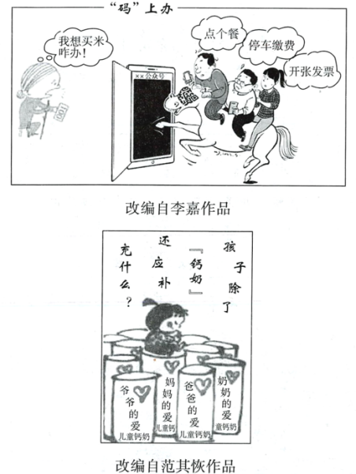
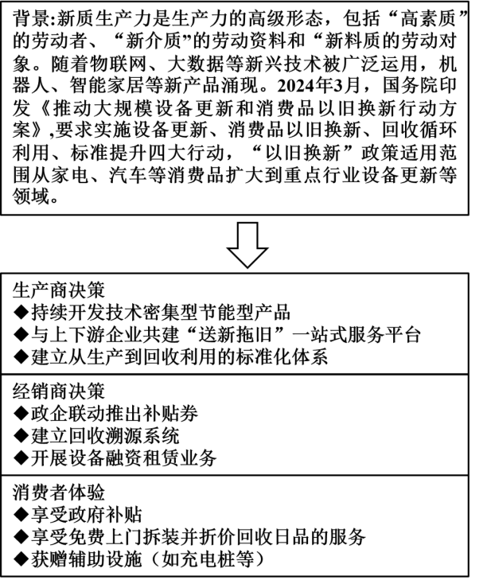

**2024年广东省普通高中学业水平选择性考试**

**政治试题**

**本试卷满分100分，考试时间75分钟**

**一、选择题(本大题共16小题，每小题3分，共48分。在每小题给出的四个选项中，只有一项是最符合题目要求的)。**

1\. 邓小平同志在1979年要求深圳“杀出一条血路来",之后进一步提出“走自己的路”,建设有中国特色的社会主义，强调要“摸着石头过河”。2012年12月，习近平总书记在广东考察时作出“改革已经进入攻坚期和深水区”的重要论断。对此，如下解读正确的是（ ）

①“杀出一条血路来”指明了打破帝国主义封锁的方向

②“走自己的路”指明了我国改革开放的方向

③“摸着石头过河”说明改革伊始就明确了发展蓝图

④“改革已经进入攻坚期和深水区“要求加强全面深化改革的顶层设计

A. ①② B. ①③ C. ②④ D. ③④

2\. 党的二十大报告提出，深入实施人才强国战略，强化现代化建设人才支撑。2023年，中办、国办印发《关于进一步加强青年科技人才培养和使用的若干措施》,强调要激励引导青年科技人才，在以中国式现代化全面推进中华民族伟大复兴的进程中奉献青春和智慧。作出这一举措是因为（ ）

①青年是实现中华民族伟大复兴的先锋力量

②人才越来越成为推动经济社会发展的战略性资源

③人力资源大国优势是实施人才强国战略的决定性因素

④培养高素质人才是全面建设社会主义现代化国家的首要任务

A. ①② B. ①③ C. ②④ D. ③④

3\. 习近平总书记指出：“中国人民历来具有深厚的天下情怀，当代中国文艺要把目光投向世界、投向人类。”“广大文艺工作者要紧跟时代步伐.展现中华历史之美、山河之美、文化之美，抒写中国人民奋斗之志、创造之力、发展之果，全方位全景式展现新时代的精神气象。”以上重要论述表明（ ）

①坚定文化自信是中国特色社会主义最本质的特征

②习近平文化思想要求坚持以人民为中心的创作导向

③面向世界是中国特色社会主义文化发展根本方向

④文艺创作要坚持不忘本来、吸收外来、面向未来相统一

A. ①② B. ①③ C. ②④ D. ③④

4\. 随着无人机广泛应用于地理测绘、影视航拍、山地救援等领域，“联飞快送”“空中观光”等“无人机技术+”业务涌现，低空经济成为发展新引擎。2024年，低空经济首次被写入政府工作报告。国家重视发展低空经济原因是（ ）

①低空运输受自然气候条件的影响小

②中国在低空经济领域具有成本优势

③低空经济的关联产业多，有利于技术集成创新

④低空经济对战略性新兴产业发展有重要推动作用

A. ①② B. ①④ C. ②③ D. ③④

5\. 根据个人养老金制度，开立个人养老金账户并缴费者，个人所得税综合所得汇算清缴时，按年1.2万元限额据实扣除，投资收益暂不征税，退休后领取时减按3%的税率纳税。截至2023年底，试点城市推出储蓄存款、商业养老保险等四类投资产品，吸引5000多万人开户，增强了民众的获得感。从经济逻辑看，该获得感的实现路径（ ）

<table style="width:88%;">
<colgroup>
<col style="width: 15%" />
<col style="width: 71%" />
</colgroup>
<tbody>
<tr>
<td style="text-align: left;">缴费人账户→</td>
<td style="text-align: left;">
①选择购买投资产品→增值部分暂免征税

②限额内列支扣除项→减少当期应纳税所得额→减少当期应纳个人所得税

③退休后提取基本养老金→按优惠税率缴纳个人所得税

④扩大社会保障基金投资→国有资产保值增值→增值部分暂免征税
</td>
</tr>
</tbody>
</table>

A. ①② B. ①③ C. ②④ D. ③④

6\. 2023年12月，中共中央修订《中国共产党纪律处分条例》,要求从严抓好党纪律建设。经党中央同意，自2024年4月至7月，在全党开展党纪学习教育，引导党员干部学纪、知纪、明纪、守纪。深入开展党纪学习教育（ ）

①反映了党要依靠法律管党治党，建设高素质干部队伍

②彰显了党推进自我革命、走好新的赶考之路的决心和意志

③体现了党坚持以纪律建设为统领，不断提高党的建设质量

④有利于解决大党独有难题，保持和巩固党的长期执政地位

A. ①③ B. ①④ C. ②③ D. ②④

7\. 广东某市实施“政协+检察”衔接转化工作模式。2023年该市某区“两会“期间，有政协委员提出关于完善泥头车管理机制的提案，区政协将提案移送区检察院。检察机关就此立案办理行政公益诉讼案件，并邀请政协委员参与现场调查、参加听证会，共同督促相关行政主管部门联合开展泥头车全链条深层次治理。该模式（ ）

①表明检察机关主动接受政协委员的监督和管理

②有利于促进行政机关通过协同治理依法全面履职

③表明人民政协作为国家权力机关依法行使监督权

④有利于实现民主监督和司法监督同向发力、同频共振

A. ①② B. ①③ C. ②④ D. ③④

8\. 高一(2)班同学来到广东某社区新建的议事场所“玻璃屋”,参加社区党支部组织的“阳光温暖话民生”活动，记录如下：

|      |                            |
|:---- |:-------------------------- |
| 参与主体 | 社区党支部、居委会、人大代表、居民代表、民情观察员等 |
| 讨论议题 | 电梯加装纠纷、电动车乱停乱放             |
| 协商成效 | 化解纠纷，规范管理，达成共识             |
| 居民评价 | 玻璃屋成了暖心屋                   |

据此，同学们分享了自己的见解，其中合理的有（ ）

①居民进行利益表达、参与社区公共治理有了新平台

②人大代表密切联系群众，就民生事项积极行使表决权

③居委会坚持为民办实事，主导重塑社区社会治理新格局

④社区党组织发挥战斗堡垒作用，打通服务的“最后一百米”

A. ①③ B. ①④ C. ②③ D. ②④

9\. 清朝时，广西巡抚陈元龙向康熙奏报，“桂林山中产有灵芝，时有祥云覆其上”,并引经据典称“王者慈仁则芝生"。康熙在其奏折上批道：“史册所载祥异甚多，无益于国计民生。地方收成好、家给人足，即是莫大之祥瑞。根据材料，合理的推论是（ ）

①陈元龙奏折犯了客观唯心主义错误

②康熙肯定祥瑞的批语属主观唯心论

③二者价值观重要导向作用的结果迥异

④二者的思想动机均已脱离了社会存在

A. ①② B. ①③ C. ②④ D. ③④

10\. 如图两幅漫画共同蕴含的哲理解读，最贴切的是（ ）

①离开了客观存在，就不可能有意识

②要善于从不同角度思考解决主体的利益需求

③看到了矛盾的普遍性，忽略了矛盾的特殊性

④真理的条件性和具体性表明，真理和谬误往相伴而行

A. ①② B. ①④ C. ②③ D. ③④

11\. 中国名贵古典家具常以黄花梨、紫檀等木材为原料，其结构源于建筑，线条取于书法，气韵近于雕塑，劲势法于武术，格调承于诗赋，历受追捧。假名人之手或经历史事件的洗礼，文化价值就更加凸显，受到收藏界的青睐。由此可见（ ）

①新事物战胜旧事物必须保留旧因素

②实践的目的是不断加深对事物的认识

③价值判断是在社会实践的基础上形成的

④把握联系的多样性对认识事物具有重要意义

A. ①② B. ①③ C. ②④ D. ③④.

12\. 近期，一种融科学精神、人文情怀和思政元素于一体的新型科普活动逐渐兴起：在普及科学知识与方法的同时，讲述科学家不畏艰难、求真求新的故事，弘扬勇于担当、甘于奉献的精神。由此，下列判断正确的是（ ）

①科学知识与人文知识相辅相成，逐渐成为文化的核心

②科学普及与科技创新同等重要，是实现创新发展的关键

③新型科普活动体现了发展社会主义文化的根本目的及要求

④新型科普活动的兴起并未改变科普的根本目标与基本特征

A. ①② B. ①④ C. ②③ D. ③④

13\. 中国加入世界贸易组织(WTO)以来，货物贸易量已跃居全球第一，为世界经济增长作出了突出贡献，并从国际经贸规则的被动接受者和主动接轨者逐步成长为重要参与者。中国秉持人类命运共同体理念，完善细化参与WTO改革的中国方案。这表明（ ）

①中国是WTO改革的发起者和推动者

②中国在国际经贸规则修订中居于主导地位

③中国加入WTO加快了自身发展，也惠及全球

④人类命运共同体理念为中国参与WTO改革提供重要指引

A. ①② B. ①④ C. ②③ D. ③④

14\. 罗某以2000元从蔡某处购买山地自行车一辆，支付1000元后蔡某交付该车，双方约定余款1个月内付清。罗某又以120万元从开发商那里购买商品房一套，办理了房产转移登记，并取得不动产权属证书。据此，下列说法正确的是（ ）

①山地自行车已交付，罗某取得该车所有权

②待余款付清后，罗某才取得该车的所有权

③罗某取得该房所有权和所在地块的建设用地所有权

④罗某取得该房所有权和所在地块的建设用地使用权

A ①③ B. ①④ C. ②③ D. ②④

15\. 甲在A市税务局办理业务时，因办税大厅地面湿滑，不小心摔倒导致骨折。甲诉至法院要求该税务局赔偿，并提交了存储在盘中记录其摔倒的监控录像资料作为证据。法院受理后，要求被告在规定的时间内提出答辩状。关于本案，下列判断正确的是（ ）

①甲向法院提交的证据是电子数据

②甲应当委托律师帮助其进行诉讼

③被告不提交答辩状的，不影响法院审理

④该案以行政机关为被告，属于行政诉讼

A. ①③ B. ①④ C. ②③ D. ②④

16\. 第33届奥运会将于2024年7月在巴黎举行。所有参赛运动员都是优秀运动员，并不是所有参赛运动员都能打破个人最好成绩纪录，但所有参赛运动员都能获得宝贵经验。由此可推断出（ ）(本题设问存在问题，修改为：下列判断一定正确的是（ ）

①所有优秀运动员都能获得宝贵经验

②有些能获得宝贵经验的是优秀运动员

③有些优秀运动员能打破个人最好成绩纪录

④有些优秀运动员不能打破个人最好成绩纪录

A. ①② B. ①③ C. ②④ D. ③④

**二、非选择题(本大题共4小题，共52分)。**

17\. 阅读材料，完成下列要求

备案审查是一项具有中国特色的宪法监督制度。党的二十大报告提出，要完善和加强备案审查制度。2023年12月，全国人大常委会审议通过关于完善和加强备案审查制度的决定，对备案审查工作作出系统全面的规定，并要求各地在2024年内完成省级备案审查制度规范的制定和修改。全国人大常委会还建立了全国统一的备案审查信息平台和国家法律法规数据库，完善了电子备案、在线审查等功能，并推动建设了31个省级法规规章规范性文件数据库。据统计，党的十八大以来，全国人大常委会督促制定机关及时纠正违反宪法法律规定、原则、精神的规范性文件，累计超过2.5万件；共收到公民、组织提出的审查建议2.2万余件。公民、组织提出的审查建议成为开展相关审查工作的主要启动因素。

结合材料并运用《政治与法治》知识，分析全国人大常委会是如何推进备案审查工作的。

18\. 阅读材料，完成下列要求。

材料一

材料二 某企业响应政府号召，开展“以旧换新”活动。张某换购了该企业生产的某款压力锅，使用时该锅发生爆裂，导致其受伤住院治疗。出院后，张某认为自己是严格遵照产品说明书使用的，因此就人身损害要求该企业支付治疗费、交通费、护理费和误工费。该企业认为自身并无过错，不同意承担任何责任。张某遂向人民法院提起诉讼。

（1）有专家认为，此波“以旧换新”将进一步推动新质生产力发展，也是新质生产力推动消费变革的生动写照。结合材料一，运用经济知识，从供给侧或者需求侧的角度(任选一个),对此观点加以分析。

（2）结合材料二，运用《法律与生活》知识回答：该企业认为“无过错不担责”是否成立?张某的各项请求是否有法律依据?请分别说明理由。

19\. 阅读材料，完成下列要求。

高二某学习小组就“聚焦中国故事，探究中国智慧”主题整理了下列材料，并开展讨论：为破解全球发展赤字难题，中国促成国际货币基金组织完成份额和治理机制改革，增加了发展中国家话语权；遵守共同但有区别的责任原则，主动实施一系列应对气候变化的战略、措施和行动。从创设全球发展和南南合作基金、成立国际民间减贫合作网络，到宣布“可持续发展科学卫星1号”数据面向全球开放，并与29个国家和地区签署22个自贸协定，中国为全球发展带来更多新机遇。

另一方面，讲述中国故事、蕴含中国智慧元素的文化产品受到越来越多国家和地区人民的喜爱。《跨越千年，书写繁荣的丝路新画卷》多语种微视频，展现了“丝路精神”薪火相传背景下推动构建利益共同体、命运共同体和责任共同体的生动实践，被多家国外主流媒体转载，覆盖受众4亿多人次。契合青年文化潮流的民间舞蹈“科目三”火热出圈，传到日韩、欧美后掀起中国流行符号的海外模仿秀，形成文化热点事件……可信、可爱、可敬的中国形象日益深入人心。

（1）以“国际传播中如何将‘中国故事'转为'世界故事'”为议题，结合材料并运用文化传承与文化创新的知识，谈谈自己的看法。

（2）结合材料，运用“中国的外交”知识，探究“中国故事”折射出的“中国智慧“。

20\. 阅读材料，完成下列要求。

材料一 以“对话+创作”为基础的生成式人工智能开启了全面智能化时代。人工智能技术驱动的自然语言处理工具，可以像人类一样聊天交流，甚至能完成撰写代码、论文和视频脚本等任务。人工智能技术的突破性发展和加速迭代，引领着新一轮科技革命和产业变革，深刻改变着人类的生产生活，并对人类文明发展和社会进步产生着广泛而深远的影响。

材料二 将人工智能技术融入教学，教师可全方位打造交互式、沉浸式智能课堂，为学生提供更丰富的学习内容和更多元的学习体验。人工智能助教系统为学生提供个性化学习支持、智能评估和反馈，推动学生深入思考，激发学习灵感，提升自主学习和探索能力。人工智能技术的运用正突破传统教育模式，逐步形成“师一机一生”三元教学新形态。

（1）有人认为，人工智能技术的突破性发展和广泛运用，将彻底改变和颠覆人类社会历史的本质。结合材料一，运用相关哲学原理对这一观点进行辨析。

（2）结合材料二，运用辩证分合思维方法，解析“师一机一生”三元教学新形态的形成过程。
