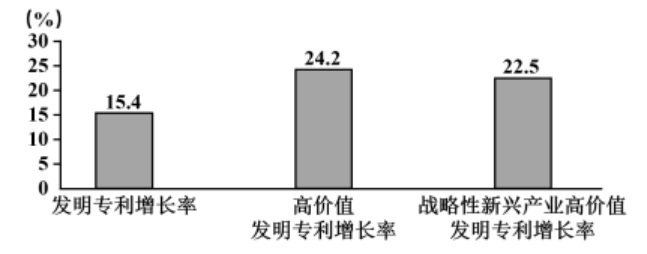

 **2024年普通高中学业水平选择性考试**

**思想政治**

1\. 某班同学在“学习与分享”活动中，围绕习近平总书记的两段重要论述，分享自己的理解。

在五千多年中华文明深厚基础上开辟和发展中国特色社会主义，把马克思主义基本原理同中国具体实际、同中华优秀传统文化相结合是必由之路。

“第二个结合”是又一次思想解放，让我们能够在更广阔的文化空间中，充分运用中华优秀传统文化的宝贵资源，探索面向未来的理论和制度创新。

——习近平在文化传承发展座谈会上的讲话

以下几位同学的分享，最符合论述内容的是（ ）

①坚持“第二个结合”有利于掌握思想和文化主动

②坚持“两个结合”的关键是坚持“第二个结合”

③“两个结合”筑牢了中国特色社会主义道路根基

④坚持“第二个结合”旨在传承和弘扬中华优秀传统文化

A. ①③ B. ①④ C. ②③ D. ②④

2\. 经党中央同意，自2024年4月至7月在全党开展党纪学习教育。各级党组织积极行动，着力在“真”上下功夫，在“严”上做文章，在“实”上用力气，教育引导党员干部把党纪铭刻于心、见诸于行。材料表明，中国共产党（ ）

A. 永葆初心使命，紧紧依靠人民群众推动国家发展

B. 勇于自我革命，深入推进党的建设新的伟大工程

C. 重视理论探索创新，不断加强思想建设和组织建设

D. 发挥战斗堡垒作用，锤炼忠诚干净担当的政治品格

3\. 近年来，国有企业分拆上市的步伐加快。分拆上市既是国有企业拓展融资渠道的有效途径，也是我国培育战略性新兴产业、打造“专精特新”“小巨人”企业的有力工具。由此可见（ ）

A. 国有经济的主导作用得到加强

B. 分拆上市是国有经济活力之源

C. 发展壮大国有经济需要探索新的实现形式

D. 分拆上市不会改变国有企业整体价值估值

4\. 2022年我国专利密集型产业劳动生产率为31.3万元/人，是非专利密集型产业劳动生产率的2.1倍。2023年我国授权发明专利与上一年相比大幅增长（如图所示），专利密集型产业增加值首次突破15万亿

元，占国内生产总值的比重达到12.7%。材料表明（ ）

①科技产出呈现出高质量增长的特征 ②创新引领的现代产业布局不断优化

③产业链供应链一体化水平不断提高 ④技术要素正加速转化为新质生产力

A. ①② B. ①④ C. ②③ D. ③④

5\. 通观中国历史，中华民族始终追求团结统一，并把这看作是“天地之常经，古今之通义”。无论哪个民族建鼎称尊，建立的都是统一的多民族国家。无论哪个民族入主中原，都以统一天下为己任，都把自己建立的王朝视为统多民族国家的正统，这种团结统一的思想既一脉相承，又不断发展，在历史的长河中逐渐成为各民族的共识。材料表明（ ）

①大一统理念逐步清除了我国各民族文化之间的差异

②大一统的历史传统是中华文明突出的统一性的表现

③大一统奠定了中华民族共同体多元一体的基本格局

④我国始终坚持民族平等民族团结和各民族共同繁荣的方针

A. ①② B. ①④ C. ②③ D. ③④

6\. 某市将全过程人民民主贯穿于立法全过程，事前广泛动员，深入普及相关法律；事中搭起平台，让基层意见充分汇集，力求取得不同意见中的“最大公约数”；事后及时反馈，形成民主决策的全链条、全流程的闭环。由此可见，该市（ ）

A. 发展基层民主，保障人民依法享有民主决策权

B. 创新基层自治组织，全链条开展民主立法活动

C. 开展立法协商，拓宽公民有序参与立法的途径

D. 完善地方立法制度，建设完备的法律服务体系

7\. 总体而言，人类早期的城市基本上以内陆型为主，位置多是“远干流，近支流”。这是由于大江大河经常泛滥，干流两岸极易遭受洪水灾害，而支流陆地既临水又防洪，能够保障城市的用水和安全。这表明（ ）

A. 地理环境对人类社会早期发展起着决定性作用

B. 被动适应环境是早期人类社会实践的主要特点

C. 生产力发展是推动城市布局发生变化的根本因素

D. 尊重客观规律是正确发挥主观能动性的前提条件

8\. 在以互动为主要特征的互联网传播时代，要得到“流量”的奖赏，就要在选题、内容上下功夫。创作者只有深入现场，了解用户在想什么、说什么，才能找到与用户感同身受的情感共鸣点，形成合适的选题和内容。这种“沉下去”的创作方式（ ）

A. 以满足用户各种文化需求为创作的导向

B. 强调只有抓住机遇才能赢得主动和优势

C. 坚持运用系统优化方法形成合适选题

D. 遵循了矛盾普遍性与特殊性具体的统一

9\. “随着社会的进一步的发展，法律进一步发展为或多或少广泛的立法。这种立法越复杂，它的表现方式也就越远离社会日常经济生活条件所借以表现的方式。立法就显得好像是一个独立的因素。这个因素似乎不是从经济关系中，而是从自身的内在根据中，可以说，从意志概念中，获得它存在的理由和继续发展的根据。”这一论述认为（ ）

A. 法律发展与经济关系的发展具有不完全同步性

B. 法律可从自身内在根据中获得自身独立的发展

C. 法律制度的发展会推动生产方式的进步和发展

D. 远离经济关系的立法可从社会意识中找到理由

10\. 某博物馆开发出“海丝系列·丝路咖啡”，选取《郑和航海图》中海上丝绸之路沿线港口与城市盛产的优质咖啡豆，精制出不同风味的咖啡，让公众在享用咖啡的同时可以跟随郑和下西洋的航行路线，感受各国历史文化，体验“古今穿越”的愉悦感，这表明（ ）

A 传统文化发展创新提高了文化服务水平

B. 民族文化是民族生存和发展的精神根基

C. 文化创新有利于提升人民群众文明素养

D. 传统文化产业化发展丰富了人们的生活

11\. 近年来，全球化浪潮出现滞缓乃至退缩的境况，世界贸易组织也因其争端解决机制停摆而被认为陷入半瘫痪状态。与此同时，一些在价值观、秩序观等方面比较类似的经济体签署双边或多边协议，在世界上形成不同的类聚群体和相应机制。这种类聚化现象的出现（ ）

A. 促进了全球经济的交流与合作 B. 掩盖了不同价值观国家之间的矛盾

C. 给全球经济治理带来新的挑战 D. 维护了各国特别是发展中国家利益

12\. 全球能源互联网发展合作组织是中国在能源领域发起成立的首个国际组织，其宗旨是推动构建全球能源互联网，以清洁和绿色方式满足全球电力需求。2023年12月，该组织发布报告，提出构建安全、经济、智慧、绿色、开放的现代能源体系，引起广泛关注。由此可见，该组织（ ）

A. 主权独立，这是其存在和发展的法理依据

B. 影响深远，丰富了可持续发展的中国话语

C. 作用重大，负有推动南南合作的主要责任

D. 性质独特，属于世界性、一般性国际组织

13\. 小王路过家新开的手机店，被派发手机广告宣传单的店员拦下，劝说其购买手机。经询问得知，新店开张优惠力度大，小王就手机型号、质量保证、售后服务等内容与店方协商后，支付全款取走手机。回家后，小王为该手机正常充电时，手机爆炸导致受伤，上述案例中（ ）

A. 店员派发的手机广告宣传单属于要约

B. 手机生产商对小王无需承担违约责任

C. 买卖手机产生的民事法律关系客体是手机

D. 手机店对小王承担的是过错推定侵权责任

14\. 应届大学毕业生邱某在应聘某农业公司职位时，人事经理陈某通知邱某来公司面谈，邱某对劳动报酬、试用期、福利待遇等感到满意，双方当即签订书面劳动合同。一周后，邱某开始上班。其后，陈某希望邱某能将闲置农村老宅质押给公司，并将老家的土地经营权流转给公司。根据材料，以下说法正确的是（ ）

①劳动报酬、试用期、福利待遇是劳动合同的必备条款

②自签订书面劳动合同起，邱某与该公司建立劳动关系

③若将闲置的农村老宅质押给公司则违反物权法定原则

④流转农村土地经营权目的在于实现土地的使用价值

A. ①② B. ①③ C. ②④ D. ③④

15\. 《中华人民共和国民法典》规定：“一方利用对方处于危困状态缺乏判断能力等情形，致使民事法律行为成立时显失公平的，受损害方有权请求人民法院或者仲裁机构予以撤销。”从这一规定可以推出（ ）

A. 一方危困状态下签订的合同与显失公平的合同是种属关系

B. 如果民事法律行为不是显失公平的，则不能请求予以撤销

C. 有的仲裁机构裁决予以撤销的民事法律行为是显失公平的

D. 一合同被仲裁机构裁决撤销，因此，该合同是显失公平的

16\. 米开朗基罗的壁画《创世纪》具有预示当地天气变化情况的“特异功能"：如果壁画中人物服饰处的淡红色转变成蓝色，天空就会艳阳高照；反之，如果从蓝色变成淡红色，则预示看可能要下雨。后来人们发现是壁画的颜料中混进了二氧化钴，无水二氯化钴显现为蓝色，而含有结晶水的二氧化钴显现为红色。该认识过程表明（ ）

A. 感性具体是现象和本质的统一体 B. 思维具体无法获得对事物整体的认识

C. 思维抽象能够把握事物整体的本质 D. 认识从现象到本质是辩证否定的过程

17\. 当今世界正处于百年未有之大变局，人类社会面临前所未有的挑战：世界有重新陷入对抗甚至战争的风险；南北差距，发展断层、技术鸿沟等问题更加突出：国际战略竞争日趋激烈，非传统安全挑战上升；世界正面临多重治理危机，全球治理体系亟待改革完善。

某班同学在探究学习活动中发现，面对共同挑战，国际社会存在两种截然不同的选择。同学们用下列关键词进行概括：

|                          |
| ------------------------ |
| 某些大国：弱肉强食；你输我赢；本国优先；集团政治 |
| 中国：公平正义；合作共赢；开放包容；团结协作   |

结合材料，运用《当代国际政治与经济》知识，分析比较两种不同选择的本质区别及影响。

18\. 水是生命之源、生产之要、生态之基，在国家发展中具有举足轻重的战略地位。党的十八大以来，以习近平同志为核心的党中央高度重视水安全问题，明确了“节水优先、空间均衡、系统治理、两手发力”的治水思路。2024年2月23日，国务院通过首部节约用水行政法规《节约用水条例》，自5月1日起施行。

某地坚持水安全治理一体化推进，其举措如下：

结合材料，运用《政治与法治》知识，阐述该地水安全治理一体化推进的重要意义。

19\. 小李是cosplay（扮演成电影、漫画或游戏中的角色）圈的知名扮演者，因高度还原了许多角色

而火爆社交网络。近来，小李发现，有人在某网络平合匿名创建了“该死的小李”贴吧，并聚集了一批人在平台发布各种网暴言论。大量粗鄙低俗的言论，使不知情的网民对小李产生了错误认识，除造成其严重的精神困扰以外，也使其遭受到一定的经济损失。小李联系该平台公司要求其提供侵权人信息，并删除相关言论，平台公司未予处理。为了维护自己的合法权益，小李决定向人民法院起诉。

（1）结合材料，运用《法律与生活》知识，说明小李应如何做好起诉前的必要准备。

（2）被告在法庭辩称，"平台公司对不构成侵权的帖子都是没有删除的，因此，我的帖子是不构成侵权的。”被告的三段论推理中省略的内容是A，其违反的推理规则是B．（请在答题卡A、B处填写适当内容）

20\. 当前，由于诸多因素制约，货币政策利率传导机制还存在一些堵点，影响了货币政策实施效果。某校部分同学搜集相关资料，就“畅通货币政策利率传导机制，促进我国经济高质量发展”进行探究。

【新闻背景】

2023年12月召开的中央经济工作会议强调，必须把坚持高质量发展作为新时代的硬道理，着力提升宏观政策支持高质量发展的效果。2024年3月《政府工作报告》提出，要持续激发和增强社会活力，推动高质量发展取得新的更大成效。稳健的货币政策要灵活适度、精准有效，畅通货币政策传导机制，避免资金沉淀空转。

【名词解释】

货币政策利率传导机制是货币政策传导机制的重要内容，其传导机制为：货币供给量→利率投资→国民收入，即中央银行通过调节货币供给量以影响利率水平，进而影响投资，最终导致国民收入发生变动。

结合材料，运用《经济与社会》知识，说明应如何畅通货币政策利率传导机制以促进我国经济高质量发展。

21\. 科技是发展的利器，也可能成为风险的源头。作为一项试图改造人类自身、增强人类能力的新兴生命技术，基因编辑、辅助生殖、生命延展等人类增强技术在造福人类的同时，也带来了一系列的风险和不确定性。如何在技术发展中找到一剂既不至于承担较大风险又可以汲取技术福利的良方，是当前新兴生命技术发展的核心问题。

有学者提出要以“负责任停滞”的创新范式发展人类增强技术。这一范式主张在道德责任的约束下，放缓或暂停不可预见和可能带来危险后果的创新活动，待其融入社会的效果扩散和呈现后，进行更加准确的风险评估，对技术加以改进和完善。“停滞”不是停止创新的步伐，而是要给人类增强技术发展系上“安全带”，让人类增强技术得到更为妥善的应用。

某班同学围绕“人类增强技术：不确定的未来与负责任停滞”展开讨论。请结合上述材料，以“审慎对待人类增强技术”为主题写一篇短文。

要求：①运用辩证唯物主义认识论相关知识。②紧扣主题，逻辑清晰，结构合理。③学科术语使用规范，字数260字左右；不得出现个人信息。
