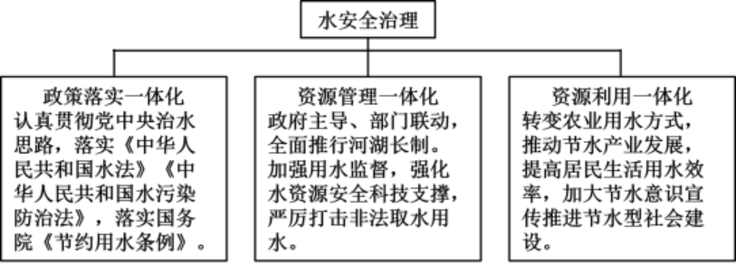

 **2024年普通高中学业水平选择性考试**

**思想政治**

1\. 某班同学在“学习与分享”活动中，围绕习近平总书记的两段重要论述，分享自己的理解。

在五千多年中华文明深厚基础上开辟和发展中国特色社会主义，把马克思主义基本原理同中国具体实际、同中华优秀传统文化相结合是必由之路。

“第二个结合”是又一次的思想解放，让我们能够在更广阔的文化空间中，充分运用中华优秀传统文化的宝贵资源，探索面向未来的理论和制度创新。

——习近平在文化传承发展座谈会上的讲话

以下几位同学的分享，最符合论述内容的是（ ）

①坚持“第二个结合”有利于掌握思想和文化主动

②坚持“两个结合”的关键是坚持“第二个结合”

③“两个结合”筑牢了中国特色社会主义道路根基

④坚持“第二个结合”旨在传承和弘扬中华优秀传统文化

A. ①③ B. ①④ C. ②③ D. ②④

【答案】A

【解析】

【详解】①④：“第二个结合”是又一次的思想解放，让我们能够在更广阔的文化空间中，充分运用中华优秀传统文化的宝贵资源，探索面向未来的理论和制度创新。这说明坚持“第二个结合”有利于掌握思想和文化主动，而不是为了传承和弘扬中华优秀传统文化，①正确，④排除。

②：把马克思主义基本原理同中国具体实际、同中华优秀传统文化相结合，“两个结合”都很重要，不能理解为关键是坚持“第二个结合”，②错误。

③：在五千多年中华文明深厚基础上开辟和发展中国特色社会主义，把马克思主义基本原理同中国具体实际、同中华优秀传统文化相结合是必由之路。这说明“两个结合”筑牢了中国特色社会主义道路根基，③正确。

故本题选A。

【点睛】

2\. 经党中央同意，自2024年4月至7月在全党开展党纪学习教育。各级党组织积极行动，着力在“真”上下功夫，在“严”上做文章，在“实”上用力气，教育引导党员干部把党纪铭刻于心、见诸于行。材料

表明，中国共产党（ ）

A. 永葆初心使命，紧紧依靠人民群众推动国家发展

B. 勇于自我革命，深入推进党的建设新的伟大工程

C. 重视理论探索创新，不断加强思想建设和组织建设

D. 发挥战斗堡垒作用，锤炼忠诚干净担当的政治品格

【答案】B

【解析】

【详解】B：材料中提到的“在全党开展党纪学习教育”、“着力在‘真’上下功夫，在‘严’上做文章，在‘实’上用力气”等内容，表明中国共产党在不断加强自身建设，勇于自我革命，深入推进党的建设新的伟大工程。故B正确。

AC：材料强调的是中国共产党不断加强自身建设，不涉及依靠人民群众推动国家发展以及重视理论探索创新，故AC排除。

D：发挥党员先锋模范作用和基层党组织的战斗堡垒作用，故D排除。

故本题选B。

3\. 近年来，国有企业分拆上市的步伐加快。分拆上市既是国有企业拓展融资渠道的有效途径，也是我国培育战略性新兴产业、打造“专精特新”“小巨人”企业的有力工具。由此可见（ ）

A. 国有经济的主导作用得到加强

B. 分拆上市是国有经济活力之源

C. 发展壮大国有经济需要探索新的实现形式

D. 分拆上市不会改变国有企业整体价值估值

【答案】C

【解析】

【详解】C：国有企业分拆上市是拓展融资渠道和培育新兴产业的有效途径，也是我国培育战略性新兴产业、打造“专精特新”“小巨人”企业的有力工具。这表明国有企业在探索新的实现形式以发展壮大国有经济，故C正确。

A：国有经济的主导作用主要体现在控制力上，即体现在控制国民经济发展方向、控制经济运行的整体态势、控制重要稀缺资源的能力上。在关系国民经济命脉的重要行业和关键领域，国有经济必须占支配地位。材料未体现国有经济的主导作用得到加强，故A排除。

B：分拆上市能够促进国有经济发展，但不是国有经济活力之源，故B排除。

D：一个企业如果业务模块比较多，通过分拆上市相当于分开估值，可能会提高企业估值。因此，分拆

上市会改变国有企业整体价值估值，故D错误。

故本题选C

4\. 2022年我国专利密集型产业劳动生产率为31.3万元/人，是非专利密集型产业劳动生产率的2.1倍。2023年我国授权发明专利与上一年相比大幅增长（如图所示），专利密集型产业增加值首次突破15万亿元，占国内生产总值的比重达到12.7%。材料表明（ ）

①科技产出呈现出高质量增长的特征 ②创新引领的现代产业布局不断优化

③产业链供应链一体化水平不断提高 ④技术要素正加速转化为新质生产力

A. ①② B. ①④ C. ②③ D. ③④

【答案】B

【解析】

【详解】①④：材料强调近年我国专利密集型产业劳动生产率有较大幅度的提高，专利密集型产业增加值占国内生产总值的比重也有了较大幅度的提高，这说明我国科技产出呈现出高质量增长的特征，技术要素正加速转化为新质生产力，①④符合题意。

②：材料只是强调近年我国专利密集型产业劳动生产率有较大幅度的提高，专利密集型产业增加值占国内生产总值的比重也有了较大幅度的提高，没有提到“创新引领的现代产业布局不断优化”，②排除。

③：材料只是强调近年我国专利密集型产业劳动生产率有较大幅度的提高，专利密集型产业增加值占国内生产总值的比重也有了较大幅度的提高，没有提到“产业链供应链一体化水平不断提高”，③排除。

故本题选B。

5\. 通观中国历史，中华民族始终追求团结统一，并把这看作是“天地之常经，古今之通义”。无论哪个民族建鼎称尊，建立的都是统一的多民族国家。无论哪个民族入主中原，都以统一天下为己任，都把自己建立的王朝视为统多民族国家的正统，这种团结统一的思想既一脉相承，又不断发展，在历史的长河中逐渐成为各民族的共识。材料表明（ ）

①大一统理念逐步清除了我国各民族文化之间的差异

②大一统的历史传统是中华文明突出的统一性的表现

③大一统奠定了中华民族共同体多元一体的基本格局

④我国始终坚持民族平等民族团结和各民族共同繁荣的方针

A. ①② B. ①④ C. ②③ D. ③④

【答案】C

【解析】

【详解】①：大一统理念有利于实现国家统一和民族团结，但不能清除我国各民族文化之间的差异，各民族文化之间的差异是客观存在的，①错误。

②：通观中国历史，中华民族始终追求团结统一，并把这看作是“天地之常经，古今之通义”。这说明大一统的历史传统是中华文明突出的统一性的表现，②正确。

③：这种团结统一的思想既一脉相承，又不断发展，在历史的长河中逐渐成为各民族的共识。这说明大一统奠定了中华民族共同体多元一体的基本格局，③正确。

④：新中国成立后，我国形成了新型民族关系，始终坚持民族平等、民族团结和各民族共同繁荣的方针，且材料没有体现平等和繁荣，排除④。

故本题选C。

6\. 某市将全过程人民民主贯穿于立法全过程，事前广泛动员，深入普及相关法律；事中搭起平台，让基层意见充分汇集，力求取得不同意见中的“最大公约数”；事后及时反馈，形成民主决策的全链条、全流程的闭环。由此可见，该市（ ）

A. 发展基层民主，保障人民依法享有民主决策权

B. 创新基层自治组织，全链条开展民主立法活动

C. 开展立法协商，拓宽公民有序参与立法的途径

D. 完善地方立法制度，建设完备的法律服务体系

【答案】C

【解析】

【详解】C：某市在立法过程中，通过广泛动员、搭建平台、汇集意见、及时反馈等环节，形成了全过程人民民主的闭环。可见，该市开展立法协商，拓宽公民有序参与立法的途径，故C正确。

A：公民具有表达权，可以参与民主决策，但是没有决策权，故A错误。

B：我国基层自治组织是村委会和居委会，因此创新基层自治组织说法错误，且材料强调的是开展立法协商，不涉及基层自治，故B排除。

D：材料强调的是立法协商，不涉及完善地方立法制度，建设完备的法律服务体系，故D排除。

故本题选C。

7\. 总体而言，人类早期的城市基本上以内陆型为主，位置多是“远干流，近支流”。这是由于大江大河经常泛滥，干流两岸极易遭受洪水灾害，而支流陆地既临水又防洪，能够保障城市的用水和安全。这表明（ ）

A. 地理环境对人类社会早期发展起着决定性作用

B. 被动适应环境是早期人类社会实践的主要特点

C. 生产力发展是推动城市布局发生变化的根本因素

D. 尊重客观规律是正确发挥主观能动性的前提条件

【答案】D

【解析】

【详解】A：地理环境是客观因素，不能说其对人类社会早期发展起着决定性作用，A排除。

B：人类早期城市的选址体现了早期人类在主动适应环境，B排除。

C：材料中未体现生产力的发展与城市发展的关系，C排除。

D：由于大江大河经常泛滥，干流两岸极易遭受洪水灾害，而支流陆地既临水又防洪，能够保障城市的用水和安全，所以人类早期的城市基本上以内陆型为主，位置多是“远干流，近支流”。这体现了正确发挥主观能动性要以尊重客观规律为前提条件，D符合题意。

故本题选D。

8\. 在以互动为主要特征的互联网传播时代，要得到“流量”的奖赏，就要在选题、内容上下功夫。创作者只有深入现场，了解用户在想什么、说什么，才能找到与用户感同身受的情感共鸣点，形成合适的选题和内容。这种“沉下去”的创作方式（ ）

A. 以满足用户各种文化需求为创作的导向

B. 强调只有抓住机遇才能赢得主动和优势

C. 坚持运用系统优化方法形成合适的选题

D. 遵循了矛盾普遍性与特殊性具体的统一

【答案】D

【解析】

【详解】A：文化创作应满足人民群众的文化需求，而不是满足用户各种文化需求，A错误。

BC：材料强调的是要在选题、内容上下功夫，深入现场才能找到与用户感同身受的情感共鸣点，没有体现抓住机遇才能赢得主动和优势，也不涉及运用系统优化方法，BC不合题意。

D：创作者只有深入现场，了解用户在想什么、说什么，才能找到与用户感同身受的情感共鸣点，形成会

适的选题和内容。这种“沉下去”的创作方式遵循了矛盾普遍性与特殊性具体的统一，D正确。

故本题选D。

【点睛】

9\. “随着社会的进一步的发展，法律进一步发展为或多或少广泛的立法。这种立法越复杂，它的表现方式也就越远离社会日常经济生活条件所借以表现的方式。立法就显得好像是一个独立的因素。这个因素似乎不是从经济关系中，而是从自身的内在根据中，可以说，从意志概念中，获得它存在的理由和继续发展的根据。”这一论述认为（ ）

A. 法律发展与经济关系的发展具有不完全同步性

B. 法律可从自身内在根据中获得自身独立的发展

C. 法律制度的发展会推动生产方式的进步和发展

D. 远离经济关系的立法可从社会意识中找到理由

【答案】B

【解析】

【详解】A：材料强调的是立法可从自身因素获得发展，未强调法律发展与经济发展的关系，A不选。

B：材料强调立法这个独立的因素是从自身的内在根据中获得发展的，B正确。

C：题干并未提及法律制度的发展对生产方式进步和发展的推动作用，C不选。

D：远离经济关系的立法并非从社会意识中找到理由，而是强调其与经济关系的不完全同步，D不选。

故本题选B。

10\. 某博物馆开发出“海丝系列·丝路咖啡”，选取《郑和航海图》中海上丝绸之路沿线港口与城市盛产的优质咖啡豆，精制出不同风味的咖啡，让公众在享用咖啡的同时可以跟随郑和下西洋的航行路线，感受各国历史文化，体验“古今穿越”的愉悦感，这表明（ ）

A. 传统文化发展创新提高了文化服务水平

B. 民族文化是民族生存和发展的精神根基

C. 文化创新有利于提升人民群众文明素养

D. 传统文化产业化发展丰富了人们的生活

【答案】A

【解析】

【详解】A：某博物馆开发出“海丝系列·丝路咖啡”，此创新之举，让公众在享用咖啡的同时可以跟随郑和下西洋的航行路线，感受各国历史文化，体验“古今穿越”的愉悦感，这体现了传统文化发展创新有利

于提高文化服务水平，A符合题意。

B：材料强调的是某博物馆开发出“海丝系列·丝路咖啡”，实现了在对传统文化发展创新基础上提高了文化服务水平，并不是强调“民族文化是民族生存和发展的精神根基”，B排除。

C：材料强调某博物馆开发出“海丝系列·丝路咖啡”，精制出不同风味的咖啡，让公众感受各国历史文化，这并不涉及文化创新对人民群众文明素养的作用，C排除。

D：材料不涉及传统文化产业化，D排除。

故本题选A。

11\. 近年来，全球化浪潮出现滞缓乃至退缩的境况，世界贸易组织也因其争端解决机制停摆而被认为陷入半瘫痪状态。与此同时，一些在价值观、秩序观等方面比较类似的经济体签署双边或多边协议，在世界上形成不同的类聚群体和相应机制。这种类聚化现象的出现（ ）

A. 促进了全球经济的交流与合作 B. 掩盖了不同价值观国家之间的矛盾

C. 给全球经济治理带来新的挑战 D. 维护了各国特别是发展中国家利益

【答案】C

【解析】

【详解】A：一些在价值观、秩序观等方面比较类似的经济体签署双边或多边协议，可能导致全球经济治理的复杂化和分裂，不一定会促进全球经济的交流与合作，A错误。

B：个别国家签署双边或多边协议都是基于自身国家利益，这种类聚化现象并没有掩盖不同价值观国家之间的矛盾，反而可能加剧这些矛盾，B错误。

C：类聚化现象可能会给全球经济治理带来新的挑战，因为不同的类聚群体可能会有不同的规则和标准，C正确。

D：类聚化现象并不一定维护了各国特别是发展中国家的利益，反而可能使得一些国家被排除在外，D排除。

故本题选C。

【点睛】

12\. 全球能源互联网发展合作组织是中国在能源领域发起成立的首个国际组织，其宗旨是推动构建全球能源互联网，以清洁和绿色方式满足全球电力需求。2023年12月，该组织发布报告，提出构建安全、经济、智慧、绿色、开放的现代能源体系，引起广泛关注。由此可见，该组织（ ）

A. 主权独立，这是其存在和发展的法理依据

B. 影响深远，丰富了可持续发展中国话语

C. 作用重大，负有推动南南合作的主要责任

D. 性质独特，属于世界性、一般性国际组织

【答案】B

【解析】

【详解】A：主权是主权国家最主要的要素，而全球能源互联网发展合作组织属于国际组织，不存在主权独立的问题，A不符合题意；

B：中国在能源领域发起成立的首个国际组织，以“推动构建全球能源互联网，以清洁和绿色方式满足全球电力需求”为宗旨，致力于“构建安全、经济、智慧、绿色、开放的现代能源体系”，这意味着全球能源互联网发展合作组织的成立影响深远，丰富了可持续发展的中国话语，B符合题意；

C：全球能源互联网发展合作组织满足全球电力需求，这说明该组织并不是负有推动南南合作的主要责任，C不符合题意；

D：全球能源互联网发展合作组织是中国在能源领域发起成立的首个国际组织，其宗旨是推动构建全球能源互联网，以清洁和绿色方式满足全球电力需求，并致力于构建现代能源体系，这意味着全球能源互联网发展合作组织属于专门性国际组织，而非一般性国际组织，D不符合题意；

故选B。

13\. 小王路过家新开的手机店，被派发手机广告宣传单的店员拦下，劝说其购买手机。经询问得知，新店开张优惠力度大，小王就手机型号、质量保证、售后服务等内容与店方协商后，支付全款取走手机。回家后，小王为该手机正常充电时，手机爆炸导致受伤，上述案例中（ ）

A. 店员派发的手机广告宣传单属于要约

B. 手机生产商对小王无需承担违约责任

C. 买卖手机产生的民事法律关系客体是手机

D. 手机店对小王承担的是过错推定侵权责任

【答案】B

【解析】

【详解】A‌：手机广告宣传单不一定属于要约‌，其性质取决于宣传单的内容是否具体明确，以及是否体现了商家与广大公众订立买卖合同的意愿。如果手机广告宣传单的内容具体明确，体现了商家与公众订立合同的意愿，则该宣传单可能会被视为要约。反之，如果宣传单没有体现出与消费者订立合同的意思表示，只是向消费者进行宣传商品，则视为要约邀请，故A排除。

B：小王是在手机店购买的手机，因此，小王与手机店二者构成了买卖合同关系，可见，手机生产商对小王无需承担违约责任，故B正确。

C：买卖手机产生的民事法律关系客体是小王购买手机的行为，C错误。

D：依据我国《中华人民共和国民法典》的明确规范，生产商与销售商对其所制造或售出的产品因存在瑕疵而引发的他人损害承担无过失责任，即不论生产商及销售商是否在主观方面存在过错，只需其所制造或售出的产品造成了实质性的伤害，便须对此负起相应的法律责任。可见，手机店对小王承担的是无过错侵权责任，而不是过错推定侵权责任，故D排除。

故本题选B。

14\. 应届大学毕业生邱某在应聘某农业公司职位时，人事经理陈某通知邱某来公司面谈，邱某对劳动报酬、试用期、福利待遇等感到满意，双方当即签订书面劳动合同。一周后，邱某开始上班。其后，陈某希望邱某能将闲置的农村老宅质押给公司，并将老家的土地经营权流转给公司。根据材料，以下说法正确的是（ ）

①劳动报酬、试用期、福利待遇是劳动合同的必备条款

②自签订书面劳动合同起，邱某与该公司建立劳动关系

③若将闲置的农村老宅质押给公司则违反物权法定原则

④流转农村土地经营权的目的在于实现土地的使用价值

A. ①② B. ①③ C. ②④ D. ③④

【答案】D

【解析】

【详解】①：必备条款是任何劳动合同必须具备的条款，主要包括：劳动合同期限，工作内容和工作地点，工作时间和休息休假，劳动报酬，社会保险，劳动保护、劳动条件和职业危害防护，等等。试用期、福利待遇属于可备条款，①错误。

②：劳动合同是劳动者与用人单位确立劳动关系、明确双方权利和义务的协议。用人单位与劳动者在用工前订立劳动合同的，劳动关系自用工之日起建立，②错误。

③：物权法定原则要求，物权的种类和内容必须由法律规定，不得任意创设。若将闲置的农村老宅质押给公司则违反物权法定原则，③正确。

④：用益物权对应的是物的使用价值，流转农村土地经营权的目的在于实现土地的使用价值，④正确。

故本题选D。

15\. 《中华人民共和国民法典》规定：“一方利用对方处于危困状态缺乏判断能力等情形，致使民事法律行为成立时显失公平的，受损害方有权请求人民法院或者仲裁机构予以撤销。”从这一规定可以推出（ ）

A. 一方危困状态下签订的合同与显失公平的合同是种属关系

B. 如果民事法律行为不是显失公平的，则不能请求予以撤销

C. 有的仲裁机构裁决予以撤销的民事法律行为是显失公平的

D. 一合同被仲裁机构裁决撤销，因此，该合同是显失公平

【答案】C

【解析】

【详解】A：属种关系或者种属关系是一个概念的外延包含着另一个概念的全部外延，外延小的概念为种概念，外延大的概念为属概念。危困状态下签订的合同不一定是显失公平的合同，因此，二者之间不是种属关系，A错误。

B：题干中的法律规定是一个充分条件假言判断，依据此判断进行的推理是充分条件假言推理，其有效式是肯定前件式和否定后件式，该选项属于否定前件式，属于无效式，排除B。

C：依据“一方利用对方处于危困状态缺乏判断能力等情形，致使民事法律行为成立时显失公平的，受损害方有权请求人民法院或者仲裁机构予以撤销。”这一规定可以推出“所有利用对方……显示公平的裁决是可以由人民法院或者仲裁机构予以撤销的裁决”，通过换位推理，可以得出“有的仲裁机构裁决予以撤销的民事法律行为是显失公平的”，C正确。

D：该选项可以作为三段论理解，也即是：显示公平的会被仲裁机构裁决撤销，一合同被仲裁机构裁决撤销，因此，该合同是显失公平的，可见，这犯了中项不周延的逻辑错误，D错误。

故本题选C。

【点睛】

16\. 米开朗基罗的壁画《创世纪》具有预示当地天气变化情况的“特异功能"：如果壁画中人物服饰处的淡红色转变成蓝色，天空就会艳阳高照；反之，如果从蓝色变成淡红色，则预示看可能要下雨。后来人们发现是壁画的颜料中混进了二氧化钴，无水二氯化钴显现为蓝色，而含有结晶水的二氧化钴显现为红色。该认识过程表明（ ）

A. 感性具体是现象和本质的统一体 B. 思维具体无法获得对事物整体的认识

C. 思维抽象能够把握事物整体的本质 D. 认识从现象到本质是辩证否定的过程

【答案】D

【解析】

【详解】A：感性具体的认识，是一种直观的整体表象，是事物多种多样的现象和外部联系在头脑中的反映，不涉及事物的本质，A不选。

B：思维具体是人们关于事物整体的本质和规律的认识，B 不选。

C：思维抽象是指从多样性统一的事物整体中抽取某一方面的本质规定，或者从其个性中抽取共性的思维活动，而不是把握事物整体的本质，C不选。

D：后来人们发现是壁画的颜料中混进了二氧化钴，无水二氯化钴显现为蓝色，而含有结晶水的二氧化钴显现为红色。这表明认识从现象到本质是辩证否定的过程，D正确。

故本题选D。

17\. 当今世界正处于百年未有之大变局，人类社会面临前所未有的挑战：世界有重新陷入对抗甚至战争的风险；南北差距，发展断层、技术鸿沟等问题更加突出：国际战略竞争日趋激烈，非传统安全挑战上升；世界正面临多重治理危机，全球治理体系亟待改革完善。

某班同学在探究学习活动中发现，面对共同挑战，国际社会存在两种截然不同的选择。同学们用下列关键词进行概括：

|                          |
| ------------------------ |
| 某些大国：弱肉强食；你输我赢；本国优先；集团政治 |
| 中国：公平正义；合作共赢；开放包容；团结协作   |

结合材料，运用《当代国际政治与经济》知识，分析比较两种不同选择的本质区别及影响。

【答案】①某些大国奉行实力至上，追求单边主义，本质上是冷战思维、霸权主义和强权政治（可以替换单边主义或零和思维）。会破坏国家主权平等，威胁世界和平与发展。

②中国倡导国际关系民主化，主张构建新型国际关系，目的在于推动构建人类命运共同体。这一主张从人类共同福祉出发，为应对全球性挑战、完善国际治理（全球治理贡献中国智慧和中国方案）。

【解析】

【详解】【分析】

背景素材：全球治理 

考点考查：危及和平与发展的主要因素、国际关系民主化、人类命运共同体 

能力考查：调动和运用知识、描述和阐释事物 

核心素养：政治认同、科学精神

【详解】

第一步：审设问。明确主体、知识范围、问题限定和作答角度。

本题的设问要求可转换为分析中国和西方大国的全球治理观，注意作答主体为学生，需要调用危及和平与发展的主要因素、国际关系民主化、人类命运共同体的有关知识，从本质、意义或危害等角度分析作答。

第二步：审材料。提取关键词，链接教材知识。

关键词①：某些大国：弱肉强食；你输我赢；本国优先；集团政治→可联系危及和平与发展的主要因素，

进而说明其消极影响；

关键词②：中国：公平正义；合作共赢；开放包容；团结协作→可联系国际关系民主化、人类命运共同体，进而说明其积极影响；

第三步：整合信息，组织答案。注意设问限定以及教材知识与材料、时政信息等相结合。

18\. 水是生命之源、生产之要、生态之基，在国家发展中具有举足轻重的战略地位。党的十八大以来，以习近平同志为核心的党中央高度重视水安全问题，明确了“节水优先、空间均衡、系统治理、两手发力”的治水思路。2024年2月23日，国务院通过首部节约用水行政法规《节约用水条例》，自5月1日起施行。

某地坚持水安全治理一体化推进，其举措如下：

结合材料，运用《政治与法治》知识，阐述该地水安全治理一体化推进的重要意义。

【答案】①党具有总揽全局、协调各方的作用，该地全面贯彻党的治水思路，推进水安全治理法治化，保证了水安全治理思想统一和行动规范。

②政府全面履行职能，部门联动形成合力，完善了水安全治理体系提高了水安全治理能力。

③贯彻以人民为中心的发展思想，促进经济建设、社会建设和生态文明建设协调和可持续发展，实现了维护国家安全与增进民生福祉的统一。

【解析】

【分析】背景素材：某地坚持水安全治理一体化推进的措施

 考点考查：党的领导、法治政府等

能力考查：描述和阐释事物、论证和探究问题  

核心素养：政治认同、科学精神

【详解】第一步：审设问，明确主体、作答范围、问题限定和作答角度。本题属于意义类主观题，需要调用党的领导、法治政府等有关知识，水安全治理一体化推进措施的意义。

第二步：审材料，通过标点符号、段落等，提取材料有效信息。

有效信息①：政策落实一体化，认真贯彻党中央治水思路。→可联系党具有总揽全局、协调各方的作用。

有效信息②：资源管理一体化，政府主导，部门联动，全面推行河湖长制，加强用水监管，强化水资源安全科技支撑。严厉打击非法取水用水。→可以联系政府全面履行职能，提升水安全治理能力。

有效信息③：提高居民生活用水效率，加大节水意识宣传，推进节水型社会建设。→可以联系贯彻以人民为中心的发展思想。

第三步：整合信息，组织答案。

19\. 小李是cosplay（扮演成电影、漫画或游戏中的角色）圈的知名扮演者，因高度还原了许多角色而火爆社交网络。近来，小李发现，有人在某网络平合匿名创建了“该死的小李”贴吧，并聚集了一批人在平台发布各种网暴言论。大量粗鄙低俗的言论，使不知情的网民对小李产生了错误认识，除造成其严重的精神困扰以外，也使其遭受到一定的经济损失。小李联系该平台公司要求其提供侵权人信息，并删除相关言论，平台公司未予处理。为了维护自己的合法权益，小李决定向人民法院起诉。

（1）结合材料，运用《法律与生活》知识，说明小李应如何做好起诉前的必要准备。

（2）被告在法庭辩称，"平台公司对不构成侵权的帖子都是没有删除的，因此，我的帖子是不构成侵权的。”被告的三段论推理中省略的内容是A，其违反的推理规则是B．（请在答题卡A、B处填写适当内容）

【答案】（1）①明确被告，被告是侵权人，要求平台提供侵权人信息，平台不提供则列为共同被告。

②明确诉求，侵权责任承担方式：停止侵害、恢复名誉、消除影响、赔偿损失、赔礼道歉。

③搜集证据，用截屏的方式收集。

（2）A：我的帖子是平台公司没有删除的。B：中项在前提中至少周延一次。

【解析】

【分析】背景素材：网暴引发纠纷

考点考查：严格遵守诉讼程序、依法收集运用证据、三段论推理

能力考查：调动和运用知识、描述和阐释事物

核心素养：科学精神、法治意识

【小问1详解】

第一步：审设问。明确主体、知识范围、问题限定和作答角度。本题的设问要求可转换为原告应如何做好起诉前的必要准备，注意作答主体为学生，需要调用起诉的条件、证据的收集的有关知识，从措施等角度分析作答。

第二步：审材料。提取关键词，链接教材知识。

关键词①：小李遭网暴，平台拒绝提供侵权人信息，并拒绝删除相关言论，小李起诉→可联系起诉的条

件，起诉的条件之一是有明确的被告，据此确定被告，两种情形：一是侵权人，一是平台，平台作为被告的条件是平台对原告的正当要求不予配合，此时平台为共同被告；

关键词②：为了维护自己的合法权益，小李决定向人民法院起诉→可联系教起诉的条件：起诉的条件之一是有具体的诉讼请求和事实、理由，据此提出原告诉求及侵权人的侵权责任承担方式；

关键词③：小李起诉侵权人→可联系依法收集运用证据：收取证据的方式要合法；

第三步：整合信息，组织答案。注意设问限定以及教材知识与材料等相结合。

【小问2详解】

第一步：审设问。明确主体、知识范围、问题限定和作答角度。本题设问要求可转换为分析被告的三段论推理的内容及其违反规则，注意作答主体为学生，需要调用三段论推理的结构、三段论推理的规则的有关知识，从“内涵”等角度分析作答。

第二步：审材料。提取关键词，链接教材知识。

关键词①：“平台公司对不构成侵权的帖子都是没有删除的，因此，我的帖子是不构成侵权的”→可联系三段论推理结构：大前提、小前提、结论，据此确定题中三段论推理的小前提为“我的帖子是平台公司没有删除的”；

关键词②：“平台公司对不构成侵权的帖子都是没有删除的，因此，我的帖子是不构成侵权的”、“我的帖子是平台公司没有删除的”→可联系三段论推理规则：三段论推理规则之一是中项在前提中至少周延一次，违反这一规则，就会犯“中项不周延”的错误，据此断定被告的三段论推理违反的推理规则是“中项在前提中至少周延一次”。

第三步：整合信息，组织答案。注意设问限定以及教材知识与材料等相结合。

20\. 当前，由于诸多因素制约，货币政策利率传导机制还存在一些堵点，影响了货币政策实施效果。某校部分同学搜集相关资料，就“畅通货币政策利率传导机制，促进我国经济高质量发展”进行探究。

【新闻背景】

2023年12月召开的中央经济工作会议强调，必须把坚持高质量发展作为新时代的硬道理，着力提升宏观政策支持高质量发展的效果。2024年3月《政府工作报告》提出，要持续激发和增强社会活力，推动高质量发展取得新的更大成效。稳健的货币政策要灵活适度、精准有效，畅通货币政策传导机制，避免资金沉淀空转。

【名词解释】

货币政策利率传导机制是货币政策传导机制的重要内容，其传导机制为：货币供给量→利率投资→国民收入，即中央银行通过调节货币供给量以影响利率水平，进而影响投资，最终导致国民收入发生变动。

结合材料，运用《经济与社会》知识，说明应如何畅通货币政策利率传导机制以促进我国经济高质量发

展。

【答案】①政府通过科学的宏观调控，利用货币政策确定合理的货币供给量，保持流动性合理充裕。

②发挥市场在资源配置中的决定性作用，完善由货币市场决定利率的机制，降低融资成本。

③优化营商环境，促进公平竞争，激发投资主体的投资活力。

④建设现代化经济体系，发展实体经济，优化投资方向，推动经济高质量发展。

【解析】

【分析】背景素材：中央经济工作会议

考点考查：市场调节的优点、推进经济高质量发展、政府的经济职能与作用

能力考查：描述和阐述事物的能力、论证和探究问题的能力

核心素养：政治认同、科学精神

【详解】第一步：审设问。明确主体、知识范围、问题限定和作答角度。

本题为措施类试题，需要调用市场调节的优点、推进经济高质量发展、政府的经济职能与作用的有关知识，从措施角度分析作答。

第二步：审材料。提取关键词，链接教材知识。

关键词①：稳健的货币政策要灵活适度、精准有效，畅通货币政策传导机制，避免资金沉淀空转→可联系教材知识政府的经济职能与作用。

关键词②：货币政策利率传导机制还存在一些堵点，影响了货币政策实施效果→可联系教材知识市场调节的优点。

关键词③：要持续激发和增强社会活力，推动高质量发展取得新的更大成效→可联系教材知识建设现代化经济体系。

第三步：整合信息，组织答案。注意设问限定以及教材知识与材料、时政信息等相结合。

21\. 科技是发展的利器，也可能成为风险的源头。作为一项试图改造人类自身、增强人类能力的新兴生命技术，基因编辑、辅助生殖、生命延展等人类增强技术在造福人类的同时，也带来了一系列的风险和不确定性。如何在技术发展中找到一剂既不至于承担较大风险又可以汲取技术福利的良方，是当前新兴生命技术发展的核心问题。

有学者提出要以“负责任停滞”的创新范式发展人类增强技术。这一范式主张在道德责任的约束下，放缓或暂停不可预见和可能带来危险后果的创新活动，待其融入社会的效果扩散和呈现后，进行更加准确的风险评估，对技术加以改进和完善。“停滞”不是停止创新的步伐，而是要给人类增强技术发展系上“安全带”，让人类增强技术得到更为妥善的应用。

某班同学围绕“人类增强技术：不确定的未来与负责任停滞”展开讨论。请结合上述材料，以“审慎对待

人类增强技术”为主题写一篇短文。

要求：①运用辩证唯物主义认识论相关知识。②紧扣主题，逻辑清晰，结构合理。③学科术语使用规范，字数260字左右；不得出现个人信息。

【答案】答案示例：客观事物是复杂的、多变的，人类增强技术带来的风险有一个暴露和展现的过程，以负责任停滞方式审慎对待人类增强技术符合事物发展的特点。

认识具有反复性、无限性和上升性，受主客观条件的限制，人类对增强技术的正确认识要经历从实践到认识、再从认识到实践的多次重复才能完成，负责任停滞是人类正确认识增强技术的需要。

实践是认识的基础，对人类增强技术的认识在实践中产生，随着实践的发展而不断发展，并要在实践中检验，审慎对待人类增强技术，有利于在实践中评估风险，完善对技术的认识，促进认识的完善，实现认识的目的，更好地为人民谋福利。

【解析】

【分析】背景素材：“负责任停滞”的创新范式

考点考查：认识论

能力考查：描述和阐释事物、论证和探究问题

核心素养：政治认同、科学精神、公共参与

【详解】本题是开放试题，要求以，以“审慎对待人类增强技术”为主题写一篇短文，需要认识论的有关知识从为什么角度回答，只要符合题意，言之有理即可。参考角度：实践是认识的基础、认识具有反复性、无限性和上升性等相关知识。
