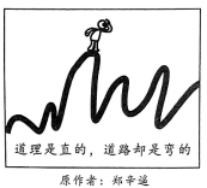
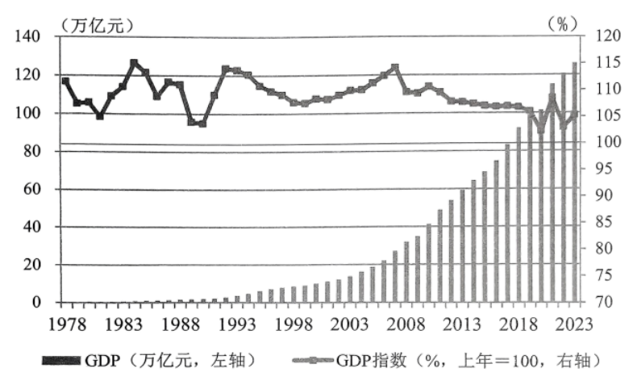

**机密★启用前**

**2024年湖北省普通高中学业水平选择性考试**

**思想政治**

**本试卷共6页，20题。全卷满分100分。考试用时75分钟。**

**★祝考试顺利★**

**注意事项：**

**1．答题前，先将自己的姓名、准考证号、考场号、座位号填写在试卷和答题卡上，并认真核准准考证号条形码上的以上信息，将条形码粘贴在答题卡上的指定位置。**

**2．请按题号顺序在答题卡上各题目的答题区域内作答，写在试卷、草稿纸和答题卡上的非答题区域均无效。**

**3．选择题用2B铅笔在答题卡上把所选答案的标号涂黑；非选择题用黑色签字笔在答题卡上作答；字体工整，笔迹清楚。**

**4．考试结束后，请将试卷和答题卡一并上交。**

**一、选择题：本题共16小题，每小题3分，共48分。在每小题给出的四个选项中，只有一项是符合题目要求的。**

1\. 我们即将迎来祖国75周年华诞。经过不懈奋斗，中国由一穷二白到全面小康，如今已踏上以中国式现代化全面推进强国建设、民族复兴的新征程。建国以来的经济建设实践证明：生产关系一定要与生产力发展要求相适应。以下对此做出正确诠释的是（ ）

①实行家庭联产承包责任制，促进了粮食增产农民增收

②鼓励非公有制经济发展，唤醒了很多人的创业梦想

③农村“三权分置”改革，推动了基层社会治理的完善

④科技创新赋能产业发展，让新能源汽车走俏世界

A. ①② B. ①④ C. ②③ D. ③④

【答案】A

【解析】

【详解】①：实行家庭联产承包责任制属于生产关系的调整，促进了粮食增产农民增收，体现了生产关系一定要与生产力发展要求相适应，①正确。

②：鼓励非公有制经济发展是我国生产资料所有制的完善，属于生产关系的调整，唤醒了很多人的创业梦想体现了生产关系一定要与生产力发展要求相适应，②正确。

③：农村“三权分置”改革虽然属于生产关系的调整，但“基层社会治理的完善”不属于生产力的范畴，二者之间，无直接因果关系，③排除。

④：科技创新赋能产业发展，让新能源汽车走俏世界，体现的是生产力的发展，不涉及生产关系的调整，④排除。

故本题选A。

2\. 现如今买了电器，有故障需要维修时，常会遇到保修附加条件多、小病大修、乱收费等花式套路，让消费者感到买得起修不起，既“头疼”又“心疼”。为解决这一问题，需要政府（ ）

①加强监管，增加行业透明度

②反垄断，打击不正当竞争

③建立国有家电维修连锁企业，做好便民服务

④引导行业协会发挥自律作用，倡导诚信经营

A. ①③ B. ①④ C. ②③ D. ②④

【答案】B

【解析】

【详解】①：“有故障需要维修时，常会遇到保修附加条件多、小病大修、乱收费等花式套路”，这体现了单纯市场调节的自发性，要更好发挥政府作用，因此需要政府加强监管，增加行业透明度，①正确。

②：材料涉及的是电器行业侵犯消费者权益，没有做到诚信经营的问题，不涉及垄断和不正当竞争，②排除。

③：我国实行社会主义市场经济体制，市场在资源配置中起决定作用，政府“建立国有家电维修连锁企业，做好便民服务”表述错误，③排除。

④：企业要诚信经营，政府要支持各类社会主体自我约束、自我管理，解决不诚信经营的问题需要政府引导行业协会发挥自律作用，④正确。

故本题选B。

3\. 下表反映了2023年我国城乡居民人均可支配收入及其来源结构情况。

<table>
<colgroup>
<col style="width: 20%" />
<col style="width: 10%" />
<col style="width: 16%" />
<col style="width: 12%" />
<col style="width: 12%" />
<col style="width: 12%" />
<col style="width: 12%" />
</colgroup>
<tbody>
<tr>
<td rowspan="2" style="text-align: center;">统计指标</td>
<td rowspan="2" style="text-align: center;">收入主体</td>
<td rowspan="2" style="text-align: center;">人均可支配收入</td>
<td colspan="4" style="text-align: center;">按收入来源分</td>
</tr>
<tr>
<td style="text-align: center;">工资性收入</td>
<td style="text-align: center;">经营净收入</td>
<td style="text-align: center;">财产净收入</td>
<td style="text-align: center;">转移净收入</td>
</tr>
<tr>
<td rowspan="2" style="text-align: center;">收入绝对量（元）</td>
<td style="text-align: center;">城镇居民</td>
<td style="text-align: center;">51821</td>
<td style="text-align: center;">31321</td>
<td style="text-align: center;">5903</td>
<td style="text-align: center;">5392</td>
<td style="text-align: center;">9205</td>
</tr>
<tr>
<td style="text-align: center;">农村居民</td>
<td style="text-align: center;">21691</td>
<td style="text-align: center;">9163</td>
<td style="text-align: center;">7431</td>
<td style="text-align: center;">540</td>
<td style="text-align: center;">4557</td>
</tr>
<tr>
<td rowspan="2" style="text-align: center;">收入较上年名义增速</td>
<td style="text-align: center;">城镇居民</td>
<td style="text-align: center;">5.1%</td>
<td style="text-align: center;">5.9%</td>
<td style="text-align: center;">5.7%</td>
<td style="text-align: center;">2.9%</td>
<td style="text-align: center;">3.6%</td>
</tr>
<tr>
<td style="text-align: center;">农村居民</td>
<td style="text-align: center;">7.7%</td>
<td style="text-align: center;">8.4%</td>
<td style="text-align: center;">6.6%</td>
<td style="text-align: center;">6.0%</td>
<td style="text-align: center;">8.4%</td>
</tr>
</tbody>
</table>

据此可以推断出（ ）

①经营净收入是农村居民最大的收入来源

②城乡居民人均可支配收入比值较上年有所上升

③经济回升向好，农民外出务工形势好转

④与农村居民相比，城镇居民的财产净收入占比更高

A. ①② B. ①③ C. ②④ D. ③④

【答案】D

【解析】

【详解】①：由图表可知，农村居民最大的收入来源是工资性收入，①不符合题意。

②：由图表可知，城镇居民与农村居民可支配收入均有所增长，农村的增速比城镇高，所以城乡比会下降，而不是比值有所上升，②排除。

③：根据图表可知，农村居民工资性收入较上年名义上增速达8.4%，说明经济回暖，农民外出务工形式好转，③符合题意。

④：农村居民财产净收入占比为540/21691≈0.02，城镇居民财产净收入占比为5392/51821≈0.1，城镇居民的财产净收入占比更高，④符合题意。

故本题选D。

4\. 2023年，中国贡献了超过一半的全球可再生能源新增装机容量。中国出口风电、光伏产品到200多个国家和地区，帮助他们获得清洁、可靠、用得起的能源。过去10年，全球风电和光伏发电项目平均每度电成本分别累计下降超过60%和80%，主要归功于中国创新、中国制造、中国工程。这表明（ ）

①风电和光伏发电相比水电和火电更具有成本优势

②中国为全球可再生能源发电的增长做出了巨大贡献

③发展中国家已广泛普及可再生能源发电产品和技术

④中国对全球绿色发展的贡献得益于科技和工业实力的增强

A. ①② B. ①③ C. ②④ D. ③④

【答案】C

【解析】

【详解】①：材料中没有涉及到风电、光伏发电与水电、火电的成本优势对比，①不符合题意。

②：2023年，中国贡献了超过一半的全球可再生能源新增装机容量，说明中国为全球可再生能源发电的增长做出了巨大贡献，②符合题意。

③：发展中国家还没有广泛普及可再生能源发电产品和技术，③排除。

④：全球风电和光伏发电项目平均每度电成本下降主要归功于中国创新、中国制造、中国工程，可见中国对全球绿色发展的贡献得益于科技和工业实力的增强，④符合题意。

故本题选C。

5\. 国之交在于民相亲，民相亲在于心相通。习近平总书记指出：“人民友好是促进世界和平与发展的基础力量，是实现合作共赢的基本前提。”民间外交作为党的事业和国家总体外交的重要组成部分，为稳定国家关系、增进人民友谊、促进务实合作、开展文明对话发挥着重要作用。民间外交（ ）

①是发展对外关系的主渠道，旨在增进国际交往与合作

②肩负着国家总体外交的首要职责，促进了中外民心相通

③是党的群众路线在外交领域的生动体现，具有鲜明的人民属性

④发挥民间先行、以民促官的优势，有利于打开外交工作新局面

A. ①② B. ①③ C. ②④ D. ③④

【答案】D

【解析】

【详解】①：民间外交旨在增进中国人民与世界人民的相互理解、友谊和信任，促进中外民相亲、心相通。民间外交作为党的事业和国家总体外交的重要组成部分，在我国对外交往中发挥着重要作用，但不是发展对外关系的主渠道，①错误。

②：外交是国家的一项重要对外职能，肩负国家总体外交首要职责的主体是国家相关部门(外交部)，而非民间外交，②错误。

③④：民间外交发挥民间先行、以民促官的优势，有利于打开外交工作新局面，为稳定国家关系、增进人民友谊、促进务实合作、开展文明对话发挥着重要作用，是党的群众路线在外交领域的生动体现，具有鲜明的人民属性，③④正确。

故本题选Ｄ。

6\. 建交60年来，中法关系始终紧跟时代。在中国同西方国家关系中，两国率先建立全面战略伙伴关系，开启机制性战略对话；率先开展航空、核能、第三方市场等合作。双边贸易额比建交之初增长了近800倍，双向投资额累计超过260亿美元。两国在气候变化和生物多样性领域的合作有力推进了全球气候议程。中法合作的历程表明（ ）

①两国通过加强沟通协作，共促世界和平发展

②两国经济合作领域广泛，助推经济全球化发展

③两国的经贸关系维护了多元稳定的国际经济新格局

④两国的战略联盟为解决全球性挑战发挥了引领性作用

A. ①② B. ①③ C. ②④ D. ③④

【答案】A

【解析】

【详解】①：中国与西方发达国家是实行不同制度的国家，中法两国率先建立全面战略伙伴关系，通过加强沟通协作，促进了世界和平发展，①正确。

②：中法两国开展航空、核能、第三方市场等合作，双边贸易额比建交之初增长了近800倍，双向投资额累计超过260亿美元，说明两国经济合作领域广泛，助推了经济全球化发展，②正确。

③：材料中的信息未涉及国际经济新格局，且应该是有利于维护多元稳定的国际经济格局，而不是新格局，③错误。

④：中国坚持不结盟政策，与法国是全面战略伙伴关系，而非战略联盟，④错误。

故本题选Ａ。

7\. 某县文化馆创立“一个人的剧场”公共文化服务项目，致力于把充满爱的文化节目送给农村孤寡老人、空巢老人、残疾人和行动不便的长者，从精神层面给予特殊人群文化关怀，以特色节目传递正能量，坚定他们创造美好生活的信心。这表明公共文化服务要（ ）

①坚持以人民为中心，立足于服务特殊人群

②不断发展创新，提高人民群众的文化鉴赏水平

③体现政府对特殊人群的关怀，增强他们的精神动力

④贯彻党执政为民的理念，满足特殊人群的文化需求

A. ①② B. ①③ C. ②④ D. ③④

【答案】D

【解析】

【详解】①：公共文化服务要坚持以人民为中心，立足于人民群众伟大的社会实践活动，①排除。

②：“一个人的剧场”是满足特殊人群的文化需求，不是提高人民群众的文化鉴赏水平，②排除。

③：“一个人的剧场”从精神层面给予特殊人群文化关怀，以特色节目传递正能量，坚定他们创造美好生活的信心。这体现政府对特殊人群的关怀，增强他们的精神动力，③正确。

④：“一个人的剧场”公共文化服务项目，致力于把充满爱的文化节目送给农村孤寡老人、空巢老人、残疾人和行动不便的长者，体现了公共文化服务要贯彻党执政为民的理念，满足特殊人群的文化需求，④正确。

故本题选D。

8\. 截至2023年6月，我国网民已达10.79亿，未成年网民突破1.91亿。国务院颁布《未成年人网络保护条例》，自2024年1月1日起施行。这是我国出台的首部专门性的未成年人网络保护综合性立法。该条例的颁布实施（ ）

①为法院审理侵害未成年人的网络犯罪案件提供裁判依据

②体现政府在网络领域用法治方式对未成年人的特殊保护

③为相关部门加强网络监管提供法律依据，有利于政府依法行政

④规定了网民的基本权利和义务，有利于保护未成年人的合法权益

A. ①③ B. ①④ C. ②③ D. ②④

【答案】C

【解析】

【详解】①：本题强调国务院颁布《未成年人网络保护条例》，保护未成年人的合法权益，不是为法院审理侵害未成年人的网络犯罪案件提供裁判依据，①排除。

②：未成年网民突破1.91亿，基于此，国务院颁布《未成年人网络保护条例》，体现政府在网络领域用法治方式对未成年人的特殊保护，②正确。

③：《未成年人网络保护条例》是我国出台的首部专门性的未成年人网络保护综合性立法。该条例的颁布实施为相关部门加强网络监管提供法律依据，有利于政府依法行政，③正确。

④：《未成年人网络保护条例》有利于保护未成年人的合法权益，但不是规定了网民的基本权利和义务，④排除。

故本题选C。

9\. 李四离世后留有价值210万元的房产（登记在夫妻名下），还有以个人名义借的购房款10万元未还。此时，李四的孩子李小四尚在妈妈的肚子里。李四留有一份遗嘱，要给其宠物犬旺财1万元。下列说法正确的是（ ）

①未出生的李小四不是自然人

②只要遗嘱是真实的，旺财就可以继承1万元

③李四借的10万元不是夫妻共同债务

④李小四可以继承价值50万元的财产

A. ①③ B. ①④ C. ②③ D. ②④

【答案】B

【解析】

【详解】①：自然人是指基于出生而取得民事主体资格的人，未出生的李小四不是自然人，①正确。

②：在中国,宠物不能继承遗产。 民法典第一千一百三十三条规定,自然人可以立遗嘱将个人财产指定由法定继承人中的一人或者数人继承。自然人可以立遗嘱将个人财产赠与国家、集体或者法定继承人以外的组织、个人。 因此,遗嘱继承的继承人,只能是个人、国家、集体、组织,动物植物都没有继承权。②错误。

③：民法典第一千零六十四条规定，夫妻一方在婚姻关系存续期间以个人名义为家庭日常生活需要所负的债务，属于夫妻共同债务。李四借的10万元购房款属于夫妻共同债务，③错误。

④：李四离世后留有价值210万元的房产，去除10万元的债务，价值共计200万元，其属于夫妻共同财产。析产后，李四留有的遗产价值共计100万元，李小四与其母亲各继承价值50万元的财产，④正确。

故本题选B。

10\. 张三喜添二孩，同事陈六带了10斤鸡蛋上门贺喜，张三说“来就来嘛，客气啥”，然后收下了鸡蛋，并和陈六约定等孩子满月了来喝酒。后来张三办了满月酒，但没有邀请陈六，陈六感觉很受伤。下列说法正确的是（ ）

①陈六送张三鸡蛋是合同关系

②张三请陈六喝酒是合同关系

③陈六有权要求张三赔礼道歉

④陈六无权要求张三返还鸡蛋

A. ①③ B. ①④ C. ②③ D. ②④

【答案】B

【解析】

【详解】①：民法典第六百五十七条：赠与合同是赠与人将自己的财产无偿给予受赠人，受赠人表示接受赠与的合同，陈六送张三鸡蛋是合同关系，①正确。

②：请人喝酒属于民法规定中的好意施惠关系,又被称之为情谊关系,属于并不能在当事人之间产生合同关系的约定或承诺，张三请陈六喝酒不是合同关系，②错误。

③：赔礼道歉属于侵权范畴，在违约合同中，可采取补救措施、赔偿损失、支付违约金、适用定金罚则等违约责任的承担方式，不包括赔礼道歉。我们觉得需要道歉，只是道德层面的理解，故③排除。

④：张三没有履行的是请喝酒的合同，由于二人之前并无返还鸡蛋的约定，陈六最多要求张三补请喝酒而不是返还鸡蛋，故④正确

故本题选B。

11\. 当雨滴从空中降落后，一旦遇到温度低于零摄氏度的物体，会迅速冻结成冰，这种天气现象叫做“冻雨”，冻雨落下后在物体表面形成冰层覆盖的现象叫做“雨凇”。我国南方一些地区把冻雨叫做“下冰凌”，北方地区则称为“流冰”。根据上述材料，下列选项正确的是（ ）

A. “冻雨”与“雨凇”指的是相同的一种天气现象

B. “下冰凌”与“流冰”的外延因地理差异而不同

C. “冻雨”外延与“下冰凌”的外延是属种关系

D. “雨凇”外延与“下冰凌”的外延是全异关系

【答案】D

【解析】

【详解】A：“冻雨”与“雨凇”指的是两种不同的天气现象，当雨滴从空中降落后，一旦遇到温度低于零摄氏度的物体，会迅速冻结成冰，这叫“冻雨”，雨落下后在物体表面形成冰层覆盖的现象叫做“雨凇”，A错误。

B：“下冰凌”与“流冰”是用不同语词表达的同一概念，其外延相同，B错误。

C：“冻雨”与“下冰凌”是不同语词表达同一概念，其外延是全同关系，C错误。

D：“雨凇”与“下冰凌”是两个概念，其外延是全异关系，D正确。

故本题选D。

12\. 在去西天取经的路上，孙悟空、猪八戒和沙和尚有如下约定：只有孙悟空回了花果山或沙和尚回了流沙河，猪八戒才能回高老庄。下列哪种情况三人中至少有一人违背了他们之间的约定（ ）

A. 猪八戒没有回高老庄，孙悟空回了花果山

B. 沙和尚没有回流沙河，猪八戒没有回高老庄

C. 猪八戒回了高老庄，孙悟空和沙和尚也去了高老庄

D. 猪八戒回了高老庄，孙悟空回了花果山

【答案】C

【解析】

【详解】只有孙悟空回了花果山或沙和尚回了流沙河，猪八戒才能回高老庄，孙悟空回了花果山或沙和尚回了流沙河是猪八戒回高老庄的必要条件。其逻辑结构是否定前件，必然否定后件；肯定后件，必然肯定前件。

A：猪八戒没有回高老庄，后件假，因此前件不一定，所以孙悟空回了花果山并没有违背三个人约定，A不选。

B；沙和尚没有回流沙河，如果孙悟空回了花果山，前件真，但是后件不一定，因此猪八戒没有回高老庄并未违背三个人的约定，B不选。

C：猪八戒回了高老庄，后件真，则前件真，孙悟空和沙和尚也去了高老庄否定了前件，所以违背了三个人的约定，C入选。

D：猪八戒回了高老庄，后件真，则前件一定真，孙悟空回了花果山不违背三个人的约定，D不选。

故本题选C。

13\. 下图漫画揭示的哲理是（ ）

①实践与认识的同一是对立中的同一

②认识的真理性要在实践过程中反复检验

③认识都能与实践达到具体的历史的统一

④实践能把头脑中观念的存在变成现实的存在

A. ①② B. ①④ C. ②③ D. ③④

【答案】A

【解析】

【详解】①：“道理是直的，道路是弯的”，实践和认识是对立统一的，两者的同一是对立中的同一，①正确。

②：实践是认识的基础，认识的真理性要在实践过程中反复检验，在弯曲的道路中，验证认识的真理性，②正确。

③：正确的认识才能与实践达到具体的历史的统一，③说法错误。

④：实践能把头脑中观念的存在变成现实的存在，但是漫画未涉及，④不符合题意。

故本题选A。

14\. 秸秆离田是东北利用秸秆的一种有效方式，但秸秆打包离田面积过大、量过度，容易导致黑土流失，因此需要统筹规划，因地制宜，做到科学离田，以实现经济效益与生态保护的统一。这表明（ ）

①土地资源利用效率的提高必须尊重自然规律 ②正确的生态价值观可以引导农业的绿色发展

③科学离田能够摆脱条件制约以实现综合利用 ④统筹规划可以优化整体功能并避免黑土流失

A. ①② B. ①④ C. ②③ D. ③④

【答案】A

【解析】

【详解】①：秸秆离田是东北利用秸秆的一种有效方式，但为防止其负面影响，需要因地制宜，说明土地资源利用效率的提高必须尊重自然规律，①正确。

②：秸秆离田容易导致黑土流失，因此需要采取措施实现经济效益与生态保护的统一，这说明正确的生态价值观可以引导农业的绿色发展，②正确。

③：科学离田并不能摆脱条件制约，要坚持一切从实际出发，实事求是，③说法错误。

④：统筹规划可以优化整体功能，减少黑土流失，但避免一词太绝对，④错误。

故本题选A。

15\. 马面裙是中国古代一种传统服饰，因形似古代城墙防御建筑“马面”而得名。新式马面裙添加了复古提花松紧腰带，融入了现代的设计与裁剪，款式简约百搭，成为年轻人的龙年“战袍”。渐成时尚的新式马面裙（ ）

①反映年轻人的民族文化认同，彰显了中华民族文化主体性

②符合社会发展要求，满足了人们的基本文化需求

③拓展传统服饰文化的多样性，显示了中华文化的包容性

④融合现代艺术理念和传统文化元素，展现了民族文化新面貌

A. ①③ B. ①④ C. ②③ D. ②④

【答案】B

【解析】

【详解】①：马面裙是中国古代一种传统服饰，成为年轻人的龙年“战袍”，这反映年轻人对本民族文化的认同，彰显了中华民族文化主体性，①正确。

②：满足人们基本文化需求的是大力发展公益性文化事业，②排除。

③：渐成时尚的新式马面裙体现了传统服饰文化的多样性，但没有涉及中华文化的包容性，③排除。

④：新式马面裙添加了复古提花松紧腰带，融入了现代的设计与裁剪，款式简约百搭，这说明新式马面裙融合现代艺术理念和传统文化元素，展现了民族文化新面貌，渐成时尚，④正确。

故本题选B。

16\. 某设计师使用人工智能工具创作画作《太空歌剧院》，在数字类别竞赛中夺得头奖，这是人类第一次把奖项颁给人工智能作品；某公司用人机联手绘画技术创作的画作《未完·待续》卖出110万元，这是全球首次成功拍卖人工智能山水画作。以上事例表明（ ）

①人工智能与艺术结合，推动了艺术民族性与世界性的统一

②人们能够发挥主观能动性，实现艺术真理性与价值性的统一

③人们运用创新思维进行艺术创作，做到方法新与结果新的统一

④人工智能丰富了艺术创作的方式，坚持了艺术内容与形式的统一

A. ①② B. ①③ C. ②④ D. ③④

【答案】D

【解析】

【详解】①：文化具有多样性，既是民族的又是世界的，并非人工智能与艺术结合才实现民族性与世界性的统一，①排除。

②：某设计师使用人工智能工具创作画作，某公司用人机联手绘画技术创作的画作，这是人发挥主观能动性的结果，但没有涉及艺术是否具有真理性，不涉及实现艺术真理性与价值性的统一，②排除。

③：某设计师使用人工智能工具创作画作，人类第一次把奖项颁给人工智能作品；某公司用人机联手绘画技术创作的画作，首次成功拍卖人工智能山水画作。这是运用创新思维进行艺术创作，做到方法新与结果新的统一，③正确。

④：使用人工智能工具、用人机联手绘画技术创作，说明人工智能丰富了艺术创作的方式，坚持了艺术内容与形式的统一，④正确。

故本题选D。

**二、非选择题：本题共4小题，共52分。**

17\. 阅读材料，完成下列要求。

材料一 下图是中国1978～2023年的国内生产总值（GDP）和国内生产总值指数（GDP指数）。

注：GDP指数上年为100，因此当年大于100表示相比上年是正增长，小于100表示相比上年是负增长。GDP指数减去100即得到经济增长率。例如，GDP指数108代表经济增长率为8%。数据来源于国家统计局。

材料二 进入新时代，在改革开放以来创造的经济快速发展奇迹的基础上，我国国内生产总值由2012年的54万亿元跃升到2023年超过126万亿元，增速在全球主要经济体中位于前列。对外开放不断扩大，货物进出口总额连续多年居世界第一，吸引外资和对外投资均居世界前列。2013年至2022年，中国与“一带一路”共建国家进出口总额累计达到19.1万亿美元，年均增长6.4%，与共建国家双向投资累计超过3800亿美元，其中中国对外直接投资超过2400亿美元。国民经济的持续健康发展和高水平的对外开放展现了中国经济的底气和活力。

（1）解读材料一反映的经济信息。

（2）结合材料并运用《中国特色社会主义》《经济与社会》知识，分析中国经济充满底气和活力的原因。

（3）结合材料并运用《当代国际政治与经济》知识，请你为吸引外商来华投资写一段推介语。（要求：观点明确，语言表达清晰，学科术语使用规范，总字数不超过150字。）

【答案】（1）中国1978～2023年的国内生产总值（GDP）在逐年增加。国内生产总值指数（GDP指数）虽有起伏，但总体趋于稳步增长。体现了我国经济高质量发展。（原卷无答案，此答案仅供参考）

（2）①中国实行改革开放，坚持和发展中国特色社会主义的必由之路，带来了中国的进步。把高度集中的计划经济体制改革成为社会主义市场经济体制，促进了生产力的发展，创造的经济快速发展奇迹，增速在全球主要经济体中位于前列，使国民经济的持续健康发展。②中国坚持以公有制为主体，多种所有制经济共同发展，毫不动摇的鼓励、支持和引导非公有制经济的发展，营造支持非公有制经济发展的制度环境、市场环境，采取促进非公有制经济发展的各项政策措施，形成促进非公有制经济发展的良好环境和社会氛围。对外开放不断扩大，货物贸易额连续多年居世界第一，引进来和走出去并重，吸引外资和对外投资均居世界前列。③坚持开放新发展理念，顺应我国经济深度融入世界经济的趋势，奉行互利共赢的开放战略，遵循共商共建共享原则，推进高水平对外开放，推动构建人类命运共同体。构建以国内大循环为主体、国内国际双循环相互促进的新发展格局，推进“一带一路”等高水平的对外开放。使国民经济的持续健康发展和高水平的对外开放展现了中国经济的底气和活力。（原卷无答案，此答案仅供参考）

（3）中国顺应经济深度融入世界经济的趋势，奉行互利共赢的开放战略，遵循共商共建共享原则，推进高水平对外开放，推动构建人类命运共同体。推进“一带一路”等高水平的对外开放。中国经济快速增长，为世界各国提供了更广阔的市场、更充足的足本、更丰富的产品、更宝贵的合作机会，为全球经济的稳定和增长提供了持续强大的推动力。（原卷无答案，此答案仅供参考）

【解析】

【分析】背景素材：1978～2023年的国内生产总值（GDP）和国内生产总值指数（GDP指数）图表和改革开放以来取得的成就

考点考查：改革开放、我国经济体制、我国经济发展、经济全球化的有关知识

能力考查：描述和阐述事物的能力

核心素养：政治认同、科学精神

【小问1详解】

第一步：审设问,明确主体、作答范围、问题限定和作答角度。

本题的设问需要解读材料一反映的经济信息。运用课本原理结合材料回答即可。

第二步:审材料,通过标点符号、段落等,提取材料有效信息。

有效信息：中国1978～2023年的国内生产总值（GDP）和国内生产总值指数（GDP指数）图表→可联系中国1978～2023年的国内生产总值（GDP）在逐年增加。国内生产总值指数（GDP指数）虽有起伏，但总体趋于稳步增长。体现了我国经济高质量发展。

第三步:整合信息,组织答案，注意教材信息与材料、时政信息相结合。

【小问2详解】

第一步：审设问,明确主体、作答范围、问题限定和作答角度。

本题的设问需要运用《中国特色社会主义》《经济与社会》知识，分析中国经济充满底气和活力的原因。运用课本原理结合材料回答即可。

第二步:审材料,通过标点符号、段落等,提取材料有效信息。

有效信息①：进入新时代，在改革开放以来创造的经济快速发展奇迹的基础上，我国国内生产总值增速在全球主要经济体中位于前列→可联系改革开放的意义。

有效信息②：对外开放不断扩大，货物进出口总额连续多年居世界第一，吸引外资和对外投资均居世界前列→可联系坚持以公有制为主体，多种所有制经济共同发展，毫不动摇的鼓励、支持和引导非公有制经济的发展。

有效信息③：中国与“一带一路”共建国家进出口总额累计达到19.1万亿美元，年均增长6.4%，与共建国家双向投资累计超过3800亿美元，其中中国对外直接投资超过2400亿美元→可联系坚持开放新发展理念，构建以国内大循环为主体、国内国际双循环相互促进的新发展格局。

第三步:整合信息,组织答案，注意教材信息与材料、时政信息相结合。

【小问3详解】

本题的设问需要运用《当代国际政治与经济》知识，请你为吸引外商来华投资写一段推介语。本题属于放性试题，运用“中国为经济全球化提供的机遇”等知识，结合材料回答即可。

18\. 阅读材料，完成下列要求。

某市创新实践形式，提高人大代表践行全过程人民民主的能力，让基层民主落点更细、效果更实。

该市成立多家立法联系点，由人大代表作为立法信息员，广泛听取意见建议，先后就有关文明乡村、优化营商环境的多部条例开展意见征询，收集的意见建议形成了人大立法议案，充分发挥了立法“直通车”作用。在各街道建立居民议事平台，推举产生包含辖区各级人大代表、村（社区）干部、居民代表在内的人员成立议事会，定期召开会议，共商经济社会发展事项、票选民生实事项目。在人大代表担任企业法定代表人、主要负责人的企业设立184个营商环境监测点，收集大量一线信息，并及时交办、督办政府相关部门，解决了企业生产经营难题300余件，有力推动了全市营商环境不断优化。

结合材料并运用《政治与法治》知识，分析该市人大代表在基层民主实践中是如何践行全过程人民民主的。

【答案】①社会主义民主是最广泛、最真实、最管用的民主，该市提高人大代表践行全过程人民民主的能力，支持和保证人民当家作主。

②设立多家基层立法联系点，拓宽了公民有序参与立法途径，人大代表行使提案权，反映人民利益和呼声，保障人民的参与权和表达权，让法律体现人民的意志。

③人大代表是人民利益的代言人，建立居民议事平台，畅通人大代表联系群众的渠道，保障和发展基层民主。

④人大代表行使质询权，肩负人民重托，努力为人民服务，帮助所在地的政府推进工作，维护好、实现好广大人民的根本利益。（原卷无答案，此答案仅供参考。）

【解析】

【分析】背景素材：人大代表践行全过程人民民主

考点考查：全过程人民民主、肩负人民重托的人大代表、基层群众自治制度

能力考查：描述和阐释事物、论证和探究问题

核心素养：政治认同、科学精神、法治意识

【详解】第一步：审设问。明确主体、知识范围、问题限定和作答角度。本题属于措施类命题，需要调动全过程人民民主、肩负人民重托的人大代表、基层群众自治制度等知识，结合该市人大代表在基层民主实践中践行全过程人民民主的具体实践进行分析。

第二步：审材料。提取关键词，链接教材知识。

关键词①：某市创新实践形式，提高人大代表践行全过程人民民主的能力，让基层民主落点更细、效果更实→可联系提高人大代表践行全过程人民民主的能力，支持和保证人民当家作主。

关键词②：成立多家立法联系点，由人大代表作为立法信息员，广泛听取意见建议，先后就多部条例开展意见征询，收集的意见建议形成了人大立法议案，充分发挥了立法“直通车”作用→可联系人大代表行使提案权，反映人民利益和呼声，保障人民的参与权和表达权，让法律体现人民的意志。

关键词③：在各街道建立居民议事平台，推举产生包含辖区各级人大代表、村(社区)干部、居民代表在内的人员成立议事会，定期召开会议，共商经济社会发展事项、票选民生实事项目→可联系畅通人大代表联系群众的渠道，保障和发展基层民主。

关键词④：在人大代表担任企业法定代表人、主要负责人的企业设立营商环境监测点，收集大量一线信息，并及时交办、督办政府相关部门，解决了企业生产经营难题，有力推动了全市营商环境不断优化→可联系人大代表行使质询权，帮助所在地的政府推进工作，维护好、实现好广大人民的根本利益。

第三步：整合信息，组织答案。注意设问限定以及教材知识与材料、时政信息等相结合。

19\. 阅读材料，完成下列要求。

一辈子有多长，能干多少事？1938年出生的“油菜院士”傅廷栋，从“小傅”到“傅老”，带领团队培育出80多个油菜品种，有力解决了我国油菜产量和品质两大问题。

“下田有瘾”的傅廷栋和团队在1999年发现，如果能在西北地区的盐碱地上复种饲料油菜，不仅能解决北方冬天畜牧业缺少新鲜饲料的问题，还可以做绿肥，改良盐碱地。在前期几十年研究基础上，团队历经数千次尝试，最终从3000多份油菜资源中筛选出40多份耐盐碱材料，育成了耐盐碱性好且抗病性强的油菜品种，在西北盐碱地上成功种植油菜，并不代表能在其他类型的盐碱地上取得成功。为了能在全国三类盐碱地上都能种上油菜，傅廷栋带领团队走南闯北，提取土壤样本，制成全国盐碱地数据库，创建油菜的盐碱地培养链，最终选育出的一系列优质油菜品种，能够在绝大多数盐碱地上存活并得到大面积种植，其中，在内蒙古、新疆等地青饲料亩产可达5000公斤。

回顾半个多世纪的风风雨雨，80多岁的傅廷栋说：“科研就得围着农民转，多到实践中去，才会有新的发现。”

（1）结合材料并运用《哲学与文化》知识，阐述傅廷栋如何在成就人生价值中笃行民族精神。

（2）结合材料并运用“辩证思维特征”的知识，阐明傅廷栋团队在耐盐碱油菜的研究与推广中所体现的思维方法。

【答案】（1）【参考答案】①中国人民是具有伟大创造精神、伟大奋斗精神的人民，伟大创造精神、伟大奋斗精神为油菜种业发展提供强大的精神动力，傅廷栋和团队历经几十年研究，育成了耐盐碱性好且抗病性强的油菜品种，在西北盐碱地上成功种植油菜。②傅廷栋心怀爱国之情，以解决我国油菜产量和品质问题为己任，致力于油菜品种培育，为国家和人民作出重大贡献，体现了爱国主义这一民族精神的核心。③他坚持着团结统一、勤劳勇敢、自强不息的中华民族精神，并秉持着创新精神，不断探索新方法、新技术，创建油菜盐碱地培养链，选育出优质油菜品种，推动了油菜种植的发展与创新。

（2）【参考答案】①整体性是辩证思维的重要特征，用全面的观点看问题。傅廷栋和团队为了能在全国三类盐碱地上都能种上油菜，傅廷栋带领团队立足实际，积极研发，创建油菜的盐碱地培养链，最终选育出的一系列优质油菜品种，能够在绝大多数盐碱地上存活并得到大面积种植。②动态性是辩证思维的又一重要特征。事物是变化发展的，要用变化发展的观点看问题。傅廷栋和团队历经多年的研究，进行上千次尝试，来推动油菜种业的发展。③坚持在整体性与独立性、动态性与静态性的对立统一中把握事物。傅廷栋团队在耐盐碱油菜的研究与推广中，立足不同盐碱地特色，具体情况具体分析，推动油菜种业绝大多数盐碱地上存活并得到大面积种植。

【解析】

【分析】背景素材：傅廷栋和团队事迹

考点考查：中华民族精神、辩证思维的特征

能力考查：描述和阐述事物，论证和探究问题

核心素养：政治认同、科学精神、公共参与

【小问1详解】

第一步：审设问。明确主体、知识范围、问题限定和作答角度。

本题需要调用《哲学与文化》的有关知识，从中华民族精神的内涵角度分析作答。

第二步：审材料。提取关键词，链接教材知识。

关键词①：在前期几十年研究基础上，团队历经数千次尝试，最终从3000多份油菜资源中筛选出40多份耐盐碱材料，育成了耐盐碱性好且抗病性强的油菜品种→可联系伟大创造精神、伟大奋斗精神。

关键词②：有力解决了我国油菜产量和品质两大问题→可联系中华民族精神的内涵与核心。

第三步：整合信息，组织答案。注意设问限定以及教材知识与材料、时政信息等相结合。

【小问2详解】

第一步：审设问。明确主体、知识范围、问题限定和作答角度。

本题需要调用辩证思维的特征的有关知识，从辩证思维的整体性与动态性角度分析作答。

第二步：审材料。提取关键词，链接教材知识。

关键词①：为了能在全国三类盐碱地上都能种上油菜，傅廷栋带领团队走南闯北→可联系整体性是辩证思维的重要特征。

关键词②：在前期几十年研究基础上，团队历经数千次尝试，最终从3000多份油菜资源中筛选出40多份耐盐碱材料，育成了耐盐碱性好且抗病性强的油菜品种，在西北盐碱地上成功种植油菜→可联系动态性是辩证思维的又一重要特征。

关键词③：能够在绝大多数盐碱地上存活并得到大面积种植→可联系坚持在整体性与独立性、动态性与静态性的对立统一中把握事物。

第三步：整合信息，组织答案。注意设问限定以及教材知识与材料、时政信息等相结合。

20\. 阅读材料，完成下列要求。

郝某常请朋友去家门口的A餐馆吃饭，除了方便、口味不错，还因为老板爽快，每次买单遇到总价不是整数时，都主动抹了零头，但最近的一次很不愉快。郝某这次实际消费了529元，买单后才发现被收了530元，于是顺口问了一句：“咋还多收了我的钱呢？”新来的收银员不认识郝某，斜眼问他：“你差那一块钱吗？”郝某感觉被冒犯，与对方争吵了起来，要求返还一元钱并赔礼道歉。没想到老板这次也较真了，拒绝返还，理由是过去每次的抹零加起来远不止一元钱。

运用《法律与生活》知识回答：A餐馆老板能否多收这一元钱并说明理由；如果双方不能达成和解，郝某坚持维权，请你给他一些建议

【答案】A餐馆不能多收这一元钱。

根据《中华人民共和国消费者权益保护法》的规定，经营者与消费者进行交易，应当遵循自愿、平等、公平、诚实信用的原则。同时，《中华人民共和国价格法》规定，经营者不得在标价之外加价出售商品，不得收取任何未予标明的费用。

A餐馆行为违反法律规定，属于构成在标价之外加价出售商品或者收取未标明的费用的违法行为。经营者在未告知消费者的情况下，擅自使用“四舍五入”收银方式侵犯了消费者的知情权，当然，商家“四舍五入”的做法中，“四舍”属于商家让利的自愿行为，但擅自“五入”的做法违背了消费者的公平交易权。因此餐馆老板并不能将过去每次的抹零与这次多收的一元钱相抵。A餐馆“反向抹零”涉嫌违法，触碰到了消费者权益的底线，侵害了消费环境的公平公正， 要据实收取每一笔交易费用，真正做到诚实守信、守法经营。且A餐馆收银员的言行，涉嫌侵害郝某人格尊严权。故A餐馆老板应该返还一元钱并向郝某赔礼道歉。

如果双方不能达成和解，郝某坚持维权，可以通过多种途径维护自身权益：可以请求消费者协会或者依法成立的其他调解组织介入调解；如仍未解决，可保留好相关票据及付款凭证，拨打12315投诉举报，及时向市场监管部门进行反映，捍卫自己的合法权益。如仍未解决，还可提请仲裁或向人民法院提起诉讼。

【解析】

【分析】背景素材：餐馆“反向抹零”案例

考点考查：消费者权利、消费者维权途径、诚信经营、积极维护人身权利

能力考查：描述和阐释事物、论证和探究问题

核心素养：法治意识

【详解】第一步：审设问。明确主体、知识范围、问题限定和作答角度。

本题需要调用《法律与生活》的消费者权利、消费者维权途径、积极维护人身权利等有关知识，对A餐馆的行为分析评价，并为郝某提出维权建议。

第二步：审材料。提取关键词，链接教材知识。

关键词①：郝某这次实际消费了529元，买单后才发现被收了530元→可联系相关法律规定。

关键词②：A餐馆老板及雇员的行为→可联系消费者权利、诚信经营、积极维护人身权利。

关键词③：与对方争吵了起来，要求返还一元钱并赔礼道歉→可联系消费者维权途径。

第三步：整合信息，组织答案。注意设问限定以及教材知识与材料相结合。
