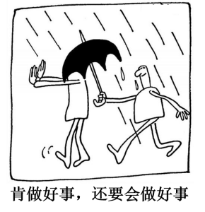
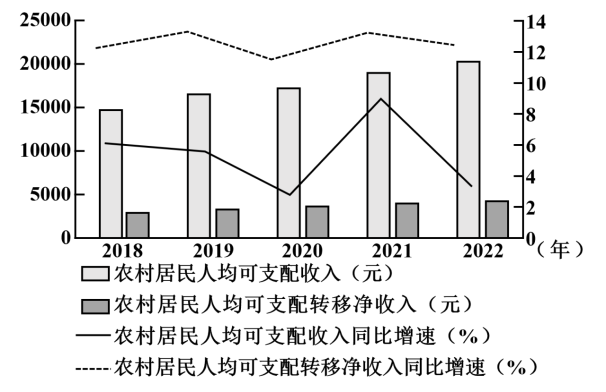
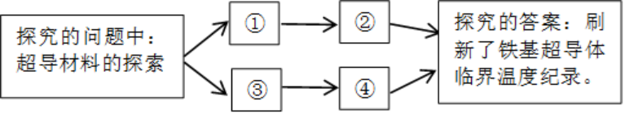

**2024年湖南省普通高中学业水平选择性考试**

**思想政治**

**一、选择题：本题共16小题，每小题3分，共48分。在每小题给出的四个选项中，只有一项符合题目要求。**

1\. 近代以来，为了民族独立和人民解放，数以万计的仁人志士失去了宝贵生命。新中国成立前夜，开国元勋们为人民英雄纪念碑奠基……1949年10月1日，30万军民在天安门广场隆重举行开国大典，历史掀开了新的一页，新中国的诞生（ ）

①推动了世界被压迫民族和被压迫人民争取解放的斗争

②表明中国消灭了一切剥削制度，推进了社会主义建设

③创造了向社会主义过渡的前提条件，改变了中国社会发展方向

④极大地改变了世界政治力量的对比，开启了人类历史的新纪元

A ①② B. ①③ C. ②④ D. ③④

2\. 党的十八届二中全会以来，我国许多领域实现历史性变革。从坚持精准扶贫精准脱贫基本方略、打赢脱贫攻坚战实现近1亿农村贫困人口脱贫，到建成世界上规模最大的教育体系、社会保障体系、医疗卫生体系；从深化司法体制改革有力维护公平正义，到颁布新中国首部民法典护航人民美好生活……沉甸甸的成绩单，诠释了（ ）

①破除制度障碍是我国取得一切成绩和进步的根本原因

②伟大改革开放精神的弘扬是实现社会变革的直接动力

③全面深化改革始终坚持以人民为中心的鲜明价值导向

④中国共产党的领导和中国特色社会主义制度的优越性

A. ①② B. ①③ C. ②④ D. ③④

3\. 恩格斯在《自然辩证法》中指出，马克思的功绩在于，“第一个把已经被遗忘的辩证方法、它和黑格尔辩证法的联系以及差别重新提到人们面前，同时在《资本论》中把这个方法应用到一种经验科学即政治经济学的事实上去”。以下理解正确的是（ ）

①《资本论》第一次阐述了科学社会主义原理

②唯物辩证法是马克思研究政治经济学的方法

③黑格尔辩证法与马克思辩证法没有本质区别

④马克思批判地吸收了黑格尔哲学的合理成分

A. ①③ B. ①④ C. ②③ D. ②④

4\. 2024年4月12日，商务部等14部门印发的《推动消费品以旧换新行动方案》对外发布。方案提出加大财政金融政策支持力度、完善废旧家电回收网络、优化家居市场环境等22条举措。新一轮消费品以旧换新，将进一步推动汽车换“能”、家电换“智”、家庭厨卫“焕新”，其意义在于（ ）

①满足居民改善需求，“换”出美好生活新品质

②促进产品更新迭代，“换”出产业升级新动能

③发挥财政主导作用，“换”出内需增长新空间

④确立资源回收制度，“换”出循环经济新模式

A. ①② B. ①④ C. ②③ D. ③④

5\. 经党中央同意，自2024年4月至7月，在全党开展党纪学习教育。通过开展党纪学习教育，引导党员干部学纪、知纪、明纪、守纪，督促领导干部树立正确权力观，公正用权、依法用权、为民用权、廉洁用权。开展党纪学习教育是（ ）

①以纪律建设为统领，勇于自我革命的要求

②推动全面从严治党向纵深发展的重要举措

③激励中国共产党人前赴后继、英勇奋斗的根本动力

④不断增强党员干部纪律意识、提高党性修养的过程

A. ①③ B. ①④ C. ②③ D. ②④

6\. 法治是互联网治理的基本方式。网络法治与10亿多网民直接相连，与14亿多人民群众息息相关。面对网络传谣、网络暴力等现实问题，需要加大治理力度，对“按键伤人”坚持严惩立场，让互联网在法治轨道上健康运行。网络法治需要（ ）

①政府依法开展网络执法，营造清朗网络空间

②司法机关强化网络立法，健全网络法律体系

③加强法治宣传教育，凝聚依法治网强大力量

④畅通群众投诉渠道，保障网民各项利益实现

A. ①③ B. ①④ C. ②③ D. ②④

7\. 大美潇湘，山水如画，“潇湘八景”最早由宋初山水画大师所作，作为一个超越地域和历史范畴的美学意象，成为千百年来历代文人墨客创作的文化母题与图式，成就了中国山水画别开生面、自成—派的“潇湘山水”。亦如美学家宗白华所言：“艺术家以心灵映射万象，代山川而立言。”由此可知（ ）

①潇湘的自然山水是能被艺术家的心灵所反映的客观实在

②艺术家以手中画笔为潇湘自然山水描绘图景、设定法则

③“潇湘八景“作为美学意象是有相对独立性的社会意识

④自成一派的“潇湘山水”寓于中国山水画艺术共性之中

A. ①② B. ①③ C. ②④ D. ③④

8\. 漫画《肯做好事，还要会做好事》(作者：郑辛遥)给我们的哲学启示是（ ）

①全面把握客观实际，是肯做好事达到积极效果的前提

②方法论比世界观更重要，“会做”比“肯做”更不容易

③辩证否定的实质是扬弃，“会做”是对“肯做”的否定

④正确发挥能动性，才能实现由“肯做”到“会做”转变

A. ①③ B. ①④ C. ②③ D. ②④

9\. 习近平总书记在《文化是灵魂》中写道：“文化力量，或者我们称之为构成综合竞争力的文化软实力，总是‘润物细无声’地融入经济力量、政治力量、社会力量之中，成为经济发展的‘助推器’、政治文明的‘导航灯’、社会和谐的‘黏合剂’。”对此理解正确的是（ ）

①“润物细无声”反映了文化发挥其作用的特点

②“助推器”表明经济的发展推动着文化的进步

③“导航灯”说明了文化是政治文明的重要内容

④“黏合剂”彰显优秀文化能提升社会文明程度

A. ①③ B. ①④ C. ②③ D. ③④

10\. 清溪村，是作家周立波长篇小说《山乡巨变》的创作地。周立波在小说中写道：“我要经我手把清溪乡打扮起来，美化起来，使它变成一座美丽的花园……”从他的创作故事中可以领悟到，对政策、历史、现实的深入认识，对山乡巨变的亲身调研，对农村农民的真挚情感，这些对《山乡巨变》的成功创作缺一不可。这是因为（ ）

①山乡的自然风光具有一定的文化属性

②每一部文学作品都是特定时代的产物

③对农村农民的真挚情感具有非意识形态性质

④人民的生活和实践是优秀文学作品的创作源泉

A. ①② B. ①③ C. ②④ D. ③④

11\. 2024年2月23日,“中法友缘·中法青年友好之夜”联欢活动暨中法青年友好交流周启动仪式在北京举行。本次活动以“团结互助、共向未来”为主题，希望两国青年通过交流周活动开启跨越语言与习俗的“相知、相通”之旅，唱响超越背景与文化的“友谊、友爱”之歌。此次交流活动（ ）

①为中法两国关系打造交流新平台，指引前进新方向

②尊重世界的多样性，践行了国际关系民主化的要求

③依托软实力，推动了亲诚惠容的两国关系向深向实发展

④有助于中法两国青年用欣赏、互鉴、共享的观点看世界

A. ①② B. ①③ C. ②④ D. ③④

12\. 2023年，我国利用外资总额超过1.1万亿元，处于历史第三高水平，新设外资企业近5.4万家.同比增长39.7%, 高技术产业外资占37.4%, 同比提高1.3个百分点，制造业领域外资占27.9%，同比提高1.6个百分点，中国已成为全球优质跨国投资的巨大引力场。这是因为（ ）

①超大规模市场能为跨国公司的发展提供重要机遇

②完整产业体系能为跨国公司提供低成本配套优势

③扩大外资准入负面清单能促进外资项目更多落地

④推进制度型开放能优化国际货物和服务贸易结构

A. ①② B. ①③ C. ②④ D. ③④

13\. 信鸽运动是一项有益的群众体育项目，经相关部门批准刘某在自己房屋内饲养了十余只信鸽。后来，刘某在其室外空调机位处加装鸽舍，又在鸽舍外搭建了附属设施以方便信鸽起落，鸽子的叫声，粪便和落羽等给楼下邻居李某的生活造成了困扰，李某将刘某诉至法院。对此，下列说法正确的是（ ）

①法院应支持李某所诉拆除鸽舍及附属设施、停止饲养信鸽的请求

②刘某取得相应的资质后饲养信鸽应当提倡和鼓励，但应文明养鸽

③若刘某不服法院的判决，可在一审判决生效后十五日内提起上诉

④刘某有无偿利用自己空调机位的权利，但应当照顾到相邻方利益

A. ①② B. ①③ C. ②④ D. ③④

14\. 黄某为满足自住需求，向某开发商购买一套房产并签订了房屋买卖合同。黄某按约定履行了付款义务并入住，但该开发商未协助办理产权登记手续。黄某诉至法院，法院判决开发商协助黄某办理产权登记。后开发商又将该房屋恶意抵押给了毫不知情的某银行，黄某再次将该开发商诉至法院。本案中（ ）

①该银行对涉案房屋享有因为抵押而产生的用益物权

②黄某可通过依法登记的方式取得涉案房屋的所有权

③房屋买卖合同无效，因开发商无出卖房屋的真实意愿

④法院应基于公平原则判决注销银行已经登记的抵押权

A. ①② B. ①③ C. ②④ D. ③④

15\. 受蝙蝠飞翔的启发，中国人在公元前500年就制作了会飞的竹蜻蜓，古代科学家通过研究竹蜻蜓，提出了关于旋翼的制造原理，后来苏州巧匠根据这一原理，发明了一种飞车，通过脚踩踏板驱动转动机构来带动螺旋桨转动，让飞车离地一尺多高，竹蜻蜓传入欧洲后，为研制现代螺旋桨、直升机提供了灵感。由此可见（ ）

①从蝙蝠到竹蜻蜓运用了模拟方法

②从竹蜻蜓到飞车运用了比较推理

③从竹蜻蜓到直升机运用了类比推理类比推理

④从竹蜻蜓到直升机运用的推理内在逻辑是必然推理

A. ①③ B. ①④ C. ②③ D. ②④

16\. 某班开展劳动教育，并评选一名劳动小能手，在评选结果公布之前，该班四位同学进行了预测(如下所示)，评选结果表明只有两个人的预测是真的。由此可见（ ）

甲：我或者丁是劳动小能手

乙：丙是劳动小能手

丙：如果我不是劳动小能手，则乙是劳动小能手

丁：劳动小能手不是我，也不是甲

A. 丙的预测为真，甲是劳动小能手

B. 丁的预测为直，乙是劳动小能手

C. 乙的预测为真，丙是劳动小能手

D. 甲的预测为真，丁是劳动小能手

**二、非选择题：本大题共4小题，共52分。**

17\. 阅读材料，完成下列要求。

2018—2022年中国农村居民人均可支配收入、转移净收入情况

材料一

(注：数据源于中国统计年鉴，人均可支配收入增长为扣除价格因素实际增长，人均可支配转移净收入增长为名义增长)

（1）根据材料一，分析我国农村居民转移净收入与可支配收入之间的关系，并说明其政策启示。

材料二 近年来，湖南以乡村治理为载体，大力推进“和美湘村”建设。某地推行“党建引领、互助五兴”农村基层治理模式，组织农村党员、干部、后备干部等优秀分子同五户左右群众建立互助组，实现“家家党员联，户户见党员”，消除基层治理盲区；立足民族融合聚居的实际，充分享重各民族风俗习惯，完善民族自治共治，促进民族团结、乡村发展；通过集体议事、共建共治等方式，实现治理工作思路由“农民依靠”向“依靠农民”转变；积极组织实施农村“法律明白人”教育培训工程，培养“法律明白人”参与调查化解各类矛盾纠纷，加强法治宣传工作。2023年，该地有两村入选省级“和美湘村”示范村。

（2）结合材料二，运用政治与法治知识，阐述该地“和美湘村”建设中的举措对乡村治理的示范价值。

18\. 阅读材料，完成下列要求。

“全球南方”最初泛指没有进入工业化社会的国家，冷战结束后，以金砖国家为代表的新兴市场国家和发展中国家群体性崛起成为“全球南方”兴起的集中体现。

作为“全球南方”的一员，中国提出独立自主是“全球南方”的政治底色，发展振兴是“全球南方”的历史使命，公道正义是“全球南方”的共同主张。中国积极维护“金砖+”合作模式，使金砖国家合作的影响超越成员国和地区范畴；积极开展共同关注领域的南南合作，维护发展中国家的发言权和发展权，积极与其他国际组织协作，坚定维护以联合国为核心的全球治理体系；积极落实全球发展倡议，帮助其他发展中国家走上绿色、可持续发展道路。

结合材料，运用当代国际政治与经济知识，阐释中国采取上述行动的原因。

19\. 阅读材料，完成下列要求

习近平总书记指出：“祖国的未来属于下一代。做好关心下一代工作，关系中华民族伟大复兴”“对损害少年儿童权益、破坏少年儿童身心健康的言行，要坚决防止和依法打击”。国家、社会、学校和家庭等应汇聚起保护未成年人的强大合力，更好呵护未成年人健康成长。

结合材料，运用法律与生活知识，对上述情境分别予以评析。

20\. 阅读材料，完成下列要求。

2024年3月18日，习近平总书记在湖南考察时来到湖南第一师范学院，同师生代表亲切交谈，强调：“学校要立德树人，教师要当好大先生，不仅要注重提高学生知识文化素养，更要上好思政课，教育引导学生明德知耻，树牢社会主义核心价值观，立报国强国大志向，努力成为堪当强国建设、民族复兴大任的栋梁之材。”

【立报国强国大志向】

时代各有不同，青春一脉相承，百年前，一批激情澎湃的青年走进湖南一师求知若渴，探寻真理。百年后，无数意气风发的青年沿着先辈足迹赓续红色血脉，担当时代重任。 “请党放心，强国有我！”在实现中华民族伟大复兴的新时代，广大青年立报国强国大志向，奋楫笃行，勇担使命，涌现出了一批先进典型。如每天一场床前放事会，做留守儿童“点灯人”的90后教师麻小姐；伴随嫦娥探月工程共同成长，38岁被任命为嫦娥三号探测器系统总设计师的孙泽洲；于山火中逆行，以生命书写人生答卷的新田森林火灾救援英雄集体，他们以青春之我、奋斗之我，为强国建设添砖加瓦，为民族复兴铺路架桥。

（1）新时代是一个英雄辈出的时代，青年人正逢其时。结合材料，运用价值的创造与实现的知识加以分析。

【显报国强国真本领】

在百余年的超导发展史中，中国科技工作者在高温超导领域作出了重大贡献，20世纪90年代，全世界科学家对超导材料的探索陷入了迷茫。经过长时间研究，中国科学家赵忠贤院士团队用轻稀土元素替代，结合高温高压合成技术，获得了临界温度为50K以上的系列铁基超导体。铁基超导体发现后，中国科学家攻坚克难，勇于创新，取得了很多新的超导材料的世界纪录，迅速占领了铁基超导感性的高地。

（2）结合材料，运用创新思维的知识，将中国超导研究中所用的思维方法及其具体运用填入思维导图1，并结合生活实际，运用超前思维的任一方法，完成思维导图2。

思维导图1

思维导图2
