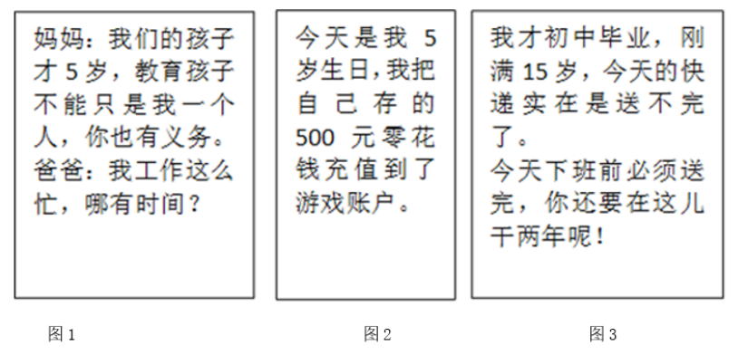
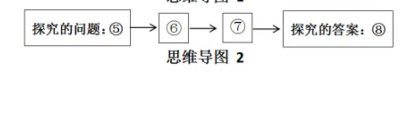

**2024年湖南省普通高中学业水平选择性考试**

**思想政治**

**一、选择题：本题共16小题，每小题3分，共48分。在每小题给出的四个选项中，只有一项符合题目要求。**

1\. 近代以来，为了民族独立和人民解放，数以万计的仁人志士失去了宝贵生命。新中国成立前夜，开国元勋们为人民英雄纪念碑奠基……1949年10月1日，30万军民在天安门广场隆重举行开国大典，历史掀开了新的一页，新中国的诞生（ ）

①推动了世界被压迫民族和被压迫人民争取解放的斗争

②表明中国消灭了一切剥削制度，推进了社会主义建设

③创造了向社会主义过渡的前提条件，改变了中国社会发展方向

④极大地改变了世界政治力量的对比，开启了人类历史的新纪元

A. ①② B. ①③ C. ②④ D. ③④

【答案】B

【解析】

【详解】①：“30万军民在天安门广场隆重举行开国大典，历史歌开了新的一页”，从国际意义上看，这说明新中国约诞生冲破了帝国主义的东方战线，极大地改变了世界政治力量的对比，鼓舞和推动了世界被压迫民族和被压迫人民争取解放的斗争，①正确。

③：从国内意义上看，这说明新中国的诞生为实现由新民主主义向社会主义的过渡创造了前提条件，从根本上改变了中国社会的发展方向，为实现国家富强、民族复兴展示了美好前景和现实道路，③正确。

②：我们党团结管领中国人民完成社会主义革命，确立社会主义基本制度，消灭了一切剥削制度，推进了社会主义建设，②不符合题意。

④：十月革命建立了世界上第一个社会主义国家，开启了人类历史的新纪元，④不符合题意。

故本题选B。

2\. 党的十八届二中全会以来，我国许多领域实现历史性变革。从坚持精准扶贫精准脱贫基本方略、打赢脱贫攻坚战实现近1亿农村贫困人口脱贫，到建成世界上规模最大的教育体系、社会保障体系、医疗卫生体系；从深化司法体制改革有力维护公平正义，到颁布新中国首部民法典护航人民美好生活……沉甸甸的成绩单，诠释了（ ）

①破除制度障碍是我国取得一切成绩和进步的根本原因

②伟大改革开放精神的弘扬是实现社会变革的直接动力

③全面深化改革始终坚持以人民为中心的鲜明价值导向

④中国共产党的领导和中国特色社会主义制度的优越性

A. ①② B. ①③ C. ②④ D. ③④

【答案】D

【解析】

【详解】①：改革开放以来，我国取得一切成绩和进步的艰本原因，归结起来就是：中国共产党带领全国人民，开辟了中国特色社会主义道路，形成了中国特色社会主义理论体系，确立了中国特色社会主义制度，发展了中国特色社会主义文化。①不选。

②：阶级斗争是推动阶级社会发展的直接动力，改革是社会主义社会发展的直接动力，“伟大改革开放精神的弘扬”不能作为实现社会变革的直接动力，②不选。

③④：从坚持精准扶贫精准脱贫基本方略、打赢脱贫攻坚战实现近1亿农村贫困人口脱贫，到建成世界上规模最大的教育体系、社会保障体系、医疗卫生体系，体现了全面深化改革始终坚持以人民为中心的鲜明价值导向；我国在许多领域实现的历史性变革诠释了中国共产党的领导和中国特色社会主义制度的优越性，③④正确。

故本题选D。

3\. 恩格斯在《自然辩证法》中指出，马克思的功绩在于，“第一个把已经被遗忘的辩证方法、它和黑格尔辩证法的联系以及差别重新提到人们面前，同时在《资本论》中把这个方法应用到一种经验科学即政治经济学的事实上去”。以下理解正确的是（ ）

①《资本论》第一次阐述了科学社会主义原理

②唯物辩证法是马克思研究政治经济学的方法

③黑格尔辩证法与马克思辩证法没有本质区别

④马克思批判地吸收了黑格尔哲学的合理成分

A. ①③ B. ①④ C. ②③ D. ②④

【答案】D

【解析】

【详解】①：《共产党宣言》第一次阐述了科学社会主义原理，①不选。

②：马克思的功绩在于，“第一个把已经被遗忘的辩证方法……应用到一种经验科学即政治经济学的事实上去”，说明唯物辩证法是马克思研究政治经济学的方法，②正确。

③：黑格尔辩证法是唯心的，马克思辩证法是唯物的，二者有本质区别，③说法错误。

④：“第一个把已经被遗忘的辩证方法，它和黑格尔辩证法的联系以及差别重新提到人们面前”，说明马克思批判地吸收了黑格尔哲学的合理成分，④正确。

故本题选D。

4\. 2024年4月12日，商务部等14部门印发的《推动消费品以旧换新行动方案》对外发布。方案提出加大财政金融政策支持力度、完善废旧家电回收网络、优化家居市场环境等22条举措。新一轮消费品以旧换新，将进一步推动汽车换“能”、家电换“智”、家庭厨卫“焕新”，其意义在于（ ）

①满足居民改善需求，“换”出美好生活新品质

②促进产品更新迭代，“换”出产业升级新动能

③发挥财政主导作用，“换”出内需增长新空间

④确立资源回收制度，“换”出循环经济新模式

A. ①② B. ①④ C. ②③ D. ③④

【答案】A

【解析】

【详解】①：消费品以旧换新，能够满足居民改善需求、“换”出美好生活新品质，①正确。

②：进一步推动汽车换“能”，家电换“智”、家庭厨卫“焕新”，能够促进产品更新迭代，“换”出产业升级新动能，②正确。

③：在社会主义市场经济条件下，市场在资源配置中起决定性作用，“发挥财政主导作用”说法错误，③不选。

④：材料并未涉及资源回收制度问题，且我国资源回收制度已经确立，有待进一步完善，④不选。

故本题选A。

5\. 经党中央同意，自2024年4月至7月，在全党开展党纪学习教育。通过开展党纪学习教育，引导党员干部学纪、知纪、明纪、守纪，督促领导干部树立正确权力观，公正用权、依法用权、为民用权、廉洁用权。开展党纪学习教育是（ ）

①以纪律建设为统领，勇于自我革命的要求

②推动全面从严治党向纵深发展的重要举措

③激励中国共产党人前赴后继、英勇奋斗的根本动力

④不断增强党员干部纪律意识、提高党性修养的过程

A. ①③ B. ①④ C. ②③ D. ②④

【答案】D

【解析】

【详解】①：坚持全面从严治党，加强党的自身建设要以党的政治建设为统领，①错误。

②：开展党纪学习教育，引导党员干部学纪，知纪、明纪、守纪，督促领导干部树立正确权力观，公正用权、依法用权、为民用权、廉洁用权，是推动全面从严治党向纵深发展的重要举措，②正确。

③：为中国人民谋幸福，为中华民族谋复兴，是中国共产党人的初心和使命，是激励一代代中国共产党人前赴后继、英勇奋斗的根本动力,③错误。

④：开展党纪学习教育是不断增强党员干部纪律意识，提高觉性修养的过程，④正确。

故本题选D。

6\. 法治是互联网治理的基本方式。网络法治与10亿多网民直接相连，与14亿多人民群众息息相关。面对网络传谣、网络暴力等现实问题，需要加大治理力度，对“按键伤人”坚持严惩立场，让互联网在法治轨道上健康运行。网络法治需要（ ）

①政府依法开展网络执法，营造清朗网络空间

②司法机关强化网络立法，健全网络法律体系

③加强法治宣传教育，凝聚依法治网强大力量

④畅通群众投诉渠道，保障网民各项利益实现

A. ①③ B. ①④ C. ②③ D. ②④

【答案】A

【解析】

【详解】①③：全面推进依法治国的基本要求。实现全面推进依法治国的总目标，必须做到科学立法、严格执法、公正司法、全民守法，网络法治是建设法治国家的重要内容，网络法治需要政府依法开展网络执法，营造清朗网络空间，需要建设法治社会，加强法治宣传教育，凝聚依法治网强大力量，①③正确。

②：立法机关科学立法，健全网络法律体系，司法机关公正司法，②错误。

④：“保障网民各项利益实现”说法错误，应是保障网民合法合理利益实现，④排除。

故本题选A。

7\. 大美潇湘，山水如画，“潇湘八景”最早由宋初山水画大师所作，作为一个超越地域和历史范畴的美学意象，成为千百年来历代文人墨客创作的文化母题与图式，成就了中国山水画别开生面、自成—派的“潇湘山水”。亦如美学家宗白华所言：“艺术家以心灵映射万象，代山川而立言。”由此可知（ ）

①潇湘的自然山水是能被艺术家的心灵所反映的客观实在

②艺术家以手中画笔为潇湘自然山水描绘图景、设定法则

③“潇湘八景“作为美学意象是有相对独立性的社会意识

④自成一派的“潇湘山水”寓于中国山水画艺术共性之中

A. ①② B. ①③ C. ②④ D. ③④

【答案】B

【解析】

【详解】①：潇湘的自然山水作为具体的物质形态，是不依赖于人的意识，并能为人的意识所反映的客观实在，①正确。

②：艺术家不能用手中画笔为自然山水设定法则，②说法错误。

③：“潇湘八景”虽作于宋初，但千百年来一直影响着历代文人墨客的创作，这说明社会意识有时会先于社会存在而变化发展，体现了社会意识的相对独立性，③正确。

④：共性寓于个性之中，并通过个性表现出来，应该是中国山水画艺术的共性寓于自成一派的“潇湘山水”之中，④说法错误。

故本题选B。

8\. 漫画《肯做好事，还要会做好事》(作者：郑辛遥)给我们的哲学启示是（ ）

①全面把握客观实际，是肯做好事达到积极效果的前提

②方法论比世界观更重要，“会做”比“肯做”更不容易

③辩证否定的实质是扬弃，“会做”是对“肯做”的否定

④正确发挥能动性，才能实现由“肯做”到“会做”转变

A. ①③ B. ①④ C. ②③ D. ②④

【答案】B

【解析】

【详解】①④：漫画显示，一个人出于好心帮别人打伞，但却遮住了被帮助人的眼睛，给被帮助人带来了麻烦，这启示我们不仅要肯做好事，还要会做好事，做好事时既要全面把握客观实际，尊重客观规律，又要正确发挥主观能动性，把正确发挥主观能动性和尊重客观规律相结合，①④符合题意。

②：世界观和方法论都很重要，既要“肯做”，又要“会做”，二者不可偏废，②错误。

③：我们要把“会做”和“肯做”结合起来，“会做”不是对“背做”的否定，③错误。

故本题选B。

9\. 习近平总书记在《文化是灵魂》中写道：“文化的力量，或者我们称之为构成综合竞争力的文化软实力，总是‘润物细无声’地融入经济力量、政治力量、社会力量之中，成为经济发展的‘助推器’、政治文明的‘导航灯’、社会和谐的‘黏合剂’。”对此理解正确的是（ ）

①“润物细无声”反映了文化发挥其作用的特点

②“助推器”表明经济的发展推动着文化的进步

③“导航灯”说明了文化是政治文明的重要内容

④“黏合剂”彰显优秀文化能提升社会文明程度

A. ①③ B. ①④ C. ②③ D. ③④

【答案】B

【解析】

【详解】①：“润物细无声”反映文化发挥作用是潜移默化的，①正确。

②：文化的力量，成为经济发展的“助推器”，强调的是文化对经济的反作用，不是经济对文化的作用，②不选。

③：文化的力量，成为政治文明的“导航灯”，强调的是文化对政治的反作用，③不远。

④：文化的力量，成为社会和谐的“黏合剂”，说明优秀文化能提升社会文明程度，促进社会发展，④正确。

故本题选B。

10\. 清溪村，是作家周立波长篇小说《山乡巨变》的创作地。周立波在小说中写道：“我要经我手把清溪乡打扮起来，美化起来，使它变成一座美丽的花园……”从他的创作故事中可以领悟到，对政策、历史、现实的深入认识，对山乡巨变的亲身调研，对农村农民的真挚情感，这些对《山乡巨变》的成功创作缺一不可。这是因为（ ）

①山乡的自然风光具有一定的文化属性

②每一部文学作品都是特定时代的产物

③对农村农民真挚情感具有非意识形态性质

④人民的生活和实践是优秀文学作品的创作源泉

A. ①② B. ①③ C. ②④ D. ③④

【答案】C

【解析】

【详解】②：周立波对政策、历史、现实的深入认识，对山乡巨变的亲身词研，对农村农民的真挚情感，是《山乡巨变》成功创作的重要因素→表明《山乡巨变》是对特定时代的反映→进一步说明每一部文学作品都是特定时代的产物，②正确。

④：文化是在人民群众伟大的社会实践活动中孕育和创造的，人民的生活是一切文化产品取之不尽、用之不竭的创作源泉。《山乡巨变》的成功在于作者深入农村进行亲身调研，这说明人民的生活和实践是优秀文学作品的创作源泉，④正确。

①：纯粹自然的现象不是文化现象，所以山乡的自然风光不具有文化属性，①错误。

③：《山乡巨变》描写了对农村农民真挚情感，具有意识形态性质，③错误。

故本题选C。

11\. 2024年2月23日,“中法友缘·中法青年友好之夜”联欢活动暨中法青年友好交流周启动仪式在北京举行。本次活动以“团结互助、共向未来”为主题，希望两国青年通过交流周活动开启跨越语言与习俗的“相知、相通”之旅，唱响超越背景与文化的“友谊、友爱”之歌。此次交流活动（ ）

①为中法两国关系打造交流新平台，指引前进新方向

②尊重世界多样性，践行了国际关系民主化的要求

③依托软实力，推动了亲诚惠容的两国关系向深向实发展

④有助于中法两国青年用欣赏、互鉴、共享的观点看世界

A. ①② B. ①③ C. ②④ D. ③④

【答案】D

【解析】

【详解】③④：本次活动以“团结互助，共向未来”为主题，目的在于促使两国青年开启跨越语言与习俗的“相知、相通”之流，唱响超越背景与文化的“友谊、友爱”之歌，这表明此次交流活动依托软实力，推动了亲诚惠容的两国关系向深向实发展，有助于两国青年用欣赏、互鉴、共享的观点看世界，③④正确。

①：此次交流活动为中法两国关系打造了交流新平台，但“指引前进新方向”夸大了此次交流活动的作用，①错误。

②：此次交流活动尊重了世界的多样性，促进了中法两国关系发展，但与国际关系民主化无关,②不选。

故本题选D。

12\. 2023年，我国利用外资总额超过1.1万亿元，处于历史第三高水平，新设外资企业近5.4万家.同比增长39.7%, 高技术产业外资占37.4%, 同比提高1.3个百分点，制造业领域外资占27.9%，同比提高1.6个百分点，中国已成为全球优质跨国投资的巨大引力场。这是因为（ ）

①超大规模市场能为跨国公司的发展提供重要机遇

②完整产业体系能为跨国公司提供低成本配套优势

③扩大外资准入负面清单能促进外资项目更多落地

④推进制度型开放能优化国际货物和服务贸易结构

A. ①② B. ①③ C. ②④ D. ③④

【答案】A

【解析】

【详解】①②：中国已成为全球优质跨国投资的巨大引力场是基于中国自身的经济优势，包括超大规模市场的优势、完整产业体系优势等，①②正确。

③：缩减外资准人负面清单才能促进外资项目更多落地，扩大外资准人负面清单会降低我国的开放水平，③错误。

④：制度型开放是指规则、规制、管理、标准等方面的开放，推进制度型开放与优化国际货物和服务贸易结构没有直接关系，④排除。

故本题选A。

13\. 信鸽运动是一项有益的群众体育项目，经相关部门批准刘某在自己房屋内饲养了十余只信鸽。后来，刘某在其室外空调机位处加装鸽舍，又在鸽舍外搭建了附属设施以方便信鸽起落，鸽子的叫声，粪便和落羽等给楼下邻居李某的生活造成了困扰，李某将刘某诉至法院。对此，下列说法正确的是（ ）

①法院应支持李某所诉拆除鸽舍及附属设施、停止饲养信鸽的请求

②刘某取得相应的资质后饲养信鸽应当提倡和鼓励，但应文明养鸽

③若刘某不服法院的判决，可在一审判决生效后十五日内提起上诉

④刘某有无偿利用自己空调机位的权利，但应当照顾到相邻方利益

A. ①② B. ①③ C. ②④ D. ③④

【答案】C

【解析】

【详解】①：法院应判决刘某承担相应侵权责任，文明饲养信鸽，照顾相邻方的权益，但对某有饲养信鸽的权利，且饲养信鸽行为经过了相关部门批准，因此法院不会支持李某所诉停止饲养信鸽的请求，①不选。

②④：妥善处理租邻关系、诉讼权利。刘某有无偿利用自己空调机位饲养信鸿的权利，但民事主体行使民事权利时不能超过正当的界限，不得利用民事权利损害国家利益，社会公共利益或者他人合法权益，所以说刘某取得相应的资质后饲养信鸽应当提倡和鼓励，但应文明养鸽，同时应当照顾到相邻方利益，②④正确。

③：若对某不服法院的判决，可在一审判决作出后十五日内提起上诉，启动二审程序、一审判决生效后不能上诉，只能提起再审程序，③错误。

故本题选C。

14\. 黄某为满足自住需求，向某开发商购买一套房产并签订了房屋买卖合同。黄某按约定履行了付款义务并入住，但该开发商未协助办理产权登记手续。黄某诉至法院，法院判决开发商协助黄某办理产权登记。后开发商又将该房屋恶意抵押给了毫不知情的某银行，黄某再次将该开发商诉至法院。本案中（ ）

①该银行对涉案房屋享有因为抵押而产生的用益物权

②黄某可通过依法登记的方式取得涉案房屋的所有权

③房屋买卖合同无效，因开发商无出卖房屋的真实意愿

④法院应基于公平原则判决注销银行已经登记的抵押权

A. ①② B. ①③ C. ②④ D. ③④

【答案】C

【解析】

【详解】②： 黄某与某开发商签订了房屋买卖合同，并且按约定履行了付款义务并入住，但不动产所有权的取得应当依照法律规定登记，故黄某可通过依法登记的方式取得涉案房屋的所有权。②正确。

④：黄某购买房屋是为了满足自住需求且履行了合同义务，但开发商未协助办理产权登记手续，且又将该房屋恶意抵押给了毫不知情的某银行，开发商应该承担违约责任，故法院应基于公平原则判决注销银行已经登记的抵押权，④正确。

①：该银行对涉案房屋享有抵押权，但抵押权属于担保物权，而不是用益物权，①错误。

③：根据材料可知，该房屋买卖合同双方当事人均具有相应的民事行为能力，意思表示真实，内容合法，属于有效合同，③错误。

故本题选C。

15\. 受蝙蝠飞翔的启发，中国人在公元前500年就制作了会飞的竹蜻蜓，古代科学家通过研究竹蜻蜓，提出了关于旋翼的制造原理，后来苏州巧匠根据这一原理，发明了一种飞车，通过脚踩踏板驱动转动机构来带动螺旋桨转动，让飞车离地一尺多高，竹蜻蜓传入欧洲后，为研制现代螺旋桨、直升机提供了灵感。由此可见（ ）

①从蝙蝠到竹蜻蜓运用了模拟方法

②从竹蜻蜓到飞车运用了比较推理

③从竹蜻蜓到直升机运用了类比推理类比推理

④从竹蜻蜓到直升机运用的推理内在逻辑是必然推理

A. ①③ B. ①④ C. ②③ D. ②④

【答案】A

【解析】

【详解】①：受蝙蝠飞翔的启发，中国人制作出会飞的竹蜻组，这一过程模仿了生物的构造及功能，运用了模拟的方法，①正确。

③④：竹蜻蜓传入欧洲后，为研剧现代螺旋桨、直升机提供了灵感，这一过程运用了类比推理，但类比推理是或然推理，不是必然推理，③正确，④错误。

②：比较是一种简单的认识方法，不是推理，②说法错误。

故本题选A。

16\. 某班开展劳动教育，并评选一名劳动小能手，在评选结果公布之前，该班四位同学进行了预测(如下所示)，评选结果表明只有两个人的预测是真的。由此可见（ ）

甲：我或者丁是劳动小能手

乙：丙是劳动小能手

丙：如果我不是劳动小能手，则乙是劳动小能手

丁：劳动小能手不是我，也不是甲

A. 丙的预测为真，甲是劳动小能手

B. 丁的预测为直，乙是劳动小能手

C. 乙的预测为真，丙是劳动小能手

D. 甲的预测为真，丁是劳动小能手

【答案】B

【解析】

【详解】ABCD：根据题意可知，该班只评选一名劳动小能手，且四位同学中只有两个人的预测是真的。甲预测甲或者丁是劳动小能手，而丁预测甲和丁都不是劳动小能手，因而，甲和丁的预测相矛盾，二人的预测必有一真，而“结果表明只有两个人的预测是真的”，这意味着乙和丙的预测中只能有一真。乙预测丙是劳动小能手，丙预测“如果我不是劳动小能手，则乙是劳动小能手”，这属于充分条件假言判断，其推理的有效式是肯定前件式(丙不是劳动小能手，乙是劳动小能手)和否定后件式(乙不是劳动小能手，丙是劳动小能手)。假设乙预测为真，即丙是劳动小能手，这与丙的预测的否定后件式的推理相同，即乙和丙的预测均为真，这会出现三个人的预测都是真的，即甲或丁中的一人预测为真，乙和丙的预测均为真，不符合题中“结果表明只有两个人的预测是真的”的设定。而乙的预测为假时，即丙不是劳动小能手，结合丙的预测，则是肯定前件，必肯定后件，即“丙不是劳动小能手，乙是劳动小能手”，只有丙的预测为真，符合乙和丙的预测中只能有一真，所以丙不是劳动小能手，乙是劳动小能手，综上所述，乙是劳动小能手，甲和乙预测为假，丙和丁预测为真，B正确，ACD错误。

故本题选B。

**二、非选择题：本大题共4小题，共52分。**

17\. 阅读材料，完成下列要求。

2018—2022年中国农村居民人均可支配收入、转移净收入情况

材料一

(注：数据源于中国统计年鉴，人均可支配收入增长为扣除价格因素的实际增长，人均可支配转移净收入增长为名义增长)

（1）根据材料一，分析我国农村居民转移净收入与可支配收入之间的关系，并说明其政策启示。

材料二 近年来，湖南以乡村治理为载体，大力推进“和美湘村”建设。某地推行“党建引领、互助五兴”农村基层治理模式，组织农村党员、干部、后备干部等优秀分子同五户左右群众建立互助组，实现“家家党员联，户户见党员”，消除基层治理盲区；立足民族融合聚居的实际，充分享重各民族风俗习惯，完善民族自治共治，促进民族团结、乡村发展；通过集体议事、共建共治等方式，实现治理工作思路由“农民依靠”向“依靠农民”转变；积极组织实施农村“法律明白人”教育培训工程，培养“法律明白人”参与调查化解各类矛盾纠纷，加强法治宣传工作。2023年，该地有两村入选省级“和美湘村”示范村。

（2）结合材料二，运用政治与法治知识，阐述该地“和美湘村”建设中的举措对乡村治理的示范价值。

【答案】（1）关系：农村居民的转移净收入是构成其可支配收入的重要组成部分，转移净收入的增加为可支配收入的增加创造动力，对提高农村居民的整体收入水平和生活质量具有重要作用。

政策启示：实施一系列强农惠农政策，完善再分配调节机制，增加财政转移支出，提高农村居民的转移净收入，缩小城乡收入差距，增强农村居民的获得感、幸福感、安全感。

（2）

发挥基层党组织的战斗堡垒作用和共产党员的先锋模范作用，创新基层治理形式，提升乡村治理效能。从实际出发，贯彻落实民族方针政策和民族区域自治制度，处理好民族关系，促进民族平等团结，推动民族地区发展。推进基层协商民主，拓宽农民参与乡村治理的渠道，让农民真正成为乡村治理的主体、受益者。加强法治宣传力度，增强基层社会的法治意识，破解乡村治理难题，提升乡村治理法治化水平。

【解析】

【分析】背景素材：中国农村居民人均可支配收入、湖南推进“和美湘村”建设

考点考查：我国的个人收入分配、中国共产党的先进性、基层自治制度、民族区域自治制度、法治社会

能力考查：获取和解读信息、调动和运用知识、描述和阐释事物

核心素养：政治认同、科学精神、法治意识

【小问1详解】

第一步：审设问。明确主体、知识范围、问题限定和作答角度。本题属于分析说明类主观题，要求分析我国农村居民转移净收入与可支配收入之间的关系，并说明其政策启示，考生可以调用我国的个人收入分配知识结合材料进行分析。

第二步：审材料提取关键词，链接教材知识。

关键词①：由图表中2018—2022年中国农村居民人均可支配收入、转移净收入情况→可联系教材知识农村居民的转移净收入是构成其可支配收入的重要组成部分，转移净收入的增加为可支配收入的增加创造动力，对提高农村居民的整体收入水平和生活质量具有重要作用。（关系）

关键词②：由图表可知农村居民的转移净收入是构成其可支配收入的重要组成部分→可联系实施一系列强农惠农政策，完善再分配调节机制，增加财政转移支出，提高农村居民的转移净收入，缩小城乡收入差距，增强农村居民的获得感、幸福感、安全感。（启示）

第三步：整合信息，组织答案。注意设问限定以及教材知识与材料、时政信息相结合。

【小问2详解】

第一步：审设问。明确主体、知识范围、问题限定和作答角度。本题属于说明类主观题，考查的范围是政治与法治知识，要求阐述该地“和美湘村”建设中的举措对乡村治理的示范价值，考生可以调用中国共产党的先进性、基层自治制度、民族区域自治制度、法治社会等知识结合材料进行分析。

第二步：审材料。提取关键词，链接教材知识。

关键词①：“党建引领、互助五兴”农村基层治理模式，组织农村党员、干部、后备干部等优秀分子同五户左右群众建立互助组，实现“家家党员联，户户见党员”，消除基层治理盲区→可联系发挥基层党组织的战斗堡垒作用和共产党员的先锋模范作用，创新基层治理形式，提升乡村治理效能。

关键词②：立足民族融合聚居的实际，充分享重各民族风俗习惯，完善民族自治共治，促进民族团结、乡村发展→可联系从实际出发，贯彻落实民族方针政策和民族区域自治制度，处理好民族关系，促进民族平等团结，推动民族地区发展。

关键词③：通过集体议事、共建共治等方式，实现治理工作思路由“农民依靠”向“依靠农民”转变→可联系推进基层协商民主，拓宽农民参与乡村治理的渠道，让农民真正成为乡村治理的主体、受益者。

关键词④：积极组织实施农村“法律明白人”教育培训工程，培养“法律明白人”参与调查化解各类矛盾纠纷，加强法治宣传工作→可联系加强法治宣传力度，增强基层社会的法治意识，破解乡村治理难题，提升乡村治理法治化水平。

第三步：整合信息，组织答案。注意设问限定以及教材知识与材料、时政信息相结合。

18\. 阅读材料，完成下列要求。

“全球南方”最初泛指没有进入工业化社会的国家，冷战结束后，以金砖国家为代表的新兴市场国家和发展中国家群体性崛起成为“全球南方”兴起的集中体现。

作为“全球南方”的一员，中国提出独立自主是“全球南方”的政治底色，发展振兴是“全球南方”的历史使命，公道正义是“全球南方”的共同主张。中国积极维护“金砖+”合作模式，使金砖国家合作的影响超越成员国和地区范畴；积极开展共同关注领域的南南合作，维护发展中国家的发言权和发展权，积极与其他国际组织协作，坚定维护以联合国为核心的全球治理体系；积极落实全球发展倡议，帮助其他发展中国家走上绿色、可持续发展道路。

结合材料，运用当代国际政治与经济知识，阐释中国采取上述行动的原因。

【答案】金砖国家是新兴市场和发展中国家加强团结合作、维护共同利益的重要平台，中国秉持开放包容、合作共赢的金砖精神，推动各领域务实合作不断深入，提升金砖国家的总体影响力，推动构建新型国际关系；发展中国家是反对霸权主义与强权政治的重要力量，中国积极参与南南合作，支持扩大发展中国家在国际事务中的代表性和发言权，维护发展中国家共同利益；

联合国是全球治理的主要平台，中国积极参与全球治理体系变革，维护以联合国为核心的全球治理体系，推动全球治理朝着更加公正合理的方向发展；

全球发展的最突出问题是南北发展不平衡，中国积极推动全球发展、增强全球发展新动能，为促进全球平等、平衡、可持续发展贡献中国力量。

【解析】

【分析】背景材料：“全球南方”

考点考查：发展问题、金砖国家、联合国的作用、贡献中国力量

能力考查：调动和运用知识、描述和阐释事物

核心素养：政治认同、责任意识

【详解】第一步：审设问，明确主体、作答范围及作答角度

本题的设问主体为中国（材料关联主体为新兴市场国家、发展中国家、联合国），需要运用世界多极化、发展问题、金砖国家、联合国的作用的有关知识，从原因类习题的角度进行作答。

第二步：审材料，提取关键词，链接教材知识

关键词①：以金砖国家为代表的新兴市场国家和发展中国家群体性崛起成为“全球南方”兴起的集中体现→可链接金砖国家的作用；

关键词②：作为“全球南方”的一员，中国提出独立自主是“全球南方”的政治底色，发展振兴是“全球南方”的历史使命，公道正义是“全球南方”的共同主张；中国积极维护“金砖+”合作模式，使金砖国家合作的影响超越成员国和地区范畴→可链接中国秉持开放包容、合作共赢的金砖精神，推动提升金砖国家的总体影响力，推动构建新型国际关系；

关键词③：积极开展共同关注领域的南南合作，维护发展中国家的发言权和发展权→可链接发展中国家是反对霸权主义与强权政治的重要力量，中国积极参与南南合作，维护发展中国家共同利益；

关键词④：中国坚定维护以联合国为核心的全球治理体系→可链接联合国的作用、中国在联合国中的作用的教材知识；

关键词⑤：发展振兴是“全球南方”的历史使命，中国积极开展南南合作，积极落实全球发展倡议，帮助其他发展中国家走上绿色、可持续发展道路→可链接全球发展的最突出问题、贡献中国智慧。

第三步：整合信息，组织答案。

19\. 阅读材料，完成下列要求。

习近平总书记指出：“祖国的未来属于下一代。做好关心下一代工作，关系中华民族伟大复兴”“对损害少年儿童权益、破坏少年儿童身心健康的言行，要坚决防止和依法打击”。国家、社会、学校和家庭等应汇聚起保护未成年人的强大合力，更好呵护未成年人健康成长。

结合材料，运用法律与生活知识，对上述情境分别予以评析。

【答案】图1，父母对未年子女有抚养和教育义务，父母只抚养不教育是违法的，妈妈教开孩子是积极履行自己法定义务的表现，爸爸以工作忙为由不教育孩子说明其没有履行教育未成年子女的义务。

图2中5岁的孩子属于无民事行为能力人，民法典第二十条规定，不满八周岁的未成年人为无民事行为能力人，由其法定代理人代理实施民事法律行为。因此，5岁孩子的充值行为属于无效行为，其法定代理人可以要求平台退款。

图3，劳动法规定，劳动者应达到法定就业年龄，除特殊情况外，禁止用人单位招用未满十六周岁的未成年人，图3所涉快递公司雇用15岁的未成年人，且安排其从事高强度的工作，违反了劳动法规定，不利于未成年人的身心健康发展。

【解析】

【分析】背景素材：呵护未成年人健康成长

考点考查：自然人的民事行为能力、育小职责大、法律守护劳动者

能力考查：获取和解读信息、调动和运用知识、描述和阐释事物

核心素养：法治意识、公共参与

【详解】第一步：审设问。明确主体、知识范围、问题限定和作答角度。本题属于评析类主观题，考查的范围是法律与生活，要求对上述情境分别予以评析，考生可以调用育小职责大、自然人的民事行为能力、法律守护劳动者等知识结合材料进行分析。

第二步：审材料。提取关键词，链接教材知识。

关键词①：妈妈：教育孩子不能只是我一个人，你也有义务。爸爸：我工作这么忙，哪有时间？→可联系教材知识父母对未年子女有抚养和教育义务，父母只抚养不教育是违法的，妈妈教开孩子是积极履行自己法定义务的表现，爸爸以工作忙为由不教育孩子说明其没有履行教育未成年子女的义务。

关键词②：5岁的孩子吧自己存在500元零花钱充值到游戏帐户了→可联系教材知识不满八周岁的未成年人为无民事行为能力人，由其法定代理人代理实施民事法律行为。因此，5岁孩子的充值行为属于无效行为，其法定代理人可以要求平台退款。

关键词③：刚满15周岁的未成年人快递送不完，单位要求下班前必须送完，还需在单位干两年→可联系教材知识劳动法规定，劳动者应达到法定就业年龄，除特殊情况外，禁止用人单位招用未满十六周岁的未成年人。图3所涉快递公司雇用15岁的未成年人，且安排其从事高强度的工作，违反了劳动法规定，不利于未成年人的身心健康发展。

第三步：整合信息，组织答案。注意设问限定以及教材知识与材料、时政信息相结合。

20\. 阅读材料，完成下列要求。

2024年3月18日，习近平总书记在湖南考察时来到湖南第一师范学院，同师生代表亲切交谈，强调：“学校要立德树人，教师要当好大先生，不仅要注重提高学生知识文化素养，更要上好思政课，教育引导学生明德知耻，树牢社会主义核心价值观，立报国强国大志向，努力成为堪当强国建设、民族复兴大任的栋梁之材。”

【立报国强国大志向】

时代各有不同，青春一脉相承，百年前，一批激情澎湃的青年走进湖南一师求知若渴，探寻真理。百年后，无数意气风发的青年沿着先辈足迹赓续红色血脉，担当时代重任。 “请党放心，强国有我！”在实现中华民族伟大复兴的新时代，广大青年立报国强国大志向，奋楫笃行，勇担使命，涌现出了一批先进典型。如每天一场床前放事会，做留守儿童“点灯人”的90后教师麻小姐；伴随嫦娥探月工程共同成长，38岁被任命为嫦娥三号探测器系统总设计师的孙泽洲；于山火中逆行，以生命书写人生答卷的新田森林火灾救援英雄集体，他们以青春之我、奋斗之我，为强国建设添砖加瓦，为民族复兴铺路架桥。

（1）新时代是一个英雄辈出的时代，青年人正逢其时。结合材料，运用价值的创造与实现的知识加以分析。

【显报国强国真本领】

在百余年的超导发展史中，中国科技工作者在高温超导领域作出了重大贡献，20世纪90年代，全世界科学家对超导材料的探索陷入了迷茫。经过长时间研究，中国科学家赵忠贤院士团队用轻稀土元素替代，结合高温高压合成技术，获得了临界温度为50K以上的系列铁基超导体。铁基超导体发现后，中国科学家攻坚克难，勇于创新，取得了很多新的超导材料的世界纪录，迅速占领了铁基超导感性的高地。

（2）结合材料，运用创新思维的知识，将中国超导研究中所用的思维方法及其具体运用填入思维导图1，并结合生活实际，运用超前思维的任一方法，完成思维导图2。

思维导图1

思维导图2

【答案】（1）人生的真正价值在于对社会的责任与贡献，投身为人民服务的实践是实现人生价值的必由之路，我们应在劳动和奉献中创造价值，在个人与社会的统一中实现价值，在砥砺自我中走向成功，广大青年坚定理想信念，立报国强军大志向，自觉践行社会主义核心价值观，勇担使命；努力增长才干，全面提升个人素质，把握机遇，为人生价值的创造和实现提供更加广阔的空间；发挥顽强拼搏，自强不息的精神，紧跟时代步伐，自觉投身于国家和人民的伟大事业中，在奋斗中实现人生价值。

（2）思维导图1：①发散思维；②联想思维；③运用检核表法，通过他用、代替、组合寻找到超导材料的突破口；④通过迁移开拓新思路。

思维导图2：⑤人工智能运用对生活的影响⑥超前思维；⑦推理和想象：⑧人工智能赋能生活，提升效率。

【解析】

【分析】背景素材：青年（科技工作者）的责任与担当

考点考查：价值的创造与实现、创新思维、联想思维、超前思维的相关知识

能力考查：调动和运用知识、描述和阐释事物

核心素养：政治认同、责任意识、公共参与

【小问1详解】

第一步：审设问。明确主体、知识范围、问题限定和作答角度。本题要求分析“新时代是一个英雄辈出的时代，青年人正逢其时”，知识角度限定为价值的创造与实现，可用的知识要点有人生的真正价值、价值的创造与实现，解答时，获取材料信息，结合知识要点作答。

第二步，审材料，提取关键词，链接教材知识。

关键词①：运用价值的创造与实现的知识→可链接人生的真正价值、价值的创造与实现的教材知识；

关键词②：新时代广大青年立报国强国大志向，奋楫笃行，勇担使命，以青春之我、奋斗之我，为强国建设添砖加瓦，为民族复兴铺路架桥→可链接创造和实现人生价值的主观因素的教材知识。

第三步，整合信息、组织答案。

【小问2详解】

第一步：审设问。明确主体、知识范围、问题限定和作答角度。本题要求完成两个思维导图，知识角度限定为创新思维，可用的知识要点有发散思维及其技法、联想思维及其方法、超前思维及其方法与意义，解答时，获取材料信息，结合知识要点作答。

第二步，审材料，提取关键词，链接教材知识。

关键词①：全球科学家对超导材料的探索陷入迷茫，中国科学家用轻稀土元素替代得到了新成果→可链接发散思维、联想思维及其技法（方法）的教材知识；

关键词②：自20世纪90年代，全球（含中国）科学家就深入研究超导材料，后来中国科学家取得很多新的超导材料的世界纪录，迅速占领铁基超导感性的高地→可链接超前思维的方法与意义的教材知识。

第三步，整合信息、组织答案。
