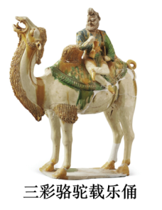
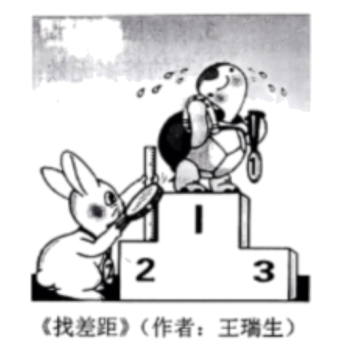
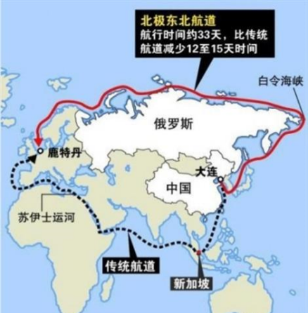

**2024年普通高等学校招生选择性考试（辽宁卷）**

**思想政治**

**本试卷共8页。考试结束后，将本试卷和答题卡一并交回。**

**注意事项：**

**1．答题前，考生先将自己的姓名、准考证号码填写清楚，将条形码准确粘贴在考生信息条形码粘贴区。**

**2．选择题必须使用2B铅笔填涂；非选择题必须使用0.5毫米黑色字迹的签字笔书写，字体工整、笔迹清楚。**

**3．请按照题号顺序在答题卡各题目的答题区域内作答，超出答题区域书写的答案无效；在草稿纸、试卷上答题无效。**

**4．作图可先使用铅笔画出，确定后必须用黑色字迹的签字笔描黑。**

**5．保持卡面清洁，不要折叠，不要弄破、弄皱，不准使用涂改液、修正带、刮纸刀。**

**一、选择题：本题共16小题，每小题3分，共48分。在每小题给出的四个选项中，只有一个是符合题目要求的。**

1\. 下列对“两个必然”和“两个决不会”关系认识正确的是（ ）

<table style="width:64%;">
<colgroup>
<col style="width: 29%" />
<col style="width: 34%" />
</colgroup>
<tbody>
<tr>
<td style="text-align: left;">
“两个必然”：

1848年，马克思、恩格斯在《共产党宣言》中指出：“资产阶级的灭亡和无产阶级的胜利是同样不可避免的。”这就是现在所说的资本主义必然灭亡和社会主义必然胜利的“两个必然”。
</td>
<td style="text-align: left;">
“两个决不会”：

1859年，马克思在《<政治经济学批判>序言》中提出：“无论哪一个社会形态，在它所能容纳的全部生产力发挥出来以前，是决不会灭亡的；而新的更高的生产关系，在它的物质存在条件在旧社会的胎胞里成熟以前，是决不会出现的。”
</td>
</tr>
</tbody>
</table>

①两者都依据社会基本矛盾运动规律阐释社会形态的更替问题

②两者都论证了社会主义终将代替资本主义，但过程是漫长的

③前者揭示社会形态更替的必然性，后者揭示其实现的条件性

④前者反映资本主义社会的运行方式，后者反映社会形态更替的实现方式

A. ①③ B. ①④ C. ②③ D. ②④

2\. 习近平指出，新质生产力“由技术革命性突破、生产要素创新性配置、产业深度转型升级而催生，以劳动者、劳动资料、劳动对象及其优化组合的跃升为基本内涵……特点是创新，关键在质优，本质是先进生产力”，该理论的贡献在于（ ）

①阐释了新质生产力的特点，成为了生产力发展水平的重要标志

②丰富了习近平经济思想的内涵，为高质量发展提供了科学指引

③深化了对生产力发展规律的认识，创新了马克思主义生产力理论

④拓展了生产力构成的基本要素，催生了与之相适应的新型生产关系

A. ①② B. ①④ C. ②③ D. ③④

3\. 下表显示了中国城镇化与产业发展的相关数据（数据来源：《中国统计年鉴2023》）。

1992-2022年中国城镇化率和第一产业部分经济指标

<table style="width:64%;">
<colgroup>
<col style="width: 8%" />
<col style="width: 9%" />
<col style="width: 14%" />
<col style="width: 16%" />
<col style="width: 15%" />
</colgroup>
<tbody>
<tr>
<td rowspan="2" style="text-align: left;">年份（年）</td>
<td rowspan="2" style="text-align: left;">城镇化率（%）</td>
<td colspan="2" style="text-align: left;">第一产业占三次产业总量比重</td>
<td rowspan="2" style="text-align: left;">第一产业GDP（亿元）</td>
</tr>
<tr>
<td style="text-align: left;">就业占比（%）</td>
<td style="text-align: left;">GDP占比（%）</td>
</tr>
<tr>
<td style="text-align: left;">1992</td>
<td style="text-align: left;">27.5</td>
<td style="text-align: left;">58.5</td>
<td style="text-align: left;">21.3</td>
<td style="text-align: left;">5800.3</td>
</tr>
<tr>
<td style="text-align: left;">2002</td>
<td style="text-align: left;">39.1</td>
<td style="text-align: left;">50.0</td>
<td style="text-align: left;">13.3</td>
<td style="text-align: left;">16190.2</td>
</tr>
<tr>
<td style="text-align: left;">2012</td>
<td style="text-align: left;">53.1</td>
<td style="text-align: left;">33.5</td>
<td style="text-align: left;">9.1</td>
<td style="text-align: left;">49084.6</td>
</tr>
<tr>
<td style="text-align: left;">2022</td>
<td style="text-align: left;">65.2</td>
<td style="text-align: left;">24.1</td>
<td style="text-align: left;">7.3</td>
<td style="text-align: left;">88345.1</td>
</tr>
</tbody>
</table>

（注：三次产业为第一、二、三产业总称）

结合表中信息，以下分析正确的是（ ）

①城镇化为第二、三产业提供丰富的劳动力

②城镇化水平与第一产业的生产效率负相关

③城镇化水平的提升伴随着三次产业结构的升级

④城镇化水平决定了三次产业间产值差距的大小

A. ①③ B. ①④ C. ②③ D. ②④

4\. 自然资源部根据2024年中央一号文件部署，将着重完善制度，全面建立“国家管总量、省级负总责、市县抓落实”的耕地占补平衡新机制，有效抵补非农建设占用耕地数量损失，严守十八亿亩耕地红线。以上举措旨在（ ）

①防止耕地资源被用于更高收益非农建设领域

②保证补充耕地与被占耕地数量相等、质量相当

③通过严守耕地总量的动态平衡来保障粮食安全

④解决市场机制在调配耕地资源方面的失灵问题

A. ①③ B. ①④ C. ②③ D. ②④

5\. 某国有科技产业集团为破解关键设备核心技术“卡脖子”难题，成立由集团党委牵头的专项工作领导小组，将党组织建在产业链上，组建以党员为核心的攻坚团队，以党建共建为牵引，对项目重大节点统一调度，设备最终研制成功。这表明该集团（ ）

①完善党的领导制度体系，实现资源的有效整合

②发挥党员先锋模范作用，激发研发人员战斗力

③以党的组织建设为统领，保障设备的研制成功

④将党建与业务工作融合，为攻坚克难凝心聚力

A. ①③ B. ①④ C. ②③ D. ②④

6\. 某区人大建立人大代表督事制度，邀请媒体到场，组织人大代表、职能部门与群众面对面解决落实利民实事。为提高人大代表督事质量和积极性，区人大对其实行了自我述评、民主测评和中心组考评“三维联评”机制。这说明该区人大（ ）

①推进工作制度创新，践行全过程人民民主

②畅通民意表达渠道，助力利民实事的解决

③支持人大代表履职，提高了代表决策能力

④将督事与联评结合，与职能部门相互监督

A. ①② B. ①③ C. ②④ D. ③④

7\. 某市民政部门通过大数据救助平台监测到某村民近几月有大额医疗支出，迅速派单至乡镇。乡镇干部会同村干部入户调查核实后，将该村民纳入低保，并给予大病救助金。村协管员将摸排和救助结果及时录入大数据救助平台。可见，该民政部门（ ）

①以大数据为抓手实施救助，使困难群众共享“数字红利”

②规范“监测-核实-处置”救助流程，实现工作程序法定化

③发挥平台监测等功能，提高基层治理智能化、社会化水平

④调动多元主体参与救助工作，提升基层群众自治的积极性

A. ①② B. ①③ C. ②④ D. ③④

8\. 中国国家博物馆收藏的三彩骆驼载乐俑（图）是唐三彩中的国宝级精品，其造型为一峰骆驼驮载五位胡、汉乐舞人表演的形象。该文物展现了盛唐时期国际化都城长安百姓喜爱的胡人乐舞艺术，是当时文化交流和民族融合的印证。这表明（ ）

①乐舞表演构成了长安百姓社会生活的精神文化领域

②胡汉之间的文化交流推动唐代历史发展进入新阶段

③三彩骆驼载乐俑艺术地折射出长安繁荣的社会景象

④胡汉民族杂居为胡人乐舞风靡长安提供了现实条件

A. ①② B. ①④ C. ②③ D. ③④

9\. “昔我往矣，杨柳依依”（《诗经·采薇》）。柳树被古人赋予丰富的文化内涵，以其飘逸、优美的姿态出现在众多艺术作品中。柳树根系发达，古人在道旁植柳以固堤护路，并营造了“细柳夹道生”（刘桢《赠徐干诗》）的景色。20世纪末以来，研究人员利用柳树能吸收并转化土壤中污染物的特性将其用于生态修复。由此可知（ ）

①柳树在艺术作品中的呈现是思维对感性材料的能动反映

②柳树根系发达的特性是人们利用其固堤护路的前提条件

③古诗中所描绘的柳树形象源自于作者头脑中的主观理念

④形象思维的运用使研究人员发现了柳树的生态修复功能

A. ①② B. ①③ C. ②④ D. ③④

10\. 龟兔赛跑的寓言故事在中国广为人知，漫画（图）描绘了比赛结束后兔子在领奖台“找差距”的情境。兔子在此所犯的错误是（ ）

①只看到事物的量变，没看到事物的质变

②只看到事物的表象，没看到事物的本质

③只看到事物的实在性，没看到其生成性

④只看到事物变化的外因，没看到其内因

A. ①③ B. ①④ C. ②③ D. ②④

11\. 2024年是中国加入《专利合作条约》30周年。截至目前，中国已成为提交国际专利申请量最多的国家，获得的专利可在全体缔约国中寻求专利保护。中国还同80多个国家、地区及国际组织建立了知识产权合作关系，推动企业积极融入经济全球化。这体现出中国（ ）

①促进了专利保护制度在全球范围内的逐步完善

②加强知识产权保护为扩大中外合作创造了机遇

③借助《专利合作条约》为企业走出去保驾护航

④成为世界知识产权强国和全球科技创新引领者

A. ①③ B. ①④ C. ②③ D. ②④

12\. 联合国水机制是联合国主导的涉水国际组织合作网络。2024年3月22日，联合国水机制发布报告指出，水资源紧张局势正加剧世界范围内的冲突，各国有必要加强国际合作，开展对话并建立相应法律框架，应对水资源冲突问题，由此推断（ ）

①水资源紧张局势正威胁世界和平与发展

②联合国水机制水资源保护方面起主导作用

③联合国高度关注水资源引发的非传统安全威胁

④完善涉水国际法律体系是解决水资源问题的关键

A. ①② B. ①③ C. ②④ D. ③④

13\. 小赵与某公司自愿签订《合作经营合同》。公司聘任小赵为项目经理，每月向其发放工资。小赵遵守公司制度，每天按时打卡。几个月后，小赵在上班途中因交通事故致残，要求给予工伤待遇，遭到公司拒绝。下列说法正确的是（ ）

①小赵与公司未签订劳动合同，故不应享受工伤待遇

②若合同没有约定仲裁条款，小赵不能申请劳动仲裁

③小赵与公司自愿订立合同并不当然意味着合同有效

④小赵与公司签订合作经营合同，但形成了劳动关系

A. ①② B. ①③ C. ②④ D. ③④

14\. 小王（15岁）的摄影作品“紫光大桥”在甲杂志公开发表。小王及其父母同意甲杂志社许可第三方使用该作品。经甲杂志社许可，乙杂志转载了该作品。丙公司未经许可，将该作品作为商标用于产品外包装设计。下列说法正确的是（ ）

①甲杂志社与丙公司之间法律关系的客体是智力成果

②乙杂志转载该作品的行为属于合理使用

③丙公司侵犯了小王的著作权和甲杂志社的商标权

④小王可以在父母的帮助下以原告身份对丙公司提起诉讼

A. ①③ B. ①④ C. ②③ D. ②④

15\. Vidu是自Sora发布后在全球率先取得重大突破的中国首个原创视频大模型。它不仅能够模拟真实物理世界，生成符合真实物理规律的场景，还能生成真实世界不存在的虚构画面，并具备理解中国元素的能力。由此，下列选项一定为真的是（ ）

①有的视频大模型能模拟真实物理世界

②所有视频大模型都能模拟真实物理世界

③有的视频大模型不能模拟真实物理世界

④并非所有视频大模型都不能模拟真实物理世界

A. ①③ B. ①④ C. ②③ D. ②④

16\. 为进一步推进劳动教育，某中学开设了丰富多彩的劳动选修课。信息如下：

<table style="width:58%;">
<colgroup>
<col style="width: 57%" />
</colgroup>
<tbody>
<tr>
<td style="text-align: left;">
★选刺绣课的同学都选了服装课。

★有些选烹饪课的同学也选了农业种植课。

★选园艺课的同学没人选烹饪课，但都选了农业种植课。

★选服装课同学都没选烹饪课，但少数同学选了园艺课。
</td>
</tr>
</tbody>
</table>

根据材料，必然能推出（ ）

①有些同学选了农业种植课和园艺课但没选烹饪课

②有些同学选了烹饪课和农业种植课但没选刺绣课

③有些选了园艺课的同学也选了服装课和刺绣课

④有些同学同时选了烹饪课、农业种植课和服装课

A. ①② B. ①④ C. ②③ D. ③④

**二、非选择题：本题共3小题，共52分。**

17\. 阅读材料，完成下列要求。

习近平强调：“让人民生活幸福是‘国之大者’。”

2024年2月以来，全国检察机关开展“检护民生”专项行动。某市人民检察院在专项行动中加强与市生态环境局、市场监管局等部门协作，推进行政检察与行政执法监督衔接工作；严厉打击大气污染、盗伐林木等环境资源类犯罪，重点办好电信诈骗等群众反映强烈的案件，加大食品药品安全等领域公益诉讼检察监督力度。

该检察院不仅聚焦民生领域热点问题，还紧盯重点人群的急难愁盼，加大支持起诉、司法救助力度。推进全市检察院“一张网”数字化建设，力促解决农民工烦“薪”事，为妇女儿童和困难群众提供“一站式”检察服务；联合街道社区开展释法说理，力促老人赡养问题等民生“小案”和解，实现案结事了人和。

检察机关将继续以高质效办案书写“检护民生”答卷，为守护人民美好生活贡献检察力量。

结合材料，运用政治与法治知识，说明该市人民检察院开展“检护民生”专项行动的意义。

18\. 阅读材料，完成下列要求。

某商场举办“消费品以旧换新”活动期间，在一楼大厅悬挂“置换商品一旦售出，概不退换”的横幅。甲在该商场置换了一台节能电冰箱。经专业机构检测，该冰箱耗电量与产品说明书不符，甲要求商场换货。在与该商场工作人员乙协商过程中，甲由于情绪激动，出现心脏骤停现象。乙立即拨打120急救电话，并对甲实施心肺复苏。甲恢复意识后，被送往医院进行治疗。诊断书载明：有心脏病既往史，双侧多发肋骨骨折。甲住院8天，共花费治疗费、护理费等五千元。甲认为乙救助过程中造成其人身损害，遂将商场与乙诉至人民法院。诉讼请求为：（1）商场更换电冰箱；（2）乙赔偿相关费用五千元。

|                                                       |
|:----------------------------------------------------- |
| 《中华人民共和国民法典》第一百八十四条：“因自愿实施紧急救助行为造成受助人损害的，救助人不承担民事责任。” |

结合材料，运用法律与生活知识，判断甲的诉讼请求是否会获得人民法院的支持，并说明理由。

19\. 阅读材料，完成下列要求。

我国东北地区处于世界“冰雪黄金纬度带”，是习近平“冰天雪地也是金山银山”发展理念践行地。对于东北地区来说，以“冰”为媒的发展之路，既是联通内外的开放之路，也是中华文化的传承之路。

材料一 “冰上丝绸之路”是指穿越北极圈，连接北美、东亚和西欧三大经济中心的海运航道，其建设以北极东北航道为核心（下图），该航道每年会根据北极冰情进行调整。

在“冰上丝绸之路”上，亚马尔LNG（液化天然气）项目和北极LNG2项目是两颗能源“明珠”。中国企业先后承建了亚马尔LNG项目140多个模块中的85%和北极LNG2项目第一条生产线的全部模块。2022年，亚马尔LNG项目实际产出超过2100万吨。2023年，北极LNG2项目成功投产。

2023年8月至9月，俄罗斯国内最大的天然气企业首次通过北极东北航道向中国运送液化天然气，标志着“冰上丝绸之路”建设取得重要进展。中俄两国的持续努力使北极的航道资源和能源资源充分结合起来，为全球各国在北极的能源开发创造了机遇。

（1）结合材料一，运用经济与社会、当代国际政治与经济知识，分析中国积极参与“冰上丝绸之路”建设的驱动力。

材料二 文化跨越时空，历久弥新。冰上龙舟运动是起源于我国南方水乡民俗体育项目“龙舟竞渡”的新兴运动形式。作为一项强调团队合作、追求速度的竞技性体育运动，它要求舵手、鼓手和多位划手各司其职、紧密配合。这种“同舟共济、团结协作”的龙舟精神，投射出强大的内聚力、向心力和感召力。

冰上龙舟由我国北方民间常见的冬季娱乐工具——冰车升级改造而来。冰车最初只可坐一人，而将多个冰车串联起来加以装饰，就成为冰上龙舟的雏形。受此启发，东北人在传统龙舟的底部安装两组冰刀，并在实际应用中不断改进制作技术和工艺，创制了今天使用的冰上龙舟。作为传统龙舟文化与现代冰雪运动的结合，冰上龙舟运动继承了“龙舟竞渡”的一些特性，又实现了比赛场景的转换，且更加富有速度与激情。随着多级别、多场次赛事的举办，该运动不仅在国内收获了大批拥趸，还吸引了俄罗斯、芬兰、德国等87个国家和地区冰上运动爱好者的关注与积极参与。借助这项运动的普及，冰上龙舟正载着中华优秀传统文化“划”出东北，走向世界。

（2）结合材料二，运用整体与部分关系原理，阐明我们在冰上龙舟赛中坚持社会主义的集体主义价值观的必要性。

（3）结合材料二，运用逻辑与思维知识，分析冰上龙舟运动发展历程中所反映出的辩证否定观。

（4）“古代中国的蚕丝织物，令当时的欧洲人特别钟爱，由此带来了丝绸之路的长期繁荣。”古往今来，瓷器、太极拳、京剧、汉服……都承载着中华优秀传统文化走向了世界。运用文化知识，任选一文化载体（龙舟除外）写一段推介词，展示中华优秀传统文化的魅力。

要求：主题鲜明，表述清晰，逻辑严谨，字数150-200字。
