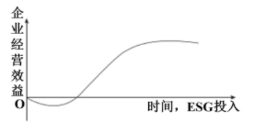
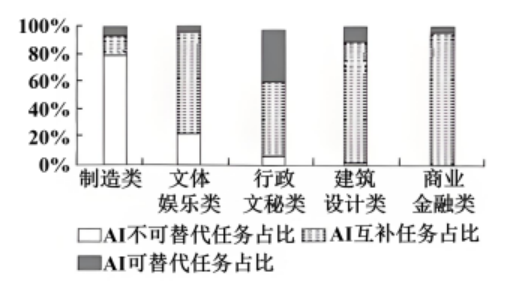

**2024年普通高中学业水平选择性考试（重庆卷）**

**思想政治**

**本试卷满分100分，考试时间75分钟**

**一、选择题（本大题共16小题，每小题3分，共48分。在每小题给出的四个选项中，只有一项是最符合题目要求的）。**

实事求是是马克思主义的精髓和灵魂，是中国共产党的思想路线，也是党的基本思想方法、工作方法和领导方法。阅读材料，完成下面小题。

1\. 东汉史学家班固在《汉书》中称赞河间献王刘德“修学好古，实事求是”；唐代学者颜师古将“实事求是”注为“务得事实，每求真是也”；清代学者阮元说：“余之说经，推明古训，实事求是而已，非敢立异也。”下列说法正确的是（ ）

①作为一种治学态度和治学方法，“实事求”在中国源远流长

②弘扬传统文化中“实事求是”精神，需要“推陈出新，革故鼎新”

③倡导“实事求是”的中华传统文化，是中国近代科学兴起的基础

④中华传统文化蕴含的“实事求是”思想，具有超越时代条件的特质

A. ①② B. ①④ C. ②③ D. ③④

2\. 马克思、恩格斯没有直接用过“实事求是”这个词汇。1941年，毛泽东在《改造我们的学习》一文中，首次用“实事求是”一词生动概括了马克思主义世界观和方法论，并在领导中国革命和建设过程中，实际上将其确立为党的思想路线。由此可知（ ）

①马克思主义理论中原本没有“实事求是”这一思想内涵

②实事求是是一切真正的马克思主义者必须坚持的正确认识路线

③毛泽东倡导的“实事求是”只适用于中国革命和社会主义建设特定时期

④毛泽东将“实事求是”确立为党的思想路线，是对党的建设理论的丰富发展

A. ①③ B. ①④ C. ②③ D. ②④

3\. 习近平指出，“实践反复证明，坚持实事求是，就能兴党兴国；违背实事求是，就会误党误国。”对此，说法正确的是（ ）

①坚持实事求是，是兴党兴国的充分必要条件

②坚持实事求是就是坚持唯物主义，违背实事求是就会陷入形而上学

③对坚持实事求是与兴党兴国关系的规律性认识，根源于对经验教训的归纳推理

④对治党兴国历史经验教训的归纳推理，运用了求同求异并用法

A. ①② B. ①④ C. ②③ D. ③④

4\. 重庆市整治形式主义，既做减法，也做加法。减法是减掉形式主义的桎梏，让基层干部从繁文缛节、文山会海、迎来送往中解脱出来。加法是用数字技术赋能政府，以“一张表”简化数据填报、“一平台”优化系统操作、“一件事”强化办事效率，推动政务服务提质增效。由此可见（ ）

①整治形式主义的效果取决于智能高效政府建设成效

②做减法应坚持实事求是，明晰且落实基层政府职责

③做加法是政府通过数字技术，用“算力”解放“人力”

④做减法和做加法目的是确保政府权力在法治框架内运行

A. ①③ B. ①④ C. ②③ D. ②④

5\. 习近平强调，在五千多年中华文明深厚基础上开辟和发展中国特色社会主义，把马克思主义基本原理同中国具体实际、同中华优秀传统文化相结合是必由之路。马克思主义中国化时代化这个重大命题本身就决定，我们决不能抛弃马克思主义这个魂脉，决不能抛弃中华优秀传统文化这个根脉。下列说法正确的是（ ）

①坚守马克思主义魂脉和中华优秀传统文化根脉，必须不断推进“两个结合”

②“两个结合”强调马克思主义与中华优秀传统文化在立场观点方法上的一致性

③“第二个结合”是中国共产党跳出治乱兴衰历史周期率的第二个答案

④“第二个结合”使中国特色社会主义具有深远历史纵深和深厚文化根基

A. ①② B. ①④ C. ②③ D. ③④

6\. 从产品出海到品牌出海再到全链生态出海，我国企业出海不断升级、亮点纷呈，下表简要展示了我国企业出海进程。材料表明（ ）

|                   |                                           |
| ----------------- | ----------------------------------------- |
| 20世纪80年代          | 借助劳动力成本优势发展加工贸易，成衣、玩具等轻工产品出海              |
| 2001年加入WTO        | 出海产品结构升级，服装、家具、家电“老三样”成为出口主力              |
| 2013年“一带一路”倡议     | 零售、时尚、电子企业加速全球布局，跨境电商崛起助推品牌出海             |
| 2022年以来高水平对外开放新阶段 | 新能源车、锂电池、太阳能电池“新三样”畅销海外，产品、技术、人才、管理全链生态出海 |

①我国对外开放由吸引外资转向对外投资

②我国产业比较优势变迁推动了企业出海升级

③我国企业出海升级减少了进口国的贸易利得

④“新三样”出海顺应了全球应对气候变化的市场需求

A. ①③ B. ①④ C. ②③ D. ②④

7\. ESG关注企业的环保责任（Environmental）、社会责任（Social）、治理绩效（Governance），而非单一的财务绩效，已成为世界各国日益重视的投资新理念。下图绘制了企业ESG投入与经营效益间的关系随时间变化的曲线。由此可知（ ）

①ESG投入越多，企业的经营效益越好

②长期的ESG投入能够给企业带来品牌溢价

③短期的ESG投入可能导致企业经营效益下滑

④ESG理念反映出企业核心竞争优势发生转变

A. ①③ B. ①④ C. ②③ D. ②④

人工智能（AI）快速发展，对社会生产生活产生了重大影响。阅读材料，回答下面小题。

8\. 某国际知名研究机构将美国主要职业的“复杂任务”分为AI不可替代、AI互补和AI可替代三类，并估算了这三类任务的占比情况（如图），认为AI可替代任务占比超过50%的职业，被当前迅速发展的生成式AI替代的风险很高。对此，理解正确的是（ ）

美国主要职业（节选）的“复杂任务”AI可替代性分布情况

①AI应用推动了不同类型的职业优胜劣汰

②AI应用不会改变劳动在价值创造中重要性

③AI可替代任务占比更低的职业，属于低技能型职业

④AI可替代任务占比更高的职业，劳动生产率增长潜力更大

A. ①③ B. ①④ C. ②③ D. ②④

9\. “耳听为虚，眼见未必为实。”Sora等文生视频大模型能生成几乎可以“以假乱真”的视频（如图）。这种技术的快速迭代和广泛应用，将深刻影响人们对世界的认知。关于Sora，说法正确的是（ ）

A. Sora根据人的主观要求生成的视频，不是对现实世界的反映

B. 归根结底，Sora等大模型生成的视频仍是人类社会实践的产物

C. Sora能生成“以假乱真”视频，说明真与假的对立性是相对的

D. Sora广泛应用于“深度造假”，将导致世界真实面目不可认识

10\. 全国人大代表一头连着我国最高国家权力机关，一头连着广大人民群众。2023年6月，全国人大常委会新设立代表工作委员会。该机构成立以来，实现了统筹管理全国人大代表议案建议工作的若干“首次”（如表）。全国人大常委会设立代表工作委员会（ ）

|          |                                                     |
| -------- | --------------------------------------------------- |
| 2023年9月  | 首次召开代表建议办理推进会，督促各承办单位按时保质办理代表建议                     |
| 2023年10月 | 首次召开代表议案建议分析座谈会，引导各承办单位充分发挥议案建议在全面深化改革、解决群众反映难题中的作用 |
| 2024年2月  | 根据代表议案建议落实转化情况，首次发布10个高质量审议办理的典型案例                  |

①为全国人大代表提出议案建议提供了体制保障

②使其承担审议办理全国人大代表议案建议的专门职责

③适应了全国人大代表议案建议工作高质量发展的需求

④有利于将人民群众的智慧转化为推动国家发展的政策措施

A. ①② B. ①④ C. ②③ D. ③④

11\. 针对消防通道占用、网吧接纳未成年人等违法行为，乡镇（街道）由于行政执法权限相对缺失，常常陷入“看得见管不着”的困境。对此，重庆市通过梳理现行法律法规确定27项镇街法定行政执法事项，并结合基层实际依法赋予镇街99项区县级行政执法事项，综合形成镇街“一张行政执法清单”。该举措（ ）

①使镇街的行政执法权实现了从无到有的变革

②扩大镇街行政执法事项以适应基层治理需要

③有利于科学配置上下级行政机关间的执法权限

④体现出镇街比上级行政机关承担更多政府职责

A. ①③ B. ①④ C. ②③ D. ②④

12\. 美国国务卿布林肯表示：在国际体系中，如果你不坐在餐桌上，就会出现在菜单上。联合国发言人表示：联合国有一张给193个成员国的大桌子，大家一起讨论那些没有任何国家能独立解决的问题，没人在菜单上。中国外交部长王毅表示：不能再允许谁的拳头大谁说了算，更不能允许有的国家必须在餐桌上、有的国家只能在菜单里。对此，理解正确的是（ ）

①布林肯的“餐桌论”体现了美国外交活动坚持零和博弈的思维

②“大桌子”表明了联合国以集体协商的方式解决所有国际事务

③目前国际环境日趋复杂，一国综合国力是维护其国家利益的保障

④当今霸权主义有所上升，王毅表态代表美国之外其他国家的共同心声

A. ①③ B. ①④ C. ②③ D. ②④

13\. 1968年，美国工程师提出“太空电站”构想：在太空建设太阳能电站，将电磁能无线传输到地面接收站。随着相关理论和技术的突破，2021年，中国首个空间太阳能电站实验基地在重庆开工建设。下列说法正确的是（ ）

A. 运用超前思维的“太空电站”构想，脱离了当时特定的社会历史条件

B. 唯有突破太空太阳能发电及其无线传输等本质联系，才能建成太空电站

C. 在远离地球的太空建设电站，其遵循的规律有别于地球上的物理运动规律

D. 从科学构想到技术突破再到实验验证，体现了科技发展的曲折性和前进性

14\. 2024年春节前夕，湖北遭遇“天上是雨，落地为冰”极端天气，不少人受困高速公路。天寒地冻之际，有附近村民免费发放食物与开水，也有村民发现商机，提供有偿服务，泡好的方便面10元一桶，开水5元一杯，解决了众多受困者的燃眉之急。对此，认识正确的是（ ）

①一方有难，八方支援，无私相助，宜大力提倡

②救人急难，有偿服务，兼顾多方利益，亦是雪中送炭

③有偿服务实属“趁冷打劫”，有违社会主义核心价值观

④无私相助，乐于奉献，是社会主义市场经济的基本要求

A. ①② B. ①③ C. ②④ D. ③④

15\. 老李丧偶后，独自抚养子女成人。子女大学毕业后赴外地工作定居。由于担心老无所依，老李与同小区居住的侄子李某订立了成年意定监护协议，约定由李某担任自己的意定监护人。关于该协议，说法正确的是（ ）

①既然订立了该协议，李某就应该对老李履行赡养义务

②李某履行该协议时，应最大程度尊重老李的真实意愿

③尽管订立了该协议，子女还是应尽可能常回家探望父亲

④老李与社会脱节易上当受骗，未经子女同意不能订立该协议

A. ①③ B. ①④ C. ②③ D. ②④

16\. “远亲不如近邻。”关于处理相邻关系，正确的是（ ）

A. 小赵家的婴儿经常半夜啼哭吵醒楼下住户，小赵认为已关闭自家门窗，邻居应予包容

B. 小孙在阳台用农家肥种菜，产生的异味令四邻难以忍受，小孙认为在自家阳台种菜，没有妨碍他人

C. 小李家的果树年年修剪，仍大面积遮挡邻居家窗户，被邻居投诉，小李认为果树种植在自家院坝，他人无权干涉

D. 小钱将自家入户门由向内开改为向外开，导致邻居出行通道狭窄，邻居要求整改，小钱认为自家房门改装与邻居无关

**二、非选择题（本大题共2小题，共52分）。**

17\. 今年是中华人民共和国成立75周年。中国始终是维护世界和平与发展的积极因素和坚定力量，从来没有因为“中国威胁论”而威胁世界和平与发展。中国的发展历经各种困难挑战走到今天，没有因为“中国崩溃论”而崩溃，也不会因为“中国见顶论”而见顶。

材料一 几十年来，西方一直流传着关于中国发展的各种论调，如下表。

|     |                                      |                    |                             |
| --- | ------------------------------------ | ------------------ | --------------------------- |
|     | 中国威胁论                                | 中国崩溃论              | 中国见顶论                       |
| 主要  | 中国制度和发展模式的有效性对西方构成威胁；中国利用经济手段胁迫他国，影响 | 中国经济正在衰退，并开始崩溃，将拖累 | 随着人口红利消失，科技遭遇打压，经济被“脱钩断链”，中 |

|     |                                             |                          |                                  |
| --- | ------------------------------------------- | ------------------------ | -------------------------------- |
| 内容  | 国际公平秩序；中国低价倾销过剩产能，损害国际产业链供应链安全；中国军力增强威胁世界安全 | 全球经济；中国的制度和体制必然被西方资本主义取代 | 国经济增速将放缓，经济总量永远不会超过美国，差距甚至会进一步拉大 |

材料二 面对上述论调，我们要坚持把自己的事情办好，推动经济发展质量变革、效率变革、动力变革，不断壮大我国经济实力、科技实力、综合国力。

一般而言，劳动（包括劳动力数量和质量）、资本、技术是推动经济增长的核心要素，如图描述了2012—2050年我国GDP增长的动力分解及人均GDP的变化情况。

注：2021—2023年为实际值；2025—2050年为潜在值。

材料三 我们党历来重视发展生产力，尤其重视通过科技进步发展生产力。毛泽东指出，“不搞科学技术，生产力无法提高。”邓小平提出，“科学技术是第一生产力。”习近平强调，“发展新质生产力是推动高质量发展的内在要求和重要着力点，必须继续做好创新这篇大文章，推动新质生产力加快发展”，“必须进一步全面深化改革，形成与之相适应的新型生产关系。”

（1）结合材料一，运用《政治与法治》《当代国际政治与经济》相关知识，批驳西方关于中国这些论调。

（2）根据材料二图示，概括2012-2023年我国经济增长动力结构的演变特征。

（3）结合材料二，说明在人口红利逐步减少的背景下，达到2050年潜在GDP增长目标，我国应如何推动经济增长动力变革。

（4）结合材料三，运用社会历史发展规律的相关知识，说明中国经济发展能够行稳致远的根本原因。

18\. 材料一 新中国成立以来，我国高度重视科技发展，形成了科技创新的举国体制，科学技术发展取得巨大成就。但与西方发达国家相比，当前我国的科技水平还存在不小差距，特别在高端芯片、现代信息技术等领域还存在“卡脖子”问题。

材料二 为推进鸿蒙操作系统的开发和应用，解决“卡脖子”问题，华为公司一方面在核心技术、硬件设备、应用生态等层面加快专利布局，另一方面与各科技平台加强协作，推动鸿蒙生态的建设。在此过程中，央视网、支付宝、微信在越来越多的平台宣布启动鸿蒙原生应用开发，或与华为公司达成协议，共建鸿蒙生态。截至2024年4月，加入鸿蒙生态的应用已超过4000个。

（1）结合材料一，运用《逻辑与思维》中的辩证否定观，谈谈解决当下我国“卡脖子”问题的主要思路。

（2）结合材料二，运用《法律与生活》相关知识，分析知识产权与合同制度对科技创新的积极作用。
