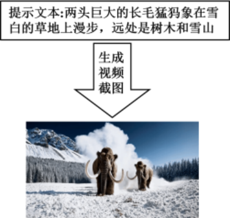
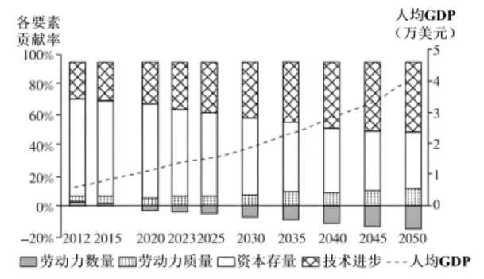

**2024年普通高中学业水平选择性考试（重庆卷）**

**思想政治**

**本试卷满分100分，考试时间75分钟**

**一、选择题（本大题共16小题，每小题3分，共48分。在每小题给出的四个选项中，只有一项是最符合题目要求的）。**

实事求是是马克思主义的精髓和灵魂，是中国共产党的思想路线，也是党的基本思想方法、工作方法和领导方法。阅读材料，完成下面小题。

1\. 东汉史学家班固在《汉书》中称赞河间献王刘德“修学好古，实事求是”；唐代学者颜师古将“实事求是”注为“务得事实，每求真是也”；清代学者阮元说：“余之说经，推明古训，实事求是而已，非敢立异也。”下列说法正确的是（ ）

①作为一种治学态度和治学方法，“实事求是”在中国源远流长

②弘扬传统文化中“实事求是”精神，需要“推陈出新，革故鼎新”

③倡导“实事求是”的中华传统文化，是中国近代科学兴起的基础

④中华传统文化蕴含的“实事求是”思想，具有超越时代条件的特质

A. ①② B. ①④ C. ②③ D. ③④

2\. 马克思、恩格斯没有直接用过“实事求是”这个词汇。1941年，毛泽东在《改造我们的学习》一文中，首次用“实事求是”一词生动概括了马克思主义世界观和方法论，并在领导中国革命和建设过程中，实际上将其确立为党的思想路线。由此可知（ ）

①马克思主义理论中原本没有“实事求是”这一思想内涵

②实事求是是一切真正的马克思主义者必须坚持的正确认识路线

③毛泽东倡导的“实事求是”只适用于中国革命和社会主义建设特定时期

④毛泽东将“实事求是”确立为党的思想路线，是对党的建设理论的丰富发展

A. ①③ B. ①④ C. ②③ D. ②④

3\. 习近平指出，“实践反复证明，坚持实事求是，就能兴党兴国；违背实事求是，就会误党误国。”对此，说法正确的是（ ）

①坚持实事求是，是兴党兴国的充分必要条件

②坚持实事求是就是坚持唯物主义，违背实事求是就会陷入形而上学

③对坚持实事求是与兴党兴国关系的规律性认识，根源于对经验教训的归纳推理

④对治党兴国历史经验教训的归纳推理，运用了求同求异并用法

A. ①② B. ①④ C. ②③ D. ③④

4\. 重庆市整治形式主义，既做减法，也做加法。减法是减掉形式主义的桎梏，让基层干部从繁文缛节、文山会海、迎来送往中解脱出来。加法是用数字技术赋能政府，以“一张表”简化数据填报、“一平台”优化系统操作、“一件事”强化办事效率，推动政务服务提质增效。由此可见（ ）

①整治形式主义的效果取决于智能高效政府建设成效

②做减法应坚持实事求是，明晰且落实基层政府职责

③做加法是政府通过数字技术，用“算力”解放“人力”

④做减法和做加法目的是确保政府权力在法治框架内运行

A. ①③ B. ①④ C. ②③ D. ②④

【答案】1. A 2. D 3. B 4. C

【解析】

【1题详解】

①：中华优秀传统文化“实事求是”一词源自东汉时期的《汉书》，代代传承发展到现在，说明“实事求是”作为一种治学态度和治学方法，在中国源远流长，①正确；

②：唐代、清代学者对“实事求是”的解读不同，说明弘扬传统文化中“实事求是”精神，需要“推陈出新，革故鼎新”，②正确；

③：倡导“实事求是”的中华传统文化并不是中国近代科学兴起的基础，③夸大了其作用，错误；

④：每一种文化都是特定时代的产物，不能超越时代条件的限制，④错误。

故本题选A。

【2题详解】

①：马克思主义理论中虽然没有直接用过“实事求是”这一词汇，但其世界观和方法论包含着“实事求是”的思想内涵，①错误；

②：党的思想路线结合材料内容可知，“实事求是”一词生动概括了马克思主义世界观和方法论，这是一切真正的马克思主义者必须坚持的正确认识路线，②正确；

③：“实事求是”虽然是在毛泽东领导中国革命和建设过程中被确立为党的思想路线，但并不只适用于中国革命和社会主义建设特定时期，③错误；

④：马克思、恩格斯没有直接用过“实事求是”这个词汇，毛泽东首次用“实事求是”概括了马克思主义世界观和方法论，并将其确立为党的思想路线，是对党的建设理论的丰富发展，④正确。

故本题选D。

【3题详解】

①④：正确运用假言判断、归纳推理的方法根据习近平的论述，实践反复证明，坚持实事求是，就能兴党兴国，否则就会误党误国，从判断的角度看，这属于充分必要条件的假言判断，即坚持实事求是是兴党兴国的充分必要条件，而从推理的角度看，这是运用了求同求异并用法对治党兴国的历史经验教训进行的不完全归纳推理，①④正确；

②：坚持实事求是就是坚持唯物主义，违背实事求是就会陷入唯心主义，②错误；

③：实践是认识的来源，对坚持实事求是与兴党兴国关系的规律性认识，根源于实践，③错误。

故本题选B。

【4题详解】

①：整治形式主义的效果体现了智能高效政府建设的成效，而不是取决于智能高效政府建设的成效，①错误。

②：重庆市整治形式主义中的“减法”是减掉形式主义的桎梏，让基层干部从繁文缛节、文山会海、迎来送往中解脱出来，这就应坚持实事求是，明晰且落实基层政府职责，②正确。

③：重庆市整治形式主义中的“加法”是用数字技术赋能政府，以“三个一”推动政务服务提质增效，可见政府用“算力”解放“人力” ，③正确 。

④：整治形式主义，无论是做减法还是做加法，其目的都是建设服务型政府，为人民服务，该做法有利于政府权力在法治框架内运行，④错误。

故本题选C。

5\. 习近平强调，在五千多年中华文明深厚基础上开辟和发展中国特色社会主义，把马克思主义基本原理同中国具体实际、同中华优秀传统文化相结合是必由之路。马克思主义中国化时代化这个重大命题本身就决定，我们决不能抛弃马克思主义这个魂脉，决不能抛弃中华优秀传统文化这个根脉。下列说法正确的是（ ）

①坚守马克思主义魂脉和中华优秀传统文化根脉，必须不断推进“两个结合”

②“两个结合”强调马克思主义与中华优秀传统文化在立场观点方法上的一致性

③“第二个结合”是中国共产党跳出治乱兴衰历史周期率的第二个答案

④“第二个结合”使中国特色社会主义具有深远历史纵深和深厚文化根基

A. ①② B. ①④ C. ②③ D. ③④

【答案】B

【解析】

【详解】①：马克思主义中国化时代化这个重大命题本身就决定，我们决不能抛弃马克思主义这个魂脉，决不能抛弃中华优秀传统文化这个根脉，这表明坚守马克思主义魂脉和中华优秀传统文化根脉，必须不断

推进“两个结合”，①正确。

②：“第二个结合”强调马克思主义与中华优秀传统文化在立场观点方法上的一致性，而不是“两个结合”，②不选。

③：党的自我革命是中国共产党跳出治乱兴衰历史周期率的第二个答案，③错误。

④：在五千多年中华文明深厚基础上开辟和发展中国特色社会主义，把马克思主义基本原理同中国具体实际、同中华优秀传统文化相结合是必由之路，这说明“第二个结合”使中国特色社会主义具有深远历史纵深和深厚文化根基，④正确。

故本题选B。

6\. 从产品出海到品牌出海再到全链生态出海，我国企业出海不断升级、亮点纷呈，下表简要展示了我国企业出海进程。材料表明（ ）

|                   |                                           |
| ----------------- | ----------------------------------------- |
| 20世纪80年代          | 借助劳动力成本优势发展加工贸易，成衣、玩具等轻工产品出海              |
| 2001年加入WTO        | 出海产品结构升级，服装、家具、家电“老三样”成为出口主力              |
| 2013年“一带一路”倡议     | 零售、时尚、电子企业加速全球布局，跨境电商崛起助推品牌出海             |
| 2022年以来高水平对外开放新阶段 | 新能源车、锂电池、太阳能电池“新三样”畅销海外，产品、技术、人才、管理全链生态出海 |

①我国对外开放由吸引外资转向对外投资

②我国产业比较优势变迁推动了企业出海升级

③我国企业出海升级减少了进口国的贸易利得

④“新三样”出海顺应了全球应对气候变化的市场需求

A. ①③ B. ①④ C. ②③ D. ②④

【答案】D

【解析】

【详解】①：在我国对外开放进程中，坚持引进来和走出去相结合，而不是由吸引外资转向对外投资，①不选。

②④：我国企业从20世纪80年代借助劳动力成本优势发展加工贸易，轻工产品出海，到加入世界贸易组织后的“老三样”产品成为出口主力，再到“一带一路”倡议跨境电商崛起助推品牌出海，最后到2022年以来高水平对外开放新阶段出现的“新三样”出海，这表明我国产业比较优势的变迁推动了企业出海升级，新能源车、锂电池、太阳能电池“新三样”出海则顺应了全球应对气候变化的市场需求，②④符合题意。

③：我国企业出海升级有利于满足进口国更高水平的消费需求，而不是减少进口国的贸易利得，③错误。

故答案选D。

7\. ESG关注企业的环保责任（Environmental）、社会责任（Social）、治理绩效（Governance），而非单一的财务绩效，已成为世界各国日益重视的投资新理念。下图绘制了企业ESG投入与经营效益间的关系随时间变化的曲线。由此可知（ ）

①ESG投入越多，企业的经营效益越好

②长期的ESG投入能够给企业带来品牌溢价

③短期的ESG投入可能导致企业经营效益下滑

④ESG理念反映出企业核心竞争优势发生转变

A. ①③ B. ①④ C. ②③ D. ②④

【答案】C

【解析】

【详解】①③：企业的经营与发展由图可知，在最初阶段，随着ESG投入增加，企业的经营效益不断减少，说明短期的ESG投入可能导致企业经营效益下滑，但达到一定程度后，随着ESG投入持续增加，企业的经营效益不断增加，说明长期的ESG投入会带来企业经营效益的提升，③正确，①错误。

②品牌溢价是指消费者愿意为某个品牌支付超出同类产品标准价格的额外费用，长期的ESG投入会提升企业的经营效益，也就意味着能够给该企业带来品牌溢价，②正确。

④：ESG理念关注环保责任、社会责任和治理绩效，而非单一的财务绩效，但并没有体现企业核心竞争优势发生转变，④错误。

故答案选C。

人工智能（AI）快速发展，对社会生产生活产生了重大影响。阅读材料，回答下面小题。

8\. 某国际知名研究机构将美国主要职业的“复杂任务”分为AI不可替代、AI互补和AI可替代三类，并估算了这三类任务的占比情况（如图），认为AI可替代任务占比超过50%的职业，被当前迅速发展的生成式AI替代的风险很高。对此，理解正确的是（ ）

美国主要职业（节选）的“复杂任务”AI可替代性分布情况

①AI应用推动了不同类型的职业优胜劣汰

②AI应用不会改变劳动在价值创造中的重要性

③AI可替代任务占比更低的职业，属于低技能型职业

④AI可替代任务占比更高职业，劳动生产率增长潜力更大

A ①③ B. ①④ C. ②③ D. ②④

9\. “耳听为虚，眼见未必为实。”Sora等文生视频大模型能生成几乎可以“以假乱真”的视频（如图）。这种技术的快速迭代和广泛应用，将深刻影响人们对世界的认知。关于Sora，说法正确的是（ ）

A. Sora根据人的主观要求生成的视频，不是对现实世界的反映

B. 归根结底，Sora等大模型生成的视频仍是人类社会实践的产物

C. Sora能生成“以假乱真”视频，说明真与假的对立性是相对的

D. Sora广泛应用于“深度造假”，将导致世界真实面目不可认识

【答案】8. D 9. B

【解析】

【8题详解】

①：不同类型的职业都有其存在的价值，AI应用对不同职业的影响不同，但并不会推动不同类型的职业之间优胜劣汰，①错误。

②：劳动创造价值，AI虽然被广泛应用，但不会改变劳动在价值创造中的重要性，②正确。

③：AI可替代任务占比更低的职业，被AI替代的风险更低，属于高技能型职业，③错误。

④：AI可替代任务占比更高的职业，被AI替代的风险更高，说明这些职业中的许多重复性和常规性任务可以通过AI技术自动化完成，从而提高工作效率和准确性，劳动生产率增长潜力更大，④正确。

故本题选D。

【9题详解】

A：物质决定意识，意识是对客观事物的主观映象。Sora等文生视频大模型是根据人的提示文本（这些文本内容都来自于客观世界），才生成“以假乱真”的视频，说明Sora生成的视频，归根结底是对现实世界的反映，A错误。

B：Sora等文生视频大模型是人类创造的，它是根据人的提示文本（这些文本内容都来自于客观世界），才生成“以假乱真”的视频，说明归根结底，Sora等大模型生成的视频仍是人类社会实践的产物，B正确。

C：真与假的对立性是绝对的，而不是相对的，C错误。

D：世界是可知的，虽然Sora广泛应用于“深度造假”，但世界的真实面目仍可认识，D错误。

故本题选B。

10\. 全国人大代表一头连着我国最高国家权力机关，一头连着广大人民群众。2023年6月，全国人大常委会新设立代表工作委员会。该机构成立以来，实现了统筹管理全国人大代表议案建议工作的若干“首次”（如表）。全国人大常委会设立代表工作委员会（ ）

|          |                                                     |
| -------- | --------------------------------------------------- |
| 2023年9月  | 首次召开代表建议办理推进会，督促各承办单位按时保质办理代表建议                     |
| 2023年10月 | 首次召开代表议案建议分析座谈会，引导各承办单位充分发挥议案建议在全面深化改革、解决群众反映难题中的作用 |
| 2024年2月  | 根据代表议案建议落实转化情况，首次发布10个高质量审议办理的典型案例                  |

①为全国人大代表提出议案建议提供了体制保障

②使其承担审议办理全国人大代表议案建议的专门职责

③适应了全国人大代表议案建议工作高质量发展的需求

④有利于将人民群众的智慧转化为推动国家发展的政策措施

A. ①② B. ①④ C. ②③ D. ③④

【答案】D

【解析】

【详解】③④：全国人大常委会设立代表工作委员会，召开代表建议办理推进会、议案建议分析座谈会、推动议案建议落实转化，有利于加强和改进全国人大代表议案建议工作，适应了全国人大代表议案建议工作高质量发展的需求，有利于将人民群众的智慧转化为推动国家发展的政策措施，③④正确。

①：全国人大常委会代表工作委员会是全国人大常委会的工作机构，不会为全国人大代表提出议案建议提供体制保障，①错误。

②：全国人大常委会代表工作委员会负责全国人大代表议案建议工作的统筹管理，但并不承担审议办理全国人大代表议案建议，②错误。

故本题选D。

11\. 针对消防通道占用、网吧接纳未成年人等违法行为，乡镇（街道）由于行政执法权限相对缺失，常常陷入“看得见管不着”的困境。对此，重庆市通过梳理现行法律法规确定27项镇街法定行政执法事项，并结合基层实际依法赋予镇街99项区县级行政执法事项，综合形成镇街“一张行政执法清单”。该举措（ ）

①使镇街的行政执法权实现了从无到有的变革

②扩大镇街行政执法事项以适应基层治理需要

③有利于科学配置上下级行政机关间的执法权限

④体现出镇街比上级行政机关承担更多政府职责

A. ①③ B. ①④ C. ②③ D. ②④

【答案】C

【解析】

【详解】②：法治政府结合基层实际依法赋予镇街99项区县级行政执法事项，说明该举措扩大了镇街行政执法事项以适应基层治理需要，②正确。

③：重庆市通过梳理现行法律法规确定27项镇街法定行政执法事项，并结合基层实际依法赋予镇街99项区县级行政执法事项，综合形成镇街“一张行政执法清单”，说明该举措有利于科学配置上下级行政机关间的执法权限，③正确。

①：镇街作为行政机关，原本就有一定的行政执法权，材料中的举措并非使镇街的行政执法权实现了从无到有的变革，①错误。

④：针对乡镇（街道）行政执法权限相对缺失的问题，重庆市通过梳理现行法律法规确定27项镇街法定行政执法事项，并结合基层实际依法赋予镇街99项区县级行政执法事项，这扩大了镇街行政执法事项，但并不意味着镇街承担比上级行政机关更多的政府职责，④错误。

故本题选C。

12\. 美国国务卿布林肯表示：在国际体系中，如果你不坐在餐桌上，就会出现在菜单上。联合国发言人表示：联合国有一张给193个成员国的大桌子，大家一起讨论那些没有任何国家能独立解决的问题，没人在菜单上。中国外交部长王毅表示：不能再允许谁的拳头大谁说了算，更不能允许有的国家必须在餐桌上、有的国家只能在菜单里。对此，理解正确的是（ ）

①布林肯的“餐桌论”体现了美国外交活动坚持零和博弈的思维

②“大桌子”表明了联合国以集体协商的方式解决所有国际事务

③目前国际环境日趋复杂，一国的综合国力是维护其国家利益的保障

④当今霸权主义有所上升，王毅的表态代表美国之外其他国家的共同心声

A. ①③ B. ①④ C. ②③ D. ②④

【答案】A

【解析】

【详解】①③：根据美国国务卿布林肯所谓的“餐桌论”，在国际体系中，一个国家要么坐在餐桌上，要么出现在菜单里，而联合国发言人和中国外交部长则反对“餐桌论”这既体现了美国外交活动奉行霸权主义、坚持零和博弈的思维，也反映了在目前日趋复杂的国际环境中，一国的综合国力是维护其国家利益的保障，①③符合题意。

②：根据联合国发言人的表示，大家一起讨论的是那些没有任何国家能独立解决的问题，而不是所有的问题，“所有”的说法过于绝对，②说法错误。

④：王毅的表态代表了爱好和平、向往发展的国家，特别是广大发展中国家的共同心声，而不是美国之外其他国家的共同心声，该选项的说法不符合实际，④说法错误。

故答案选A。

13\. 1968年，美国工程师提出“太空电站”构想：在太空建设太阳能电站，将电磁能无线传输到地面接收站。随着相关理论和技术的突破，2021年，中国首个空间太阳能电站实验基地在重庆开工建设。下列说法正确的是（ ）

A. 运用超前思维的“太空电站”构想，脱离了当时特定的社会历史条件

B. 唯有突破太空太阳能发电及其无线传输等本质联系，才能建成太空电站

C. 在远离地球的太空建设电站，其遵循的规律有别于地球上的物理运动规律

D. 从科学构想到技术突破再到实验验证，体现了科技发展的曲折性和前进性

【答案】D

【解析】

【详解】A：社会存在决定社会意识，美国工程师提出“太空电站”构想也是当时特定的社会历史条件的反映，A说法错误。

BC：尊重客观规律是正确发挥主观能动性的前提条件，想要建成“太空电站”，要遵循相关事物的本质联系，包括遵循地球上的物理运动规律，BC说法错误。

D：继美国工程师提出的构想以及随之而来的相关理论和技术的突破，这体现了事物的发展是前进性和曲折性的统一，D符合题意。

故答案选D。

14\. 2024年春节前夕，湖北遭遇“天上是雨，落地为冰”极端天气，不少人受困高速公路。天寒地冻之际，有附近村民免费发放食物与开水，也有村民发现商机，提供有偿服务，泡好的方便面10元一桶，开水5元一杯，解决了众多受困者的燃眉之急。对此，认识正确的是（ ）

①一方有难，八方支援，无私相助，宜大力提倡

②救人急难，有偿服务，兼顾多方利益，亦是雪中送炭

③有偿服务实属“趁冷打劫”，有违社会主义核心价值观

④无私相助，乐于奉献，是社会主义市场经济的基本要求

A. ①② B. ①③ C. ②④ D. ③④

【答案】A

【解析】

【详解】①②：在不少人因遭遇天寒地冻的极端天气而受困高速公路之际，附近有的村民免费发放食物与开水，有的村民发现商机，提供有偿服务，从而解决了众多受困者的燃眉之急，这体现了一方有难，八方支援，无私相助的精神，宜大力提倡，有的虽然是有偿服务，但也兼顾多方利益，亦是雪中送炭，救人急难，①②正确。

③④：有偿服务并没有违背社会主义核心价值观，无私相助、乐于奉献并不是社会主义市场经济的基本要求，③④错误。

故答案选A。

15\. 老李丧偶后，独自抚养子女成人。子女大学毕业后赴外地工作定居。由于担心老无所依，老李与同小区居住的侄子李某订立了成年意定监护协议，约定由李某担任自己的意定监护人。关于该协议，说法正确的是（ ）

①既然订立了该协议，李某就应该对老李履行赡养义务

②李某履行该协议时，应最大程度尊重老李的真实意愿

③尽管订立了该协议，子女还是应尽可能常回家探望父亲

④老李与社会脱节易上当受骗，未经子女同意不能订立该协议

A. ①③ B. ①④ C. ②③ D. ②④

【答案】C

【解析】

【详解】①：成年意定监护制度要求监护人在该成年人丧失或者部分丧失民事行为能力时，履行监护职责，而不是赡养义务，①不选。

②：丧偶且子女在外地工作定居的老李因担心老无所依而与同小区居住的侄子李某订立了成年意定监护协议，监护人李某在履行该协议时应最大程度尊重老李的真实意愿，履行好监护职责，②正确。

③：成年子女对父母的赡养义务，虽订立了成年意定监护协议，但老李的子女也要履行赡养义务，尽可能常回家探望父亲老李，③正确。

④：具有完全民事行为能力的成年人，可以与其近亲属、其他愿意担任监护人的个人或者组织事先协商，以书面形式确定自己的监护人。老李在订立成年意定监护协议时属于完全民事行为能力人，故无需经过其子女同意，④错误。

故本题选C。

16\. “远亲不如近邻。”关于处理相邻关系，正确的是（ ）

A. 小赵家的婴儿经常半夜啼哭吵醒楼下住户，小赵认为已关闭自家门窗，邻居应予包容

B. 小孙在阳台用农家肥种菜，产生的异味令四邻难以忍受，小孙认为在自家阳台种菜，没有妨碍他人

C. 小李家的果树年年修剪，仍大面积遮挡邻居家窗户，被邻居投诉，小李认为果树种植在自家院坝，他人无权干涉

D. 小钱将自家入户门由向内开改为向外开，导致邻居出行通道狭窄，邻居要求整改，小钱认为自家房门改装与邻居无关

【答案】A

【解析】

【详解】A：对于婴儿的啼哭声在已关闭门窗的情况下仍影响邻居休息，邻里之间应该互相体谅，和睦相处，A正确。

B：相邻关系民法典规定，不动产的相邻权利人应当按照有利生产、方便生活、团结互助、公平合理的原则，正确处理相邻关系，相邻关系一方在为自己便利行使权利时，应当照顾到相邻方的利益，即使是在自

己家的阳台种菜，也应该考虑到周围邻居的感受，尽量避免使用会产生强烈异味的肥料，B错误。

C：小李家的果树如果大面积遮挡邻居家的窗户，影响了邻居的采光权，这可能构成对邻居合法权益的侵犯，C错误。

D：如果小钱对自家入户门的改动导致邻居出行通道狭窄，影响了邻居的出行便利和安全，那么根据法律规定，小钱应当停止侵害、排除妨碍，需要将入户门恢复为向内开的状态，D错误。

故本题选A。

**二、非选择题（本大题共2小题，共52分）。**

17\. 今年是中华人民共和国成立75周年。中国始终是维护世界和平与发展的积极因素和坚定力量，从来没有因为“中国威胁论”而威胁世界和平与发展。中国的发展历经各种困难挑战走到今天，没有因为“中国崩溃论”而崩溃，也不会因为“中国见顶论”而见顶。

材料一 几十年来，西方一直流传着关于中国发展的各种论调，如下表。

|      |                                                                                 |                                            |                                                             |
| ---- | ------------------------------------------------------------------------------- | ------------------------------------------ | ----------------------------------------------------------- |
|      | 中国威胁论                                                                           | 中国崩溃论                                      | 中国见顶论                                                       |
| 主要内容 | 中国制度和发展模式的有效性对西方构成威胁；中国利用经济手段胁迫他国，影响国际公平秩序；中国低价倾销过剩产能，损害国际产业链供应链安全；中国军力增强威胁世界安全 | 中国经济正在衰退，并开始崩溃，将拖累全球经济；中国的制度和体制必然被西方资本主义取代 | 随着人口红利消失，科技遭遇打压，经济被“脱钩断链”，中国经济增速将放缓，经济总量永远不会超过美国，差距甚至会进一步拉大 |

材料二 面对上述论调，我们要坚持把自己的事情办好，推动经济发展质量变革、效率变革、动力变革，不断壮大我国经济实力、科技实力、综合国力。

一般而言，劳动（包括劳动力数量和质量）、资本、技术是推动经济增长的核心要素，如图描述了2012—2050年我国GDP增长的动力分解及人均GDP的变化情况。

注：2021—2023年为实际值；2025—2050年为潜在值。

材料三 我们党历来重视发展生产力，尤其重视通过科技进步发展生产力。毛泽东指出，“不搞科学技术，生产力无法提高。”邓小平提出，“科学技术是第一生产力。”习近平强调，“发展新质生产力是推动高质量发展的内在要求和重要着力点，必须继续做好创新这篇大文章，推动新质生产力加快发展”，“必须进一步全面深化改革，形成与之相适应的新型生产关系。”

（1）结合材料一，运用《政治与法治》《当代国际政治与经济》相关知识，批驳西方关于中国的这些论调。

（2）根据材料二图示，概括2012-2023年我国经济增长动力结构的演变特征。

（3）结合材料二，说明在人口红利逐步减少的背景下，达到2050年潜在GDP增长目标，我国应如何推动经济增长动力变革。

（4）结合材料三，运用社会历史发展规律的相关知识，说明中国经济发展能够行稳致远的根本原因。

【答案】（1）①西方的上述论调基于政治制度、意识形态的差异和国家利益竞争冲突，通过妖魔化中国国际形象，打压和阻碍中国的正常发展。②中国坚持相互尊重、合作共赢，走和平发展道路，是维护世界和平与发展的积极因素和坚定力量。中国的发展不但不会构成对世界的威胁，反而有利于世界的和平与发展，“中国威胁论”极其荒谬。③在中国共产党领导下，中华民族迎来了从站起来、富起来到强起来的伟大飞跃，充分证明了中国制度的优越性和道路的正确性。当前中国正走在民族复兴的康庄大道上，不仅不会“见顶”，更不会“崩溃”。

（2）①资本存量对经济增长的贡献逐渐降低；②劳动力数量对经济增长的贡献逐渐降低并在2015年前后由正转负，劳动力质量对经济增长的贡献稳步提升（或基本稳定）；③技术进步对经济增长的贡献越来越大。

（3）①贯彻创新发展理念，坚持创新在我国现代化建设全局中的核心地位，不断提高技术进步对经济增长的贡献；②实施人才强国战略，培养创新性人才，推动人口红利向人才红利转化，不断提高劳动力质量对经济增长的贡献；③调动市场主体投资积极性，优化投资结构，不断提高投资效率。 

（4）①深刻认识到生产方式是社会历史发展的决定力量；深刻把握生产关系一定要适应生产力状况、上层建筑一定要适应经济基础状况的规律；②高度重视发展生产力，与时俱进地推动科技创新，培育发展新质生产力，为中国经济发展行稳致远提供强大动能；③全面深化改革，不断完善新型生产关系，为中国经济发展行稳致远提供体制机制保障。

【解析】

【分析】背景素材：中华人民共和国成立75周年

考点考查：新发展理念、构建新发展格局、共产党的领导、中国的外交、社会历史的发展等

能力考查：获取和解读信息、调动和运用知识、描述和阐释事物

核心素养：政治认同、科学精神

【小问1详解】

第一步：审设问。明确主体、知识范围、问题限定和作答角度。本题的设问为批驳类，围绕其实质、为什么错误等角度回答。具体可运用国际关系的决定因素、我国的外交政策、中国共产党的作用等知识来作答。

第二步：审材料。提取关键词，链接教材知识。

关键词①：“中国威胁论”的内容；中国始终是维护世界和平与发展的积极因素和坚定力量，从来没有因为“中国威胁论”而威胁世界和平与发展→可联系中国走和平发展道路，是维护世界和平与发展的积极因素和坚定力量；

关键词②：“中国崩溃论”、“中国见顶论”→可联系中国共产党领导下，中华民族迎来了从站起来、富起来到强起来的伟大飞跃，充分证明了中国制度的优越性和道路的正确性；

关键词③：“中国威胁论”的内容、“中国崩溃论”的内容、“中国见顶论”的内容→可联系西方国家基于政治制度、意识形态的差异和国家利益竞争冲突，通过妖魔化中国国际形象，打压和阻碍中国的正常发展；

第三步：整合信息，组织答案。注意设问限定以及教材知识与材料、时政信息等相结合。

【小问2详解】

第一步：审设问。明确主体、知识范围、问题限定和作答角度。本题的设问为图表概括反映类，审标题、内容、小注，将数字完成语言转换的基础上深入本质。

第二步：审材料。提取关键词，链接教材知识。

关键词①：资本存量的变化情况→可联系资本存量对经济增长的贡献逐渐降低；

关键词②：劳动力数量和劳动力质量的变化情况→可联系劳动力数量对经济增长的贡献逐渐降低并在2015年前后由正转负，劳动力质量对经济增长的贡献稳步提升（或基本稳定）；

关键词③：技术进步的变化情况→可联系技术进步对经济增长的贡献越来越大；

第三步：整合信息，组织答案。注意设问限定以及教材知识与材料、时政信息等相结合。

【小问3详解】

第一步：审设问。明确主体、知识范围、问题限定和作答角度。本题的设问为措施类，多角度结合材料分析作答。具体可运用新发展理念、高质量发展的知识来作答。

第二步：审材料。提取关键词，链接教材知识。

关键词①：技术进步对经济增长的贡献率越来越大→可联系创新发展理念；

关键词②：劳动力数量和质量对经济增长的贡献情况→可联系人才强国战略；

关键词③：资本存量对经济增长的贡献逐渐降低→可联系调动市场主体投资积极性，优化投资结构；

第三步：整合信息，组织答案。注意设问限定以及教材知识与材料、时政信息等相结合。

【小问4详解】

第一步：审设问。明确主体、知识范围、问题限定和作答角度。本题的设问是为什么能类，找其具备的条件或做法。

第二步：审材料。提取关键词，链接教材知识。

关键词①：运用社会历史发展规律的相关知识→可联系生产方式是社会历史发展的决定力量；生产关系一定要适应生产力状况、上层建筑一定要适应经济基础状况的规律。

关键词②：我们党历来重视发展生产力，尤其重视通过科技进步发展生产力；“不搞科学技术，生产力无法提高。” “发展新质生产力是推动高质量发展内在要求和重要着力点，必须继续做好创新这篇大文章，推动新质生产力加快发展”→可联系推动科技创新，培育发展新质生产力，为中国经济发展行稳致远提供强大动能。

关键词③：进一步全面深化改革，形成与之相适应的新型生产关系→可联系不断完善新型生产关系，为中国经济发展行稳致远提供体制机制保障；

第三步：整合信息，组织答案。注意设问限定以及教材知识与材料、时政信息等相结合。

18\. 材料一 新中国成立以来，我国高度重视科技发展，形成了科技创新的举国体制，科学技术发展取得巨大成就。但与西方发达国家相比，当前我国的科技水平还存在不小差距，特别在高端芯片、现代信息技术等领域还存在“卡脖子”问题。

材料二 为推进鸿蒙操作系统的开发和应用，解决“卡脖子”问题，华为公司一方面在核心技术、硬件设备、应用生态等层面加快专利布局，另一方面与各科技平台加强协作，推动鸿蒙生态的建设。在此过程中，央视网、支付宝、微信在越来越多的平台宣布启动鸿蒙原生应用开发，或与华为公司达成协议，共建鸿蒙生态。截至2024年4月，加入鸿蒙生态的应用已超过4000个。

（1）结合材料一，运用《逻辑与思维》中的辩证否定观，谈谈解决当下我国“卡脖子”问题的主要思路。

（2）结合材料二，运用《法律与生活》相关知识，分析知识产权与合同制度对科技创新的积极作用。

【答案】（1）根据中国科技和产业发展现状及“卡脖子”现实，进一步扩大开放，引进吸收先进技术；通过完善新型举国体制，进一步推动科技创新，形成原创性、颠覆性技术，培育和发展新质生产力。

（2）①专利权是知识产权的一种类型，运用专利权等知识产权制度工具，能够保护合法权益、防范风险、激励创新。

②合同可以满足科技创新各方的特定需求，促成相互合作，有效配置资源，推动科技创新与发展。

【解析】

【详解】坚持辩证的否定观、专利权、合同（1）学生根据设问的知识范围“《逻辑与思维》中的辩证否定观”、方向定位“主要思路（如何做）”并结合材料一中当下我国“卡脖子”问题的背景及表现这一有效信息，可从引进吸收先进技术、进一步推动科技创新、培育和发展新质生产力等角度切入思考作答。

【归纳总结】辩证的否定观，图示如下：

（2）本题属于意义类主观题，要求学生结合材料二并运用《法律与生活》的相关知识，分析知识产权与合同制度对科技创新的积极作用。具体审答过程如下：

|                   |      |                                                 |
| ----------------- | ---- | ----------------------------------------------- |
| 材料信息              | 链接教材 | 答案要点                                            |
| 为推进鸿蒙操作系统……加快专利布局 | 专利权  | 专利权是知识产权的一种类型，运用专利权等知识产权制度工具，能够保护合法权益、防范风险、激励创新 |

|                        |     |                                           |
| ---------------------- | --- | ----------------------------------------- |
| 另一方面与各科技平台加强协作……共建鸿蒙生态 | 合同  | 合同可以满足科技创新各方的特定需求，促成相互合作，有效配置资源，推动科技创新与发展 |
