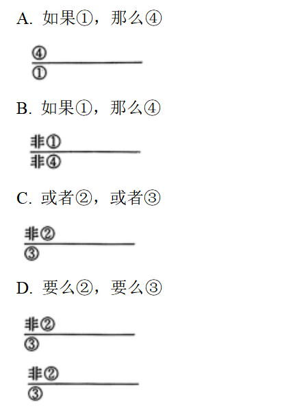

**2024年普通高中学业水平选择性考试·河北卷**

**思想政治**

**本试卷满分100分，考试时间75分钟。**

**一、选择题：本题共16小题，每小题3分，共48分，在每小题给出的A、B、C、D四个选项中，只有一项是符合题目要求的。**

1\. 中华人民共和国的成立，社会主义制度的建立，标志着我国踏上了自主建设现代化的新征途。党的十一届三中全会的召开，标志着中国式现代化道路正式开启。第一个百年奋斗目标的全面完成，标志着中国式现代化新道路经受了实践的检验。75年来，中国共产党带领全国人民一直奔跑在现代化的赛道上，前景无比光明。可见，中国式现代化（ ）

①是中国共产党领导的社会主义现代化 ②是我国自主创造的普遍适用的现代化

③是实现中华民族伟大复兴的光明大道 ④为解决人类共同问题提供了具体答案

A. ①② B. ①③ C. ②④ D. ③④

2\. 1975年，托马斯·海贝勒作为社会人类学专业博士生第一次到访中国。40多年来，多次访问中国的海贝勒见证了改革开放推动中国发生的巨大变化。他说，“一切都随着1978年改革开放的实施而改变。”中国的巨大变化表明，改革开放（ ）

①为实现我国工业化打下了初步基础 ②是决定当代中国命运的关键抉择

③标志着中国特色社会主义制度的完善 ④极大激发了人民群众的创造活力

A. ①③ B. ①④ C. ②③ D. ②④

3\. “飘扬的旗帜引领方向，复兴的民族热血沸腾，巨浪无阻前行的意志，自信的目光傲视风云……”一曲《领航》唱出了中华儿女在中国共产党的领导下勠力同心、勇毅前行的坚定信心。中国特色社会主义进入新时代，中华民族迎来了从站起来，富起来到强起来的伟大飞跃。实现这一飞跃，需要我们（ ）

①坚持习近平新时代中国特色社会主义思想科学指引

②全面借鉴其他社会主义国家的建设经验

③坚定不移地走中国特色社会主义道路

④以实现经济高速增长为根本目标

A. ①② B. ①③ C. ②④ D. ③④

4\. 2023中国服务业企业500强榜单发布。其中，国有企业在公路运输、港口服务等行业具有优势，民营企业则主要分布在互联网服务、物流及供应链等行业，两类企业有关指标见下图。

可见，榜单中的国有企业（ ）

①在行业分布上和民营企业存在差异

②数量越多越能发挥国有经济的主导作用

③平均营业收入和平均净利润高于民营企业

④研发费用高于民营企业

A. ①③ B. ①④ C. ②③ D. ②④

5\. 近期，河北省首笔企业数据资产质押贷款业务落地。作新型生产要素，数据为培育新质生产力奠定了坚实基础。数据价值评估涉及多个环节，与传统资产（房产、设备等）相比，需要考虑更多复杂因素。材料说明，开展数据资产质押贷款业务（ ）

①提高了银行信贷质量

②有利于释放数据潜能

③有助于提高企业资源利用效率

④表明数据资产和传统资产具有的风险相同

A. ①③ B. ①④ C. ②③ D. ②④

6\. 河南省开展“五星”党支部创建工作，明确“支部过硬星、产业兴旺星、生态宜居星、平安法治星、文明幸福星”5个方面、29项重点任务，将创成产业兴旺等4颗星作为获评支部过硬星的前提，从而把农村基层党组织建设成为有效实现党的领导、推进乡村全面振兴的坚强战斗堡垒。“五星”党支部创建（ ）

①推动了基层群众自治 ②发挥了党组织的政治引领作用

③夯实了党在基层执政的组织基础 ④凸显了新型政党制度的优越性

A. ①② B. ①④ C. ②③ D. ③④

7\. “选民连心人”是昆明市晋宁区人大代表联络机制的创新，即人大代表根据履职需要，在所属选区选择适当数量的选民作为“选民连心人”来协助了解民意、倾听民声、汇集民智。2023年，“选民连心人”收集民意344件，大批老百姓关心的事陆续得到解决。“选民连心人”机制有利于（ ）

①丰富人民民主实现形式 ②拓宽人民政治参与渠道

③延展人大代表履职范围 ④增加人民民主权利内容

A. ①② B. ①④ C. ②③ D. ③④

8\. 2024年1月1日，我国第一部专门性的未成年人网络保护综合立法《未成年人网络保护条例》正式实施。该条例在《中华人民共和国网络安全法》《儿童个人信息网络保护规定》《中华人民共和国未成年人保护法》基础上，完善了适应未成年人身心健康发展和网络空间治理规律特点的法规制度。由此可知，该条例的制定（ ）

①充分满足了未成年人诉求

②遵循了法律体系的内在逻辑

③标志着我国未成年人保护法律体系的完备

④汲取了我国关于未成年人立法的实践经验

A. ①② B. ①③ C. ②④ D. ③④

9\. 我国拥有全球最大的野生稻种质资源圃。科研人员在圃中能完成野生稻种质资源的收集、保存、保护和后期利用。近几十年来，我国水稻育种技术不断进步，来自野生稻的基因功不可没。人们对野生稻的探寻永不止步，水稻进化、种业振兴、粮食丰收的故事也将继续上演。这表明（ ）

①人对自然的认识和改造永无止境

②揭示事物发展规律是科学研究的最终目的

③正确认识规律就能解决社会面临的难题

④成功实践必须坚持主观能动性与客观规律性的统一

A. ①③ B. ①④ C. ②③ D. ②④

10\. 宣化城市传统葡萄园系统是全球首个以“城市农业文化遗产”命名的传统农业系统。该系统以传统漏斗架种植方式将葡萄栽培于庭院中，葡萄架周围种植蔬菜、花卉等，与民居浑然一体、相得益彰，呈现出生物多样性和多层次的立体人文景观特征。相较其他农业文化遗产，它既有经济与生态价值统一的共性，又有依托城市庭院发展农业经济的特色。材料表现出人们（ ）

①根据自身需要建立事物的客观联系

②坚持了矛盾的普遍性与特殊性的辩证统一

③坚持了客观与主观的具体的历史的统一

④运用系统优化方法实现整体最优目标

A. ①③ B. ①④ C. ②③ D. ②④

11\. 儿童是人类的未来，但大量儿童特别是发展中国家儿童依然面临饥饿、教育、卫生等方面的长期挑战。2023年，“中非携手暖童心”关爱非洲孤儿健康活动在非洲多国举行，中国使馆和驻有关国家医疗队赴当地孤儿院或相关机构开展健康体检义诊、捐赠爱心包等活动，传递中国温暖。由此可见（ ）

①非洲是当今世界发展中国家最集中的大洲

②中国秉持真实亲诚理念加强中非团结

③中国以自身发展为非洲发展提供机遇

④中国以实际行动增进非洲儿童健康福祉

A. ①③ B. ①④ C. ②③ D. ②④

12\. 中美关系的故事由人民书写，中美关系的未来由人民创造。2023年11月，国家主席习近平在美国友好团体联合欢迎宴会上强调。“越是困难的时候，越需要拉紧人民的纽带、增进人心的沟通，越需要更多的人站出来为中美关系鼓与呼。我们要为人民之间的交往搭建更多桥梁、铺设更多道路，而不是设置各种障碍、制造‘寒蝉效应’。”下列做法符合材料主旨的是（ ）

①中国实施邀请5万名美国青少年访华交流计划

②中美同意在平等和尊重基础上恢复两军高层沟通

③美国边境执法人员无端滋扰盘查中国留学生

④中美建立284对友好省州和友好城市关系

A. ①② B. ①④ C. ②③ D. ③④

13\. 近年来，一些社会机构在暑期提供形式多样的研学项目，而名不副实的情形也时有出现。针对这些情形，以下说法正确的是（ ）

①机构甲将承诺的“名校参观”按自改为“校门口合影留念”构成违约

②机构乙谎称和某科技馆联合举办研学活动构成荣誉侵权

③机构丙未经允许使用与某研学机构注册商标近似标识不会构成商标侵权

④家长应要妥善保管研学宣传资料，付款凭证等证据以便产生纠纷时维权

A. ①② B. ①④ C. ②③ D. ③④

14\. Z公司搜索到了李某公开留存在互联网上的电话信息，一个月内用不同座机多次拨打电话推广业务，在李某多次明确拒绝并要求停止后，仍进行业务推广。李某认为Z公司的行为严重影响了自己的正常工作和生活，Z公司否认侵权，因而引发纠纷。于此，以下说法正确的是（ ）

①Z公司侵犯了李某的生活安宁权益

②电话信息已被李某公开，不是李某的隐私

③若李某与Z公司达成和解协议，和解协议具有强制执行力

④若Z公司主张自己因无侵权故意而不承担责任，可以得到法院支持

A. ①② B. ①③ C. ②④ D. ③④

15\. 小李打110报警电话，坚称要订外卖，并否认打错电话，值班民警推断对方可能处于困境，行动不自由，是借“订外卖”来求救。民警假扮外卖员与小李对话，获知其地址后，警方迅速出警，小李成功获救。对此，由下列判断组成的正确推理是（ ）

①小李打110报警电话订外卖 ②小李打错电话

③小李假借订外卖向民警求救 ④小李受人胁迫

A. 如果①，那么④

B. 如果①，那么④

C. 或者②，或者③

D. 要么②，要么③

16\. “孔”在生活中被广泛应用：球鞋两边的通风孔，有利于散热；在防盗门的小孔里装“猫眼”，便于观察门外情况。包含和上述材料相同思维方式的是（ ）

①将计时、通话、定位等功能于一身的智能手表

②从三角形想到三角尺、三角旗和金字塔等

③提供住宿、餐饮、采摘等多项服务的乡村特色民宿

④玻璃杯破损的原因：可能被某种东西敲碎，可能被杯中的水结成的冰胀裂

A. ①② B. ①③ C. ②④ D. ③④

**二、非选择题：本题共4小题，共52分。**

17\. 阅读材料，完成下列要求。

2023年5月，习近平总书记主持召开深入推进京津冀协同发展座谈会时强调：“要推进医联体建设，推动京津养老项目向河北具备条件的地区延伸布局。”

河北深入学习贯彻习近平总书记重要指示精神，因地制宜，在对接和服务京津中加快发展康养产业。保定市盘活利用农村闲置宅基地、住宅，打造京津冀首选颐养幸福城市；承德市发挥温泉富集、生态环境美等优势，承接京津养老服务需求；秦皇岛市依托北戴河生命健康产业创新示范区建设，打造中国康养名城……

河北日益改善的生态环境和持续提升的医疗服务水平对京津人群的吸引力越来越强。

结合材料，运用“我国的经济发展”知识，分析河北省是如何通过发展康养产业更好满足人民美好生活需要的。

18\. 阅读材料，完成下列要求。

青岛市市北区政协委员张为民撰写的“启运港退税政策”信息，通过社情民意信息“直通车”上报仅一周，就得到市政协关注并被上报全国政协。一周后，信息被全国政协采用并报党中央做决策参考，两个月后，张为民接到了国家税务总局到青岛专题调研的通知，不到两年，“将内陆港纳入启运港退税政策实施范围”和“青岛作为离境港享受启运港退税政策”先后落地，该社情民意信息的落实力度如此之大，是建立在青岛市政协反映社情民意信息工作完善的信息筛选、督办、联动机制之上的，反映了协商议政过程的不断优化。

人民政协成立75年来，在党的领导下走过了辉煌历程，为党和国家事业发展作出了积极贡献。

结合材料，运用政治与法治知识，分析人民政协是如何服务党和国家事业发展的。

19\. 阅读材料，完成下列要求。

公司职员丁某在工作时间帮家人转发了几条代购信息。之后，有人举报丁某违反了劳动合同中关于“工作时间内不得兼职从事公司安排工作以外的任何其他工作”的约定。公司收到举报后进行了调查，未能查实丁某在工作时间参与相关物品买卖合同的订立、履行等代购行为。公司找丁某核实情况时承诺：若丁某承认代购行为，就对其从轻处罚，只扣除部分绩效工资。基于公司的承诺，丁某承认了代购行为并提交了检讨书，随后，公司以检讨书为证据，认定丁某违约，单方解除了劳动合同。

（1）结合材料，运用法律与生活知识，分别评析丁某转发代购信息和公司以检讨书为证据解除劳动合同的行为。

（2）赠与合同和材料中提及的买卖合同，与我们的日常生活息息相关。运用逻辑与思维知识，分析“赠与合同”“买卖合同”两个概念外延的关系。

20\. 阅读材料，完成下列要求

2023年6月，习近平总书记出席文化传承发展座谈会时指出：“马克思主义和中华优秀传统文化来源不同，但彼此存在高度的契合性。”天下为公、天下大同的社会理想，富民厚生、义利兼顾的经济伦理，天人合一、万物并育的生态理念，讲信修睦、亲仁善邻的交往之道等，都是中华优秀传统文化的重要元素，马克思主义传入中国后，开始了与中华优秀传统文化有机结合并互相成就的历程。

（1）运用价值观的知识，说明马克思主义同中华优秀传统文化相互契合的原因。

（2）从材料中任选中华优秀传统文化的两个重要元素，分别说明其对解决当代人类面临的全球性难题的启示。要求：准确运用学科知识，观点明确。
