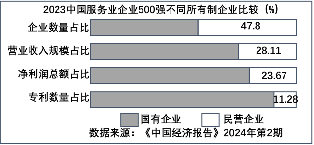

**2024年普通高中学业水平选择性考试·河北卷**

**思想政治**

**本试卷满分100分，考试时间75分钟。**

**一、选择题：本题共16小题，每小题3分，共48分，在每小题给出的A、B、C、D四个选项中，只有一项是符合题目要求的。**

1\. 中华人民共和国的成立，社会主义制度的建立，标志着我国踏上了自主建设现代化的新征途。党的十一届三中全会的召开，标志着中国式现代化道路正式开启。第一个百年奋斗目标的全面完成，标志着中国式现代化新道路经受了实践的检验。75年来，中国共产党带领全国人民一直奔跑在现代化的赛道上，前景无比光明。可见，中国式现代化（ ）

①是中国共产党领导的社会主义现代化 ②是我国自主创造的普遍适用的现代化

③是实现中华民族伟大复兴的光明大道 ④为解决人类共同问题提供了具体答案

A. ①② B. ①③ C. ②④ D. ③④

【答案】B

【解析】

【详解】①③：75年来，中国共产党带领全国人民一直奔跑在现代化的赛道上，前景无比光明。可见，中国式现代化是中国共产党领导的社会主义现代化，是实现中华民族伟大复兴的光明大道，①③正确。

②：中国式现代化是适合中国国情的现代化，可以为其他国家的现代化建设提供借鉴，但不具有普遍适用性，②错误。

④：中国式现代化可以为解决人类共同问题提供中国方案，而不是提供具体答案，④错误。

故本题选B。

2\. 1975年，托马斯·海贝勒作为社会人类学专业博士生第一次到访中国。40多年来，多次访问中国的海贝勒见证了改革开放推动中国发生的巨大变化。他说，“一切都随着1978年改革开放的实施而改变。”中国的巨大变化表明，改革开放（ ）

①为实现我国工业化打下了初步基础 ②是决定当代中国命运的关键抉择

③标志着中国特色社会主义制度的完善 ④极大激发了人民群众的创造活力

A. ①③ B. ①④ C. ②③ D. ②④

【答案】D

【解析】

【详解】①：第一个五年计划的提前完成，为我国的工业化打下了初步基础，①排除。

②④：改革开放推动中国发生的巨大变化，说明改革开放是决定当代中国命运的关键抉择，极大激发了人民群众的创造活力，②④说法正确。

③：中国特色社会主义制度是党和人民在长期实践探索中形成的科学制度体系，是要坚持和不断完善的。改革开放标志中国特色社会主义制度的完善说法错误，③说法错误。

故本题选D。

3\. “飘扬的旗帜引领方向，复兴的民族热血沸腾，巨浪无阻前行的意志，自信的目光傲视风云……”一曲《领航》唱出了中华儿女在中国共产党的领导下勠力同心、勇毅前行的坚定信心。中国特色社会主义进入新时代，中华民族迎来了从站起来，富起来到强起来的伟大飞跃。实现这一飞跃，需要我们（ ）

①坚持习近平新时代中国特色社会主义思想科学指引

②全面借鉴其他社会主义国家的建设经验

③坚定不移地走中国特色社会主义道路

④以实现经济高速增长为根本目标

A. ①② B. ①③ C. ②④ D. ③④

【答案】B

【解析】

【详解】①③：从材料中“飘扬的旗帜引领方向……自信的目光傲视风云……”可以看出，中国特色社会主义进入新时代，中华民族迎来了从站起来，富起来到强起来的伟大飞跃。实现这一飞跃，需要我们继续坚持习近平新时代中国特色社会主义思想科学指引，坚定不移地走中国特色社会主义道路，①③正确。

②：对其他社会主义国家的建设经验要批判借鉴。“全面借鉴其他社会主义国家的建设经验”说法错误，②排除。

④：我国经济已由高速增长阶段转向高质量发展阶段；实现经济高速增长不能作为我国发展的根本目标，④排除。

故本题选B。

4\. 2023中国服务业企业500强榜单发布。其中，国有企业在公路运输、港口服务等行业具有优势，民营企业则主要分布在互联网服务、物流及供应链等行业，两类企业有关指标见下图。

可见，榜单中的国有企业（ ）

①在行业分布上和民营企业存在差异

②数量越多越能发挥国有经济的主导作用

③平均营业收入和平均净利润高于民营企业

④研发费用高于民营企业

A. ①③ B. ①④ C. ②③ D. ②④

【答案】A

【解析】

【详解】①：2023中国服务业企业500强榜单发布。其中，国有企业在公路运输、港口服务等行业具有优势，民营企业则主要分布在互联网服务、物流及供应链等行业。可见，在行业分布国有企业上和民营企业存在差异，①符合题意。

②：国有企业的主导作用主要体现在控制力上，而不是数量上，②错误。

③：从企业营业收入规模占比和净利润占比可以看出，国有企业平均营业收入和平均净利润高于民营企业，③符合题意。

④：国有企业专利数量占比高于民营企业，不等于研发费用高于民营企业，④与题意不符。

故本题选A。

5\. 近期，河北省首笔企业数据资产质押贷款业务落地。作为新型生产要素，数据为培育新质生产力奠定了坚实基础。数据价值评估涉及多个环节，与传统资产（房产、设备等）相比，需要考虑更多复杂因素。材料说明，开展数据资产质押贷款业务（ ）

①提高了银行信贷质量

②有利于释放数据潜能

③有助于提高企业资源利用效率

④表明数据资产和传统资产具有的风险相同

A. ①③ B. ①④ C. ②③ D. ②④

【答案】C

【解析】

【详解】②③：作为新型生产要素，数据为培育新质生产力奠定了坚实基础。开展数据资产质押贷款业务有利于释放数据潜能，有助于提高企业资源利用效率，②③正确。

①：开展数据资产质押贷款业务与提高了银行信贷质量没有必然联系，①排除。

④：表明数据资产和传统资产具有的风险不相同，④错误。

故本题选C。

6\. 河南省开展“五星”党支部创建工作，明确“支部过硬星、产业兴旺星、生态宜居星、平安法治星、文明幸福星”5个方面、29项重点任务，将创成产业兴旺等4颗星作为获评支部过硬星的前提，从而把农村基层党组织建设成为有效实现党的领导、推进乡村全面振兴的坚强战斗堡垒。“五星”党支部创建（ ）

①推动了基层群众自治 ②发挥了党组织的政治引领作用

③夯实了党在基层执政的组织基础 ④凸显了新型政党制度的优越性

A. ①② B. ①④ C. ②③ D. ③④

【答案】C

【解析】

【详解】①：材料强调基层党组织的引领作用，不体现推动了基层群众自治，①与题意不符。

②③：“五星”党支部创建将创成产业兴旺等4颗星作为获评支部过硬星的前提，从而把农村基层党组织建设成为有效实现党的领导、推进乡村全面振兴的坚强战斗堡垒。这夯实了党在基层执政的组织基础，发挥了党组织的政治引领作用，②③符合题意。

④：材料不涉及新型政党制度的优越性，④与题意不符。

故本题选C。

7\. “选民连心人”是昆明市晋宁区人大代表联络机制的创新，即人大代表根据履职需要，在所属选区选择适当数量的选民作为“选民连心人”来协助了解民意、倾听民声、汇集民智。2023年，“选民连心人”收集民意344件，大批老百姓关心的事陆续得到解决。“选民连心人”机制有利于（ ）

①丰富人民民主实现形式 ②拓宽人民政治参与渠道

③延展人大代表履职范围 ④增加人民民主权利内容

A ①② B. ①④ C. ②③ D. ③④

【答案】A

【解析】

【详解】①②：“选民连心人”是人大代表联络机制的创新，这一机制有利于丰富人民民主实现形式，拓宽人民政治参与渠道，①②符合题意。

③：人大代表的履职范围是法定的，不能随意延展，③说法错误。

④：人民民主权利是法定的，不能随意增加，④说法错误。

故本题选A。

8\. 2024年1月1日，我国第一部专门性的未成年人网络保护综合立法《未成年人网络保护条例》正式实施。该条例在《中华人民共和国网络安全法》《儿童个人信息网络保护规定》《中华人民共和国未成年人保护法》基础上，完善了适应未成年人身心健康发展和网络空间治理规律特点的法规制度。由此可知，该条例的制定（ ）

①充分满足了未成年人的诉求

②遵循了法律体系的内在逻辑

③标志着我国未成年人保护法律体系的完备

④汲取了我国关于未成年人立法的实践经验

A. ①② B. ①③ C. ②④ D. ③④

【答案】C

【解析】

【详解】 ①：《未成年人网络保护条例》的制定充分满足了未成年人的合理诉求，而不是所有诉求，①错误。

②④：该条例在《中华人民共和国网络安全法》 《儿童个人信息网络保护规定》《中华 人民共和国未成年人保护法》基础上，完善了适应未成年人身心健康发展和网络空间治理规律特点的法规制度。由此可知，该条例的制定遵循了法律体系的内在逻辑，汲取了我国关于未成年人立法的实践经验，②④正确。

③：该条例的制定标志着我国未成年人保护法律体系的进一步完善， 而不是完备，③错误。

故本题选C。

9\. 我国拥有全球最大的野生稻种质资源圃。科研人员在圃中能完成野生稻种质资源的收集、保存、保护和后期利用。近几十年来，我国水稻育种技术不断进步，来自野生稻的基因功不可没。人们对野生稻的探寻永不止步，水稻进化、种业振兴、粮食丰收的故事也将继续上演。这表明（ ）

①人对自然认识和改造永无止境

②揭示事物发展规律是科学研究的最终目的

③正确认识规律就能解决社会面临的难题

④成功的实践必须坚持主观能动性与客观规律性的统一

A. ①③ B. ①④ C. ②③ D. ②④

【答案】B

【解析】

【详解】①：人们对野生稻的探寻永不止步，水稻育种技术不断进步，体现了人对自然的认识和改造永无止境，①正确。

②：实践是认识的目的。科学研究的最终目的是为了推动实践的发展，造福人类，②错误。

③：正确认识规律是解决问题的必要条件，但不是充分条件，③错误。

④：在水稻育种的过程中，科研人员发挥主观能动性，同时遵循水稻生长的客观规律，才取得了成果，这表明成功的实践需要将主观能动性和客观规律性相结合，④正确。

故本题选B。

10\. 宣化城市传统葡萄园系统是全球首个以“城市农业文化遗产”命名的传统农业系统。该系统以传统漏斗架种植方式将葡萄栽培于庭院中，葡萄架周围种植蔬菜、花卉等，与民居浑然一体、相得益彰，呈现出生物多样性和多层次的立体人文景观特征。相较其他农业文化遗产，它既有经济与生态价值统一的共性，又有依托城市庭院发展农业经济的特色。材料表现出人们（ ）

①根据自身需要建立事物的客观联系

②坚持了矛盾的普遍性与特殊性的辩证统一

③坚持了客观与主观的具体的历史的统一

④运用系统优化方法实现整体最优目标

A. ①③ B. ①④ C. ②③ D. ②④

【答案】D

【解析】

【详解】①：事物的联系具有客观性，人们只能根据事物自身固有的属性建立新的具体联系，不能根据自身需要建立事物的客观联系，①错误。

②：相较其他农业文化遗产，它既有经济与生态价值统一的共性，又有依托城市庭院发展农业经济的特色。体现了人们坚持矛盾的普遍性与特殊性的辩证统一，②符合题意。

③：客观决定主观，要坚持主观与客观的具体的历史的统一，而不能坚持客观与主观的具体的历史的统一，③错误。

④：该系统以传统漏斗架种植方式将葡萄栽培于庭院中，葡萄架周围种植蔬菜、花卉等，与民居浑然一体、相得益彰，呈现出生物多样性和多层次的立体人文景观特征，体现了运用系统优化方法实现整体最优目标，④正确。

故本题选D。

11\. 儿童是人类的未来，但大量儿童特别是发展中国家儿童依然面临饥饿、教育、卫生等方面的长期挑战。2023年，“中非携手暖童心”关爱非洲孤儿健康活动在非洲多国举行，中国使馆和驻有关国家医疗队赴当地孤儿院或相关机构开展健康体检义诊、捐赠爱心包等活动，传递中国温暖。由此可见（ ）

①非洲是当今世界发展中国家最集中的大洲

②中国秉持真实亲诚理念加强中非团结

③中国以自身发展为非洲发展提供机遇

④中国以实际行动增进非洲儿童健康福祉

A. ①③ B. ①④ C. ②③ D. ②④

【答案】D

【解析】

【详解】①③：材料强调中国赴非洲孤儿院或相关机构开展健康体检义诊、捐赠爱心包等活动，不涉及非洲是当今世界发展中国家最集中的大洲，也不涉及中国以自身发展为非洲发展提供机遇，①③排除。

②④：中国使馆和驻有关国家医疗队赴当地孤儿院或相关机构开展健康体检义诊、捐赠爱心包等活动，传递中国温暖。表明中国以实际行动增进非洲儿童健康福祉，秉持真实亲诚理念加强中非团结，②④符合题意。

故本题选D。

12\. 中美关系的故事由人民书写，中美关系的未来由人民创造。2023年11月，国家主席习近平在美国友好团体联合欢迎宴会上强调。“越是困难的时候，越需要拉紧人民的纽带、增进人心的沟通，越需要更多的人站出来为中美关系鼓与呼。我们要为人民之间的交往搭建更多桥梁、铺设更多道路，而不是设置各种障碍、制造‘寒蝉效应’。”下列做法符合材料主旨的是（ ）

①中国实施邀请5万名美国青少年访华交流计划

②中美同意在平等和尊重基础上恢复两军高层沟通

③美国边境执法人员无端滋扰盘查中国留学生

④中美建立284对友好省州和友好城市关系

A. ①② B. ①④ C. ②③ D. ③④

【答案】B

【解析】

【详解】①④：材料强调我们要为人民之间的交往搭建更多桥梁、铺设更多道路，中国实施邀请5万名美国青少年访华交流计划，中美建立284对友好省州和友好城市关系，符合为人民搭建交往的桥梁，①④符合题意。

②：材料强调为中美两国人民搭建交往的桥梁，两军高层沟通不符合为人民搭建桥梁，②不符合题意。

③：美国边境执法人员无端滋扰盘查中国留学生，这不利于两国友好，③不符合题意。

故本题选B。

【点睛】

13\. 近年来，一些社会机构在暑期提供形式多样的研学项目，而名不副实的情形也时有出现。针对这些情形，以下说法正确的是（ ）

①机构甲将承诺的“名校参观”按自改为“校门口合影留念”构成违约

②机构乙谎称和某科技馆联合举办研学活动构成荣誉侵权

③机构丙未经允许使用与某研学机构注册商标近似标识不会构成商标侵权

④家长应要妥善保管研学宣传资料，付款凭证等证据以便产生纠纷时维权

A. ①② B. ①④ C. ②③ D. ③④

【答案】B

【解析】

【详解】①：《民法典》第五百零九条当事人应当按照约定全面履行自己的义务。除法律另有规定或者当事人另有约定外，合同的一方当事人不能单方面变更或者解除合同，否则须承担违约责任。因此机构甲将承诺的“名校参观”按自改为“校门口合影留念”，没有按照约定履行自己的义务，单方面变更合同，构成违约，①说法正确。

②：《民法典》第一千零三十一条民事主体享有荣誉权。任何组织或者个人不得非法剥夺他人的荣誉称号，不得诋毁、贬损他人的荣誉。机构乙谎称和某科技馆联合举办研学活动，机构乙属于虚假宣传，没有侵犯荣誉权，②说法错误。

③：《商标法》第五十七条规定属于侵犯注册商标专用权是，未经商标注册人的许可，在同一种商品上使用与其注册商标相同的商标的；未经商标注册人的许可，在同一种商品上使用与其注册商标近似的商标，或者在类似商品上使用与其注册商标相同或者近似的商标，容易导致混淆的。因此机构丙未经允许使用与某研学机构注册商标近似标识，构成商标侵权，③说法错误。

④：证据是诉讼过程中用来证明案件事实的根据。当事人对案件发生争议时，诉讼证据变得至关重要。因此家长应要妥善保管研学宣传资料，付款凭证等证据以便产生纠纷时维权，④说法正确。

故本题选B。

【点睛】

14\. Z公司搜索到了李某公开留存在互联网上的电话信息，一个月内用不同座机多次拨打电话推广业务，在李某多次明确拒绝并要求停止后，仍进行业务推广。李某认为Z公司的行为严重影响了自己的正常工作和生活，Z公司否认侵权，因而引发纠纷。于此，以下说法正确的是（ ）

①Z公司侵犯了李某的生活安宁权益

②电话信息已被李某公开，不是李某的隐私

③若李某与Z公司达成和解协议，和解协议具有强制执行力

④若Z公司主张自己因无侵权故意而不承担责任，可以得到法院的支持

A. ①② B. ①③ C. ②④ D. ③④

【答案】A

【解析】

【详解】①：法律保护个人隐私权。隐私是自然人的私人生活安宁和不愿为他人知晓的私密空间、私密活动、私密信息。Z公司多次拨打电话推广业务，在李某多次明确拒绝并要求停止后仍进行业务推广，侵犯了李某的生活安宁权益，故①正确。

②：电话信息是李某公开留存在互联网上的，不再属于其个人隐私，故②正确。

③：若李某与Z公司达成的调解协议，并经人民法院确认，该调解协议具有强制执行力，故③错误。

④：过错包括故意和过失，没有故意并不是免除责任的理由，Z公司的主张不能得到法院支持，故④错误。

故本题选A。

15\. 小李打110报警电话，坚称要订外卖，并否认打错电话，值班民警推断对方可能处于困境，行动不自由，是借“订外卖”来求救。民警假扮外卖员与小李对话，获知其地址后，警方迅速出警，小李成功获救。对此，由下列判断组成的正确推理是（ ）

①小李打110报警电话订外卖 ②小李打错电话

③小李假借订外卖向民警求救 ④小李受人胁迫

A. 如果①，那么④

B. 如果①，那么④

C. 或者②，或者③

D. 要么②，要么③

【答案】D

【解析】

【详解】A：该选项为充分条件假言推理，而充分条件假言判断所断定的前件和后件的关系是：前件真，后件就一定真，后件假，前件就一定假。依据其逻辑性质进行推理时，如果肯定了假言判断的前件，结论就可以肯定其后件；如果否定了假言判断的后件，结论就可以否定其前件。因此，由肯定假言判断的后件而在结论中肯定其前件，即通过肯定④而肯定①，是错误的推理结构，A排除。

B：该选项为充分条件假言推理，依据其逻辑性质进行推理时，如果肯定了假言判断的前件，结论就可以肯定其后件；如果否定了假言判断的后件，结论就可以否定其前件。因此，由否定假言推判断的前件而在结论中否定其后件，即通过否定①而否定④，是错误的推理结构，B排除。

C：该选项为相容的选言推理，但②小李打错电话和③小李假借订外卖向民警求救属于不相容的选言支，C排除。

D：该选项为不相容的选言推理，根据题意可知，②小李打错电话和③小李假借订外卖向民警求救属于不相容的选言支，二者只能存在其一，符合题意，D正确。

故本题选D。

16\. “孔”在生活中被广泛应用：球鞋两边的通风孔，有利于散热；在防盗门的小孔里装“猫眼”，便于观察门外情况。包含和上述材料相同思维方式的是（ ）

①将计时、通话、定位等功能于一身的智能手表

②从三角形想到三角尺、三角旗和金字塔等

③提供住宿、餐饮、采摘等多项服务的乡村特色民宿

④玻璃杯破损的原因：可能被某种东西敲碎，可能被杯中的水结成的冰胀裂

A. ①② B. ①③ C. ②④ D. ③④

【答案】C

【解析】

【详解】“孔”在生活中被广泛应用：球鞋两边的通风孔，有利于散热；在防盗门的小孔里装“猫眼”，便于观察门外情况，体现了发散思维。

①③：聚合思维是利用已有的知识和经验，把众多信息逐步引导条理化的逻辑思路中，以便得出合乎逻辑的解决问题的方案。聚合思维有一个明确的目标，一切思维活动都要围绕这个轴心来进行。将计时、通话、定位等功能于一身的智能手表，提供住宿、餐饮、采摘等多项服务的乡村特色民宿，围绕智能手表和乡村特色民宿这个目标，体现了聚合思维，①③不符合题意。

②④：发散思维是根据已知的事物信息，从不同角度、不同方向思考，以寻求解决问题的多样性答案的思维方式。从三角形想到三角尺、三角旗和金字塔等，玻璃杯破损的原因：可能被某种东西敲碎，可能被杯中的水结成的冰胀裂，体现了发散思维，②④符合题意。

故本题选C。

【点睛】

**二、非选择题：本题共4小题，共52分。**

17\. 阅读材料，完成下列要求。

2023年5月，习近平总书记主持召开深入推进京津冀协同发展座谈会时强调：“要推进医联体建设，推动京津养老项目向河北具备条件的地区延伸布局。”

河北深入学习贯彻习近平总书记重要指示精神，因地制宜，在对接和服务京津中加快发展康养产业。保定市盘活利用农村闲置宅基地、住宅，打造京津冀首选颐养幸福城市；承德市发挥温泉富集、生态环境美等优势，承接京津养老服务需求；秦皇岛市依托北戴河生命健康产业创新示范区建设，打造中国康养名城……

河北日益改善的生态环境和持续提升的医疗服务水平对京津人群的吸引力越来越强。

结合材料，运用“我国的经济发展”知识，分析河北省是如何通过发展康养产业更好满足人民美好生活需要的。

【答案】

贯彻新发展理念。坚持以人民为中心的发展思想，增进民生福祉，在病有所医、老有所养上持续用力。坚持创新发展、协调发展、绿色发展、共享发展，创新产品供给，深入推进京津冀协同发展，不断改善生态环境，推进康养资源共享，提高京津冀人民获得感、幸福感。

推动高质量发展。对接京津，把实施扩大内需战略同深化供给侧结构性改革有机结合，加快构建新发展格局，以优质供给满足多样化养老需求。盘活闲置资源，提高资源利用效率，通过产业振兴推进乡村振兴。

【解析】

【分析】背景素材：京津冀协同发展座谈会

考点考查：“我国的经济发展”知识

能力考查：调动和运用知识、描述和阐释事物、论证和探究问题  

核心素养：政治认同、科学精神

【详解】第一步：审设问。明确主体、知识范围、问题限定和作答角度。本题属于措施类，设问要求分析河北省是如何通过发展康养产业更好满足人民美好生活需要的。需要调用贯彻新发展理念、推动经济高质量发展的有关知识，结合材料做法，从措施角度分析作答。

第二步：审材料。提取关键词，链接教材知识。

关键词①：要推进医联体建设，推动京津养老项目向河北具备条件的地区延伸布局；在对接和服务京津中加快发展康养产业→可联系贯彻协调发展理念。

关键词②：加快发展康养产业。保定市盘活利用农村闲置宅基地、住宅，打造京津冀首选颐养幸福城市→可联系深化供给侧结构性改革，盘活闲置资源，提高资源利用效率，通过产业振兴推进乡村振兴。

关键词③：承德市发挥温泉富集、生态环境美等优势，承接京津养老服务需求→可联系贯彻绿色发展理念。

关键词④：秦皇岛市依托北戴河生命健康产业创新示范区建设，打造中国康养名城→可联系贯彻创新发展理念。

关键词⑤：河北日益改善的生态环境和持续提升的医疗服务水平对京津人群的吸引力越来越强→可联系贯彻共享发展理念，坚持以人民为中心的发展思想。

第三步：整合信息，组织答案。注意设问限定以及教材知识与材料、时政信息等相结合。

18\. 阅读材料，完成下列要求。

青岛市市北区政协委员张为民撰写的“启运港退税政策”信息，通过社情民意信息“直通车”上报仅一周，就得到市政协关注并被上报全国政协。一周后，信息被全国政协采用并报党中央做决策参考，两个月后，张为民接到了国家税务总局到青岛专题调研的通知，不到两年，“将内陆港纳入启运港退税政策实施范围”和“青岛作为离境港享受启运港退税政策”先后落地，该社情民意信息的落实力度如此之大，是建立在青岛市政协反映社情民意信息工作完善的信息筛选、督办、联动机制之上的，反映了协商议政过程的不断优化。

人民政协成立75年来，在党的领导下走过了辉煌历程，为党和国家事业发展作出了积极贡献。

结合材料，运用政治与法治知识，分析人民政协是如何服务党和国家事业发展的。

【答案】

①坚持中国共产党的政治领导，自觉在思想上政治上行动上同党中央保持高度一致，坚持民主集中制，重点监督党和国家重大方针政策和重要决策部署的贯彻落实。

②人民政协积极履行政治协商、民主监督、参政议政的职能，坚持全过程人民民主，完善协商议政内容和形式，畅通民意反映渠道，使决策能够更好地反映民意、集中民智，助力科学民主决策，从而服务国家经济、社会等各项事业的发展。

③发挥人民政协作为专门协商机构作用，围绕团结和民主两大主题，聚焦党和国家中心任务，为党和国家事业的发展建言献策、凝心聚力，推进国家治理体系和治理能力现代化。

【解析】

【分析】背景素材：政协委员张为民为党和国家建言献策 

考点考查：坚持和加强党的全面领导、我国的基本政治制度

能力考查：描述和阐释事物、论证和探究问题

核心素养：政治认同、科学精神、公共参与

【详解】第一步：审设问。明确主体、作答范围、问题限定和作答角度。

本题为材料分析类主观题，主体是人民政协，要求运用政治与法治知识，从党的领导、政协的职能等角度来分析作答。

第二步：审材料，通过标点符号、段落等，提取材料有效信息。

有效信息①：信息被全国政协采用并报党中央做决策参考→可联系要在党的领导下，监督国家大政方针的落实并建言献策。

有效信息②：该信息得到市政协关注并被上报全国政协，后又报党中央做决策参考→可联系人民政协积极履行政治协商、民主监督、参政议政的职能，助力科学民主决策，服务党和国家事业发展。

有效信息③：该信息通过社情民意信息“直通车”上报，最后落实→可联系人民政协是专门的协商机构，要畅通和利用民意反映渠道，为党和国家事业的发展建言献策。

第三步：整合信息，组织答案。注意设问限定以及教材知识与材料、时政信息等相结合。

19\. 阅读材料，完成下列要求。

公司职员丁某在工作时间帮家人转发了几条代购信息。之后，有人举报丁某违反了劳动合同中关于“工作时间内不得兼职从事公司安排工作以外的任何其他工作”的约定。公司收到举报后进行了调查，未能查实丁某在工作时间参与相关物品买卖合同的订立、履行等代购行为。公司找丁某核实情况时承诺：若丁某承认代购行为，就对其从轻处罚，只扣除部分绩效工资。基于公司的承诺，丁某承认了代购行为并提交了检讨书，随后，公司以检讨书为证据，认定丁某违约，单方解除了劳动合同。

（1）结合材料，运用法律与生活知识，分别评析丁某转发代购信息和公司以检讨书为证据解除劳动合同的行为。

（2）赠与合同和材料中提及的买卖合同，与我们的日常生活息息相关。运用逻辑与思维知识，分析“赠与合同”“买卖合同”两个概念外延的关系。

【答案】（1）

①丁某在工作时间从事与工作无关的私事，违反劳动纪律，没有全面履行与公司签订的劳动合同。

②公司诱使丁某写检讨书承认其存在违反劳动合同的行为，但承诺从轻处罚，却最终单方解除了劳动合同，这违反了民法的诚实信用原则，属于违法解除劳动合同，应承担违约责任。

（2）

反对关系。

反对关系是指两个具有全异关系的概念包含在一个属概念中，并且它们的外延之和小于该属概念的外延。“赠与合同”和“买卖合同”都包含在“合同”这个属概念中，并且二者的外延之和小于该属概念的外延，所以是反对关系。

【解析】

【分析】背景素材：合同纠纷案例    

考点考查：做个明白的劳动者、概念的基本特征

能力考查：描述和阐释事物、论证和探究问题

核心素养：政治认同、科学精神、法治意识

【小问1详解】

第一步：审设问。明确主体、作答范围、问题限定和作答角度。本题为材料分析类主观题，要求分别评析丁某转发代购信息和公司以检讨书为证据解除劳动合同的行为。主体是员工丁某和公司，要求运用法律与生活知识，从劳动者的义务、合同的解除角度来分析作答。

第二步：审材料，通过标点符号、段落等，提取材料有效信息。

有效信息①：公司职员丁某在工作时间帮家人转发了几条代购信息→可联系丁某的行为的确违反了劳动纪律和全面履行劳动合同的原则。

有效信息②：公司承诺：若丁某承认代购行为，就对其从轻处罚，但随后，公司以检讨书为证据，认定丁某违约，单方解除了劳动合同→可联系公司言而无信，违背了诚实信用的原则，合同的一方当事人不得单方面解除劳动合同，否则承担违约责任。

第三步：整合信息，组织答案。注意设问限定以及教材知识与材料、时政信息等相结合。

【小问2详解】

第一步：审设问。明确主体、作答范围、问题限定和作答角度。本题为材料分析类主观题，要求分析“赠与合同”“买卖合同”两个概念外延的关系，需要运用逻辑与思维知识，从概念外延的关系角度来分析作答。

第二步：审材料，通过标点符号、段落等，提取材料有效信息。

有效信息：赠与合同和买卖合同的外延关系→可联系“合同”这个属概念中包含了“赠与合同”和“买卖合同”，并且该属概念的外延大于二者的外延之和，所以是反对关系。

第三步：整合信息，组织答案。注意设问限定以及教材知识与材料、时政信息等相结合。

20\. 阅读材料，完成下列要求。

2023年6月，习近平总书记出席文化传承发展座谈会时指出：“马克思主义和中华优秀传统文化来源不同，但彼此存在高度的契合性。”天下为公、天下大同的社会理想，富民厚生、义利兼顾的经济伦理，天人合一、万物并育的生态理念，讲信修睦、亲仁善邻的交往之道等，都是中华优秀传统文化的重要元素，马克思主义传入中国后，开始了与中华优秀传统文化有机结合并互相成就的历程。

（1）运用价值观的知识，说明马克思主义同中华优秀传统文化相互契合的原因。

（2）从材料中任选中华优秀传统文化的两个重要元素，分别说明其对解决当代人类面临的全球性难题的启示。要求：准确运用学科知识，观点明确。

【答案】（1）二者在价值判断和价值选择上具有一致性。都自觉遵循了社会发展客观规律； 都把人民群众的利益作为重要的价值标准。

二者在社会作用和功能上具有一致性。都能为人们认识世界和改造世界提供正确指导；都有助于塑造民族精神和时代精神，培养人们的理想信念，凝心聚力。

（2）答案示例：义利兼顾的经济伦理——在国际贸易中，各国不应只考虑自身利益，而应兼顾合作伙伴的利益。在贸易谈判中，秉持义利兼顾的原则，避免贸易保护主义，通过合理的贸易规则和合作机制，实现互利共赢。

讲信修睦、亲仁善邻的交往之道——在国际政治舞台上，信任缺失、冲突不断是全球性难题之一。“讲信修睦、亲仁善邻”的交往之道启示各国应该建立相互信任、和平友好的国际关系。国家之间要遵守国际条约和承诺，通过对话和协商解决争端。

【解析】

【分析】背景素材：马克思主义同中华优秀传统文化相互契合

考点考查：价值观的导向作用、正确的价值判断和价值选择的标准、中华优秀传统文化、国际关系民主化、经济全球化等相关知识

能力考查：描述和阐释事物、论证和探究问题

核心素养：政治认同、科学精神

【小问1详解】

第一步：审设问，明确主体、作答范围、问题限定和作答角度

本题要求运用价值观的知识，说明马克思主义同中华优秀传统文化相互契合的原因。属于原因类主观题，知识限定明确，考生可根据材料内容和设问要求调动教材知识加以分析说明。

第二步：审材料，通过标点符号、段落等，提取材料有效信息。

关键词：马克思主义和中华优秀传统文化来源不同，但彼此存在高度的契合性→可从正确价值观的作用角度，说明二者在社会作用和功能上具有一致性；从正确的价值判断和价值选择的标准角度，说明二者在价值判断和价值选择上具有一致性。

第三步：整合信息，组织答案。

解答本题，考生可根据设问要求，运用相关知识，结合材料加以分析说明。

【小问2详解】

第一步：审设问，明确主体、作答范围、问题限定和作答角度。

本题要求从材料中任选中华优秀传统文化的两个重要元素，分别说明其对解决当代人类面临的全球性难题的启示。要求准确运用学科知识，观点明确。属于开放类主观题，知识没有具体限定，考生可按照题意要求，首先选择中华优秀传统文化的两个重要元素，然后围绕解决当代人类面临的全球性难题说明带给我们的启示。

第二步：审材料，通过标点符号、段落等，提取材料有效信息。

关键词①：富民厚生、义利兼顾的经济伦理→可围绕逆全球化、国际贸易中贸易保护主义等全球性难题，说明启示各国不应只考虑自身利益，而应兼顾合作伙伴的利益。在贸易谈判中应秉持义利兼顾的原则，通过合理的贸易规则和合作机制，实现互利共赢。

关键词②：讲信修睦、亲仁善邻的交往之道→可围绕国际政治舞台信任缺失、冲突不断是全球性难题，说明启示各国应该建立相互信任、和平友好的国际关系，遵守国际条约和承诺，通过对话和协商解决争端。

第三步：整合信息，组织答案。

解答本题，考生可根据设问要求，运用所学相关知识，结合材料加以分析说明。
