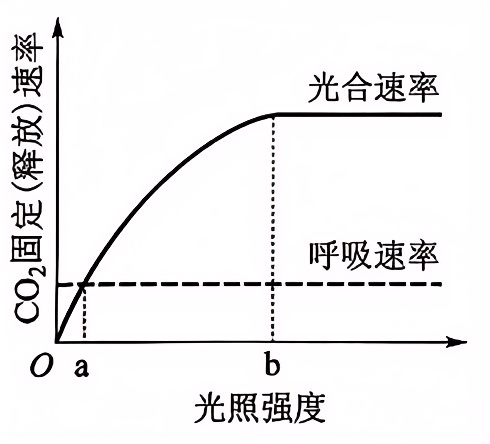
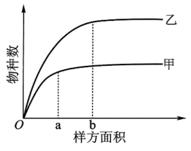
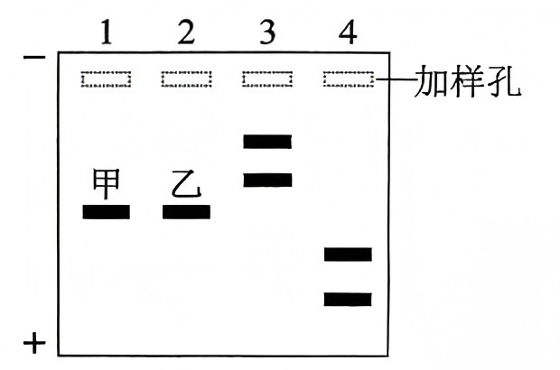

**绝密★启用前**

**2025年普通高等学校招生全国统一考试**

**生物部分**

**注意事项：**

**1．答卷前，考生务必将自己的姓名、准考证号填写在答题卡上。**

**2．回答选择题时，选出每小题答案后，用铅笔把答题卡上对应题目的答案标号涂黑。如需改动，用橡皮擦干净后，再选涂其他答案标号。回答非选择题时，将答案写在答题卡上。写在本试卷上无效。**

**3．考试结束后，将本试卷和答题卡一并交回。**

**一、选择题：每小题6分。在每小题给出的四个选项中，只有一项符合题目要求。**

1\. 蛋白质是结构和功能多样的生物大分子。下列叙述错误的是（ ）

A. 二硫键的断裂不会改变蛋白质的空间结构

B. 改变蛋白质的空间结构可能会影响其功能

C. 用乙醇等有机溶剂处理可使蛋白质发生变性

D. 利用蛋白质工程可获得氨基酸序列改变的蛋白质

2\. 在一定温度下，生长在大田的某种植物光合速率（CO2固定速率）和呼吸速率（CO2释放速率）对光照强度的响应曲线如图所示。下列叙述错误的是（ ）

A. 光照强度为a时，该植物的干重不会增加

B. 光照强度从a逐渐增加到b时，该植物生长速率逐渐增大

C. 光照强度小于b时，提高大田CO2浓度，CO2固定速率会增大

D. 光照强度为b时，适当降低光反应速率，CO2固定速率会降低

3\. 为研究肾上腺的生理机能，某研究小组将小鼠按照下表进行处理，一定时间后检测相关指标。

|     |             |
|:--- |:----------- |
| 分组  | 实验处理        |
| 甲   | 不摘除肾上腺      |
| 乙   | 摘除肾上腺       |
| 丙   | 摘除肾上腺，注射醛固酮 |

下列叙述错误的是（ ）

A. 乙组小鼠的促肾上腺皮质激素水平会升高

B. 乙组小鼠饮生理盐水有利于改善水盐平衡

C. 三组小鼠均饮清水时，丙组小鼠血钠含量最低

D. 甲组小鼠受寒冷刺激时，肾上腺素释放量增加

4\. 某同学在甲、乙两个植物群落中设置样方调查其特征，样方中植物的物种数随样方面积扩大而逐渐增加，但样方面积扩大到一定程度后物种数的变化明显趋缓（如图所示），此时对应的样方面积（a和b）通常称为最小面积。下列叙述错误的是（ ）

A. 最小面积样方中应包含群落中绝大多数的物种

B. 与甲相比，乙群落的物种丰富度较高，调查时最小面积更大

C. 调查甲群落的物种丰富度时，设置的样方面积应不小于a

D. 调查乙群落中植物的种群密度时，针对每种植物设置的样方面积应不小于b

5\. 为获得作物新品种，可采用不同的育种技术。下列叙述错误的是（ ）

A. 三倍体西瓜育种时，利用了人工诱导染色体加倍获得的多倍体

B. 作物单倍体育种时，利用了由植物茎尖组织培养获得的单倍体

C. 航天育种时，利用了太空多种因素导致基因突变产生的突变体

D. 水稻杂交育种时，利用了水稻有性繁殖过程中产生的重组个体

6\. 琼脂糖凝胶电泳常用于核酸样品的分析，样品1～4的电泳结果如图所示（“+”“-”分别代表电泳槽的阳极和阴极）。已知样品1和2中的DNA分子分别是甲和乙，甲只有限制酶R的一个酶切位点，样品3和4中有一个样品是甲的酶切产物。下列叙述错误的是（ ）

A. 配制琼脂糖凝胶时需选用适当的缓冲溶液

B. 该实验条件下甲、乙两种DNA分子均带负电荷

C. 甲、乙两种DNA分子所含碱基对的数量可能不同

D. 据图推测样品3可能是甲被酶R完全酶切后的产物

**三、非选择题。**

7\. 将某植物叶肉细胞放入一定浓度的KCl溶液中，起初细胞失水发生质壁分离，一定时间（t）后细胞开始吸水，并逐渐复原。回答下列问题：

（1）植物细胞与外界溶液进行水分交换时，水分子跨膜运输的两种方式是\_\_\_\_\_\_\_\_。

（2）细胞失水发生质壁分离，原生质层与细胞壁分离的原因是\_\_\_\_\_\_\_\_。

（3）一定时间（t）后细胞开始吸水的原因是\_\_\_\_\_\_\_\_。

8\. 有研究显示，机体内蛋白P表达量降低会引起免疫失调。已知酶E可催化蛋白P基因的启动子甲基化，酶E被磷酸化后失活。研究人员用酶E（或磷酸化的酶E）、含蛋白P基因及其启动子的表达质粒等进行实验，结果如图所示。回答下列问题：

（1）免疫失调包括过敏反应和\_\_\_\_\_\_\_\_（答出2点即可）等

（2）根据实验结果判断，蛋白P基因的启动子甲基化\_\_\_\_\_\_\_\_（填“促进”“抑制”或“不影响”）蛋白P的表达，判断依据是\_\_\_\_\_\_\_\_。

（3）为治疗因蛋白P表达量降低起的免疫失调，可使用抑制\_\_\_\_\_\_\_\_（填“酶E”“磷酸化的酶E”或“蛋白P”）活性的药物。免疫失调也可以通过调节抗体的生成进行治疗，机体产生抗体过程中记忆B细胞的作用是\_\_\_\_\_\_\_\_。

9\. 在“绿水青山就是金山银山”理念的感召下，同学们积极讨论某退化荒山的生态恢复方案。A同学提出选择一种树种进行全覆盖造林；B同学提出应该种植多种草本和木本植物。回答下列问题：

（1）在生态恢复过程中，退化荒山会发生群落演替。通常，群落演替的类型有初生演替和次生演替，二者的区别有\_\_\_\_\_\_\_\_（答出2点即可）。

（2）与A同学的方案相比，B同学的方案可能有利于控制害虫的爆发，从种间关系的角度分析其原因是\_\_\_\_\_\_\_\_。

（3）为合理利用环境资源，从群落空间结构的角度考虑，设计荒山绿化方案时应遵循的原则是\_\_\_\_\_\_\_\_（答出2点即可）。

（4）为维护恢复后生态系统的稳定性，需要采取的措施有\_\_\_\_\_\_\_\_（答出2点即可）。

10\. 植物合成的色素会影响花色。某二倍体植物的花色有深红、浅红和白三种表型。研究小组用甲、乙两个浅红色表型的植株进行相关实验。回答下列问题：

（1）甲、乙分别自交，子一代均出现浅红色：白色=3：1的表型分离比；甲和乙杂交，子一代出现深红色（丙）：浅红色：白色（丁）=1：2：1的表型分离比。综上判断，甲和乙的基因型\_\_\_\_\_\_\_\_（填“相同”或“不同”），判断依据是\_\_\_\_\_\_\_\_。

（2）丙自交子一代出现深红色：浅红色：白色=9：6：1的表型分离比，其中与丙基因型相同的个体所占比例为\_\_\_\_\_\_\_\_。若丙与丁杂交，子一代的表型及分离比为\_\_\_\_\_\_\_\_，其中纯合体所占比例为\_\_\_\_\_\_\_\_。

11\. 为在大肠杆菌中表达酶X，某同学将编码酶X的基因（目的基因）插入质粒P0，构建重组质粒Px，并转入大肠杆菌。该同学设计引物用PCR方法验证重组质粒构建成功（引物1~4结合位置如图所示，→表示引物5＇→3＇方向）。回答下列问题：

（1）PCR是根据DNA复制原理在体外扩增DNA的技术。在细胞中DNA复制时解开双链的酶是\_\_\_\_\_\_\_\_，而PCR过程中解开双链的方法是\_\_\_\_\_\_\_\_。

（2）PCR过程中，因参与合成反应、不断消耗而浓度下降的组分有\_\_\_\_\_\_\_\_。

（3）该同学进行PCR实验时，所用模板与引物见下表。实验中①和④的作用是：\_\_\_\_\_\_\_\_；②无扩增产物，原因是\_\_\_\_\_\_\_\_；③、⑤和⑥有扩增产物，扩增出的DNA产物分别是\_\_\_\_\_\_\_\_。

<table style="width:64%;">
<colgroup>
<col style="width: 10%" />
<col style="width: 8%" />
<col style="width: 8%" />
<col style="width: 8%" />
<col style="width: 8%" />
<col style="width: 8%" />
<col style="width: 8%" />
</colgroup>
<tbody>
<tr>
<td style="text-align: left;">管号</td>
<td style="text-align: left;">①</td>
<td style="text-align: left;">②</td>
<td style="text-align: left;">③</td>
<td style="text-align: left;">④</td>
<td style="text-align: left;">⑤</td>
<td style="text-align: left;">⑥</td>
</tr>
<tr>
<td style="text-align: left;">模板</td>
<td style="text-align: left;">无</td>
<td style="text-align: left;">P0</td>
<td style="text-align: left;">Px</td>
<td style="text-align: left;">无</td>
<td style="text-align: left;">P0</td>
<td style="text-align: left;">Px</td>
</tr>
<tr>
<td style="text-align: left;">引物对</td>
<td colspan="3" style="text-align: left;">引物1和引物2</td>
<td colspan="3" style="text-align: left;">引物3和引物4</td>
</tr>
</tbody>
</table>

（4）设计实验验证大肠杆菌表达的酶X有活性，简要写出实验思路和预期结果\_\_\_\_\_\_\_\_。
